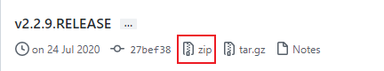

第二部分 SpringBoot源码剖析

# 1 SpringBoot源码环境构建

参考：https://blog.csdn.net/chuanchengdabing/article/details/115871178?spm=1001.2014.3001.5501

## 1.1 下载源码

下载地址：https://github.com/spring-projects/spring-boot/releases

采用 spring-boot-2.2.9.RELEASE 



## 1.2 环境准备

1. JDK 1.8 +
2. Maven 3.5 +


注意：源码不要放在中文目录下，最好使用11版本的JDK（JDK1.8一直没有成功）

## 1.3 编译源码

进入 spring-boot 源码根目录

执行 mvn 命令：

```bash
# 跳过测试用例，会下载大量jar包，时间会长一些
mvn clean install -DskipTests -Pfast
```


## 1.4 导入IDEA

将编译后的项目导入 IDEA 中


依赖加载完毕后，此时 pom 配置文件中存在错误引用，打开 pom.xml ，关闭 maven 代码检查，pom 报错消失。


在pom.xml中可能会出现 **java.lang.outofmemoryerror gc overhead limit exceeded** 的报错，修改 idea maven 的 import 的 vm 参数。


## 1.5 新建一个module


**注意**：**修改新创建的子项目的父工程为当前构建的Springboot的版本**


## 1.6 新建一个Controller

```java
package com.turbo.contorller;

import org.springframework.web.bind.annotation.RequestMapping;
import org.springframework.web.bind.annotation.RestController;

@RestController
public class TestController {

	@RequestMapping("/test")
	public String test(){
		System.out.println("源码环境构建完成，congratulations");
		return "源码环境构建完成，congratulations";
	}
}
```

启动测试


# 2 源码剖析-依赖管理

> **问题1**：为什么导入dependency时，不需要指定版本？

在Spring Boot 入门程序中，项目 pom.xml 文件有两个核心依赖，分别是 spring-boot-starter-parent 和 spring-boot-starter-web ，这两个依赖的相关介绍如下：

## 2.1 spring-boot-starter-parent

在新增module中的pom.xml文件中找到 spring-boot-starter-parent 依赖，如下：

```xml
<parent>
    <groupId>org.springframework.boot</groupId>
    <artifactId>spring-boot-starter-parent</artifactId>
    <version>2.2.9.RELEASE</version>
    <relativePath/> <!-- lookup parent from repository -->
</parent>
```

上述代码中，将 spring-boot-starter-parent 依赖作为 Spring Boot 项目的统一父项目依赖管理，并将项目版本号统一为 2.2.9.RELEASE，可根据实际开发修改。

查看 spring-boot-starter-parent 底层源文件，先看 spring-boot-starter-parent 做了哪些事

**首先看 `spring-boot-starter-parent` 的 `properties` 节点** 

```xml
<properties>
    <main.basedir>${basedir}/../../..</main.basedir>
    <java.version>1.8</java.version>
    <resource.delimiter>@</resource.delimiter> <!-- delimiter that doesn't clash with Spring ${} placeholders -->
    <project.build.sourceEncoding>UTF-8</project.build.sourceEncoding>
    <project.reporting.outputEncoding>UTF-8</project.reporting.outputEncoding>
    <maven.compiler.source>${java.version}</maven.compiler.source>
    <maven.compiler.target>${java.version}</maven.compiler.target>
</properties>
```

在这里`spring-boot-starter-parent` 定义了：

1. 工程的Java版本为`1.8`
2. 工程代码的编译源文件编码格式为 `UTF-8`
3. 工程编译后文件编码格式为`UTF-8`
4. Maven 打包编译的版本

**再来看 `spring-boot-starter-parent` 的 `build` 节点** 

接下来看 POM 的`build`节点，分别定义了 `resource` 资源 和 `pluginManagement`

```xml
<!-- Turn on filtering by default for application properties -->
<resources>
    <resource>
        <directory>${basedir}/src/main/resources</directory>
        <filtering>true</filtering>
        <includes>
            <include>**/application*.yml</include>
            <include>**/application*.yaml</include>
            <include>**/application*.properties</include>
        </includes>
    </resource>
    <resource>
        <directory>${basedir}/src/main/resources</directory>
        <excludes>
            <exclude>**/application*.yml</exclude>
            <exclude>**/application*.yaml</exclude>
            <exclude>**/application*.properties</exclude>
        </excludes>
    </resource>
</resources>
```

详细看一下`resources`节点，里面定义了资源过滤，针对`application`的 `yml`、`properties` 格式进行了过滤，可以支持不同环境的配置，比如 `application-dev.yml`、`application-test.yml`、 `application-dev.properties`、`application-test.properties`等等。

`pluginManagement`则是引入了相应的插件和对应的版本依赖


最后来看 `spring-boot-starter-parent` 的父依赖 `spring-boot-dependencies`，`spring-boot-dependencies` 的 properties 节点。

看定义POM，这个才是 SpringBoot 项目真正管理依赖的项目，里面定义了 SpringBoot 相关的版本：

```xml
<properties>
    <main.basedir>${basedir}/../..</main.basedir>
    <!-- Dependency versions -->
    <activemq.version>5.15.13</activemq.version>
    <antlr2.version>2.7.7</antlr2.version>
    <appengine-sdk.version>1.9.81</appengine-sdk.version>
    <artemis.version>2.10.1</artemis.version>
    <aspectj.version>1.9.6</aspectj.version>
    <assertj.version>3.13.2</assertj.version>
    <atomikos.version>4.0.6</atomikos.version>
    <awaitility.version>4.0.3</awaitility.version>
    <bitronix.version>2.1.4</bitronix.version>
    <byte-buddy.version>1.10.13</byte-buddy.version>
    <caffeine.version>2.8.5</caffeine.version>
    <cassandra-driver.version>3.7.2</cassandra-driver.version>
    <classmate.version>1.5.1</classmate.version>
    ...
</properties>
```

spring-boot-dependencies 的 dependencyManagement 节点，在这里，dependencies 定义了 SpringBoot 版本的依赖组件以及相应版本。

```xml
<dependencyManagement>
    <dependencies>
        <!-- Spring Boot -->
        <dependency>
            <groupId>org.springframework.boot</groupId>
            <artifactId>spring-boot</artifactId>
            <version>${revision}</version>
        </dependency>
        <dependency>
            <groupId>org.springframework.boot</groupId>
            <artifactId>spring-boot-test</artifactId>
            <version>${revision}</version>
        </dependency>
        <dependency>
            <groupId>org.springframework.boot</groupId>
            <artifactId>spring-boot-test-autoconfigure</artifactId>
            <version>${revision}</version>
        </dependency>
        <dependency>
            <groupId>org.springframework.boot</groupId>
            <artifactId>spring-boot-actuator</artifactId>
            <version>${revision}</version>
        </dependency>
        <dependency>
            <groupId>org.springframework.boot</groupId>
            <artifactId>spring-boot-actuator-autoconfigure</artifactId>
            <version>${revision}</version>
        </dependency>
        ...
	<dependencies>
</dependencyManagement>
```

`spring-boot-starter-parent`  通过继承 `spring-boot-dependencies` 从而实现了 SpringBoot 的版本依赖管理，所以我们的SpringBoot 工程继承 `spring-boot-starter-parent` 后就已经具备版本锁定等配置了，这就是在 Spring Boot 项目中 **部分依赖 不需要写版本号**的原因。

## 2.2 spring-boot-starter-web

> 问题2：spring-boot-starter-parent 父依赖启动器的主要作用是进行版本统一管理，那么项目运行依赖的JAR包是从何而来？

查看 spring-boot-starter-web 依赖文件源码，核心代码具体如下：

```xml
<dependencies>
    <dependency>
        <groupId>org.springframework.boot</groupId>
        <artifactId>spring-boot-starter</artifactId>
    </dependency>
    <dependency>
        <groupId>org.springframework.boot</groupId>
        <artifactId>spring-boot-starter-json</artifactId>
    </dependency>
    <dependency>
        <groupId>org.springframework.boot</groupId>
        <artifactId>spring-boot-starter-tomcat</artifactId>
    </dependency>
    <dependency>
        <groupId>org.springframework.boot</groupId>
        <artifactId>spring-boot-starter-validation</artifactId>
        <exclusions>
            <exclusion>
                <groupId>org.apache.tomcat.embed</groupId>
                <artifactId>tomcat-embed-el</artifactId>
            </exclusion>
        </exclusions>
    </dependency>
    <dependency>
        <groupId>org.springframework</groupId>
        <artifactId>spring-web</artifactId>
    </dependency>
    <dependency>
        <groupId>org.springframework</groupId>
        <artifactId>spring-webmvc</artifactId>
    </dependency>
</dependencies>
```

从上述代码可以发现，spring-boot-starter-web 依赖启动器的主要作用就是打包Web开发场景需要的底层所有依赖（基于依赖传递，当前项目也存在对应的依赖 jar 包）。

正是如此，在pom.xml中引入 spring-boot-starter-web 依赖启动器时，就可以实现 web 场景 开发，而不需要额外导入 Tomcat 服务器以及其他Web依赖文件等。当然这些引入的依赖文件的版本还是由 `spring-boot-starter-parent` 父依赖进行统一管理。

Spring Boot 除了提供有上述介绍的Web依赖启动器外，还提供了其他许多开发场景的相关依赖，可以 [Spring Boot 官网](https://docs.spring.io/spring-boot/docs/current/reference/html/using.html#using.build-systems.starters)，查询场景依赖启动器。


上图这些依赖启动器适用于不同的场景开发，使用时只需要在 pom.xml 文件中导入对应的依赖启动器即可。

但Spring Boot官方并不是对所有场景开发的技术框架都提供场景启动器。例如 Druid 数据源 druid-spring-boot-starter，在 pom.xml问价中引入这些第三方依赖启动器，要配置版本号。

# 3 自动配置

自动配置：根据我们添加的 jar 包依赖，会自动将一些配置类的 bean 注册进 IOC 容器，可以在需要的地方使用 @Autowired 或者 @Resource 等注解来使用。

> 问题3：Spring Boot 到底是如何进行自动配置的，都把哪些组件进行了自动配置？

Spring Boot 应用的启动入口是 @SpringBootApplication 注解标注类中的 main() 方法，`@SpringBootApplication`：Spring Boot 应用标注在某个类上，说明这个类是 Spring Boot 的主配置类，Spring Boot 就应该运行这个类的 main() 方法启动 SpringBoot 应用。


## 3.1 @SpringBootApplication

下面查看 `@SpringBootApplication` 内部源码进行分析，核心代码具体如下：

```java
@Target(ElementType.TYPE) // 注解的适用范围，Type表示注解可以描述在类、接口、注解或枚举中
@Retention(RetentionPolicy.RUNTIME) // 表示注解的声明周期，Runtime 运行时
@Documented // 表示注解可以记录在 javadoc 中
@Inherited // 表示可以被子类继承该注解
@SpringBootConfiguration // 表明该类为配置类
@EnableAutoConfiguration // 启动自动配置功能
@ComponentScan(excludeFilters = { @Filter(type = FilterType.CUSTOM, classes = TypeExcludeFilter.class),
		@Filter(type = FilterType.CUSTOM, classes = AutoConfigurationExcludeFilter.class) })
public @interface SpringBootApplication {

	// 根据class来排除特定的类，使其不能加入Spring容器，传入参数value类型是class类型
	@AliasFor(annotation = EnableAutoConfiguration.class)
	Class<?>[] exclude() default {};

	// 根据classname 来排除特定的类，使其不能加入spring容器，传入参数 value 类型是 class 的全类名字符串数组
	@AliasFor(annotation = EnableAutoConfiguration.class)
	String[] excludeName() default {};

	// 指定扫描包，参数是包名的字符串数组
	@AliasFor(annotation = ComponentScan.class, attribute = "basePackages")
	String[] scanBasePackages() default {};

	// 扫描特定的包，参数类似是Class类型数组
	@AliasFor(annotation = ComponentScan.class, attribute = "basePackageClasses")
	Class<?>[] scanBasePackageClasses() default {};
}
```

从上述源码可以看出，`@SpringBootApplication` 注解是一个组合注解，前面 4 个是注解元数据信息，主要看后面 3 个注解：@SpringBootConfiguration、@EnableAutoConfiguration、@ComponentScan  三个核心注解，下面具体说明：

## 3.2 @SpringBootConfiguration

@SpringBootConfiguration：SpringBoot 的配置类，标注在某个类上，表示这是一个 SpringBoot 的配置类。

查看 @SpringBootConfiguration 注解源码，核心代码如下：

```java
@Target(ElementType.TYPE)
@Retention(RetentionPolicy.RUNTIME)
@Documented
@Configuration // 配置类的作用等同于配置文件，配置类也是容器中的一个对象
public @interface SpringBootConfiguration {
	@AliasFor(annotation = Configuration.class)
	boolean proxyBeanMethods() default true;
}
```

从上述源码可以看出，@SpringBootConfiguration 注解内部有一个核心注解 @Configuration ，该注解是 Spring 框架提供的，表示当前类是一个配置类（XML配置文件的注解表现形式），并可以


## 3.3 @EnableAutoConfiguration

## 3.4 @ComponentScan 

# 4 Run方法执行流程

# 5 自定义Start

# 6 内嵌Tomcat

# 7 自动配置SpringMVC