第三部分 SpringBoot数据访问

# 1 数据源自动配置源码剖析

[gitee 代码地址](https://gitee.com/turboYuu/spring-boot-1-4/tree/master/source_code/spring-boot-2.2.9.RELEASE/spring-boot-03-dataaccess)

## 1.1 数据源配置方式

### 1.1.1 选择数据库驱动的库文件

在 maven 中配置数据库驱动

```xml
<dependency>
    <groupId>mysql</groupId>
    <artifactId>mysql-connector-java</artifactId>
    <scope>runtime</scope>
</dependency>
```


### 1.1.2 配置数据库连接

在application.properties中配置数据库连接

```properties
# 数据库连接相关配置
spring.datasource.driver-class-name=com.mysql.cj.jdbc.Driver
spring.datasource.url=jdbc:mysql://152.136.177.192:3306/springboot_h?useUnicode=true&characterEncoding=utf-8&useSSL=true&serverTimezone=UTC
spring.datasource.username=root
spring.datasource.password=123456
```


### 1.1.3 配置 spring-boot-starter-jdbc

```xml
<dependency>
    <groupId>org.springframework.boot</groupId>
    <artifactId>spring-boot-starter-jdbc</artifactId>
</dependency>
```


### 1.1.4 编写测试类

```java
@RunWith(SpringRunner.class)
@SpringBootTest
class SpringBoot03DataaccessApplicationTests {

	@Autowired
	private DataSource dataSource;

	@Test
	void contextLoads() throws SQLException {
		final Connection connection = dataSource.getConnection();
		System.out.println(connection);
	}
}
```

结果：

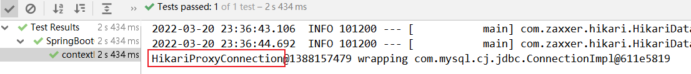

## 1.2 连接池配置方式

### 1.2.1 选择数据库连接池的库文件

SpringBoot 提供了三种数据库连接池：

- HikariCP
- Commons DBCP2
- Tomcat JDBC Connection Pool

其中 SpringBoot 2.x 版本默认使用 HikariCP，Maven 中配置如下：

```xml
<dependency>
    <groupId>org.springframework.boot</groupId>
    <artifactId>spring-boot-starter-jdbc</artifactId>
</dependency>
```

如果不使用HikariCP，改用 Commons DBCP2 ，则配置如下：

```xml
<dependency>
    <groupId>org.springframework.boot</groupId>
    <artifactId>spring-boot-starter-jdbc</artifactId>
    <exclusions>
        <exclusion>
            <groupId>com.zaxxer</groupId>
            <artifactId>HikariCP</artifactId>
        </exclusion>
    </exclusions>
</dependency>
<dependency>
    <groupId>org.apache.commons</groupId>
    <artifactId>commons-dbcp2</artifactId>
</dependency>
```

如果不使用HikariCP，改用 Tomcat JDBC Connection Pool ，则配置如下：

```xml
<dependency>
    <groupId>org.springframework.boot</groupId>
    <artifactId>spring-boot-starter-jdbc</artifactId>
    <exclusions>
        <exclusion>
            <groupId>com.zaxxer</groupId>
            <artifactId>HikariCP</artifactId>
        </exclusion>
    </exclusions>
</dependency>
<dependency>
    <groupId>org.apache.tomcat</groupId>
    <artifactId>tomcat-jdbc</artifactId>
</dependency>
```

> 思考：为什么说SpringBoot默认使用的连接池类型时HikariCP，在哪里指定的？

## 1.3 数据源自动配置

spring.factories 中找到数据源的配置类：


```java
@Configuration(proxyBeanMethods = false)
@ConditionalOnClass({ DataSource.class, EmbeddedDatabaseType.class })
@EnableConfigurationProperties(DataSourceProperties.class)
@Import({ DataSourcePoolMetadataProvidersConfiguration.class, 
         DataSourceInitializationConfiguration.class })
public class DataSourceAutoConfiguration {

	@Configuration(proxyBeanMethods = false)
	@Conditional(EmbeddedDatabaseCondition.class)
	@ConditionalOnMissingBean({ DataSource.class, XADataSource.class })
	@Import(EmbeddedDataSourceConfiguration.class)
	protected static class EmbeddedDatabaseConfiguration {

	}

	@Configuration(proxyBeanMethods = false)
	@Conditional(PooledDataSourceCondition.class)
	@ConditionalOnMissingBean({ DataSource.class, XADataSource.class })
	@Import({ DataSourceConfiguration.Hikari.class, DataSourceConfiguration.Tomcat.class,
			DataSourceConfiguration.Dbcp2.class, DataSourceConfiguration.Generic.class,
			DataSourceJmxConfiguration.class })
	protected static class PooledDataSourceConfiguration {

	}
    // ...
}
```

@Conditional(PooledDataSourceCondition.class) 根据判断条件，实例化这个类，指定了配置文件中必须有 type 这个属性：

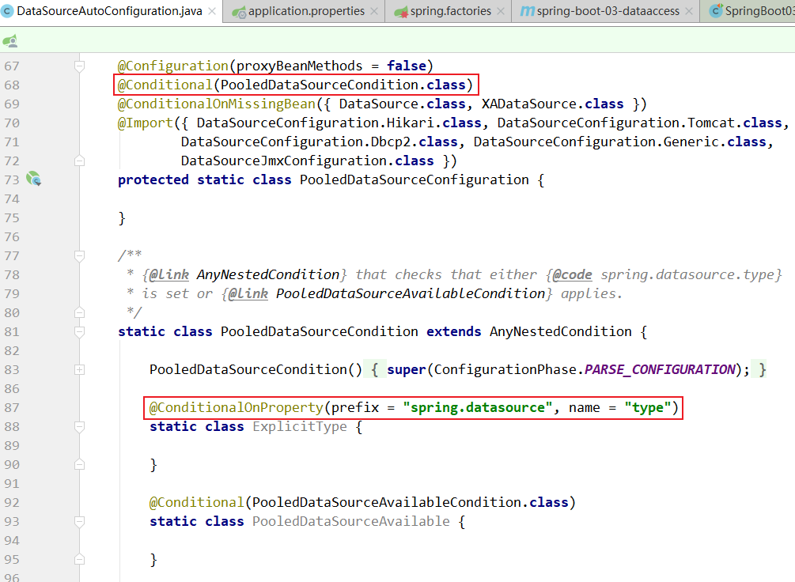

另外 SpringBoot 默认支持 type 类型设置的数据源：


```java
abstract class DataSourceConfiguration {

	@SuppressWarnings("unchecked")
	protected static <T> T createDataSource(DataSourceProperties properties, 
                                            Class<? extends DataSource> type) {
		return (T) properties.initializeDataSourceBuilder().type(type).build();
	}

	/**
	 * Tomcat Pool DataSource configuration.
	 * 2.0 之后默认不再使用 tomcat 连接池，或者使用 tomcat 容器
	 */
	@Configuration(proxyBeanMethods = false)
	// 如果导入 tomcat jdbc 连接池，则使用此连接池，在使用 tomcat 容器时候，或者导入此包时候
	@ConditionalOnClass(org.apache.tomcat.jdbc.pool.DataSource.class)
	@ConditionalOnMissingBean(DataSource.class)
	// 并且配置的时 org.apache.tomcat.jdbc.pool.DataSource 会采用 tomcat 连接池
	@ConditionalOnProperty(name = "spring.datasource.type", // name 用来从 application.properties中读取某个属性值
			havingValue = "org.apache.tomcat.jdbc.pool.DataSource", // 缺少该 property 时是否可以加载：如果true，没有该property也会正常加载；反之报错
			matchIfMissing = true) // 不管配不配置，都以 tomcat 连接池作为连接池 默认值 false
	static class Tomcat {

		// 给容器中加数据源
		@Bean
		@ConfigurationProperties(prefix = "spring.datasource.tomcat")
		org.apache.tomcat.jdbc.pool.DataSource dataSource(DataSourceProperties properties) {
			org.apache.tomcat.jdbc.pool.DataSource dataSource = createDataSource(properties,
					org.apache.tomcat.jdbc.pool.DataSource.class);
			DatabaseDriver databaseDriver = DatabaseDriver.fromJdbcUrl(properties.determineUrl());
			String validationQuery = databaseDriver.getValidationQuery();
			if (validationQuery != null) {
				dataSource.setTestOnBorrow(true);
				dataSource.setValidationQuery(validationQuery);
			}
			return dataSource;
		}
	}

	/**
	 * Hikari DataSource configuration.
	 * 2.0 之后默认使用 hikari 连接池
	 */
	@Configuration(proxyBeanMethods = false)
	@ConditionalOnClass(HikariDataSource.class)
	@ConditionalOnMissingBean(DataSource.class)
	@ConditionalOnProperty(name = "spring.datasource.type", 
                           havingValue = "com.zaxxer.hikari.HikariDataSource",
			matchIfMissing = true)
	static class Hikari {

		@Bean
		@ConfigurationProperties(prefix = "spring.datasource.hikari")
		HikariDataSource dataSource(DataSourceProperties properties) {
			HikariDataSource dataSource = createDataSource(properties, HikariDataSource.class);
			if (StringUtils.hasText(properties.getName())) {
				dataSource.setPoolName(properties.getName());
			}
			return dataSource;
		}
	}

	/**
	 * DBCP DataSource configuration.
	 * dbcp2 连接池
	 */
	@Configuration(proxyBeanMethods = false)
	@ConditionalOnClass(org.apache.commons.dbcp2.BasicDataSource.class)
	@ConditionalOnMissingBean(DataSource.class)
	@ConditionalOnProperty(name = "spring.datasource.type", 
                           havingValue = "org.apache.commons.dbcp2.BasicDataSource",
			matchIfMissing = true)
	static class Dbcp2 {

		@Bean
		@ConfigurationProperties(prefix = "spring.datasource.dbcp2")
		org.apache.commons.dbcp2.BasicDataSource dataSource(DataSourceProperties properties) {
			return createDataSource(properties, org.apache.commons.dbcp2.BasicDataSource.class);
		}
	}

	/**
	 * Generic DataSource configuration.
	 * 自定义连接池接口，spring.datasource.type
	 */
	@Configuration(proxyBeanMethods = false)
	@ConditionalOnMissingBean(DataSource.class)
	@ConditionalOnProperty(name = "spring.datasource.type")
	static class Generic {

		@Bean
		DataSource dataSource(DataSourceProperties properties) {
			// 创建数据源 initializeDataSourceBuilder DataSourceBuilder
			return properties.initializeDataSourceBuilder().build();
		}
	}
}
```

如果在类路径没有找到 jar 包，则会抛出异常：

> 

配置文件中没有指定数据源的时候，会根据注解判断，然后选择相应的实例化数据源对象。

```java
/**
* Hikari DataSource configuration.
* 2.0 之后默认使用 hikari 连接池
*/
@Configuration(proxyBeanMethods = false)
@ConditionalOnClass(HikariDataSource.class)
@ConditionalOnMissingBean(DataSource.class) // 注解判断是否执行初始化代码，即如果用户已经创建了bean，则相关的初始化代码不再执行
@ConditionalOnProperty(
    name = "spring.datasource.type", // 获取配置文件中的 type，如果为空返回 false                   
    havingValue = "com.zaxxer.hikari.HikariDataSource", // type 不为空则和 havingValue 对比，相同则true,否则false                   
    matchIfMissing = true) // 不管上面文件中是否匹配，默认都进行加载，默认值 false
static class Hikari {

    @Bean
    @ConfigurationProperties(prefix = "spring.datasource.hikari")
    HikariDataSource dataSource(DataSourceProperties properties) {
        // 创建数据源
        HikariDataSource dataSource = createDataSource(properties, HikariDataSource.class);
        if (StringUtils.hasText(properties.getName())) {
            dataSource.setPoolName(properties.getName());
        }
        return dataSource;
    }
}
```

createDataSource 方法：

```java
protected static <T> T createDataSource(DataSourceProperties properties, 
                                        Class<? extends DataSource> type) {
    // 使用 DataSourceBuilder 创建数据库，利用反射创建type数据源，然后绑定相关属性
    return (T) properties.initializeDataSourceBuilder().type(type).build();
}
```

**DataSourceBuilder** 类

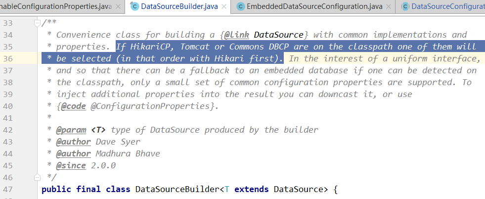

设置 type

```java
public <D extends DataSource> DataSourceBuilder<D> type(Class<D> type) {
    this.type = type;
    return (DataSourceBuilder<D>) this;
}
```

```java
@SuppressWarnings("unchecked")
public T build() {
    // getType 点进去
    Class<? extends DataSource> type = getType();
    DataSource result = BeanUtils.instantiateClass(type);
    maybeGetDriverClassName();
    bind(result);
    return (T) result;
}
```

根据设置选择type类型：

```java
private Class<? extends DataSource> getType() {
    // 如果没有配置 type 则为空 默认选择 findType
    Class<? extends DataSource> type = (this.type != null) ? this.type : findType(this.classLoader);
    if (type != null) {
        return type;
    }
    throw new IllegalStateException("No supported DataSource type found");
}
```

```java
public static Class<? extends DataSource> findType(ClassLoader classLoader) {
    for (String name : DATA_SOURCE_TYPE_NAMES) {
        try {
            return (Class<? extends DataSource>) ClassUtils.forName(name, classLoader);
        }
        catch (Exception ex) {
            // Swallow and continue
        }
    }
    return null;
}
```

数组 `DATA_SOURCE_TYPE_NAMES`：

```java
private static final String[] DATA_SOURCE_TYPE_NAMES = new String[] 
{ "com.zaxxer.hikari.HikariDataSource",
 "org.apache.tomcat.jdbc.pool.DataSource", 
 "org.apache.commons.dbcp2.BasicDataSource" };
```

取出来的第一个值就是 `com.zaxxer.hikari.HikariDataSource`，那么证实在没有指定 type 的情况下，默认类型为：`com.zaxxer.hikari.HikariDataSource`。


# 2 Druid连接池配置

## 2.1 整合效果实现

1. 在pom.xml中引入druid数据源

   ```xml
   <dependency>
       <groupId>com.alibaba</groupId>
       <artifactId>druid-spring-boot-starter</artifactId>
       <version>1.1.10</version>
   </dependency>
   ```

2. 在application.yml中引入druid的相关配置

   ```yaml
   spring:
     datasource:
       username: root
       password: 123456
       url: jdbc:mysql://152.136.177.192:3306/springboot_h?useUnicode=true&characterEncoding=utf-8&useSSL=true&serverTimezone=UTC
       driver-class-name: com.mysql.cj.jdbc.Driver
       initialization-mode: always
       # 使用druid数据源
       type: com.alibaba.druid.pool.DruidDataSource
       # 数据源其他配置
       initialSize: 5
       minIdle: 5
       maxActive: 20
       maxWait: 60000
       timeBetweenEvictionRunsMillis: 60000
       minEvictableIdleTimeMillis: 300000
       validationQuery: SELECT 1 FROM DUAL
       testWhileIdle: true
       testOnBorrow: false
       testOnReturn: false
       poolPreparedStatements: true
       # 配置监控统计拦截的filters，去掉后监控界面sql无法统计，'wall'用于防火墙
       filters: stat,wall,log4j
       maxPoolPreparedStatementPerConnectionSize: 20
       useGlobalDataSourceStat: true
       connectionProperties: druid.stat.mergeSql=true;druid.stat.slowSqlMillis=500
   ```

3. 进行测试：

   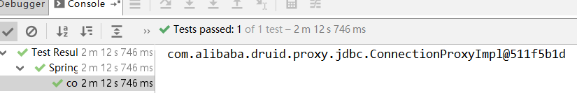

   但是debug查看 DataSource 的值，会发现有些属性是没有生效的：

   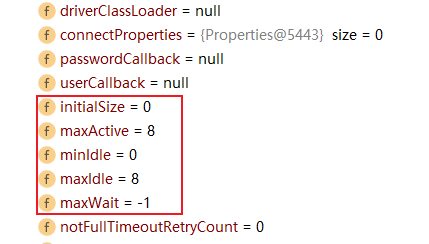

   这是因为：如果单纯在 yml 文件中编写如上的配置，SpringBoot肯定是读取不到 druid 的相关配置的。因为它并不像原生的 jdbc，系统默认就使用 `DataSourceProperties` 与其属性进行了绑定。所以我们应该编写一个类与其属性进行绑定

4. 编写整合 druid 的配置类 DruidConfig

   ```java
   package com.turbo.config;
   
   import com.alibaba.druid.pool.DruidDataSource;
   import org.springframework.boot.context.properties.ConfigurationProperties;
   import org.springframework.context.annotation.Bean;
   import org.springframework.context.annotation.Configuration;
   
   import javax.sql.DataSource;
   
   @Configuration
   public class DruidConfig {
   
   	@Bean
   	@ConfigurationProperties(prefix = "spring.datasource")
   	public DataSource dataSource(){
   		return new DruidDataSource();
   	}
   }
   ```

   测试的时候，发现报错。发现是yml文件里的：

   ```yaml
   # 配置监控统计拦截的filters，去掉后监控界面sql无法统计，'wall'用于防火墙
   filters: stat,wall,log4j
   ```

   因为 SpringBoot 2.0 以后使用的日志框架已经不再使用 log4j。此时引入相应的适配器，可以在 pom.xml 文件上加入：

   ```xml
   <!--引入适配器-->
   <dependency>
        <groupId>org.slf4j</groupId>
        <artifactId>slf4j-log4j12</artifactId>
   </dependency>
   ```

   OK。

   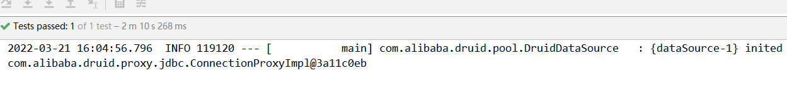

# 3 SpringBoot整合 Mybatis

Mybatis 是一款优秀的持久层框架，SpringBoot 官方虽然没有对 Mybatis 进行整合，但是 Mybatis 团队自定适配了对应的启动器，进一步简化了使用 Mybatis 进行数据的操作

因为 SpringBoot 框架开发的便利性，所以实现 SpringBoot 与 数据访问层框架（例如 Mybatis）的整合非常简单，主要是引入对应的依赖启动器，并进行数据库相关参数设置即可。

## 3.1 整合效果实现

1. spring-boot-03-dataaccess 项目，并导入 mybatis 的 pom.xml 配置

   ```xml
   <dependency>
       <groupId>org.mybatis.spring.boot</groupId>
       <artifactId>mybatis-spring-boot-starter</artifactId>
       <version>1.3.2</version>
   </dependency>
   <dependency>
       <groupId>org.projectlombok</groupId>
       <artifactId>lombok</artifactId>
       <optional>true</optional>
   </dependency>
   ```

   application.yml

   ```yaml
   spring:
     datasource:
       username: root
       password: 123456
       url: jdbc:mysql://152.136.177.192:3306/springboot_h?useUnicode=true&characterEncoding=utf-8&useSSL=true&serverTimezone=UTC
       driver-class-name: com.mysql.cj.jdbc.Driver
       initialization-mode: always
       # 使用druid数据源
       type: com.alibaba.druid.pool.DruidDataSource
   ```

2. 基础类

   ```java
   package com.turbo.pojo;
   
   import lombok.Data;
   
   @Data
   public class User {
   	private Integer id;
   	private String username;
   	private Integer age;
   }
   ```

   

3. 测试 dao（mybatis 使用注解开发）

   ```java
   package com.turbo.mapper;
   
   import com.turbo.pojo.User;
   import org.apache.ibatis.annotations.Select;
   
   import java.util.List;
   
   public interface UserMapper {
   
   	@Select("select * from user")
   	public List<User> findAllUser();
   }
   ```

   在启动类上增加注解：`@MapperScan("com.turbo.mapper")`

4. 测试 service

   ```java
   package com.turbo.service;
   
   import com.turbo.mapper.UserMapper;
   import com.turbo.pojo.User;
   import org.slf4j.Logger;
   import org.slf4j.LoggerFactory;
   import org.springframework.beans.factory.annotation.Autowired;
   import org.springframework.stereotype.Service;
   import java.util.List;
   
   @Service
   public class UserService {
   
   	final Logger logger = LoggerFactory.getLogger(UserService.class);
   
   	@Autowired
   	private UserMapper userMapper;
   
   	public List<User> findAllUser(){
   		final List<User> allUser = userMapper.findAllUser();
   		logger.info("查询出来的用户信息："+allUser.toString());
   		return allUser;
   	}
   }
   ```

5. service对应的 test类

   ```java
   @Autowired
   private UserService userService;
   
   @Test
   public void test1(){
       final List<User> allUser = userService.findAllUser();
   }
   ```

6. 运行测试类输出结果

   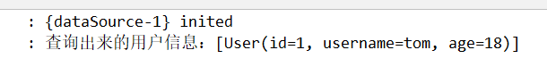

# 4 Mybatis 自动配置源码分析

1. SpringBoot 项目最核心的就是自动加载配置，该功能则依赖的是一个注解 `@SpringBootApplication` 中的 `@EnableAutoConfiguration`
2. `@EnableAutoConfiguration` 主要是通过 `AutoConfigurationImportSelector` 类来加载。

以 mybatis 为例，`AutoConfigurationImportSelector`  通过反射加载 spring.factories 中指定的 java 类，也就是加载 MybatisAutoConfiguration 类（该类有 @Configuration 注解，属于配置类）

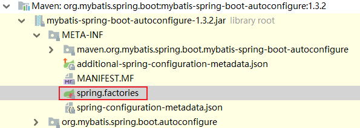

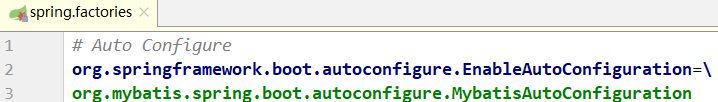

```java
/**
 * {@link EnableAutoConfiguration Auto-Configuration} for Mybatis. Contributes a
 * {@link SqlSessionFactory} and a {@link SqlSessionTemplate}.
 * 重点： SqlSessionFactory 和 SqlSessionTemplate 两个类
 *
 * If {@link org.mybatis.spring.annotation.MapperScan} is used, or a
 * configuration file is specified as a property, those will be considered,
 * otherwise this auto-configuration will attempt to register mappers based on
 * the interface definitions in or under the root auto-configuration package.
 *
 * @author Eddú Meléndez
 * @author Josh Long
 * @author Kazuki Shimizu
 * @author Eduardo Macarrón
 */
@org.springframework.context.annotation.Configuration
@ConditionalOnClass({ SqlSessionFactory.class, SqlSessionFactoryBean.class })
@ConditionalOnBean(DataSource.class)
@EnableConfigurationProperties(MybatisProperties.class)
@AutoConfigureAfter(DataSourceAutoConfiguration.class)
public class MybatisAutoConfiguration {

  private static final Logger logger = LoggerFactory.getLogger(MybatisAutoConfiguration.class);

  // 与 mybatis 配置文件对应
  private final MybatisProperties properties;

  private final Interceptor[] interceptors;

  private final ResourceLoader resourceLoader;

  private final DatabaseIdProvider databaseIdProvider;

  private final List<ConfigurationCustomizer> configurationCustomizers;

  public MybatisAutoConfiguration(MybatisProperties properties,
                                  ObjectProvider<Interceptor[]> interceptorsProvider,
                                  ResourceLoader resourceLoader,
                                  ObjectProvider<DatabaseIdProvider> databaseIdProvider,
                                  ObjectProvider<List<ConfigurationCustomizer>> configurationCustomizersProvider) {
    this.properties = properties;
    this.interceptors = interceptorsProvider.getIfAvailable();
    this.resourceLoader = resourceLoader;
    this.databaseIdProvider = databaseIdProvider.getIfAvailable();
    this.configurationCustomizers = configurationCustomizersProvider.getIfAvailable();
  }

  // PostConstruct 作用是在创建类的时候先调用，校验配置文件是否存在
  @PostConstruct
  public void checkConfigFileExists() {
    if (this.properties.isCheckConfigLocation() 
        && StringUtils.hasText(this.properties.getConfigLocation())) {
      Resource resource = this.resourceLoader.getResource(this.properties.getConfigLocation());
      Assert.state(resource.exists(), "Cannot find config location: " + resource
          + " (please add config file or check your Mybatis configuration)");
    }
  }

  // conditionalOnMissingBean 作用：在没有类的时候调用，创建 SqlSessionFactory,SqlSessionFactory最主要是创建并保存了ConfigLocation类
  @Bean
  @ConditionalOnMissingBean
  public SqlSessionFactory sqlSessionFactory(DataSource dataSource) throws Exception {
    SqlSessionFactoryBean factory = new SqlSessionFactoryBean();
    factory.setDataSource(dataSource);
    factory.setVfs(SpringBootVFS.class);
    if (StringUtils.hasText(this.properties.getConfigLocation())) {
      factory.setConfigLocation(this.resourceLoader.getResource(this.properties.getConfigLocation()));
    }
    Configuration configuration = this.properties.getConfiguration();
    if (configuration == null && !StringUtils.hasText(this.properties.getConfigLocation())) {
      configuration = new Configuration();
    }
    if (configuration != null && !CollectionUtils.isEmpty(this.configurationCustomizers)) {
      for (ConfigurationCustomizer customizer : this.configurationCustomizers) {
        customizer.customize(configuration);
      }
    }
    factory.setConfiguration(configuration);
    if (this.properties.getConfigurationProperties() != null) {
      factory.setConfigurationProperties(this.properties.getConfigurationProperties());
    }
    if (!ObjectUtils.isEmpty(this.interceptors)) {
      factory.setPlugins(this.interceptors);
    }
    if (this.databaseIdProvider != null) {
      factory.setDatabaseIdProvider(this.databaseIdProvider);
    }
    if (StringUtils.hasLength(this.properties.getTypeAliasesPackage())) {
      factory.setTypeAliasesPackage(this.properties.getTypeAliasesPackage());
    }
    if (StringUtils.hasLength(this.properties.getTypeHandlersPackage())) {
      factory.setTypeHandlersPackage(this.properties.getTypeHandlersPackage());
    }
    if (!ObjectUtils.isEmpty(this.properties.resolveMapperLocations())) {
      factory.setMapperLocations(this.properties.resolveMapperLocations());
    }
	// 获取SqlSessionFactoryBean的.getObject()中的对象注入Spring容器，也就是SqlSessionFactory对象
    return factory.getObject();
  }

  @Bean
  @ConditionalOnMissingBean
    //往Spring容器中注入SqlSessionTemplate对象
  public SqlSessionTemplate sqlSessionTemplate(SqlSessionFactory sqlSessionFactory) {
    ExecutorType executorType = this.properties.getExecutorType();
    if (executorType != null) {
      return new SqlSessionTemplate(sqlSessionFactory, executorType);
    } else {
      return new SqlSessionTemplate(sqlSessionFactory);
    }
  }
}
```

**MybatisAutoConfiguration类**：

1. 类中有个  MybatisProperties 类，该类对应的是 mybatis 的配置文件
2. 类中有个 sqlSessionFactory 方法，作用是创建 SqlSessionFactory 类，Configuration 类（mybatis最主要的类，保存着与 mybatis相关的东西）
3. SqlSessionTemplate ，作用是与 mapperProxy 代理类有关


sqlSessionFactory 主要是通过创建一个 SqlSessionFactoryBean ，这个类实现了 FactoryBean 接口，所以在 Spring 容器就会注入这个类中定义的 getObject 方法返回的对象。

看一下 getObject() 方法做了什么？：

```java
public SqlSessionFactory getObject() throws Exception {
    if (this.sqlSessionFactory == null) {
        this.afterPropertiesSet();
    }
    return this.sqlSessionFactory;
}
```

```java
public void afterPropertiesSet() throws Exception {
    Assert.notNull(this.dataSource, "Property 'dataSource' is required");
    Assert.notNull(this.sqlSessionFactoryBuilder, "Property 'sqlSessionFactoryBuilder' is required");
    Assert.state(this.configuration == null && this.configLocation == null || this.configuration == null || this.configLocation == null, "Property 'configuration' and 'configLocation' can not specified with together");
    this.sqlSessionFactory = this.buildSqlSessionFactory();
}
```

```java
 protected SqlSessionFactory buildSqlSessionFactory() throws IOException {
     XMLConfigBuilder xmlConfigBuilder = null;
     Configuration configuration;
     if (this.configuration != null) {
         configuration = this.configuration;
         if (configuration.getVariables() == null) {
             configuration.setVariables(this.configurationProperties);
         } else if (this.configurationProperties != null) {
             configuration.getVariables().putAll(this.configurationProperties);
         }
     } else if (this.configLocation != null) {
         xmlConfigBuilder = new XMLConfigBuilder(this.configLocation.getInputStream(), (String)null, this.configurationProperties);
         configuration = xmlConfigBuilder.getConfiguration();
     } else {
         if (LOGGER.isDebugEnabled()) {
             LOGGER.debug("Property 'configuration' or 'configLocation' not specified, using default MyBatis Configuration");
         }

         configuration = new Configuration();
         if (this.configurationProperties != null) {
             configuration.setVariables(this.configurationProperties);
         }
     }

     if (this.objectFactory != null) {
         configuration.setObjectFactory(this.objectFactory);
     }

     if (this.objectWrapperFactory != null) {
         configuration.setObjectWrapperFactory(this.objectWrapperFactory);
     }

     if (this.vfs != null) {
         configuration.setVfsImpl(this.vfs);
     }

     String[] typeHandlersPackageArray;
     String[] var4;
     int var5;
     int var6;
     String packageToScan;
     if (StringUtils.hasLength(this.typeAliasesPackage)) {
         typeHandlersPackageArray = StringUtils.tokenizeToStringArray(this.typeAliasesPackage, ",; \t\n");
         var4 = typeHandlersPackageArray;
         var5 = typeHandlersPackageArray.length;

         for(var6 = 0; var6 < var5; ++var6) {
             packageToScan = var4[var6];
             configuration.getTypeAliasRegistry().registerAliases(packageToScan, this.typeAliasesSuperType == null ? Object.class : this.typeAliasesSuperType);
             if (LOGGER.isDebugEnabled()) {
                 LOGGER.debug("Scanned package: '" + packageToScan + "' for aliases");
             }
         }
     }

     int var27;
     if (!ObjectUtils.isEmpty(this.typeAliases)) {
         Class[] var25 = this.typeAliases;
         var27 = var25.length;

         for(var5 = 0; var5 < var27; ++var5) {
             Class<?> typeAlias = var25[var5];
             configuration.getTypeAliasRegistry().registerAlias(typeAlias);
             if (LOGGER.isDebugEnabled()) {
                 LOGGER.debug("Registered type alias: '" + typeAlias + "'");
             }
         }
     }

     if (!ObjectUtils.isEmpty(this.plugins)) {
         Interceptor[] var26 = this.plugins;
         var27 = var26.length;

         for(var5 = 0; var5 < var27; ++var5) {
             Interceptor plugin = var26[var5];
             configuration.addInterceptor(plugin);
             if (LOGGER.isDebugEnabled()) {
                 LOGGER.debug("Registered plugin: '" + plugin + "'");
             }
         }
     }

     if (StringUtils.hasLength(this.typeHandlersPackage)) {
         typeHandlersPackageArray = StringUtils.tokenizeToStringArray(this.typeHandlersPackage, ",; \t\n");
         var4 = typeHandlersPackageArray;
         var5 = typeHandlersPackageArray.length;

         for(var6 = 0; var6 < var5; ++var6) {
             packageToScan = var4[var6];
             configuration.getTypeHandlerRegistry().register(packageToScan);
             if (LOGGER.isDebugEnabled()) {
                 LOGGER.debug("Scanned package: '" + packageToScan + "' for type handlers");
             }
         }
     }

     if (!ObjectUtils.isEmpty(this.typeHandlers)) {
         TypeHandler[] var28 = this.typeHandlers;
         var27 = var28.length;

         for(var5 = 0; var5 < var27; ++var5) {
             TypeHandler<?> typeHandler = var28[var5];
             configuration.getTypeHandlerRegistry().register(typeHandler);
             if (LOGGER.isDebugEnabled()) {
                 LOGGER.debug("Registered type handler: '" + typeHandler + "'");
             }
         }
     }

     if (this.databaseIdProvider != null) {
         try {
             configuration.setDatabaseId(this.databaseIdProvider.getDatabaseId(this.dataSource));
         } catch (SQLException var24) {
             throw new NestedIOException("Failed getting a databaseId", var24);
         }
     }

     if (this.cache != null) {
         configuration.addCache(this.cache);
     }

     if (xmlConfigBuilder != null) {
         try {
             xmlConfigBuilder.parse();
             if (LOGGER.isDebugEnabled()) {
                 LOGGER.debug("Parsed configuration file: '" + this.configLocation + "'");
             }
         } catch (Exception var22) {
             throw new NestedIOException("Failed to parse config resource: " + this.configLocation, var22);
         } finally {
             ErrorContext.instance().reset();
         }
     }

     if (this.transactionFactory == null) {
         this.transactionFactory = new SpringManagedTransactionFactory();
     }

     configuration.setEnvironment(new Environment(this.environment, this.transactionFactory, this.dataSource));
     if (!ObjectUtils.isEmpty(this.mapperLocations)) {
         Resource[] var29 = this.mapperLocations;
         var27 = var29.length;

         for(var5 = 0; var5 < var27; ++var5) {
             Resource mapperLocation = var29[var5];
             if (mapperLocation != null) {
                 try {
                     XMLMapperBuilder xmlMapperBuilder = new XMLMapperBuilder(mapperLocation.getInputStream(), configuration, mapperLocation.toString(), configuration.getSqlFragments());
                     // 这个方法已经是 mybatis 的源码，初始化流程
                     xmlMapperBuilder.parse();
                 } catch (Exception var20) {
                     throw new NestedIOException("Failed to parse mapping resource: '" + mapperLocation + "'", var20);
                 } finally {
                     ErrorContext.instance().reset();
                 }

                 if (LOGGER.isDebugEnabled()) {
                     LOGGER.debug("Parsed mapper file: '" + mapperLocation + "'");
                 }
             }
         }
     } else if (LOGGER.isDebugEnabled()) {
         LOGGER.debug("Property 'mapperLocations' was not specified or no matching resources found");
     }
	 // 这个方法已经是 mybatis 的源码，初始化流程
     return this.sqlSessionFactoryBuilder.build(configuration);
 }
```

这个已经很明显了，实际上就是调用了 Mybatis 的初始化流程，现在已经得到了 SqlSessionFactory 了，接下来就是如何扫描到相关的Mapper接口了。

这个需要看这个注解：`@MapperScan("com.turbo.mapper")`

```java
@Retention(RetentionPolicy.RUNTIME)
@Target({ElementType.TYPE})
@Documented
@Import({MapperScannerRegistrar.class})
public @interface MapperScan {
```

通过 @Import 的方式扫描到 MapperScannerRegistrar 类。

MapperScannerRegistrar 实现了 ImportBeanDefinitionRegistrar 接口，那么在Spring 实例化之前就会调用到 `org.mybatis.spring.annotation.MapperScannerRegistrar#registerBeanDefinitions` 方法：

```java
public class MapperScannerRegistrar implements ImportBeanDefinitionRegistrar, ResourceLoaderAware 
```

```java
@Override
public void registerBeanDefinitions(AnnotationMetadata importingClassMetadata, 
                                    BeanDefinitionRegistry registry) {
	// 拿到MapperScan注解，并解析注解中定义的属性封装成 AnnotationAttributes 对象
    AnnotationAttributes annoAttrs = AnnotationAttributes
        .fromMap(importingClassMetadata.getAnnotationAttributes(MapperScan.class.getName()));
    ClassPathMapperScanner scanner = new ClassPathMapperScanner(registry);

    // this check is needed in Spring 3.1
    if (resourceLoader != null) {
        scanner.setResourceLoader(resourceLoader);
    }

    Class<? extends Annotation> annotationClass = annoAttrs.getClass("annotationClass");
    if (!Annotation.class.equals(annotationClass)) {
        scanner.setAnnotationClass(annotationClass);
    }

    Class<?> markerInterface = annoAttrs.getClass("markerInterface");
    if (!Class.class.equals(markerInterface)) {
        scanner.setMarkerInterface(markerInterface);
    }

    Class<? extends BeanNameGenerator> generatorClass = annoAttrs.getClass("nameGenerator");
    if (!BeanNameGenerator.class.equals(generatorClass)) {
        scanner.setBeanNameGenerator(BeanUtils.instantiateClass(generatorClass));
    }

    Class<? extends MapperFactoryBean> mapperFactoryBeanClass = annoAttrs.getClass("factoryBean");
    if (!MapperFactoryBean.class.equals(mapperFactoryBeanClass)) {
        scanner.setMapperFactoryBean(BeanUtils.instantiateClass(mapperFactoryBeanClass));
    }

    scanner.setSqlSessionTemplateBeanName(annoAttrs.getString("sqlSessionTemplateRef"));
    scanner.setSqlSessionFactoryBeanName(annoAttrs.getString("sqlSessionFactoryRef"));

    List<String> basePackages = new ArrayList<String>();
    for (String pkg : annoAttrs.getStringArray("value")) {
        if (StringUtils.hasText(pkg)) {
            basePackages.add(pkg);
        }
    }
    for (String pkg : annoAttrs.getStringArray("basePackages")) {
        if (StringUtils.hasText(pkg)) {
            basePackages.add(pkg);
        }
    }
    for (Class<?> clazz : annoAttrs.getClassArray("basePackageClasses")) {
        basePackages.add(ClassUtils.getPackageName(clazz));
    }
    scanner.registerFilters();
    // 点击去
    scanner.doScan(StringUtils.toStringArray(basePackages));
}
```

  ```java
// org.mybatis.spring.mapper.ClassPathMapperScanner#doScan
@Override
public Set<BeanDefinitionHolder> doScan(String... basePackages) {
    // 点击去
    Set<BeanDefinitionHolder> beanDefinitions = super.doScan(basePackages);

    if (beanDefinitions.isEmpty()) {
        logger.warn("No MyBatis mapper was found in '" + Arrays.toString(basePackages) + "' package. Please check your configuration.");
    } else {
        processBeanDefinitions(beanDefinitions);
    }

    return beanDefinitions;
}
  ```

```java
// org.springframework.context.annotation.ClassPathBeanDefinitionScanner#doScan
// 这个方法在 SpringBoot 源码解析中也遇到过
protected Set<BeanDefinitionHolder> doScan(String... basePackages) {
    Assert.notEmpty(basePackages, "At least one base package must be specified");
    Set<BeanDefinitionHolder> beanDefinitions = new LinkedHashSet<>();
    for (String basePackage : basePackages) {
        // resource 定位
        Set<BeanDefinition> candidates = findCandidateComponents(basePackage);
        for (BeanDefinition candidate : candidates) {
            ScopeMetadata scopeMetadata = this.scopeMetadataResolver.resolveScopeMetadata(candidate);
            candidate.setScope(scopeMetadata.getScopeName());
            String beanName = this.beanNameGenerator.generateBeanName(candidate, this.registry);
            if (candidate instanceof AbstractBeanDefinition) {
                postProcessBeanDefinition((AbstractBeanDefinition) candidate, beanName);
            }
            if (candidate instanceof AnnotatedBeanDefinition) {
                AnnotationConfigUtils.processCommonDefinitionAnnotations((AnnotatedBeanDefinition) candidate);
            }
            if (checkCandidate(beanName, candidate)) {
                BeanDefinitionHolder definitionHolder = new BeanDefinitionHolder(candidate, beanName);
                definitionHolder =
                    AnnotationConfigUtils.applyScopedProxyMode(scopeMetadata, definitionHolder, this.registry);
                beanDefinitions.add(definitionHolder);
                // 将该 Bean 注册进 IoC 容器（beanDefinitionMap）
                registerBeanDefinition(definitionHolder, this.registry);
            }
        }
    }
    return beanDefinitions;
}
```

在回到 `org.mybatis.spring.mapper.ClassPathMapperScanner#doScan` 方法中的 `processBeanDefinitions(beanDefinitions)`：

```java
private void processBeanDefinitions(Set<BeanDefinitionHolder> beanDefinitions) {
    GenericBeanDefinition definition;
    for (BeanDefinitionHolder holder : beanDefinitions) {
        definition = (GenericBeanDefinition) holder.getBeanDefinition();

        if (logger.isDebugEnabled()) {
            logger.debug("Creating MapperFactoryBean with name '" + holder.getBeanName() 
                         + "' and '" + definition.getBeanClassName() + "' mapperInterface");
        }

        // the mapper interface is the original class of the bean
        // but, the actual class of the bean is MapperFactoryBean
        definition.getConstructorArgumentValues().addGenericArgumentValue(definition.getBeanClassName()); // issue #59
        // 重要的方法，debug 观察前后 
        definition.setBeanClass(this.mapperFactoryBean.getClass());

        definition.getPropertyValues().add("addToConfig", this.addToConfig);

        boolean explicitFactoryUsed = false;
        if (StringUtils.hasText(this.sqlSessionFactoryBeanName)) {
            definition.getPropertyValues().add("sqlSessionFactory", new RuntimeBeanReference(this.sqlSessionFactoryBeanName));
            explicitFactoryUsed = true;
        } else if (this.sqlSessionFactory != null) {
            definition.getPropertyValues().add("sqlSessionFactory", this.sqlSessionFactory);
            explicitFactoryUsed = true;
        }

        if (StringUtils.hasText(this.sqlSessionTemplateBeanName)) {
            if (explicitFactoryUsed) {
                logger.warn("Cannot use both: sqlSessionTemplate and sqlSessionFactory together. sqlSessionFactory is ignored.");
            }
            definition.getPropertyValues().add("sqlSessionTemplate", new RuntimeBeanReference(this.sqlSessionTemplateBeanName));
            explicitFactoryUsed = true;
        } else if (this.sqlSessionTemplate != null) {
            if (explicitFactoryUsed) {
                logger.warn("Cannot use both: sqlSessionTemplate and sqlSessionFactory together. sqlSessionFactory is ignored.");
            }
            definition.getPropertyValues().add("sqlSessionTemplate", this.sqlSessionTemplate);
            explicitFactoryUsed = true;
        }

        if (!explicitFactoryUsed) {
            if (logger.isDebugEnabled()) {
                logger.debug("Enabling autowire by type for MapperFactoryBean with name '" + holder.getBeanName() + "'.");
            }
            definition.setAutowireMode(AbstractBeanDefinition.AUTOWIRE_BY_TYPE);
        }
    }
}
```

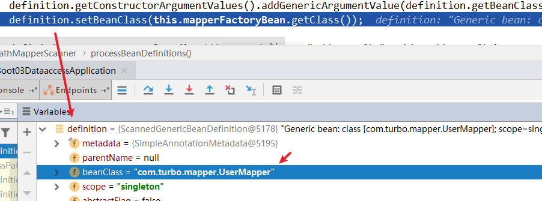

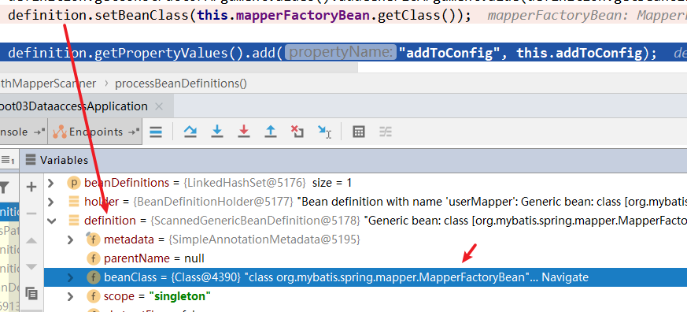

**上述几步主要是完成通过 @MapperScan("com.turbo.mapper") 这个定义，扫描指定包下的 mapper 接口，然后设置每个 mapper 接口的 beanClass 属性为 MapperFactoryBean 类型加入到 Spring 的 bean 容器中**。

MapperFactoryBean 实现了 FactoryBean 接口，所以当 Spring 从待实例化的 bean 容器中遍历到这个 bean 并开始执行实例化时返回的对象实际上是 getObject 方法中返回的对象。

然后观察 MapperFactoryBean的 getObject()方法，实际上返回的就是 mybatis 中通过 getMapper 拿到的对象，熟悉mybatis 源码的就应该清除，这个就是 mybatis 通过动态代理生成的 mapper 接口实现类。

```java
public class MapperFactoryBean<T> extends SqlSessionDaoSupport implements FactoryBean<T> {
    // ...
  @Override
  public T getObject() throws Exception {
    // 观察该方法
    return getSqlSession().getMapper(this.mapperInterface);
  }
}
```

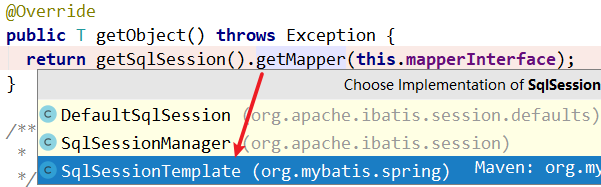

```java
// org.mybatis.spring.SqlSessionTemplate#getMapper
@Override
public <T> T getMapper(Class<T> type) {
    return getConfiguration().getMapper(type, this);
}
```

```java
// org.apache.ibatis.session.Configuration#getMapper
public <T> T getMapper(Class<T> type, SqlSession sqlSession) {
    return this.mapperRegistry.getMapper(type, sqlSession);
}
```

```java
public <T> T getMapper(Class<T> type, SqlSession sqlSession) {
    MapperProxyFactory<T> mapperProxyFactory = (MapperProxyFactory)this.knownMappers.get(type);
    if (mapperProxyFactory == null) {
        throw new BindingException("Type " + type + " is not known to the MapperRegistry.");
    } else {
        try {
            // 点进去
            return mapperProxyFactory.newInstance(sqlSession);
        } catch (Exception var5) {
            throw new BindingException("Error getting mapper instance. Cause: " + var5, var5);
        }
    }
}
```

```java
// org.apache.ibatis.binding.MapperProxyFactory
protected T newInstance(MapperProxy<T> mapperProxy) {
    return Proxy.newProxyInstance(this.mapperInterface.getClassLoader(), 
                                  new Class[]{this.mapperInterface}, mapperProxy);
}

public T newInstance(SqlSession sqlSession) {
    MapperProxy<T> mapperProxy = new MapperProxy(sqlSession, this.mapperInterface, this.methodCache);
    // 返回代理对象
    return this.newInstance(mapperProxy);
}
```

到此，mapper接口现在也通过动态代理生成了实现类，并且注入到 Spring 的 bean 容器中了。之后使用者就可以通过 @Autowired 或者 getBean 等方式，从Spring容器中获取到了。


# 5 SpringBoot + Mybatis 实现动态数据源切换

## 5.1 动态数据源介绍

**原理图**

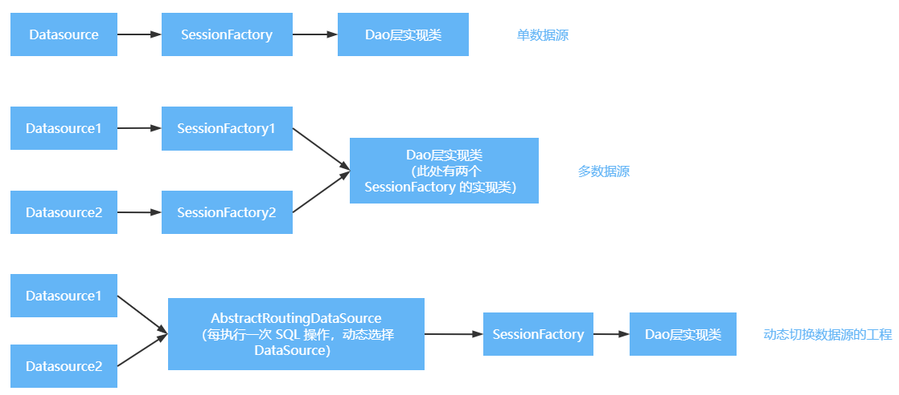

Spring 内置了一个 AbstractRoutingDataSource ，它可以把多个数据源配置成一个 Map，然后，根据不同的 key 返回不同的数据源。因为 AbstractRoutingDataSource 也是一个 DataSource 接口，因此，应用程序应该预先设置好 key ，访问数据的代码就可以从 AbstractRoutingDataSource 拿到对应的一个真实数据源，从而访问指定的数据库。

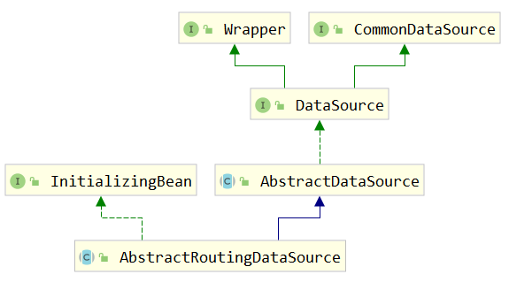

查看 **AbstractRoutingDataSource** 类：

```java
// org.springframework.jdbc.datasource.lookup.AbstractRoutingDataSource
/**
 * Abstract {@link javax.sql.DataSource} implementation that routes {@link #getConnection()}
 * calls to one of various target DataSources based on a lookup key. The latter is usually
 * (but not necessarily) determined through some thread-bound transaction context.
 * 
 * 抽象 {@link javax.sql.DataSource} 路由 {@link #getConnection()} 的实现
 * 根据查找键调用不同的目标数据之一。后者通常是
 * （但不一定）通过某些线程绑定事务上下文来确定。
 *
 * @author Juergen Hoeller
 * @since 2.0.1
 * @see #setTargetDataSources
 * @see #setDefaultTargetDataSource
 * @see #determineCurrentLookupKey()
 */
public abstract class AbstractRoutingDataSource extends AbstractDataSource implements InitializingBean {
    
    @Nullable
	private Map<Object, Object> targetDataSources; // 存放多个数据源的 map （解析前）

	@Nullable
	private Object defaultTargetDataSource; // 默认使用的数据源是哪一个

	private boolean lenientFallback = true;

	private DataSourceLookup dataSourceLookup = new JndiDataSourceLookup();

	@Nullable
	private Map<Object, DataSource> resolvedDataSources; // targetDataSources 也会存到这个 map 中一份

	@Nullable
	private DataSource resolvedDefaultDataSource;
    
    /**
	 * Specify the map of target DataSources, with the lookup key as key.
	 * The mapped value can either be a corresponding {@link javax.sql.DataSource}
	 * instance or a data source name String (to be resolved via a
	 * {@link #setDataSourceLookup DataSourceLookup}).
	 * <p>The key can be of arbitrary type; this class implements the
	 * generic lookup process only. The concrete key representation will
	 * be handled by {@link #resolveSpecifiedLookupKey(Object)} and
	 * {@link #determineCurrentLookupKey()}.
	 * 
	 * 指定目标数据源的映射，查找键为 键。
	 * 映射的值可以是相应的 {@link javax.sql.DataSource}
	 * 实例或数据源名称字符串（要通过 {@link #setDataSourceLookup DataSourceLookup})）
	 * 键 可以是 任意类型的；这个类实现了通用查找过程。具体的关键表示将由
	 * {@link #resolveSpecifiedLookupKey(Object)} 和 {@link #determineCurrentLookupKey()}
	 */
	public void setTargetDataSources(Map<Object, Object> targetDataSources) {
		this.targetDataSources = targetDataSources;
	}
    
    /**
	 * Retrieve the current target DataSource. Determines the
	 * {@link #determineCurrentLookupKey() current lookup key}, performs
	 * a lookup in the {@link #setTargetDataSources targetDataSources} map,
	 * falls back to the specified
	 * {@link #setDefaultTargetDataSource default target DataSource} if necessary.
	 * @see #determineCurrentLookupKey()
	 */
	protected DataSource determineTargetDataSource() {
		Assert.notNull(this.resolvedDataSources, "DataSource router not initialized");
        // 获取 key
		Object lookupKey = determineCurrentLookupKey();
        // 获取具体的 DataSource 对象
		DataSource dataSource = this.resolvedDataSources.get(lookupKey);
		if (dataSource == null && (this.lenientFallback || lookupKey == null)) {
			dataSource = this.resolvedDefaultDataSource;
		}
		if (dataSource == null) {
			throw new IllegalStateException("Cannot determine target DataSource for lookup key [" + lookupKey + "]");
		}
		return dataSource;
	}
    
    // ...
    /**
	 * Determine the current lookup key. This will typically be
	 * implemented to check a thread-bound transaction context.
	 * <p>Allows for arbitrary keys. The returned key needs
	 * to match the stored lookup key type, as resolved by the
	 * {@link #resolveSpecifiedLookupKey} method.
	 * 确定当前的查找键。这通常会实现以检查线程绑定的事务上下文。
	 * 允许任意键。返回的密钥需要与存储的查找密钥类型匹配，如：
	 * {@link #resolveSpecifiedLookupKey}
	 */
	@Nullable
	protected abstract Object determineCurrentLookupKey();
}
```

上面源码中还有另一个核心的方法 `setTargetDataSources(Map<Object, Object> targetDataSources)`，它需要一个Map，在方法注释中可得知，这个 Map 存储的就是我们配置的多个数据源的键值对。整理一下这个切换数据源的运作方式，这个类在连接数据库之前会执行 determineCurrentLookupKey() 方法，这个方法返回的数据将作为 key 去 `targetDataSources` 获取数据库连接。

它是是一个 `abstract` 类，所以我们使用的话，推荐的方式是创建一个类来继承它并且实现它的 `determineCurrentLookupKey()` 方法，就是通过这个方法进行数据源的切换。

> 思路分析：
>
> 1. 项目中准备两部分数据源配置信息，master : product_master，slave：product_slave
>
> 2. 创建数据源自动配置类，完成 master\slave 这两个数据源对象的创建
>
> 3. 创建 AbstractRoutingDataSource 的子类，重写 determineCurrentLookupKey() 方法（return "master"从容器中获取 key ）
>
> 4. 要将两个数据源对象 添加到 AbstractRoutingDataSource 的 targetDataSources 这个map 中
>
>    map.put("master",masterDataSource);
>
>    map.put("slave",slaveDataSource);
>
>    问题：如何存储动态选择的 key？ThreadLoal
>
> 5. 创建 RoutingDataSourceContext 类，在该类中 通过 ThreadLocal 来存储 dataSource的key。

## 5.2 环境准备

[gitee 代码地址](https://gitee.com/turboYuu/spring-boot-1-4/blob/master/source_code/spring-boot-2.2.9.RELEASE/spring-boot-03-dataaccess/src/main/java/com/turbo/config/RoutingDataSource.java)

1. 实体类

   ```java
   package com.turbo.pojo;
   
   import lombok.Data;
   
   @Data
   public class Product {
   	private Integer id;
   	private String name;
   	private Double price;
   }
   ```

2. ProductMapper

   ```java
   package com.turbo.mapper;
   
   import com.turbo.pojo.Product;
   import org.apache.ibatis.annotations.Select;
   
   import java.util.List;
   
   public interface ProductMapper {
   
   	@Select("select * from product")
   	public List<Product> findAllProductM();
   
   	@Select("select * from product")
   	public List<Product> findAllProductS();
   }
   ```

   

3. ProductService

   ```java
   package com.turbo.service;
   
   import com.turbo.mapper.ProductMapper;
   import com.turbo.pojo.Product;
   import org.springframework.beans.factory.annotation.Autowired;
   import org.springframework.stereotype.Service;
   
   import java.util.List;
   
   @Service
   public class ProductService {
   
   	@Autowired
   	private ProductMapper productMapper;
   
   	public void findAllProductM(){
   		final List<Product> allProductM = productMapper.findAllProductM();
   		System.out.println(allProductM);
   	}
   
   	public void findAllProductS(){
   		final List<Product> allProductS = productMapper.findAllProductS();
   		System.out.println(allProductS);
   	}
   }
   ```

   

4. ProductController

   ```java
   package com.turbo.controller;
   
   import com.turbo.config.RoutingDataSourceContext;
   import com.turbo.service.ProductService;
   import org.springframework.beans.factory.annotation.Autowired;
   import org.springframework.web.bind.annotation.RequestMapping;
   import org.springframework.web.bind.annotation.RestController;
   
   @RestController
   public class ProductController {
   
   	@Autowired
   	private ProductService productService;
   
   	@RequestMapping("/findAllProductM")
   	public String findAllProductM(){
   		productService.findAllProductM();
   		return "master";
   	}
   
   	@RequestMapping("/findAllProductS")
   	public String findAllProductS(){
   		productService.findAllProductS();
   		return "slave";
   	}
   }
   ```

   

## 5.3 具体实现

### 5.3.1 配置多数据源

首先在 application.properties 中配置两个数据源

```properties
spring.druid.datasource.master.password=123456
spring.druid.datasource.master.username=root
spring.druid.datasource.master.jdbc-url=jdbc:mysql://152.136.177.192:3306/product_master?useUnicode=true&characterEncoding=utf-8&useSSL=true&serverTimezone=UTC
spring.druid.datasource.master.driver-class-name=com.mysql.cj.jdbc.Driver

spring.druid.datasource.slave.password=123456
spring.druid.datasource.slave.username=root
spring.druid.datasource.slave.jdbc-url=jdbc:mysql://152.136.177.192:3306/product_slave?useUnicode=true&characterEncoding=utf-8&useSSL=true&serverTimezone=UTC
spring.druid.datasource.slave.driver-class-name=com.mysql.cj.jdbc.Driver
```

在 SpringBoot 的配置代码中，初始化两个数据源：

```java
package com.turbo.config;

import org.slf4j.Logger;
import org.slf4j.LoggerFactory;
import org.springframework.beans.factory.annotation.Autowired;
import org.springframework.beans.factory.annotation.Qualifier;
import org.springframework.boot.context.properties.ConfigurationProperties;
import org.springframework.boot.jdbc.DataSourceBuilder;
import org.springframework.context.annotation.Bean;
import org.springframework.context.annotation.Configuration;
import javax.sql.DataSource;

@Configuration
public class MyDataSourceAutoConfiguration {

	final Logger logger = LoggerFactory.getLogger(MyDataSourceAutoConfiguration.class);

	/**
	 * master dataSource
	 */
	@Bean
	@ConfigurationProperties(prefix = "spring.druid.datasource.master")
	public DataSource masterDataSource(){
		logger.info("create master dataSource ...");
		return DataSourceBuilder.create().build();
	}

	/**
	 * slave dataSource
	 */
	@Bean
	@ConfigurationProperties(prefix = "spring.druid.datasource.slave")
	public DataSource slaveDataSource(){
		logger.info("create slave dataSource ...");
		return DataSourceBuilder.create().build();
	}
}

```


### 5.3.2 编写 RoutingDataSource

然后，用 Spring 内置的 RoutingDataSource，把两个真实的数据源代理为一个动态数据源：

```java
package com.turbo.config;

import org.springframework.jdbc.datasource.lookup.AbstractRoutingDataSource;

public class RoutingDataSource extends AbstractRoutingDataSource {
	
	@Override
	protected Object determineCurrentLookupKey() {
		return "master";
	}
}
```

对于这个 `RoutingDataSource` ，需要在 SpringBoot 中配置好并设置为主数据源：

```java
package com.turbo.config;

import org.slf4j.Logger;
import org.slf4j.LoggerFactory;
import org.springframework.beans.factory.annotation.Autowired;
import org.springframework.beans.factory.annotation.Qualifier;
import org.springframework.boot.context.properties.ConfigurationProperties;
import org.springframework.boot.jdbc.DataSourceBuilder;
import org.springframework.context.annotation.Bean;
import org.springframework.context.annotation.Configuration;
import org.springframework.context.annotation.Primary;

import javax.sql.DataSource;
import java.util.HashMap;
import java.util.Map;

@Configuration
public class MyDataSourceAutoConfiguration {

	final Logger logger = LoggerFactory.getLogger(MyDataSourceAutoConfiguration.class);

	/**
	 * master dataSource
	 */
	@Bean
	@ConfigurationProperties(prefix = "spring.druid.datasource.master")
	public DataSource masterDataSource(){
		logger.info("create master dataSource ...");
		return DataSourceBuilder.create().build();
	}

	/**
	 * slave dataSource
	 */
	@Bean
	@ConfigurationProperties(prefix = "spring.druid.datasource.slave")
	public DataSource slaveDataSource(){
		logger.info("create slave dataSource ...");
		return DataSourceBuilder.create().build();
	}

    // 主数据源
	@Bean
	@Primary
	public DataSource primaryDataSource(
			@Autowired @Qualifier("masterDataSource") DataSource masterDataSource,
			@Autowired @Qualifier("slaveDataSource") DataSource slaveDataSource
	){

		final RoutingDataSource routingDataSource = new RoutingDataSource();

		Map<Object,Object> map = new HashMap<>();
		map.put("master",masterDataSource);
		map.put("slave",slaveDataSource);
		routingDataSource.setTargetDataSources(map);
		return routingDataSource;
	}
}
```

现在，`RoutingDataSource` 配置好了，但是路由的选择是写死的，即永远返回 "master"。

现在问题来了：***如何存储动态选择的key 以及在哪里设置 key ?*** 

在 Servlet 的线程模型中，使用 ThreadLocal 存储 key 最合适，因此，编写一个 `RoutingDataSourceContext` ，来设置并动态存储 key：

```java
package com.turbo.config;

public class RoutingDataSourceContext {

	static final ThreadLocal<String>  threadLocal = new ThreadLocal<>();

	// key: 指定数据源类型 master slave
	public RoutingDataSourceContext(String key) {
		threadLocal.set(key);
	}

	public static String getDataSourceRoutingkey(){
		return threadLocal.get()==null?"master":threadLocal.get();
	}

	public void close(){
		threadLocal.remove();
	}
}
```

然后，修改 `RoutingDataSource` ，获取 key 的代码如下：

```java
public class RoutingDataSource extends AbstractRoutingDataSource {
    @Override
    protected Object determineCurrentLookupKey() {
        return RoutingDataSourceContext.getDataSourceRoutingkey();
    }
}
```

这样，在某个地方，例如一个 Controller 的方法内部，就可以动态设置 DataSource 的 key：

```java
package com.turbo.controller;

import com.turbo.config.RoutingDataSourceContext;
import com.turbo.service.ProductService;
import org.springframework.beans.factory.annotation.Autowired;
import org.springframework.web.bind.annotation.RequestMapping;
import org.springframework.web.bind.annotation.RestController;

@RestController
public class ProductController {

	@Autowired
	private ProductService productService;


	@RequestMapping("/findAllProductM")
	public String findAllProductM(){
		String key = "master";
		RoutingDataSourceContext routingDataSourceContext = 
            new RoutingDataSourceContext(key);
		productService.findAllProductM();
		return "master";
	}

	@RequestMapping("/findAllProductS")
	public String findAllProductS(){
		String key = "slave";
		RoutingDataSourceContext routingDataSourceContext = 
            new RoutingDataSourceContext(key);
		productService.findAllProductS();
		return "slave";
	}
}
```

还有一个比较重要的注解在核心启动类上：

```java
// 排除掉 DataSourceAutoConfiguration 自动配置类
@SpringBootApplication(exclude = {DataSourceAutoConfiguration.class})
@MapperScan("com.turbo.mapper")
public class SpringBoot03DataaccessApplication {
```

到此为止，就成功实现了数据库的动态路由访问。

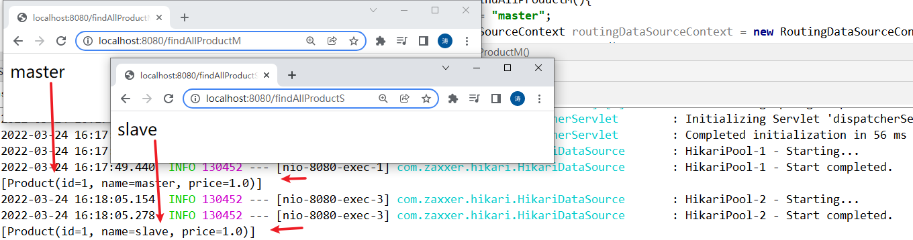

## 5.4 优化

以上代码是可行的，但是，需要读数据库的地方，就需要加上一大段 `RoutingDataSourceContext routingDataSourceContext = new RoutingDataSourceContext(key);` 代码，使用起来不方便。

想想，Spring 提供的声明式事务管理，就只需要一个 `@Transactional()`注解，放在某个 java 方法上，这个方法就自动具有了事务。

我们也可以编写一个类似的 `@RoutingWith("slaveDataSource")` 注解，放到某个 Controller 的方法上，这个方法内部就自动选择了对应的数据源。

```java
package com.turbo.config;

import java.lang.annotation.ElementType;
import java.lang.annotation.Retention;
import java.lang.annotation.RetentionPolicy;
import java.lang.annotation.Target;

@Target(ElementType.METHOD)
@Retention(RetentionPolicy.RUNTIME)
public @interface RoutingWith {

	String value() default "master";
}
```

编译前需要添加一个 Maven 依赖：

```xml
<dependency>
    <groupId>org.springframework.boot</groupId>
    <artifactId>spring-boot-starter-aop</artifactId>
</dependency>
```

切面类：

```java
package com.turbo.config;

import org.aspectj.lang.ProceedingJoinPoint;
import org.aspectj.lang.annotation.Around;
import org.aspectj.lang.annotation.Aspect;
import org.springframework.stereotype.Component;

@Aspect
@Component
public class RoutingAspect {

	@Around("@annotation(routingWith)")
	public Object routingWithDataSource(ProceedingJoinPoint joinPoint,
                                        RoutingWith routingWith) throws Throwable {
		final String key = routingWith.value();
		RoutingDataSourceContext routingDataSourceContext = 
            new RoutingDataSourceContext(key);
		return joinPoint.proceed();
	}
}

```

注意方法的第二个参数 `RoutingWith` 是 Spring 传入的注解实例，我们根据注解的 value() 获取配置的 key。

改造Controller 方法：

```java
@RoutingWith("master")
@RequestMapping("/findAllProductM")
public String findAllProductM(){
    //		String key = "master";
    //		RoutingDataSourceContext routingDataSourceContext = new RoutingDataSourceContext(key);
    productService.findAllProductM();
    return "master";
}

@RoutingWith("slave")
@RequestMapping("/findAllProductS")
public String findAllProductS(){
    //		String key = "slave";
    //		RoutingDataSourceContext routingDataSourceContext = new RoutingDataSourceContext(key);
    productService.findAllProductS();
    return "slave";
}
```

到此为止，我们就实现了用注解动态选择数据源的功能。

