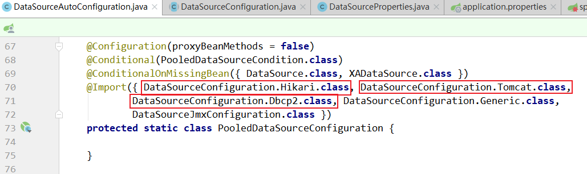

第三部分 SpringBoot数据访问

# 1 数据源自动配置源码剖析

## 1.1 数据源配置方式

### 1.1.1 选择数据库驱动的库文件

在 maven 中配置数据库驱动

```xml
<dependency>
    <groupId>mysql</groupId>
    <artifactId>mysql-connector-java</artifactId>
    <scope>runtime</scope>
</dependency>
```


### 1.1.2 配置数据库连接

在application.properties中配置数据库连接

```properties
# 数据库连接相关配置
spring.datasource.driver-class-name=com.mysql.cj.jdbc.Driver
spring.datasource.url=jdbc:mysql://152.136.177.192:3306/springboot_h?useUnicode=true&characterEncoding=utf-8&useSSL=true&serverTimezone=UTC
spring.datasource.username=root
spring.datasource.password=123456
```


### 1.1.3 配置 spring-boot-starter-jdbc

```xml
<dependency>
    <groupId>org.springframework.boot</groupId>
    <artifactId>spring-boot-starter-jdbc</artifactId>
</dependency>
```


### 1.1.4 编写测试类

```java
@RunWith(SpringRunner.class)
@SpringBootTest
class SpringBoot03DataaccessApplicationTests {

	@Autowired
	private DataSource dataSource;

	@Test
	void contextLoads() throws SQLException {
		final Connection connection = dataSource.getConnection();
		System.out.println(connection);
	}
}
```

结果：


## 1.2 连接池配置方式

### 1.2.1 选择数据库连接池的库文件

SpringBoot 提供了三种数据库连接池：

- HikariCP
- Commons DBCP2
- Tomcat JDBC Connection Pool

其中 SpringBoot 2.x 版本默认使用 HikariCP，Maven 中配置如下：

```xml
<dependency>
    <groupId>org.springframework.boot</groupId>
    <artifactId>spring-boot-starter-jdbc</artifactId>
</dependency>
```

如果不使用HikariCP，改用 Commons DBCP2 ，则配置如下：

```xml
<dependency>
    <groupId>org.springframework.boot</groupId>
    <artifactId>spring-boot-starter-jdbc</artifactId>
    <exclusions>
        <exclusion>
            <groupId>com.zaxxer</groupId>
            <artifactId>HikariCP</artifactId>
        </exclusion>
    </exclusions>
</dependency>
<dependency>
    <groupId>org.apache.commons</groupId>
    <artifactId>commons-dbcp2</artifactId>
</dependency>
```

如果不使用HikariCP，改用 Tomcat JDBC Connection Pool ，则配置如下：

```xml
<dependency>
    <groupId>org.springframework.boot</groupId>
    <artifactId>spring-boot-starter-jdbc</artifactId>
    <exclusions>
        <exclusion>
            <groupId>com.zaxxer</groupId>
            <artifactId>HikariCP</artifactId>
        </exclusion>
    </exclusions>
</dependency>
<dependency>
    <groupId>org.apache.tomcat</groupId>
    <artifactId>tomcat-jdbc</artifactId>
</dependency>
```

> 思考：为什么说SpringBoot默认使用的连接池类型时HikariCP，在哪里指定的？

## 1.3 数据源自动配置

spring.factories 中找到数据源的配置类：


```java
@Configuration(proxyBeanMethods = false)
@ConditionalOnClass({ DataSource.class, EmbeddedDatabaseType.class })
@EnableConfigurationProperties(DataSourceProperties.class)
@Import({ DataSourcePoolMetadataProvidersConfiguration.class, 
         DataSourceInitializationConfiguration.class })
public class DataSourceAutoConfiguration {

	@Configuration(proxyBeanMethods = false)
	@Conditional(EmbeddedDatabaseCondition.class)
	@ConditionalOnMissingBean({ DataSource.class, XADataSource.class })
	@Import(EmbeddedDataSourceConfiguration.class)
	protected static class EmbeddedDatabaseConfiguration {

	}

	@Configuration(proxyBeanMethods = false)
	@Conditional(PooledDataSourceCondition.class)
	@ConditionalOnMissingBean({ DataSource.class, XADataSource.class })
	@Import({ DataSourceConfiguration.Hikari.class, DataSourceConfiguration.Tomcat.class,
			DataSourceConfiguration.Dbcp2.class, DataSourceConfiguration.Generic.class,
			DataSourceJmxConfiguration.class })
	protected static class PooledDataSourceConfiguration {

	}
    // ...
}
```

@Conditional(PooledDataSourceCondition.class) 根据判断条件，实例化这个类，指定了配置文件中必须有 type 这个属性：


另外 SpringBoot 默认支持 type 类型设置的数据源：



```java
abstract class DataSourceConfiguration {

	@SuppressWarnings("unchecked")
	protected static <T> T createDataSource(DataSourceProperties properties, 
                                            Class<? extends DataSource> type) {
		return (T) properties.initializeDataSourceBuilder().type(type).build();
	}

	/**
	 * Tomcat Pool DataSource configuration.
	 * 2.0 之后默认不再使用 tomcat 连接池，或者使用 tomcat 容器
	 */
	@Configuration(proxyBeanMethods = false)
	// 如果导入 tomcat jdbc 连接池，则使用此连接池，在使用 tomcat 容器时候，或者导入此包时候
	@ConditionalOnClass(org.apache.tomcat.jdbc.pool.DataSource.class)
	@ConditionalOnMissingBean(DataSource.class)
	// 并且配置的时 org.apache.tomcat.jdbc.pool.DataSource 会采用 tomcat 连接池
	@ConditionalOnProperty(name = "spring.datasource.type", // name 用来从 application.properties中读取某个属性值
			havingValue = "org.apache.tomcat.jdbc.pool.DataSource", // 缺少该 property 时是否可以加载：如果true，没有该property也会正常加载；反之报错
			matchIfMissing = true) // 不管配不配置，都以 tomcat 连接池作为连接池 默认值 false
	static class Tomcat {

		// 给容器中加数据源
		@Bean
		@ConfigurationProperties(prefix = "spring.datasource.tomcat")
		org.apache.tomcat.jdbc.pool.DataSource dataSource(DataSourceProperties properties) {
			org.apache.tomcat.jdbc.pool.DataSource dataSource = createDataSource(properties,
					org.apache.tomcat.jdbc.pool.DataSource.class);
			DatabaseDriver databaseDriver = DatabaseDriver.fromJdbcUrl(properties.determineUrl());
			String validationQuery = databaseDriver.getValidationQuery();
			if (validationQuery != null) {
				dataSource.setTestOnBorrow(true);
				dataSource.setValidationQuery(validationQuery);
			}
			return dataSource;
		}
	}

	/**
	 * Hikari DataSource configuration.
	 * 2.0 之后默认使用 hikari 连接池
	 */
	@Configuration(proxyBeanMethods = false)
	@ConditionalOnClass(HikariDataSource.class)
	@ConditionalOnMissingBean(DataSource.class)
	@ConditionalOnProperty(name = "spring.datasource.type", 
                           havingValue = "com.zaxxer.hikari.HikariDataSource",
			matchIfMissing = true)
	static class Hikari {

		@Bean
		@ConfigurationProperties(prefix = "spring.datasource.hikari")
		HikariDataSource dataSource(DataSourceProperties properties) {
			HikariDataSource dataSource = createDataSource(properties, HikariDataSource.class);
			if (StringUtils.hasText(properties.getName())) {
				dataSource.setPoolName(properties.getName());
			}
			return dataSource;
		}
	}

	/**
	 * DBCP DataSource configuration.
	 * dbcp2 连接池
	 */
	@Configuration(proxyBeanMethods = false)
	@ConditionalOnClass(org.apache.commons.dbcp2.BasicDataSource.class)
	@ConditionalOnMissingBean(DataSource.class)
	@ConditionalOnProperty(name = "spring.datasource.type", 
                           havingValue = "org.apache.commons.dbcp2.BasicDataSource",
			matchIfMissing = true)
	static class Dbcp2 {

		@Bean
		@ConfigurationProperties(prefix = "spring.datasource.dbcp2")
		org.apache.commons.dbcp2.BasicDataSource dataSource(DataSourceProperties properties) {
			return createDataSource(properties, org.apache.commons.dbcp2.BasicDataSource.class);
		}
	}

	/**
	 * Generic DataSource configuration.
	 * 自定义连接池接口，spring.datasource.type
	 */
	@Configuration(proxyBeanMethods = false)
	@ConditionalOnMissingBean(DataSource.class)
	@ConditionalOnProperty(name = "spring.datasource.type")
	static class Generic {

		@Bean
		DataSource dataSource(DataSourceProperties properties) {
			// 创建数据源 initializeDataSourceBuilder DataSourceBuilder
			return properties.initializeDataSourceBuilder().build();
		}
	}
}
```

如果在类路径没有找到 jar 包，则会抛出异常：

> 

配置文件中没有指定数据源的时候，会根据注解判断，然后选择相应的实例化数据源对象。

```java
/**
* Hikari DataSource configuration.
* 2.0 之后默认使用 hikari 连接池
*/
@Configuration(proxyBeanMethods = false)
@ConditionalOnClass(HikariDataSource.class)
@ConditionalOnMissingBean(DataSource.class) // 注解判断是否执行初始化代码，即如果用户已经创建了bean，则相关的初始化代码不再执行
@ConditionalOnProperty(
    name = "spring.datasource.type", // 获取配置文件中的 type，如果为空返回 false                   
    havingValue = "com.zaxxer.hikari.HikariDataSource", // type 不为空则和 havingValue 对比，相同则true,否则false                   
    matchIfMissing = true) // 不管上面文件中是否匹配，默认都进行加载，默认值 false
static class Hikari {

    @Bean
    @ConfigurationProperties(prefix = "spring.datasource.hikari")
    HikariDataSource dataSource(DataSourceProperties properties) {
        // 创建数据源
        HikariDataSource dataSource = createDataSource(properties, HikariDataSource.class);
        if (StringUtils.hasText(properties.getName())) {
            dataSource.setPoolName(properties.getName());
        }
        return dataSource;
    }
}
```

createDataSource 方法：

```java
protected static <T> T createDataSource(DataSourceProperties properties, 
                                        Class<? extends DataSource> type) {
    // 使用 DataSourceBuilder 创建数据库，利用反射创建type数据源，然后绑定相关属性
    return (T) properties.initializeDataSourceBuilder().type(type).build();
}
```

DataSourceBuilder 类

设置 type

```java
public <D extends DataSource> DataSourceBuilder<D> type(Class<D> type) {
    this.type = type;
    return (DataSourceBuilder<D>) this;
}
```

根据设置选择type类型：

```java
private Class<? extends DataSource> getType() {
    // 如果没有配置 type 则为空 默认选择 findType
    Class<? extends DataSource> type = (this.type != null) ? this.type : findType(this.classLoader);
    if (type != null) {
        return type;
    }
    throw new IllegalStateException("No supported DataSource type found");
}
```

```java
public static Class<? extends DataSource> findType(ClassLoader classLoader) {
    for (String name : DATA_SOURCE_TYPE_NAMES) {
        try {
            return (Class<? extends DataSource>) ClassUtils.forName(name, classLoader);
        }
        catch (Exception ex) {
            // Swallow and continue
        }
    }
    return null;
}
```

数组 `DATA_SOURCE_TYPE_NAMES`：

```java
private static final String[] DATA_SOURCE_TYPE_NAMES = new String[] 
{ "com.zaxxer.hikari.HikariDataSource",
 "org.apache.tomcat.jdbc.pool.DataSource", 
 "org.apache.commons.dbcp2.BasicDataSource" };
```

取出来的第一个值就是 `com.zaxxer.hikari.HikariDataSource`，那么证实在没有指定 type 的情况下，默认类型为：`com.zaxxer.hikari.HikariDataSource`。


# 2 Druid连接池配置

## 2.1 整合效果实现

# 3 SpringBoot整合 Mybatis

## 3.1 整合效果实现

# 4 Mybatis 自动配置源码分析

# 5 SpringBoot + Mybatis 实现动态数据源切换

## 5.1 动态数据源介绍

## 5.2 环境准备

## 5.3 具体实现

### 5.3.1 配置多数据源

### 5.3.2 编写 RoutingDataSource

## 5.4 优化