第四部分 SpringBoot缓存深入

# 1 JSR 107

JSR 是 Java Specification Requests 的缩写，Java 规范请求，顾名思义提交Java规范，JSR-107 就是关于如何使用缓存的规范，是 Java 提供的一个接口规范，类似于 JDBC 规范，没有具体的实现，具体的实现就是 Redis 等这些缓存。

## 1.1 JSR 107 核心接口

Java Caching（JSR-107）定义了5个核心接口，分别是 CahcingProvider 、CacheManager、Cache、Entry、Expiry。

- CachingProvider（缓存提供者）：创建、配置、获取、管理和控制多个 CacheManager
- CacheManager（缓存管理器）：创建、配置、获取、管理和控制多个唯一命名的Cache，Cache存在于 CacheManager的上下文中。一个 CacheManager仅对应一个 CachingProvider。
- Cache（缓存）：是由 CacheManager管理的，CacheManager管理Cache的生命周期，Cache存在于 CacheManager 的上下文中，是一个类似 map 的数据结构，并临时存储以 key 为索引的值，一个 Cache 仅被一个 CacheManager所拥有。
- Entry（缓存键值对）是一个存储在 Cache 中的 key-value对。
- Expiry（缓存时效）：每一个存储在 Cache 中的条目都有一个定义的有效期。一旦超过这个时间，条目就自动过期，过期后，条目将不可访问、更新和删除操作。缓存有效期可以通过ExpiryPolicy设置。


## 1.2 JSR 107 图示

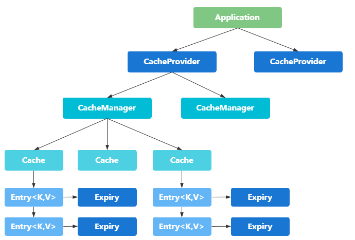

一个应用里面可以由多个缓存提供者（CachingProvider），一个缓存缓存提供者可以获取到多个缓存管理器（CacheManager），一个缓存管理器管理着不同的缓存（Cache），缓存中是一个个的缓存键值对（Entry），每个entry都有一个有效期（Expiry）。缓存管理器和缓存之间的关系有点类似于数据库中的连接池和连接的关系。

使用 JSR-107 需导入的依赖

```xml

```

在实际使用时，并不会使用 JSR-107 提供的接口，而是具体使用 Spring 提供的缓存抽象。

# 2 Spring 的缓存抽象

[Spring中cache的官方文档](https://docs.spring.io/spring-framework/docs/current/reference/html/integration.html#cache)

## 2.1 缓存抽象定义

Spring从3.1开始定义了 org.springframework.cache.Cache 和 org.springframework.cache.CacheManager 接口来统一不同的缓存技术；并支持使用 Java Caching （JSR-107）注解简化缓存开发。

Spring Cache 只负责维护抽象层，具体的实现由自己的技术选型来决定。将缓存处理和缓存技术解除耦合。

每次调用需要缓存功能的方法时，Spring会检查指定参数的指定的目标方法是否已经被调用过，如果有直接从缓存中获取方法调用后的结果，如果没有就调用方法并缓存结果返回给用户。下次调用直接从缓存中获取。

使用Spring缓存抽象时我们需要关注以下两点：

1. 确定哪些方法需要被缓存
2. 缓存策略

## 2.2 重要接口

- Cache：缓存抽象的规范接口，缓存实现有：RedisCache、EhCache、ConcurrentMapCache等。
- CacheManager：缓存管理器，管理 Cache 的声明周期

# 3 Spring 缓存使用

## 3.1 重要概念 缓存注解

案例实践之前，先介绍 Spring 提供的重要缓存及几个重要概念。

| 概念/注解      | 作用                                                         |
| -------------- | ------------------------------------------------------------ |
| Cache          | 缓存接口、定义缓存操作。实现有：RedisCache、EhCacheCache、ConcurrentMapCache 等 |
| CacheManager   | 缓存管理器，管理各种缓存（Cache）组件                        |
| @Cacheable     | 主要针对方法配置，能够根据方法的请求参数对其结果进行缓存     |
| @CacheEvict    | 清空缓存                                                     |
| @CachePut      | 保证方法被调用，又希望结果被缓存                             |
| @EnableCaching | 开启基于注解的缓存                                           |
| keyGenerator   | 缓存数据时 key 生成策略                                      |
| serialize      | 缓存数据时 value 序列化策略                                  |

**说明**：

1. @Cacheable 标注在方法上，表示该方法的结果需要被缓存起来，缓存的键由 keyGenerator 的策略决定，缓存的值的形式则由 serialize 序列化策略决定（序列化还是 json 格式）；标注上该注解之后，在缓存时效内再次调用该方法时将不会调用方法本身而是直接从缓存换取结果。
2. @CachePut 也标注在方法上，和 @Cacheable 相似也会将该方法的返回值缓存起来，不同的是标注 @CachePut 的方法每次都会被调用，而且每次都会将结果缓存起来，适用于对象的更新。

## 3.2 环境搭建

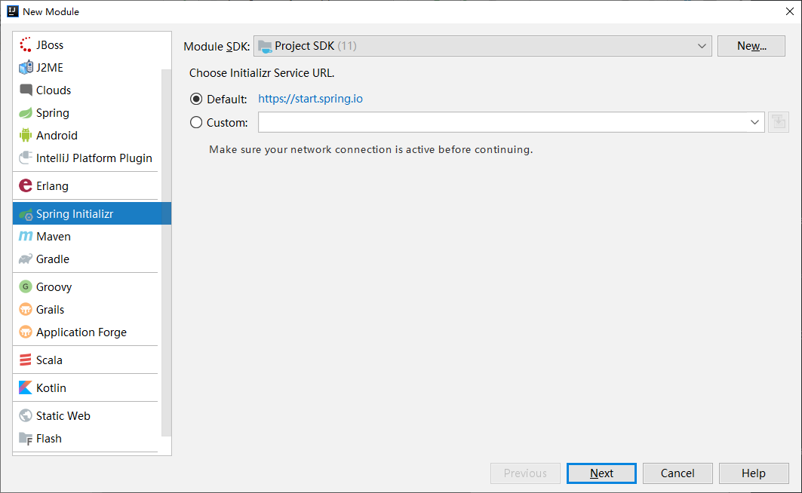

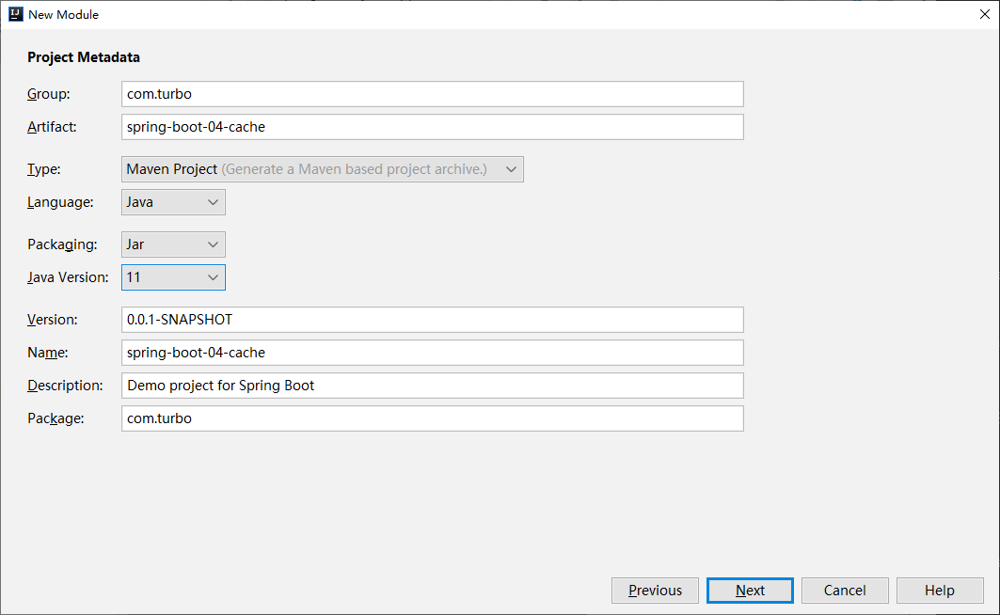

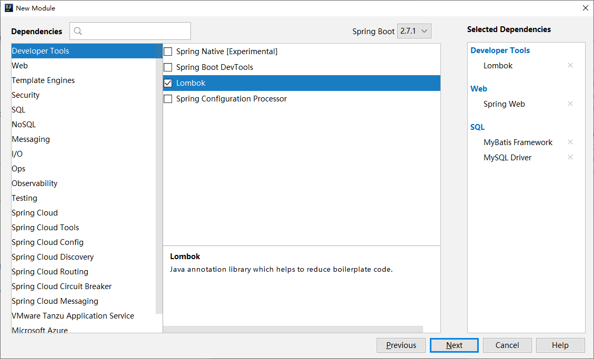

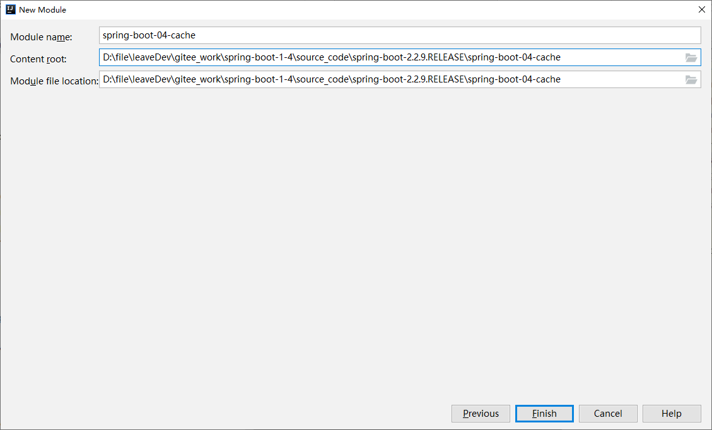

1. 创建 SpringBoot应用，选中 Mysql、Mybatis、Web 模块

2. 创建数据库

   ```sql
   DROP TABLE IF EXISTS `department`;
   
   CREATE TABLE `department` (
   	`id` INT (11) NOT NULL AUTO_INCREMENT,
   	`departmentName` VARCHAR (255) DEFAULT NULL,
   	PRIMARY KEY (`id`)
   ) ENGINE = INNODB DEFAULT CHARSET = utf8;
   
   DROP TABLE IF EXISTS `employee`;
   
   CREATE TABLE `employee` (
   	`id` INT (11) NOT NULL AUTO_INCREMENT,
   	`lastName` VARCHAR (255) DEFAULT NULL,
   	`email` VARCHAR (255) DEFAULT NULL,
   	`gender` INT (2) DEFAULT NULL,
   	`d_id` INT (11) DEFAULT NULL,
   	PRIMARY KEY (`id`)
   ) ENGINE = INNODB DEFAULT CHARSET = utf8;
   
   
   INSERT INTO `department` (`departmentName`) VALUES ('开发部');
   INSERT INTO `employee` (`lastName`, `email`, `gender`, `d_id`) VALUES (威廉', 'oath@gmail.com', '1', '1');
   ```

3. 创建表对应的实体Bean

   ```java
   package com.turbo.pojo;
   
   import lombok.Data;
   
   @Data
   public class Employee {
   	private Integer id;
   	private String lastName;
   	private String email;
   	//性别  1男  0女
   	private Integer gender;
   	private Integer dId;
   
   }
   ```

   ```java
   package com.turbo.pojo;
   
   import lombok.Data;
   
   @Data
   public class Department {
   	private Integer id;
   	private String departmentName;
   }
   ```

4. 整合Mybatis操作数据库

   数据源配置：驱动可以不写，SpringBoot会根据连接自动判断

   ```properties
   spring.datasource.url=jdbc:mysql://152.136.177.192:3306/turbine
   spring.datasource.username=root
   spring.datasource.password=123456
   #spring.datasource.driver-class-name=com.mysql.jdbc.Driver
   
   # 开启驼峰
   mybatis.configuration.map-underscore-to-camel-case=true
   ```

   使用注解版 Mybatis：使用@MapperScan指定mapper接口所在的包

   ```java
   package com.turbo;
   
   import org.mybatis.spring.annotation.MapperScan;
   import org.springframework.boot.SpringApplication;
   import org.springframework.boot.autoconfigure.SpringBootApplication;
   
   @SpringBootApplication
   @MapperScan("com.turbo.mappers")
   public class SpringBoot04CacheApplication {
   
   	public static void main(String[] args) {
   		SpringApplication.run(SpringBoot04CacheApplication.class, args);
   	}
   }
   ```

   创建对应的 mapper 接口

   ```java
   package com.turbo.mappers;
   
   import com.turbo.pojo.Employee;
   import org.apache.ibatis.annotations.Delete;
   import org.apache.ibatis.annotations.Insert;
   import org.apache.ibatis.annotations.Select;
   import org.apache.ibatis.annotations.Update;
   
   public interface EmployeeMapper {
   
   	@Select("select * from employee where id = #{id}")
   	public Employee getEmpById(Integer id);
   
   	@Insert("insert into employee (lastName,email,gender,d_id) VALUES (#{lastName},#{email},#{gender},#{d_id})")
   	public void insertEmp(Employee employee);
   
   	@Update({"update empolyee SET lastName = #{lastName},email = #{email},gender = #{gender},d_id=#{d_is}"})
   	public void updateEmp(Employee employee);
   
   	@Delete("delete from employee where id=#{id}")
   	public void deleteEmp(Integer id);
   }
   ```

   编写service：

   ```java
   package com.turbo.service;
   
   import com.turbo.mappers.EmployeeMapper;
   import com.turbo.pojo.Employee;
   import org.springframework.beans.factory.annotation.Autowired;
   import org.springframework.stereotype.Service;
   
   @Service
   public class EmployeeService {
   
   	@Autowired
   	private EmployeeMapper employeeMapper;
   
   
   	public Employee getEmpId(Integer id){
   		Employee employee = employeeMapper.getEmpById(id);
   		return employee;
   	}
   }
   ```

   编写Controller：

   ```java
   package com.turbo.controller;
   
   import com.turbo.pojo.Employee;
   import com.turbo.service.EmployeeService;
   import org.springframework.beans.factory.annotation.Autowired;
   import org.springframework.web.bind.annotation.GetMapping;
   import org.springframework.web.bind.annotation.PathVariable;
   import org.springframework.web.bind.annotation.RestController;
   
   @RestController
   public class EmployeeController {
   
   	@Autowired
   	EmployeeService employeeService;
   
   	@GetMapping("/emp/{id}")
   	public Employee getEmp(@PathVariable("id") Integer id){
   		return employeeService.getEmpId(id);
   	}
   }
   ```

5. 测试

   测试之前可以先配置一下 Logger日志，让控制台将SQL打印出来：

   ```properties
   logging.level.com.turbo.mappers=debug
   ```

   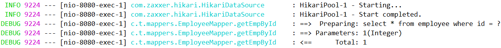

   结论：当前还没有看到缓存效果，因为还没有进行缓存的相关配置。

## 3.3 @Cacheable初体验

1. 开启基于注解的缓存功能：主启动类标注 @EnableCaching

   ```java
   @SpringBootApplication
   @MapperScan("com.turbo.mappers")
   @EnableCaching
   public class SpringBoot04CacheApplication {
   
   	public static void main(String[] args) {
   		SpringApplication.run(SpringBoot04CacheApplication.class, args);
   	}
   }
   ```

2. 标注缓存相关注解：@Cacheable、@CacheEvict、@CachePut

   @Cacheable：将方法运行的结果进行缓存，以后获取相同的数据时，直接从缓存中换取，不再调用方法。

   ```java
   @Cacheable(cacheNames = {"emp"})
   public Employee getEmpId(Integer id){
       Employee employee = employeeMapper.getEmpById(id);
       return employee;
   }
   ```

   

   

## 3.4 @Cacheable 注解的属性：

| 属性名           | 描述                                                         |
| ---------------- | ------------------------------------------------------------ |
| cacheNames/vlaue | 指定缓存的名字，缓存使用CacheManager管理多个缓存组件Cache，<br>这些Cache组件就是根据这个名字进行区分的。<br>对缓存的真正CRUD操作在Cache中定义，<br>每个缓存组件Cache都有自己唯一的名字，通过cacheNames或者value属性指定，<br>相当于是将缓存的键值对进行分组，缓存的名字是一个数组，<br>也就是说可以将一个缓存键值对分到多个组里面。 |
| key              | 缓存数据时的key值，默认是使用方法参数的值，可以使用 SpEL表达式计算key的值 |
| keyGenerator     | 缓存的生成策略，和key二选一，都是生成键的，keyGenerator可自定义。 |
| cacheManager     | 指定缓存管理器（如 ConcurrentHashMap、Redis等）              |
| cacheResolver    | 和cacheManager功能一样，和cacheManager二选一                 |
| condition        | 指定缓存的条件（**满足什么条件时才缓存**），可用SpEL表达式（如#id>0，表示当入参id大于0时才缓存） |
| unless           | 否定缓存，**即满足unless指定的条件时，方法的结果不进行缓存**，使用unless时可以在调用的方法获取到结果之后再进行判断（如#result==null，表示如果结果为null时不缓存） |
| sync             | 是否使用异步模式进行缓存                                     |

**注意**：**既满足condition又满足unless条件的也不进行缓存**，**使用异步模式进行缓存时 (sync=true):unless条件将不被支持**

可用的[SpEL表达式](https://docs.spring.io/spring-framework/docs/current/reference/html/integration.html#cache-spel-context)见下表：

| 名字          | 位置               | 描述                                                         | 示例                 |
| ------------- | ------------------ | ------------------------------------------------------------ | -------------------- |
| methodName    | root object        | 当前被调用的方法名                                           | #root.methodName     |
| method        | root object        | 当前被调用的方法                                             | #root.method.name    |
| target        | root object        | 当前被调用的目标对象                                         | #root.target         |
| targetClass   | root object        | 当前被调用的目标对象类                                       | #root.targetClass    |
| args          | root object        | 当前被调用的方法的参数列表                                   | #root.args[0]        |
| caches        | root object        | 当前方法调用使用的缓存列表，<br>(如 @Cacheable=(value={"cache1","cache2"}))，<br>则有两个cache | #root.caches[0].name |
| argument name | Evaluation context | 方法参数的名字，可以直接 `#参数名`，<br>也可以使用 `#p0` 或 `#a0` 的形式，0代表参数的索引 | #iban、#a0、#p0      |
| result        | Evaluation context | 方法执行后的返回值（仅当方法执行之后的判断有效，<br>如 "unless","cache put" 的表达式，<br>"cache evict" 的表达式 beforeInvocation=false） | #result              |


# 4 缓存自动配置原理源码剖析

在 SpringBoot 中所有的自动配置类都是 `...AutoConfiguration` 所以我们去搜 `CacheAutoConfiguration` 在这个类中有一个静态内部类 `CacheConfigurationImportSelector` 它有一个 `selectImports` 方法是用来给容器中添加一些缓存要用的组件；

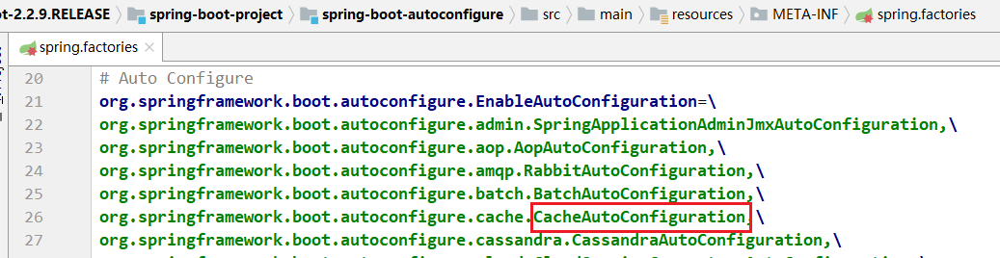

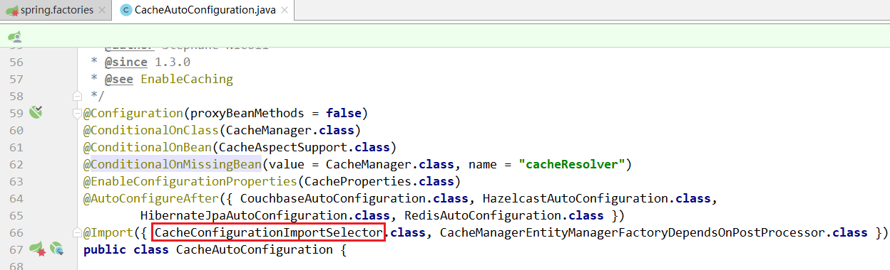

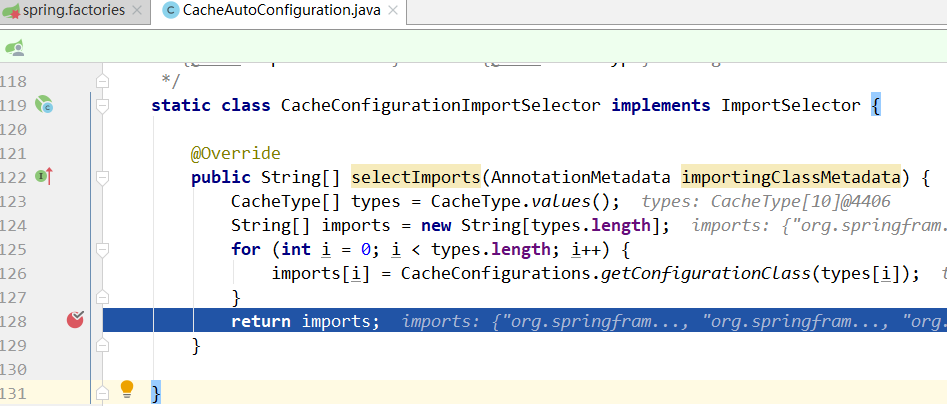

在这里打上断点，debug调试一下看看 `imports` 中有哪些缓存组件：

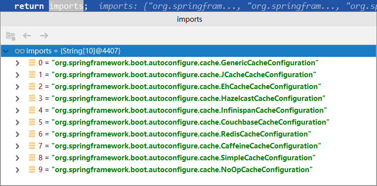

可以看到这里总共有十个缓存组件；随便去看一个会发现在它的注解上表明了什么时候使用这个组件：

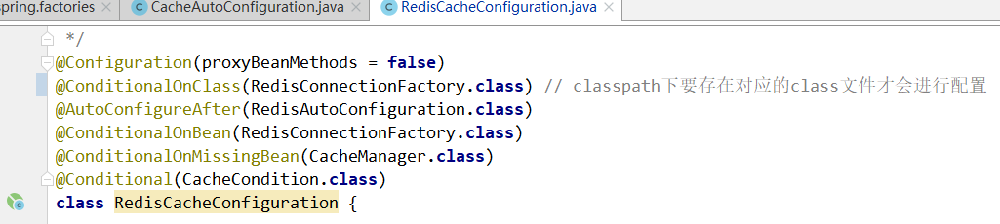

是个缓存组件，最终发现只有 `SimpleCacheConfiguration` 是被使用的，所以也就说明默认情况下使用 `SimpleCacheConfiguration` ；

然后进入到 `SimpleCacheConfiguration`  中：

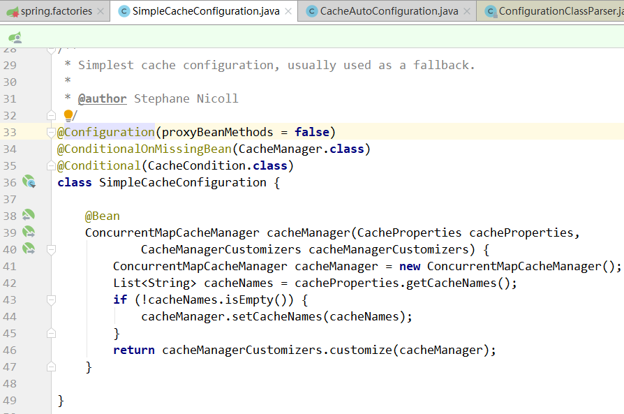

发现它给SpringBoot容器添加了一个 bean，是一个 `CacheManager`;

`ConcurrentMapCacheManager` 实现了 `CacheManager`接口，再来看 `ConcurrentMapCacheManager` 的 getCache 方法：

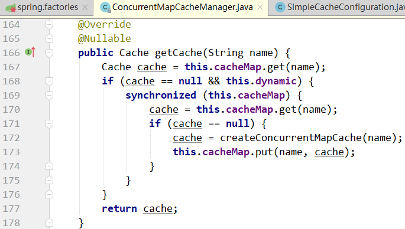

`getCache` 方法使用了 **双重锁校验**（这样验证机制一般是用在单例模式中）

可以看到如果没有 `Cache` 会调用 `cache = createConcurrentMapCache(name);`

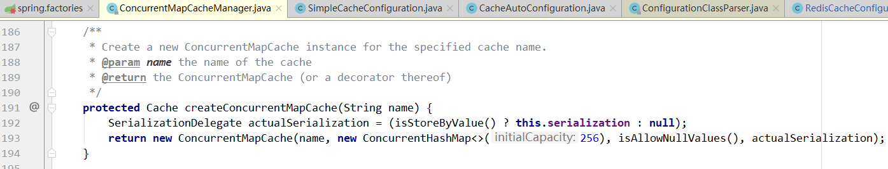

这个方法会创建一个 `ConcurrentMapCache` 这个就是我们说的 `Cache`；


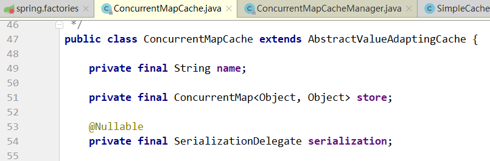

在这个类里面有这样三个属性；

`private final ConcurrentMap<Object, Object> store;` 这个就是前文中的 `Entry` 用来存放键值对；

在 `ConcurrentMapCache` 中我们会看到一些操作 `Cache` 的方法，选几个重要的：

```java
@Override
@Nullable
protected Object lookup(Object key) {
    return this.store.get(key);
}
```

`lookup`方法是根据 key 来找 value 的；


```java
@Override
public void put(Object key, @Nullable Object value) {
    this.store.put(key, toStoreValue(value));
}
```

`put`方法顾名思义是用来添加键值对的；

到这里基本上就结束了，接下来我们详细分析一下 `@Cacheable`注解。

# 5 @Cacheable 源码分析

我们在上述的两个方法上打上断点；debug运行SpringBoot；访问 getEmp 接口；

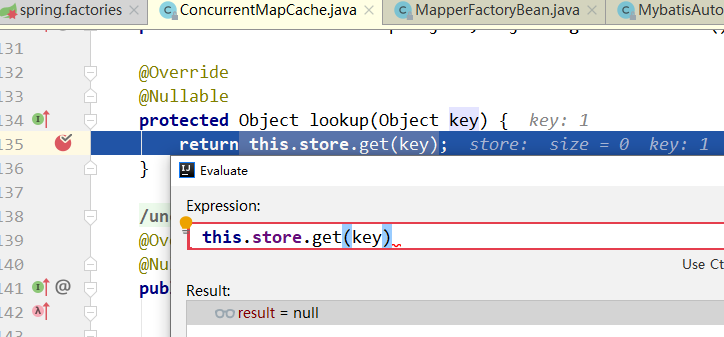

发现它来到 `lookup` 方法这里，说明注解的执行在被注解的方法前，然后这里我们会返回 null；

放行到下一个注解会发现，调用了 put 方法：

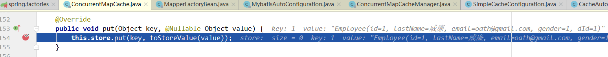

添加了Cache；然后我们第二次对 getEmp 接口发起请求，会发现这一次缓存内容不再为 null：

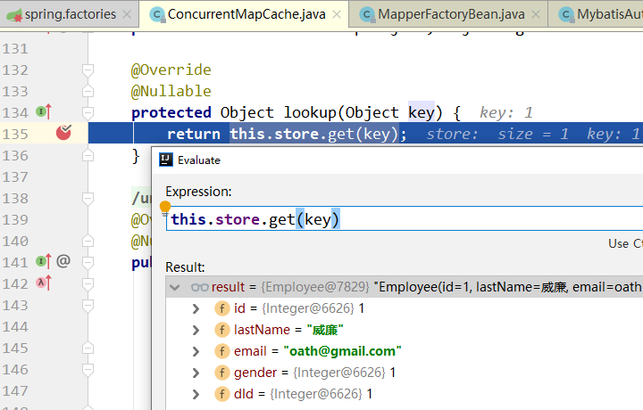


@Cacheable  运行流程：

1. 方法运行之前，先去查询 Cache（缓存组件），按照cacheNames 指定的名字获取（CacheManager 先获取相应的缓存，第一次获取缓存如果没有 Cache 组件会自动创建）

2. 去Cache中查找缓存的内容，使用的 key 默认就是方法的参数：

   key 默认是使用 keyGenerator 生成的，默认使用的是 SimpleKeyGenerator

   SimpleKeyGenerator 生成 key 的默认策略是：

   - 如果没有参数：key = new SimpleKey();
   - 如果有一个参数：key = 参数的值
   - 如果有多个参数：key = new SimpleKey(params);

3. 没有查到缓存就调用目标方法

4. 将目标方法返回的结果放进缓存中

**总结**：@Cacheable 标注的方法在执行之前会先检查缓存中有没有这个数据，默认按照参数的值为 key 查询缓存，如果没有就运行方法并将结果放入缓存，以后再来调用时直接使用缓存中的数据。


**核心**：

1. 使用 CacheManager(ConcurrentMapCacheManager) 按照名字得到 Cache(ConcurrentMapCache)组件；
2. key使用 keyGenerator 生成，默认使用 SimpleKeyGenerator

# 6 @CahcePut、@CacheEvict、@CacheConfig

## 6.1 @CachePut

1. 说明：既调用方法，又更新缓存数据，一般用于更新操作；在更新缓存时一定要和想要更新的缓存有相同的缓存名称和相同的key（可类比同一张表的同一条数据）

2. 运行时机：

   - 先调用目标方法
   - 将目标方法的结果缓存起来

3. 示例

   ```java
   @CachePut(value = "emp",key = "#employee.id")
   public Employee updateEmp(Employee employee){
       employeeMapper.updateEmp(employee);
       return employee;
   }
   ```

**总结**：@CachePut 标注的方法总会被调用，且调用之后才会将结果放入缓存，因此可以使用 #result 获取到方法的返回值。

## 6.2 @CacheEvict

1. 说明：缓存清除，清除缓存时要知名缓存的名字和key，相当于告诉数据库要删除哪个表中的哪条数据，key 默认为参数的值。

2. 属性：

   - value/cacheNames： 缓存的名字
   - key：缓存的键
   - allEntries：是否清除指定缓存中的所有键值对，默认为 false，设置为 true 时，会清除缓存中的所有键值对，与 key 属性二选一使用。
   - beforeInvocation：在@CacheEvict 注解的方法调用之前清除指定缓存，默认为 false（即在方法调用之后清除缓存），设置为true时则会在方法调用之前清除缓存（在方法调用之前还是之后清除缓存的区别在于方法调用时是否会出现异常，若不出现异常，这两种设置没有区别；若出现异常，设置为在方法调用之后清除缓存将不起作用，因为方法调用失败了）。

3. 示例：

   ```java
   @CacheEvict(value = "emp",key = "#id",beforeInvocation = true)
   public void delEmp(Integer id){
       employeeMapper.deleteEmp(id);
   }
   ```

   

## 6.3 @CacheConfig

1. 作用：标注在类上，抽取缓存相关注解的公共配置，可抽取的公共配置有缓存名字、主键生成器等（如注解中的属性所示）

   ```java
   @Target(ElementType.TYPE)
   @Retention(RetentionPolicy.RUNTIME)
   @Documented
   public @interface CacheConfig {
   
   	String[] cacheNames() default {};
   
   	String keyGenerator() default "";
   
   	String cacheManager() default "";
   
   	String cacheResolver() default "";
   }
   ```

2. 示例：

   通过 @CacheConfig 的 cacheNames 属性指定缓存的名字之后，该类中的其他缓存注解就不必再写 value 或者 cacheNames 了，会使用该名字作为 value 或 cacheNames 的值，当然也遵循就近原则。

   ```java
   @CacheConfig(cacheNames = {"emp"})
   @Service
   public class EmployeeService {
   
   	@Autowired
   	private EmployeeMapper employeeMapper;
   
   
   	@Cacheable()
   	public Employee getEmpId(Integer id){
   		Employee employee = employeeMapper.getEmpById(id);
   		return employee;
   	}
   
   	@CachePut(key = "#employee.id",unless = "#result==null")
   	public Employee updateEmp(Employee employee){
   		employeeMapper.updateEmp(employee);
   		return employee;
   	}
   
   	@CacheEvict(key = "#id",beforeInvocation = true)
   	public void delEmp(Integer id){
   		employeeMapper.deleteEmp(id);
   	}
   }
   ```

   

# 7 基于Redis的缓存实现

SpringBoot 默认开启的缓存管理器是 **ConcurrentMapCacheManager** ，创建缓存组件是 ConcurrentMapCache，将缓存数据保存在一个个 ConcurrentMap<Object, Object> 中。

开发时我们可以使用缓存中间件：redis、memcache、ehcache 等，这些缓存中间件的启用很简单 —— 只要向容器中加入相关的 bean 就会启用，可以启用多个缓存中间件。

## 7.1 安装启动Redis

## 7.2 整合Redis

1. 引入Redis的starter

   ```java
   <dependency>
       <groupId>org.springframework.boot</groupId>
       <artifactId>spring-boot-starter-data-redis</artifactId>
       </dependency>
   ```

   引入Redis的starter之后，会在容器中加入redis相关的一些 bean，其中有两个和操作 redis 相关：

   RedisTemplate 和 StringRedisTemplate（用来操作字符串：key 和 value 都是字符串），template 中封装了操作各种数据类型的操作（stringRedisTemple.opsForValue()、stringRedisTemple.opsForList() 等 ）。

   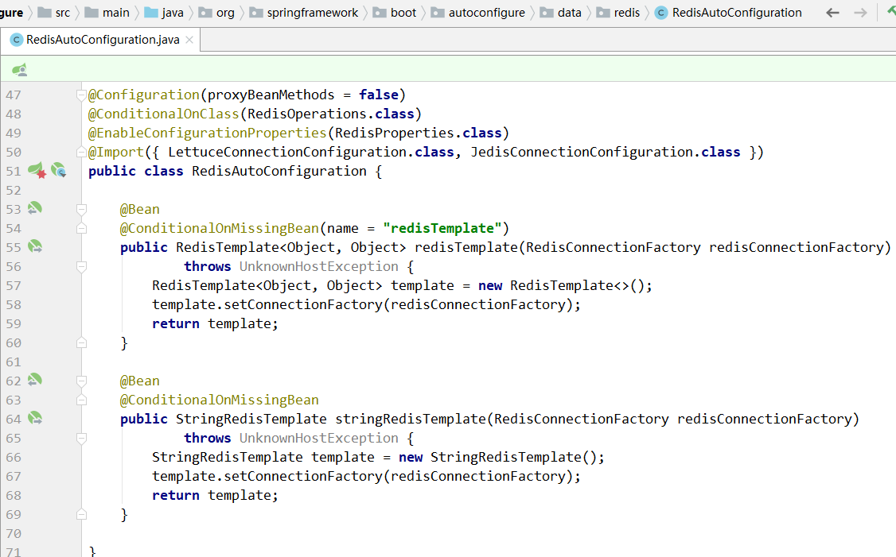

2. 配置 redis：只要配置redis的主机地址（端口号默认为 6379，因此可以不指定）

   ```properties
   spring.redis.host=152.136.177.192
   ```

3. 测试：

   访问：http://localhost:8080/emp/1

   使用 redis 存储对象时，该对象必须可序列化（实现 Serializable 接口），否则报错。由于序列化的原因：键值对变成了另外一种形式。

   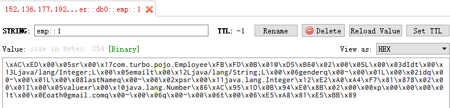

   SpringBoot默认采用的是 JDK 的对象序列化方式，可以切换为使用 JSON 格式进行对象的序列化操作，这时需要自定义序列化规则（当然也可以使用 Json 工具先将对象转化为 Json 格式之后再保存至 redis，这样就无需自定义序列化）。

# 8 自定义 RedisCacheManager

## 8.1 Redis注解默认序列化机制

打开 SpringBoot 整合 Redis 组件提供的缓存自动配置类：RedisCacheConfiguration （org.springframework.boot.autoconfigure.cache 包下），查看该类的源码信息，其核心代码如下：

```java
@Configuration(proxyBeanMethods = false)
@ConditionalOnClass(RedisConnectionFactory.class) // classpath下要存在对应的class文件才会进行配置
@AutoConfigureAfter(RedisAutoConfiguration.class)
@ConditionalOnBean(RedisConnectionFactory.class)
@ConditionalOnMissingBean(CacheManager.class)
@Conditional(CacheCondition.class)
class RedisCacheConfiguration {

	@Bean
	RedisCacheManager cacheManager(CacheProperties cacheProperties, CacheManagerCustomizers cacheManagerCustomizers,
			ObjectProvider<org.springframework.data.redis.cache.RedisCacheConfiguration> redisCacheConfiguration,
			ObjectProvider<RedisCacheManagerBuilderCustomizer> redisCacheManagerBuilderCustomizers,
			RedisConnectionFactory redisConnectionFactory, ResourceLoader resourceLoader) {
		RedisCacheManagerBuilder builder = RedisCacheManager.builder(redisConnectionFactory).cacheDefaults(
				determineConfiguration(cacheProperties, redisCacheConfiguration, resourceLoader.getClassLoader()));
		List<String> cacheNames = cacheProperties.getCacheNames();
		if (!cacheNames.isEmpty()) {
			builder.initialCacheNames(new LinkedHashSet<>(cacheNames));
		}
		redisCacheManagerBuilderCustomizers.orderedStream().forEach((customizer) -> customizer.customize(builder));
		return cacheManagerCustomizers.customize(builder.build());
	}

	private org.springframework.data.redis.cache.RedisCacheConfiguration determineConfiguration(
			CacheProperties cacheProperties,
			ObjectProvider<org.springframework.data.redis.cache.RedisCacheConfiguration> redisCacheConfiguration,
			ClassLoader classLoader) {
		return redisCacheConfiguration.getIfAvailable(() -> createConfiguration(cacheProperties, classLoader));
	}

	private org.springframework.data.redis.cache.RedisCacheConfiguration createConfiguration(
			CacheProperties cacheProperties, ClassLoader classLoader) {
		Redis redisProperties = cacheProperties.getRedis();
		org.springframework.data.redis.cache.RedisCacheConfiguration config = org.springframework.data.redis.cache.RedisCacheConfiguration
				.defaultCacheConfig();
		config = config.serializeValuesWith(
				SerializationPair.fromSerializer(new JdkSerializationRedisSerializer(classLoader)));
		if (redisProperties.getTimeToLive() != null) {
			config = config.entryTtl(redisProperties.getTimeToLive());
		}
		if (redisProperties.getKeyPrefix() != null) {
			config = config.prefixKeysWith(redisProperties.getKeyPrefix());
		}
		if (!redisProperties.isCacheNullValues()) {
			config = config.disableCachingNullValues();
		}
		if (!redisProperties.isUseKeyPrefix()) {
			config = config.disableKeyPrefix();
		}
		return config;
	}
}
```

从上述核心源码中可以看出，RedisCacheConfiguration 内部同样通过 Redis 连接工厂 RedisConnectionFactory 定义了一个缓存管理器 RedisCacheManager；同时定制 RedisCacheManager 时，也默认使用了 JdkSerializationRedisSerializer 序列化方式。

如果想要使用自定义序列化方式的 RedisCacheManager 进行数据缓存操作，可以参考上述核心代码，创建一个名为 cacheManager 的 Bean 组件，并在该组件中设置对应的序列化方式即可。

## 8.2 自定义RedisCacheManager

在项目的Redis配置类 RedisConfig 中，按照上一步分析的自定义 定制名为 cacheManager 的 Bean 组件。

```java
@Configuration
public class RedisConfig {

	@Bean
	public RedisCacheManager cacheManager(RedisConnectionFactory redisConnectionFactory){
		// 分别创建String和JSON格式序列化对象，对缓存数据key和value进行转换
		StringRedisSerializer stringRedisSerializer = new StringRedisSerializer();
		Jackson2JsonRedisSerializer jsonRedisSerializer = new Jackson2JsonRedisSerializer(Object.class);
		// 解决查询缓存转换异常的问题
		ObjectMapper om = new ObjectMapper();
		om.setVisibility(PropertyAccessor.ALL, JsonAutoDetect.Visibility.ANY);
		om.enableDefaultTyping(ObjectMapper.DefaultTyping.NON_FINAL);
		jsonRedisSerializer.setObjectMapper(om);
		// 定制缓存数据序列化方式及时效
		RedisCacheConfiguration config = RedisCacheConfiguration.defaultCacheConfig()
				.entryTtl(Duration.ofDays(1)) //缓存数据的有效期为1天
				.serializeKeysWith(RedisSerializationContext.SerializationPair.fromSerializer(stringRedisSerializer)) //key的序列化方式为String
				.serializeValuesWith(RedisSerializationContext.SerializationPair.fromSerializer(jsonRedisSerializer)) // value的序列化方式为json
				.disableCachingNullValues();
		RedisCacheManager cacheManager = RedisCacheManager.builder(redisConnectionFactory).cacheDefaults(config).build();
		return cacheManager;


	}
}
```


上述代码中，在RedisConfig配置类中使用 @Bean 注解注入了一个默认名称为方法的 cacheManager 组件。在定义的 Bean 组件中，通过 RedisCacheConfiguration 对缓存数据的key和value分别进行了序列化方式的定制，其中缓存数据的key定制为 StringRedisSerializer （即 String 格式），而 value 定制为 Jackson2JsonRedisSerializer（即JSON格式），同时还使用 entryTtl(Duration.ofDays(1))  方法将缓存数据有效期设置为 1 天。

完成基于注解的Redis缓存管理器 RedisCacheManager 定制后，可以对缓存管理器的效果进行测试（使用自定义序列化机制的 RedisCacheManager测试时，实体类可以不用实现序列化接口）。

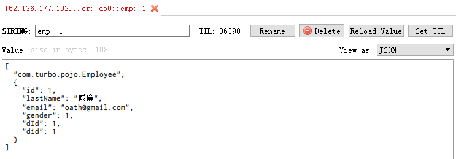