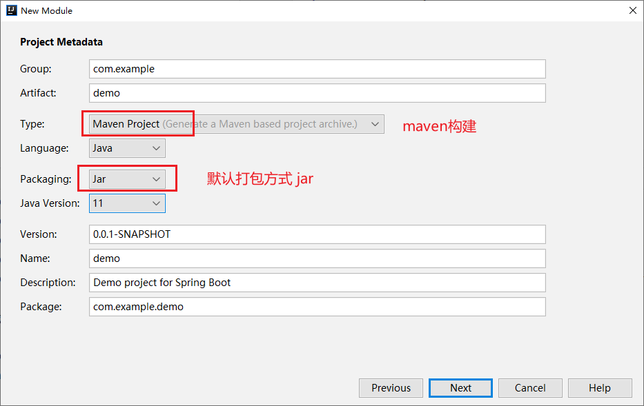
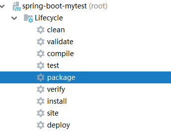
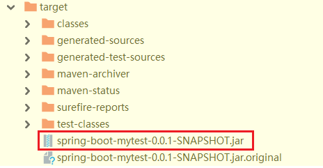
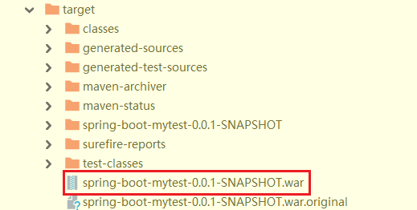

> 第五部分 SpringBoot部署与监控

# 1 SpringBoot 项目部署

目前，前后端分离的架构已成主流，而使用SpringBoot构建Web应用是非常快速的，项目发布到服务器上的时候，只需要打成一个 jar 包，然后通过命令：java -jar xxx.jar ，即可启动服务了。

## 1.1 jar包（官方推荐）

SpringBoot 项目默认打包称 jar 包



> jar 包方式启动，也就是使用 SpringBoot 内置的 tomcat 运行。服务器上面只要你配置了 jdk1.8 及以上就可以，不需要外置 tomcat。

**SpringBoot将项目打包成 jar 包**

1. 首先在 pom.xml 文件中导入 Springboot 的 maven 依赖

   ```xml
   <!--将应用打包成一个可以执行的 jar 包-->
   <build>
       <plugins>
           <plugin>
               <groupId>org.springframework.boot</groupId>
               <artifactId>spring-boot-maven-plugin</artifactId>
           </plugin>
       </plugins>
   </build>
   ```

2. 执行 package

   

3. package 完成之后，target 中会生成一个 .jar 包

   

4. 可以将 jar 包上传到 Linux 服务器上，以jar 运行（此处本地验证打包成功）

   ```bash
   java -jar spring-boot-mytest-0.0.1-SNAPSHOT.jar
   ```

   

## 1.2 war 包

> 传统的部署方式：将项目打成 war 包，放入 tomcat 的 webapps 目录下，启动 tomcat ，即可访问。

SpringBoot 项目改造打包成 war 的流程

1. pom.xml 配置修改

   ```xml
   <packaging>jar</packaging>
   // 修改为
   <packaging>war</packaging>
   ```

2. pom 添加如下依赖

   ```xml
   <dependency>
       <groupId>javax.servlet</groupId>
       <artifactId>javax.servlet-api</artifactId>
       <scope>provided</scope>
   </dependency>
   ```

3. 排除 springboot内置tomcat干扰

   ```xml
   <dependency>
       <groupId>org.springframework.boot</groupId>
       <artifactId>spring-boot-starter-web</artifactId>
       <exclusions>
           <exclusion>
               <groupId>org.springframework.boot</groupId>
               <artifactId>spring-boot-starter-tomcat</artifactId>
           </exclusion>
       </exclusions>
   </dependency>
   ```

4. 改造启动类

   ```bash
   如果是war包发布，需要增加SpringBootServletInitializer子类，并重写其 configure 方法，
   或者将main函数所在的类继承SpringBootServletInitializer，并重写 configure方法。
   
   否则打包为 war 时 上传到 tomcat服务器中访问项目始终报404，就是忽略这个步骤 ！！！
   ```

   改造之前

   ```java
   @SpringBootApplication // 能够扫描 Spring 组件并自动配置 Spring Boot
   public class SpringBootMytestApplication {
   
   	public static void main(String[] args) {
   		SpringApplication.run(SpringBootMytestApplication.class, args);
   	}
   }
   ```

   改造之后：

   ```java
   @SpringBootApplication // 能够扫描 Spring 组件并自动配置 Spring Boot
   public class SpringBootMytestApplication extends SpringBootServletInitializer {
   
   	public static void main(String[] args) {
   		SpringApplication.run(SpringBootMytestApplication.class, args);
   	}
   
   	@Override
   	protected SpringApplicationBuilder configure(SpringApplicationBuilder builder) {
   		// 注意这里要指向原先用main方法执行的 Application 启动类
   		return builder.sources(SpringBootMytestApplication.class);
   	}
   }
   ```

   这种改造方式也是官方比较推荐的方法

5. pom文件中不要忘记maven编译插件

   ```xml
   <build>
       <plugins>
           <plugin>
               <groupId>org.springframework.boot</groupId>
               <artifactId>spring-boot-maven-plugin</artifactId>
           </plugin>
       </plugins>
   </build>
   ```

6. 在IDEA中使用 mvn clean 清除旧的包，并使用 mvn package 生成新的 war 包

   

   执行完毕后，可以看到 war 包已经生成了，默认是在 target 目录下，位置可以在 pom 文件中进行配置：

   

7. 使用外部 tomcat 运行该 war 文件（放入 tomcat 的 webapps 目录下，启动 tomcat ）


**注意事项**：

> 将项目打成 war 包，部署到外部的 tomcat 中，这个时候，不能直接访问 springboot 项目中配置文件配置的端口号。<br>application.yml中配置的server.port配置的是springboot内置的tomcat的端口号，打成war部署在独立的tomcat上之后，配置的server.port是不起作用的。

## 1.3 jar 包 和 war 包 方式对比

## 1.4 多环境部署

### 1.4.1 @Profile

#### 1.4.1.1 @Profile 的使用位置

#### 1.4.1.2 profile激活

### 1.4.2 多Profile的资源文件

#### 1.4.2.1 资源配置文件

#### 1.4.2.2 效果

### 1.4.3 Spring Profile 和 Maven Profile 融合

# 2 SpringBoot 监控