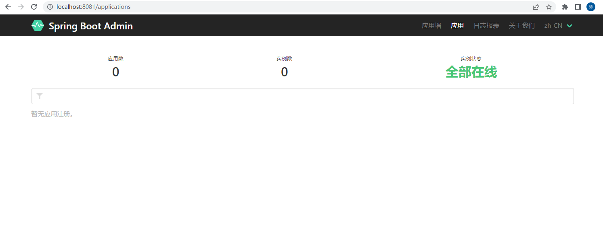

> 第五部分 SpringBoot部署与监控

# 1 SpringBoot 项目部署

目前，前后端分离的架构已成主流，而使用SpringBoot构建Web应用是非常快速的，项目发布到服务器上的时候，只需要打成一个 jar 包，然后通过命令：java -jar xxx.jar ，即可启动服务了。

## 1.1 jar包（官方推荐）

[Creating an Executable Jar 官网说明](https://docs.spring.io/spring-boot/docs/current/reference/html/getting-started.html#getting-started.first-application.executable-jar)

SpringBoot 项目默认打包称 jar 包


> jar 包方式启动，也就是使用 SpringBoot 内置的 tomcat 运行。服务器上面只要你配置了 jdk1.8 及以上就可以，不需要外置 tomcat。

**SpringBoot将项目打包成 jar 包**

1. 首先在 pom.xml 文件中导入 Springboot 的 maven 依赖

   ```xml
   <!--将应用打包成一个可以执行的 jar 包-->
   <build>
       <plugins>
           <plugin>
               <groupId>org.springframework.boot</groupId>
               <artifactId>spring-boot-maven-plugin</artifactId>
           </plugin>
       </plugins>
   </build>
   ```

2. 执行 package

   

3. package 完成之后，target 中会生成一个 .jar 包

   

4. 可以将 jar 包上传到 Linux 服务器上，以jar 运行（此处本地验证打包成功）

   ```bash
   java -jar spring-boot-mytest-0.0.1-SNAPSHOT.jar
   ```

   

## 1.2 war 包

> 传统的部署方式：将项目打成 war 包，放入 tomcat 的 webapps 目录下，启动 tomcat ，即可访问。

SpringBoot 项目改造打包成 war 的流程

1. pom.xml 配置修改

   ```xml
   <packaging>jar</packaging>
   // 修改为
   <packaging>war</packaging>
   ```

2. pom 添加如下依赖

   ```xml
   <dependency>
       <groupId>javax.servlet</groupId>
       <artifactId>javax.servlet-api</artifactId>
       <scope>provided</scope>
   </dependency>
   ```

3. 排除 springboot内置tomcat干扰

   ```xml
   <dependency>
       <groupId>org.springframework.boot</groupId>
       <artifactId>spring-boot-starter-web</artifactId>
       <exclusions>
           <exclusion>
               <groupId>org.springframework.boot</groupId>
               <artifactId>spring-boot-starter-tomcat</artifactId>
           </exclusion>
       </exclusions>
   </dependency>
   ```

4. 改造启动类

   ```bash
   如果是war包发布，需要增加SpringBootServletInitializer子类，并重写其 configure 方法，
   或者将main函数所在的类继承SpringBootServletInitializer，并重写 configure方法。
   
   否则打包为 war 时 上传到 tomcat服务器中访问项目始终报404，就是忽略这个步骤 ！！！
   ```

   改造之前

   ```java
   @SpringBootApplication // 能够扫描 Spring 组件并自动配置 Spring Boot
   public class SpringBootMytestApplication {
   
   	public static void main(String[] args) {
   		SpringApplication.run(SpringBootMytestApplication.class, args);
   	}
   }
   ```

   改造之后：

   ```java
   @SpringBootApplication // 能够扫描 Spring 组件并自动配置 Spring Boot
   public class SpringBootMytestApplication extends SpringBootServletInitializer {
   
   	public static void main(String[] args) {
   		SpringApplication.run(SpringBootMytestApplication.class, args);
   	}
   
   	@Override
   	protected SpringApplicationBuilder configure(SpringApplicationBuilder builder) {
   		// 注意这里要指向原先用main方法执行的 Application 启动类
   		return builder.sources(SpringBootMytestApplication.class);
   	}
   }
   ```

   这种改造方式也是官方比较推荐的方法

5. pom文件中不要忘记maven编译插件

   ```xml
   <build>
       <plugins>
           <plugin>
               <groupId>org.springframework.boot</groupId>
               <artifactId>spring-boot-maven-plugin</artifactId>
           </plugin>
       </plugins>
   </build>
   ```

6. 在IDEA中使用 mvn clean 清除旧的包，并使用 mvn package 生成新的 war 包

   

   执行完毕后，可以看到 war 包已经生成了，默认是在 target 目录下，位置可以在 pom 文件中进行配置：

   

7. 使用外部 tomcat 运行该 war 文件（放入 tomcat 的 webapps 目录下，启动 tomcat ）

   


**注意事项**：

> 将项目打成 war 包，部署到外部的 tomcat 中，这个时候，不能直接访问 springboot 项目中配置文件配置的端口号。<br>application.yml中配置的server.port配置的是springboot内置的tomcat的端口号，打成war部署在独立的tomcat上之后，配置的server.port是不起作用的。

## 1.3 jar 包 和 war 包 方式对比

1. SpringBoot项目打包成 jar 与 war ，对比两种打包方式：

   jar 更加简单，使用 java -jar xxx.jar 就可以启动。所以打成 jar 包最多。

   而 war 包可以部署到 tomcat 的 webapps 中，随 tomcat 的启动而启动。

   具体使用哪种方式，应视应用场景而定

2. 打 jar 时不会把 src/main/webapp 下面的内容打到 jar 包中。

3. 打成什么文件包进行部署与业务有关，就像提供 rest 服务的项目需要打包成 jar 文件，用命令行很方便。而有大量 css、js、html，且需要经常改动的项目，打成 war 包运行比较方便，因为改动静态资源文件可以直接覆盖，很快看到改动后的效果，这是 jar 包不能比的。

## 1.4 多环境部署

[官网说明](https://docs.spring.io/spring-boot/docs/current/reference/html/features.html#features.profiles)

在项目运行中，包括多种环境，例如线上环境 prod，开发环境 dev，测试环境 test，体侧环境 qa，单元测试 unitest。不同的环境需要进行不同的配置，从而在不同的场景中跑程序。例如 prod 环境 和 dev 环境通常需要连接不同的数据库，需要配置不同的日志输出。还有一些类和方法，在不同的环境下有不同的实现方式。

Spring Boot 对此提供了支持，一方面是注解 @Profile，另一方面还有很多资源配置文件。

### 1.4.1 @Profile

`@Profile` 注解的作用是指定类或方法在塔顶的Profile 环境生效，任何 `@Component` 或 `@Configuration` 注解的类都可以使用 `@Profile` 注解。在使用 DI 来依赖注入的时候，能够根据 `@Profile` 标明的环境，将注入符合当前运行环境的相应的 bean。

使用要求：

- `@Component` 或 `@Configuration` 注解的类可以使用 `@Profile`
- `@Profile` 中需要指定一个字符串，约定生效的环境


#### 1.4.1.1 @Profile 的使用位置

1. `@Profile` 修饰类

   ```java
   @Configuration @Profile("prod")
   public class JndiDataConfig {    
       @Bean(destroyMethod="")
   	public DataSource dataSource() throws Exception {        
           Context ctx = new InitialContext();
   		return (DataSource) ctx.lookup("java:comp/env/jdbc/datasource");  
       }
   }
   ```

   

2. `@Profile` 修饰方法

   ```java
   @Configuration
   public class AppConfig {
       
       @Bean("dataSource")
   	@Profile("dev")
   	public DataSource standaloneDataSource() {        
           return new EmbeddedDatabaseBuilder()
               .setType(EmbeddedDatabaseType.HSQL)
               .addScript("classpath:com/bank/config/sql/schema.sql")
               .addScript("classpath:com/bank/config/sql/test-data.sql")
               .build();
   	}
      
       @Bean("dataSource")    
       @Profile("prod")
   	public DataSource jndiDataSource() throws Exception {        
           Context ctx = new InitialContext();
   		return (DataSource) ctx.lookup("java:comp/env/jdbc/datasource");  
       }
   }
   ```

   

3. `@Profile` 修饰注解

   `@Profile`注解支持定义在其他注解之上，以创建自定义场景注解。这样就创建了一个 `@Dev` 注解，该注解可以标识 bean 使用于 `@Dev` 这个场景。后续就不再不需要使用 `@Profile("dev")` 的方式，这样就可以简化代码。

   ```java
   @Target(ElementType.TYPE)
   @Retention(RetentionPolicy.RUNTIME) 
   @Profile("prod")
   public @interface Production { 
   }
   ```

   

#### 1.4.1.2 profile激活

实际使用中，注解中标识了 prod、test、qa 等多个环境，运行时使用哪个 profile 由 spring.profiles.active 控制，一下说明了两种方式：配置文件方式、命令行方式。

1. 配置文件方式激活 profile

   确定当前使用的是哪个环境，这边环境的值与 application-prod.properties 中 - 后面的值对应，这是 SpringBoot约好的。

   在 resources/application.properties 中添加下面的配置。需要注意的是，spring.profiles.active 的取值应该与 `@Profile` 注解中的标示保持一致。

   ```properties
   spring.profiles.active=dev
   ```

   除此之外，同理还可以在 resources/application.yml 中配置，效果一样：

   ```yaml
   spring:
     profiles:
       active: dev
   ```

2. 命令行方式激活profile

   在打包运行的时候，添加参数：

   ```bash
   java -jar xxx.jar --spring.profiles.active=dev;
   ```

   

### 1.4.2 多Profile的资源文件

除了 `@Profile` 注解的可以标明某些方法和类具体在哪个环境下注入。SpringBoot的环境隔离还可以使用多资源文件的方式，进行一些参数的配置。

#### 1.4.2.1 资源配置文件

SpringBoot 的资源配置文件除了 application.properties 之外，还可以有对应的资源文件 application-{profile}.properties。

假设，一个应用的工作环境有：dev、test、prod

那么，可以添加4个配置文件：

- application.properties - 公共配置
- application-dev.properties - 开发环境配置
- application-test.properties - 测试环境配置
- application-prod.properties - 生产环境配置

不同的properties配置文件也可以是在 application.properties 文件中来激活 profile：`spring.profiles.active=dev`

#### 1.4.2.2 效果


```java
@RestController
public class TestController {

	@Value("${com.name}")
	private String name;

	@Value("${com.location}")
	private String location;

	@GetMapping("/sound")
	public String sound(){
		return name +  " hello spring boot! " + location;
	}
}
```

application.properties：

```properties
#多环境配置文件激活属性
spring.profiles.active=dev
```

application-dev.properties：

```properties
server.port=8081
com.name=DEV
com.location=BEIJING
```

application-prod.properties:

```properties
server.port=8082
com.name=PROD
com.location=SHANGHAI
```


### 1.4.3 Spring Profile 和 Maven Profile 融合

# 2 SpringBoot 监控

微服务的特点决定了功能模块的部署是分布式的，大部分功能模块都是运行在不同的机器上，彼此通过服务调用进行交互，前后台的业务流会经过很多个微服务的处理和传递，出现了异常如何快速定位是哪个环境出现了问题？

在这种情况下，微服务的监控显得尤为重要。SpringBoot 作为微服务框架，除了它强大的快速开发功能外，还有就是它提供了actuator模块，引入该模块能够自动为SpringBoot应用提供一系列用于监控的端点。

## 2.1 Actuator

[Actuator 官网说明](https://docs.spring.io/spring-boot/docs/current/reference/html/actuator.html#actuator)

### 2.1.1 什么是 Actuator

Actuator 是 SpringBoot 的一个附加功能，可帮助你在应用程序生产环境监视和管理应用程序。可以使用 HTTP 的各种请求来监控，审计，收集应用的运行情况。Spring Boot Actuator 提供了对单个 Spring Boot 的监控，信息包括：应用状态、内存、线程、堆栈等等。比较全面的监控了 SpringBoot 应用的整个生命周期。特别对于微服务管理十分有意义。

### 2.1.2 Actuator 的 REST 接口

Actuator 监控分为两类：原生端点 和 用户自定义端点；自定义端点主要是指扩展性，用户可以根据自己的实际应用，定义一些比较关心的指标，在运行期间进行监控。

原生端点是在应用程序里提供众多 Web 接口，通过它们了解应用程序运行时的内部状况。原生端点又可以分成三类：

- 应用配置类：可以查看应用在运行期间的静态信息：例如自动配置信息，加载的 SpringBean 信息，yml文件配置信息，环境信息，请求映射信息；
- 度量指标类：主要时运行期间的动态信息，如堆栈，请求链，一些健康指标，metrics 信息等；
- 操作控制类：主要是指 shutdown，用户可以发送一个请求将应用的监控功能关闭。

Actuator 提供了 13 个接口，具体如下所示：

| HTTP方法 | 路径         | 描述                                           |
| -------- | ------------ | ---------------------------------------------- |
| GET      | /auditevents | 显示应用暴露的审计事件（如认证失败、订单失败） |
|          |              |                                                |
|          |              |                                                |
|          |              |                                                |
|          |              |                                                |
|          |              |                                                |
|          |              |                                                |
|          |              |                                                |
|          |              |                                                |
|          |              |                                                |
|          |              |                                                |
|          |              |                                                |
|          |              |                                                |


### 2.1.3 体验 Actuator

使用 Actuator 功能与 SpringBoot 其他功能一样简单，只需要在 pom.xml中添加如下依赖：

```xml
<dependencies>
    <dependency>
        <groupId>org.springframework.boot</groupId>
        <artifactId>spring-boot-starter-actuator</artifactId>
    </dependency>
</dependencies>
```

为了保证 Actuator 暴露的监控接口的安全性，需要添加安全控制的依赖 `spring-boot-starter-security` 依赖，访问应用监控端点时，都需要输入验证信息。Security 依赖，可以选择不加，不进行安全管理。

配置文件

```properties
info.app.name=spring-boot-actuator
info.app.version=1.0.0
info.app.test=test

management.endpoints.web.exposure.include=*

#展示细节，除了always之外还有when-authorized、never，默认值是never
management.endpoint.health.show-details=always

#management.endpoints.web.base-path=/monitor
management.endpoint.shutdown.enabled=true
```

- `management.endpoints.web.base-path=/monitor` 代表启动单独的 url 地址来监控 SpringBoot 应用，为例安全一般都启用独立的端口来访问后端的监控信息。
- `management.endpoint.shutdown.enabled=true` 启用接口关闭 SpringBoot

配置完成后，启动项目就可以继续验证各个监控功能了。

### 2.1.4 属性详解

在 SpringBoot 2.x 中为了安全，Actuator 只开放了两个端点 `/actuator/health` 和 `/actuator/info` 。可以在配置文件中设置打开。

可以打开所有的监控点

```properties
management.endpoints.web.exposure.include=*
```

也可以打开部分

```properties
management.endpoints.web.exposure.include=beans,trace
```

Actuator 默认所有的监控点路径都在 `/actuator/*`，当然如果有需要这个路径也支持定制。

```properties
management.endpoints.web.base-path=/manage
```

设置完成重启后，再次访问地址就会变成 `/manage/*`


Actuator 几乎监控了应用涉及的方方面面，重点讲述一些经常在项目中常用的属性。

#### 2.1.4.1 health

`http://localhost:8080/actuator/health`


#### 2.1.4.2 info

`http://localhost:8080/actuator/info`


#### 2.1.4.3 beans

`http://localhost:8080/actuator/beans`

#### 2.1.4.4 conditions

`http://localhost:8080/actuator/conditions`

#### 2.1.4.5 heapdump

返回一个 gzip 压缩的 JVM 堆 dump

启动示例项目，访问 `http://localhost:8080/actuator/heapdump`  会自动生成一个 JVM 的堆文件 heapdump，可以使用 jdk 自带的 Jvm 监控工具 VisualVM 打开此文件查看内存快照。


#### 2.1.4.6 mappings

`http://localhost:8080/actuator/mappings`

#### 2.1.4.7 threaddump

`http://localhost:8080/actuator/threaddump`

#### 2.1.4.8 shutdown


## 2.2 SpringBoot Admin

### 2.2.1 什么是 Spring Boot Admin

可视化后台管理系统

SpringBoot Admin 是一个针对 SpringBoot 的 Actuator 接口进行UI 美化封装的监控工具，它可以返回在列表中浏览所有被监控 SpringBoot 项目的基本信息，如：SpringBoot 容器管理的所有的 bean、详细的 Health 信息、内存信息、JVM 信息、垃圾回收信息、各种配置信息（比如 数据源、缓存列表和命中率）等，Threads 线程管理，Environment 管理等。

利用 SpringBoot Admin 进行监控的架构图如下：


### 2.2.2 搭建 Server 端

pom.xml

```xml
<dependencies>
    <dependency>
        <groupId>org.springframework.boot</groupId>
        <artifactId>spring-boot-starter</artifactId>
    </dependency>

    <dependency>
        <groupId>org.springframework.boot</groupId>
        <artifactId>spring-boot-starter-test</artifactId>
        <scope>test</scope>
    </dependency>
    <dependency>
        <groupId>org.springframework.boot</groupId>
        <artifactId>spring-boot-starter-actuator</artifactId>
    </dependency>
    <dependency>
        <groupId>de.codecentric</groupId>
        <artifactId>spring-boot-admin-starter-server</artifactId>
        <version>2.3.1</version>
    </dependency>
</dependencies>
```

application.yml

```yaml
server:
  port: 8081
```

@EnableAdminServer

```java
@EnableAdminServer
@SpringBootApplication
public class SpringBootAdminServerApplication {

    public static void main(String[] args) {
        SpringApplication.run(SpringBootAdminServerApplication.class, args);
    }
}
```

启动服务 `http://localhost:8081`



目前client监控信息为空。

### 2.2.3 搭建 client 端

pom.xml

```xml
<dependency>
    <groupId>org.springframework.boot</groupId>
    <artifactId>spring-boot-starter-web</artifactId>
</dependency>

<dependency>
    <groupId>org.springframework.boot</groupId>
    <artifactId>spring-boot-starter-actuator</artifactId>
</dependency>

<dependency>
    <groupId>de.codecentric</groupId>
    <artifactId>spring-boot-admin-starter-client</artifactId>
    <version>2.3.1</version>
</dependency>
```

application.yml

```yaml
server:
  port: 8082
info:
  name: echo
  age: 10
  phone: 111

management:
  endpoints:
    web:
      exposure:
        include: "*"
  endpoint:
    health:
      show-details: always

spring:
  boot:
    admin:
      client:
        url: http://localhost:8081/
  application:
    name: spring-boot-admin-client
```

启动类：

```java
@SpringBootApplication
@RestController
public class SpringBootAdminClientApplication {

    public static void main(String[] args) {
        SpringApplication.run(SpringBootAdminClientApplication.class, args);
    }

    @RequestMapping("/index")
    public String index(){
        return "index";
    }

    @RequestMapping("/home")
    public String home(){
        return "home";
    }
}
```

启动 client....，几秒后，可以看到 client 端注册到 server。

