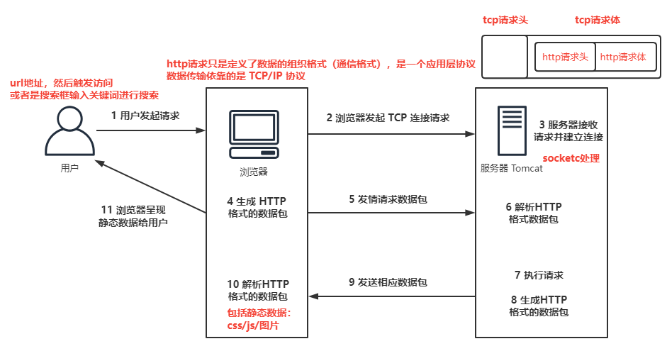

> 第一部分 Tomcat 系统架构与原理剖析

B/S （浏览器/服务器模式）浏览器是客户端（发送http请求） ---> 服务器端

# 1 浏览器访问服务器的流程

http 请求的处理过程

注意：浏览器访问服务器使用的是 HTTP 协议，HTTP是应用层协议，用于定义数据通信的格式，具体的数据传输使用的是 TCP/IP 协议。

# 2 Tomcat 系统总体架构

## 2.1 Tomcat 请求处理大致过程

**Tomcat 是一个 Http服务器（能够接收并且处理 http 请求，所以 tomcat 是一个 http 服务器）**

我们使用浏览器向某一个网站发起请求，发出的是 http 请求，那么在远程，http服务器接收到这个请求之后，会调用具体的程序（Java类）进行处理，往往不同的请求由不同的 Java 类完成处理。

问题：如果 http 服务器（tomcat）直接调用业务处理类完成业务处理的话，存在一定的问题：tomcat和业务处理类耦合在一起。

HTTP 服务器接收到请求之后把请求交给 Servlet容器来处理，Servlet容器通过 Servlet接口 调用业务类。**Servlet接口 和 Servlet 容器这一整套内容叫做Servlet规范**。

[**Java Servlet 3.1 Specification**](https://jcp.org/en/jsr/detail?id=340)

注意：Tomcat既按照 Servlet 规范的要求去实现了 Servlet 容器，同时它也具有 HTTP 服务器的功能。

Tomcat的两个重要身份：

1. http服务器；
2. Tomcat是一个 Servlet 容器。

## 2.2 Tomcat Servlet 容器处理流程

当用户请求某个 URL 资源时：

1. HTTP 服务器会把请求信息使用 ServletRequest 对象封装起来
2. 进一步去调用 Servlet 容器中某个具体的 Servlet
3. 在2中，Servlet容器拿到请求后，根据 URL 和 Servlet 的映射关系，找到相应的 Servlet 
4. 如果 Servlet 还没有被加载，就用反射机制创建这个 Servlet，并调用 Servlet 的 init 方法来完成初始化
5. 接着调用这个具体的 Servlet 的 service 方法来处理请求，请求处理结果使用 ServletResponse 对象封装
6. 把 ServletResponse 对象返回给 HTTP 服务器，HTTP 服务器会把响应发送给客户端

## 2.3 Tomcat 系统总架构

tomcat 有两个非常重要的功能需要完成：

1. 和客户端浏览器进行交互，进行 socket 通信，将字节流 和 Request\Response 等对象进行转换；
2. Servlet 容器处理业务逻辑。

Tomcat 设计了两个核心组件 **连接器（Connector）** 和 **容器（Container）** 来完成 Tomcat 的两大核心功能。

1. **连接器，负责对外交流**：处理 Socket 连接，负责网络字节流 与 Request 和 Response 对象的转化；
2. **容器，负责内部处理**：加载和管理Servlet，以及具体处理 Request 请求。

# 3 Tomcat 连接器组件 Coyote

## 3.1 Coyote 简介

Coyote 是 Tomcat 中连接器组件名称，是对外的接口。客户端通过 Coyote 与服务器建立连接、发送请求并接受响应。

1. Coyote 封装了底层的网络通信（Socket 请求及响应处理）
2. Coyote 使 Catalina 容器（容器组件）与具体的请求协议及 IO 操作方法完全解耦
3. Coyote 将 Scoket 输入转换封装为 Request 对象，进一步封装后交由 Catalina 容器进行处理，处理请求完成后，Catalina 通过 Coyote 提供的 Response 对象将结果写入输出流。
4. Coyote 负责的是 **具体协议（应用层）和 IO（传输层）相关内容**

### 3.1.1 Tomcat Coyote 支持的 IO 模型与协议

Tomcat 支持多种应用层协议和 I/O 模型，如下：

在 8.0 之前，Tomcat 默认采用的 I/O 方式为 BIO，之后改为 NIO。无论 NIO、NIO2 还是 APR，在性能方面均优于以往的 BIO。如果采用 APR，针织可以达到 Apache HTTP Server 的性能。

## 3.2 Coyote 的内部组件及流程

Coyote 组件及作用

| 组件            | 作用描述                                                     |
| --------------- | ------------------------------------------------------------ |
| EndPoint        | EndPoint 是 Coyote 通信端点，即通信监听的接口， 是具体 Socket 接收和发送处理器，是对传输层的抽象， 因此 EndPoint 用来实现 TCP/IP 协议的。 |
| Processor       | Processor 是 Coyote 协议处理接口，如果说 EndPoint 是用来实现 TCP/IP 协议的，那么 Processor 用来实现 HTTP 协议， Processor 接收来自 EndPoint 的 Socket ，读取字节流解析成 Tomcat Request 和 Response 对象， 并通过 Adapter 将其提交到容器处理，Processor 是对应用层协议的抽象。 |
| ProtocolHandler | Coyote 协议接口，通过 EndPoint 和 Processor，实现针对具体协议的处理能力。 Tomcat 按照协议和 I/O 提供了 6 个实现类：AjpNioProtocol，AjpAprProtocol，AjpNio2Protocol，Http11NioProtocol，Http11Nio2Protocol，Http11AprProtocol |
| Adapter         | 由于协议不同。客户端发过来的请求信息也不尽相同，Tomcat 定义了自己的 Request 类来封装这些请求信息。 ProtocolHandler 接口负责解析请求并生成 Tomcat Request 类。但是这个 Request 不是标准的 ServletRequest，不能用 Tomcat Request 作为参数来调用容器。 Tomcat 设计者的解决方案是引入 CoyoteAdapter，**这是适配器模式的经典运用**，连接器调用 CoyoteAdapter 的 Service 方法，传入的是 Tomcat Request 对象，CoyoteAdapter 负责将 Tomcat Request 转成 ServletRequest，再调用容器。 |

# 4 Tomcat Servlet 容器 Catalina

## 4.1 Tomcat 模块分层结构图及Catalina位置

Tomcat 是一个由一些列可配置（conf/server.xml）的组件构成的 Web 容器，而 Catalina 是 Tomcat 的 Servlet 容器。

从另一个角度来说，**Tomcat 本质上就是一款 Servlet 容器**，因为 Catalina 才是 Tomcat 的核心，其他模块都是为 Catalina 提供支撑的。比如：通过Coyote 模块提供链接通信，Jasper 模块提供 JSP 引擎，Naming 提供 JNDI 服务，Juli 提供日志服务。

## 4.2 Servlet 容器 Catalina 的结构

Tomcat（我们往往有一个认识，Tomcat就是一个Catalina的实例，因为Catalina是Tomcat的核心）

Tomcat/Catalina实例：

其实，可以认为整个 Tomcat 就是一个 Catalina 实例，Tomcat 启动的时候就会初始化这个实例，Catalina实例通过加载 server.xml 完成其他实例的创建，创建并管理一个 Server，Server 创建并管理多个Service服务，每个服务又可以有多个 Connector 和 一个 Container。

一个 Catalina 实例（容器）

一个Server实例（容器）

多个Service实例（容器）

每一个 Service 实例下可以有多个 Connector 实例 和 一个 Container 实例。

- Catalina

  负责解析 Tomcat 的配置文件（server.xml），以此来创建服务器 Server 组件并进行管理。

- Server

  服务器标识整个 Catalina Servlet 容器以及其他组件，负责组装并启动 Servlet 引擎，Tomcat 连接器。Server 通过实现 Lifecycle 接口，提供了一种优雅的启动和关闭整个系统的方式。
  
- Service

  服务是 Server 内部的组件，一个 Server 包含多个 Service。它将若干个 Connector 组件绑定到一个 Container。

- Container

  容器，负责处理用户的 Servlet 请求，并返回对象给 web 用户的模块。

## 4.3 Container 组件的具体结构

Container 组件下有几种具体的组件，分别是 Engine、Host、Context 和 Wrapper。这4 种组件（容器）是父子关系。TOmcat 通过一种分层的架构，使得 Servlet 容器具有很好的灵活性。

- Engine

  表示整个 Catalina 的 Servlet 引擎，用来管理多个虚拟站点，一个 Service 最多只能有一个 Engine，但是一个引擎可包含多个 Host

- Host

  代表一个虚拟主机，或者说一个站点，可以给 Tomcat 配置多个虚拟主机地址，而一个虚拟主机下可包含多个 Context 。

- Context

  表示一个 Web 应用程序，一个 Web 应用可包含多个 Wrapper

- Wrapper

  表示一个 Servlet，Wrapper 作为容器种的最底层，不能包含子容器。

**上述组件的配置其实就体现在 conf/server.xml 中**。

