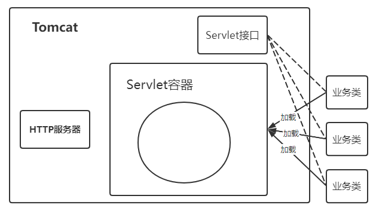

> 第二部分 Tomcat 服务器核心配置详解

# 1 Tomcat 请求处理大致过程

**Tomcat 是一个 Http服务器（能够接收并且处理 http 请求，所以 tomcat 是一个 http 服务器）**

我们使用浏览器向某一个网站发起请求，发出的是 http 请求，那么在远程，http服务器接收到这个请求之后，会调用具体的程序（Java类）进行处理，往往不同的请求由不同的 Java 类完成处理。

问题：如果 http 服务器（tomcat）直接调用业务处理类完成业务处理的话，存在一定的问题：tomcat和业务处理类耦合在一起。

HTTP 服务器接收到请求之后把请求交给 Servlet容器来处理，Servlet容器通过 Servlet接口 调用业务类。**Servlet接口 和 Servlet 容器这一整套内容叫做Servlet规范**。

[**Java Servlet 3.1 Specification**](https://jcp.org/en/jsr/detail?id=340)

注意：Tomcat既按照 Servlet 规范的要求去实现了 Servlet 容器，同时它也具有 HTTP 服务器的功能。

Tomcat的两个重要身份：

1. http服务器；
2. Tomcat是一个 Servlet 容器。

# 2 Tomcat Servlet 容器处理流程

当用户请求某个 URL 资源时：

1. HTTP 服务器会把请求信息使用 ServletRequest 对象封装起来
2. 进一步去调用 Servlet 容器中某个具体的 Servlet
3. 在2中，Servlet容器拿到请求后，根据 URL 和 Servlet 的映射关系，找到相应的 Servlet 
4. 如果 Servlet 还没有被加载，就用反射机制创建这个 Servlet，并调用 Servlet 的 init 方法来完成初始化
5. 接着调用这个具体的 Servlet 的 service 方法来处理请求，请求处理结果使用 ServletResponse 对象封装
6. 把 ServletResponse 对象返回给 HTTP 服务器，HTTP 服务器会把响应发送给客户端

# 3 Tomcat 系统总架构

tomcat 有两个非常重要的功能需要完成：

1. 和客户端浏览器进行交互，进行 socket 通信，将字节流 和 Request\Response 等对象进行转换；
2. Servlet 容器处理业务逻辑。

Tomcat 设计了两个核心组件 **连接器（Connector）** 和 **容器（Container）** 来完成 Tomcat 的两大核心功能。

1. **连接器，负责对外交流**：处理 Socket 连接，负责网络字节流 与 Request 和 Response 对象的转化；
2. **容器，负责内部处理**：加载和管理Servlet，以及具体处理 Request 请求。

