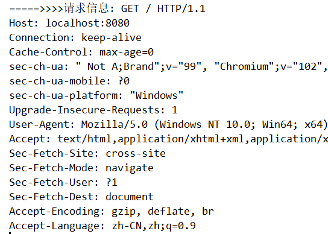
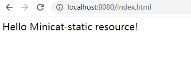

> 第三部分 手写实现迷你版 Tomcat

名称：Minicat

Minicat 要做的事情：作为一个服务器软件提供服务，也即可以通过浏览器客户端发送 http 请求，Minicat 可以接收到请求进行处理，处理之后的结果可以返回浏览器客户端。

1. 提供服务，接收请求（Socket 通信）
2. 请求信息封装成 Request 对象（Response 对象）
3. 客户端请求资源，资源分成静态资源（html）和 动态资源（Servlet）
4. 资源返回给客户端浏览器

我们递进式完成以上需求，提出 v1.0、v2.0、v3.0 版本的需求：

- v1.0 需求：浏览器请求 http://localhost:8080，返回一个固定的字符串到页面”Hello Minicat!“
- v2.0需求：封装Request 和 Response 对象，返回 html 静态资源文件
- v3.0需求：可以请求动态资源（Servlet）


# 1 Minicat v1.0

首先创建一个 普通的 Maven Java 项目

## 1.1 pom中添加 Apache Maven 编译器插件

```xml
<build>
    <plugins>
        <!--Apache Maven 编译器插件-->
        <plugin>
            <groupId>org.apache.maven.plugins</groupId>
            <artifactId>maven-compiler-plugin</artifactId>
            <version>3.1</version>
            <configuration>
                <source>11</source>
                <target>11</target>
                <encoding>utf-8</encoding>
            </configuration>
        </plugin>
    </plugins>
</build>
```

## 1.2 Minicat 的主类

```java
package server;

import java.io.IOException;
import java.io.OutputStream;
import java.net.ServerSocket;
import java.net.Socket;

/**
 * Minicat 的主类
 */
public class Bootstrap {

    /**定义socket监听的端口号**/
    private int port = 8080;

    public int getPort() {
        return port;
    }

    public void setPort(int port) {
        this.port = port;
    }

    /**
     * Minicat 启动需要初始化展开的一些操作
     */
    public void start() throws IOException {
        /**
            完成 Minicat 1.0 版本
           需求：（浏览器请求 http://localhost:8080,返回固定的字符串到页面 "Hello Minicat!"）
         */
        ServerSocket serverSocket = new ServerSocket(port);
        System.out.println("====>Minicat start on port: "+port);
        // 阻塞式监听端口
        while (true){
            Socket socket = serverSocket.accept();
            // 有了 socket, 接收到请求,获取输出流
            OutputStream outputStream = socket.getOutputStream();
            String data = "Hello Minicat!";
            String responseText = HttpProtocolUtil.getHttpHeader200("Hello Minicat!".getBytes().length) + data;
            outputStream.write(responseText.getBytes());
            socket.close();
        }

    }

    /**
     * Minicat 的程序启动入口
     * @param args
     */
    public static void main(String[] args) {
        Bootstrap bootstrap = new Bootstrap();
        try {
            // 启动 Minicat
            bootstrap.start();
        } catch (IOException e) {
            e.printStackTrace();
        }
    }
}
```

## 1.3 响应头信息

http 协议需要响应头

```java
package server;

/**
 * http 协议工具类，主要是提供响应头信息，这里只提供200和404的情况
 */
public class HttpProtocolUtil {

    /**
     * 为响应码 200 提供请求头信息
     * @return
     */
    public static String getHttpHeader200(long contextLength){
        return "HTTP/1.1 200 OK \n" +
                "Content-Type: text/html; charset=utf-8 \n" +
                "Content-Length: "+contextLength +" \n" +
                "\r\n";
    }


    /**
     * 为响应码 404 提供请求头信息(此处也包含的数据内容)
     * @return
     */
    public static String getHttpHeader404(){
        String str404 = "<h1>404 not found</h1>";
        return "HTTP/1.1 404 NOT Found \n" +
                "Content-Type: text/html; charset=utf-8 \n" +
                "Content-Length: "+str404.getBytes().length +" \n" +
                "\r\n" + str404;
    }
}
```


启动主类中的main方法，查看效果：


# 2 Minicat v2.0

v2.0版本，需要完成：封装Request 和 Response 对象，返回 html 静态资源文件。

## 2.1 Request对象

```java
package server;

import java.io.IOException;
import java.io.InputStream;

/**
 * 把请求信息封装为Request对象（根据 InputStream输入流封装）
 */
public class Request {

    private String method; // 请求方式，比如 GET POST

    private String url; // 例如 /,/index.html

    private InputStream inputStream; // 输入流，其他属性从输入流中解析出来

    public String getMethod() {
        return method;
    }

    public void setMethod(String method) {
        this.method = method;
    }

    public String getUrl() {
        return url;
    }

    public void setUrl(String url) {
        this.url = url;
    }

    public InputStream getInputStream() {
        return inputStream;
    }

    public void setInputStream(InputStream inputStream) {
        this.inputStream = inputStream;
    }

    public Request() {
    }

    // 构造器，输入流传入
    public Request(InputStream inputStream) throws IOException {
        this.inputStream = inputStream;

        // 从输入流中获取请求信息
        int count = 0;
        while (count == 0){
            count = inputStream.available();
        }
        byte[] bytes = new byte[count];
        inputStream.read(bytes);
        String inputStr = new String(bytes);
        // 获取第一行请求信息
        String firstLineStr = inputStr.split("\n")[0]; // GET / HTTP/1.1
        String[] strings = firstLineStr.split(" ");

        this.method = strings[0];
        this.url = strings[1];

        System.out.println("=====>> method:"+method);
        System.out.println("=====>> url:"+url);
    }
}
```

对请求信息中的 method（GET）和 url（/）进行封装。



## 2.2 Response对象

延续 v1.0 的思想，在Response对象中使用 `socket.getOutputStream()` 进行输出响应。

```java
package server;

import java.io.File;
import java.io.FileInputStream;
import java.io.IOException;
import java.io.OutputStream;

/**
 * 封装 Response 对象，需要依赖于 OutputStream
 *
 * 该对象需要提供核心方法，输出 html,
 */
public class Response {

    private OutputStream outputStream;

    public Response() {
    }

    public Response(OutputStream outputStream) {
        this.outputStream = outputStream;
    }

    // 使用输出流 输出指定字符串
    public void output(String content) throws IOException {
        outputStream.write(content.getBytes());
    }

    /**
     *
     * @param path url，随后要根据url获取到静态资源的绝对路径，
     *                  进一步根据绝对路径读取静态资源文件，最终通过输出流输出
     *
     *             / -- 指向 classes 目录
     */
    public void outputHtml(String path) throws IOException {
        // 获取静态资源的绝对路径
        String absoluteResourcePath = StaticResourceUtil.getAbsolutePath(path);

        // 输入静态资源文件
        File file = new File(absoluteResourcePath);
        if(file.exists() && file.isFile()){
            // 读取静态资源文件，输出静态资源
            StaticResourceUtil.outputStaticResource(new FileInputStream(file),outputStream);
        }else {
            // 输出404
            output(HttpProtocolUtil.getHttpHeader404());
        }
    }
}
```

## 2.3 静态资源工具类

```java
package server;

import java.io.FileInputStream;
import java.io.IOException;
import java.io.InputStream;
import java.io.OutputStream;

public class StaticResourceUtil {

    /**
     * 获取静态资源文件的绝对路径
     * @param path
     * @return
     */
    public static String getAbsolutePath(String path){
        String absolutePath = StaticResourceUtil.class.getResource("/").getPath();
        //String absolutePath = this.getClass().getClassLoader().getResource("/").getPath();
        return absolutePath.replaceAll("\\\\","/")+path;
    }

    /**
     * 读取静态资源文件输入流，通过输出流输出
     */
    public static void outputStaticResource(InputStream inputStream, OutputStream outputStream) throws IOException {
            int count = 0;
            while (count == 0){
                count = inputStream.available();
            }
            int resourceSize = count;
            // 输出http请求头,然后在输出具体内容
            outputStream.write(HttpProtocolUtil.getHttpHeader200(resourceSize).getBytes());
            // 读取内容输出
            long written = 0; // 已经读取的内容长度
            int byteSize = 1024; // 计划每次缓冲的长度
            byte[] bytes = new byte[byteSize];
            while (written < resourceSize){
                if(written + byteSize > resourceSize){ // 剩余未读取大小不足一个1024长度，那就按真实长度处理
                    byteSize = (int) (resourceSize-written); // 剩余的文件内容长度
                    bytes = new byte[byteSize];
                }
                inputStream.read(bytes);
                outputStream.write(bytes);
                outputStream.flush();
                written += byteSize;
            }
    }
}
```

## 2.4 Bootstrap主类中使用封装好的 Request 和 Response 对象

```java
/**
 * Minicat 启动需要初始化展开的一些操作
 */
public void start() throws IOException {
    
    ServerSocket serverSocket = new ServerSocket(port);
    System.out.println("====>Minicat start on port: "+port);
    // 阻塞式监听端口
    /**
     * 完成 Minicat 2.0 版本
     * 需求：封装 Request 和 Response 对象，返回 html 静态资源文件
     */
    while (true){
        Socket socket = serverSocket.accept();
        InputStream inputStream = socket.getInputStream();
        // 封装 Request 对象 和 Response 对象
        Request request = new Request(inputStream);
        Response response = new Response(socket.getOutputStream());
        response.outputHtml(request.getUrl());

        socket.close();
    }
}
```

启动主类中的main方法，查看效果：


# 3 Minicat v3.0

v3.0 版本需求：可以请求动态资源（Servlet）

## 3.1 增加 Servlet 接口

```java
package server;

public interface Servlet {

    void init() throws Exception;

    void destory() throws Exception;

    void service(Request request,Response response) throws Exception;
}
```

## 3.2 增加抽象类 HttpServlet：

```java
package server;

import java.io.IOException;

public abstract class HttpServlet implements Servlet{

    public abstract void doGet(Request request,Response response) throws IOException;

    public abstract void doPost(Request request,Response response);

    @Override
    public void service(Request request, Response response) throws Exception {
        if ("GET".equalsIgnoreCase(request.getMethod())){
            doGet(request,response);
        }else {
            doPost(request,response);
        }
    }
}
```

## 3.3 增加 TurboServlet

```java
package server;

import java.io.IOException;

public class TurboServlet extends HttpServlet {
    @Override
    public void doGet(Request request, Response response) {
        String content="<h1>TurboServlet get</h1>";
        try {
            response.output(HttpProtocolUtil.getHttpHeader200(content.getBytes().length)+content);
        } catch (IOException e) {
            e.printStackTrace();
        }
    }

    @Override
    public void doPost(Request request, Response response) {
        String content="<h1>TurboServlet post</h1>";
        try {
            response.output(HttpProtocolUtil.getHttpHeader200(content.getBytes().length)+content);
        } catch (IOException e) {
            e.printStackTrace();
        }
    }

    @Override
    public void init() throws Exception {

    }

    @Override
    public void destory() throws Exception {

    }
}
```

## 3.3 增加 web.xml

```xml
<?xml version="1.0" encoding="UTF-8" ?>
<web-app>
    <servlet>
        <servlet-name>turbo</servlet-name>
        <servlet-class>server.TurboServlet</servlet-class>
    </servlet>
    <servlet-mapping>
        <servlet-name>turbo</servlet-name>
        <url-pattern>/turbo</url-pattern>
    </servlet-mapping>
</web-app>
```

## 3.4 修改 Bootstrap

添加 dom4j 和 xpath 依赖，解析 web.xml，根据url找到对应的Servlet，动态资源使用 servlet 请求。

```xml
<dependencies>
        <dependency>
            <groupId>dom4j</groupId>
            <artifactId>dom4j</artifactId>
            <version>1.6.1</version>
        </dependency>

        <!--x-path 表达式解析-->
        <dependency>
            <groupId>jaxen</groupId>
            <artifactId>jaxen</artifactId>
            <version>1.1.6</version>
        </dependency>
    </dependencies>
```


```java
public void start() throws Exception {

    // 加载解析相关的配置，web.xml
    loadServlet();
    ServerSocket serverSocket = new ServerSocket(port);
    System.out.println("====>Minicat start on port: "+port);
    // 阻塞式监听端口
    /**
     * 完成 Minicat 3.0 版本
     * 需求：可以请求动态资源（Servlet）
     */
    while (true){
        Socket socket = serverSocket.accept();
        InputStream inputStream = socket.getInputStream();
        // 封装 Request 对象 和 Response 对象
        Request request = new Request(inputStream);
        Response response = new Response(socket.getOutputStream());

        if(servletMap.get(request.getUrl()) == null){ // 静态资源处理
            response.outputHtml(request.getUrl());
        }else{
            // 动态资源servlet请求
            HttpServlet httpServlet = servletMap.get(request.getUrl());
            httpServlet.service(request,response);
        }
        socket.close();
    }
}

private Map<String,HttpServlet> servletMap = new HashMap<>();

/**
 * 加载解析 web.xml ,初始化Servlet
 */
private void loadServlet() {
    InputStream resourceAsStream = this.getClass().getClassLoader().getResourceAsStream("web.xml");
    SAXReader saxReader = new SAXReader();

    try {
        Document document = saxReader.read(resourceAsStream);
        Element rootElement = document.getRootElement();
        List<Element> selectNodes = rootElement.selectNodes("//servlet");
        for (int i = 0; i < selectNodes.size(); i++) {
            Element element = selectNodes.get(i);
            // <servlet-name>turbo</servlet-name>
            Element servletNameElement = (Element) element.selectSingleNode("servlet-name");
            String servletName = servletNameElement.getStringValue();
            // <servlet-class>server.TurboServlet</servlet-class>
            Element servletClassElement = (Element) element.selectSingleNode("servlet-class");
            String servletClass = servletClassElement.getStringValue();
            // 根据servlet-name的值找到url-pattern
            Element servletMapping = (Element) rootElement.selectSingleNode("//web-app/servlet-mapping[servlet-name='" + servletName + "']");
            // /turbo
            String urlPattern = servletMapping.selectSingleNode("url-pattern").getStringValue();
            servletMap.put(urlPattern, (HttpServlet) Class.forName(servletClass).newInstance());
        }
    } catch (DocumentException e) {
        e.printStackTrace();
    } catch (IllegalAccessException e) {
        e.printStackTrace();
    } catch (InstantiationException e) {
        e.printStackTrace();
    } catch (ClassNotFoundException e) {
        e.printStackTrace();
    }
}
```

启动Bootsrap主类中的 main 方法，测试：





## 3.5 Minicat v3.0 版本的工作流程

1. Bootstrap 启动 main 方法
2. 解析 web.xml 文件，将 url 和 具体的 Servlet 封装到 map 中。
3. 建立 socket 监听，并从 socket 中获取 输入流 和 输出流。
4. 使用输入流封装 Request 对象，使用 输出流封装 Response 对象。
5. `servletMap.get(request.getUrl())` 不为空，说明使用 servlet 动态请求，使用 servlet 的 service() 方法。
6. 否则是静态资源 ，使用 `response.outputHtml` 方法 返回。