> 第四部分 Tomcat源码构建及核心流程源码剖析

# 1 源码构建

## 1.1 下载源码

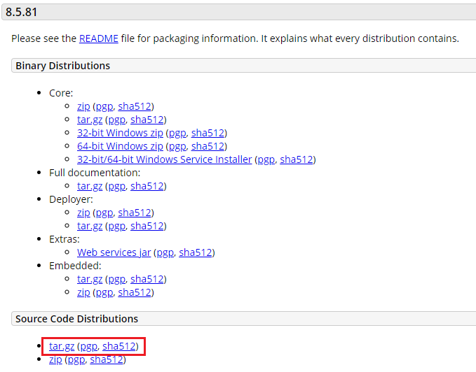

[其他版本下载](https://archive.apache.org/dist/tomcat/)。

## 1.2 源码导入 IDE 之前准备工作

- 解压 tar.gz 压缩包，得到目录 apache-tomcat-8.5.81-src

- 进入 apache-tomcat-8.5.81-src 目录，创建一个 pom.xml 文件，内容如下

  ```xml
  <?xml version="1.0" encoding="UTF-8"?>
  <project xmlns="http://maven.apache.org/POM/4.0.0"
  	xmlns:xsi="http://www.w3.org/2001/XMLSchema-instance" 
  	xsi:schemaLocation="http://maven.apache.org/POM/4.0.0
  	http://maven.apache.org/xsd/maven-4.0.0.xsd">
  	
  	<modelVersion>4.0.0</modelVersion> 
  	<groupId>org.apache.tomcat</groupId>
  	<artifactId>apache-tomcat-8.5.81-src</artifactId> 
  	<name>Tomcat8.5</name>
  	<version>8.5</version>
  	
  	<build>
  		<!--指定源⽬录-->
  		<finalName>Tomcat8.5</finalName>
  		<sourceDirectory>java</sourceDirectory> 
  		<resources>
  			<resource>
  				<directory>java</directory> 
  			</resource>
  		</resources> 
  		<plugins>
  			<!--引⼊编译插件-->
  			<plugin>
  				<groupId>org.apache.maven.plugins</groupId>
  				<artifactId>maven-compiler-plugin</artifactId>
  				<version>3.1</version>
  				<configuration>
  					<encoding>UTF-8</encoding>
  					<source>11</source>
  					<target>11</target>
  				</configuration>
  			</plugin>
  		</plugins>
  	</build>
  	
  	<!--tomcat 依赖的基础包-->
  	<dependencies>
  		<dependency>
  			<groupId>org.easymock</groupId>
  			<artifactId>easymock</artifactId>
  			<version>3.4</version>
  		</dependency>
  		<dependency>
  			<groupId>ant</groupId>
  			<artifactId>ant</artifactId>
  			<version>1.7.0</version>
  		</dependency>
  		<dependency>
  			<groupId>wsdl4j</groupId>
  			<artifactId>wsdl4j</artifactId>
  			<version>1.6.2</version>
  		</dependency>
  		<dependency>
  			<groupId>javax.xml</groupId>
  			<artifactId>jaxrpc</artifactId>
  			<version>1.1</version>
  		</dependency>
  		<dependency>
  			<groupId>org.eclipse.jdt.core.compiler</groupId>
  			<artifactId>ecj</artifactId>
  			<version>4.5.1</version>
  		</dependency>
  		<dependency>
  			<groupId>javax.xml.soap</groupId>
  			<artifactId>javax.xml.soap-api</artifactId>
  			<version>1.4.0</version>
  		</dependency>
  	</dependencies>
  </project>	
  ```

- 在 apache-tomcat-8.5.81-src 目录中创建 source（名称不固定） 文件夹

- 将 conf、webapps 目录移动到刚刚创建的 source 文件夹中

## 1.3 导入源码工厂到 IDE 进行配置

### 1.3.1 将源码导入到 IDEA 中

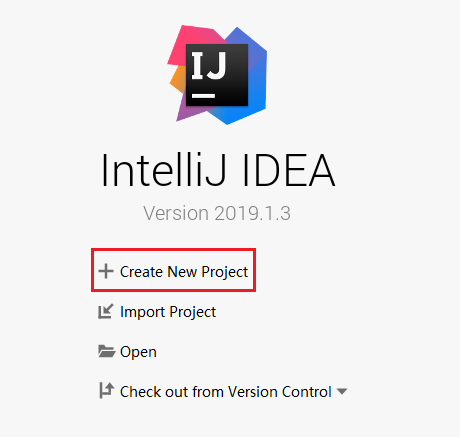

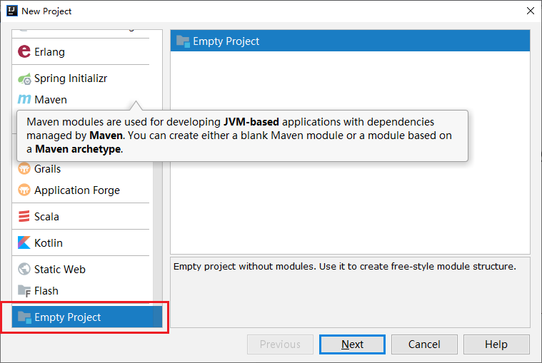

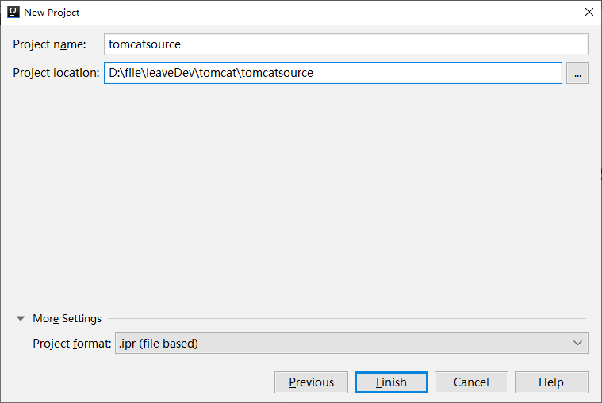

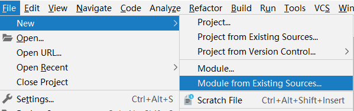

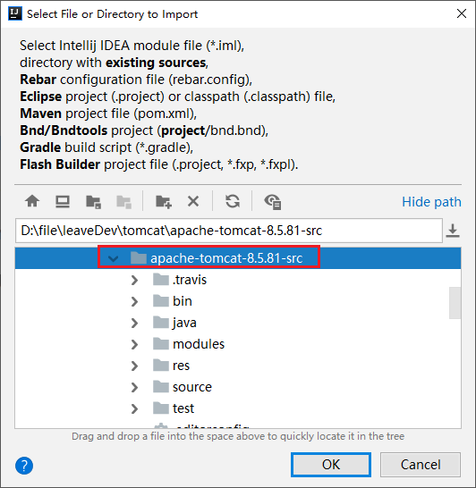

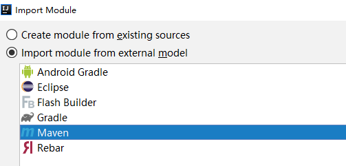

等待依赖导入，打开 Bootstrap.java，存在报红，可能是 jdk 没有关联上：


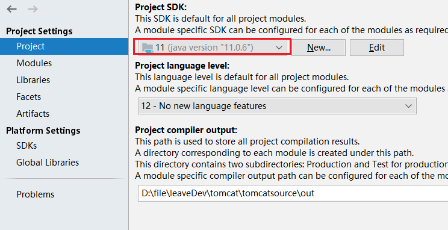

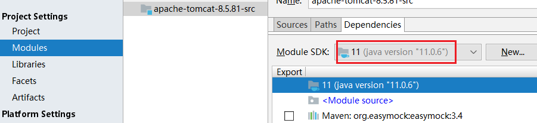

### 1.3.2 给 tomcat 的源码程序启动类 Bootstrap 配置 VM 参数，因为 tomcat 源码运行也需要加载配置文件等

先找到 Bootstrap#main 方法，run 一下，如果错误处理一下。

然后配置 VM 参数：（自己的source路径）

```properties
-Dcatalina.home=D:\file\leaveDev\tomcat\apache-tomcat-8.5.81-src\source
-Dcatalina.base=D:\file\leaveDev\tomcat\apache-tomcat-8.5.81-src\source
-Djava.util.logging.manager=org.apache.juli.ClassLoaderLogManager
-Djava.util.logging.config.file=D:\file\leaveDev\tomcat\apache-tomcat-8.5.81-src\source\conf\logging.properties
```

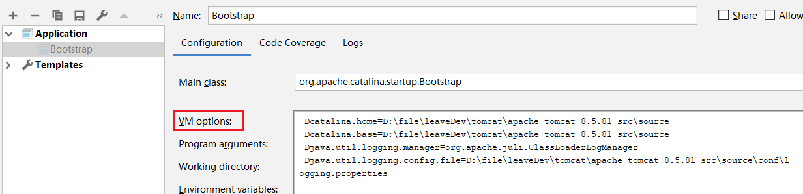

然后再次启动 Bootstrap#main 方法。

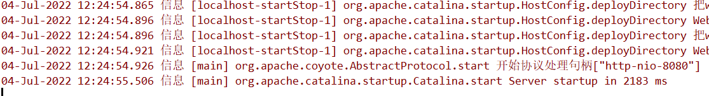

此时就启动了 tomcat，启动时候会去加载所配置的 conf 目录下的 server.xml 等配置文件，所以访问 8080 端口即可，但此时我们会遇到如下一个错误：

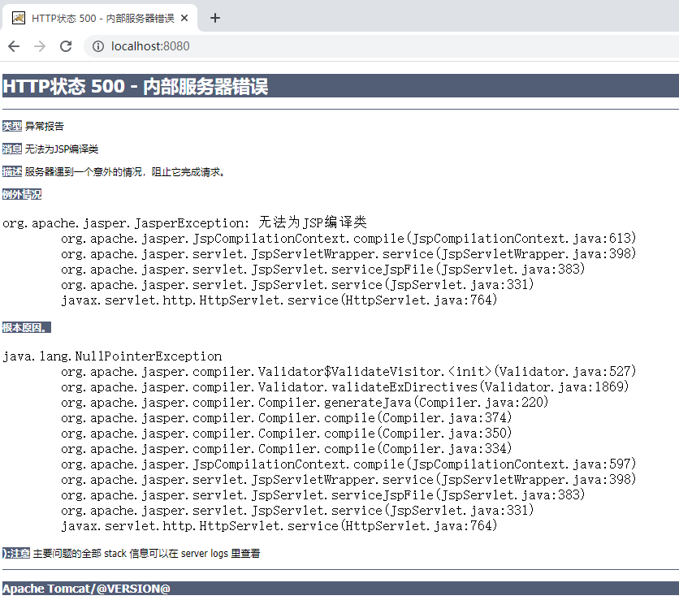

原因是 Jsp 引擎 jasper 没有初始化，从而无法编译 JSP，我们需要在 tomcat 的源码 ContextConfig 类中的 configureStart 方法中增加一行代码将 Jsp 引擎初始化，如下：

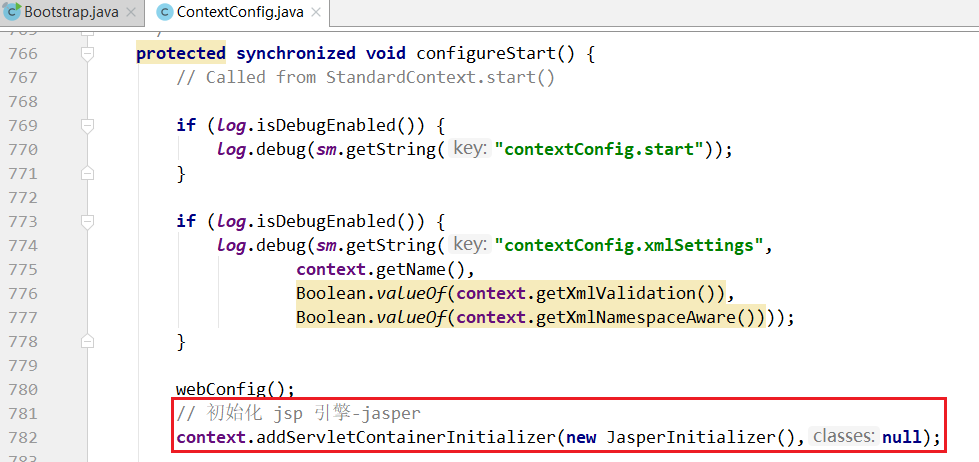

重启 tomcat ，正常访问即可。

# 2 核心流程源码解析

tomcat 中的各容器组件都会涉及创建、销毁等，因此设计了生命周期接口 Lifecycle 进行统一规范，各容器组件实现该接口。

**Lifecycle生命周期接口主要方法示意**

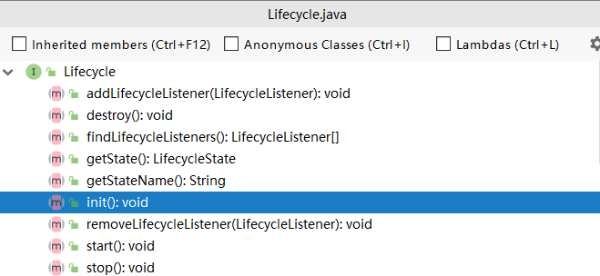

**Lifecycle生命周期接口继承体系示意**

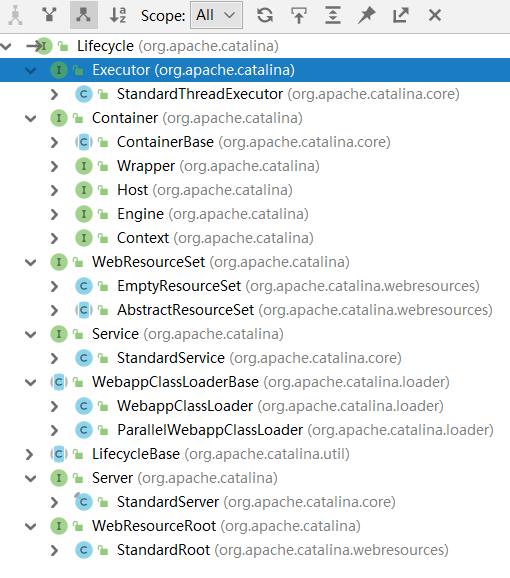

**ProtocolHandler 接口继承体系示意**

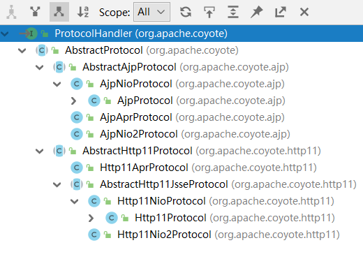

**核心流程源码剖析**

源码追踪部分我们关注两个流程：**tomcat 启动流程** 和 **tomcat 请求处理流程**。

## 2.1 tomcat 启动流程


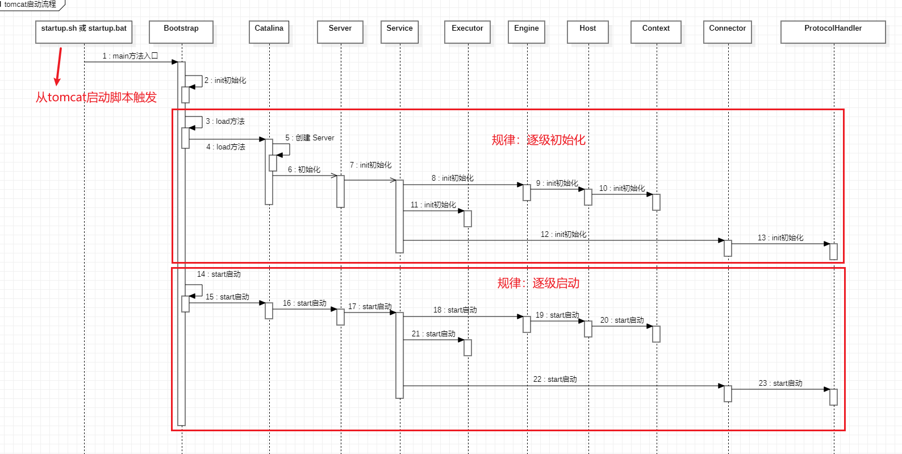

可以根据上图的时序图，断点跟踪代码。


打开 /bin/startup.sh:

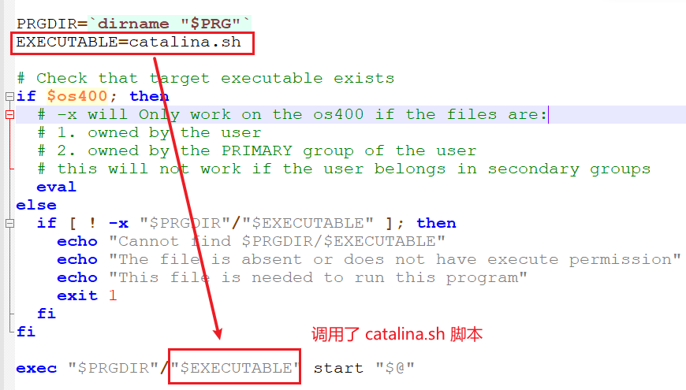

打开 /bin/catalina.sh:

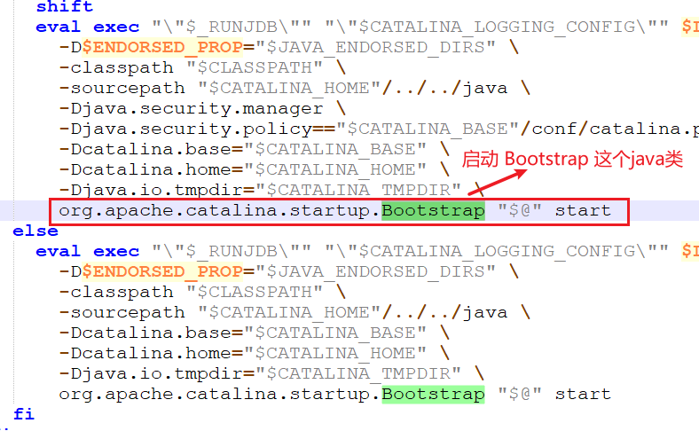


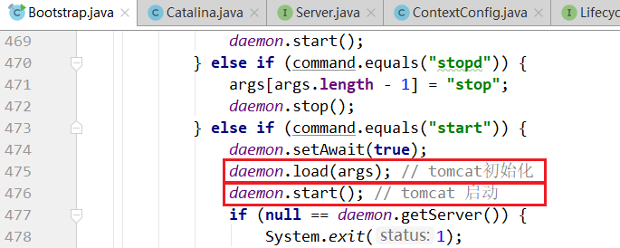

### 2.1.1 tomcat 初始化流程源码

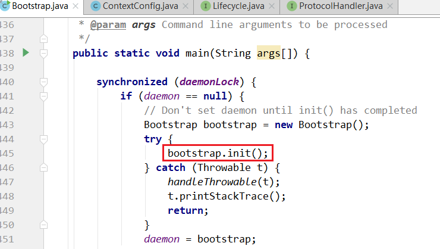

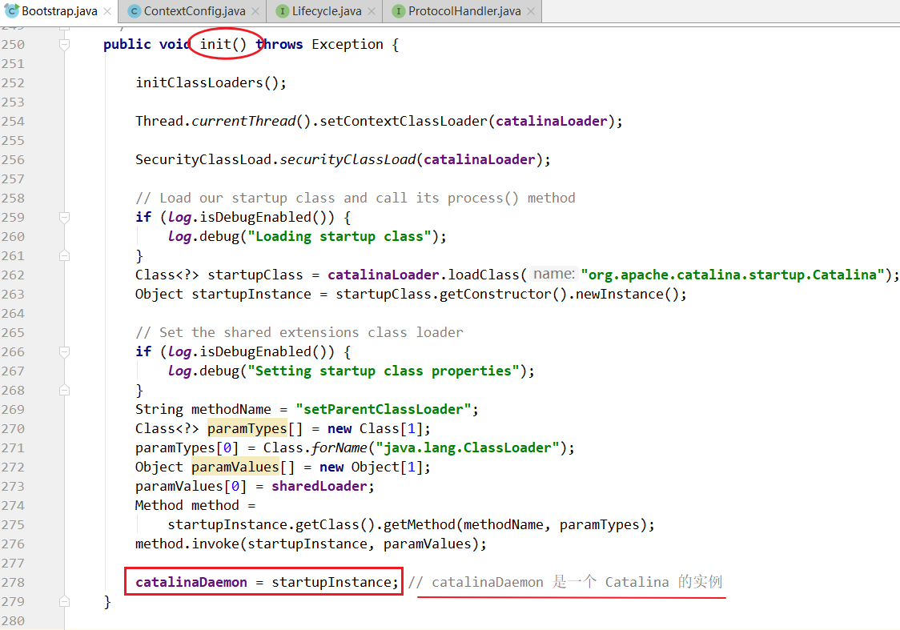


## 2.2 tomcat 请求处理流程

### 2.2.1 请求处理流程分析

tomcat 请求处理流程：当一个servlet请求到来的时候，tomcat是通过怎样的机制定位到servlet并且执行的：

url:http://localhost:8080/web_demo/resume/address

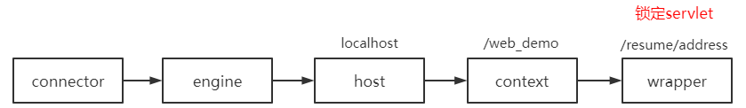


Mapper（**映射**的意思，这里不是集合）组件完成 url 和 Host 、Context、Wrapper 等容器的映射

Mapper 组件体系结构：

web应用案例 ---> 部署到 tomcat 软件中（不是源代码工程），最终，希望的是把web应用案例部署到 tomcat 源代码工程中。

### 2.2.2 请求处理流程示意图

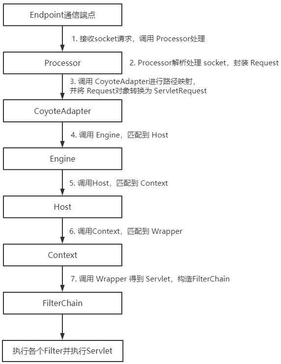

### 2.2.3 Mapper组件体系结构

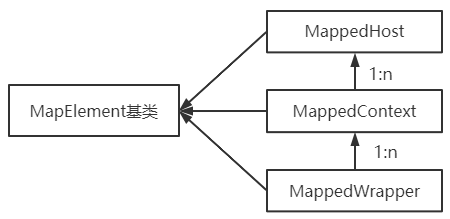