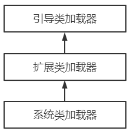

> 第五部分 Tomcat类加载机制剖析

Java类（.java） ---> 字节码文件（.class）---> 字节码文件需要被加载到 jvm 内存当中（这个过程就是一个类加载的过程）

类加载器（ClassLoader，说白了也是一个类，jvm 启动的时候先把类加载器读取到内存当中去，然后类加载器加载 其他的类[比如各种jar中的字节码文件，自己开发的代码编译之后的.class 等]）。

要说 tomcat 的类加载机制，首先需要看看 jvm 的类加载机制。因为 tomcat 类加载机制是在 jvm 类加载机制的基础上进行了一些变动。

# 1 JVM 的类加载机制

JVM 的类加载机制中有一个非常重要的角色叫做**类加载器**（ClassLoader），类加载器有自己的体系，JVM 内置了集中类加载器，包括：引导类加载器、扩展类加载器、系统类加载器，它们之间形成父子关系，通过Parent 属性来定义这种关系，最终形成树形结构。

| 类加载器                                      | 作用                                                         |
| --------------------------------------------- | ------------------------------------------------------------ |
| 引导启动类加载器 BootstrapClassLoader         | c++编写，加载 java 核心库 java.*,比如 rt.jar 中的类，构造 ExtClassLoader 和 AppClassLoader |
| 扩展类加载器 ExtClassLoader                   | java 编写，加载扩展库 JAVA_HOME/lib/ext目录下的 jar 中的类，如classpath中的jre，javax.* 或者 java.ext.dir 指定位置中的类 |
| 系统类加载器 SystemClassLoader/AppClassLoader | 默认的类加载器，搜索环境变量 classpath 中指明的路径          |

**另外：用户可以自定义类加载器（Java编写，用户自定义的类加载器，可以加载指定路径的class文件）**

当 JVM 运行过程中，用户自定义了类加载器去加载某些类时，会按照下面的步骤（父类委托机制）：

1. 用户自己的类加载器，把加载请求传给父加载器，父加载器再传给其父加载器，一直到加载器树的顶层；
2. 最顶层的类加载器首先针对其特定的位置加载，如果加载不到就转交给子类；
3. 如果一直到底层的类加载都没有加载到，那么就会抛出异常 ClassNotFoundException。

因此，按照这个过程可以想到，如果同样在 classpath 指定的目录中和自己工作目录中存放相同的 class，会优先加载 classpath 目录中的文件。

# 2 双亲委派机制

## 2.1 什么是双亲委派机制

当某个类加载器需要加载某个 .class 文件时，它首先把这个任务委托给它的上级类加载器，递归这个操作，如果上级的类加载器没有加载，自己才会去加载这个类。

## 2.2 双亲委派机制的作用

- **防止重复加载同一个 .class** 。通过委托去向上面问一问，加载过了，就不用再加载一遍。保证数据安全。

- **保证核心 .class 不能被篡改**。通过委托方式，不会去篡改核心 .class；即使篡改也不会去加载；即使加载也不会是同一个 .class 对象。不同的加载器加载同一个 .class 也不是同一个 .class 对象。这样保证了 class 执行安全（如果子类加载器先加载，那么我们可以写一些与 java.lang 包种基础类同名的类，然后再定义一个子类加载器，这样整个应用使用的基础类就都变成我们自己定义的类了。）

  Object类 ----> 自定义类加载器（会出现问题，那么真正的Object类就可能被篡改了）

# 3 tomcat 的类加载机制

Tomcat 的类加载机制相对于 Jvm 的类加载机制做了一些改变。

没有严格的遵从双亲委派机制，也可以说打破了双亲委派机制。

比如：有一个 tomcat，webapps 下部署了两个应用：

app1/lib/a-1.0.jar com.turbo.Abc

app2/lib/a-2.0.jar com.turbo.Abc

不同版本中 Abc 类的内容是不同的，代码是不一样的。

