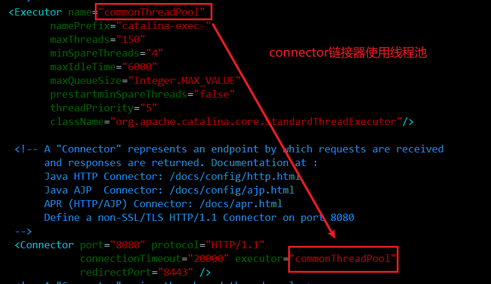

> 第六部分 Tomcat 对 Https 的支持及 Tomcat 性能优化策略

# 1 Tomcat 对 HTTPS 的支持

Https 是用来加强数据传输安全的

## 1.1 HTTPS 简介


**HTTPS 和 HTTP 的主要区别**

- HTTPS 协议使用时需要到电子商务认证授权机构（CA）申请 SSL  证书
- HTTP 默认使用 8080 端口，HTTPS 默认使用 8443 端口
- HTTPS 则是具有 SSL 加密的安全性传输协议，对数据的传输进行加密，效果上相当于 HTTP 的升级版
- HTTP 的链接是无状态的，不安全；HTTPS 协议是由 SSL+HTTP 协议构建的可进行加密传输、身份认证的网络协议，比 HTTP 协议安全

**HTTP工作原理**

说明：Https 在传输数据之前需要客户端与服务器之间进行一次握手，在握手过程中将确定双方加密传输的密码信息


## 1.2 Tomcat 对 HTTPS 的支持

1. 使用 JDK 中的 keytool 工具生成免费的密钥库文件（证书）

   ```bash
   keytool -genkey -alias turbo -keyalg RSA -keystore turbo.keystore
   ```

   

   

2. 配置 conf/server.xml

   ```xml
   <Connector port="8443" protocol="org.apache.coyote.http11.Http11NioProtocol"
                  maxThreads="150" schema="https" secure="true" SSLEnabled="true">
       <SSLHostConfig>
           <Certificate certificateKeystoreFile="conf/turbo.keystore" 
                        certificateKeystorePassword="turbo123"
                        type="RSA" />
       </SSLHostConfig>
   </Connector>
   
   <Host name="www.abc.com"  appBase="webapps"
               unpackWARs="true" autoDeploy="true">
   
           <!-- SingleSignOn valve, share authentication between web applications
                Documentation at: /docs/config/valve.html -->
           <!--
           <Valve className="org.apache.catalina.authenticator.SingleSignOn" />
           -->
   
           <!-- Access log processes all example.
                Documentation at: /docs/config/valve.html
                Note: The pattern used is equivalent to using pattern="common" -->
       <Valve className="org.apache.catalina.valves.AccessLogValve" directory="logs"
              prefix="localhost_access_log" suffix=".txt"
              pattern="%h %l %u %t &quot;%r&quot; %s %b" />
   
   </Host>
   ```

3. 使用 https 协议访问 8443 端口（https://www.abc.com:8443/）

   

   

# 2 Tomcat 性能优化策略

系统性能的衡量指标，主要是响应时间和吞吐量。

1. 响应时间：执行某个操作的耗时
2. 吞吐量：系统在给定时间内能够支持的事务数量，单位为 TPS（Transactions PerSecond 的缩写，也就是事务数/秒，一个事务是指一个客户机向服务器发送请求 然后服务器做出反应的过程）。


Tomcat优化从两个方面进行：

1. JVM 虚拟机优化（优化内存模型）
2. Tomcat自身配置的优化（比如是否使用了共享线程池？IO模型？）


学习优化的原则：没有明确的参数值直接使用，必须根据自己的真实生产环境来进行调整。


## 2.1 虚拟机运行优化（参数调整）

Java 虚拟机的运行优化主要是内存分配和垃圾回收策略的优化：

- 内存直接影响服务的运行效率和吞吐量
- 垃圾回收机制会不同程度地导致程序运行中断（垃圾回收策略不同，垃圾回收次数和回收效率都是不同的）


### 2.1.1 Java 虚拟机内存相关参数

| 参数                 | 参数作用                                              | 优化建议                |
| -------------------- | ----------------------------------------------------- | ----------------------- |
| -server              | 启动Server，以服务端模式运行                          | 服务端模式建议开启      |
| -Xms                 | 最小堆内存                                            | 建议与 -Xmx 设置相同    |
| -Xmx                 | 最大堆内存                                            | 建议设置为可用内存的80% |
| -XX:MetaspaceSize    | 元空间初始值                                          |                         |
| -XX:MaxMetaspaceSize | 元空间最大内存                                        | 默认无限                |
| -XX:NewRatio         | 年轻代和老年代大小比值，<br>取值为整数，默认为2       | 不需要修改              |
| -XX:SurvivorRatio    | Eden区和Survivor区大小的比值，<br>取值为整数，默认为8 | 不需要修改              |


参数调整示例：

linux中配置在catalina.sh，window配置在 catalina.bat。

```bash
JAVA_OPTS="-server -Xms2048m -Xmx2048m -XX:MetaspaceSize=256m -XX:MaxMetaspaceSize=512m"
```

调整后查看，可使用JDK提供的内存映射工具


### 2.1.2 垃圾回收（GC）策略

垃圾回收性能指标

- 吞吐量：工作时间（排除GC时间）占总时间的百分比，工作时间并不仅是程序运行的时间，还包含内存分配时间。
- 暂停时间：由垃圾回收导致的应用程序停止响应次数/时间。

**垃圾收集器**

- 串行收集器（Serial Collector）

  单线程执行所有的垃圾回收工作，适用于单核 CPU 服务器

- 并行收集器（Parallel Collector）

  又称为吞吐量收集器（关注吞吐量），以并行的方式执行年轻代的垃圾回收，该方式可以显著降低垃圾回收的开销（指多条垃圾收集线程并行工作，但此时用户线程仍然处于等待状态）。适用于多处理器或多线程 硬件上运行的数据量较大的应用。

- 并发收集器（Concurrent Collector）

  以并发的方式执行大部分垃圾回收工作，以缩短垃圾回收的暂停时间。适用于那些响应时间优于吞吐量的应用，因为该收集器虽然最小化了暂停时间（指用户线程与垃圾收集线程同时执行，但不一定是并行的，可能会交替进行），但是会降低应用程序的性能。

- CMS收集器（Concurrent Mark Sweep Controller）

  并发标记清除收集器，适用于那些更愿意缩短垃圾回收暂停时间并且负担的起与垃圾回收共享处理器资源的应用。

- G1收集器（Garbage-First Garbage Collector）

  适用于大容量内存的多核服务器，可以在满足垃圾回收暂停时间目标的同时，以最大可能性实现高吞吐量（ JDK1.7 之后 ）


**垃圾回收器参数**

| 参数                           | 描述                                                         |
| ------------------------------ | ------------------------------------------------------------ |
| -XX:+UseSerialGC               | 启用串行收集器                                               |
| -XX:+UseParallelGC             | 启用并行垃圾收集器，配置了该选项，那么 -XX:UseParallelOldGC默认启用 |
| -XX:+UseParNewGC               | 年轻代采用并行收集器，如果设置了 -XX:+UseConcMarkSweepGC选项，自动启用 |
| -XX:+ParallelGCThreads         | 年轻代及老年代垃圾回收使用的线程数。默认值依赖于 JVM 使用的 CPU 个数 |
| -XX:+UseConcMarkSweepGC（CMS） | 对于老年代，启用CMS垃圾收集器。当并行收集器无法满足应用的延迟需求时，推荐使用 CMS 或 G1 收集器。启用该选项后，-XX:+UseParNewGC 自动启用。 |
| -XX:+UseG1Gc                   | 启用 G1 收集器。G1 是服务器类型的收集器，用于多核、大内存的机器。它在保持高吞吐量的情况下，高概率满足 GC 暂停时间的目标。 |

在 bin/catalina.sh 的脚本中，追加如下配置：

```bash
JAVA_OPTS="-XX:+UseConcMarkSweepGC"
```


## 2.2 tomcat 配置优化

Tomcat 自身相关的调优

- 调整tomcat线程池

  

- 调整 tomcat 的链接器

  调整 tomcat/conf/server.xml 中关于链接器的配置可以提升应用服务器的性能。

  | 参数           | 说明                                                         |
  | -------------- | ------------------------------------------------------------ |
  | maxConnections | 最大连接数，当达到该值后，服务器接收但不会处理更多的请求，额外的请求将会阻塞直到连接数低于 maxConnections。可通过ulimit -a 查看服务器限制。对于 CPU 要求更高（计算密集型）时，建议不要配置过大；对于 CPU 要求不是特别高，建议配置在 2000 左右（受服务器性能影响）。当然这个需要服务器硬件的支持 |
  | maxThreads     | 最大线程数，需要根据服务器的硬件情况，进行一个合理的设置     |
  | acceptCount    | 最大排队等待数，当服务器接收的请求数量达到 maxConnections，此时 Tomcat 会将后面的请求，存放在任务队列进行排序，acceptCount指的就是任务队列中排队等待的请求数。一台 Tomcat 的最大请求处理数量是 maxConnections + acceptCount |

- 禁用 AJP 链接器

  

- 调整 IO 模式

  Tomcat 8 之前的版本默认使用 BIO（阻塞式 IO），对于每一个请求都要创建一个线程来处理，不适合高并发；Tomcat8 以后的版本默认使用 NIO 模式（非阻塞式 IO）

  

  当 Tomcat 并发性能有较高要求或者出现瓶颈时，我们可以尝试使用 APR 模式，APR（Apache Portable Runtime）是从操作系统级别解决异步 IO 问题，使用时需要在操作系统上安装 APR 和 Native（因为 APR 原理时使用 JNI 技术调用操作系统底层的 IO 接口）

- 动静分离

  可以使用 Nginx + Tomcat 相结合的部署方案，Nginx 负责静态资源访问，Tomcat 负责 Jsp 等动态资源访问处理（因为 Tomcat 不擅长处理静态资源） 。


