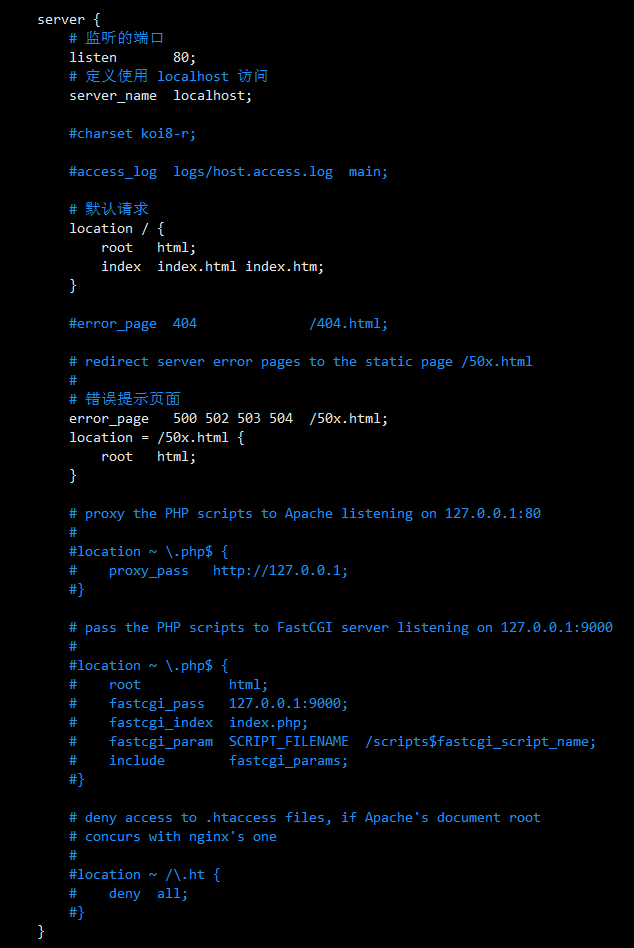
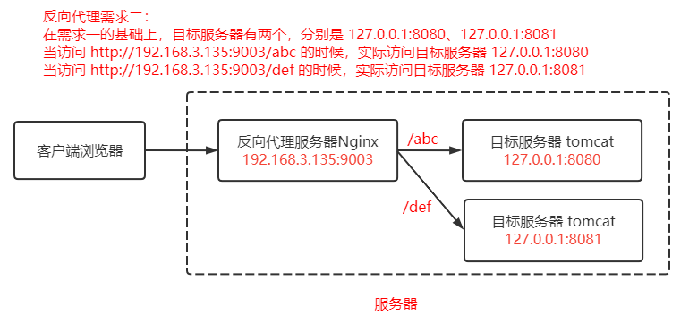
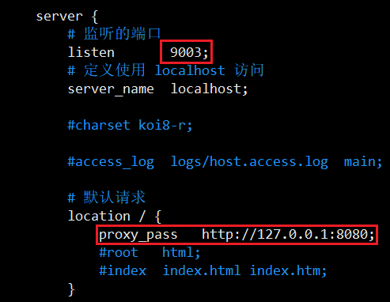
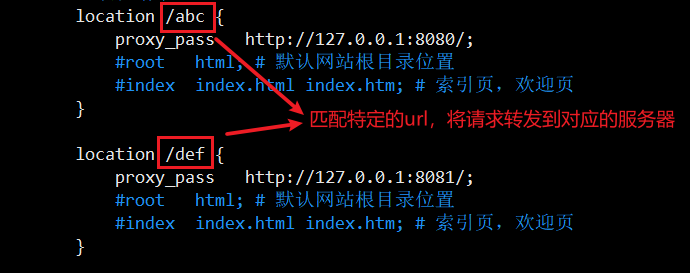
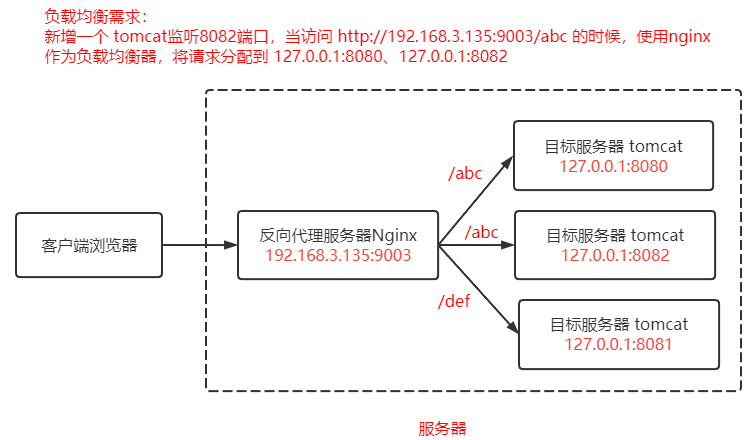
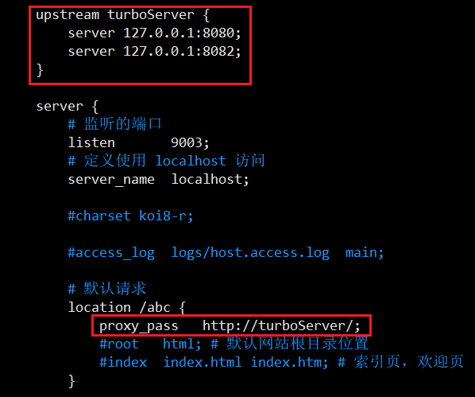
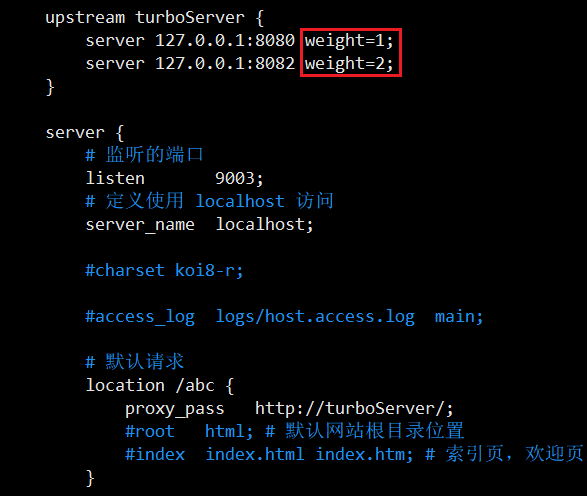
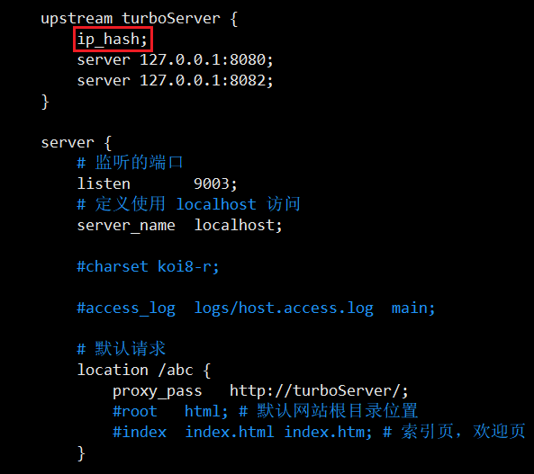

> Nginx

# 1 Nginx 基础回顾


- Nginx 到底是什么？

  Nginx 是一个高性能的 HTTP 和 反向代理 web 服务器，核心特点是占有内存少，并发能力强。

- Nginx 又能做什么事情（应用场景）

  - Http 服务器（Web 服务器）

    性能非常高，非常注重效率，能够经受高负载的考验

    支持 50,000 个并发连接数，不仅如此，CPU 和内存的占用也非常低，10,000 个没有活动的连接才占用 2.5 M的内存。

  - 反向代理服务器

    - 正向代理

      在浏览器中配置代理服务器的相关信息，通过代理服务器访问目标网站，代理服务器收到目标网站的响应之后，会把响应信息返回给我们自己的浏览器客户端。

    - 反向代理

      浏览器客户端发送请求到反向代理服务器（比如 Nginx），由反向代理服务器选择原始服务器提供服务获取结果响应，最终再返回给客户端浏览器。

  - 负载均衡服务器

    负载均衡，当一个请求到来的时候（结合上图），Nginx 反向代理服务器根据请求去找到一个原始服务器来处理当前请求，那么这叫反向代理。那么如果目标服务器有多台，找哪一个目标服务器来处理当前请求呢，这样一个寻找确定的过程叫做负载均衡。

    负载均衡就是为了解决高负载的问题。

  - 动静分离


## 1.1 Nginx的安装

1. 上传nginx安装包到linux服务器，安装包（.tar）文件下载地址：https://nginx.org/en/download.html，使用 1.17.8 版本

2. 安装 Nginx 依赖，pcre、openssl、gcc、zlib （推荐使用yum 源自动安装）

   ```bash
   yum -y install gcc zlib zlib-devel pcre-devel openssl openssl-devel
   ```

3. 加压 nginx 安装包

   ```bash
   tar -xvf nginx-1.17.8.tar
   ```

4. 进入解压之后的目录 nginx-1.17.8

   ```bash
   cd nginx-1.17.8
   ```

5. 命令执行 

   ```bash
   ./configure
   make
   make install
   ```

   之后会在 /usr/local/下会产生一个 nginx 目录

   

6. 进入 sbin 目录中，执行启动命令 

   ```bash
   cd nginx/sbin
   ./nginx
   ```

   然后访问服务器 80 端口（nginx 默认监听 80 端口）

   

## 1.2 Nginx 主要命令

- `./nginx` 启动 nginx
- `./nginx -s stop` 终止nginx（也可以 kill -9 nginx进程号）
- `./nginx -s reload`  重新加载 nginx.conf 配置文件

# 2 Nginx 核心配置文件解读

Nginx 的核心配置文件 conf/nginx.conf 中包含三块内容：全局快、events 块、http 块

- 全局块

  从配置文件开始到 events 块之间的内容，此处的配置影响 nginx 服务器整体的运行，比如 worker 进程的数量、错误日志的位置等。

  

- events 块

  events 块主要影响 nginx 服务器与用户的网络连接，比如 worker_connections 1024 ，标识每个worker process 支持的最大连接数为 1024。

  

- http块

  http块 是配置最频繁的部分，虚拟主机的配置，监听端口的配置，请求转发、反向代理、负载均衡等。

  

  

  

# 3 Nginx 应用场景之反向代理

需求：




## 3.1 需求一

1. 部署 tomcat，保持默认监听 8080 端口

2. 修改 nginx 配置，并重新加载

   修改 nginx 中 http 块的配置

   

   重新加载 nginx 配置 `./nginx -s reload`

3. 测试，访问 http://192.168.3.135:9003，

   

## 3.2 需求二

1. 在部署一台 tomcat，保持默认监听 8081 端口

2. 修改 nginx 配置，并重新加载

   

3. 测试

   访问：http://192.168.3.135:9003/abc

   

   访问：http://192.168.3.135:9003/def

   

   


这里主要是 **多localhost的使用，这里的nginx中的 http/server/location 就好比 tomcat 中的 Server/Service/Engine/Host/Context**

location 语法如下：

```bash
location [=|^~|~*|~] /uri/ {...}
```

在 nginx 配置文件中，location 主要有这几种形式：

1. 正则匹配 `location ~/turbo{}`
2. 不区分大小写的正则匹配 `location ~*/turbo {}`
3. 匹配路径的前缀 `location ^~/turbo {}`
4. 精准匹配 `location =/turbo {}`
5. 普通路径前缀匹配 `location /turbo {}`

优先级：4>3>2>1>5

# 4 Nginx 应用场景之负载均衡



Nginx 负载均衡策略

## 4.1 轮询

默认策略，每个请求按时间顺序逐一分配到不同的服务器，**如果某一个服务器下线，能自动剔除**



## 4.2 weight

weight 代表权重，默认每一个负载的服务器都为1，去找你红越高那么被分配的请求越多（用于服务器性能不均衡的场景）



## 4.3 ip_hash

每个请求按照 ip 的 hash 结果分配，每一个客户端的请求会固定分配到同一个目标服务器处理，可以解决 session 问题。



# 5 Nginx 应用场景之动静分离

# 6 Nginx 底层进程机制剖析