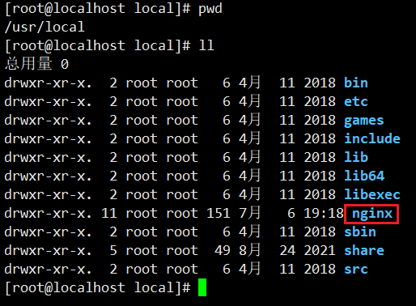
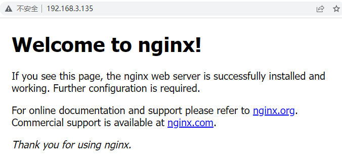

> Nginx

# 1 Nginx 基础回顾


- Nginx 到底是什么？

  Nginx 是一个高性能的 HTTP 和 反向代理 web 服务器，核心特点是占有内存少，并发能力强。

- Nginx 又能做什么事情（应用场景）

  - Http 服务器（Web 服务器）

    性能非常高，非常注重效率，能够经受高负载的考验

    支持 50,000 个并发连接数，不仅如此，CPU 和内存的占用也非常低，10,000 个没有活动的连接才占用 2.5 M的内存。

  - 反向代理服务器

    - 正向代理

      在浏览器中配置代理服务器的相关信息，通过代理服务器访问目标网站，代理服务器收到目标网站的响应之后，会把响应信息返回给我们自己的浏览器客户端。

    - 反向代理

      浏览器客户端发送请求到反向代理服务器（比如 Nginx），由反向代理服务器选择原始服务器提供服务获取结果响应，最终再返回给客户端浏览器。

  - 负载均衡服务器

    负载均衡，当一个请求到来的时候（结合上图），Nginx 反向代理服务器根据请求去找到一个原始服务器来处理当前请求，那么这叫反向代理。那么如果目标服务器有多台，找哪一个目标服务器来处理当前请求呢，这样一个寻找确定的过程叫做负载均衡。

    负载均衡就是为了解决高负载的问题。

  - 动静分离


## 1.1 Nginx的安装

1. 上传nginx安装包到linux服务器，安装包（.tar）文件下载地址：https://nginx.org/en/download.html，使用 1.17.8 版本

2. 安装 Nginx 依赖，pcre、openssl、gcc、zlib （推荐使用yum 源自动安装）

   ```bash
   yum -y install gcc zlib zlib-devel pcre-devel openssl openssl-devel
   ```

3. 加压 nginx 安装包

   ```bash
   tar -xvf nginx-1.17.8.tar
   ```

4. 进入解压之后的目录 nginx-1.17.8

   ```bash
   cd nginx-1.17.8
   ```

5. 命令执行 

   ```bash
   ./configure
   make
   make install
   ```

   之后会在 /usr/local/下会产生一个 nginx 目录

   

6. 进入 sbin 目录中，执行启动命令 

   ```bash
   cd nginx/sbin
   ./nginx
   ```

   然后访问服务器 80 端口（nginx 默认监听 80 端口）

   

## 1.2 Nginx 主要命令

- `./nginx` 启动 nginx
- `./nginx -s stop` 终止nginx（也可以 kill -9 nginx进程号）
- `./nginx -s reload`  重新加载 nginx.conf 配置文件

# 2 Nginx 核心配置文件解读

# 3 Nginx 应用场景之反向代理

# 4 Nginx 应用场景之负载均衡

# 5 Nginx 应用场景之动静分离

# 6 Nginx 底层进程机制剖析