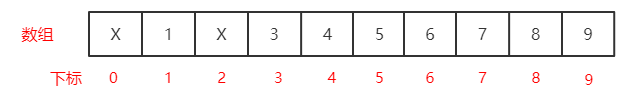
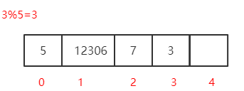
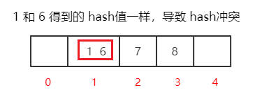
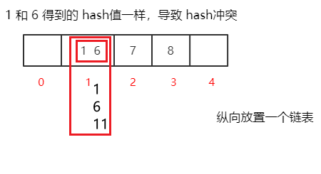
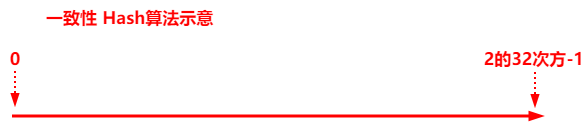
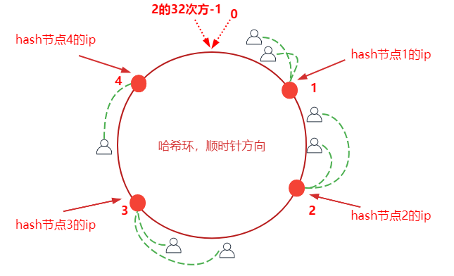
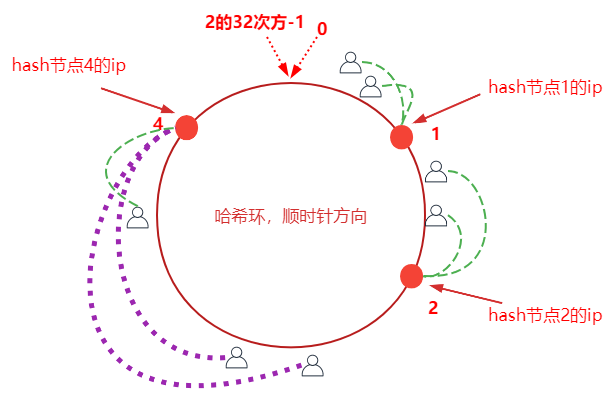
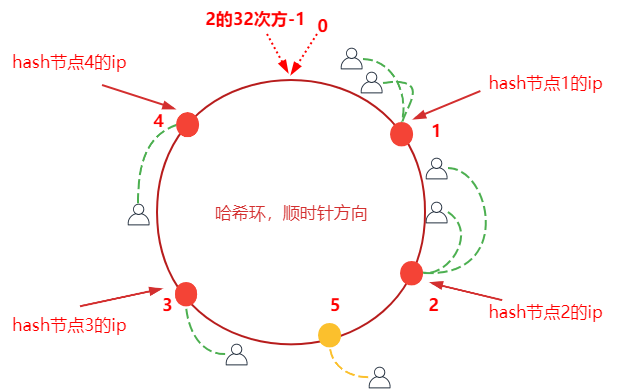
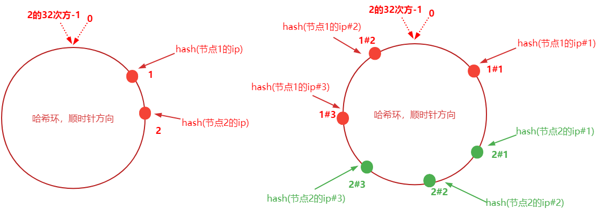

> 第一部分 一致性Hash算法

Hash 算法，在安全加密领域 MD5、SHA 等加密算法，在数据存储和查找方面有 Hash 等，以上都应用到了 Hash 算法。

为什么需要使用 Hash？

Hash 算法较多的应用在数据存储和查找领域，最经典的就是 Hash 表，它的查询效率非常之高，其中哈希算法如果设计的比较 :ok_hand: 的话，那么Hash表的数据查询时间复杂度可以接近于 O(1)，示例：

```
需求：提供一组数据 `1, 5, 7, 6, 3, 4, 8`，对这组数据进行存储，
然后随便给定一个数 n，请你判断 n 是否存在于数据集 list:List[1, 5, 7, 6, 3, 4, 8] 中
```

1. 通过循环判断来实现

   ```java
   for(int element:list){
       if(element == n){
           // 如果相等，说明n存在于数据集中
       }
   }
   ```

   这种方法叫做 **顺序查找法**：这种方式通过循环完成，比较原始，效率低

2. 二分查找

   排序之后折半查找，相对于顺序查找法会提高效率，但是效率也并不是很好


当然 可以不循环，不二分。



定义一个数组，数组长度等于数据集长度，此处长度为 9，数据1就在下标为1的位置，3就在下标为3的位置，以此类推。

这时，判断 5 是否存在，只需要判断 array[5] 是否为空，若为空，说明 5 不存在；若不为空，则说明5存在。通过一次查询就达到目的，时间复杂度为 O(1)。

这种方式叫做 **直接寻址法**：直接把数据和数组下标绑定到一起，查找的时候，直接 array[n] 就可以取出数据。

优点：速度快，一次查找得到结果

缺点：

1. 浪费空间，比如 1,5,7,6,3,4,8,12308，最大值 12308，按照上述方式需要定义一个长度为 12309 的数组，但只存储零星数据，其他都浪费。
2. 数据如：1,5,3,4,8,12,1,2,1,2,1,2,1,2,1,2,1,2,1,2,1,2,1,2 最大值12，开辟 13 个空间存储不下。


现在换一种涉及，如果数据是 3，5，7，12306，一共 4 个数据，开辟任意个空间，比如 5 个，根据求模取余确定存储位置的下标。



数据%空间长度，就是一种 hash 算法，只不过这是一种比较普通又简单的 hash 算法，这种构造Hash算法的方式叫做除留余数法。

如果数据是 1，6，7，8，把这4个数据存储到上面的数组中：



在此基础上采用开放寻址法（了解即可）

**开放寻址法**：1放进去了，6再来的时候，向前或者向后找空闲位置存放。不好的地方：定义好的数组长度不能扩展，那么不管Hash冲不冲突，数据多了就存不下。

**拉链法**：数据长度定义好了，怎么存储更多的内容？算好 hash 值，在数据元素存储位置放一个链表。



如果 Hash 算法设计的比较好的话，那么查询效率会更接近于 O(1)，如果 Hash 算法设计的比较 low，那么查询效率就会很低。

所以，Hash表的查询效率高不高取决于hash算法，hash算法能够让数据平均分布，即能节省空间又能提高查询效率。Hash 算法的研究是很深的一门学问。比较复杂，长久以来，Hash表内部的hash算法也一直在更新，很多数学家也在研究。

```xml
除留余数法
线性构造hash算法
直接寻址法也是一种构造hash的方式，只不过更简单，表达式：H(key)=key，比如H(key)=a*key+b (a,b是常量)
hashcode其实也是通过hash算法得出来的
```

# 1 Hash算法应用场景

Hash 算法在分布式集群架构中的应用场景

Hash 算法在很多分布式集群产品中都有应用，比如分布式集群架构 Redis、Hadoop、ElasticSearch、MySQL 分库分表、Nginx负载均衡 等。

主要的应用场景归纳起来两个

- 请求的负载均衡（比如 nginx 的 ip_hash 策略）

  Nginx的 ip_hash 策略可以在客户端 ip 不变的情况下，将其发出的请求始终路由到同一个目标服务器上，实现会话粘滞，避免处理session共享问题。

  如果没有 ip_hash 策略，那么如何实现会话粘滞？

  可以维护一张映射表，存储客户端 IP 或者 session id 与具体目标服务器的映射关系 `<ip, tomcat>`

  缺点：

  1. 在客户端很多的情况下，映射表非常大，浪费内存空间
  2. 客户端上下线，目标服务器上下线，都会导致重新维护映射表，映射表维护成本很大

  如果使用哈希算法，就简单很多。可以对

- 分布式存储

  以分布式内存数据库 Redis 为例，集群中有 redis1，redis2，redis3 三台 Redis 服务器。那么，在及逆行数据存储时，<key1,value1>数据存储到哪个服务器当中？针对key进行 hash 处理 `hash(key1)%3=index` ，使用余数 index 锁定存储的具体服务器节点。


# 2 普通Hash算法存在的问题

普通 Hash 算法存在一个问题，以 ip_hash 为例，假定下载用户 ip 固定没有发生变化，现在 tomcat3 出现了问题，服务器数量由 3 个变为 2 个，之前所有的求模都需要重新计算。

如果在真实生产情况下，后台服务器很多台，客户端也有很多，那么影响是很大的，缩容和扩容都会存在这样的问题，大量用户的请求会被路由到其他目标服务器处理，用户在原来服务器中的会话都会丢失。

# 3 一致性Hash算法

一致性哈希算法思路如下：



首先有一条直线，直线开头和解位分别定义为 0 和 2的32次方减1，这相当于一个地址，对于这样一条线，弯过来构成一个圆环形成闭环，这样的一个圆环称为 hash 环。<br>我们把服务器的 ip 或者 主机名 求 hash 值然后对应到 hash 环上，<br>那么针对客户端用户也根据它的 ip 进行 hash 求值，对应到环上某个位置，然后如何确定一个客户端路由到哪个服务器处理呢？按照顺时针方向找最近的服务器节点。



加如将服务器3 下线，服务3下线后，原来路由到3的客户端重新路由到服务器4，对于其他客户端没有影响（请求的迁移达到了最小，这样的算法对分布式集群来说非常合适，避免了大量请求迁移）



增加服务器5之后，原来路由到3的部分客户端路由到新增服务器5上，对于其他客户端没有。




1. 如前所述，每一套服务器负责一段，一致性哈希算法对于节点的增减都只需要重定位环空间中的一小部分数据，具有较好的容错性和可扩展性。

   但是，一致性哈希算法在服务节点太少时，容器因为节点部分不均匀而造成**数据倾斜**问题。例如系统中只有两台服务器，其环形分布如下，节点2只能负责非常小的一段，大量的客户端请求落在了节点1上，这就是**数据（请求）倾斜问题**。负载非常均衡

2. 为了解决这种数据倾斜问题，一致性哈希算法引入了虚拟节点机制，即对每一个服务节点计算多个哈希，每个计算结果位置都放置一个此服务节点，称为虚拟节点。

   具体做法可以在服务器ip 或主机名的后面增加编号来实现。比如为每台服务器计算三个虚拟节点，“节点1的ip#1”、“节点1的ip#2”、“节点1的ip#3”、“节点2的ip#1”、“节点2的ip#2”、“节点2的ip#3” 的哈希值。当客户端被路由到此虚拟节点的时候其实是被路由到该虚拟节点所对应的真实节点。




# 4 实现一致性Hash算法

# 5 Nginx配置一致性 Hash 负载均衡策略


