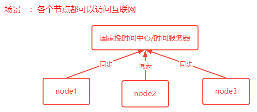
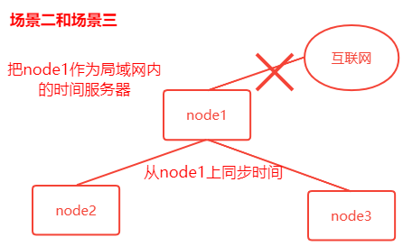

> 第二部分 集群时钟同步问题

# 1 始终不同步导致的问题

# 2 集群始终同步配置

**集群始终同步思路**

- 分布式集群中各个服务器节点都可以连接**互联网**

  思路：

  

  操作方式：

  ```bash
  #使用 ntpdate 网络事件同步命令
  ntpdate -u utp.api.bz # 从一个事件服务器同步时间
  ```

  windows有计划任务；Linux 也有定时任务，crond，可以使用 linux 的定时任务，每隔10分钟执行一次 ntpdate 命令。

- 分布式集群中某一个服务器节点可以访问**互联网**或者所有节点都不能访问**互联网**

  思路

  

  操作方式：

  1. 选取集群中的一个服务器节点 A（172.17.0.17） 作为时间服务器（整个集群时间从这台服务器同步，如果这台服务器能够访问互联网，可以让这台服务器和网络时间保持同步，如果不能就手动设置一个时间）

     - 首先设置好 A 的时间

     - 把 A 配置为时间服务器（修改 /etc/ntp.conf 文件）

       ```bash
       1. 如果有 restrict default ignore，注释它
       2. 添加如下几行内容
       	restrict 172.17.0.0 mask 255.255.255.0 nomodify notrap # 放开局域网同步功能，172.17.0.0 是局域网网段
       	server  127.127.1.0 # local clock
       	fudge 127.127.1.0 stratum 10
       3. 重启生效并配置 ntpd 服务器开机自启动
       	service ntpd restart
       	chkconfig ntpd on
       ```

     - 集群中其他节点就可以从 A 服务器同步时间了

       ```bash
       ntpdate 172.17.0.17
       ```


