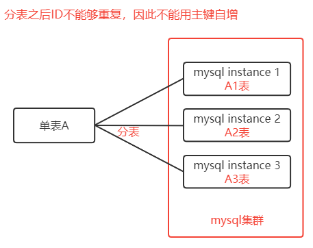
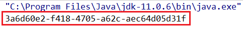
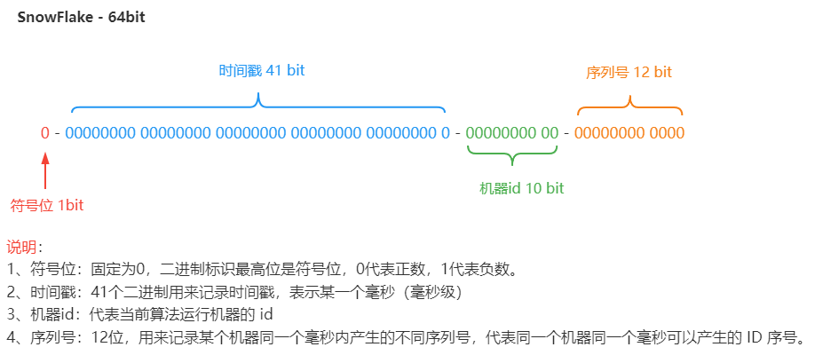

> 第三部分 分布式ID解决方案

为什么需要分布式 ID（分布式集群环境下的全局唯一 ID）



# 1 UUID（可以用）

**UUID** 是指 Universally Unique Identifier，翻译为中文是**通用唯一识别码**

产生重复 UUID 并造成错误的情况非常低，是故可不必考虑此问题。

Java 中得到一个 UUID，可以使用 java.util 包提供的方法

```java
import java.util.UUID;

public class MyTest {

    public static void main(String[] args) {
        System.out.println(UUID.randomUUID().toString());
    }
}
```



# 2 独立数据库的自增ID

比如 A 表分为 A1 表 和 A2 表，那么肯定不能让 A1 表 和 A2 表的 ID 自增，那么ID 怎么获取呢？我们可以单独的创建一个 MySQL 数据库 ，在这个数据库中创建一张表，这张表的ID设置为自增，其他地方需要全局唯一 ID 的时候，就模拟向这个MySQL数据库的这张表中模拟插入一条记录，此时 ID 会自增，然后我们可以通过 MySQL 的 select last_insert_id() 获取到刚刚这张表中自增生成的 ID。

比如：我们创建一个数据库实例 global_id_generator，在其中创建一个数据表，表结构如下：

```sql
DROP TABLE IF EXISTS `DISTRIBUTE_ID`; 

CREATE TABLE `DISTRIBUTE_ID` (
  `id` bigint(32) NOT NULL AUTO_INCREMENT COMMENT '主键',   
	`createtime` datetime DEFAULT NULL,
  PRIMARY KEY (`id`)
) ENGINE=InnoDB DEFAULT CHARSET=utf8;
```

当分布式集群环境中哪个应用需要获取一个全局唯一的分布式 ID 的时候，就可以使用代码连接这个数据库实例，执行如下 sql 语句即可。

```sql
insert into DISTRIBUTE_ID(createtime) values(NOW()); 
select LAST_INSERT_ID()；
```

注意：

1. 这里的 createtime 字段没有实际意义，是为了随便插入一条数据以至于能够自增 id。
2. 使用独立的 MySQL 实例生成分布式 id，虽然可行，但是性能和可靠性都不够好，因为你需要代码连接到数据库才能获取到 id，性能无法保障，另外 mysql 数据库实例挂掉了，那么就无法获取分布式 id 了。
3. 有一些开发者有针对上述的情况将用于生成分布式 id 的mysql 数据库设计成了一个集群架构，那么其实这种方式现在基本不用，因为过于麻烦了。

# 3 SnowFlake 雪花算法（可以用，推荐）

雪花算法是Twitter推出的一个用于生成分布式 ID 的策略。

雪花算法是一个算法，基于这个算法可以生成 ID，生成的 ID 是一个 long 型，那么在 Java 中一个 long 型是 8 个字节（64bit），如下是使用雪花算法生成的一个 ID 的二进制示意：



另外，一些互联网公司也基于上述的方案封装了一些分布式 ID 生成器，比如滴滴的 tinyid（基于数据库实现）、百度的 uidgenerator（基于 SnowFlake）和 美团的 leaf（基于数据库和SnowFlake）等。

# 4 借助 Redis 的 Incr 命令获取全局唯一 ID

Redis Incr 命令将 key 中存储的数值增 1。如果 key 不存在，那么 key 的会先被初始化为 0 ，然后再执行 INCR 操作。

实例代码：

- 引入 jedis 客户端 jar

  ```xml
  <dependency>
      <groupId>redis.clients</groupId>
      <artifactId>jedis</artifactId>
      <version>3.1.0</version>
  </dependency>
  ```

- Java 代码（此处就是连接单节点，不使用连接池）

  ```java
  public static void main(String[] args) {
      Jedis jedis = new Jedis("152.136.177.192", 6379);
      try {
          Long id = jedis.incr("id");
          System.out.println(id);
      } finally {
          if(null != jedis){
              jedis.close();
          }
      }
  }
  ```


