> 第四部分 分布式调度问题

调度（定时任务），分布式调度（在分布式集群环境下的定时任务）

[elastic-job](https://gitee.com/elasticjob/elastic-job) 当当网开源的分布式调度框架

# 1 定时任务的场景

定时任务形式：每隔一定时间/特定某一时刻执行。

# 2 什么是分布式调度

什么是分布式任务调度？有两层含义

1. 运行在分布式集群环境下的调度任务（同一个定时任务程序部署多分，只应该有一个定时任务在执行）
2. 分布式调度 ----> 定时任务的分布式 ----> 定时任务的拆分（即为把一个大的作业任务拆分为多个小的作业任务，同时执行）


# 3 定时任务与消息队列的区别

- 共同点

  - 异步处理

    比如注册、下单事件

  - 应用解耦

    不管定时任务作业还是 MQ 都可以作为两个应用之间的齿轮实现应用解耦，这个齿轮可以中转数据，当然单体服务不需要考虑这些，服务拆分的时候往往都会考虑。

  - 流量削峰

- 本质不同

  **定时任务作业是时间驱动，而 MQ 是事件驱动；**

  时间驱动是不可替代的，比如金融系统每日的利息结算，不是说利息来一条（利息到来事件）就算一下，而往往是通过定时任务批量计算；

  所以，定时任务作业更倾向于批处理，MQ倾向于逐条处理；

  

# 4 定时任务的实现方式

定时任务的实现方式有多种。早期没有定时任务框架的时候，我们会使用 JDK 中的 Timer 机制的多线程机制（Runnable + 线程休眠）来实现定时 或者 间隔一段时间 执行某一段程序；后来有了定时任务框架，比如大名鼎鼎的 Quartz 任务调度框架，使用时间表达式（包括：秒、分、时、日、周、年）配置某一个任务什么时间去执行：

任务调度框架Quartz回顾示意（主要内容不是 Quartz）

- 引入 jar

  ```xml
  <!--任务调度框架quartz-->
  <dependency>
      <groupId>org.quartz-scheduler</groupId>
      <artifactId>quartz</artifactId>
      <version>2.3.2</version>
  </dependency>
  ```

- 定时任务作业主调度程序

  ```java
  package quartz;
  
  import org.quartz.*;
  import org.quartz.impl.StdSchedulerFactory;
  
  public class QuartzMan {
  
      /**
       * 1、创建任务调度器
       * @return
       * @throws SchedulerException
       */
      public static Scheduler createScheduler() throws SchedulerException {
          SchedulerFactory schedulerFactory = new StdSchedulerFactory();
          Scheduler scheduler = schedulerFactory.getScheduler();
          return scheduler;
      }
  
      /**
       * 2、创建一个任务
       * @return
       */
      public static JobDetail createJob(){
          // 这个地方可以传入任务类
          JobBuilder jobBuilder = JobBuilder.newJob(DemoJob.class); //TODO 自定义任务类
          jobBuilder.withIdentity("jobName","myJob");
          JobDetail jobDetail = jobBuilder.build();
          return jobDetail;
      }
  
  
      /**
       * 3、任务的时间触发器
       * 创建作业任务时间触发器（类似于公交⻋出⻋时间表） * cron表达式由七个位置组成，空格分隔
       * 1、Seconds（秒）  0~59
       * 2、Minutes（分）  0~59
       * 3、Hours（⼩时）  0~23
       * 4、Day of Month（天）1~31,注意有的⽉份不⾜31天
       * 5、Month（⽉） 0~11,或者 JAN,FEB,MAR,APR,MAY,JUN,JUL,AUG,SEP,OCT,NOV,DEC
       * 6、Day of Week(周)  1~7,1=SUN或者  SUN,MON,TUE,WEB,THU,FRI,SAT
       * 7、Year（年）1970~2099  可选项
       *   示例：
       *      0 0 11 * * ? 每天的11点触发执⾏⼀次
       *      0 30 10 1 * ? 每⽉1号上午10点半触发执⾏⼀次 */
      public static Trigger createTrigger(){
          // 创建时间触发器
          CronTrigger cronTrigger = TriggerBuilder.newTrigger()
                  .withIdentity("triggerName","myTrigger")
                  .startNow()
                  .withSchedule(CronScheduleBuilder.cronSchedule("*/2 * * * * ?"))
                  .build();
          // 创建触发器，按简单间隔调度
          /*SimpleTrigger cronTrigger = TriggerBuilder.newTrigger().withIdentity("triggerName", "myTrigger")
                  .startNow()
                  .withSchedule(SimpleScheduleBuilder
                          .simpleSchedule()
                          .withIntervalInSeconds(3)
                          .repeatForever())
                  .build();*/
          return cronTrigger;
  
      }
  
  
      /**
       * main函数中开启定时任务
       * @param args
       */
      public static void main(String[] args) throws SchedulerException {
          // 1、创建任务调度器
          Scheduler scheduler = QuartzMan.createScheduler();
  
          // 2、创建一个任务
          JobDetail job = QuartzMan.createJob();
          // 3、任务的时间触发器
          Trigger trigger = QuartzMan.createTrigger();
          // 4、使用任务调度器根据时间触发器执行我们的任务
          scheduler.scheduleJob(job,trigger);
          scheduler.start();
      }
  }
  ```

- 定义一个 job，需要实现 Job 接口

  ```java
  package quartz;
  
  import org.quartz.Job;
  import org.quartz.JobExecutionContext;
  import org.quartz.JobExecutionException;
  
  import java.text.SimpleDateFormat;
  import java.util.Date;
  
  public class DemoJob implements Job {
  
      @Override
      public void execute(JobExecutionContext jobExecutionContext) throws JobExecutionException {
          SimpleDateFormat simpleDateFormat = new SimpleDateFormat("yyyy-MM-dd HH:mm:ss");
  
          System.out.println("我是一个定时任务执行逻辑 : " + simpleDateFormat.format(new Date()));
      }
  }
  ```

以上，是回顾一下任务调度框架 Quartz 的大致用法，那么在分布式架构环境中使用 Quartz 已经不能更好的满足我们需求，可以使用专业的分布式调度框架，这里推荐使用 Elastic-Job。

# 5 分布式调度框架 Elastic-Job

## 5.1 Elastic-Job 介绍

Elastic-Job是当当网开源的一个分布式调度解决方案，基于 Quartz二次开发，由两个相互独立的子项目 Elastic-Job-Lite 和 Elastic-Job-Cloud 组成。我们主要学习的是 Elastic-Job-Lite，它定位为轻量级无中心化解决方案，使用 Jar 包的形式提供分布式任务的协调服务；而 Elastic-Job-Cloud 子项目需要结合 Mesos 以及 Docker 在云环境下使用。

Elastic-Job 的 github 地址：https://github.com/apache/shardingsphere-elasticjob，<br>文档：https://shardingsphere.apache.org/elasticjob/current/cn/overview/#elasticjob-lite

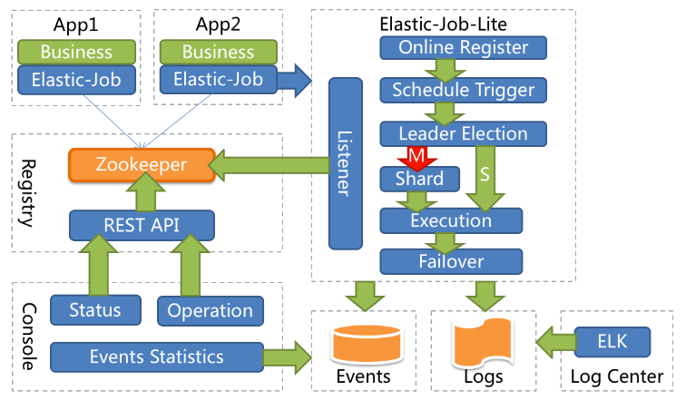

**主要功能介绍**

- 分布式调度协调

  在分布式环境中，任务能够按指定的调度策略执行，并且能够避免同一任务多实例重复执行

- 丰富的调度策略。

  基于成熟的定时任务作业框架 Quartz cron 表达式 执行定时任务

- 弹性扩容缩容。

  当集群中增加某一个实例，它应当也能够被选举并执行任务；当集群减少一个实例时，它所执行的任务能被转移到别的实例来执行。

- 失效转移。

  某实例在任务执行失败后，会被转移到其他实例执行

- 错过执行作业重触发。

  若因为某种原因导致作业错过执行，自动记录错过执行的作业，并在上次作业完成后自动自动触发。

- 支持并行调度，支持任务分片。

  任务分片是指将一个任务分为多个小任务在多个实例同时执行。

- 作业分片一致性。

  当任务被分片后，保证同一分片在分布式环境中仅一个执行实例

## 5.2 Elastic-Job-Lite 应用

jar 包（API）+ 安装 zk 软件

Elastic-Job 依赖于 Zookeeper 进行分布式协调，所以需要安装 Zookeeper 软件（3.4.6 版本以上）。此处需要明白 Zookeeper 的半只功能：存储 + **通知**。

### 5.2.1 安装 Zookeeper（此处单例配置）

zookeeper-3.4.10 下载地址： http://archive.apache.org/dist/zookeeper/zookeeper-3.4.10/

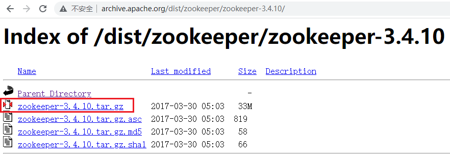

1. 上传 zookeeper-3.4.10.tar.gz 到 linux，并解压

2. 进入 conf 目录，cp zoo_sample.cfg zoo.cfg

3. 进入 bin 目录，启动 zk 服务

   ```bash
   # 启动
   ./zkServer.sh start
   # 停止
   ./zkServer.sh stop
   # 查看状态
   ./zkServer.sh status
   ```

   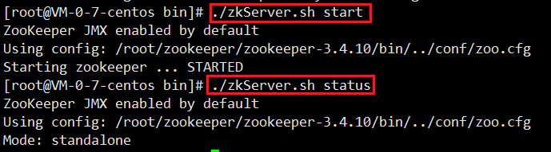


**Zookeeper的树形节点结构图**

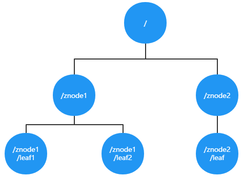

### 5.2.2 代码

#### 5.2.2.1 引入 Jar

```xml
<!-- https://mvnrepository.com/artifact/com.dangdang/elastic-job-lite-core -->
<!--elastic-job-lite核心包-->
<dependency>
    <groupId>com.dangdang</groupId>
    <artifactId>elastic-job-lite-core</artifactId>
    <version>2.1.5</version>
</dependency>
```

#### 5.2.2.2 定时任务实例

- 需求：每隔两秒执行一次定时任务（resume表中未归档的数据归档到 resume_bak 表中，每次归档一条记录）

  - resume_bak 和 resume 表结构完全一致
  - resume 表中数据归档之后不删除，只将 state 置为 “已归档”

- 数据表结构

  ```sql
  -- ---------------------------- 
  -- Table structure for resume
  -- ---------------------------- 
  DROP TABLE IF EXISTS `resume`;
  
  CREATE TABLE `resume` (
  	`id` BIGINT (20) NOT NULL AUTO_INCREMENT,
  	`name` VARCHAR (255) DEFAULT NULL,
  	`sex` VARCHAR (255) DEFAULT NULL,
  	`phone` VARCHAR (255) DEFAULT NULL,
  	`address` VARCHAR (255) DEFAULT NULL,
  	`education` VARCHAR (255) DEFAULT NULL,
  	`state` VARCHAR (255) DEFAULT NULL,
  	PRIMARY KEY (`id`)
  ) ENGINE = INNODB AUTO_INCREMENT = 1001 DEFAULT CHARSET = utf8;
  
  
  SET FOREIGN_KEY_CHECKS = 1;
  ```

#### 5.2.2.3 程序开发

- 定时任务类

  ```java
  /**
   * ElasticJobLite定时任务业务逻辑处理类
   * @author yutao
   */
  public class ArchiveJob implements SimpleJob {
      /**
       *
       * 需求：每隔两秒钟执⾏⼀次定时任务（resume表中未归档的数据归档到resume_bak表中， 每次归档1条记录）
       *
       * execute 方法中写我们的业务逻辑 （execute每次定时任务都会执行一次）
       * @param shardingContext
       */
      @Override
      public void execute(ShardingContext shardingContext) {
  
          int shardingItem = shardingContext.getShardingItem();
          System.out.println("====>当前分片："+shardingItem);
  
          // 0=bachelor,2=master,3=doctor
          String shardingParameter = shardingContext.getShardingParameter();
  
          // 1、从resume中查询出未归档的数据1条
          String selectSql = "select * from resume where state='未归档' and education='"+shardingParameter+"' limit 1";
          List<Map<String, Object>> list = JdbcUtil.executeQuery(selectSql);
          if(list == null || list.size() == 0){
              System.out.println("数据已经处理完毕!");
              return;
          }
          // 2、“未归档”更改为“已归档”
          Map<String, Object> stringObjectMap = list.get(0);
          long id = (long) stringObjectMap.get("id");
          String name = (String) stringObjectMap.get("name");
          String education = (String) stringObjectMap.get("education");
  
          System.out.println("========> id:"+id+" name:"+name+" education:"+education);
  
          String updateSql = "update resume set state='已归档' where id = ?";
          JdbcUtil.executeUpdate(updateSql,id);
          // 3、把归档的数据插入 resume_bak表中
          String insertSql = "insert into resume_bak select * from resume where id = ?";
          JdbcUtil.executeUpdate(insertSql,id);
      }
  }
  ```

  

- 主类

  ```java
  public class ElasticJobMain {
  
      public static void main(String[] args) {
          // 1、配置分布式协调服务（注册中心）Zookeeper
          ZookeeperConfiguration zookeeperConfiguration = new ZookeeperConfiguration("152.136.177.192:2181","data-archive-job");
          // 注册中心对象
          CoordinatorRegistryCenter coordinatorRegistryCenter = new ZookeeperRegistryCenter(zookeeperConfiguration);
          coordinatorRegistryCenter.init();
  
          // 任务配置 （时间事件、定时任务业务逻辑、调度器）
          JobCoreConfiguration jobCoreConfiguration = JobCoreConfiguration.newBuilder("archive-job",
                  "*/2 * * * * ?",
                  3)
                  .shardingItemParameters("0=bachelor,1=master,2=doctor")
                  .build();
  
          SimpleJobConfiguration simpleJobConfiguration = 
              new SimpleJobConfiguration(jobCoreConfiguration,ArchiveJob.class.getName());
  
          JobScheduler jobScheduler = new JobScheduler(coordinatorRegistryCenter, LiteJobConfiguration.newBuilder(simpleJobConfiguration).overwrite(true).build());
          jobScheduler.init();
  
      }
  }
  ```

  

- JdbcUtil工具类

  ```java
  public class JdbcUtil {
  
      /**
       * url
       */
      private static String url = "jdbc:mysql://152.136.177.192:3306/bank?characterEncoding=utf8&useSSL=false";
      /**
       * user
       */
      private static String user = "root";
      /**
       * password
       */
      private static String password = "123456";
      /**
       * 驱动程序类
       */
      private static String driver = "com.mysql.jdbc.Driver";
  
      static {
          try {
              Class.forName(driver);
          } catch (ClassNotFoundException e) {
              // TODO Auto-generated catch block e.printStackTrace();
          }
      }
  
      public static Connection getConnection() {
          try {
              return DriverManager.getConnection(url, user,password);
          } catch (SQLException e) {
              // TODO Auto-generated catch block e.printStackTrace();
              e.printStackTrace();
          }
          return null;
      }
  
  
  
      public static void close(ResultSet rs, PreparedStatement ps, Connection con) {
          if(rs != null){
              try {
                  rs.close();
              } catch (SQLException e) {
                  e.printStackTrace();
              }finally {
                  if(ps != null){
                      try {
                          ps.close();
                      } catch (SQLException e) {
                          e.printStackTrace();
                      }finally {
                          if(con!=null){
                              try {
                                  con.close();
                              } catch (SQLException e) {
                                  e.printStackTrace();
                              }
                          }
                      }
                  }
  
              }
          }
      }
  
      public static void executeUpdate(String sql,Object...obj){
          Connection con = getConnection();
          PreparedStatement ps = null;
          try {
              ps = con.prepareStatement(sql);
              for (int i = 0; i < obj.length; i++) {
                  ps.setObject(i+1,obj[i]);
              }
              ps.executeUpdate();
          } catch (SQLException e) {
              e.printStackTrace();
          }finally {
              close(null,ps,con);
          }
      }
  
      public static List<Map<String,Object>> executeQuery(String sql, Object...obj) {
          Connection con = getConnection();
          ResultSet rs = null;
          PreparedStatement ps = null;
          try {
              ps = con.prepareStatement(sql);
              for (int i = 0; i < obj.length; i++) {
                  ps.setObject(i + 1, obj[i]);
              }
              rs = ps.executeQuery();
              List<Map<String, Object>> list = new ArrayList<>();
              int count = rs.getMetaData().getColumnCount();
  
              while (rs.next()) {
                  Map<String, Object> map = new HashMap<String, Object>();
                  for (int i = 0; i < count; i++) {
                      Object ob = rs.getObject(i + 1);
                      String key = rs.getMetaData().getColumnName(i +1);
                      map.put(key, ob);
  
                  }
                  list.add(map);
              }
              return list;
          } catch (SQLException e) {
              e.printStackTrace();
          }finally {
              close(rs,ps,con);
          }
          return null;
      }
  }
  ```

- 测试

  1. 可以先启动一个进程，然后再启动一个进程（两个进程模拟分布式环境下，同一个定时任务部署了两份在 工作）
  2. 两个进程逐个启动，观察现象
  3. 关闭其中执行的进行，观察现象

- Leader节点选举机制

  每个 Elastic-Job 的任务执行实例 App 作为 Zookeeper 的客户端来操作 Zookeeper 的 znode 

  1. 多个实例同时创建 /leader 节点。
  2. /leader 节点只能创建一个，后创建的会失败，创建成功的实例会被选为 leader 节点，执行任务。


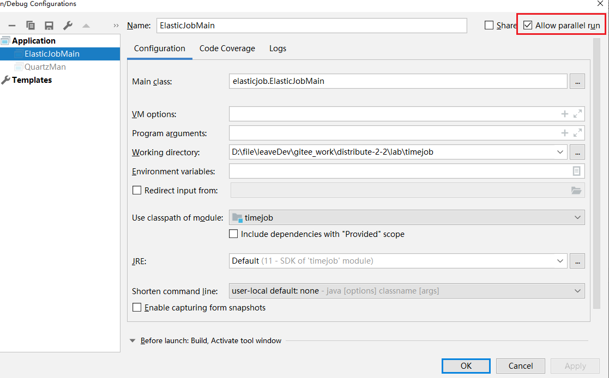

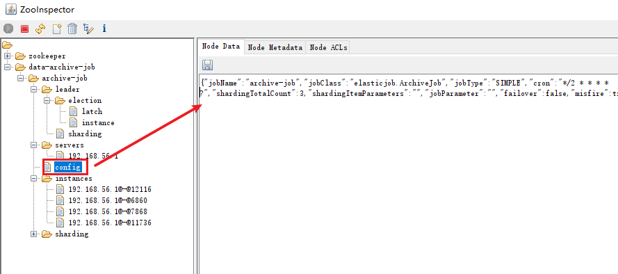

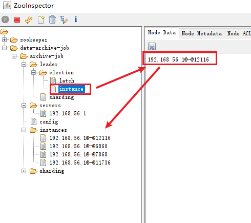

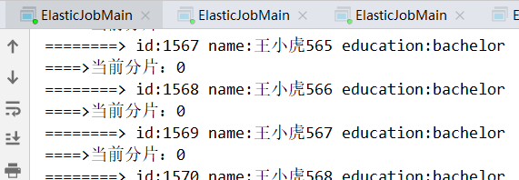

剩下两个进程时：

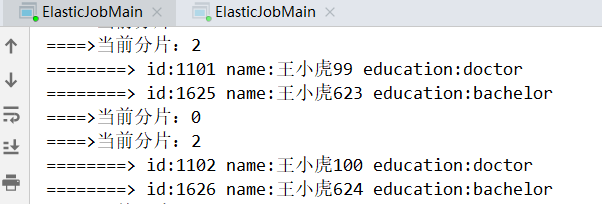

剩下一个进程时：

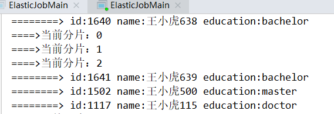

## 5.3 Elastic-Job-Lite 轻量级去中心化的特点

如何理解轻量级和去中心化？

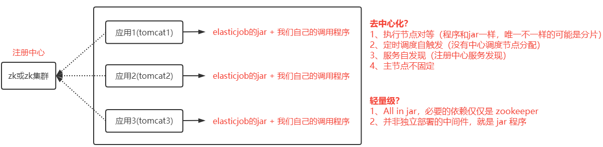


## 5.4 任务分片

一个大的非常耗时的作业 Job，比如：一次要处理一亿条的数据，那么这一亿的数据存储在数据库中，如果用一个作业节点处理一亿条数据要很久，在互联网领域时不能接受的，互联网领域更希望增加机器来横向扩展处理能力。所以，ElasticJob可以把作业分为多个 task（每一个task就是一个任务分片），每一个 task 交给具体的一个机器实例去处理（一个机器实例是可以处理多个 task 的），但是具体每个 task 执行什么逻辑我们自己来指定


Strategy 策略定义这些分片项 怎么去分配到各个机器上去，默认是平均分配，可以定制，比如某一个机器负载比较高或者预配置比较高，那么就可以写策略。分片和作业本身是通过一个注册中心协调的，因为在分布式环境下，状态数据肯定集中到一点，才可以在分布式中沟通。


**分片代码**

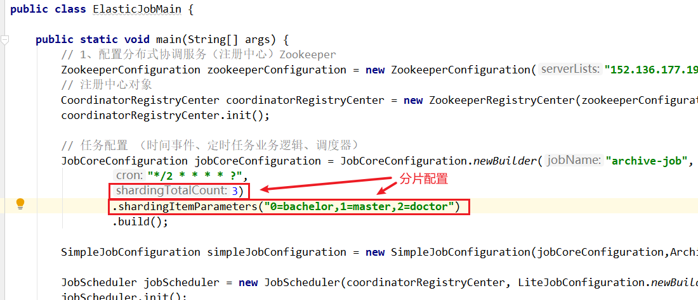

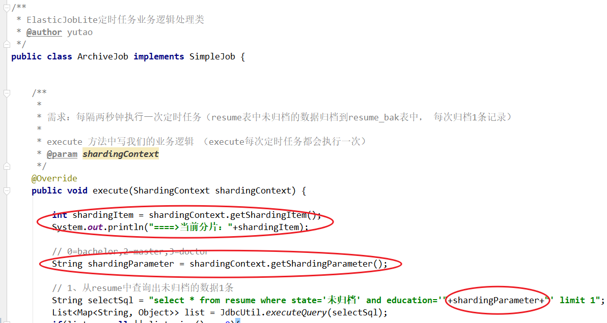

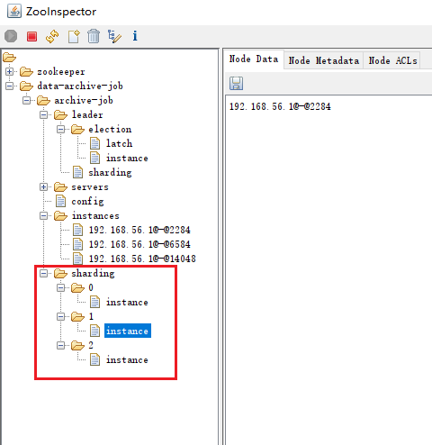

## 5.5 弹性扩容


新增加一个运行实例 app3，它会自动注册到注册中心，注册中心发现新的服务上线，注册中心会通知 ElasticJob 进行重新分片，那么总的分片项由多少，那么就可以扩展多少个实例机器，比如完全可以分 1,000 片。

注意：

1. 分片项 也是一个 Job 配置，修改配置，重新分片，在**下一次定时运行之前会重新调用分片算法**，那么这个分片算法的结果就是：哪台机器运行哪一个分片，这个结果存储在 zk 中，主节点会把分片分号放到注册中心去，然后执行节点从注册中心获取信息（执行节点在定时任务开启的时候获取相应的分片）。
2. 如果所有的节点挂掉剩下一个节点，所有分片都会指向剩下的一个节点，这也是 ElasticJob的高可用。

