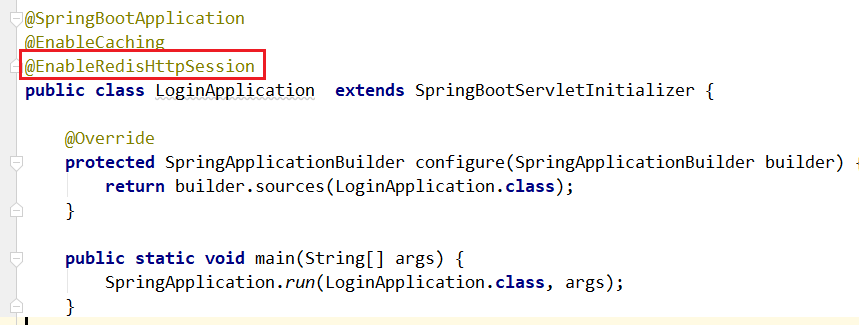
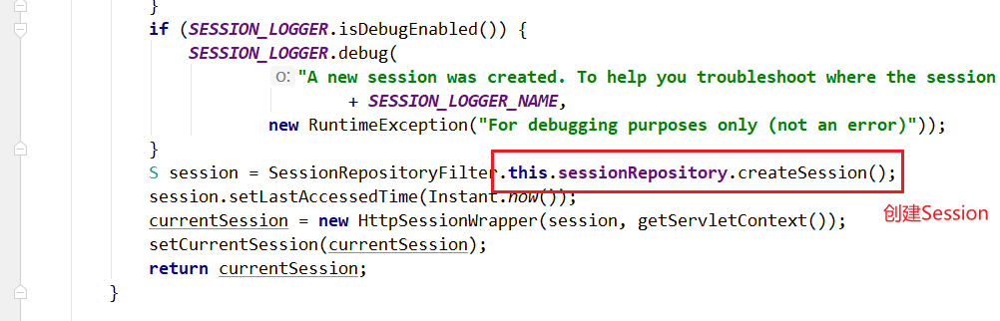

> 第五部分 Session共享问题

Session 共享及 Session  保持或者叫做 Session 一致性


# 1 Session 问题原因分析

出现这个问题的原因，从根本上来说是因为 Http 协议是无状态的协议。客户端和服务端在某次会话中产生的数据不会保留下来，所以第二次请求服务端无法认识到你曾经来过，Http 为什么要设计为无状态协议？早期都是静态页面无所谓有无状态，后面有动态的内容更丰富，就需要有状态，出现了两种用于保持 Http 状态的技术，那就是 Cookie 和 Session，而出现上述不停让登录的问题，分析如下图：

场景：nginx 默认轮询策略


> 问题；两次登录重定向之后，8080 和 8081 都会保存 session 数据，为什么还会被拦截重定向到登录页面？
>
> 因为每一次登录后浏览器中的cookie中会有一个 JSESSIONID。

# 2 解决 Session 一致性的方案

## 2.1 Nginx 的 IP_HASH 策略（可以使用）

同一个客户端IP的请求都会被路由到同一个目标服务器，也叫做会话粘滞。

优点：

- 配置简单，不入侵应用，不需要额外修改代码

缺点：

- 服务器重启 Session 丢失
- 存在单点负载高的风险
- 单点故障问题


## 2.2 Session 复制（不推荐）

也即，多个 tomcat 之间通过修改配置文件，达到 Session 之间的复制

优点：

- 不入侵应用
- 便于服务器水平扩展
- 能适应各种负载均衡策略
- 服务器重启或者宕机不会造成 Session丢失

缺点：

- 性能低
- 内存消耗
- 不能存储太多数据，否则数据越多越影响性能
- 延迟性

## 2.3 Session 共享，Seesion 集中存储（推荐）

Session的本质就是缓存，那Session 数据为什么不交给专业的缓存中间件呢？比如 Redis。

优点：

- 能适应各种负载均衡策略
- 服务器重启或宕机不会造成 Session 丢失
- 扩展能力强
- 适合大集群数量使用

缺点：

- 对应用有入侵，引入了和 Redis 的交互代码

**Spring Session 使得基于 Redis Session 共享应用起来非常简单**

1. 引入 jar

   ```xml
   <dependency>
       <groupId>org.springframework.boot</groupId>
       <artifactId>spring-boot-starter-data-redis</artifactId>
   </dependency>
   <dependency>
       <groupId>org.springframework.session</groupId>
       <artifactId>spring-session-data-redis</artifactId>
   </dependency>
   ```

2. 配置 Redis

   ```properties
   spring.redis.database=0
   spring.redis.host=152.136.177.192
   spring.redis.port=6379
   spring.redis.connectionTimeout=5000
   spring.redis.password=
   ```

3. 启动类上添加注解

   


**源码示意（了解）**


该注解可以创建一个过滤器使得 SpringSession 替代 HttpSession 发会作用，找到那个过滤器！


观察其父类，父类中有 Filter


\

这个 Filter 就是 SpringSession 最核心的地方


在过滤器中将 HttpServletRequest 包装


本质就是一个 HttpRequest，拥有同样的方法，找到 getSession





回到 SessionRepositoryFilter#doFilterInternal 方法


**原理示意（了解）**

