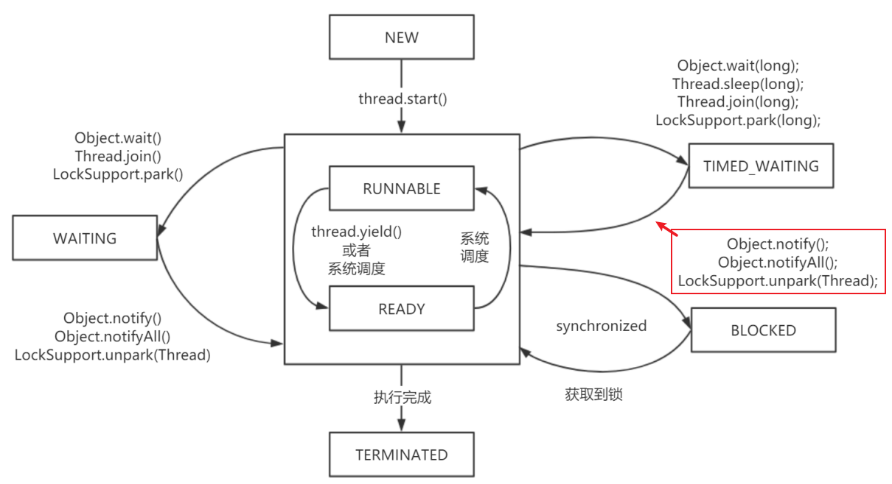

第一部分 多线程和并发设计原理

# 1 多线程回顾

## 1.1 Thread和Runnable

### 1.1.1 Java中的线程

创建执行线程有两种方法：

- 扩展Thread类
- 实现Runnable接口

扩展Thread类的方式创建新线程：

```java
package com.turbo.concurrent.demo;

public class MyThread extends Thread {
    
    @Override
    public void run() {
        System.out.println(getName()+"线程运行起来了.");
    }
}
```

```java
package com.turbo.concurrent.demo;

public class Main {
    public static void main(String[] args) {
    	new MyThread().start();
    }
}
```

实现Runnable接口的方式创建线程：

```java
package com.turbo.concurrent.demo;

public class MyRunnable implements Runnable {
    @Override
    public void run() {
        System.out.println("实现接口的线程启动起来了");
    }
}
```

```java
package com.turbo.concurrent.demo;

public class Main {
    public static void main(String[] args) {
        new Thread(new MyRunnable()).start();
    }
}
```


### 1.1.2 Java的线程：特征和状态

1. 所有的Java程序，不论并发与否，都有一个名为主线程的Thread对象。执行该程序时，Java虚拟机（JVM）将创建一个新Thread并在该线程执行main()。这时非并发应用程序中的唯一线程，也是并发应用程序中的第一个线程。

2. Java中的线程共享应用程序中的所有资源，包括内存和打开的文件，快速而简单的共享信息。但是**必须使用同步避免数据竞争**。

3. Java中的所有线程都有一个优先级，整个数据介于Thread.MIN_PRIORITY(1)和Thread.MAX_PRIORITY(10)之间，默认优先级是Thread.NORM_PRIORITY(5)。线程的执行顺序并没有保证，通常较高优先级的线程将在较低优先级的程序之间执行。

4. 在Java中，可以创建两种线程：

   - 守护线程
   - 非守护线程

   区别在于它们如何影响程序的结束。

   Java程序结束执行过程的情形：

   - 程序执行Runtime类的exit()方法，而且用户有权限指向该方法。
   - 应用程序的所有非守护线程均已结束执行，**无论是否有正在运行的守护线程**。
   
   守护线程通常用在作为垃圾收集器或缓存管理器的应用程序中，执行辅助任务。在线程start之前调用，isDaemon方法检查线程是否为守护线程，也可使用setDaemon()方法将某个线程设置为守护线程。
   
5. java.lang.Thread.State类中定义线程的状态如下：

   - NEW：Thread对象已经创建，但是还没有开始执行。
   - RUNNABLE：Thread对象正在Java虚拟机中运行。
   - BLOCKED：Thread对象正在等待锁定。
   - WAITING：Thread对象正在等待另一个线程的动作。
   - TIMED_WAITING：Thread对象正在等待另一个线程的操作，但是有时间限制。
   - TERMINATED：Thread对象已经完成了执行。

   getState()方法获取Thread对象的状态，在给定时间内，线程只能处于一个状态。这些状态是JVM使用的状态，不能映射到操作系统的线程状态。

   线程状态的源码：


### 1.1.3 Thread类和Runnable接口

Runnable接口只定义了一种方法：run()方法。这是每个线程的主方法。当执行start()方法启动新线程时，它将调用run()方法。

Thread类其他常用方法：

- 获取和设置Thread对象信息的方法
  - getId()：返回Thread对象的标识符。该标识符是在线程创建时分配的一个正整数，在线程的整个声明周期中是唯一且无法改变的。
  - getName()/setName()：这两个方法允许获取或设置Thread对象的名称，这个名称是一个String对象，也可以在Thread类的构造函数中设置。
  - getPriority()/setPriority()：获取或设置Thread对象的优先级。
  - isDaemon()/setDaemon()：这两种方法获取或建立Thread对象的守护条件。
  - getState()：返回Thread对象的状态。
- interrupt()：中断目标线程，给目标线程发送一个中断信号，线程被打上中断标记。
- interrupted()：判断目标线程是否被中断，但是将清除线程中断标记。
- isInterrupted()：判断目标线程是否被中断，不会清除中断标记。
- sleep(long ms)：该方法将线程的执行暂停ms时间。
- join()：暂停线程执行，直到调用该方法的线程执行结束为止。可以使用该方法等待另一个Thread对象结束。
- setUncaughtExceptionHandler()：当线程执行出现未校验异常时，该方法用于建立未校验异常的控制器。
- currentThread()：Thread类的静态方法，返回实际执行该代码的Thread对象。


join示例程序：

```java
package com.turbo.concurrent.demo;

public class MyThread extends Thread {
    @Override
    public void run() {
        for (int i = 0; i < 10; i++) {
            System.out.println("新线程-"+i);
        }
    }
}
```

```java
package com.turbo.concurrent.demo;

public class Main {

    public static void main(String[] args) throws InterruptedException {
        MyThread myThread = new MyThread();
        myThread.start();
        myThread.join();
        System.out.println("main线程执行结束");
    }
}
```


### 1.1.4 Callable

Callable接口是一个与Runnable接口非常相似的接口。Callable接口的主要特征如下：

- 接口，有简单类型参数，与call()方法的返回类型相对应。
- 声明了call()方法，执行器运行任务时，该方法会被执行器执行。它必须返回声明中指定类型的对象。
- call()方法可以抛出一种检验异常。可以实现自己的执行器并重载afterExecute()方法来处理这些异常。

```java
package com.turbo.concurrent.demo;

import java.util.concurrent.*;

public class Main2 {
    public static void main(String[] args) throws ExecutionException, InterruptedException {
        MyCallable myCallable = new MyCallable();

        ThreadPoolExecutor executor = new ThreadPoolExecutor(
                5,
                5,
                1,
                TimeUnit.SECONDS,
                new ArrayBlockingQueue<>(10)
        ) {
            @Override
            protected void afterExecute(Runnable r, Throwable t) {
                // 在call方法执行过程中有错误，可以在此处进行处理
//                super.afterExecute(r, t);
                System.out.println("任务执行完毕"+t);
            }
        };

        final Future<String> future = executor.submit(myCallable);
        final String result = future.get();
        System.out.println(result);
        executor.shutdown();

    }
}
```

```java
package com.turbo.concurrent.demo;

import java.util.concurrent.Callable;

public class MyCallable implements Callable<String> {

    @Override
    public String call() throws Exception {
        Thread.sleep(5000);
        return "call方法的返回值";
    }
}
```


## 1.2 synchronized关键字

### 1.2.1 锁的对象

synchronized关键字“给某个对象加锁”，示例代码：

```java
public Class MyClass {
	public void synchronized method1() {        
		// ...
	}
	public static void synchronized method2() {        
   		// ...
	} 
}
```

等价于

```java
public class MyClass {
	public void method1() {        
		synchronized(this) {            
			// ...
		}  
	}
	public static void method2() {        
		synchronized(MyClass.class) {            
			// ...
		}  
	}
}
```

实例方法的锁加在对象myClass上；静态方法的锁加载MyClass.class上。

### 1.2.2 锁的本质

如果一份资源需要多个线程同时访问，需要给该资源加锁。加锁之后，可以保证同一时间只能由一个线程访问该资源。资源可以是一个变量、一个对象或一个文件等。


锁是一个“对象”，作用如下：

1. 这个对象内部要有一个标志位（state变量），记录自己有没有被某个线程占用。最简单的情况是这个state有0、1两个取值，0表示没有线程占用这个锁，1表示有某个线程占用这个锁。
2. 如果这个对象被某个线程占用，记录这个线程的thread ID。
3. 这个对象维护一个thread id list，记录其他所有阻塞的、等待获取拿这个锁的线程。在当前线程释放锁之后从这个thread id list里面取一个线程唤醒。

要访问的共享资源本身也是一个对象，例如前面的对象myClass，这两个对象可以合成一个对象。代码就变成synchronized(this){...}，要访问的共享资源是对象a，锁加在对象a上。当然，也可以另外新建一个对象，代码变成synchronized(obj1){...}。这个时候，访问的共享资源是对象a，而锁加在新建的对象obj1上。

资源和锁合二为一，是个在Java里面，synchronized关键字可以加在任何对象的成员上面，者意味着，这个对象既是共享资源，同时也具备“锁”的功能。

### 1.2.3 实现原理

在对象中，有一块数据叫Mark Word。在64为机器上，Mark Word是8字节（64位），这64位中有2个重要字段：锁标志位和占用该锁的thread ID。因为不同版本的JVM实现，对象的数据结构会有各种差异。

## 1.3 wait与notify

### 1.3.1 生产者-消费者模型

生产者-消费者模型是一个常见的多线程模型。


一个内存队列，对各生产者线程往内存队列中放数据；多个消费者从内存队列中取数据，要实现这样一个编程模型，需要做下面几件事情：

1. 内存队列本身要加锁，才能实现线程安全。
2. 阻塞。当内存队列满了，生产者放不进去时，会被阻塞；当内存队列是空的时候，消费者无事可做，会被阻塞。
3. 双向通知。消费者被阻塞之后，生产者放入新数据，要notify()消费者；反之，生产者被阻塞之后，消费者消费了数据，要notify()生产者。

第1件事情必须要做，2、3不一定要做。

- 如何阻塞？
  - 办法一：线程阻塞自己，也就是生产者，消费者线程各自调用wait()和notify()。
  - 办法二：用一个阻塞队列，当取不到或者放不进去数据的时候，入队/出队函数本身就是阻塞的。
- 如何双向通知？
  - 办法一：wait()与notify()机制。
  - 办法二：Condition机制。


单个生产者单个消费者：

https://gitee.com/turboYuu/concurrent-programming-2-3/blob/master/lab/turbo-concurrent-programming/demo-04-producer-consumer/src/com/turbo/concurrent/demo/Main.java

多个生产者多个消费者：

https://gitee.com/turboYuu/concurrent-programming-2-3/blob/master/lab/turbo-concurrent-programming/demo-04-producer-consumer/src/com/turbo/concurrent/demo/Main2.java

### 1.3.2 为什么必须和synchronized一起使用

在Java里面，wait()和notify()是Object的成员函数，是基础中的基础。为什么Java要把wait()和notify()放在如此基础的类里面，而不是作为Thread一类的成员函数，或者其他类的成员函数？

先看为什么wait()和notify()必须和synchronized一起使用？代码：

```java
class MyClass1 {
	private Object obj1 = new Object();
    public void method1() {
    	synchronized(obj1) {            
    		//...
    		obj1.wait();
    		//...
    	}  
    }
   	public void method2() {        
   		synchronized(obj1) {            
   			//...
			obj1.notify();
			//...
     	}  
     }
}
```

或者下面代码：

```java
public class MyClass1 {
	public void synchronized method1() {        
   		//...
       	this.wait();        
       	//...
 	}
   	public void synchronized method2() {        
   		//...
       	this.notify();        
       	//...
 	} 
}
```

然后开两个线程，线程A调用method1，线程B调用method2。很明显，两个线程之间要通信，对于一个对象来说，一个线程调用该对象的wait()，另一个线程调用该对象的notify()，该对象本身就需要同步。所以，在调用wait()、notify()之前，要先通过synchronized关键字同步给对象，也就是给该对象加锁。

synchronized关键字可以加在任何对象的实例方法上，任何对象都可能成为锁。因此，wait()和notify()只能放在Object里面了。

### 1.3.3 为什么wait()的时候必须释放锁

当线程A进入synchronized(obj1)中之后，也就是对obj1上了锁。此时，调用wait()进入阻塞状态，一直不能退出synchronized代码块；那么，线程B永远无法进入synchronized(obj1)同步块中，永远没机会调用notify()，发生死锁。

这就涉及到一个关键的问题：在wait()的内部，会先释放锁obj1，然后进入阻塞状态，之后，它被另外一个线程调用notify()唤醒，重新获取锁。其次，wait()调用完成后，执行后面的业务逻辑代码，然后退出synchronized，再次释放锁。

wait()内部的伪代码：

```java
wait() {    
	// 释放锁
	// 阻塞，等待被其他线程notify    
	// 重新获取锁
}
```

如此避免死锁。

### 1.3.4 wait()与notify()的问题

以上的生产者-消费者模型来看，其伪代码：

```java
public void enqueue() {
   	synchronized(queue) {
       	while (queue.full()) {
       		queue.wait();
       	}
	    //... 数据入列
       	queue.notify();  // 通知消费者，队列中有数据了。
	}
}

public void dequeue() {
   	synchronized(queue) {
       	while (queue.empty()) {
       		queue.wait();
     	}
       	// 数据出队列
       	queue.notify(); // 通知生产者，队列中有空间了，可以继续放数据了。
	}
}
```

生产者在通知消费者的同时，也通知了其他的生产者；消费者在通知生产者的同时，也通知了其他的消费者。原因在于wait()和notify()所作用的对象和synchronized所作用的对象是同一个，只能有一个对象，无法区分队列空和队列满两个条件。这正是Condition要解决的问题。

## 1.4 InterruptedException与interrupt方法

### 1.4.1 Interrupted异常

什么情况下抛出Interrupted异常

只有声明了会抛出InterruptedException的函数才会抛出异常

```java
public static native void sleep(long millis) throws InterruptedException {...}
public final void wait() throws InterruptedException {...}
public final void join() throws InterruptedException {...}
```

### 1.4.2 轻量级阻塞与重量级阻塞

能够被中断的阻塞成为轻量级阻塞，对应的线程状态是WAITING或者TIMED_WAITING；二项synchronized这种不能被中断的阻塞成为重量级阻塞，对应的状态是BLOCKED。如图所示：调用不同的方法后，一个线程的状态迁移过程。



初始线程处于NEW状态，调用start()开始执行后，进入RUNNING或者READY状态。如果没有调用任何阻塞函数，线程只会在RUNING和RAEADY之间切换，也就是系统的时间片调度。这两种状态的切换是操作系统完成的，除非手动调用yield()函数，放弃对CPU的占用。

一旦调用了图中任何阻塞函数，线程就会进入WAITING或者TIMED_WAITING状态，两者的区别只是前者为无限期阻塞，后者则传入了一个时间参数，阻塞一个有限的时间。如果使用了synchronized关键字或者synchronized块，则会进入BLOCKED状态。

不太常见的阻塞/唤醒函数，LockSupport.park()/unpark()。这对函数非常关键，Concurrent包中Lock的实现即依赖这一对操作原语。

因此thread.interrupted()的精确含义是”唤醒轻量级阻塞“，而不是字面意思”中断一个线程“。


**thread.isInterrupted()与thread.interrupted()的区别**

因为thread.interrupted()相当于给线程发送一个唤醒的信号，所以如果线程此时恰好处于WAITING或者TIMED_WAITING，就会抛出一个InterruptedException，并且线程被唤醒。如果线程此时并没有被阻塞，则线程什么都不会做。但在后续，线程可以判断自己是否收到过其他线程发来的中断信号，然后做一些对应的处理。

这两个方法都是线程用来判断自己是否收到过中断信号，前者是实例方法，后者是静态方法。二者的区别在于，前者只是读取中断状态，不修改状态；后者不仅读取中断状态，还会重置中断标志位。

```java
package com.turbo.concurrent.demo;

public class Main {
    public static void main(String[] args) throws InterruptedException {
        MyThread myThread = new MyThread();
        myThread.start();
        Thread.sleep(10);
        myThread.interrupt();
        Thread.sleep(7);
        System.out.println("main中断状态检查-1：" + myThread.isInterrupted());
        System.out.println("main中断状态检查-2：" + myThread.isInterrupted());
    }
}
```

```java
package com.turbo.concurrent.demo;

public class MyThread extends Thread {
    @Override
    public void run() {
        int i = 0;
        while (true) {
            boolean interrupted = isInterrupted();
            System.out.println("中断标记：" + interrupted);
            ++i;
            if (i > 200) {
                // 检查并重置中断标志。
                boolean interrupted1 = Thread.interrupted();
                System.out.println("重置中断状态：" + interrupted1);
                interrupted1 = Thread.interrupted();
                System.out.println("重置中断状态：" + interrupted1);
                interrupted = isInterrupted();
                System.out.println("中断标记：" + interrupted);
                break;
            }
        }
    }
}

```


## 1.5 线程的优雅关闭

### 1.5.1 stop与destory函数

线程是”一段运行中的代码“，一个运行中的方法。运行到一半的线程能否强制杀死？

不能。在Java中，有stop()、destory()等方法，但是这些方法官方明确不建议使用。原因很简单，如果强制杀死线程，则线程中所使用的资源无法正常关闭。

因此，一个线程一旦运行起来，不要强行关闭，合理的做法是让其运行完（也就是执行完毕），干净的释放掉所有资源，然后退出。如果是一个不断循环的线程，就需要用到**线程间的通信机制**，让主线程通知其退出。

### 1.5.2 守护线程

daemon线程和非daemon线程的对比：

```java
package com.turbo.concurrent.demo;

public class Main {
    public static void main(String[] args) {
        MyDaemonThread myDaemonThread = new MyDaemonThread();
        // 将当前线程设置为daemon线程：守护线程
        myDaemonThread.setDaemon(true);
        myDaemonThread.start();
        // 启动非daemon线程，当非daemon线程结束，不管daemon线程是否结束，都结束JVM进程
        new MyThread().start();
    }
}
```

```java
package com.turbo.concurrent.demo;

public class MyDaemonThread extends Thread {
    @Override
    public void run() {
        while (true){
            System.out.println(Thread.currentThread().getName());
            try {
                Thread.sleep(500);
            } catch (InterruptedException e) {
                e.printStackTrace();
            }
        }
    }
}
```

```java
package com.turbo.concurrent.demo;

public class MyThread extends Thread {

    @Override
    public void run() {
        for (int i = 0; i < 10; i++) {
            System.out.println("非Daemon线程");
            try {
                Thread.sleep(500);
            } catch (InterruptedException e) {
                e.printStackTrace();
            }
        }
    }
}
```

对于上面的程序，在thread.start()前面加一行代码thread.setDaemon(true)。当main(...)函数退出后，线程thread就会退出，整个进程也会退出。

当在一个JVM进程里面开多个线程时，这些线程被分为两类：守护线程和非守护线程。默认都是非守护线程。

在Java中有一个规定：当所有的非守护线程退出后，整个JVMi昵称就会退出。意思就是守护线程”不算作数“，守护线程不影响整个JVM进程的退出。


### 1.5.3 设置标志位

# 2 并发核心概念

## 2.1 并发与并行

## 2.2 同步

## 2.3 不可变对象

## 2.4 原子操作和原子变量

## 2.5 共享内存与消息传递

# 3 并发的问题

## 3.1 数据竞争

## 3.2 死锁

## 3.3 活锁

## 3.4 资源不足

## 3.5 优先权反转

# 4 JVM内存模型

## 4.1 JMM与happen-before

### 4.1.1 为什么会存在“内存可见性”问题

### 4.1.2 重排序与内存可见性的关系

### 4.1.3 内存屏障

### 4.1.4 as-if-serial语义

### 4.1.5 happen-before是什么

### 4.1.6 happen-before的传递性

## 4.2 volatile关键字

### 4.2.1 64位写入的原子性（Half Write）

### 4.2.2 重排序：DCL问题

### 4.2.3 volatile实现原理

### 4.2.4 JSR-133对volatile语义的增强

## 4.3 final关键字

### 4.3.1 构造方法的溢出

### 4.3.2 final的happen-before语义

### 4.3.3 happen-before规则总结