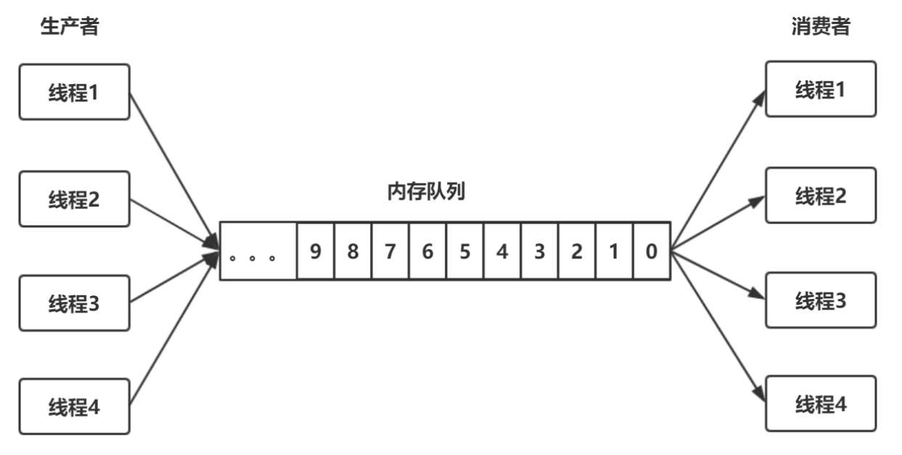

第一部分 多线程和并发设计原理

# 1 多线程回顾

## 1.1 Thread和Runnable

### 1.1.1 Java中的线程

创建执行线程有两种方法：

- 扩展Thread类
- 实现Runnable接口

扩展Thread类的方式创建新线程：

```java
package com.turbo.concurrent.demo;

public class MyThread extends Thread {
    
    @Override
    public void run() {
        System.out.println(getName()+"线程运行起来了.");
    }
}
```

```java
package com.turbo.concurrent.demo;

public class Main {
    public static void main(String[] args) {
    	new MyThread().start();
    }
}
```

实现Runnable接口的方式创建线程：

```java
package com.turbo.concurrent.demo;

public class MyRunnable implements Runnable {
    @Override
    public void run() {
        System.out.println("实现接口的线程启动起来了");
    }
}
```

```java
package com.turbo.concurrent.demo;

public class Main {
    public static void main(String[] args) {
        new Thread(new MyRunnable()).start();
    }
}
```


### 1.1.2 Java的线程：特征和状态

1. 所有的Java程序，不论并发与否，都有一个名为主线程的Thread对象。执行该程序时，Java虚拟机（JVM）将创建一个新Thread并在该线程执行main()。这时非并发应用程序中的唯一线程，也是并发应用程序中的第一个线程。

2. Java中的线程共享应用程序中的所有资源，包括内存和打开的文件，快速而简单的共享信息。但是**必须使用同步避免数据竞争**。

3. Java中的所有线程都有一个优先级，整个数据介于Thread.MIN_PRIORITY(1)和Thread.MAX_PRIORITY(10)之间，默认优先级是Thread.NORM_PRIORITY(5)。线程的执行顺序并没有保证，通常较高优先级的线程将在较低优先级的程序之间执行。

4. 在Java中，可以创建两种线程：

   - 守护线程
   - 非守护线程

   区别在于它们如何影响程序的结束。

   Java程序结束执行过程的情形：

   - 程序执行Runtime类的exit()方法

### 1.1.3 Thread类和Runnable接口

### 1.1.4 Callable

## 1.2 synchronized关键字

### 1.2.1 锁的对象

synchronized关键字“给某个对象加锁”，示例代码：

```java
public Class MyClass {
	public void synchronized method1() {        
		// ...
	}
	public static void synchronized method2() {        
   		// ...
	} 
}
```

等价于

```java
public class MyClass {
	public void method1() {        
		synchronized(this) {            
			// ...
		}  
	}
	public static void method2() {        
		synchronized(MyClass.class) {            
			// ...
		}  
	}
}
```

实例方法的锁加在对象myClass上；静态方法的锁加载MyClass.class上。

### 1.2.2 锁的本质

如果一份资源需要多个线程同时访问，需要给该资源加锁。加锁之后，可以保证同一时间只能由一个线程访问该资源。资源可以是一个变量、一个对象或一个文件等。


锁是一个“对象”，作用如下：

1. 这个对象内部要有一个标志位（state变量），记录自己有没有被某个线程占用。最简单的情况是这个state有0、1两个取值，0表示没有线程占用这个锁，1表示有某个线程占用这个锁。
2. 如果这个对象被某个线程占用，记录这个线程的thread ID。
3. 这个对象维护一个thread id list，记录其他所有阻塞的、等待获取拿这个锁的线程。在当前线程释放锁之后从这个thread id list里面取一个线程唤醒。

要访问的共享资源本身也是一个对象，例如前面的对象myClass，这两个对象可以合成一个对象。代码就变成synchronized(this){...}，要访问的共享资源是对象a，锁加在对象a上。当然，也可以另外新建一个对象，代码变成synchronized(obj1){...}。这个时候，访问的共享资源是对象a，而锁加在新建的对象obj1上。

资源和锁合二为一，是个在Java里面，synchronized关键字可以加在任何对象的成员上面，者意味着，这个对象既是共享资源，同时也具备“锁”的功能。

### 1.2.3 实现原理

在对象中，有一块数据叫Mark Word。在64为机器上，Mark Word是8字节（64位），这64位中有2个重要字段：锁标志位和占用该锁的thread ID。因为不同版本的JVM实现，对象的数据结构会有各种差异。

## 1.3 wait与notify

### 1.3.1 生产者-消费者模型

生产者-消费者模型是一个常见的多线程模型。



一个内存队列，对各生产者线程往内存队列中放数据；多个消费者从内存队列中取数据，要实现这样一个编程模型，需要做下面几件事情：

1. 内存队列本身要加锁，才能实现线程安全。
2. 阻塞。当内存队列满了，生产者放不进去时，会被阻塞；当内存队列是空的时候，消费者无事可做，会被阻塞。
3. 双向通知。消费者被阻塞之后，生产者放入新数据，要notify()消费者；反之，生产者被阻塞之后，消费者消费了数据，要notify()生产者。

第1件事情必须要做，2、3不一定要做。

- 如何阻塞？
  - 办法一：线程阻塞自己，也就是生产者，消费者线程各自调用wait()和notify()。
  - 办法二：用一个阻塞队列，当取不到或者放不进去数据的时候，入队/出队函数本身就是阻塞的。
- 如何双向通知？
  - 办法一：wait()与notify()机制。
  - 办法二：Condition机制。


单个生产者单个消费者：

https://gitee.com/turboYuu/concurrent-programming-2-3/blob/master/lab/turbo-concurrent-programming/demo-04-producer-consumer/src/com/turbo/concurrent/demo/Main.java

多个生产者多个消费者：

https://gitee.com/turboYuu/concurrent-programming-2-3/blob/master/lab/turbo-concurrent-programming/demo-04-producer-consumer/src/com/turbo/concurrent/demo/Main2.java

### 1.3.2 为什么必须和synchronized一起使用

在Java里面，wait()和notify()是Object的成员函数，是基础中的基础。为什么Java要把wait()和notify()放在如此基础的类里面，而不是作为Thread一类的成员函数，或者其他类的成员函数？

先看为什么wait()和notify()必须和synchronized一起使用？代码：

```java
class MyClass1 {
	private Object obj1 = new Object();
    public void method1() {
    	synchronized(obj1) {            
    		//...
    		obj1.wait();
    		//...
    	}  
    }
   	public void method2() {        
   		synchronized(obj1) {            
   			//...
			obj1.notify();
			//...
     	}  
     }
}
```

或者下面代码：

```java
public class MyClass1 {
	public void synchronized method1() {        
   		//...
       	this.wait();        
       	//...
 	}
   	public void synchronized method2() {        
   		//...
       	this.notify();        
       	//...
 	} 
}
```

然后开两个线程，线程A调用method1，线程B调用method2。很明显，两个线程之间要通信，对于一个对象来说，一个线程调用该对象的wait()，另一个线程调用该对象的notify()，该对象本身就需要同步。所以，在调用wait()、notify()之前，要先通过synchronized关键字同步给对象，也就是给该对象加锁。

synchronized关键字可以加在任何对象的实例方法上，任何对象都可能成为锁。因此，wait()和notify()只能放在Object里面了。

### 1.3.3 为什么wait()的时候必须释放锁

当线程A进入synchronized(obj1)中之后，也就是对obj1上了锁。此时，调用wait()进入阻塞状态，一致不能退出synchronized代码块；那么，线程B永远无法进入synchronized(obj1)同步块中，永远没机会调用notify()，发生死锁。

这就涉及到一个关键的问题：在wait()的内部，会先释放锁obj1，然后进入阻塞状态，之后，它被另外一个线程调用notify()唤醒，重新获取锁。其次，wait()调用完成后，执行后面的业务逻辑代码，然后退出synchronized，再次释放锁。

wait()内部的伪代码：

```java
wait() {    
	// 释放锁
	// 阻塞，等待被其他线程notify    
	// 重新获取锁
}
```

如此避免死锁。

### 1.3.4 wait()与notify()的问题

以上的生产者-消费者模型来看，其伪代码：

```java
public void enqueue() {
   	synchronized(queue) {
       	while (queue.full()) {
       		queue.wait();
       	}
	    //... 数据入列
       	queue.notify();  // 通知消费者，队列中有数据了。
	}
}

public void dequeue() {
   	synchronized(queue) {
       	while (queue.empty()) {
       		queue.wait();
     	}
       	// 数据出队列
       	queue.notify(); // 通知生产者，队列中有空间了，可以继续放数据了。
	}
}
```

生产者在通知消费者的同时，也通知了其他的生产者；消费者在通知生产者的同时，也通知了其他的消费者。原因在于wait()和notify()所作用的对象和synchronized所作用的对象是同一个，只能有一个对象，无法区分队列空和队列满两个条件。这正是Condition要解决的问题。

## 1.4 InterruptedException与interrupt方法

### 1.4.1 Interrupted异常

### 1.4.2 轻量级阻塞与重量级阻塞

## 1.5 线程的优雅关闭

### 1.5.1 stop与destory函数

### 1.5.2 守护线程

### 1.5.3 设置标志位

# 2 并发核心概念

## 2.1 并发与并行

## 2.2 同步

## 2.3 不可变对象

## 2.4 原子操作和原子变量

## 2.5 共享内存与消息传递

# 3 并发的问题

## 3.1 数据竞争

## 3.2 死锁

## 3.3 活锁

## 3.4 资源不足

## 3.5 优先权反转

# 4 JVM内存模型

## 4.1 JMM与happen-before

### 4.1.1 为什么会存在“内存可见性”问题

### 4.1.2 重排序与内存可见性的关系

### 4.1.3 内存屏障

### 4.1.4 as-if-serial语义

### 4.1.5 happen-before是什么

### 4.1.6 happen-before的传递性

## 4.2 volatile关键字

### 4.2.1 64位写入的原子性（Half Write）

### 4.2.2 重排序：DCL问题

### 4.2.3 volatile实现原理

### 4.2.4 JSR-133对volatile语义的增强

## 4.3 final关键字

### 4.3.1 构造方法的溢出

### 4.3.2 final的happen-before语义

### 4.3.3 happen-before规则总结