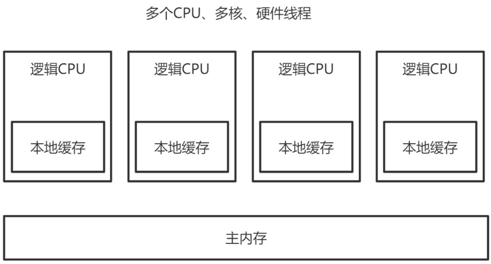

第一部分 多线程和并发设计原理

# 1 多线程回顾

## 1.1 Thread和Runnable

### 1.1.1 Java中的线程

创建执行线程有两种方法：

- 扩展Thread类
- 实现Runnable接口

扩展Thread类的方式创建新线程：

```java
package com.turbo.concurrent.demo;

public class MyThread extends Thread {
    
    @Override
    public void run() {
        System.out.println(getName()+"线程运行起来了.");
    }
}
```

```java
package com.turbo.concurrent.demo;

public class Main {
    public static void main(String[] args) {
    	new MyThread().start();
    }
}
```

实现Runnable接口的方式创建线程：

```java
package com.turbo.concurrent.demo;

public class MyRunnable implements Runnable {
    @Override
    public void run() {
        System.out.println("实现接口的线程启动起来了");
    }
}
```

```java
package com.turbo.concurrent.demo;

public class Main {
    public static void main(String[] args) {
        new Thread(new MyRunnable()).start();
    }
}
```


### 1.1.2 Java的线程：特征和状态

1. 所有的Java程序，不论并发与否，都有一个名为主线程的Thread对象。执行该程序时，Java虚拟机（JVM）将创建一个新Thread并在该线程执行main()。这时非并发应用程序中的唯一线程，也是并发应用程序中的第一个线程。

2. Java中的线程共享应用程序中的所有资源，包括内存和打开的文件，快速而简单的共享信息。但是**必须使用同步避免数据竞争**。

3. Java中的所有线程都有一个优先级，整个数据介于Thread.MIN_PRIORITY(1)和Thread.MAX_PRIORITY(10)之间，默认优先级是Thread.NORM_PRIORITY(5)。线程的执行顺序并没有保证，通常较高优先级的线程将在较低优先级的程序之间执行。

4. 在Java中，可以创建两种线程：

   - 守护线程
   - 非守护线程

   区别在于它们如何影响程序的结束。

   Java程序结束执行过程的情形：

   - 程序执行Runtime类的exit()方法，而且用户有权限指向该方法。
   - 应用程序的所有非守护线程均已结束执行，**无论是否有正在运行的守护线程**。
   
   守护线程通常用在作为垃圾收集器或缓存管理器的应用程序中，执行辅助任务。在线程start之前调用，isDaemon方法检查线程是否为守护线程，也可使用setDaemon()方法将某个线程设置为守护线程。
   
5. java.lang.Thread.State类中定义线程的状态如下：

   - NEW：Thread对象已经创建，但是还没有开始执行。
   - RUNNABLE：Thread对象正在Java虚拟机中运行。
   - BLOCKED：Thread对象正在等待锁定。
   - WAITING：Thread对象正在等待另一个线程的动作。
   - TIMED_WAITING：Thread对象正在等待另一个线程的操作，但是有时间限制。
   - TERMINATED：Thread对象已经完成了执行。

   getState()方法获取Thread对象的状态，在给定时间内，线程只能处于一个状态。这些状态是JVM使用的状态，不能映射到操作系统的线程状态。

   线程状态的源码：


### 1.1.3 Thread类和Runnable接口

Runnable接口只定义了一种方法：run()方法。这是每个线程的主方法。当执行start()方法启动新线程时，它将调用run()方法。

Thread类其他常用方法：

- 获取和设置Thread对象信息的方法
  - getId()：返回Thread对象的标识符。该标识符是在线程创建时分配的一个正整数，在线程的整个声明周期中是唯一且无法改变的。
  - getName()/setName()：这两个方法允许获取或设置Thread对象的名称，这个名称是一个String对象，也可以在Thread类的构造函数中设置。
  - getPriority()/setPriority()：获取或设置Thread对象的优先级。
  - isDaemon()/setDaemon()：这两种方法获取或建立Thread对象的守护条件。
  - getState()：返回Thread对象的状态。
- interrupt()：中断目标线程，给目标线程发送一个中断信号，线程被打上中断标记。
- interrupted()：判断目标线程是否被中断，但是将清除线程中断标记。
- isInterrupted()：判断目标线程是否被中断，不会清除中断标记。
- sleep(long ms)：该方法将线程的执行暂停ms时间。
- join()：暂停线程执行，直到调用该方法的线程执行结束为止。可以使用该方法等待另一个Thread对象结束。
- setUncaughtExceptionHandler()：当线程执行出现未校验异常时，该方法用于建立未校验异常的控制器。
- currentThread()：Thread类的静态方法，返回实际执行该代码的Thread对象。


[join示例程序](https://gitee.com/turboYuu/concurrent-programming-2-3/tree/master/lab/turbo-concurrent-programming/demo-02-join/src/com/turbo/concurrent/demo)：

```java
package com.turbo.concurrent.demo;

public class MyThread extends Thread {
    @Override
    public void run() {
        for (int i = 0; i < 10; i++) {
            System.out.println("新线程-"+i);
        }
    }
}
```

```java
package com.turbo.concurrent.demo;

public class Main {

    public static void main(String[] args) throws InterruptedException {
        MyThread myThread = new MyThread();
        myThread.start();
        myThread.join();
        System.out.println("main线程执行结束");
    }
}
```


### 1.1.4 Callable

Callable接口是一个与Runnable接口非常相似的接口。Callable接口的主要特征如下：

- 接口，有简单类型参数，与call()方法的返回类型相对应。
- 声明了call()方法，执行器运行任务时，该方法会被执行器执行。它必须返回声明中指定类型的对象。
- call()方法可以抛出一种检验异常。可以实现自己的执行器并重载 afterExecute() 方法来处理这些异常。

```java
package com.turbo.concurrent.demo;

import java.util.concurrent.*;

public class Main2 {
    public static void main(String[] args) throws ExecutionException, InterruptedException {
        MyCallable myCallable = new MyCallable();

        ThreadPoolExecutor executor = new ThreadPoolExecutor(
                5,
                5,
                1,
                TimeUnit.SECONDS,
                new ArrayBlockingQueue<>(10)
        ) {
            @Override
            protected void afterExecute(Runnable r, Throwable t) {
                // 在call方法执行过程中有错误，可以在此处进行处理
//                super.afterExecute(r, t);
                System.out.println("任务执行完毕"+t);
            }
        };

        final Future<String> future = executor.submit(myCallable);
        final String result = future.get();
        System.out.println(result);
        executor.shutdown();

    }
}
```

```java
package com.turbo.concurrent.demo;

import java.util.concurrent.Callable;

public class MyCallable implements Callable<String> {

    @Override
    public String call() throws Exception {
        Thread.sleep(5000);
        return "call方法的返回值";
    }
}
```


## 1.2 synchronized关键字

### 1.2.1 锁的对象

synchronized关键字“给某个对象加锁”，示例代码：

```java
public Class MyClass {
	public void synchronized method1() {        
		// ...
	}
	public static void synchronized method2() {        
   		// ...
	} 
}
```

等价于

```java
public class MyClass {
	public void method1() {        
		synchronized(this) {            
			// ...
		}  
	}
	public static void method2() {        
		synchronized(MyClass.class) {            
			// ...
		}  
	}
}
```

实例方法的锁加在对象myClass上；静态方法的锁加载MyClass.class上。

### 1.2.2 锁的本质

如果一份资源需要多个线程同时访问，需要给该资源加锁。加锁之后，可以保证同一时间只能由一个线程访问该资源。资源可以是一个变量、一个对象或一个文件等。


锁是一个“对象”，作用如下：

1. 这个对象内部要有一个标志位（state变量），记录自己有没有被某个线程占用。最简单的情况是这个state有0、1两个取值，0表示没有线程占用这个锁，1表示有某个线程占用这个锁。
2. 如果这个对象被某个线程占用，记录这个线程的thread ID。
3. 这个对象维护一个thread id list，记录其他所有阻塞的、等待获取拿这个锁的线程。在当前线程释放锁之后从这个thread id list里面取一个线程唤醒。

要访问的共享资源本身也是一个对象，例如前面的对象myClass，这两个对象可以合成一个对象。代码就变成 `synchronized(this){...}`，要访问的共享资源是对象a，锁加在对象a上。当然，也可以另外新建一个对象，代码变成 `synchronized(obj1){...}`。这个时候，访问的共享资源是对象a，而锁加在新建的对象obj1上。

资源和锁合二为一，使得在Java里面，synchronized 关键字可以加在任何对象的成员上面，者意味着，这个对象既是共享资源，同时也具备 “锁” 的功能。

### 1.2.3 实现原理

**锁如何实现**？

在对象中，有一块数据叫Mark Word。在64为机器上，Mark Word是8字节（64位），这64位中有2个重要字段：锁标志位和占用该锁的thread ID。因为不同版本的 JVM 实现，对象的数据结构会有各种差异。

## 1.3 wait与notify

### 1.3.1 生产者-消费者模型

生产者-消费者模型是一个常见的多线程模型。


一个内存队列，对各生产者线程往内存队列中放数据；多个消费者从内存队列中取数据，要实现这样一个编程模型，需要做下面几件事情：

1. 内存队列本身要加锁，才能实现线程安全。
2. 阻塞。当内存队列满了，生产者放不进去时，会被阻塞；当内存队列是空的时候，消费者无事可做，会被阻塞。
3. 双向通知。消费者被阻塞之后，生产者放入新数据，要notify()消费者；反之，生产者被阻塞之后，消费者消费了数据，要notify()生产者。

第1件事情必须要做，2、3不一定要做。

- 如何阻塞？
  - 办法一：线程阻塞自己，也就是生产者，消费者线程各自调用wait()和notify()。
  - 办法二：用一个阻塞队列，当取不到或者放不进去数据的时候，入队/出队函数本身就是阻塞的。
- 如何双向通知？
  - 办法一：wait()与notify()机制。
  - 办法二：Condition机制。


单个生产者单个消费者：

https://gitee.com/turboYuu/concurrent-programming-2-3/blob/master/lab/turbo-concurrent-programming/demo-04-producer-consumer/src/com/turbo/concurrent/demo/Main.java

多个生产者多个消费者：

https://gitee.com/turboYuu/concurrent-programming-2-3/blob/master/lab/turbo-concurrent-programming/demo-04-producer-consumer/src/com/turbo/concurrent/demo/Main2.java

### 1.3.2 为什么必须和synchronized一起使用

在Java里面，wait() 和 notify() 是 Object 的成员函数，是基础中的基础。为什么Java要把 wait() 和 notify() 放在如此基础的类里面，而不是作为Thread一类的成员函数，或者其他类的成员函数？

先看为什么 wait() 和 notify() 必须和 synchronized 一起使用？代码：

```java
class MyClass1 {
	private Object obj1 = new Object();
    public void method1() {
    	synchronized(obj1) {            
    		//...
    		obj1.wait();
    		//...
    	}  
    }
   	public void method2() {        
   		synchronized(obj1) {            
   			//...
			obj1.notify();
			//...
     	}  
     }
}
```

或者下面代码：

```java
public class MyClass1 {
	public void synchronized method1() {        
   		//...
       	this.wait();        
       	//...
 	}
   	public void synchronized method2() {        
   		//...
       	this.notify();        
       	//...
 	} 
}
```

然后开两个线程，线程A调用method1，线程B调用method2。很明显，两个线程之间要通信，对于一个对象来说，一个线程调用该对象的wait()，另一个线程调用该对象的notify()，该对象本身就需要同步。所以，在调用wait()、notify()之前，要先通过synchronized关键字同步给对象，也就是给该对象加锁。

synchronized 关键字可以加在任何对象的实例方法上，任何对象都可能成为锁。因此，wait() 和 notify() 只能放在 Object 里面了。

### 1.3.3 为什么wait()的时候必须释放锁

当线程A进入 synchronized(obj1) 中之后，也就是对obj1上了锁。此时，调用wait()进入阻塞状态，一直不能退出synchronized代码块；那么，线程B永远无法进入 synchronized(obj1) 同步块中，永远没机会调用 notify()，发生死锁。

这就涉及到一个关键的问题：在wait()的内部，会先释放锁obj1，然后进入阻塞状态，之后，它被另外一个线程调用notify()唤醒，重新获取锁。其次，wait()调用完成后，执行后面的业务逻辑代码，然后退出synchronized，再次释放锁。

wait()内部的伪代码：

```java
wait() {    
	// 释放锁
	// 阻塞，等待被其他线程notify    
	// 重新获取锁
}
```

如此避免死锁。

### 1.3.4 wait()与notify()的问题

以上的生产者-消费者模型来看，其伪代码：

```java
public void enqueue() {
   	synchronized(queue) {
       	while (queue.full()) {
       		queue.wait();
       	}
	    //... 数据入列
       	queue.notify();  // 通知消费者，队列中有数据了。
	}
}

public void dequeue() {
   	synchronized(queue) {
       	while (queue.empty()) {
       		queue.wait();
     	}
       	// 数据出队列
       	queue.notify(); // 通知生产者，队列中有空间了，可以继续放数据了。
	}
}
```

生产者在通知消费者的同时，也通知了其他的生产者；消费者在通知生产者的同时，也通知了其他的消费者。原因在于 wait() 和 notify() 所作用的对象和 synchronized 所作用的对象是同一个，只能有一个对象，无法区分队列空和队列满两个条件。这正是 Condition 要解决的问题。

## 1.4 InterruptedException与interrupt方法

### 1.4.1 Interrupted异常

**什么情况下抛出Interrupted异常**

假设 while 循环中没有调用任何的阻塞函数，就是通常的算数运算，或者打印一行日志，如下：

```java
package com.turbo.concurrent.demo;

public class MyThread extends Thread {

    @Override
    public void run() {
        while (true){
            final boolean interrupted = isInterrupted();
            System.out.println("中断状态："+interrupted);
        }
    }
}
```

这个时候，在主线程中调用一句 thread.interrupt()，

```java
package com.turbo.concurrent.demo;

public class Main {
    public static void main(String[] args) throws InterruptedException {
        MyThread myThread = new MyThread();
        myThread.start();
        Thread.sleep(10);
        // 中断线程
        myThread.interrupt();
        Thread.sleep(100);

        System.exit(0);
    }
}

```

该线程并不会抛出异常。


只有声明了会抛出InterruptedException的函数才会抛出异常，也就是下面

```java
public static native void sleep(long millis) throws InterruptedException {...}
public final void wait() throws InterruptedException {...}
public final void join() throws InterruptedException {...}
```

### 1.4.2 轻量级阻塞与重量级阻塞

能够被中断的阻塞成为轻量级阻塞，对应的线程状态是WAITING或者TIMED_WAITING；而像synchronized这种不能被中断的阻塞成为重量级阻塞，对应的状态是BLOCKED。如图所示：调用不同的方法后，一个线程的状态迁移过程。


初始线程处于NEW状态，调用start()开始执行后，进入RUNNING或者READY状态。如果没有调用任何阻塞函数，线程只会在RUNING和RAEADY之间切换，也就是系统的时间片调度。这两种状态的切换是操作系统完成的，除非手动调用yield()函数，放弃对CPU的占用。

一旦调用了图中任何阻塞函数，线程就会进入WAITING或者TIMED_WAITING状态，两者的区别只是前者为无限期阻塞，后者则传入了一个时间参数，阻塞一个有限的时间。如果使用了synchronized关键字或者synchronized块，则会进入BLOCKED状态。

不太常见的阻塞/唤醒函数，LockSupport.park()/unpark()。这对函数非常关键，Concurrent包中Lock的实现即依赖这一对操作原语。

因此thread.interrupted()的精确含义是”唤醒轻量级阻塞“，而不是字面意思”中断一个线程“。


**thread.isInterrupted()与thread.interrupted()的区别**

因为thread.interrupted()相当于给线程发送一个唤醒的信号，所以如果线程此时恰好处于WAITING或者TIMED_WAITING，就会抛出一个InterruptedException，并且线程被唤醒。如果线程此时并没有被阻塞，则线程什么都不会做。但在后续，线程可以判断自己是否收到过其他线程发来的中断信号，然后做一些对应的处理。

这两个方法都是线程用来判断自己是否收到过中断信号，前者是实例方法，后者是静态方法。二者的区别在于，前者只是读取中断状态，不修改状态；后者不仅读取中断状态，还会重置中断标志位。

```java
package com.turbo.concurrent.demo;

public class Main {
    public static void main(String[] args) throws InterruptedException {
        MyThread myThread = new MyThread();
        myThread.start();
        Thread.sleep(10);
        myThread.interrupt();
        Thread.sleep(7);
        System.out.println("main中断状态检查-1：" + myThread.isInterrupted());
        System.out.println("main中断状态检查-2：" + myThread.isInterrupted());
    }
}
```

```java
package com.turbo.concurrent.demo;

public class MyThread extends Thread {
    @Override
    public void run() {
        int i = 0;
        while (true) {
            boolean interrupted = isInterrupted();
            System.out.println("中断标记：" + interrupted);
            ++i;
            if (i > 200) {
                // 检查并重置中断标志。
                boolean interrupted1 = Thread.interrupted();
                System.out.println("重置中断状态：" + interrupted1);
                interrupted1 = Thread.interrupted();
                System.out.println("重置中断状态：" + interrupted1);
                interrupted = isInterrupted();
                System.out.println("中断标记：" + interrupted);
                break;
            }
        }
    }
}

```


## 1.5 线程的优雅关闭

### 1.5.1 stop与destory函数

线程是”一段运行中的代码“，一个运行中的方法。运行到一半的线程能否强制杀死？

不能。在Java中，有stop()、destory()等方法，但是这些方法官方明确不建议使用。原因很简单，如果强制杀死线程，则线程中所使用的资源无法正常关闭。

因此，一个线程一旦运行起来，不要强行关闭，合理的做法是让其运行完（也就是执行完毕），干净的释放掉所有资源，然后退出。如果是一个不断循环的线程，就需要用到**线程间的通信机制**，让主线程通知其退出。

### 1.5.2 守护线程

daemon线程和非daemon线程的对比：

```java
package com.turbo.concurrent.demo;

public class Main {
    public static void main(String[] args) {
        MyDaemonThread myDaemonThread = new MyDaemonThread();
        // 将当前线程设置为daemon线程：守护线程
        myDaemonThread.setDaemon(true);
        myDaemonThread.start();
        // 启动非daemon线程，当非daemon线程结束，不管daemon线程是否结束，都结束JVM进程
        new MyThread().start();
    }
}
```

```java
package com.turbo.concurrent.demo;

public class MyDaemonThread extends Thread {
    @Override
    public void run() {
        while (true){
            System.out.println(Thread.currentThread().getName());
            try {
                Thread.sleep(500);
            } catch (InterruptedException e) {
                e.printStackTrace();
            }
        }
    }
}
```

```java
package com.turbo.concurrent.demo;

public class MyThread extends Thread {

    @Override
    public void run() {
        for (int i = 0; i < 10; i++) {
            System.out.println("非Daemon线程");
            try {
                Thread.sleep(500);
            } catch (InterruptedException e) {
                e.printStackTrace();
            }
        }
    }
}
```

对于上面的程序，在thread.start()前面加一行代码thread.setDaemon(true)。当main(...)函数退出后，线程thread就会退出，整个进程也会退出。

当在一个JVM进程里面开多个线程时，这些线程被分为两类：守护线程和非守护线程。默认都是非守护线程。

在Java中有一个规定：当所有的非守护线程退出后，整个JVM进程就会退出。意思就是守护线程”不算作数“，守护线程不影响整个JVM进程的退出。


### 1.5.3 设置标志位

开发中一般通过设置标志位的方式，停止循环运行的线程。

代码：

```java
package com.turbo.concurrent.demo;

public class MyThread extends Thread {

    private boolean flag = true;

    @Override
    public void run() {
        while (flag){
            System.out.println("线程正在运行....");
            try {
                Thread.sleep(500);
            } catch (InterruptedException e) {
                e.printStackTrace();
            }
        }

    }

    // 用于关闭线程
    public void stopRunning(){
        this.flag = false;
    }

    public static void main(String[] args) throws InterruptedException {
        MyThread myThread = new MyThread();

        myThread.start();
        Thread.sleep(3000);
        myThread.stopRunning();

        myThread.join();
        System.out.println("main线程退出");
    }
}
```

但上面的代码有一个问题：如果MyThread 在while循环中阻塞在某个地方，例如里面调用了Object.wait()函数，那它可能永远没有机会再执行while(!stopped)代码，也就一直无法退出循环。此时，就要用到InterruptedException()与interrupt()函数。

# 2 并发核心概念

## 2.1 并发与并行

**在单个处理器上采用单核执行多个任务即为并发**。这种情况下，操作系统的任务调度程序会很快从一个任务切换到另一个任务，因此看起来所有的任务都是同时运行的。

同一时间内在不同计算机、处理器或处理器核心上同时运行多个任务，就是所谓的**并行**。

另一个关于并发的定义是，在系统上同时运行多个任务（不同的任务）就是并发。另一个关于并行的定义是：同时在某个数据集的不同部分上运行同一任务的不同实例就是并行。

关于并行的最后一个定义是，系统中同时运行多个任务。关于并发的最后一个定义是，一种解释程序员将任务和它们对共享资源的访问同步的不同技术和机制的方法

这两个概念非常相似，而且这种相似性随着多核处理器的发展也在不断增强。

## 2.2 同步

在并发中，可以将同步定义为一种协调两个或更多任务以获得预期结果的机制。同步的方式有两种：

- 控制同步：例如，当一个任务的开始依赖于另一个任务结束时，第二个任务不能在第一个任务完成之前开始。
- 数据访问同步：当两个或更多任务访问共享变量时，在任意时间里，只有一个任务可以访问该变量。

与同步密切相关的一个概念是临界段。临界段是一段代码，由于它可以访问共享资源，因此在任何我给定时间内，只能被一个任务执行。**互斥**是用来保证这一要求的机制，而且可以采用不同的方式来实现。

同步可以帮助在完成并发任务的同时避免一些错误，但是它也为你的算法引入了一些开销。你必须非常仔细地计算任务的数量，这些任务可以独立执行，而无需并行算法中相互通信。这就涉及并发算法的**粒度**。如果算法有着粗粒度（低互通信的大型任务），同步方面的开销就会较低。然而，也许你不会用到系统所有的核心。如果算法所有者细粒度（高互通信的小型任务），同步方面的开销就会很高，而且该算法的吞吐量可能不会很好。

并发系统中有不同的同步机制。从理论角度看，最流行的机制如下：

- 信号量（semaphore）：一种用于控制一个或多个单位资源进行访问的机制。它有一个用于存放可用资源数量的变量，而且可以采用两种原子操作来管理该变量。**互斥**（mutex,mutual exclusion的简写）是一种特殊类型的信号量，它只能取两个值（即**资源空闲**和**资源忙**），而且只有将互斥设置为**忙**的那个进程才可以释放它。互斥可以通过保护临界段来帮助你避免出现竞争条件。
- 监视器：一种在共享资源上实现互斥的机制。它有一个互斥，一个条件变量、两种操作（等待条件和通报条件）。一旦你通报了该条件，在等待它的任务中只有一个会继续执行。

如果共享数据的所有用户都受到同步机制的保护，那么代码（或方法，对象）就是**线程安全**的。数据的非阻塞的CAS（compare-and-swap，比较和交换）原语是不可变的，这样就可以在并发应用程序中使用该代码而不会出现任何问题。

## 2.3 不可变对象

不可变对象是一种非常特殊的对象。在其初始化后，不能修改其可视状态（其属性值）。如果向修改一个不可变对象，那么你就必须创建一个新的对象。

不可变对象的主要优点在于它是线程安全的。你可以在滨海发应用程序中使用它而不会出现任何问题。

不可变对象的一个例子就是java中的String类。当你给一个String对象赋新值时，会创建一个新的String对象。

## 2.4 原子操作和原子变量

与应用程序的其他任务相比，**原子操作**是一种发生在瞬间的动作。在并发应用程序中，可以通过一个临界段来实现原子操作，以便对整个操作采用同步机制。

原子变量是一种通过元组操作来设置和获取其值的变量。可以使用某种同步机制来实现一个原子变量，或者也可以使用CAS以无锁方式来实现一个原子变量，而这种方式并不需要任何同步机制。

## 2.5 共享内存与消息传递

任务可以通过两种不同的方式来相互通信，第一种方法是**共享内存**，通常用于在同一台计算机上运行多任务的情况。任务在读取和写入的时候使用相同的内存区域。为了避免出现问题，对该共享内存的访问必须在一个由同步机制保护的临界段内完成。

另一种同步机制是**消息传递**，通常用于在不同计算机上运行多任务的情形。当一个任务需要与另一个任务通信时，它会发送一个遵循预定义协议的消息。如果发送发保持阻塞并等待，那么该通信就是同步的；如果发送方在发送消息后继续执行自己的流程，那么该通信就是异步的。

# 3 并发的问题

## 3.1 数据竞争

如果有两个或者多个任务子啊临界段之外对一个共享变量进行写入操作，也就是说没有使用任何同步机制，那么应用程序可能存在数据竞争（也叫做竞争条件）。

这种情况下，应用程序的最终结果可能取决于任务的执行顺序。

## 3.2 死锁

当两个（或多个）任务正在等待必须由另一线程释放的某个共享资源，而该线程又正在等待必须由前述任务之一释放另一共享资源时，并发应用程序就会出现了死锁。当系统中同时出现如下四种条件时，就会导致这种情形，成为Coffman条件。

- 互斥：死锁中涉及的资源必须是不可共享的，一次只有一个任务可以使用该资源。
- 占有并等待条件：一个任务在占有某一互斥的资源时，又请求另一互斥的资源，当它在等待时，不会释放任何资源。
- 不可剥夺：资源只能被那些持有它们的任务释放。
- 循环等待：任务1正在等待任务2所占有的资源，而任务2又正在等待任务3所占有的资源，以此类推，最终任务n又在等待任务1所占用的资源，这样就出现了循环等待。

有一些机制可以用来避免死锁。

- 忽略它们：这是最常用的机制，可以假设不会出现死锁，如果发生死锁，结果就是停止程序并重新执行。
- 检测：
- 预防：预防Coffman条件中的一条或多条出现。
- 规避：

## 3.3 活锁

如果系统中有两个任务，它们总是因为对方的行为而改变自己的状态，那么就出现了活锁，最终结果是它们陷入了状态变更的循环而无法继续向下执行。

## 3.4 资源不足

当某个任务系统中无法获取维持其继续执行所需的资源时，就会出现资源不足。当有多个任务在等待某一资源且该资源被释放时，系统就需要选择下一个可以使用该资源的任务。如果你的系统中没有设计良好的算法，那么系统中有些线程很可能要为获取该资源而等待很长时间。

要解决这一问题就要确保公平原则。所有等待某一资源的任务必须在某一给定时间之内占有该资源。可选方案之一就是实现一个算法，在选择下一个将占有某一资源的任务时，对任务已等待该资源的时间因素加以考虑。然而，实现锁的公平需要增加额外的开销，这可能会降低程序的吞吐量。

## 3.5 优先权反转

当一个低优先权的任务持有了一个高优先级任务所需的资源时，就会发生优先权反转。这样的话，低优先权的任务就会在高优先权的任务之前执行。

# 4 JMM内存模型

Java线程之间的通信由Java内存模型（JMM）控制，**JMM决定一个线程对共享变量的写入何时对另一个线程可见**。从抽象的角度来看，**JMM定义了线程和主内存之间的抽象关系**：线程之间的共享变量存储在主内存（main memory）中，每个线程都有一个私有的本地内存（local memory），本地内存中存储了该线程以读写共享变量的副本。本地内存是JMM的一个抽象概念，并不真实存在。它涵盖了缓存，写缓冲区，寄存器以及其他的硬件和编译器优化。

## 4.1 JMM与happen-before

### 4.1.1 为什么会存在“内存可见性”问题

下图为x86架构下CPU缓存布局，即在一个CPU 4核下，L1、L2、L3三级缓存与主内存的布局。每个核上面有L1、L2缓存，L3缓存为所有核共用。


因为存在CPU缓存一致性协议，例如MESI，多个CPU核心之间缓存不会出现不同步的问题，不会有“内存可见性”问题。

缓存一致性协议对性能有很大损耗，为了解决这个问题，又进行了各种优化。例如：在计算单元和L1之间加了Store Buffer、Load Buffer（还有各种Buffer），如下图：


L1、L2、L3和主内存之间是同步的，有缓存一致性协议的保证，但是Store Buffer、Load Buffer和L1之间却是异步的。向内存中写入一个变量，这个变量会保存在Store Buffer里面，稍后才会异步地写入L1中，同时同步写入主内存中。

操作系统内核视角下的CPU缓存模型：



多CPU，每个CPU多核，每个核上面可能还有多个硬件线程，对于操作系统来讲，就相当于一个个的逻辑CPU。每个逻辑CPU都有自己的缓存，这些缓存和主内存之间不是完全同步的。

对应Java里，就是JVM抽象内存模型，如下图所示：


### 4.1.2 重排序与内存可见性的关系

**Store Buffer 的延迟写入是重排序的一种，称为内存重排序（Memory Ordering）**。除此之外，还有编译器和CPU的指令重排序。

重排序类型：

1. 编译器重排序。

   对于没有先后依赖关系的语句，编译器可以重新调整语句的执行顺序。

2. CPU指令重排序。

   在指令级别，让没有依赖关系的多条指令并行。

3. CPU内存重排序。

   CPU有自己的缓存，指令的执行顺序和写入主内存的顺序不完全一致。

在三种重排序中，第三类就是造成“内存可见性”问题的主因。

如下案例：

> 线程1：
>
> X = 1
>
> a=Y
>
> 线程2：
>
> Y = 1
>
> b = X

假设X、Y是两个全局变量，初始的时候，X=0，Y=0。线程1和线程2的执行顺序是不确定的，可能顺序执行，也可能交叉执行，最终正确的结果可能是：

> a=0,b=0
>
> a=1,b=0
>
> a=1,b=1

两个线程的执行都没有重排序，执行顺序就是代码的顺序，但仍然可能出现a=0，b=0。原因是线程1先执行X=1，后执行a=Y，但此时X=1还在自己的Store Buffer中，没有及时写入内存。所以，线程2看到的X还是0。线程2的道理于此相同。

写入内存的操作被延迟了，也就是内存被重排序了，这就造成了内存可见性问题。

### 4.1.3 内存屏障

为了禁止编译器重排序和CPU重排序，在编译器和CPU层面都有对应的指令，也就是**内存屏障**（Memory Barrier）。这也正是JMM和happen-before规则的底层实现原理。

编译器的内存屏障，只是为了告诉编译器不要对执行进行重排序。当编译完成之后，这种内存屏障就消失，CPU并不会感知到编译器中内存屏障的存在。

而CPU的内存屏障是CPU提供的指令，可以由开发者显示调用。

内存屏障是很底层的概念，对于Java开发者来说，一般用**volatile**关键字就足够了，但从JDK8开始，Java在Unsafe类中提供了三个内存屏障函数，如下：

```java
public final class Unsafe {    
	// ...
   	public native void loadFence();
   	public native void storeFence();
   	public native void fullFence();    
   	// ...
}
```

在理论层面，可以把基本的CPU内存屏障分成四种：

1. LoadLoad：禁止读和读的重排序
2. StroeStore：禁止写和写的重排序
3. LoadStore：禁止读和写的重排序
4. StoreLoad：禁止写和读的重排序

Unsafe中的方法：

1. loadFence = LoadLoad+LoadStore
2. storeFence=StoreStore+LoadStore
3. fullFence=loadFence+storeFence+StoreLoad

### 4.1.4 as-if-serial语义

重排序的原则是什么？什么场景下可以重排序，什么场景下不能重排序？

1. **单线程程序的重排序规则**

   无论什么语言，站在编译器和CPU的角度来说，不管怎么重排序，单线程程序的执行结果不能改变，这就是单线程程序的重排序规则。

   即只要操作之间没有数据依赖性，编译器和CPU都可以任意重排序，因为执行结果不会改变，代码看起来就是串行从头到尾，这也就是as-if-serial语义。

   对于单线程程序来说，编译器和CPU可能做了重排序，但开发者感知不到，也不存在内存可见性问题。

2. 多线程程序的重排序规则

   对于多线程程序，线程之间的数据依赖性太复杂，编译器和CPU没有办法完全理解这种依赖性，并据此做出最合理的优化。

   编译器和CPU只能保证每个线程的**as-if-serial**语义。

   线程之间的数据依赖和相互影响，需要编译器和CPU的上层来确定。

   上层要告知编译器和CPU在多线程场景下什么时候可以重排序，什么时候不能重排序。

### 4.1.5 happen-before是什么

从JDK5开始，Java使用新的JSR-133 内存模型，JSR-133使用happens-before的概念来阐述操作之间的内存可见性。在JMM中如果一个操作执行的结果需要对另外一个操作可见，那么这两个操作之间必须要存在happens-before关系。

使用happen-before描述两个操作之间的内存可见性。

java内存模型（JMM）是一套规范，在多线程中，一方面，要让编译器和CPU可以灵活的重排序；另一方面，要对开发者做一些承诺，明确告知开发者不需要感知什么样的重排序，需要感知什么样的重排序。然后，根据需要决定这种重排序对程序是否有影响。如果有影响，就需要开发者显示得通过volatile，synchronized等线程同步机制来禁止重排序。

**关于happen-before:**

如果A happen-before B，意味着A的执行结果必须对B可见，也就是保证跨线程的内存可见性。A happen before B不代表A一定在B之间执行，因为，对于多线程程序而言，两个操作的执行顺序是不确定的。happen-before只确保A在B之前执行，则A的执行结果必须对B可见。定义了内存可见性的约束，也就定义了一系列重排序的约束。

基于happen-before的这种描述方法，JMM对开发者做出了一些列承诺：

1. 单线程的每个操作，happen-before对应线程中任意后续操作（也就是as-if-serial语义保证）。
2. 对volatile变量的写入，happen-before对应后续对这个变量的读取。
3. 对synchronized的解锁，happen-before对应后续对这个锁的加锁。

......

JMM对编译器和CPU来说，volatile变量不能重排序；非volatile变量可以任意重排序。

### 4.1.6 happen-before的传递性

除了这些基本的happen-before规则，happen-before还具有**传递性**，即若A happen-before B，B happen-before C，则A happen-before C。

如果一个变量不是volatile变量，当一个线程读取，一个线程写入时可能有问题。那在多线程中，要么加锁，要么必须包所有变量都声明为volatile变量？这是不可能的，因为happen-before的传递性。

```java
class A {
   	private int a = 0;
   	private volatile int c = 0;    
   	public void set() {
		a = 5; // 操作1        
       	c = 1; // 操作2  
	}
   	public int get() {
       	int d = c; // 操作3        
       	return a; // 操作4  
	}
}
```

假设线程A先调用了set，设置a=5；之后线程B调用了get，返回值一定是a=5。为什么？

操作1和操作2是在同一个线程内存中执行的，操作1 happen-before 操作2，同理，操作3 happen-before 操作4.又因为c是volatile变量，对c的写入 happen-before 对c的读取，所以操作2 happen-before 操作3。利用happen-before的传递性，就得到：

操作1 happen-before 操作2 happen-before 操作3 happen-before 操作4。

所以操作1的结果，一定对操作4可见。


```java
class A {
   	private int a = 0;    
   	private int c = 0;
   	public synchronized void set() {        
   		a = 5; // 操作1
       	c = 1; // 操作2  
	}
   	public synchronized int get() {        
   		return a;
 	} 
}
```

假设线程A先调用set，之后线程B调用了get，返回值也一定是a=5。与volatile一样，synchronized同样具有happen-before语义，伪代码：

```
线程A：
	加锁;   // 操作1 
	a = 5; // 操作2 
	c = 1; // 操作3 
	解锁;   // 操作4
线程B：
	加锁;   // 操作5 
	读取a; // 操作6 
	解锁;   // 操作7
```

根据synchronized的happen-before语义，操作4 happen-before操作5，结合传递性，最终会得到：

操作1 happen-before 操作2 ... happen-before 操作7。所以a，c都不是volatile变量，但仍然有内存可见性。

## 4.2 volatile关键字

### 4.2.1 64位写入的原子性（Half Write）

如，对于一个long型变量的赋值和取值操作而言，在多线程场景下，线程A调用set(100)，线程B调用get()，在某些场景下，返回值可能不是100。

```java
public class MyClass {
	private long a = 0;
   	// 线程A调用set(100)
   	public void set(long a) {        
   		this.a = a;
 	}
   	
   	// 线程B调用get()，返回值一定是100吗？    
   	public long get() {
       	return this.a;  
	}
}
```

因为JVM的规范并没有要求64位的long或double的写入是原子的。在32位的机器上，一个64位的变量的写入可能被拆分位两个32位的写操作来执行。这样一来，读线程就可能读到“一般的值”。解决办法也简单，在long前面加上volatile关键字。

### 4.2.2 重排序：DCL问题

单线程模式的线程安全的写法不止一种，常用写法为DCL（Double Checking Locking），如下所示：

```java
public class Singleton {
   	private static Singleton instance;
   	public static Singleton getInstance() {        
   		if (instance == null) {
           	synchronized(Singleton.class) {                
           		if (instance == null) {
                   	// 此处代码有问题
                   	instance = new Singleton();          
				}
			}      
		}
       	return instance;  
	}
}
```

上述的`instance = new Singleton();`代码有问题：其底层会分为三个操作：

1. 分配一块内存。
2. 在内存上初始化成员变量。
3. 把 instance 引用指向内存。

在这三个操作中，操作2和操作3可能重排序，即先把instance指向内存，再初始化成员变量，因为二者并没有先后的依赖关系。此时，另一个线程可能拿到一个未完全初始化的对象。这时，直接访问里面的成员变量，就可能出错。这就是典型的“构造方法溢出”问题。

解决办法也简单，就是未instance变量加上volatile修饰。

**volatile的三个作用：64位写入的原子性，内存可见性，禁止重排序。**

### 4.2.3 volatile实现原理

由于不同的CPU架构的缓存体系不一样，重排序的策略不一样，所提供的内存屏障指令也就有差异。

这里只探讨为了实现volatile关键字的语义的一种参考做法：

1. 在volatile写操作的前面插入一个StoreStore屏障，保证volatile写操作不会和之前的写操作重排序。
2. 在volatile写操作的后面插入一个StoreLoad屏障。保证volatile写操作不会和之后的读操作重排序。
3. 在volatile读操作的后面插入一个LoadLoad屏障 + LoadStore屏障。保证volatile读操作不会和之后的读操作、写操作重排序。

集体到x86平台上，其实不会有LoadLoad、LoadStore和StoreStore重排序，只有StoreLoad一种重排序（内存屏障），也就是只需要在volatile写操作后面加上StoreLoad屏障。

### 4.2.4 JSR-133对volatile语义的增强

在JSR-133之前的就内存模型中，一个64位long/double型变量的读/写操作可以被拆分为两个32位的读/写操作来执行。从JSR-133内存模型开始（即从JDK5开始），仅仅只允许把一个64位long/double型变量的**写操作拆分**为两个32位的写操作来执行，任意的读操作的在JSR-133中都**必须具有原子性**（即任意读操作必须要在单个读事务中执行）。

这也生体现了Java对happen-before规则的严格遵守。

## 4.3 final关键字

### 4.3.1 构造方法的溢出

考虑下面的代码：

```java
public class MyClass {
   	private int num1;
   	private int num2;
   	private static MyClass myClass;
   	public MyClass() {        
   		num1 = 1;
       	num2 = 2;  
	}
   
   	/**
     * 线程A先执行write()      
     */
   	public static void write() {        
   		myClass = new MyClass();  
	}
	
   	/**
     * 线程B接着执行write()      
     */
   	public static void read() {
       	if (myClass != null) {
           	int num3 = myClass.num1;
           	int num4 = myClass.num2;      
		}
 	}
}
```

num3、num4不一定等于1、2。和DCL的例子类似，也就是构造方法溢出问题。

myClass = new MyClass()这行代码，分解成三个操作：

1. 分配一块内存；
2. 在内存上初始化i=1，j=2；
3. 把myClass指向这块内存。

操作2和操作3可能重排序，因此线程B可能看到未正确初始化的值。对于构造方法溢出，就是一个对象的构造并不是“原子的”，当一个线程正在构造对象时，另一个线程却可以读到未构造好的“一半对象”。

### 4.3.2 final的happen-before语义

要解决这个问题，不止一种方法。

方法1：num1，num2加上volatile关键字。

方法2：为read/write方法都加上synchronized关键字。

如果num1，num2只需要初始化一次，还可以使用final关键字。之所以能解决问题，是因为同volatile一样，final关键字也有相应的happen-before语义：

1. 对final域的写（构造方法内部），happen-before于后续对final域所在对象的读。
2. 对final域所在对象的读，happen-before于后续对final域的读。

通过这种happen-before语义的限定，保证了final域的赋值，一定在构造方法之前完成，不会出现另外一个线程读取到了对象，但对象里面的变量却还没有初始化的情形，避免出现构造方法溢出的问题。

### 4.3.3 happen-before规则总结

1. 单线程中的每个操作，happen-before于该线程中任意后续操作。
2. 对volatile变量的写，happen-before于后续对这个变量的读。
3. 对synchronized的解锁，happen-before于后续对这个锁的加锁。
4. 对final变量的写，happen-before于final域对象的读，happen-before于后续对final变量的读。

四个规则 和 happen-before的传递性，就构成了JMM对开发者的整个承若，在这个承诺以外的部分，程序都可能被重排序，都需要开发者小心处理内存可见性问题。


