第二部分 JUC

Java并发编程核心在于java.util.concurrent包，而JUC当中的大多数同步器实现都是围绕着共同的基础行为，比如等待队列，条件队列、独占获取、共享获取等。而这个行为的抽象就是基于AbstractQueuedSynchronizer，简称AQS，AQS定义了一套多线程访问共享资源的同步框架，是一个依赖状态（<font color='red'>**state**</font>）的同步器。

# 5 并发容器

## 5.1 BlockingQueue

在所有的并发容器中，BlockingQueue是最常见的一种。BlockingQueue是一个带有阻塞功能的队列，当入队时，若队列已满，则阻塞调用者；当出队，队列空，则阻塞调用者。

在Concurrent包中，BlockingQueue是一个接口，有许多个不同的实现类，如图所示。

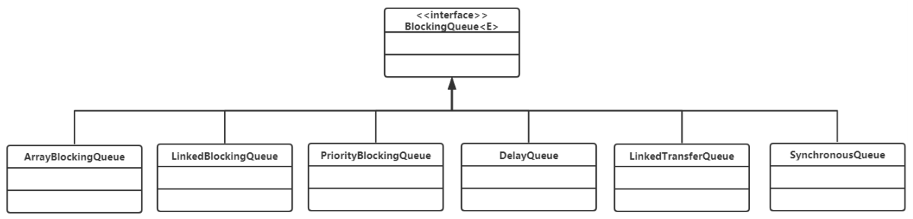

接口定义：

```java
public interface BlockingQueue<E> extends Queue<E> {    
	//...
   	boolean add(E e);    
   	boolean offer(E e);
   	void put(E e) throws InterruptedException;    
   	boolean remove(Object o);
   	E take() throws InterruptedException;
   	E poll(long timeout, TimeUnit unit) throws InterruptedException;    
   	//...
}
```

该接口和JDK集合包中的Queue接口是兼容的，同时在其基础上增加了阻塞功能。入队提供了add(...)、offer(...)、put(...) 3个方法，区别：add(...)和offer(...)的返回值是布尔类型，而put无返回值，还会抛出中断异常。所以add(...)和offer(...)是无阻塞的，也就是Queue本身定义的接口，而put(...)是阻塞的。add(...)和offer(...)的区别不大，当队列满时，前者会排除异常，后者直接返回false。

出队列与之类似，提供了remove()、poll()、take()等方法，remove()是非阻塞式的，take()和poll()式阻塞式的。

### 5.1.1 ArrayBlockingQueue

ArrayBlockingQueue是一个用数组实现的环形队列，在构造方法中，会传入数组的容量。

```java
public ArrayBlockingQueue(int capacity) {    
	this(capacity, false);
}
public ArrayBlockingQueue(int capacity, boolean fair) { 
	// ...
}
public ArrayBlockingQueue(int capacity, boolean fair, Collection<? extends E> c) {
   	this(capacity, fair);    
   	// ...
}
```

其核心数据结构如下：

```java
public class ArrayBlockingQueue<E> extends AbstractQueue<E> 
		implements BlockingQueue<E>, java.io.Serializable {

	//...
   	final Object[] items;    
   	// 队头指针
   	int takeIndex;    
   	// 队尾指针
   	int putIndex;    
   	int count;
   	
   	// 核心为1个锁外加两个条件    
   	final ReentrantLock lock;
   	private final Condition notEmpty;    
   	private final Condition notFull;    
   	//...
}
```

其put/take方法也很简单，如下所示：

put方法：

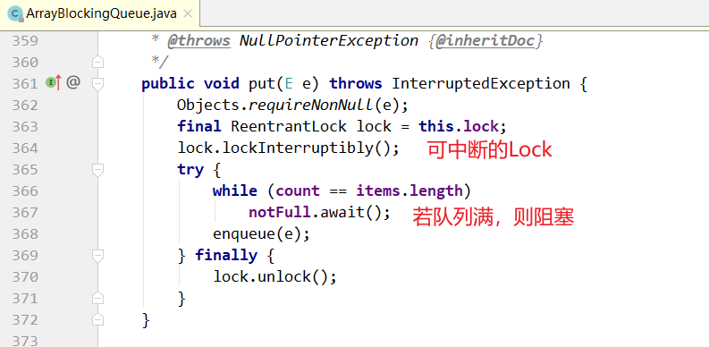

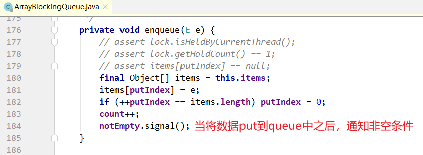

take方法：

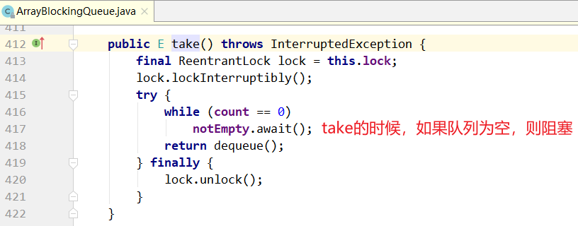

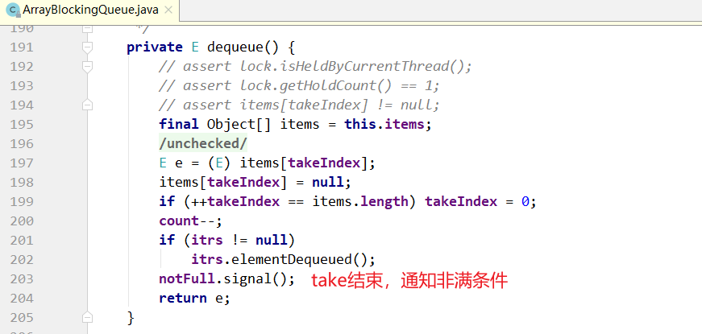

### 5.1.2 LinkedBlockingQueue

LinkedBlockingQueue是一种基于单向链表的阻塞队列。因为队头和队尾是2个指针分开操作的，所以用了2把锁+2个条件，同时有1个AutomicInteger的原子变量记录count数。

```java
public class LinkedBlockingQueue<E> extends AbstractQueue<E> 
		implements BlockingQueue<E>, java.io.Serializable {
   
   	// ...
   	private final int capacity;    
   	// 原子变量
   	private final AtomicInteger count = new AtomicInteger(0);    
   	// 单向链表的头部
   	private transient Node<E> head;    
   	// 单向链表的尾部
   	private transient Node<E> last;    
   	
   	// 两把锁，两个条件
   	private final ReentrantLock takeLock = new ReentrantLock();
   	private final Condition notEmpty = takeLock.newCondition();
   	private final ReentrantLock putLock = new ReentrantLock();
   	private final Condition notFUll = putLock.newCondition();    
   	// ...
}
```

在其构造方法中，也可以指定队列的总容量。如果不指定，默认为Integer.MAX_VALUE。

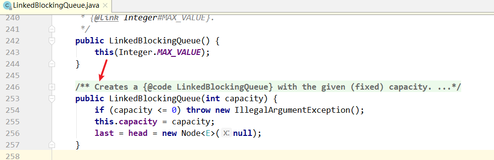

put方法：

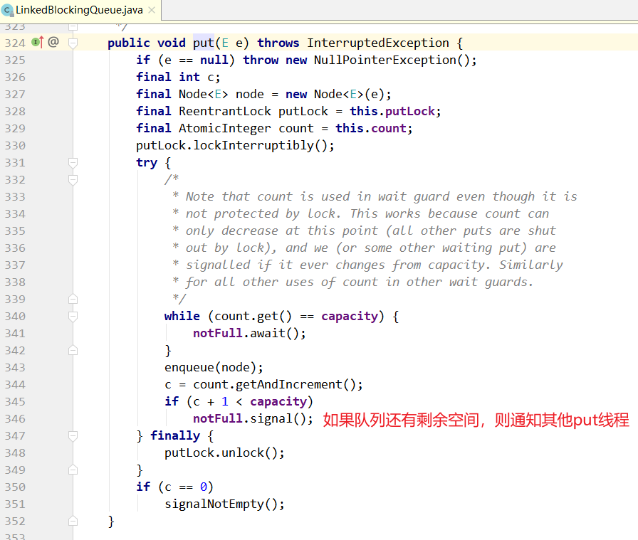

take方法：


LinkBlockingQueue和ArrayBlockingQueue的差异：

1. 为了提高并发度，用了2把锁，分别控制对头，队尾的操作。意味着在put(...)和put(...)之间、take(...)和take(...)之间是互斥的，put(...)和take(...)之间并不互斥。但对于count变量，双方都需要操作，所以必须是原子类型。
2. 因为各自拿了一把锁，所以当需要调用对方的condition的signal时，还必须再加上对方的锁，就是signalNotEmpty()和signalNotFull()方法，如下：

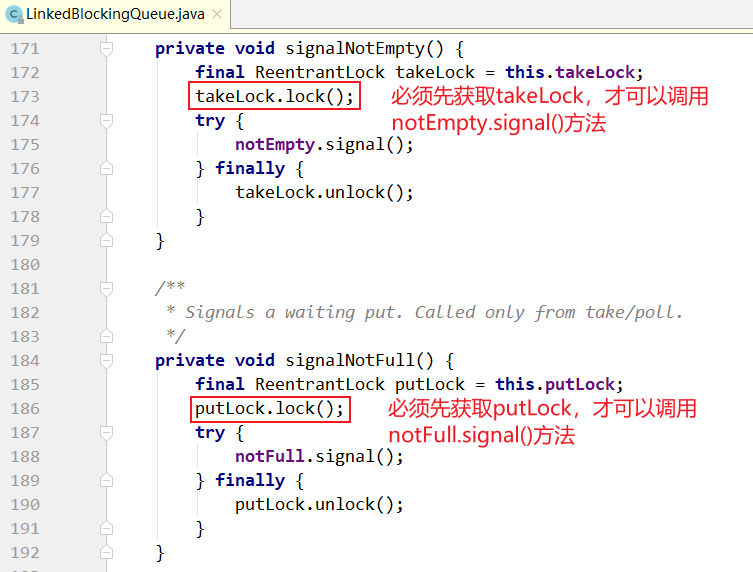

3. 不仅put会通知take，take也会通知put。当put发现非满的时候，也会通知其他put线程；当take发现非空时，也会通知其他take线程。


### 5.1.3 PriorityBlockingQueue

队列通常是先进先出的，而PriorityQueue是按照元素的优先级从小到大出队列。因此，PriorityQueue中的2个元素之间需要比较大小，并实现Comparable接口。


其核心数据结构如下：

```java
public class PriorityBlockingQueue<E> extends AbstractQueue<E> 
		implements BlockingQueue<E>, java.io.Serializable {
		
   	//...
   	// 用数组实现的二插小根堆
   	private transient Object[] queue;
   	private transient int size;
   	private transient Comparator<? super E> comparator;    
   	
   	// 1个锁+一个条件，没有非满条件
   	private final ReentrantLock lock;    
   	private final Condition notEmpty;    
   	//...
}
```

其构造方法如下，如果不指定初始大小，内部会设定一个默认值11，当元素个数超过这个大小后，会自动扩容。

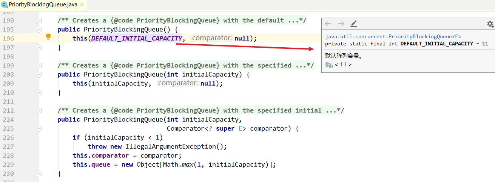


put方法：

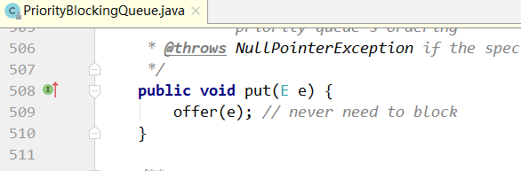


take方法：

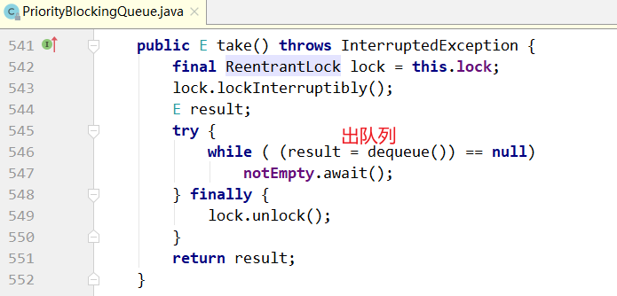

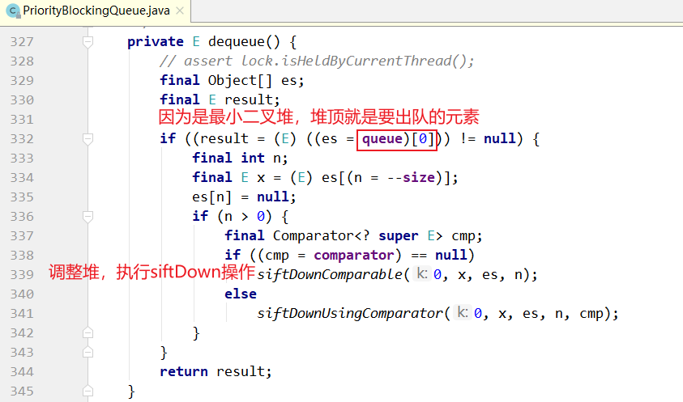

从上面可以看出，在阻塞的实现方面，和ArrayBlockingQueue的机制相似，主要区别是用数组实现了一个二叉堆，从而实现按优先级从小到大出队列。另一个区别是没有notFull条件，当元素个数超出数组长度时，执行扩容操作。

### 5.1.4 DelayQueue

DelayQueue 延迟队列，是一个按照延迟时间从小到大出队列的PriorityQueue。所谓延迟时间，就是“未来将要执行的时间”减去“当前时间”。为此，放入DelayQueue中的元素，必须实现Delayed接口，如下：

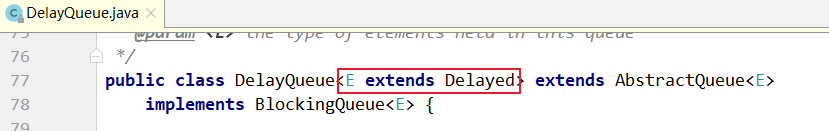

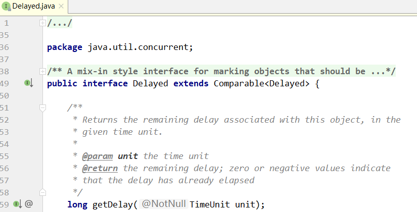

关于接口：

1. 如果getDelay返回值小于等于0，则说明该元素到期，需要从队列中拿出来执行。
2. 该接口首先继承了Comparable接口，所以要实现该接口，必须实现Comparable接口。具体就是，基于getDelay()的返回值比较两个元素的大小。

下面看一下DelayQueue的核心数据结构。

```java
public class DelayQueue<E extends Delayed> extends AbstractQueue<E> 
		implements BlockingQueue<E> {
		
   	// ...
   	// 一把锁和一个非空条件
   	private final transient ReentrantLock lock = new ReentrantLock();    
   	private final Condition available = lock.newCondition();
   	// 优先级队列
   	private final PriorityQueue<E> q = new PriorityQueue<E>(); 
   	// ...
}
```

下面介绍put/take的实现，先从take说起，因为这样更能看出DelayQueue特性。

**take方法：**

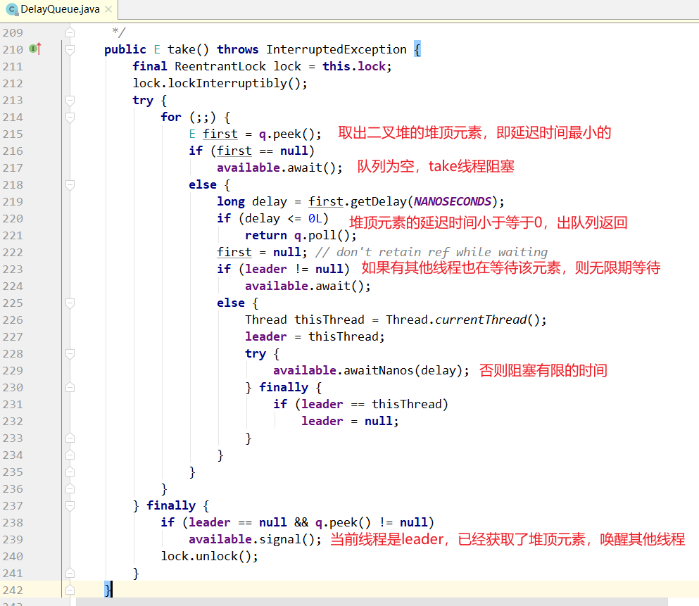

关于take()方法：

1. 不同于一般的阻塞队列，只在队列为空的时候，才阻塞。如果堆顶元素的延迟时间没到，也会阻塞。
2. 在上面的代码中使用了一个优化技术，用一个Thread leader变量记录了等待堆顶元素的第一个线程，为什么这样做？通过getDelay(...)可以知道堆顶元素何时到期，不必无限等待，可以使用condition.awaitNanos()等待一个有限时间；只有当发现还有其他线程也在等待堆顶元素（leader != NULL）时，才需要无限期等待。

**put的实现：**

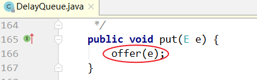

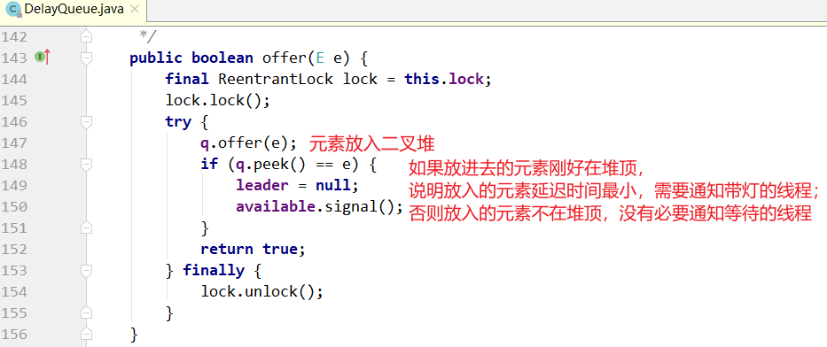

注意：不是每放入一个元素，都需要通知等待的线程。放入的元素，如果其延迟时间大于当前堆顶的元素延迟时间，就没有必要通知等待的线程；只有当延迟时间是最小的，在堆顶时，才有必要通知等待的线程，也就是上面代码中的`if (q.peek() == e) {`部分。

### 5.1.5 SynchronousQueue

SynchronousQueue是一种特殊的BlockingQueue，它本身没有容量。先调用put(...)，线程会阻塞；直到另外一个线程调用了take()，连个线程才同时解锁，反之亦然。对于多个线程而言，例如3个线程，调用3次put(...)，3个线程都会阻塞；直到另外的线程调用3次take()，6个线程才同时解锁，反之亦然。


SynchronousQueue的实现，构造方法：

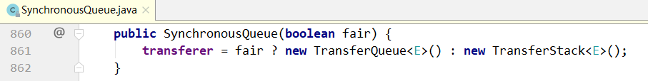

和锁一样，也有公平和非公平模式。如果是公平模式，则用TransferQueue实现；如果是非公平模式，则用TransferStack实现。这两个类分别是什么？先看一下put/take的实现。

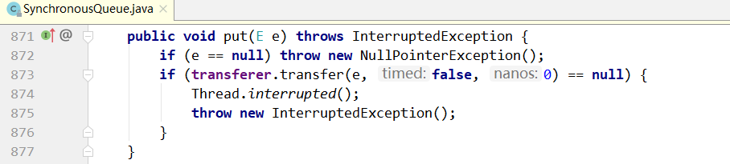

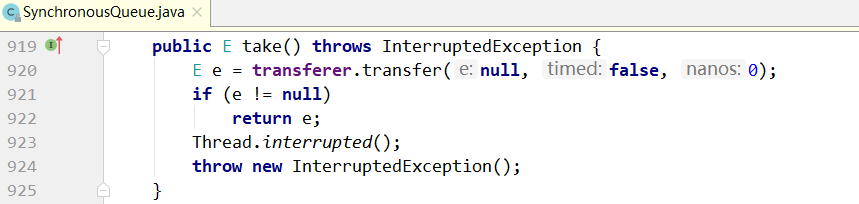

可以看到，put/take都调用了transfer(...)接口。而TransferQueue和TransferStack分别实现了这个接口。该接口在SynchronousQueue内部，如下。如果是put(...)，则第一个参数就是对应的元素；如果是take(...)，则第一个参数为null，后面两个参数分别为是否设置超时和对应的超时时间。

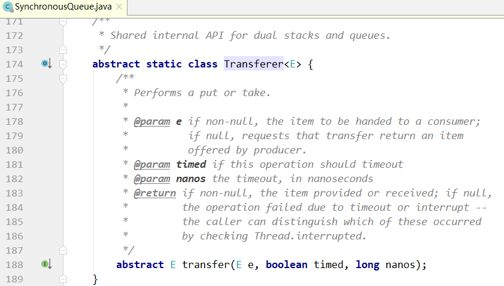


接下来看一下什么是公平模式和非公平模式。假设3个线程分别调用了put(...)，3个线程会进入阻塞状态，直到其他线程调用3次take()，和3个put() 一一配对。

如果是**公平模式（队列模式）**，则第一个调用put(...)的线程1会在队列头部，第1个到来的take()线程和它进行配对，遵循先到先匹配的原则，所以是公平的；如果是**非公平模式（栈模式）**，则第3个调用put(...)的线程3会在栈顶，第1个到来的take()线程和它进行配对，遵行的是后到先配对的原则，所以是非公平的。

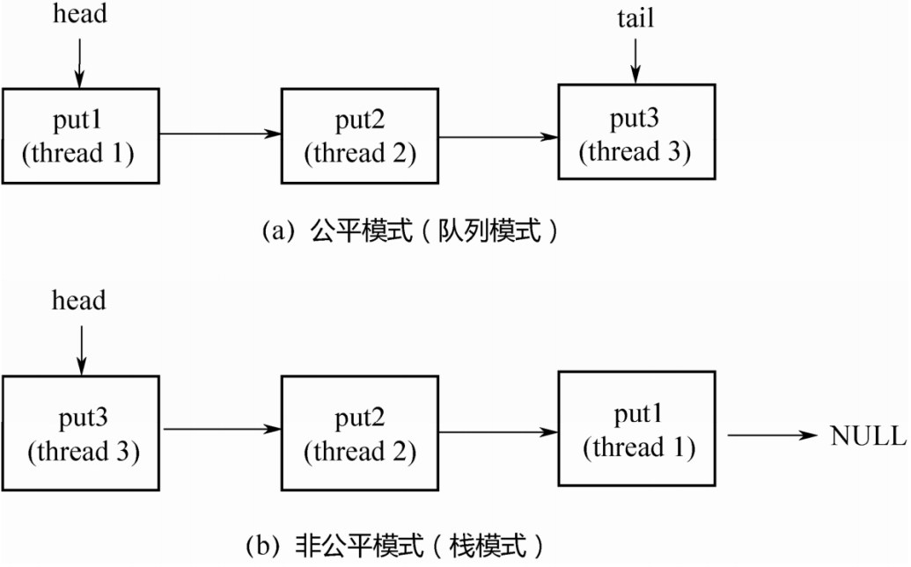

TransferQueue和TransferStack的实现。

**1.TransferQueue：**

```java
public class SynchronousQueue<E> extends AbstractQueue<E> 
		implements BlockingQueue<E>, java.io.Serializable {
		
	// ...
   	static final class TransferQueue<E> extends Transferer<E> {        
   		static final class QNode {
			volatile QNode next;
           	volatile Object item;
           	volatile Thread waiter;            
           	final boolean isData;            
           	//...
     	}
       	transient volatile QNode head;        
       	transient volatile QNode tail;        
       	// ...
	} 
}
```

从上面的代码可以看出，TransferQueue是一个基于单向链表而实现的队列，通过head和tail 2指针记录头部和尾部。初始的时候，head和tail会指向一个空节点，构造方法：

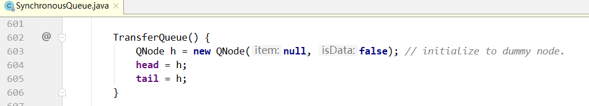

> 阶段(a)：队列是一个空的节点，head/tail都指向这个空节点。
>
> 阶段(b)：3个线程分别调用put，生成3个QNode，进入队列。
>
> 阶段(c)：来了一个线程调用take，会和队列头部的第一个QNode进行配对。
>
> 阶段(d)：第1个QNode出队列。


这里有一个关键点：put节点和take节点节点一旦相遇，就会配对出队列，所以在队列中不可能同时存在put节点和take节点，要么全是put节点，要么全是take节点。

TransferQueue的代码实现：

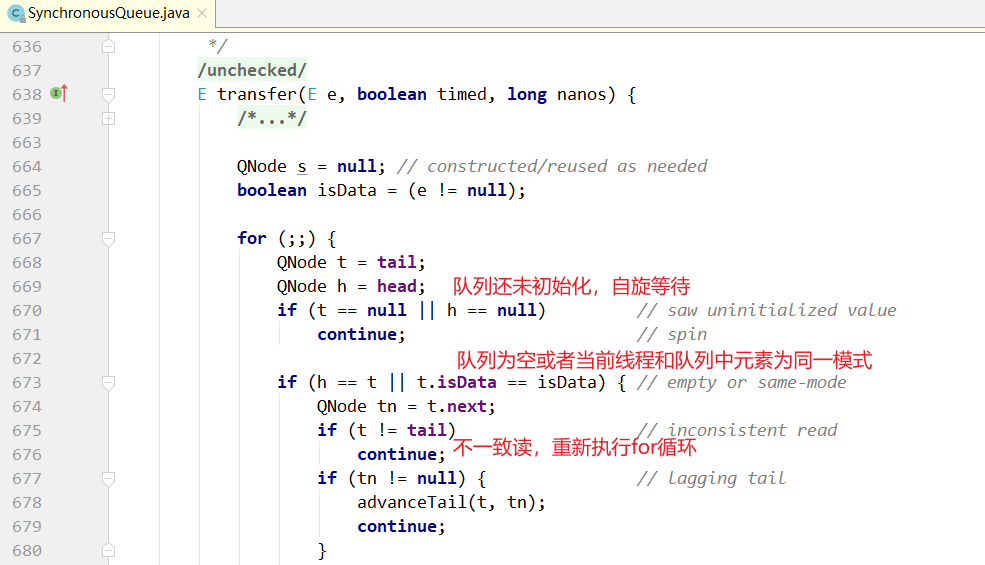

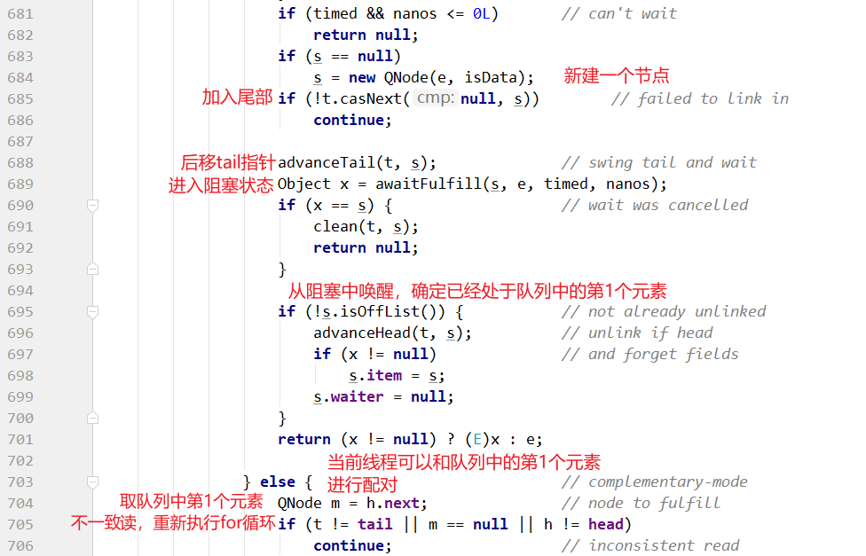

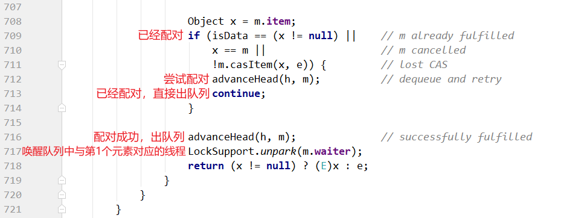


整个for循环有两个大的if-else分支，如果当前线程和队列中的元素是同一模式（都是put节点或者take节点），则与当前线程对应的节点被加入队列尾部并且阻塞；如果不是同一种模式，则选取队列头部的第1个元素进行配对。

这里的配对就是m.casltem(x, e)，把自己的item x换成对方的item e，如果CAS操作成功，则配对成功。如果是put节点，则isData=true，item != null；如果是take节点，则isData = false，item = null。如果CAS操作不成功，则isData和item之间将不一致，也就是isData != (x != null)，通过这个条件可以判断节点是否已经被匹配过了。


**2.TransferStack：**

TransferStack的定义如下，首先，它也是一个单向链表。不同于队列，只需要head指针就能实现入栈和出栈操作。

```java
static final class TransferStack extends Transferer {
   	static final int REQUEST = 0;
   	static final int DATA = 1;
   	static final int FULFILLING = 2;
   	static final class SNode {
       	volatile SNode next;     // 单向链表
       	volatile SNode match;    // 配对的节点
       	volatile Thread waiter;  // 对应的阻塞线程        
       	Object item;
       	int mode;                // 三种模式        
       	//...
 	}
   	volatile SNode head; 
}
```

链表中的节点有三种状态，REQUEST对应take节点，DATA对应put节点，二者配对之后，会生成一个FULLFILLING节点，入栈，然后FULLING节点和被配对的节点一起出栈。

> 阶段(a)：head指向NULL。不同于TransferQueue，这里没有空的头节点。
>
> 阶段(b)：3个线程调用3次put，依次入栈。
>
> 阶段(c)：线程4调用take，和栈顶的第一个元素配对，生成FULLFILLING节点，入栈。
>
> 阶段(d)：栈顶的2个元素同时出栈。

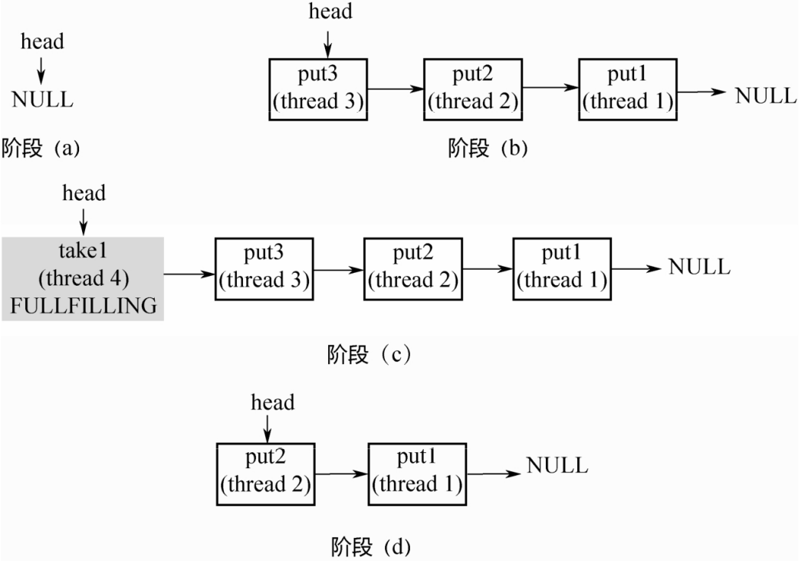

具体代码实现：

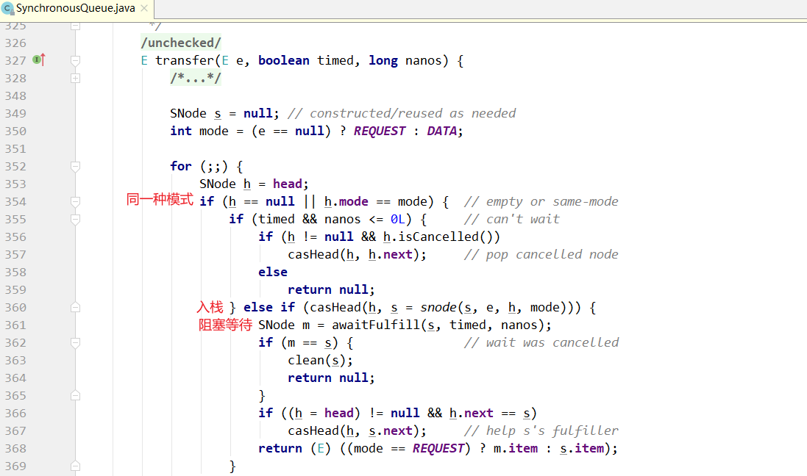


## 5.2 BlockingDeque

BlockingQueue定义了一个阻塞的双端队列接口，如下：

```java
public interface BlockingDeque<E> extends BlockingQueue<E>, Deque<E> {    
	void putFirst(E e) throws InterruptedException;
   	void putLast(E e) throws InterruptedException;    
   	E takeFirst() throws InterruptedException;
   	E takeLast() throws InterruptedException;    
   	// ...
}
```

该接口继承了BlockingQueue接口，同时增加了对应的双端队列操作接口。该接口只有一个实现，就是LinkedBlockingDeque。

核心数据结构如下：是一个双向链表。

```java
public class LinkedBlockingDeque<E> extends AbstractQueue<E> 
		implements BlockingDeque<E>, java.io.Serializable {
   
   	static final class Node<E> {        
   		E item;
       	Node<E> prev;  // 双向链表的Node        
       	Node<E> next;Node(E x) {            
       		item = x;      
		}
	}
	
   	transient Node<E> first;  // 队列的头和尾    
   	transient Node<E> last;
   	private transient int count; // 元素个数    
   	private final int capacity;  // 容量    
   	
   	// 一把锁+两个条件
   	final ReentrantLock lock = new ReentrantLock();
   	private final Condition notEmpty = lock.netCondition();    
   	private final Condition notFull = lock.newCondition();    
   	// ...
}
```

对应的实现原理，和LinkedBlockingQueue基本一样，只是LinkedBlockingQueue是单向链表，而LinkedBlockingDeque是双向链表。

take/put：

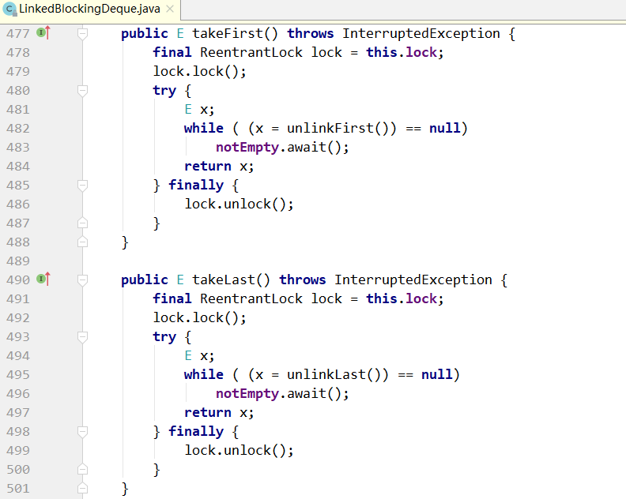

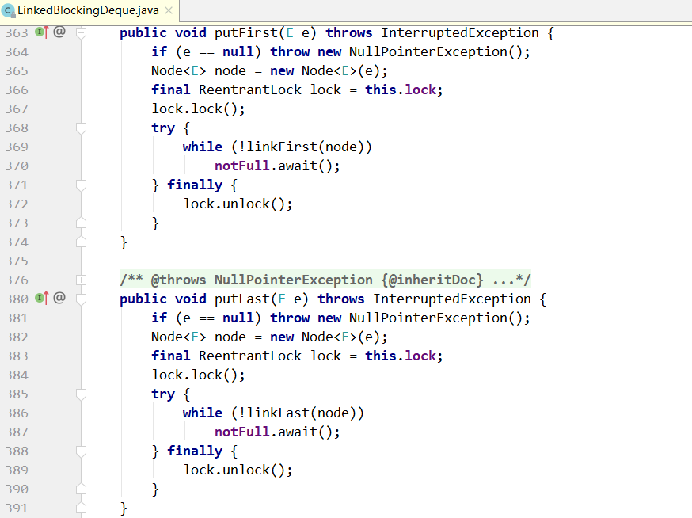

## 5.3 CopyOnWrite

CopyOnWrite指在“写”的时候，不直接“写”源数据，而是把数据拷贝一份进行修改，在通过悲观锁或者乐观锁的方式写回。

拷贝一份再修改，是为了在“读”的时候不加锁。

### 5.3.1 CopyOnWriteArrayList

和ArrayList一样，CopyOnWriteArrayList的核心数据结构也是一个数组，代码如下：

```java
public class CopyOnWriteArrayList<E> 
		implements List<E>, RandomAccess, Cloneable, java.io.Serializable {
   
   	// ...
   	private volatile transient Object[] array; 
}
```

下面是CopyOnWriteArrayList的几个“读”方法：

```java
	final Object[] getArray() {        
		return array;
	}
	//
	public E get(int index) {
		return elementAt(getArray(), index);  
	}
   	public boolean isEmpty() {        
   		return size() == 0;  
	}
   	public boolean contains(Object o) {        
   		return indexOf(o) >= 0;
 	}
   	public int indexOf(Object o) {        
   		Object[] es = getArray();
       	return indexOfRange(o, es, 0, es.length);  
	}
   	private static int indexOfRange(Object o, Object[] es, int from, int to){        
   		if (o == null) {
           	for (int i = from; i < to; i++)                
           		if (es[i] == null)
                   	return i;        
		} else {
           	for (int i = from; i < to; i++)                
           		if (o.equals(es[i]))
                   	return i;      
		}
       	return -1;  
	}
```

这些“读”方法都没有加锁，如何保证"线程安全"？答案在”写“方法中。

```java
public class CopyOnWriteArrayList<E>
   		implements List<E>, RandomAccess, Cloneable, java.io.Serializable {    
   	
   	// 锁对象
   	final transient Object lock = new Object();  
    
   	public boolean add(E e) {
       	synchronized (lock) { // 同步锁对象            
       		Object[] es = getArray();
           	int len = es.length;
           	es = Arrays.copyOf(es, len + 1); // CopyOnWrite，写的时候，先拷贝一 份之前的数组。
           	es[len] = e;            
           	setArray(es);            
           	return true;      
		}
 	}
 	
   	public void add(int index, E element) {        
   		synchronized (lock) { // 同步锁对象            
   			Object[] es = getArray();
           	int len = es.length;
           	if (index > len || index < 0)
           		throw new IndexOutOfBoundsException(outOfBounds(index, len));
           	Object[] newElements;
           	int numMoved = len - index;            
           	if (numMoved == 0){
               	newElements = Arrays.copyOf(es, len + 1);            
			} else {
               	newElements = new Object[len + 1];
               	System.arraycopy(es, 0, newElements, 0, index); // CopyOnWrite，写的时候，先拷贝一份之前的数组。
               	System.arraycopy(es, index, newElements, index + 1, numMoved);
       		}
           	newElements[index] = element;
           	setArray(newElements); // 把新数组赋值给老数组      
		}
	} 
}
```

其他”写“方法，例如remove和add类似。

### 5.3.2 CopyOnWriteArraySet

CopyOnWriteArraySet就是用Array实现的一个Set，保证所有元素都不重复。其内部是封装的一个CopyOnWriteArrayList。

```java
public class CopyOnWriteArraySet<E> extends AbstractSet<E> 
		implements java.io.Serializable {
   	// 新封装的CopyOnWriteArrayList
	private final CopyOnWriteArrayList<E> al;
	public CopyOnWriteArraySet() {
		al = new CopyOnWriteArrayList<E>();  
	}
   	public boolean add(E e) {
       	return al.addIfAbsent(e); // 不重复的加进去  
	}
}
```


## 5.4 ConcurrentLinkedQueue/Deque

AQS（AbstractQueuedSynchronizer）内部的阻塞队列实现原理：基于双向链表，通过对head/tail进行CAS操作，实现入队和出队。

ConcurrentLinkedQueue的实现原理和AQS内部的阻塞队列类似：同样是基于CAS，同样是通过head/tail指针记录队列头部和尾部，但是有稍许差别。

首先，它是一个单向链表，定义：

```java
public class ConcurrentLinkedQueue<E> extends AbstractQueue<E> 
		implements Queue<E>, java.io.Serializable {
	
	private static class Node<E> {        
		volatile E item;
       	volatile Node<E> next;        
       	//...
 	}
   	private transient volatile Node<E> head;    
   	private transient volatile Node<E> tail;    
   	//...
}
```

其次，在AQS的阻塞队列中，每次入队后，tail一定会后移一个位置；每次出队，head一定后移一个位置，保证head指向队列头部，tail指向链表尾部。

但在ConcurrentLinkedQueue中，head/tail的更新可能落后于节点的入队和出队，因为它不是直接对head/tail指针进行CAS操作的，而是对Node中的item进行操作。分析如下：

**1.初始化**

初始的时候，`head`和`tail`都指向一个`null`节点，对应代码如下：

```java
public ConcurrentLinkedQueue() {
	head = tail = new Node<E>();
}
```

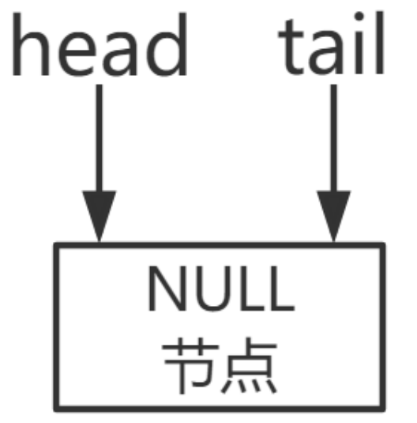

**2.入队列**

代码如下：

```java
public boolean offer(E e) {
    final Node<E> newNode = new Node<E>(Objects.requireNonNull(e));

    for (Node<E> t = tail, p = t;;) {
        Node<E> q = p.next;
        if (q == null) {
            if (NEXT.compareAndSet(p, null, newNode)) {
                if (p != t) // hop two nodes at a time; failure is OK
                    TAIL.weakCompareAndSet(this, t, newNode);
                return true;
            }
        }
        else if (p == q)
            p = (t != (t = tail)) ? t : head;
        else
            p = (p != t && t != (t = tail)) ? t : q;
    }
}
```

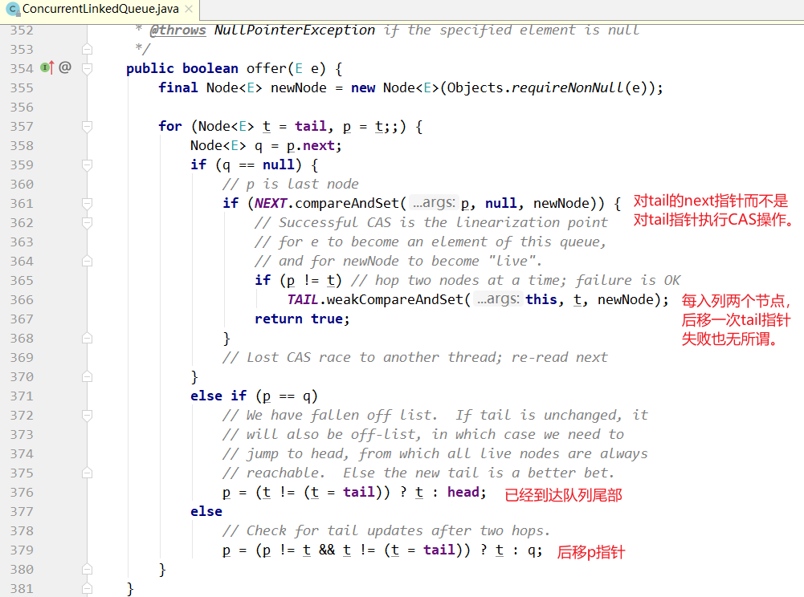

上面的入队，其实是每次在队尾追加2个节点时，才移动一次tail节点，如下：

初始化的时候，队列中有1个节点item1，tail指向该节点，假设线程1要入队item2节点：

step1：p=tail, q=p.next=null

step2：对p的next执行CAS操作，追加item2，成功后，p=tail。所以上面的casTail方法不会执行，直接返回。此时tail指针没有变化。

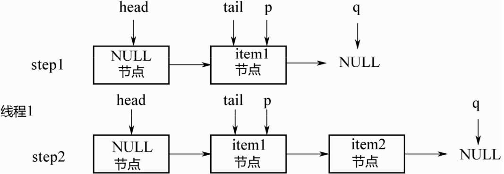

之后，假设线程2要入队item3节点，如下：

step3：p=tail，q=p.next

step4：q != null，因此不会入队新节点。p，q都后移一位。

step5：q = null ，对p的next执行CAS操作，入队item3节点。

step6：p != t，满足条件，执行上面的casTail操作，tail后移2个位置，到达队列尾部。

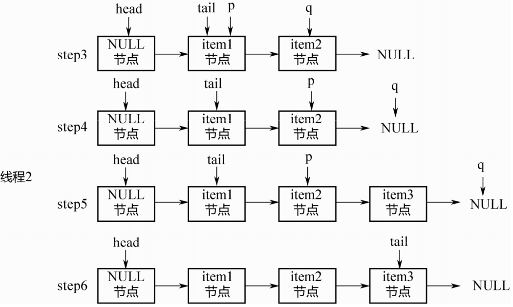

最后总结以下入队列的两个关键点：

1. 即使tail指针没有移动，只要对p的next指针成功进行CAS操作，就算成功入队列。
2. 只有当 p != tail 的时候，才会后移tail指针。也就是说，每连续追加2个节点，才后移1次tail指针。即使CAS失败也没关系，可以由下1个线程来移动tail指针。


**3.出队列**

上面说了入队列后，tail指针不变化，那是否会出现入队列之后，要出队列却没有元素可出的情况？

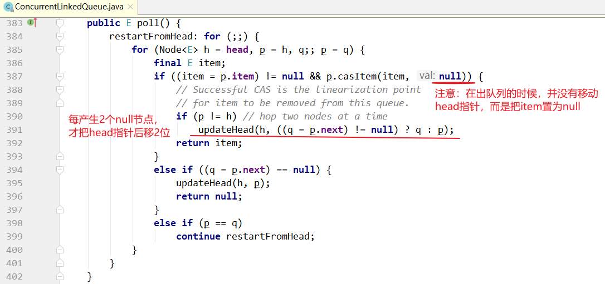

出队列的代码和入队列类似，也有p、q两个指针，整个变化过程如下：，假设初始的时候head指向空节点，队列中有item1、item2、item3三个节点。

step1：p = head，q = p.next，p != q

step2：后移p指针，使得p=q

step3：出队列。关键点：此处并没有直接删除item1节点，只是把该节点的item通过CAS操作置为了NULL。

step4：p != head，此时队列中有了2个NULL节点，再次前移1次head指针，对其执行updateHead操作。


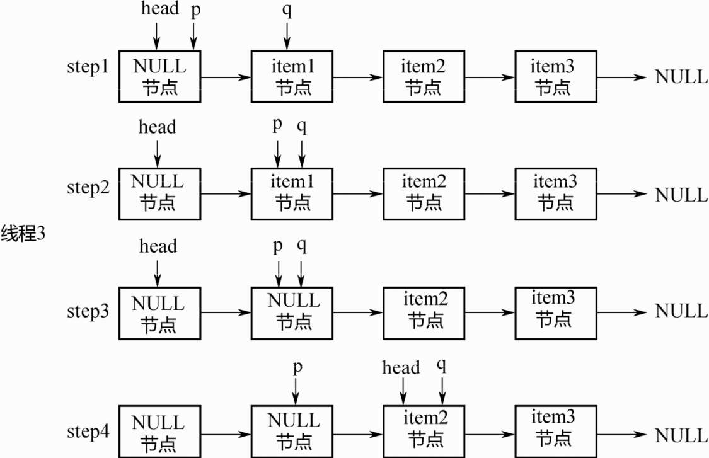

最后总结一下出队列的关键点：

1. 出队列的判断并非观察tail指针的位置，而是依赖于head指针后续的节点是否为NULL这一条件。
2. 只要对节点的item执行CAS操作，置为NULL成功，则出队列成功，即使head指针没有成功移动，也可以下1个线程继续完成。


**4.队列判空**

因为head/tail并不是精确地指向队列头部和尾部，所以不能简单地通过比较head/tail指针来判断队列是否为空，而是需要从head指针开始遍历，找到第一个不为NULL的节点，如果找到，则队列不为空；如果找不到，则队列为空。代码如下：

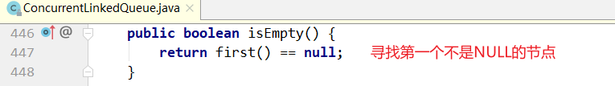

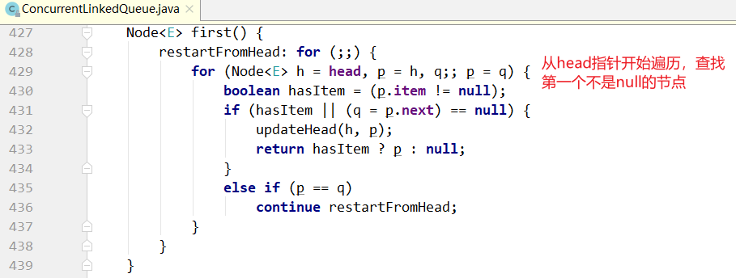


## 5.5 ConcurrentHashMap

HashMap通常的实现方式是“**数组+链表**”，这种方式被称为“拉链法”。ConcurrentHashMap在这个基本原理之上进行了各种优化。

首先是所有数据都放在一个大的HashMap中；其次是**引入了红黑树**。

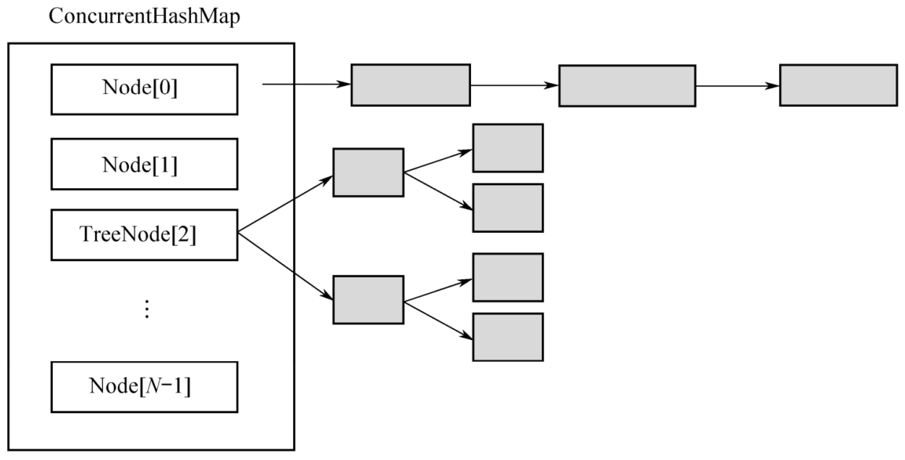

如果头节点是Node类型，则尾随它的就是一个普通的链表；如果头节点是TreeNode类型，它的后面就是一个红黑树，TreeNode是Node的子类。

链表和红黑树之间可以相互转换：初始的时候是链表，当链表中的元素超过某个阈值时，把链表转换成红黑树；反之，当红黑树中的元素个数小于某个阈值时，在转换为链表。

为什么要做这种设计？

1. 使用红黑树，当一个槽里有很多元素时，其查询和更新速度会比链表快很多，Hash冲突的问题由此得到较好的解决。
2. 加锁的粒度，并非整个ConcurrentHashMap，而是对每个头节点分别加锁，即并发度，就是Node数组的长度，初始长度为16。
3. 并发扩容，这是难度最大的。当一个线程要扩容Node数组的时候，其他线程还要读写，因此处理过程很复杂，

上述对比可以总结出：这种设计一方面降低了Hash冲突，另一方面也提升了并发度。


下面从构造方法开始，一步步深入分析其实现过程：

### 5.5.1 构造方法分析

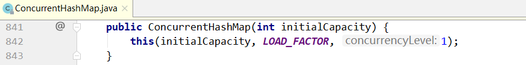

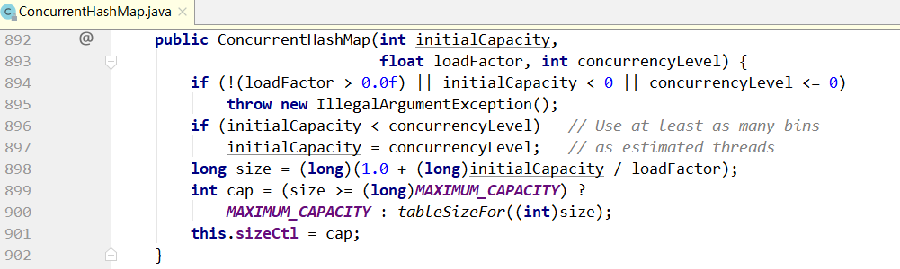

在上面的代码中，变量cap就是Node数组的长度，保持2的整数次方。tableSizeFor(...)方法是根据传入的初始容量，计算出一个合适的数组长度。具体而言：1.5倍的初始容量+1，再往上取最接近的2的整数次方，作为数组长度cap的初始值。

这里的sizeCtl，其含义是用于控制在初始化或者并发扩容时候的线程数，只不过其初始值设置成cap。


### 5.5.2 初始化

在上面的构造方法里只计算了数组的初始大小，并没有对数组进行初始化。当多个线程都往里面放入元素的时候，再进行初始化。这就存在一个问题：多个线程重复初始化。那看一下是如何处理的。

```java
private final Node<K,V>[] initTable() {
    Node<K,V>[] tab; int sc;
    while ((tab = table) == null || tab.length == 0) {
        if ((sc = sizeCtl) < 0)
            Thread.yield(); // 自旋等待
        else if (U.compareAndSetInt(this, SIZECTL, sc, -1)) { //重点：将sizeCtl设置为-1
            try {
                if ((tab = table) == null || tab.length == 0) {
                    int n = (sc > 0) ? sc : DEFAULT_CAPACITY;
                    @SuppressWarnings("unchecked")
                    Node<K,V>[] nt = (Node<K,V>[])new Node<?,?>[n]; // 初始化
                    table = tab = nt;
                    // sizeCtl不是数组长度，因此初始化成功后，就不再等于数组长度
                    // 而是n-(n>>>2)=0.75n，表示下一次扩容的阈值：n-n/4
                    sc = n - (n >>> 2);
                }
            } finally {
                sizeCtl = sc;// 设置sizeCtl的值为sc。
            }
            break;
        }
    }
    return tab;
}
```

通过上面的代码可以看到，uoge线程的竞争是通过对sizeCtl进行CAS操作实现的。如果某个线程成功地把sizeCtl设置为-1，它就拥有了初始化的权利，进入初始化的代码模块，等到初始化完成，再把sizeCtl设置回去；其他线程则一直执行while循环，自旋等待，直到数组不为null，即当初始化结束时，退出整个方法。

因为初始化的工作量很小，所以此处选择的策略是让其他线程一直等待，而没有帮助其初始化。


### 5.5.3 put(...)实现分析

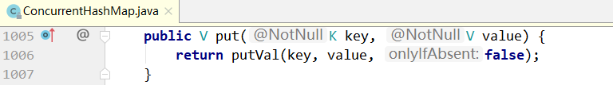

```java
final V putVal(K key, V value, boolean onlyIfAbsent) {
    if (key == null || value == null) throw new NullPointerException();
    int hash = spread(key.hashCode());
    int binCount = 0;
    for (Node<K,V>[] tab = table;;) {
        Node<K,V> f; int n, i, fh; K fk; V fv;
        // 分支1：整个数组初始化
        if (tab == null || (n = tab.length) == 0)
            tab = initTable();
        // 分支2：第i个元素初始化
        else if ((f = tabAt(tab, i = (n - 1) & hash)) == null) {
            if (casTabAt(tab, i, null, new Node<K,V>(hash, key, value)))
                break;                   // no lock when adding to empty bin
        }
        // 分支3：扩容
        else if ((fh = f.hash) == MOVED)
            tab = helpTransfer(tab, f);
        else if (onlyIfAbsent // check first node without acquiring lock
                 && fh == hash
                 && ((fk = f.key) == key || (fk != null && key.equals(fk)))
                 && (fv = f.val) != null)
            return fv;
        // 分支4：放入元素
        else {
            V oldVal = null;
            // 重点：加锁
            synchronized (f) {
                // 链表
                if (tabAt(tab, i) == f) {
                    if (fh >= 0) {
                        binCount = 1;
                        for (Node<K,V> e = f;; ++binCount) {
                            K ek;
                            if (e.hash == hash &&
                                ((ek = e.key) == key ||
                                 (ek != null && key.equals(ek)))) {
                                oldVal = e.val;
                                if (!onlyIfAbsent)
                                    e.val = value;
                                break;
                            }
                            Node<K,V> pred = e;
                            if ((e = e.next) == null) {
                                pred.next = new Node<K,V>(hash, key, value);
                                break;
                            }
                        }
                    }
                    else if (f instanceof TreeBin) { // 红黑树
                        Node<K,V> p;
                        binCount = 2;
                        if ((p = ((TreeBin<K,V>)f).putTreeVal(hash, key,
                                                       value)) != null) {
                            oldVal = p.val;
                            if (!onlyIfAbsent)
                                p.val = value;
                        }
                    }
                    else if (f instanceof ReservationNode)
                        throw new IllegalStateException("Recursive update");
                }
            }
            // 如果是链表，上面的binCount会一直累加
            if (binCount != 0) {
                if (binCount >= TREEIFY_THRESHOLD)
                    treeifyBin(tab, i); // 超出阈值，转换为红黑树
                if (oldVal != null)
                    return oldVal;
                break;
            }
        }
    }
    addCount(1L, binCount);//总元素个数累加1
    return null;
}
```

上面的for循环有4个大的分支：

第一个分支，是整个数组的初始化，

第二个分支，是所在的槽为空，说明该元素是该槽的第一个元素，直接新建一个头节点，然后返回；

第三个分支，说明该槽正在进行扩容，帮助其扩容；

第四个分支，即使把元素放入槽内，槽内可能是一个链表，也可能是一棵红黑树，通过头节点的类型可以判断是哪一种。第四个分支是包裹在synchronized(f)里面的，f对应的数组下标位置的头节点，意味着每个数组元素有一把锁，并发度等于数组的长度。

上面的binCount表示链表的元素个数，**当这个数目超过TREEIFY_THRESHOLD=8时，把链表转换成红黑树**，也就是treeifyBin(tab, i)方法。但在这个方法内部，不一定需要进行红黑树转换，可能只做扩容操作，所以接下来从扩容说起。


### 5.5.4 扩容

扩容的实现是最复杂的，下面从treeifyBin(Node<K,V>[] tab, int index)说起。

```java
private final void treeifyBin(Node<K,V>[] tab, int index) {
    Node<K,V> b; int n;
    if (tab != null) {
        if ((n = tab.length) < MIN_TREEIFY_CAPACITY)
            // 数组长度小于阈值64,不做红黑树，直接扩容
            tryPresize(n << 1);
        else if ((b = tabAt(tab, index)) != null && b.hash >= 0) {
            // 链表转换为红黑树
            synchronized (b) {
                if (tabAt(tab, index) == b) {
                    TreeNode<K,V> hd = null, tl = null;
                    // 遍历链表，初始化红黑树
                    for (Node<K,V> e = b; e != null; e = e.next) {
                        TreeNode<K,V> p =
                            new TreeNode<K,V>(e.hash, e.key, e.val,
                                              null, null);
                        if ((p.prev = tl) == null)
                            hd = p;
                        else
                            tl.next = p;
                        tl = p;
                    }
                    setTabAt(tab, index, new TreeBin<K,V>(hd));
                }
            }
        }
    }
}
```

在上面的代码中，MIN_TREEIFY_CAPACITY=64，意味着当数组长度没有超过64的时候，数组的每个节点里都是链表，只会扩容，不会转换为红黑树。只有当数组长度大于等于64时，才考虑把链表转换为红黑树。也就是，**链表长度大于等于8的时候，进行扩容，当数组长度大于等于64的时候，链表开始转换为红黑树。**

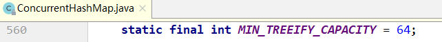

在tryPresize(int size)内部调用了一个核心方法transfer(Node<K,V>[] tab, Node<K,V>[] nextTab)，先从这个方法分析说起。

```java
private final void tryPresize(int size) {
    int c = (size >= (MAXIMUM_CAPACITY >>> 1)) ? MAXIMUM_CAPACITY :
        tableSizeFor(size + (size >>> 1) + 1);
    int sc;
    while ((sc = sizeCtl) >= 0) {
        Node<K,V>[] tab = table; int n;
        if (tab == null || (n = tab.length) == 0) {
            n = (sc > c) ? sc : c;
            if (U.compareAndSetInt(this, SIZECTL, sc, -1)) {
                try {
                    if (table == tab) {
                        @SuppressWarnings("unchecked")
                        Node<K,V>[] nt = (Node<K,V>[])new Node<?,?>[n];
                        table = nt;
                        sc = n - (n >>> 2);
                    }
                } finally {
                    sizeCtl = sc;
                }
            }
        }
        else if (c <= sc || n >= MAXIMUM_CAPACITY)
            break;
        else if (tab == table) {
            int rs = resizeStamp(n);
            if (U.compareAndSetInt(this, SIZECTL, sc,
                                    (rs << RESIZE_STAMP_SHIFT) + 2))
                transfer(tab, null);
        }
    }
}
```


```java
private final void transfer(Node<K,V>[] tab, Node<K,V>[] nextTab) {
    int n = tab.length, stride;
    if ((stride = (NCPU > 1) ? (n >>> 3) / NCPU : n) < MIN_TRANSFER_STRIDE)
        stride = MIN_TRANSFER_STRIDE; // 计算步长
    if (nextTab == null) {            // 初始化新的HashMap
        try {
            @SuppressWarnings("unchecked")
            Node<K,V>[] nt = (Node<K,V>[])new Node<?,?>[n << 1];// 扩容两倍
            nextTab = nt;
        } catch (Throwable ex) {      // try to cope with OOME
            sizeCtl = Integer.MAX_VALUE;
            return;
        }
        nextTable = nextTab;
        // 初始化的transferIndex=旧HashMap的数组长度
        transferIndex = n;
    }
    int nextn = nextTab.length;
    ForwardingNode<K,V> fwd = new ForwardingNode<K,V>(nextTab);
    boolean advance = true;
    boolean finishing = false; // to ensure sweep before committing nextTab
    // 此处，i为遍历下标，bound为边界
    // 如果成功获取下一个任务，则i=nextIndex-1
    // bound=nextIndex-stride
    // 如果获取步到，则i=0,bound=0
    for (int i = 0, bound = 0;;) {
        Node<K,V> f; int fh;
        // advance表示从i=transferIndex-1遍历到bound位置的过程中，是否一直继续
        while (advance) {
            int nextIndex, nextBound;
            // 以下是那个分支中的advance都是false，表示如果三个分支都不执行，才可以一直while循环
            // 目的在于当对transferIndex执行CAS操作不成功的时候，需要自旋，以期获取一个stride的迁移任务
            if (--i >= bound || finishing)
                // 对数组遍历，通过这里的--i进行。如果成功执行了--i，就不需要继续while循环了，因为advance只能进一步
                advance = false;
            else if ((nextIndex = transferIndex) <= 0) {
                // transferIndex <= 0，整个HashMap完成
                i = -1;
                advance = false;
            }
            // 对transferIndex执行CAS操作，即为当前线程分配1个stride。
            // CAS操作成功，线程成功获取到一个stride的迁移任务
            // CAS操作不成功，线程没有抢到任务，会继续执行while循环，自旋
            else if (U.compareAndSetInt
                     (this, TRANSFERINDEX, nextIndex,
                      nextBound = (nextIndex > stride ?
                                   nextIndex - stride : 0))) {
                bound = nextBound;
                i = nextIndex - 1;
                advance = false;
            }
        }
        // i越界，整个HashMap遍历完成
        if (i < 0 || i >= n || i + n >= nextn) {
            int sc;
            // finishing表示整个HashMap扩容完成
            if (finishing) {
                nextTable = null;
                // 将nextTab赋值给当前table
                table = nextTab;
                sizeCtl = (n << 1) - (n >>> 1);
                return;
            }
            if (U.compareAndSetInt(this, SIZECTL, sc = sizeCtl, sc - 1)) {
                if ((sc - 2) != resizeStamp(n) << RESIZE_STAMP_SHIFT)
                    return;
                finishing = advance = true;
                i = n; // recheck before commit
            }
        }
        // tab[i]迁移完毕，赋值一个ForwardingNode
        else if ((f = tabAt(tab, i)) == null)
            advance = casTabAt(tab, i, null, fwd);
        // tab[i]的位置已经在迁移过程中
        else if ((fh = f.hash) == MOVED)
            advance = true; // already processed
        else {
            // 对tab[i]进行迁移操作，tab[i]可能是一个链表或者红黑树
            synchronized (f) {
                if (tabAt(tab, i) == f) {
                    Node<K,V> ln, hn;
                    // 链表
                    if (fh >= 0) {
                        int runBit = fh & n;
                        Node<K,V> lastRun = f;
                        for (Node<K,V> p = f.next; p != null; p = p.next) {
                            int b = p.hash & n;
                            if (b != runBit) {
                                runBit = b;
                                // 表示lastRun之后的所有元素，hash值都是一样的
                                // 记录下这个最后的位置
                                lastRun = p;
                            }
                        }
                        if (runBit == 0) {
                            // 链表迁移的优化做法
                            ln = lastRun;
                            hn = null;
                        }
                        else {
                            hn = lastRun;
                            ln = null;
                        }
                        for (Node<K,V> p = f; p != lastRun; p = p.next) {
                            int ph = p.hash; K pk = p.key; V pv = p.val;
                            if ((ph & n) == 0)
                                ln = new Node<K,V>(ph, pk, pv, ln);
                            else
                                hn = new Node<K,V>(ph, pk, pv, hn);
                        }
                        setTabAt(nextTab, i, ln);
                        setTabAt(nextTab, i + n, hn);
                        setTabAt(tab, i, fwd);
                        advance = true;
                    }
                    // 红黑树，迁移做法和链表类似
                    else if (f instanceof TreeBin) {
                        TreeBin<K,V> t = (TreeBin<K,V>)f;
                        TreeNode<K,V> lo = null, loTail = null;
                        TreeNode<K,V> hi = null, hiTail = null;
                        int lc = 0, hc = 0;
                        for (Node<K,V> e = t.first; e != null; e = e.next) {
                            int h = e.hash;
                            TreeNode<K,V> p = new TreeNode<K,V>
                                (h, e.key, e.val, null, null);
                            if ((h & n) == 0) {
                                if ((p.prev = loTail) == null)
                                    lo = p;
                                else
                                    loTail.next = p;
                                loTail = p;
                                ++lc;
                            }
                            else {
                                if ((p.prev = hiTail) == null)
                                    hi = p;
                                else
                                    hiTail.next = p;
                                hiTail = p;
                                ++hc;
                            }
                        }
                        ln = (lc <= UNTREEIFY_THRESHOLD) ? untreeify(lo) :
                        (hc != 0) ? new TreeBin<K,V>(lo) : t;
                        hn = (hc <= UNTREEIFY_THRESHOLD) ? untreeify(hi) :
                        (lc != 0) ? new TreeBin<K,V>(hi) : t;
                        setTabAt(nextTab, i, ln);
                        setTabAt(nextTab, i + n, hn);
                        setTabAt(tab, i, fwd);
                        advance = true;
                    }
                }
            }
        }
    }
}
```

该方法非常复杂，下面一步步分析：

1. 扩容的基本原理如下图，首先建一个新的HashMap，其数组长度是旧数组长度的2倍，然后把旧的元素逐个迁移过来，第一个参数tab是扩容之前的HashMap，第二个参数nextTab是扩容后的HashMap。当nextTab=null的时候，方法最初会对nextTab进行初始化。这里有一个关键点要说明：该方法会被多个线程调用，所以每个线程只是扩容旧的HashMap部分，这就涉及如何划分任务的问题。

   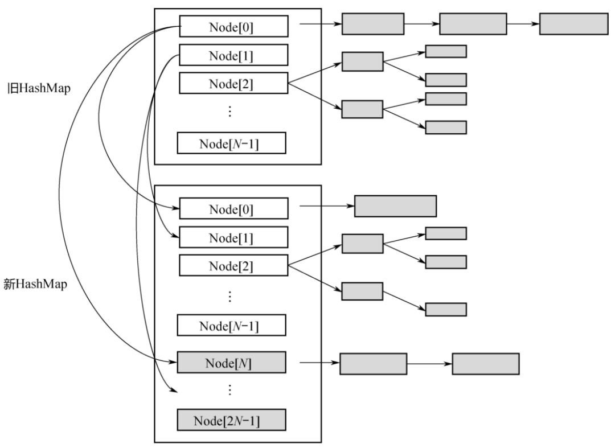

2. 上图为多个线程并行扩容-任务划分示意图，旧数组的长度是N，每个线程扩容一段，一段的长度用变量stride（步长）表示，transferIndex表示了整个数组扩容的进度。

   stride的计算供使如上面的代码所示，即：在单核模式下直接等于n，因为在单核模式下没有办法多个线程并行扩容，只需要一个线程来扩容整个数组；在多核模式下为(n>>>3)/NCPU，并且保证部长最小值是16。显然，需要的线程个数约为n/stride。

   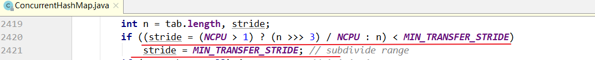

   transferIndex是ConcurrentHashMap的一个成员变量，记录了扩容的进度。初始值为n，从达到小扩容，每次减stride个位置，最终减至n<=0，表示真个扩容完成。因此，从[0，transferIndex-1]的位置表示还没有分配到线程扩容的部分，从[transferIndex，n-1]的位置表示已经分配给某个线程进行扩容，当前正在扩容中，或者已经扩容成功。

   因为transferIndex会被多个线程并发修改，每次减stride，所以需要通过CAS进行操作，如下面代码所示：

   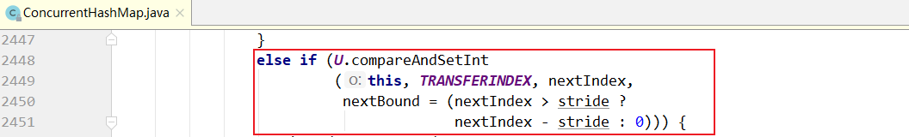
   
   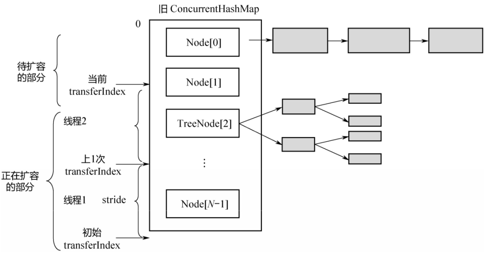
   
3. 在扩容未完成之前，有的数字下标对应的槽已经迁移到了新的HashMap里面，有的还在旧的HashMap里面。这个时候，所有调用get(k，v)的线程还是会访问旧HashMap，怎么处理呢？

   下图为扩容过程中的转发示意图：当Node[0]已经迁移成功，而其他Node还在迁移过程中时，如果有线程要读取Node[0]的数据，就会访问失败。为此，新建一个ForwardingNode，即转发节点，在这个节点里面记录的是新的ConcurrentHashMap的引用。这样，当线程访问ForwardingNode之后，会去查询新的ConcurrentHashMap。

4. 因为数组的长度`tab.length`是2的整数次方，每次扩容又是2倍。而Hash函数是hashCode%tab.length，等价于<br>hashCode&(tab.length-1)。这意味着：处于第i个位置的元素，在新的Hash表的数组中一定处于第i个或者第i+n个位置。如下图所示。举个例子：假设数组长度是8，扩容之后是16：<br>若hashCode = 5，5%8=0，扩容后，5%16=0，位置保持不变；<br>若hashCode = 24，24%8=0，扩容后，24%16=8，后移8个位置；<br>若hashCode = 25，25%8=1，扩容后，25%16=9，后移8个位置；<br>若hashCode = 39，39%8=7，扩容后，39%16=7，位置保持不变；<br>

   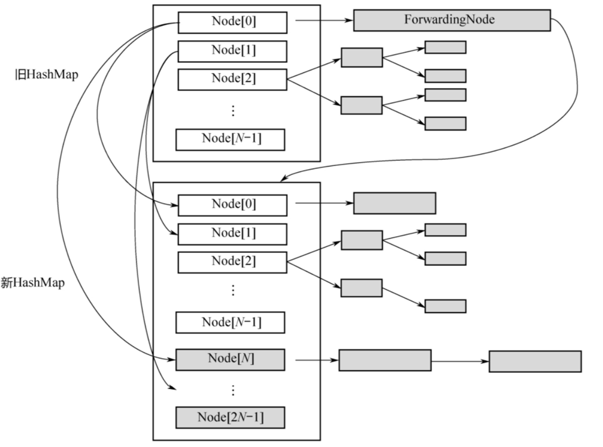

   正因为有这样的规律，所以如下有代码：

   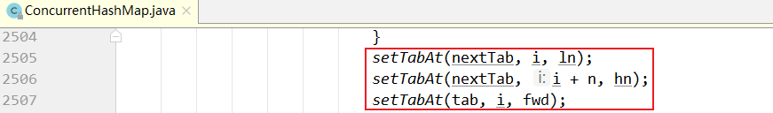

   也就是把tab[i]位置的链表或红黑树重新组装成两部分，一部分链接到nextTab[i]的位置，一部分链接到nextTab[i+n]的位置，如上图所示。然后把tab[i]的位置指向一个ForwardingNode节点。

   同时，当tab[i]后面是链表时，使用类似于JDK 7中在扩容时的优化方法，从lastRun往后的所有节点，不需要依次拷贝，而是直接链接到新的链表头部。从lastRum往前的所有节点，需要依次拷贝。

   了解了核心的迁移函数transfer(tab, nextTab)，在回头看tryPresize(int size)函数。这个函数的输入的是整个Hash表的元素个数，在函数里面，根据需要对整个Hash表进行扩容。想要看明白这个函数，需要透彻的理解sizeCtl变量，下面这段注释摘自源码。

   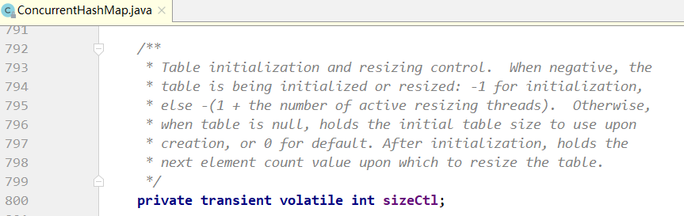

   当sizeCtl=-1，表示整个HashMap正在初始化；<br>当sizeCtl=某个其他复数时，表示多个线程在对HashMap做并发扩容；<br>当sizeCtl=cap，tab=null，表示未初始化之前的初始化容量（如上面的构造函数所示）；<br>扩容成功之后，sizeCtl存储的是下一次要扩容的阈值，即上面初始化代码中的 n-(n>>>2)=0.75n。

   所以，sizeCtl变量在Hash表处于不同状态时，表达不同的含义。明白了这个道理，再来看上面的tryPresize(int size)函数。

   ```java
   private final void tryPresize(int size) {
       int c = (size >= (MAXIMUM_CAPACITY >>> 1)) ? MAXIMUM_CAPACITY :
           tableSizeFor(size + (size >>> 1) + 1);
       int sc;
       while ((sc = sizeCtl) >= 0) {
           Node<K,V>[] tab = table; int n;
           if (tab == null || (n = tab.length) == 0) {
               n = (sc > c) ? sc : c;
               if (U.compareAndSetInt(this, SIZECTL, sc, -1)) {
                   try {
                       if (table == tab) {
                           @SuppressWarnings("unchecked")
                           Node<K,V>[] nt = (Node<K,V>[])new Node<?,?>[n];
                           table = nt;
                           sc = n - (n >>> 2);
                       }
                   } finally {
                       sizeCtl = sc;
                   }
               }
           }
           else if (c <= sc || n >= MAXIMUM_CAPACITY)
               break;
           else if (tab == table) {
               int rs = resizeStamp(n);
               if (U.compareAndSetInt(this, SIZECTL, sc,
                                       (rs << RESIZE_STAMP_SHIFT) + 2))
                   transfer(tab, null);
           }
       }
   }
   ```

   tryPresize(int size) 是根据期望的元素个数对整个Hash表进行扩容，核心是调用transfer函数。在第一次扩容的时候，sizeCtl会被设置成一个很大的负数U.compareAndSwapInt(this，SIZECTL，sc，(rs < < RESIZE_STAMP_SHIFT)+2)；之后每一个线程扩容的时候，sizeCtl就加1，U.compareAndSwapInt(this，SIZECTL，sc，sc+1)，待扩容完成之后，sizeCtl减1。


## 5.6 ConcurrentSkipListMap/Set

ConcurrentHashMap是一种key无序的HashMap，ConcurrentSkipListMap则是key有序的，实现了NavigableMap接口，此接口又继承了SortedMap接口。

### 5.6.1 ConcurrentSkipListMap

> **1.为什么要使用SkipList实现Map？**

在Java的util包中，有一个非线程安全的HashMap，也就是TreeMap，是key有序的，基于红黑树实现。

而在Concurrent包中，提供的key有序的HashMap，就是ConcurrentSkipListMap，是基于SkipList（跳查表）来实现的。这里为什么不用红黑树，而用跳查表来实现呢？

借用Doug Lea原话：

```
The reason is that there are no known efficient lock0free insertion and deletion algorithms for search trees.
```

也就是目前计算机领域还未找到一种高效的，作用在树上的、无锁的、增加和删除节点的办法。

那为什么SkipList可以无锁地实现节点地增加、删除呢？这要从无锁链表地实现说起。

> **2.无锁链表**

在AQS中，用到无锁队列，其实也是链表。究竟二者区别在哪？

前面地无锁队列、栈，都只是在队头，队尾进行CAS操作，通常不会有问题。如果在链表中间进行插入或删除操作，按照通常地CAS做法，就会出现问题！

关于这个问题，Doug Lea的论文中有清晰的论述，此处引用如下：

操作1：在节点10后面插入节点20。如下：，首先把节点20的next指针指向节点30，然后对节点10的next指针执行CAS操作，使其执行节点20即可。

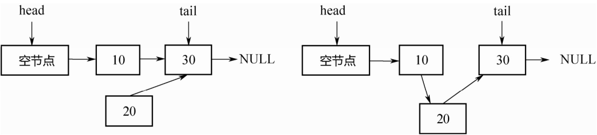

操作2：删除节点10。如下图所示，只需要把头节点的next指针，进行CAS操作到节点30即可。

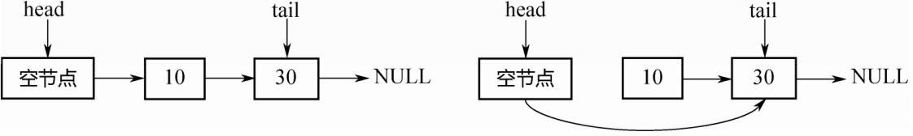

但是，如果两个线程同时操作，一个删除节点10，一个要在节点10后面插入节点20。并且这两个操作都各自是CAS的，此时就会出现问题。如下所示，删除节点10，会同时把新插入的节点20也删除掉，这个问题超出了CAS的解决范围。

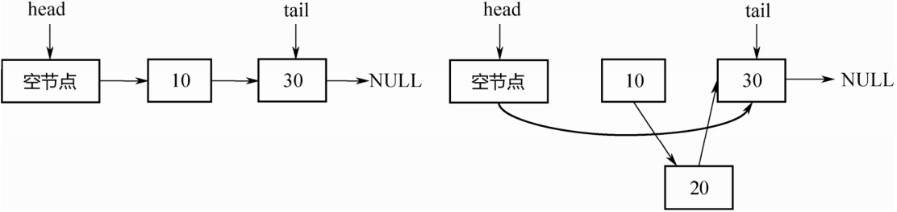

为什么会出现这个问题呢？

究其原因：在删除节点10的时候，实际受到操作的是节点10的前驱，也就是头节点。节点10本身没有任何变化。因此，再往节点10后插入节点20的线程，并不知道节点10已经被删除了！

针对这个问题，在论文中提出如下的解决办法，如下图所示，把节点10删除分为两步：

- 第一步，把节点10的next指针，mark成删除，即软删除；
- 第二步，找机会，物理删除。

做标记之后，当线程再往节点10后面插入节点20的时候，便可以先进性判断，节点10是否已经被删除，从而避免在一个删除的节点10后面插入节点20。**这个解决方法有一个关键点：“把节点10的next指针指向20（插入操作）”和“判断节点10本身是否已经删除（判断操作）”，必须是原子的，必须在1个CAS操作里面完成！**


具体的实现有两个办法：

- 办法一：AtomicMarkableReference

  保证每个next是AtomicMarkableReference类型。但这个办法不够高效，Doug Lea在ConcurrentSkipListMap的实现中用了另一种办法。

- 办法二：Mark节点

  我们的目的是标记节点10已经删除，也就是标记它的next字段。那么可以新造一个marker节点，使节点10的next指针执行该marker节点。这样，当向节点10的后面插入节点20的时候，就可以在插入的同时判断节点10的next指针是否指向了一个Marker节点，这两个操作可以在一个CAS操作里面完成。

> **3.跳查表**

解决了无锁链表的插入或删除问题，也就解决了跳查表的一个关键问题。因为跳查表就是多层链表叠起来的。

下面先看一下跳查表的数据结构。

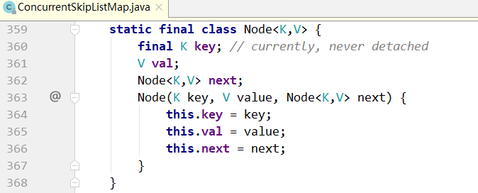

上图中的Node就是跳查表的底层节点类型。所有的<K, V>对都是由这个单向链表串起来的。

上面的Index层的节点：

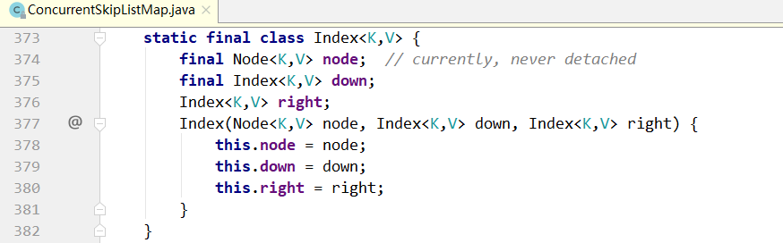

上图中的node属性不存储实际数据，指向Node节点。

down属性：每个Index节点，必须有一个指针，指向其下一个Level对应的节点。

right属性：Index也组成单向链表。

整个ConcurrentSkipListMap就只需要记录顶层的head节点即可：

```java
public class ConcurrentSkipListMap<K,V> extends AbstractMap<K,V>
        implements ConcurrentNavigableMap<K,V>, Cloneable, Serializable {    
    // ...
    private transient Index<K,V> head;    
    // ...
}
```

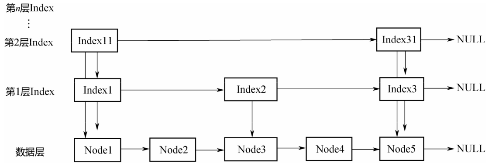

下面详细分析如何从跳查表上查找、插入和删除元素。

> **3.1 put 实现分析**

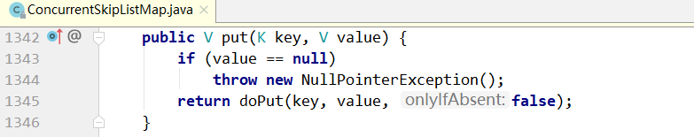

```java
private V doPut(K key, V value, boolean onlyIfAbsent) {
    if (key == null)
        throw new NullPointerException();
    Comparator<? super K> cmp = comparator;
    for (;;) {
        Index<K,V> h; Node<K,V> b;
        VarHandle.acquireFence();
        int levels = 0;                    // number of levels descended
        if ((h = head) == null) {          // 初始化
            Node<K,V> base = new Node<K,V>(null, null, null);
            h = new Index<K,V>(base, null, null);
            b = (HEAD.compareAndSet(this, null, h)) ? base : null;
        }
        else {
            for (Index<K,V> q = h, r, d;;) { // count while descending
                while ((r = q.right) != null) {
                    Node<K,V> p; K k;
                    if ((p = r.node) == null || (k = p.key) == null ||
                        p.val == null)
                        RIGHT.compareAndSet(q, r, r.right);
                    else if (cpr(cmp, key, k) > 0)
                        q = r;
                    else
                        break;
                }
                if ((d = q.down) != null) {
                    ++levels;
                    q = d;
                }
                else {
                    b = q.node;
                    break;
                }
            }
        }
        if (b != null) {
            Node<K,V> z = null;              // new node, if inserted
            for (;;) {                       // find insertion point
                Node<K,V> n, p; K k; V v; int c;
                if ((n = b.next) == null) {
                    if (b.key == null)       // if empty, type check key now
                        cpr(cmp, key, key);
                    c = -1;
                }
                else if ((k = n.key) == null)
                    break;                   // can't append; restart
                else if ((v = n.val) == null) {
                    unlinkNode(b, n);
                    c = 1;
                }
                else if ((c = cpr(cmp, key, k)) > 0)
                    b = n;
                else if (c == 0 &&
                         (onlyIfAbsent || VAL.compareAndSet(n, v, value)))
                    return v;

                if (c < 0 &&
                    NEXT.compareAndSet(b, n,
                                       p = new Node<K,V>(key, value, n))) {
                    z = p;
                    break;
                }
            }

            if (z != null) {
                int lr = ThreadLocalRandom.nextSecondarySeed();
                if ((lr & 0x3) == 0) {       // add indices with 1/4 prob
                    int hr = ThreadLocalRandom.nextSecondarySeed();
                    long rnd = ((long)hr << 32) | ((long)lr & 0xffffffffL);
                    int skips = levels;      // levels to descend before add
                    Index<K,V> x = null;
                    for (;;) {               // create at most 62 indices
                        x = new Index<K,V>(z, x, null);
                        if (rnd >= 0L || --skips < 0)
                            break;
                        else
                            rnd <<= 1;
                    }
                    if (addIndices(h, skips, x, cmp) && skips < 0 &&
                        head == h) {         // try to add new level
                        Index<K,V> hx = new Index<K,V>(z, x, null);
                        Index<K,V> nh = new Index<K,V>(h.node, h, hx);
                        HEAD.compareAndSet(this, h, nh);
                    }
                    if (z.val == null)       // deleted while adding indices
                        findPredecessor(key, cmp); // clean
                }
                addCount(1L);
                return null;
            }
        }
    }
}
```

在底层，节点按照从小到大的顺序排列，上面的index层间隔地串在一起，因为从小到大排列。查找地时候，从顶层index开始，自左往右，自上而下，形成图示地遍历曲线。假设要查找地元素是32，遍历过程如下：

```
先遍历第2层Index，发现在21后面；
从21下降到第一层index，发现在21和35之间；
从21下降到底层，从21往后遍历，最终发现在29和35之间
```

在整个查找过程中，范围不断缩小，最终定位到底层的两个元素之间。

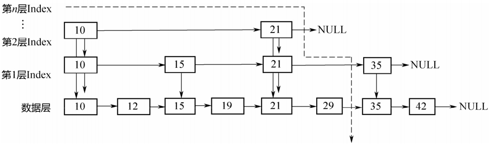

关于上面的put(...)方法，有一个关键点需要说明：在通过findPredecessor找到了待插入的元素在[b, n]之间后，并不能马上插入。因为其他线程也在操作这个链表，b、n都有可能被删除，所以在插入之前执行了一系列的检查逻辑，而这正是无锁链表的复杂之处。


> **3.2 remove(...)分析**

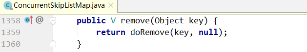

```java
// 若找到了(key, value)就删除，并返回value；找不到就返回null
final V doRemove(Object key, Object value) {
    if (key == null)
        throw new NullPointerException();
    Comparator<? super K> cmp = comparator;
    V result = null;
    Node<K,V> b;
    outer: while ((b = findPredecessor(key, cmp)) != null &&
                  result == null) {
        for (;;) {
            Node<K,V> n; K k; V v; int c;
            if ((n = b.next) == null)
                break outer;
            else if ((k = n.key) == null)
                break;
            else if ((v = n.val) == null)
                unlinkNode(b, n);
            else if ((c = cpr(cmp, key, k)) > 0)
                b = n;
            else if (c < 0)
                break outer;
            else if (value != null && !value.equals(v))
                break outer;
            else if (VAL.compareAndSet(n, v, null)) {
                result = v;
                unlinkNode(b, n);
                break; // loop to clean up
            }
        }
    }
    if (result != null) {
        tryReduceLevel();
        addCount(-1L);
    }
    return result;
}
```

上面的删除方法和插入方法瑞吉非常类似，因为无论是插入，还是删除，都要先找到元素的前驱，也就是定位到元素所在的区间[b, n]。在定位之后，执行下面几个步骤：

```
1.如果发现b、n已经被删除了，则执行对应的删除清理逻辑；
2.否则，如果没有找到待删除的(k,v)，返回null；
3.如果找到了待删除的元素，也就是节点n，则把n的value置为null，同时在n的后面加上marker节点，同时检查是否需要降低Index的层次。
```


> **3.3 get分析**

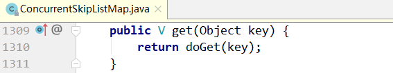

```java
private V doGet(Object key) {
    Index<K,V> q;
    VarHandle.acquireFence();
    if (key == null)
        throw new NullPointerException();
    Comparator<? super K> cmp = comparator;
    V result = null;
    if ((q = head) != null) {
        outer: for (Index<K,V> r, d;;) {
            while ((r = q.right) != null) {
                Node<K,V> p; K k; V v; int c;
                if ((p = r.node) == null || (k = p.key) == null ||
                    (v = p.val) == null)
                    RIGHT.compareAndSet(q, r, r.right);
                else if ((c = cpr(cmp, key, k)) > 0)
                    q = r;
                else if (c == 0) {
                    result = v;
                    break outer;
                }
                else
                    break;
            }
            if ((d = q.down) != null)
                q = d;
            else {
                Node<K,V> b, n;
                if ((b = q.node) != null) {
                    while ((n = b.next) != null) {
                        V v; int c;
                        K k = n.key;
                        if ((v = n.val) == null || k == null ||
                            (c = cpr(cmp, key, k)) > 0)
                            b = n;
                        else {
                            if (c == 0)
                                result = v;
                            break;
                        }
                    }
                }
                break;
            }
        }
    }
    return result;
}
```

无论是插入、删除、还是查找，都有相似的逻辑，都需要先定位到元素位置[b, n]，然后判断b、n是否已经被删除，如果是，则需要执行相应的清理逻辑。这也正是无锁链表复杂的地方。

### 5.6.2 ConcurrentSkipListSet

如下代码所示，ConcurrentSkipListSet只是对ConcurrentSkipListMap的简单封装。

```java
public class ConcurrentSkipListSet<E> extends AbstractSet<E>
        implements NavigableSet<E>, Cloneable, java.io.Serializable {    
    
    // 封装了一个ConcurrentSkipListMap
    private final ConcurrentNavigableMap<E,Object> m;    
    public ConcurrentSkipListSet() {
        m = new ConcurrentSkipListMap<E,Object>();  
    }
    public boolean add(E e) {
        return m.putIfAbsent(e, Boolean.TRUE) == null;  
    }
    // ... 
}
```


# 6 同步工具

## 6.1 Semaphore

Semaphore也就是信号量，提供了资源数量的并发访问控制，其使用代码很简单，如下所示：

```java
// 一开始有5份共享资源。第二个参数表示是否是公平 
// 公平锁排队，非公平锁竞争
Semaphore myResources = new Semaphore(5, true);

// 工作线程每获取一份资源，就在该对象上记下来
// 在获取的时候是按照公平的方式还是非公平的方式，就要看上一行代码的第二个参数了。 
// 一般非公平抢占效率较高。
myResources.acquire();

// 工作线程每归还一份资源，就在该对象上记下来 
// 此时资源可以被其他线程使用
myResources.release(); 

/*
释放指定数目的许可，并将它们归还给信标。 可用许可数加上该指定数目。
如果线程需要获取N个许可，在有N个许可可用之前，该线程阻塞。
如果线程获取了N个许可，还有可用的许可，则依次将这些许可赋予等待获取许可的其他线程。 
*/
semaphore.release(2); 

/*
从信标获取指定数目的许可。如果可用许可数目不够，则线程阻塞，直到被中断。 
该方法效果与循环相同，
for (int i = 0; i < permits; i++) acquire(); 
只不过该方法是原子操作。

如果可用许可数不够，则当前线程阻塞，直到：（二选一）
1. 如果其他线程释放了许可，并且可用的许可数满足当前线程的请求数字；
2. 其他线程中断了当前线程。

permits – 要获取的许可数 
*/
semaphore.acquire(3);
```

代码：https://gitee.com/turboYuu/concurrent-programming-2-3/tree/master/lab/turbo-concurrent-programming/demo-09-semaphore

```java
package com.turbo.concurrent.demo;

import java.util.Random;
import java.util.concurrent.Semaphore;

public class MyThread extends Thread {

    private final Semaphore semaphore;
    private final Random random = new Random();

    public MyThread(String name,Semaphore semaphore){
        super(name);
        this.semaphore = semaphore;
    }

    @Override
    public void run() {
        try {
            // 获取信标：抢座
            semaphore.acquire();
            // 抢到之后开始写作业
            System.out.println(Thread.currentThread().getName()+"-抢到了座位，开始写作业。");
            Thread.sleep(random.nextInt(1000));
            System.out.println(Thread.currentThread().getName()+"-作业写完，腾出座位。");
        } catch (InterruptedException e) {
            e.printStackTrace();
        }

        // 释放信标：腾出座位
        semaphore.release();
    }
}
```

```java
package com.turbo.concurrent.demo;

import java.util.concurrent.Semaphore;

public class Main {

    public static void main(String[] args) {
        Semaphore semaphore = new Semaphore(1);
        for (int i = 0; i < 5; i++) {
            new MyThread("学生-"+(i+1),semaphore).start();
        }
    }
}
```

如下图所示，假设有n个线程来获取Semaphore里面的10份资源（n > 10），n个线程中只有10个线程能够获取到，其他线程都会阻塞。直到有线程释放了资源，其他线程才能获取到。

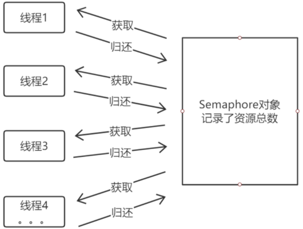

当初始化的资源个数为1时，Semaphore退化为排他锁，正因为如此，Semaphore的实现原理和锁类似，是基于AQS，有公平和非公平之分。Semaphore相关类的继承体系如下：

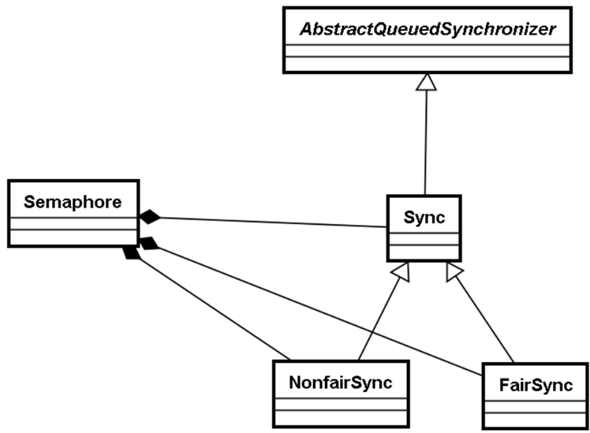

```java
public void acquire() throws InterruptedException {
    sync.acquireSharedInterruptibly(1);
}
    
public void release() {
    sync.releaseShared(1);
}
```

由于Semaphore和锁的实现原理基本相同。资源总数即state的初始值，在acquire里对state变量进行CAS减操作，减到0后，线程阻塞；在release里面对变量进行CAS操作。

```java
public abstract class AbstractQueuedSynchronizer
    extends AbstractOwnableSynchronizer
    implements java.io.Serializable {
    
    public final void acquireSharedInterruptibly(int arg)
            throws InterruptedException {
        if (Thread.interrupted())
            throw new InterruptedException();
        if (tryAcquireShared(arg) < 0)
            doAcquireSharedInterruptibly(arg);
    }
    
    public final boolean releaseShared(int arg) {
        if (tryReleaseShared(arg)) {
            doReleaseShared();
            return true;
        }
        return false;
    }
}
```

```java
public class Semaphore {

    abstract static class Sync extends AbstractQueuedSynchronizer {
        protected final boolean tryReleaseShared(int releases) {
            for (;;) {
                int current = getState();
                int next = current + releases;
                if (next < current) // overflow
                    throw new Error("Maximum permit count exceeded");
                if (compareAndSetState(current, next))
                    return true;
            }
        }
    }

    static final class FairSync extends Sync {
        private static final long serialVersionUID = 2014338818796000944L;

        FairSync(int permits) {
            super(permits);
        }

        protected int tryAcquireShared(int acquires) {
            for (;;) {
                if (hasQueuedPredecessors())
                    return -1;
                int available = getState();
                int remaining = available - acquires;
                if (remaining < 0 ||
                    compareAndSetState(available, remaining))
                    return remaining;
            }
        }
    }
}
```


```java
package java.lang.invoke;
public abstract class VarHandle {    
    // ...
    // CAS，原子操作
    public final native
    @MethodHandle.PolymorphicSignature    
    @HotSpotIntrinsicCandidate
    boolean compareAndSet(Object... args);    
    // ...
}
```


## 6.2 CountDownLatch

### 6.2.1 CountDownLatch使用场景

假设一个主线程要等待5个worker线程执行完才能退出，可以使用CountDownLatch来实现：

代码：https://gitee.com/turboYuu/concurrent-programming-2-3/tree/master/lab/turbo-concurrent-programming/demo-10-CountDownLatch

```java
package com.turbo.concurrent.demo;

import java.util.Random;
import java.util.concurrent.CountDownLatch;

public class MyThread extends Thread {
    private final CountDownLatch latch;
    private final Random random = new Random();

    public MyThread(String name,CountDownLatch latch){
        super(name);
        this.latch = latch;
    }

    @Override
    public void run() {
        try {
            Thread.sleep(random.nextInt(2000));
        } catch (InterruptedException e) {
            e.printStackTrace();
        }
        System.out.println(Thread.currentThread().getName()+"执行完毕.");
        // latch计数减一
        latch.countDown();
    }
}
```

```java
package com.turbo.concurrent.demo;

import java.util.concurrent.CountDownLatch;

public class Main {
    public static void main(String[] args) throws InterruptedException {

        CountDownLatch latch = new CountDownLatch(5);

        for (int i = 0; i < 5; i++) {
            new MyThread("线程"+(i+1),latch).start();
        }
        // main线程等待
        latch.await();
        System.out.println("main线程执行结束");
    }
}
```

下图为CountDownLatch相关类的继承层次，CountDownLatch原理和Semaphore原理类似，同样是基于AQS，不过没有公平和非公平之分。

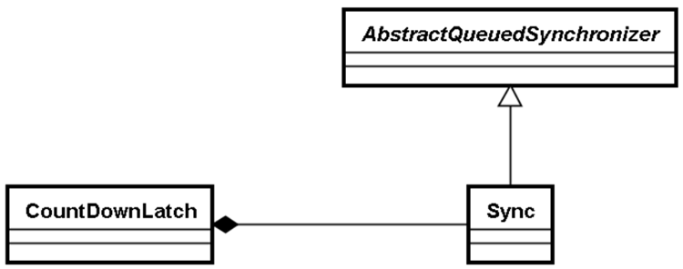


### 6.2.2 await()实现分析

如下所示，await()调用的是AQS的模板方法，CountDownLatch.Sync重新实现了tryAcquireShared方法：

```java
public void await() throws InterruptedException {
    // AQS的模板方法
    sync.acquireSharedInterruptibly(1);
}

public final void acquireSharedInterruptibly(int arg)
            throws InterruptedException {
    if (Thread.interrupted())
        throw new InterruptedException();
    // 被CountDownLatch.Sync实现   
    if (tryAcquireShared(arg) < 0)
        doAcquireSharedInterruptibly(arg);
}

protected int tryAcquireShared(int acquires) {
    return (getState() == 0) ? 1 : -1;
}
```

从tryAcquireShared(...)方法的实现看，只要state != 0，调用await()方法的线程便会被放入AQS的阻塞队列，进入阻塞状态。


### 6.2.3 countDown()实现分析

```java
public void countDown() {
    sync.releaseShared(1);
}

// AQS的模板方法
public final boolean releaseShared(int arg) {
    // 有CountDownLatch.Sync实现
    if (tryReleaseShared(arg)) {
        doReleaseShared();
        return true;
    }
    return false;
}


    protected boolean tryReleaseShared(int releases) {
        // Decrement count; signal when transition to zero
        for (;;) {
            int c = getState();
            if (c == 0)
                return false;
            int nextc = c - 1;
            if (compareAndSetState(c, nextc))
                return nextc == 0;
        }
    }
```

countDown()调用的AQS的模板方法releaseShared()，里面的tryReleaseShared(...)由CountDownLatch.Sync实现。从上面代码看，只有state=0，tryReleaseShared(...)才会返回true，然后doReleaseShared(...)，一次性唤醒队列中所有阻塞的线程。

总结：由于基于AQS阻塞队列来实现的，所以可以让多个线程都阻塞在state=0条件上，通过countDown()一直减state，减到0后一次性唤醒所有线程。

## 6.3 CyclicBarrier

### 6.3.1 CyclicBarrier使用场景

```java
CyclicBarrier barrier = new CyclicBarrier(5); 
barrier.await();
```

该类用于协调多个线程同步执行操作的场合。

代码：https://gitee.com/turboYuu/concurrent-programming-2-3/tree/master/lab/turbo-concurrent-programming/demo-11-CyclicBarrier

```java
package com.turbo.concurrent.demo;

import java.util.Random;
import java.util.concurrent.BrokenBarrierException;
import java.util.concurrent.CyclicBarrier;

public class MyThread extends Thread {

    private final CyclicBarrier barrier;
    private final Random random = new Random();

    MyThread(String name,CyclicBarrier barrier){
        super(name);
        this.barrier = barrier;
    }

    @Override
    public void run() {

        try {
            System.out.println(Thread.currentThread().getName()+" - 向公司出发");
            Thread.sleep(random.nextInt(5000));
            System.out.println(Thread.currentThread().getName()+" - 已经到达公司");
            // 等待其他线程该阶段结束
            barrier.await();

            System.out.println(Thread.currentThread().getName()+" - 开始笔试");
            Thread.sleep(random.nextInt(5000));
            System.out.println(Thread.currentThread().getName()+" - 笔试结束");
            // 等待其他线程该阶段结束
            barrier.await();

            System.out.println(Thread.currentThread().getName()+" - 开始面试");
            Thread.sleep(random.nextInt(5000));
            System.out.println(Thread.currentThread().getName()+" - 面试结束");


        } catch (InterruptedException e) {
            e.printStackTrace();
        } catch (BrokenBarrierException e) {
            e.printStackTrace();
        }
    }
}

```

```java
package com.turbo.concurrent.demo;

import java.util.concurrent.CyclicBarrier;

public class Main {

    public static void main(String[] args) {
        CyclicBarrier cyclicBarrier = new CyclicBarrier(5, new Runnable() {
            @Override
            public void run() {
                System.out.println("该阶段结束");
            }
        });

        for (int i = 0; i < 5; i++) {
            new MyThread("线程-"+(i+1),cyclicBarrier).start();
        }

    }
}
```

在整个过程中，有2个同步点：第1个同步点，要等所有应聘者都到达公司，再一起开始笔试；第2 个同步点，要等所有应聘者都结束笔试，之后一起进入面试环节。

### 6.3.2 CyclicBarrier实现原理

CyclicBarrier基于ReetrantLock+Condition实现。

```java
public class CyclicBarrier {
    private final ReentrantLock lock = new ReentrantLock();    
    // 用于线程之间相互唤醒
    private final Condition trip = lock.newCondition();    
    
    // 线程总数
    private final int parties;
    private int count;
    private Generation generation = new Generation();    
    // ...
}
```

下面详细介绍CyclicBarrier的实现原理，先看构造方法：

```java
public CyclicBarrier(int parties, Runnable barrierAction) {
    if (parties <= 0) throw new IllegalArgumentException();
    // 参与方数量
    this.parties = parties;
    this.count = parties;
    // 当所有线程被唤醒，执行barrierCommand表示Runnable
    this.barrierCommand = barrierAction;
}
```

接下来看一下await()方法的实现过程：

```java
public int await() throws InterruptedException, BrokenBarrierException {
    try {
        return dowait(false, 0L);
    } catch (TimeoutException toe) {
        throw new Error(toe); // cannot happen
    }
}

private int dowait(boolean timed, long nanos)
        throws InterruptedException, BrokenBarrierException,
               TimeoutException {
    final ReentrantLock lock = this.lock;
    lock.lock();
    try {
        final Generation g = generation;

        if (g.broken)
            throw new BrokenBarrierException();
        // 响应中断
        if (Thread.interrupted()) {
            // 唤醒所有阻塞的线程
            breakBarrier();
            throw new InterruptedException();
        }

        // 每个线程调用一次await()，count都要减1
        int index = --count;
        // 当count减到0时，此线程唤醒其他所有线程
        if (index == 0) {  // tripped
            boolean ranAction = false;
            try {
                final Runnable command = barrierCommand;
                if (command != null)
                    command.run();
                ranAction = true;
                nextGeneration();
                return 0;
            } finally {
                if (!ranAction)
                    breakBarrier();
            }
        }

        // loop until tripped, broken, interrupted, or timed out
        for (;;) {
            try {
                if (!timed)
                    trip.await();
                else if (nanos > 0L)
                    nanos = trip.awaitNanos(nanos);
            } catch (InterruptedException ie) {
                if (g == generation && ! g.broken) {
                    breakBarrier();
                    throw ie;
                } else {
                    // We're about to finish waiting even if we had not
                    // been interrupted, so this interrupt is deemed to
                    // "belong" to subsequent execution.
                    Thread.currentThread().interrupt();
                }
            }

            if (g.broken)
                throw new BrokenBarrierException();

            if (g != generation)
                return index;

            if (timed && nanos <= 0L) {
                breakBarrier();
                throw new TimeoutException();
            }
        }
    } finally {
        lock.unlock();
    }
}

private void breakBarrier() {
    generation.broken = true;
    count = parties;
    trip.signalAll();
}

private void nextGeneration() {
    // signal completion of last generation
    trip.signalAll();
    // set up next generation
    count = parties;
    generation = new Generation();
}
```

上面方法的说明;

1. CyclicBarrier是可以被重用的。以上应聘场景为例，来了10个线程，这10个线程互相等待，到期后一起被唤醒，各自执行接下来的逻辑。然后，这10个线程继续互相等待，到齐后再一起被唤醒。每一轮被称为一个Generation，就是一次同步点。
2. CyclicBarrier会响应中断。10个线程没有到齐，如果有线程收到中断信号，所有阻塞的线程也会被唤醒，就是上面的breakBarrier()方法。然后count被重置为初始值（parties），重新开始。
3. 上面的回调方法，barrierAction只会被第10个线程执行1次（在唤醒其他9个线程之前），而不是10个线程每个都执行1次。

## 6.4 Exchanger

### 6.4.1 使用场景

Exchanger用于线程之间交换数据，其使用代码很简单，是一个exchange(...)方法，使用示例如下：

```java
package com.turbo.concurrent.demo;

import java.util.Random;
import java.util.concurrent.Exchanger;

public class Main {
    private static final Random random = new Random();

    public static void main(String[] args) {
        // 建一个多线程共用的exchange对象
        // 把exchange对象传给3个线程对象。每个线程在自己的run方法中调用exchange，把自己的数据作为参数
        // 传递进去，返回值是另外一个线程调用exchange传进去的参数
        Exchanger<String> exchanger = new Exchanger<>();

        new Thread("线程1"){
            @Override
            public void run() {
                while (true){
                    try {
                        final String otherData = exchanger.exchange("交换数据1");
                        System.out.println(Thread.currentThread().getName() + "得到 <==" +otherData);
                        Thread.sleep(random.nextInt(2000));
                    } catch (InterruptedException e) {
                        e.printStackTrace();
                    }

                }
            }
        }.start();

        new Thread("线程2"){
            @Override
            public void run() {
                while (true){
                    try {
                        final String otherData = exchanger.exchange("交换数据2");
                        System.out.println(Thread.currentThread().getName() + "得到 <==" +otherData);
                        Thread.sleep(random.nextInt(2000));
                    } catch (InterruptedException e) {
                        e.printStackTrace();
                    }
                }
            }
        }.start();

        new Thread("线程3"){
            @Override
            public void run() {
                while (true){
                    try {
                        final String otherData = exchanger.exchange("交换数据3");
                        System.out.println(Thread.currentThread().getName() + "得到 <==" +otherData);
                        Thread.sleep(random.nextInt(2000));
                    } catch (InterruptedException e) {
                        e.printStackTrace();
                    }
                }
            }
        }.start();
    }
}
```

在上面的例子中，3个线程并发的调用exchange(...)，会凉凉交互数据，如1/2、1/3、2/3。

### 6.4.2 实现原理

Exchanger的核心机制和Lock一样，也是CAS+park/unpark。

首先，在Exchanger内部，有两个内部类：Participant和Node，代码如下：

```java
// 添加了Contended注解，表示伪共享与缓存填充
@jdk.internal.vm.annotation.Contended static final class Node {
    int index;              // Arena index
    int bound;              // Last recorded value of Exchanger.bound
    int collides;           // 本次绑定中，CAS操作失败次数
    int hash;               // 自旋伪随机
    Object item;            // 本线程要交换的数据
    volatile Object match;  // 对方线程交换来的数据
    // 当前线程
    volatile Thread parked; // 当前线程阻塞的时候设置该属性，不阻塞为null
}
    
static final class Participant extends ThreadLocal<Node> {
    public Node initialValue() { return new Node(); }
}
```

每个线程在调用exchange(...)方法交换数据的时候，会先创建一个Node对象。

这个Node对象就是对该线程的包装，里面包含了3个重要字段：第一个是该线程要交换的数据，第二个是对方线程交换来的数据，最会一个是该线程本身。

一个Node只能支持2个线程之间交换数据，要实现多个线程并行的交换数据，需要多个Node，因此Exchanger里面定义了Node数组：

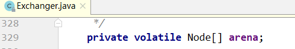

### 6.4.3 exchange(V x)实现分析

明白了大致思路，下面来看exchange(V x)方法的详细实现：

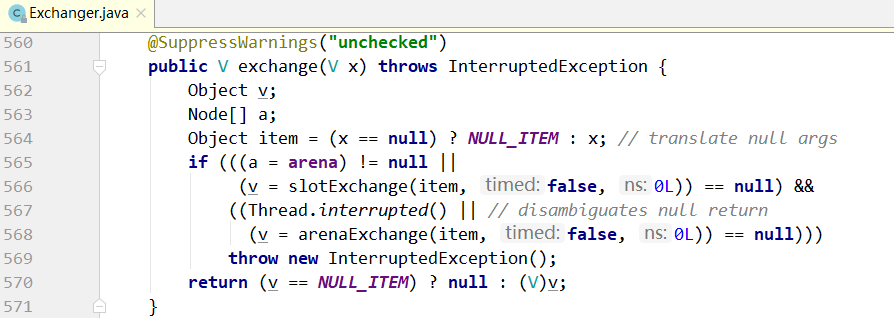

上面方法中，如果arena不是null，表示启用了arena方式交换数据。如果arena不是null，并且线程被中断，则抛异常。

如果arena不是null，并且arenaExchange的返回值为null，则抛异常。对方线程交换来的null值是封装为NULL_ITEM对象的，而不是null。

如果slotExchange的返回值是null，并且线程被中断，则抛异常。

如果slotExchange的返回值是null，并且arenaExchange的返回值是null，则抛异常。


slotExchange的实现：

```java
/**
     * Exchange function used until arenas enabled. See above for explanation.
     * 如果不启用arena，则使用该方法进行线程间数据交换
     * @param item 需要交换的数据
     * @param timed 是否计时等待，true表示是计时等待
     * @param ns 如果计时等待，该值表示最大等待的时长
     * @return 对方线程交换来的数据；如果等待超时或线程中断，或者启用了arena，则返回null
     */
private final Object slotExchange(Object item, boolean timed, long ns) {
        // participant在初始化的时候这只初始值为new Node()
        // 获取本线程要交换的数据节点
        Node p = participant.get();
        // 获取当先线程
        Thread t = Thread.currentThread();
        // 如果线程被中断，则返回null
        if (t.isInterrupted()) // preserve interrupt status so caller can recheck
            return null;

        for (Node q;;) {
            // 如果slot非空，表明有其他线程在等待该线程交换数据
            if ((q = slot) != null) {
                // CAS操作，将当前线程的slot由slot设置为null
                // 如果操作成功，则执行if中的语句
                if (SLOT.compareAndSet(this, q, null)) {
                    // 获取对方线程交换来的数据
                    Object v = q.item;
                    // 设置要交换的数据
                    q.match = item;
                    // 获取q中阻塞的线程对象
                    Thread w = q.parked;
                    if (w != null)
                        // 如果对方阻塞的线程非空，则唤醒阻塞的线程
                        LockSupport.unpark(w);
                    return v;
                }
                // create arena on contention, but continue until slot null
                // 创建arena用于处理多个线程需要交换数据的场合，防止slot冲突
                if (NCPU > 1 && bound == 0 &&
                    BOUND.compareAndSet(this, 0, SEQ))
                    arena = new Node[(FULL + 2) << ASHIFT];
            }
            // 如果arena不是null，需要调用者调用arenaExchange方法接着获取对方线程交换来的数据
            else if (arena != null)
                return null; // caller must reroute to arenaExchange
            else {
                // 如果slot为null，表示对方没有线程等待该线程交换数据
                // 设置要交换的本方数据
                p.item = item;
                // 设置当前线程要交换的数据到slot
                // CAS操作，如果设置失败，则进入下一轮for循环
                if (SLOT.compareAndSet(this, null, p))
                    break;
                p.item = null;
            }
        }

        // await release
        // 没有对方线程等待交换数据，将当前线程要交换的数据放到slot中，是一个Node对象
        // 然后阻塞，等待唤醒
        int h = p.hash;
        // 如果是计时等待交换，则计算超时时间；否则设置为0
        long end = timed ? System.nanoTime() + ns : 0L;
        // 如果CPU核心数大于1，则使用SPINS数，自旋；否则为1，没有必要自旋。
        int spins = (NCPU > 1) ? SPINS : 1;
        Object v;
        while ((v = p.match) == null) {
            if (spins > 0) {
                h ^= h << 1; h ^= h >>> 3; h ^= h << 10;
                if (h == 0)
                    h = SPINS | (int)t.getId();
                else if (h < 0 && (--spins & ((SPINS >>> 1) - 1)) == 0)
                    Thread.yield();
            }
            else if (slot != p)
                spins = SPINS;
            else if (!t.isInterrupted() && arena == null &&
                     (!timed || (ns = end - System.nanoTime()) > 0L)) {
                p.parked = t;
                if (slot == p) {
                    if (ns == 0L)
                        LockSupport.park(this);
                    else
                        LockSupport.parkNanos(this, ns);
                }
                p.parked = null;
            }
            else if (SLOT.compareAndSet(this, p, null)) {
                v = timed && ns <= 0L && !t.isInterrupted() ? TIMED_OUT : null;
                break;
            }
        }
        MATCH.setRelease(p, null);
        p.item = null;
        p.hash = h;
        return v;
    }
```


arenaExchange的实现：

```java
/**
     * Exchange function when arenas enabled. See above for explanation.
     * 当启用arenas时，使用该方法进行线程间的数据交换
     * @param item 本线程要交换的非null数据
     * @param timed 如果需要计时等待，则设置为true
     * @param ns 表示计时等待的最大时长
     * @return 对方线程交换来的数据。如果线程被中断，或者等待超时，则返回null
     */
private final Object arenaExchange(Object item, boolean timed, long ns) {
        Node[] a = arena;
        int alen = a.length;
        Node p = participant.get();
        for (int i = p.index;;) {                      // access slot at i
            int b, m, c;
            int j = (i << ASHIFT) + ((1 << ASHIFT) - 1);
            if (j < 0 || j >= alen)
                j = alen - 1;
            Node q = (Node)AA.getAcquire(a, j);
            if (q != null && AA.compareAndSet(a, j, q, null)) {
                Object v = q.item;                     // release
                q.match = item;
                Thread w = q.parked;
                if (w != null)
                    LockSupport.unpark(w);
                return v;
            }
            else if (i <= (m = (b = bound) & MMASK) && q == null) {
                p.item = item;                         // offer
                if (AA.compareAndSet(a, j, null, p)) {
                    long end = (timed && m == 0) ? System.nanoTime() + ns : 0L;
                    Thread t = Thread.currentThread(); // wait
                    for (int h = p.hash, spins = SPINS;;) {
                        Object v = p.match;
                        if (v != null) {
                            MATCH.setRelease(p, null);
                            p.item = null;             // clear for next use
                            p.hash = h;
                            return v;
                        }
                        else if (spins > 0) {
                            h ^= h << 1; h ^= h >>> 3; h ^= h << 10; // xorshift
                            if (h == 0)                // initialize hash
                                h = SPINS | (int)t.getId();
                            else if (h < 0 &&          // approx 50% true
                                     (--spins & ((SPINS >>> 1) - 1)) == 0)
                                Thread.yield();        // two yields per wait
                        }
                        else if (AA.getAcquire(a, j) != p)
                            spins = SPINS;       // releaser hasn't set match yet
                        else if (!t.isInterrupted() && m == 0 &&
                                 (!timed ||
                                  (ns = end - System.nanoTime()) > 0L)) {
                            p.parked = t;              // minimize window
                            if (AA.getAcquire(a, j) == p) {
                                if (ns == 0L)
                                    LockSupport.park(this);
                                else
                                    LockSupport.parkNanos(this, ns);
                            }
                            p.parked = null;
                        }
                        else if (AA.getAcquire(a, j) == p &&
                                 AA.compareAndSet(a, j, p, null)) {
                            if (m != 0)                // try to shrink
                                BOUND.compareAndSet(this, b, b + SEQ - 1);
                            p.item = null;
                            p.hash = h;
                            i = p.index >>>= 1;        // descend
                            if (Thread.interrupted())
                                return null;
                            if (timed && m == 0 && ns <= 0L)
                                return TIMED_OUT;
                            break;                     // expired; restart
                        }
                    }
                }
                else
                    p.item = null;                     // clear offer
            }
            else {
                if (p.bound != b) {                    // stale; reset
                    p.bound = b;
                    p.collides = 0;
                    i = (i != m || m == 0) ? m : m - 1;
                }
                else if ((c = p.collides) < m || m == FULL ||
                         !BOUND.compareAndSet(this, b, b + SEQ + 1)) {
                    p.collides = c + 1;
                    i = (i == 0) ? m : i - 1;          // cyclically traverse
                }
                else
                    i = m + 1;                         // grow
                p.index = i;
            }
        }
    }
```


## 6.5 Phaser

### 6.5.1 用Phaser替代CyclicBarrier和CountDownLatch

从JDK7开始，新增了一个同步工具类Phaser，其功能比CyclicBarrier和CountDownLatch更加强大。

> **1.用Phaser替代CountDownLatch**

在CountDownLatch中，主要是2个方法：await()和countDown()。在Phaser中，与之对应的方法是awaitAdvance(int n)和arrive()。

```java
package com.turbo.concurrent.demo;

import java.nio.file.attribute.UserPrincipal;
import java.time.Year;
import java.util.Random;
import java.util.concurrent.Phaser;
import java.util.concurrent.atomic.AtomicIntegerFieldUpdater;

public class Main {
    public static void main(String[] args) {

        Phaser phaser = new Phaser(5);
        for (int i = 0; i < 5; i++) {
            new Thread("线程-"+(i+1)){
                private final Random random = new Random();

                @Override
                public void run() {
                    System.out.println(getName()+" - 开始运行");
                    try {
                        Thread.sleep(random.nextInt(1000));
                    } catch (InterruptedException e) {
                        e.printStackTrace();
                    }
                    System.out.println(getName() + " - 运行结束");
                    phaser.arrive();
                }
            }.start();
        }
        System.out.println("线程启动完毕");
        System.out.println(phaser.getPhase());
        phaser.awaitAdvance(0);
        System.out.println("线程运行结束");
    }
}
```


> **2.用Phaser代替CyclicBarrier**

```java
package com.turbo.concurrent.demo;

import java.util.concurrent.Phaser;

public class Main1 {
    public static void main(String[] args) {

        Phaser phaser = new Phaser(5);
        for (int i = 0; i < 5; i++) {
            new MyThread("线程-"+(i+1),phaser).start();
        }
        phaser.awaitAdvance(0);
        System.out.println("线程运行结束");
    }
}
```

```java
package com.turbo.concurrent.demo;

import java.util.Random;
import java.util.concurrent.Phaser;

public class MyThread extends Thread {

    private final Phaser phaser;
    private final Random random = new Random();

    MyThread(String name,Phaser phaser){
        super(name);
        this.phaser = phaser;
    }

    @Override
    public void run() {
        System.out.println(getName() + " - 开始向公司出发");
        slowly();
        System.out.println(getName() + " - 已经到达公司");
        // 到达同步点，等待其他线程
        phaser.arriveAndAwaitAdvance();

        System.out.println(getName() + " - 开始笔试");
        slowly();
        System.out.println(getName() + " - 笔记结束");
        // 到达同步点，等待其他线程
        phaser.arriveAndAwaitAdvance();


        System.out.println(getName() + " - 开始面试");
        slowly();
        System.out.println(getName() + " - 面试结束");
    }

    private void slowly() {
        try {
            Thread.sleep(random.nextInt(1000));
        } catch (InterruptedException e) {
            e.printStackTrace();
        }
    }
}
```

arriveAndAwaitAdvance()就是arrive()与awaitAdvance(int)的组合，表示“我自己已到达这个同步点，同时要等待所有人都到达这个同步点，然后再一起前行”。

### 6.5.2 Phaser新特性

> **特性1：动态调整线程个数**

CyclicBarrier所要同步的线程个数是在构造方法中指定的，之后不能修改。而Phaser可以再运行期间动态的调整要同步的线程个数。Phaser提供了下面这些方法来增加、减少所要同步的线程个数。

```
register() // 注册一个
bulkRegister(int parties) // 注册多个
arriveAndDeregister() // 解除注册
```


> **特性2：层次Phaser**

多个Phaser可以组成如下图所示的树状结构，可以通过在构造方法中传入父Phaser来实现。

```java
public Phaser(Phaser parent, int parties) {
	//...
}
```

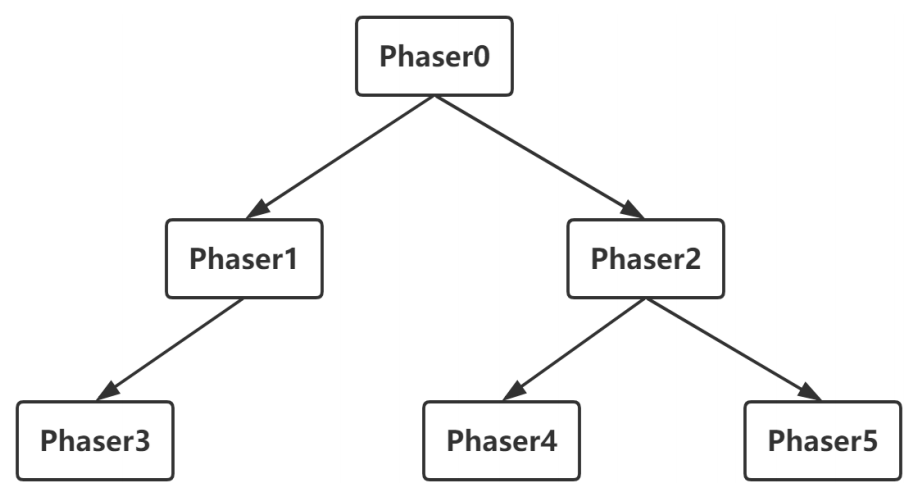

先简单看一下Phaser内部关于树状结构的存储，如下所示：

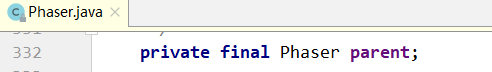

可以发现，在Phaser的内部结构中，每个Phaser记录了自己的父节点，但没有记录自己的子节点列表。所以，每个Phaser知道自己的父节点是谁，但父节点并不知道自己有多少子节点，对父节点的操作，是通过子节点来实现的。


树状的Phaser怎么使用？

```java
Phaser root = new Phaser(2);
Phaser c1 = new Phaser(root, 3);
Phaser c2 = new Phaser(root, 2);
Phaser c3 = new Phaser(c1, 0);
```

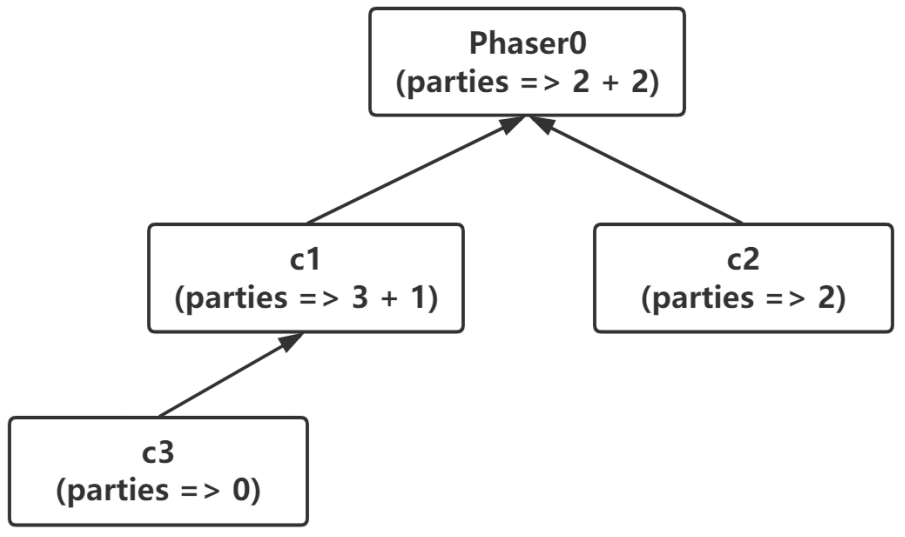

本来root有两个参与者，然后为其加入了两个子Phaser(c1, c2)，每个子Phaser会算作1个参与者，root的参与者就变成2+2=4个。c1本来有3个参与者，为其加入了一个子Phaser c3，参与者数量编程3+1=4个。c3的参与者初始为0.后续可以通过调用register()方法加入。

会与树状Phaser上的每个检点来说，可以当作一个独立的Phaser来看待，其运作机制和一个单独的Phaser是一样的。

父Phaser并不用感知子Phaser的存在，当子Phaser中注册的参与者数量大于0时，会把自己向父节点注册；当子Phaser中注册的参与者数量等于0时，会自动向父节点解除注册。父Phaser把子Phaser当作一个正常参与的线程。


### 6.5.3 state变量解析

Phaser没有基于AQS来实现，但具备AQS的核心特性：state变量、CAS操作、阻塞队列。先从state变量说起。

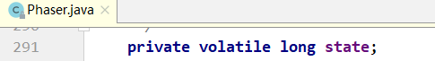

这个64位的state变量被拆成4部分，下图为state变量各部分：

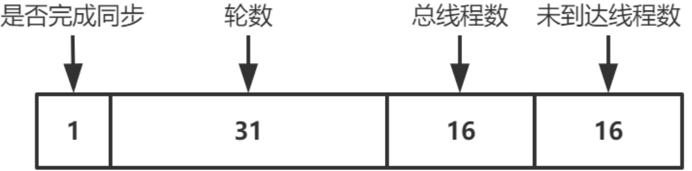

最高位0表示未同步，1表示同步完成，初始最高位为0。


Phaser提供了一些列的成员方法来从state中获取上图中的几个数字，如下所示：

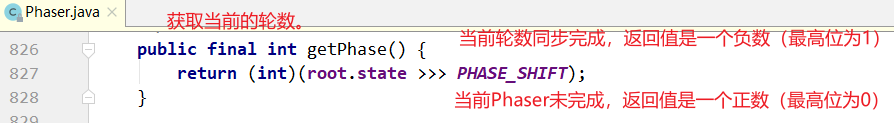

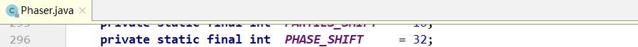


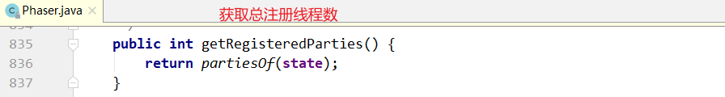

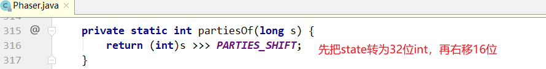

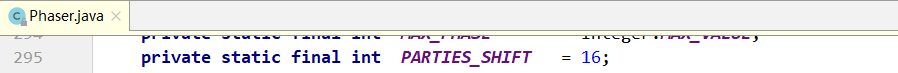

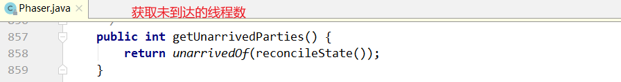


下面看一下state变量再狗仔方法中是如何被赋值的。

```java
public Phaser(Phaser parent, int parties) {
    if (parties >>> PARTIES_SHIFT != 0)
        // 如果parties数超出了最大个数（2的16次方），抛异常
        throw new IllegalArgumentException("Illegal number of parties");
    // 初始化轮数为0
    int phase = 0;
    this.parent = parent;
    if (parent != null) {
        final Phaser root = parent.root;
        // 父节点个根节点就是自己的根节点
        this.root = root;
        // 父节点的evenQ就是自己的evenQ
        this.evenQ = root.evenQ;
        // 父节点的oddQ就是自己的oddQ
        this.oddQ = root.oddQ;
        // 如果参与者不是0，则向附加点注册自己
        if (parties != 0)
            phase = parent.doRegister(1);
    }
    else {
        // 如果父节点为null,则自己就是root节点
        this.root = this;
        // 创建奇数节点
        this.evenQ = new AtomicReference<QNode>();
        // 创建偶数节点
        this.oddQ = new AtomicReference<QNode>();
    }
    this.state = (parties == 0) ? (long)EMPTY :
        ((long)phase << PHASE_SHIFT) |     // 位或操作，赋值state。最高位为0，表示同步未完成
        ((long)parties << PARTIES_SHIFT) |
        ((long)parties);
}
```


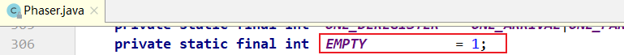

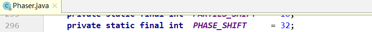

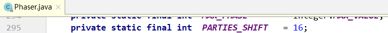

当parties=0时，state被赋予一个EMPTY常量，常量为1；

当parties != 0时，把phaser值左移32位；把parties左移16位；然后parties也作为最低的16位，3个值做或操作，赋值给state。

### 6.5.4 阻塞与唤醒（Treiber Stack）

基于上述的state变量，对其进行CAS操作，并进行相应的阻塞与唤醒。如下图所示，右边的主线程会调用awaitAdvance()进行阻塞；左边的arrive()会对state进行CAS的雷减操作，当未到达的线程数减到0，唤醒右边阻塞的主线程。

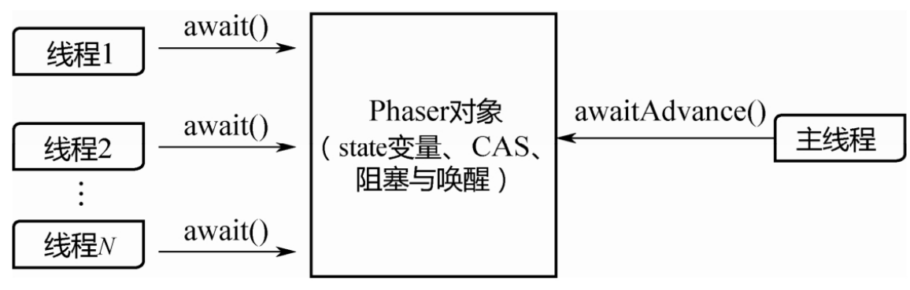

在这里，阻塞使用的是一个称为Treiber Stack的数据结构，而不是AQS的双向链表。Treiber Stack是一个无锁的栈，他是一个单向链表，出栈、入栈都在链表头部，所以只需要一个head指针，而不需要tail指针，如下：

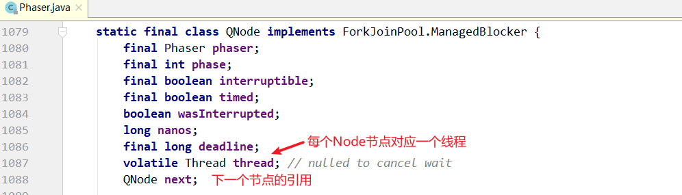

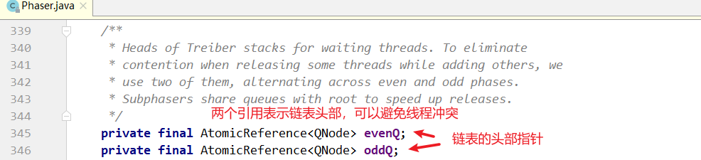


为了减少并发冲突，这里定义了2个链表，也就是2个Treiber Stack。当phase为奇数轮的时候，阻塞线程放在oddQ里面；当phase为偶数轮的时候，阻塞线程放在evenQ里面。代码如下：

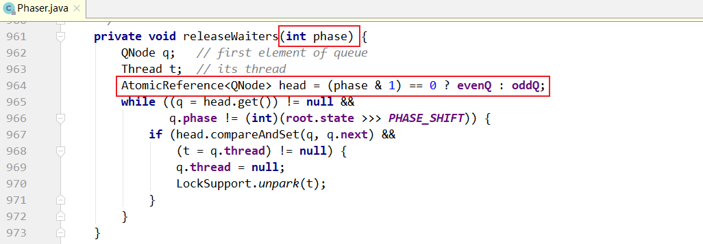

### 6.5.5. arrive()方法分析

arrive()方法是如何对state变量进行操作，又是如何唤醒线程的。

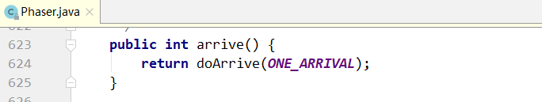

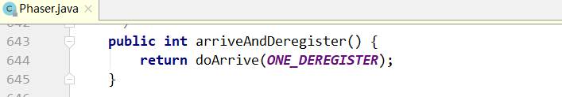

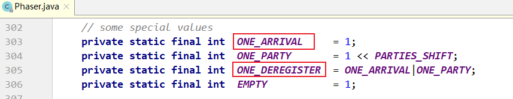

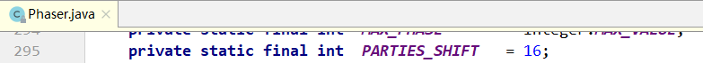


arrive()和arriveAndDeregister()内部调用的都是doArrive(boolean)方法。

区别在于前者只是把“未达到线程数”减1；后者则把“未到达线程数”和“下一轮的总线程数”都减1。doArrive(boolean)方法的实现。

```java
private int doArrive(int adjust) {
    final Phaser root = this.root;
    for (;;) {
        long s = (root == this) ? state : reconcileState();
        int phase = (int)(s >>> PHASE_SHIFT);
        if (phase < 0)
            return phase;
        int counts = (int)s;
        // 获取未到达线程数
        int unarrived = (counts == EMPTY) ? 0 : (counts & UNARRIVED_MASK);
        // 如果未到达线程数小于等于0，抛异常。
        if (unarrived <= 0)
            throw new IllegalStateException(badArrive(s));
        // CAS操作，将state的值减去adjust
        if (STATE.compareAndSet(this, s, s-=adjust)) {
            // 如果未达到线程为1
            if (unarrived == 1) {
                long n = s & PARTIES_MASK;  // base of next state
                int nextUnarrived = (int)n >>> PARTIES_SHIFT;
                if (root == this) {
                    if (onAdvance(phase, nextUnarrived))
                        n |= TERMINATION_BIT;
                    else if (nextUnarrived == 0)
                        n |= EMPTY;
                    else
                        n |= nextUnarrived;
                    int nextPhase = (phase + 1) & MAX_PHASE;
                    n |= (long)nextPhase << PHASE_SHIFT;
                    STATE.compareAndSet(this, s, n);
                    releaseWaiters(phase);
                }
                // 如果下一轮的未到达线程数为0
                else if (nextUnarrived == 0) { // propagate deregistration
                    phase = parent.doArrive(ONE_DEREGISTER);
                    STATE.compareAndSet(this, s, s | EMPTY);
                }
                else
                    // 否则调用父节点doArrive方法，传递参数1，表示当前节点已完成
                    phase = parent.doArrive(ONE_ARRIVAL);
            }
            return phase;
        }
    }
}
```

关于方面的方法，有以下几点说明：

> 1.定义了2个常量

当deregister = false 时，只有最低的16位需要减1，adj=ONE_ARRIVAL；当deregister=true时，低32位中的2个16位都需要减1，adj=ONE_ARRIVAL|ONE_PARTY。

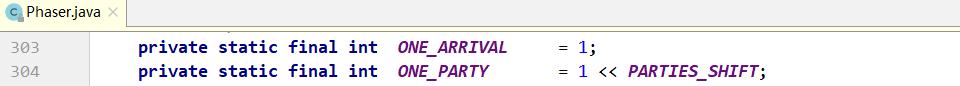

> 2.把未到达线程数减1。

减了之后，如果还未到0，什么都不做，直接返回。如果到0，会做2件事：**第一**，重置state，把state的未到达线程个数重置到总的注册的线程数中，同时phase加1；**第二**，唤醒队列中的线程。

唤醒方法：

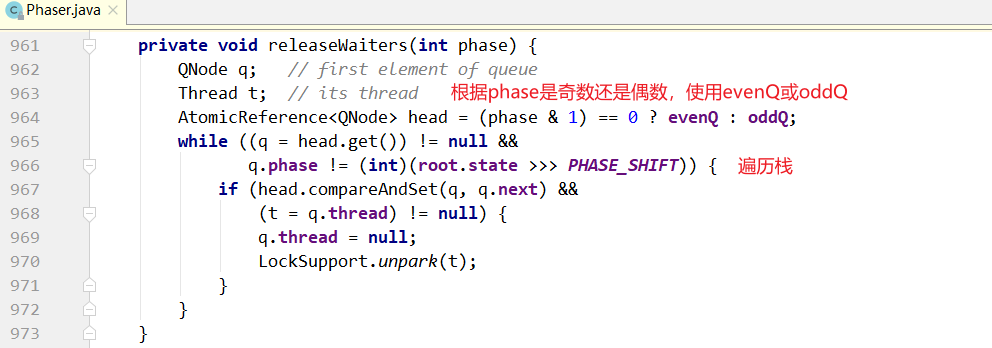

遍历整个栈，只要栈当中节点的phase不等于当前Phaser的phase，说明该节点不是当前轮的，而是前一轮的，应该被释放并唤醒。

### 6.5.6 awaitAdvance()方法分析


下面的while循环中有4个分支：

初始的时候，node==null，进入第一个分支进行自旋，自旋次数满足之后，会新建一个QNode节点；

之后执行第3、第4个分支，分别把该节点入栈并阻塞。

```java
private int internalAwaitAdvance(int phase, QNode node) {
    // assert root == this;
    releaseWaiters(phase-1);          // ensure old queue clean
    boolean queued = false;           // true when node is enqueued
    int lastUnarrived = 0;            // to increase spins upon change
    int spins = SPINS_PER_ARRIVAL;
    long s;
    int p;
    while ((p = (int)((s = state) >>> PHASE_SHIFT)) == phase) {
        if (node == null) {           // 不可中断模式的自旋
           int unarrived = (int)s & UNARRIVED_MASK;
            if (unarrived != lastUnarrived &&
                (lastUnarrived = unarrived) < NCPU)
                spins += SPINS_PER_ARRIVAL;
            boolean interrupted = Thread.interrupted();
            if (interrupted || --spins < 0) { // 自旋结束，建一个节点，之后进入阻塞
                node = new QNode(this, phase, false, false, 0L);
                node.wasInterrupted = interrupted;
            }
            else
                Thread.onSpinWait();
        }
        else if (node.isReleasable()) // 从阻塞唤醒，退出while循环
            break;
        else if (!queued) {           // push onto queue
            AtomicReference<QNode> head = (phase & 1) == 0 ? evenQ : oddQ;
            QNode q = node.next = head.get();
            if ((q == null || q.phase == phase) &&
                (int)(state >>> PHASE_SHIFT) == phase) // avoid stale enq
                queued = head.compareAndSet(q, node);  // 节点入栈
        }
        else {
            try {
                ForkJoinPool.managedBlock(node);  // 调用node.block()阻塞
            } catch (InterruptedException cantHappen) {
                node.wasInterrupted = true;
            }
        }
    }

    if (node != null) {
        if (node.thread != null)
            node.thread = null;       // avoid need for unpark()
        if (node.wasInterrupted && !node.interruptible)
            Thread.currentThread().interrupt();
        if (p == phase && (p = (int)(state >>> PHASE_SHIFT)) == phase)
            return abortWait(phase); // possibly clean up on abort
    }
    releaseWaiters(phase);
    return p;
}
```

这里调用了ForkJoinPool.managedBlock(ManagedBlocker blocker)方法，目的是把node对应的线程阻塞。ManagedBlocker时ForkJoinPool里面的一个接口，定义如下：

```java
public static interface ManagedBlocker {
    boolean block() throws InterruptedException;
    boolean isReleasable();
}
```

QNode实现了该接口，实现原理还是park()，如下所示。之所以没有直接使用park()/unpark()来实现阻塞、唤醒，而是封装了ManagedBlocker这一层，主要是处于使用上的方便考虑。一方面是park()可能被中断唤醒，另一方面是带超时时间的park()，把这二者都封装在一起。

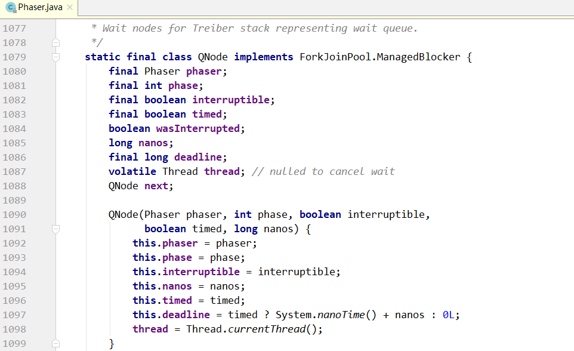

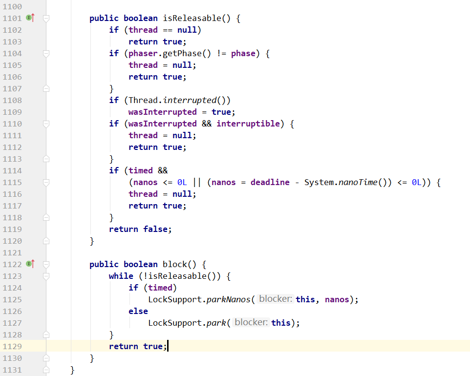

理解了arrive()和awaitAdvance()，arriveAndAwaitAdvance()就是二者的一个组合版本。

# 7 Atomic类

## 7.1 AtomicInteger和AtomicLong

对于一个整数的加键操作，要保证线程安全，需要加锁，也就是加synchronized关键字。

```java
public class MyClass {    
    private int count = 0;
    public void synchronized increment() {        
        count++;
    }
    public void synchronized decrement() {        
        count--;
    }
}
```

但有了Concurrent包的Atomic相关类之后，synchronized关键字可以用AtomicInteger代替，其性能更好，对应的代码变为：

```java
public class MyClass {
    private AtomicInteger count = new AtomicInteger(0);    
    public void add() {
        count.getAndIncrement();  
    }
    public long minus() {
        count.getAndDecrement();  
    }
}
```

其对应的源码如下：

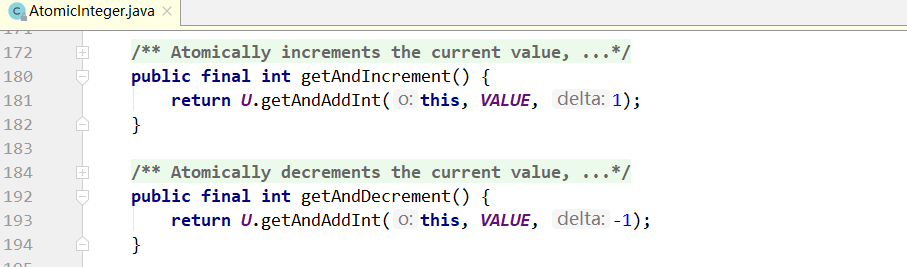

上图中的U是Unsafe的对象：

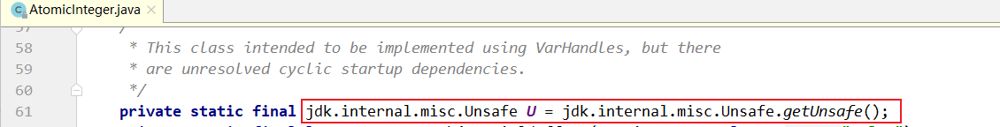

AtomicInteger的`getAndIncrement()`方法和`getAndDecrement()`方法都调用了这一个方法：`U.getAndAddInt(...)`方法，该方法基于CAS实现：

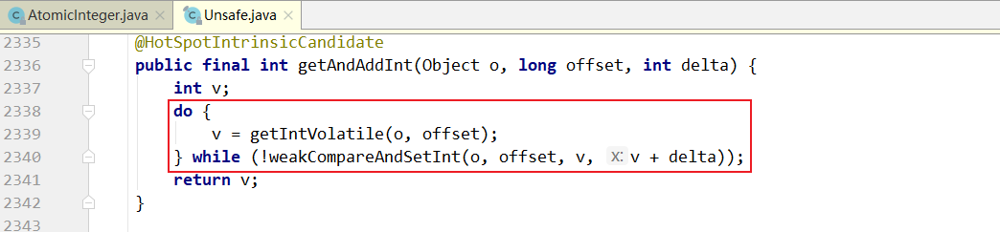

do-while循环直到判断条件返回true为止。该操作称为**自旋**。

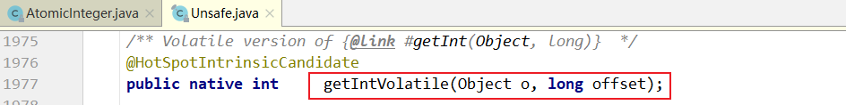

`getAndAddInt`方法具有volatile语义，也就是说对所有线程都是同时可见的。

而`weakCompareAndSetInt`方法的实现：

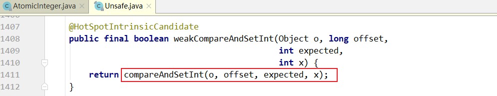

调用了`compareAndSetInt`方法，该方法的实现：

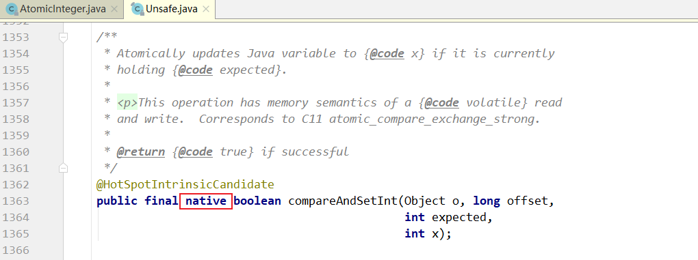

上图中的方法中：

- 第一个参数表示要修改哪个对象的属性值；
- 第二个参数是该对象属性在内存的偏移量；
- 第三个参数表示期望值；
- 第四个参数表示要设置为的目标值。

> 源码简单，重要的是其中的设计思想。

### 7.1.1 悲观锁与乐观锁

对于悲观锁，认为数据发生并发冲突的概率很大，读操作之前就上锁。synchronized关键字，ReentrantLock都是悲观锁的典型。

对于乐观锁，认为数据方生并发冲突的概率小，读操作之前不上锁。等到写操作的时候，再判断数据在此期间是否被其他线程修改了。如果被其他线程修改了，就把数据重新读出来，重复该过程；如果没有被修改，就写回去。判断数据是否被修改，同时写回新值，这两个操作要合成一个原子操作，也就是CAS（Compare And Set）。

> AtomicInteger的实现就是典型的乐观锁。

### 7.1.2 Unsafe 的 CAS详解

Unsafe类是整个Concurrent包的基础，里面所有方法都是native的。具体到上面提到的`compareAndSetInt`方法，即


要特别说明一下第二个参数，它是一个long型的整形，经常被称为xxxOffset，意思是让某个成员变量在对应的类中内存偏移量（该变量在内存中的位置），表示该成员变量本身。

第二个参数的值为AtomicInteger中的属性VALUE：

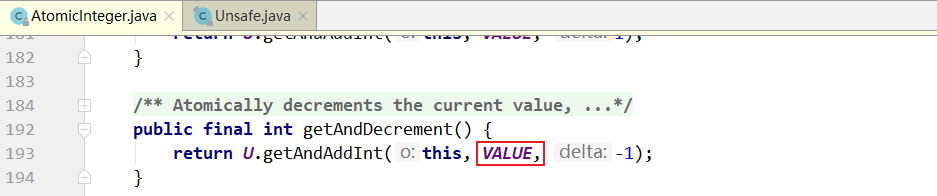

VALUE的值：

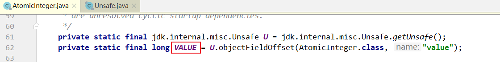

而Unsafe的`objectFieldOffset(...)`方法调用，就是为了找到AtomicInteger类中value属性所在的内存偏移量。

objectFieldOffset方法的实现：

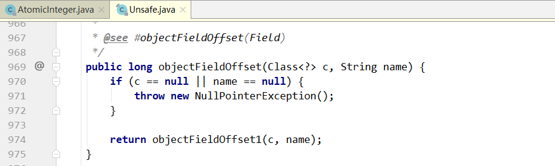

其中objectFieldOffset1的实现为：

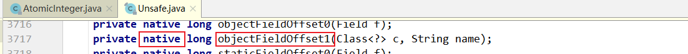

所有调用CAS的地方，都会先通过这个方法把成员变量转换成一个Offset。以AtomicInteger为例：


从上面的代码可以看出，无论是Unsafe还是VALUE，都是静态的，也就是类级别的，所有对象公用的。

此时的VALUE就代表value变量本身，后面执行CAS操作的时候，不是直接操作value，而是操作VALUE。

### 7.1.3 自旋与阻塞

当一个线程拿不到锁的时候，有以下两种基本等待策略：

- 策略1：放弃CPU，进入阻塞状态，等待后续被唤醒，再重新被操作系统调度。
- 策略2：不放弃CPU，空转，不断重试，也就是所谓的“自旋”。

显然，如果是单核CPU，只能用策略1。但对于多CPU或者多核，策略2就很有用了，因为没有线程切换的开销。

**AtomicInteger的实现使用“自旋”策略，如果拿不到锁，就会一直重试**

注意：以上两种策略并不互斥，可以结合使用。如果获取不到锁，先自旋；如果自旋还拿不到锁，再阻塞，synchronized关键字就是这样的实现策略。

除了AtomicInteger，AtomicLong也是同样的原理。

## 7.2 AtomicBoolean和AtomicReference

### 7.2.1 为什么需要AtomicBoolean

因为往往要实现下面这种功能：

```java
if (!flag) {    
    flag = true;    
    // ...
}
// 或者更清晰一点的： 
if (flag == false) {
    flag = true;
    // ...
}
```

也就是要实现compare和set两个操作在一起的原子性，而这也正是CAS提供的功能。上面的代码，就变成：

```java
if (compareAndSet(false, true)) {    
    // ...
}
```

同样的，AtomicReference也需要同样的功能，对应的方法如下：

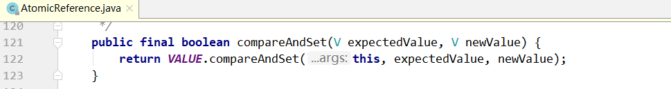

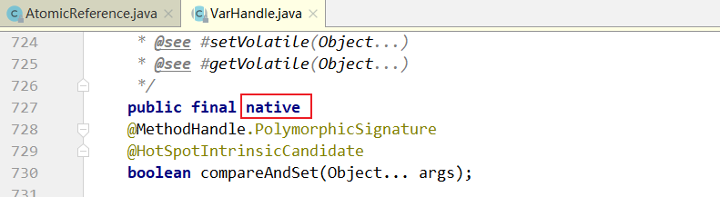

其中，expect是旧的引用，update为新的引用。

### 7.2.2 如何支持boolean和double类型

在Unsafe类中，只提供了三种类型的CAS操作：int、long、Object（也就是引用类型）。如下所示：

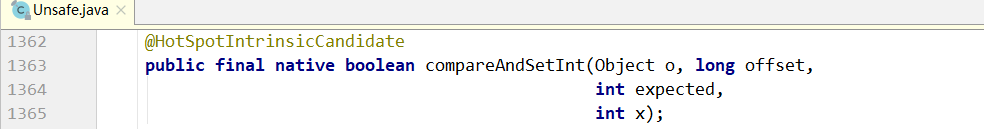

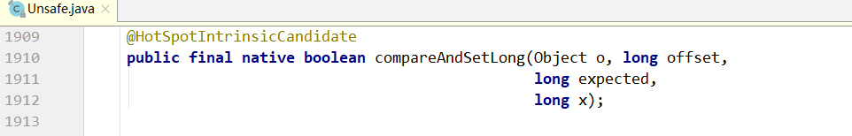

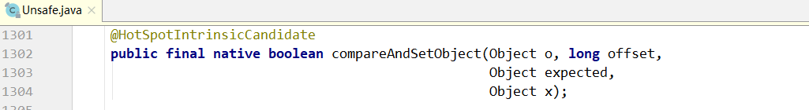

即，在jdk的实现中，这三种CAS操作是由底层实现的，其他类型的CAS操作都要转换为这三种之一进行操作。

其中的参数：

- 第一个参数 是要修改的对象
- 第二个参数 是对象成员变量在内存中的位置（一个long型的整数）
- 第三个参数 是该变量的旧值
- 第四个参数 是该变量的新值。


AtomicBoolean类型如何支持？

对于用int型来代替的，在入参的时候，将boolean类型转换成int类型；在返回值的时候，将int类型转换成boolean类型。如下所示：

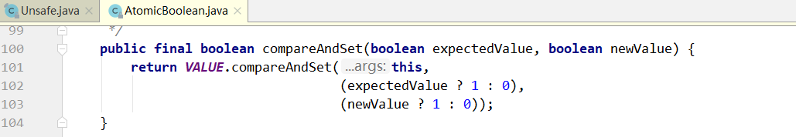

如果是double类型，又如何支持？

这依赖于double类型提供给的一堆double类型和long类型互转的方法：

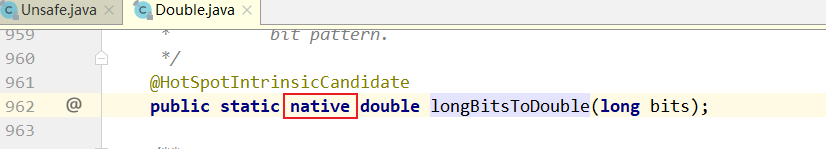

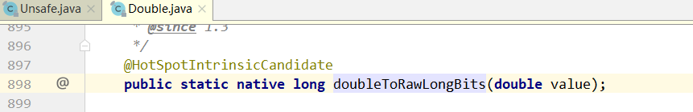

Unsafe类中的方法实现：

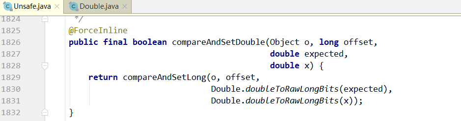


## 7.3 AtomicStampedReference和AtomicMarkableReference

### 7.3.1 ABA问题与解决办法

要解决ABA问题，不仅要比较“值”，还要比较“版本号”，而这正是AtomicStampedReference做的事情，其对应的CAS方法如下：

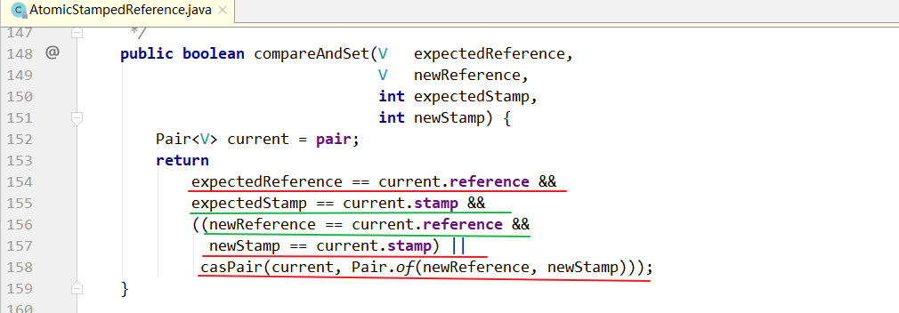

之前的CAS只有两个参数，这里的CAS有四个参数，后两个参数就是版本号的旧值和新值。

当expectedReference != 对象当前的reference时，说明该数据肯定被其他线程修改过；

当expectedReference == 对象当前的reference时，再进一步比较expectedStamp是否等于当前对象的版本号，依次判断数据是否被其他线程修改过。

### 7.3.2 为什么没有AtomicStampedInteger或AtomicStampedLong

因为这里要同时比较数据的“值”和“版本号”，而Integer型或者Long型的CAS没有办法同时比较两个变量。

于是只能把值和版本封装成一个对象，也就是这里面的Pair内部类，然后通过对象引用的CAS来实现。代码如下：

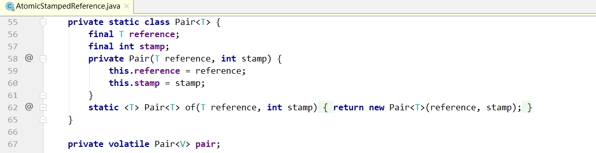

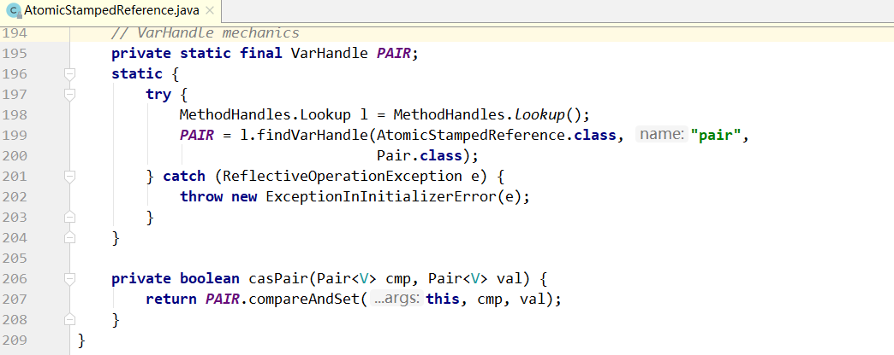

当使用的时候，在构造方法里面传入值和版本号两个参数，应用程序对版本号进行累加操作，然后调用上面的CAS。如下：

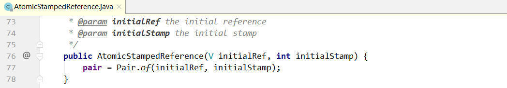

### 7.3.3 AtomicMarkableReference

AtomicMarkableReference与AtomicStampedReference原理类似，只是Pair里面的版本号是boolean类型，不是整型的累加变量。如下：

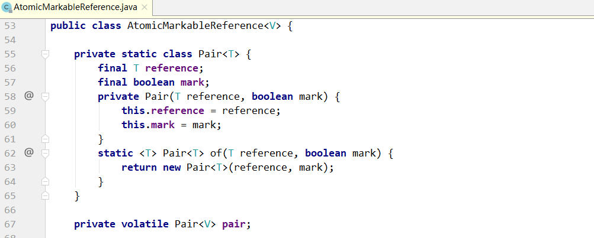

因为是boolean类型，只能有true、false两个版本号，所以并不能完全避免ABA问题，只是降低ABA发生的概率。

## 7.4 AtomicIntegerFieldUpdater、AtomicLongFieldUpdate和AtomicReferenceFieldUpdater

### 7.4.1 为什么需要AtomicXXXFieldUpdater

如果一个类是自己编写的，则可以在编写的时候把变量定义为Atomic类型。但如果是一个已经有的类，在不能更改源代码的情况下，要想实现对其他成员变量的原子操作，就需要AtomicIntegerFieldUpdater、AtomicLongFieldUpdater和AtomicReferenceFieldUpdater。

通过AtomicIntegerFieldUpdater理解它们的实现原理。

AtomicIntegerFieldUpdater是一个抽象类。

首先，其构造方法是protected，不能直接构造其对象，必须通过它提供的的一个静态方法来创建，如下：

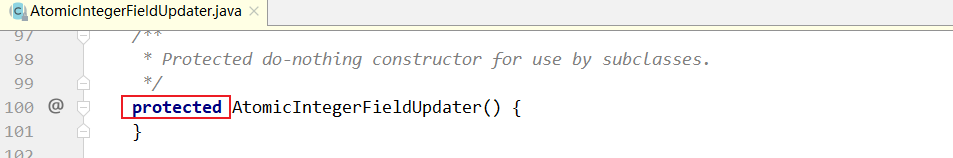

方法`newUpdater`用于创建AtomicIntegerFieldUpdater类对象：

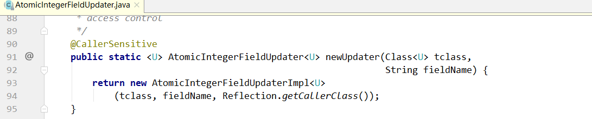

newUpdater(...)静态方法传入的是要修改的类（不是对象）和对象的成员变量的名字，内部通过反射拿到这个类的成员变量，然后包装成一个AtomicIntegerFieldUpdater。所以，这个对象表示的是**类**的某个成员。而不是对象的成员变量。

若要修改某个对象的成员变量的值，再传入相应的对象，如下：

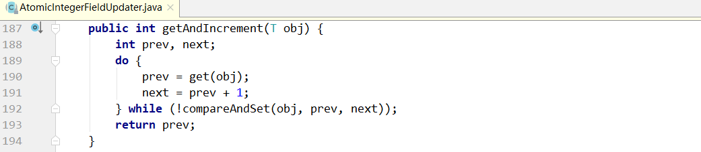

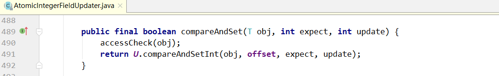

accessCheck方法的作用是检查该obj是不是tclass类型，如果不是，则拒绝修改，抛出异常。

从代码上看，其CAS原理和AtomicInteger是一样的，底层都调用了Unsafe的compareAndSetInt(...)方法。

### 7.4.2 限制条件

要想使用AtomicIntegerFieldUpdater修改成员变量，成员变量必须是volatile的int类型（不能是Integer包装类），该限制从其构造方法中可以看到：

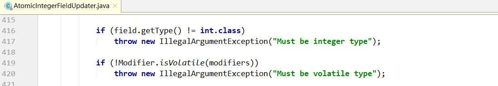

至于AtomicLongFieldUpdater、AtomicReferenceFieldUpdater，也有类似的限制条件。其底层的CAS原理，也和AtomicLong、AtomicReference一样。

## 7.5 AtomicIntegerArray、AtomicLongArray和AtomicReferenceArray

Concurrent包提供了AtomicIntegerArray、AtomicLongArray、AtomicReferenceArray三个数组元素的原子操作。注意，这里并不是说对整个数组的操作是原子的，而是针对数组中一个元素的原子操作而言。

### 7.5.1 使用方式

以AtomicIntegerArray为例，其使用方式如下：

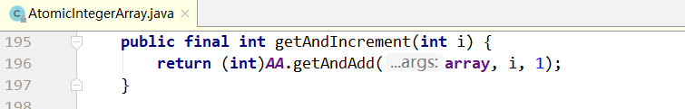

相比于AtomicInteger的getAndIncrement()方法，这里只是多了一个传入参数：数组的下标**i**。

其他方法与此类似，相比于AtomicInteger的各种加减法，也都是多一个下标**i**，如下所示。


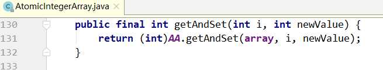

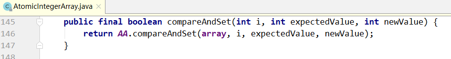

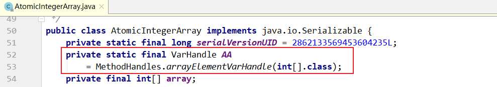

### 7.5.2 实现原理

其底层的CAS方法直接调用VarHandle中的native的getAndAdd方法，如下：

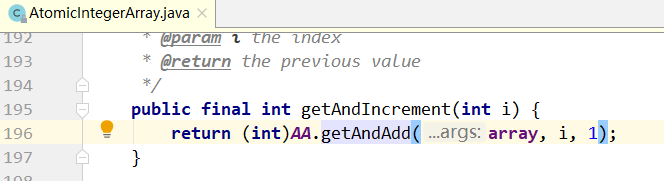

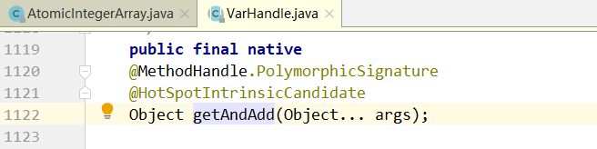

明白了AtomicIntegerArray的实现原理，另外两个数组的原子类实现原理与之类似。


## 7.6 Striped64与LongAdder

从JDK 8开始，针对Long型的原子操作，Java又提供了LongAdder、LongAccumulator；针对Double类型，Java提供了DoubleAdder、DoubleAccumulator。Striped64相关的类的继承层次如下：

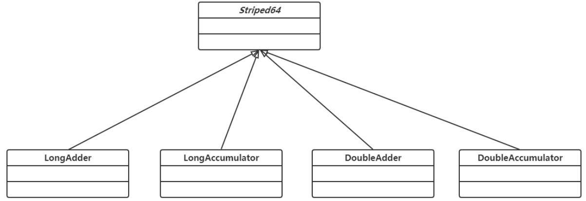

### 7.6.1 LongAdder原理

AtomicLong内部是一个volatile long型变量，由多个线程对这个变量进行CAS操作。多个线程同时对一个变量进行CAS操作，在高并发的场景下仍不够快，如果再提高性能，该怎么做？

把一个变量拆分成多份，变为多个变量，有些类似于ConcurrentHashMap的分段锁的例子。如下图所示，把一个Long型拆成一个base变量外加多个Cell，每个Cell包装一个Long型变量。当多个线程并发累加的时候，如果并发度低，就直接加到base变量上；如果并发度高，冲突大，平摊到这些Cell上。在最后取值的时候，再把base和这些Cell求sum运算。

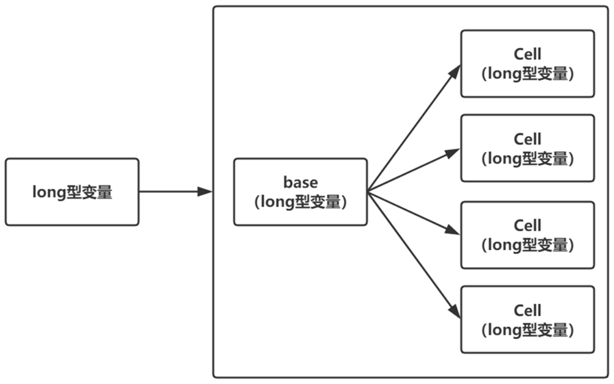

以LongAdder的sum()方法为例，如下所示。

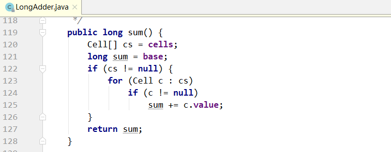

由于无论是long，还是double，都是64位的。但因为没有double型的CAS操作，所以是通过把double型转换为long型来实现的。所以，上面的base和cell[]变量，是位于基类Striped64当中的。英文Striped意为“条带”，也就是分片。

```java
abstract class Striped64 extends Number {    
    transient volatile Cell[] cells;
    transient volatile long base;
    @jdk.internal.vm.annotation.Contended static final class Cell {        
        // ...
        volatile long value;
        Cell(long x) { value = x; }        
        // ...
    }
}
```

### 7.6.2 最终一致性

在sum求和方法中，并没有对cells[]数组加锁。也就是说，一边有线程对其执行求和操作，一边还有线程修改数组里的值，也就是最终一致性，而不是强一致性。这类似于ConcurrentHashMap中的clear()方法，一边执行清空操作，一边还有线程放入数据，clear()方法调用完毕后再读取，hash map里面可能还有元素。因此，LongAdder适合高并发的统计场景，而不适合要对某个Long型变量进行严格同步的场景。

### 7.6.3 伪共享与缓存行填充

在Cell类中的定义中，用了一个独特的注解@jdk.internal.vm.annotation.Contended，这是JDK 8 之后才有的，背后涉及一个很重要的优化原理：伪共享与缓存行填充。

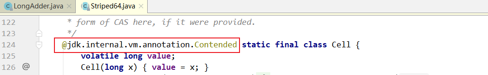

每个CPU都有自己的缓存。缓存与主板进行数据交换的基本单位叫Cache Line（缓存行）。在64位x86架构中，缓存行是64字节，也就是8个Long型的大小。这也意味着当缓存失效，要刷新到主内存的时候，最少要刷新64字节。

如下图所示，主内存中有变量X、Y、Z（假设每个变量都是一个Long型），被CPU1和CPU2分别读入自己的缓存，放在了同一行Cache Line里面。当CPU1修改了X变量，它要失效整行Cache Line，也就是往总线上发消息，通知CPU2对应的Cache Line失效。由于Cache Line是数据交换的基本单位，无法只失效X，要失效就会失效整行的Cache Line，这会导致Y、Z变量的缓存也失效。

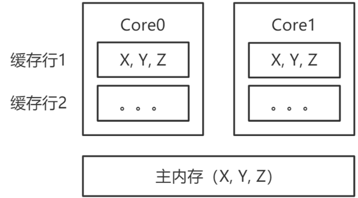

虽然只修改了X变量，本应该只失效X变量的缓存，但Y、Z变量也随之失效。Y、Z变量的数据没有修改，本应该很好地被CPU1和CPU2共享，却没做到，这就是所谓地“伪共享问题”。

问题的原因是，Y、Z和变量X处在同一行Cache Line里面。要解决这个问题，需要用到所谓的“缓存行填充”，分别再X、Y、Z后面加上7个无用的Long型，填充整个缓存行，让X、Y、Z处在三行不同的缓存行中，如下图所示：

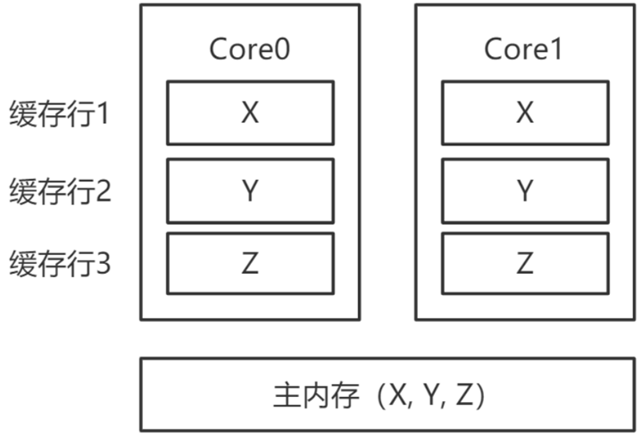

声明一个@jdk.internal.vm.annotation.Contended即可实现缓存行的填充。之所以这个地方要用缓存行填充，是为了不让Cell[]数组中相邻元素落到同一个缓存行里。

### 7.6.4 LongAdder核心实现

下面来看LongAdder最核心的累加方法add(long x)，自增、自减操作都是通过调用该方法实现的。

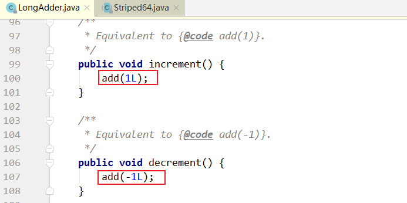

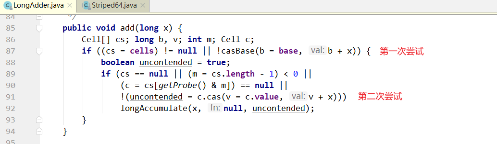

当一个线程调用add(x)的时候，首先会尝试使用caseBase把x加到base变量上。如果不成功，则再用c.cas(...)方式尝试把x加到Cell数组的某个元素上。如果还不成功。最后在调用longAccumulate(...)方法。

**注意**：Cell[]数组的大小始终是2的整数次方，在运行中会不断扩容，每次扩容都是增长2倍。上面代码中的`cs[getProbe() & m]`其实就是对数组的大小取模。因为m=cs.length-1，getProbe()为该线程生成一个随机数，用该随机数对数组长度取模。因为数组长度是2的整数次方，所以可以用&操作来优化取模运算。

对于以恶线程来说，它并不在意到底是把x累加到base上，还是累加到Cell[]数组上，只要累加成功就可以。因此，这里使用随机数来实现Cell的长度取模。

如果两次尝试都不成功，则调用longAccumulate(...)方法，该方法在Striped64里面，LongAccumulator也会用到，如下所示。

```java
final void longAccumulate(long x, LongBinaryOperator fn,
                              boolean wasUncontended) {
    int h;
    if ((h = getProbe()) == 0) {
        ThreadLocalRandom.current(); // force initialization
        h = getProbe();
        wasUncontended = true;
    }
    // true表示最后一个slot非空
    boolean collide = false;                // True if last slot nonempty
    done: for (;;) {
        Cell[] cs; Cell c; int n; long v;
        // 如果cells不是null,且cells长度大于0
        if ((cs = cells) != null && (n = cs.length) > 0) {
            // cells最大下标对随机数取模，得到新下标。
            if ((c = cs[(n - 1) & h]) == null) {
                // 自旋锁标识，用于创建cells或扩容cells
                if (cellsBusy == 0) {       // 尝试添加新的Cell
                    Cell r = new Cell(x);   // Optimistically create
                    // 如果cellsBusy为0，则CAS操作cellBusy为1，获取锁
                    if (cellsBusy == 0 && casCellsBusy()) {
                        try {               // 获取锁之后，再次检查
                            Cell[] rs; int m, j;
                            if ((rs = cells) != null &&
                                (m = rs.length) > 0 &&
                                rs[j = (m - 1) & h] == null) {
                                // 赋值成功，返回
                                rs[j] = r;
                                break done;
                            }
                        } finally {
                            // 重置标志位，释放锁
                            cellsBusy = 0;
                        }
                        continue;           // 如果Slot非空，则进入下一次循环
                    }
                }
                collide = false;
            }
            else if (!wasUncontended)       // CAS操作失败
                wasUncontended = true;      // rehash之后续
            else if (c.cas(v = c.value,
                           (fn == null) ? v + x : fn.applyAsLong(v, x)))
                break;
            else if (n >= NCPU || cells != cs)
                collide = false;            // At max size or stale
            else if (!collide)
                collide = true;
            else if (cellsBusy == 0 && casCellsBusy()) {
                try {
                    if (cells == cs)        // 扩容，每次都是上次的两倍长度
                        cells = Arrays.copyOf(cs, n << 1);
                } finally {
                    cellsBusy = 0;
                }
                collide = false;
                continue;                   // Retry with expanded table
            }
            h = advanceProbe(h);
        }
        else if (cellsBusy == 0 && cells == cs && casCellsBusy()) {
            try {                           // Initialize table
                if (cells == cs) {
                    Cell[] rs = new Cell[2];
                    rs[h & 1] = new Cell(x);
                    cells = rs;
                    break done;
                }
            } finally {
                cellsBusy = 0;
            }
        }
        // Fall back on using base
        else if (casBase(v = base,
                         (fn == null) ? v + x : fn.applyAsLong(v, x)))
            break done;
    }
}
```


### 7.6.5 LongAccumulator

LongAccumulator的原理和LongAdder类似，只是**功能强大**，下面为两者构造方法的对比：

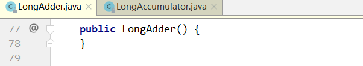

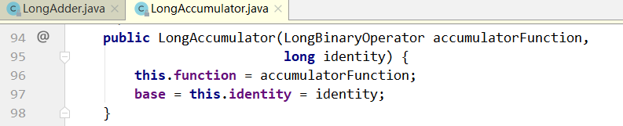

LongAdder只能及逆行累加操作，并且初始值默认为0；LongAccumulator可以自己定义一个二元操作符，并且可以传入一个初始值。

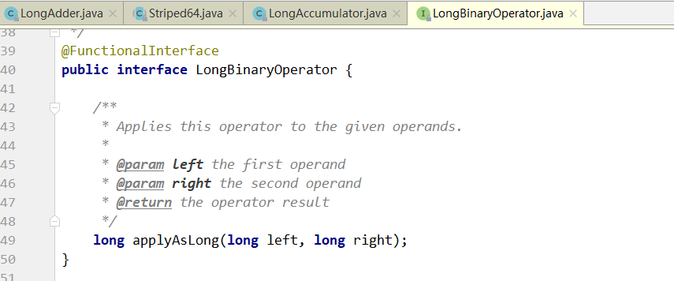

操作符的左值，就是base变量或者Cell[]中元素的当前值；右值，就是add()方法传入的参数x。


下面LongAccumulator的accumulate(x)方法，与LongAdder(x)方法类似，最后都是调用Striped64的longAccumulate(...)方法。唯一的差别就是LongAdder的add(x)方法调用的是caseBase(b, b+x)，这里调用的是caseBase(b, r)，其中r=function.applyAsLong(b=base,x)。

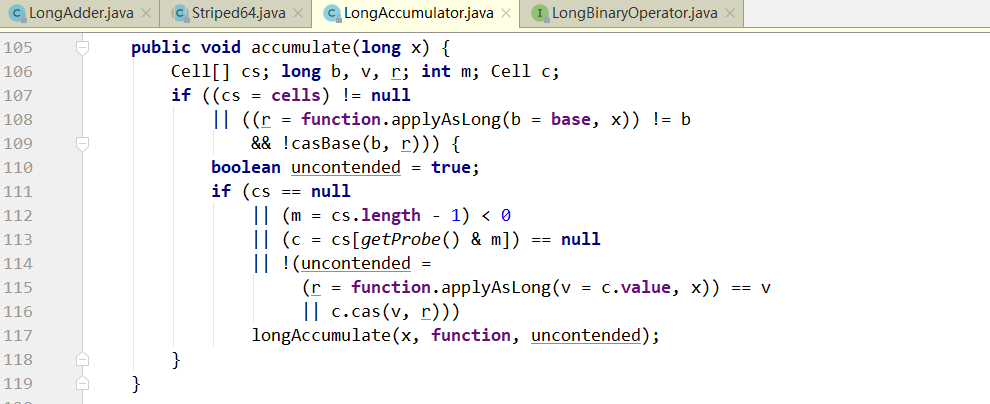


### 7.6.6 DoubleAdder与DoubleAccumulator

DoubleAdder其实也是用long型实现的，因为没有double类型的CAS方法。下面是DoubleAdder的add(x)方法，和LongAdder的add(x)方法基本一样，只是多了long和double类型的相互转换。

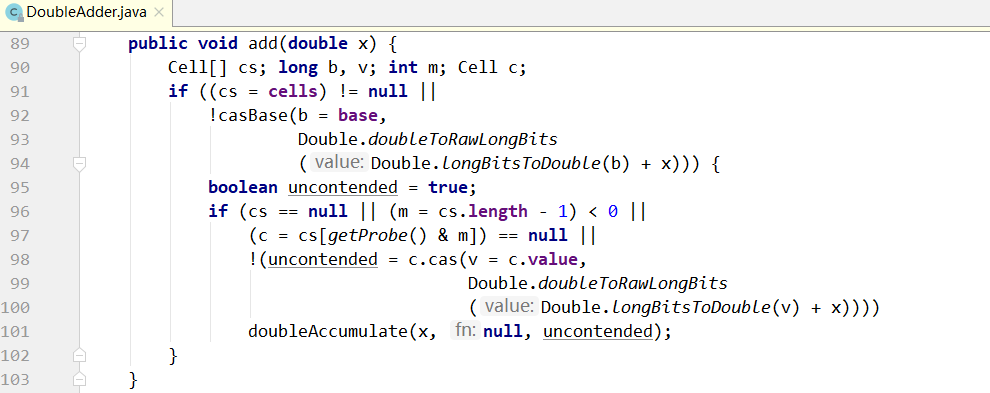

其中的关键Double.doubleToRawLongBits(Double.longBitsToDouble(v) + x)，在读出来的时候，把long类型转换成double类型，然后进行累加，累加的结果再转换成long类型，通过CAS写回

doubleAccumulate也是Striped64的成员方法，和longAccumulate类似，也是多了long类型和double类型的相互转换。

DoubleAccumulator和DoubleAdder的关系，与LongAccumulator和LongAdder的关系类似，只是多了一个二元操作符。

# 8 Lock与Condition

## 8.1 互斥锁

### 8.1.1 锁的可重入性

"可重入锁"是指当一个线程调用object.lock()获取到锁，进入临界区后，再次调用object.lock()，仍然可以获取到该锁。显然，通常的锁都要设计成可重入的。否则就会发生死锁。

synchronized关键字，就是可重入锁。如下所示：

在一个synchronized方法method1()里面调用另外一个synchronized方法method2()。如果synchronized关键字不可重入，那么再method2()处就会发生阻塞，这显然不可行。

```java
public void synchronized method1() {    
    // ...
    method2();    
    // ...
}
public void synchronized method2() {    
    // ...
}
```


### 8.1.2 类的继承层次

在正是介绍锁的实现原理之前，先看一下Concurrent包中的与互斥锁（ReentrantLock）相关类之间的继承层次，如下图所示：

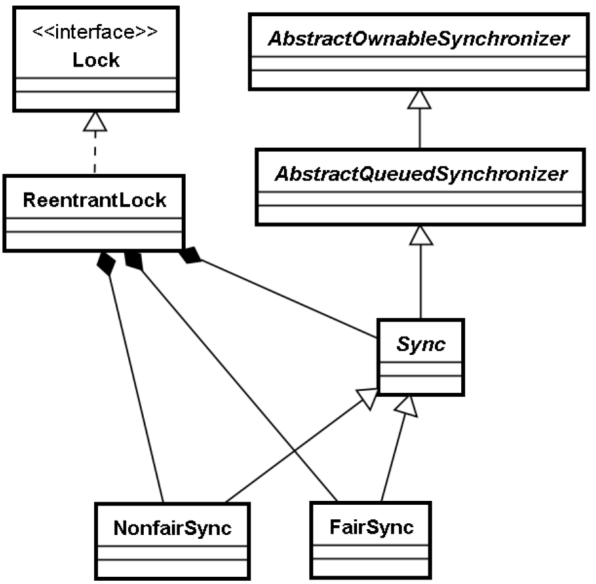

Lock是一个接口，其定义如下：

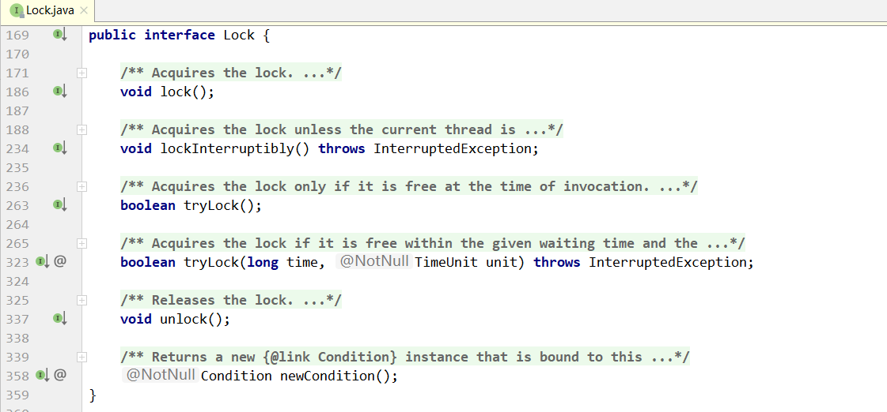

常用的方法是lock()/unlock()。lock()不能被中断，对应的lockInterruptibly()可以被中断。

ReentrantLock本身没有代码逻辑，实现都在其内部类Sync中：

```java
public class ReentrantLock implements Lock, java.io.Serializable {    
    private final Sync sync;
    public void lock() {        
        sync.acquire(1);  
    }
    public void unlock() {        
        sync.release(1);  
    }
    // ... 
}
```


### 8.1.3 锁的公平性vs非公平性

Sync是一个抽象类，它有两个子类FairSync和NonfairSync，分别对应公平锁和非公平锁。从下面的ReentrantLock否早方法可以看出，会传入一个布尔类型的变量fair指定锁是公平锁还是非公平锁，默认是非公平锁。

```java
public ReentrantLock() {
    sync = new NonfairSync();
}
    
public ReentrantLock(boolean fair) {
    sync = fair ? new FairSync() : new NonfairSync();
}
```

什么叫公平锁和非公平锁？

公平即排队，非公平即竞争。**默认设置的是非共公平锁，是为了提高效率，减少线程切换。**


**锁实现的基本原理**

Sync的父类AbstractQueuedSynchronizer经常被称作**队列同步器**（**AQS**），这个类非常**重要**，该类的父类是AbstractOwnableSynchronizer。

此处的锁具备synchronized功能，即可以阻塞一个线程。为了实现一把具有阻塞或唤醒功能的锁，组要几个核心要素：

1. 需要一个state变量，标记该锁的状态。state变量至少有两个值：0、1。对state变量的操作，使用CAS保证线程安全。
2. 需要记录当前是哪个线程持有锁。
3. 需要底层支持对一个线程进行**阻塞**或**唤醒**操作。
4. 需要有一个**队列**维护所有阻塞的线程，这个队列也必须是线程安全的无锁队列，也需要使用CAS。


针对**要素1和2**，在上面两个类中有对应的体现：

```java
public abstract class AbstractOwnableSynchronizer implements java.io.Serializable {
    // ...
    private transient Thread exclusiveOwnerThread;  // 记录持有锁的线程 
}

public abstract class AbstractQueuedSynchronizer extends
AbstractOwnableSynchronizer implements java.io.Serializable {
    private volatile int state; // 记录锁的状态，通过CAS修改state的值。    
    // ...
}
```

state取值可以是0，1，还可以大于1，就是为了支持锁的可重入性。例如，同样一个线程，调用5次lock，state会变成5；然后调用5次unlock，state减为0.

当state=0，没有线程持有锁，exclusiveOwnerThread=null；<br>当state=1，有一个线程持有锁，exclusiveOwnerThread=该线程；<br>当state>0，说明该线程(exclusiveOwnerThread)重入了该锁。

对于**要素3**，Unsafe类提供了阻塞或唤醒线程的一堆操作原语，也就是park/unpark。


有一个LockSupport的工具类，对这一原语做了简单封装：

```java
public class LockSupport {    
    // ...
    private static final Unsafe U = Unsafe.getUnsafe();    
    public static void park() {
        U.park(false, 0L);  
    }
    public static void unpark(Thread thread) {        
        if (thread != null)
        U.unpark(thread);  
    }
}
```

**在当前线程中调用park()，该线程就会被阻塞；在另外一个线程中，调用unpark(Thread thread)，传入一个被阻塞的线程，就可以唤醒阻塞在park()地方的线程。**

unpark(Thread thread)，它实现了一个线程对另外一个线程的"精准唤醒"。notify也只是唤醒某一个线程，但无法执行指定唤醒哪个线程。

针对**要素4**，在AQS中利用双向链表和CAS实现了一个阻塞队列。如下所示：

```java
public abstract class AbstractQueuedSynchronizer {    
    // ...
    static final class Node {
        volatile Thread thread; // 每个Node对应一个被阻塞的线程
        volatile Node prev;
        volatile Node next;        
        // ...
    }
    private transient volatile Node head;    
    private transient volatile Node tail;    
    // ...
}
```

<font color="red">**阻塞队列是整个AQS核心中的核心。**</font>如下图所示，head指向双向链表头部，tail指向双向链表尾部。入队就是把新的Node加到tail后面，然后对tail进行CAS操作；出队就是对head进行CAS操作，把head向后移一个位置。

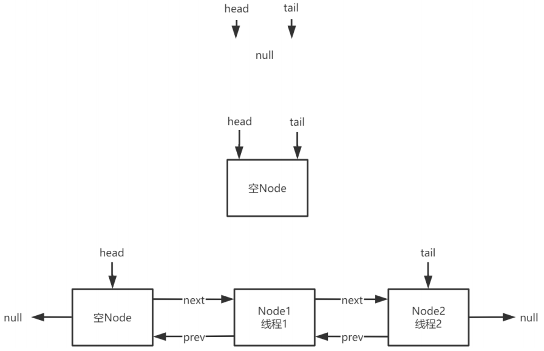

初始时，head=tail=NULL; 然后，在往队列中加入阻塞的线程时，会新建一个空的Node，让head和tail都指向这个空的Node；之后，在后面加入被阻塞的线程对象。所以，当head=tail的时候，说明队列为空。

### 8.1.4 公平与非公平的lock()实现差异

下面分析基于AQS，ReentrantLock在公平和非公平上的实现差异。

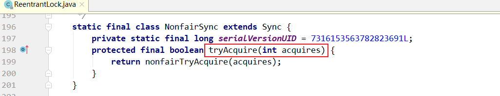

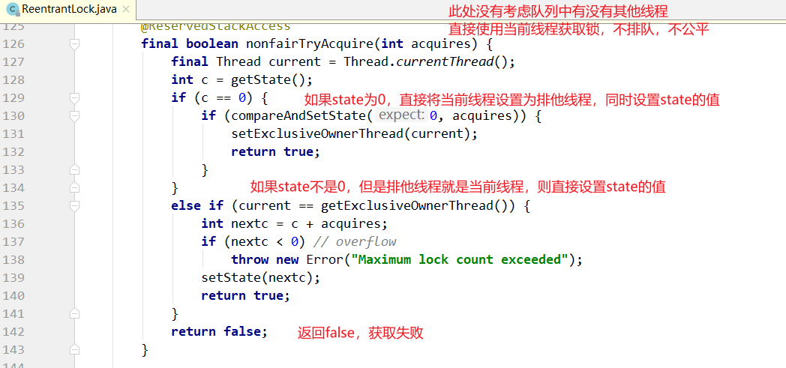


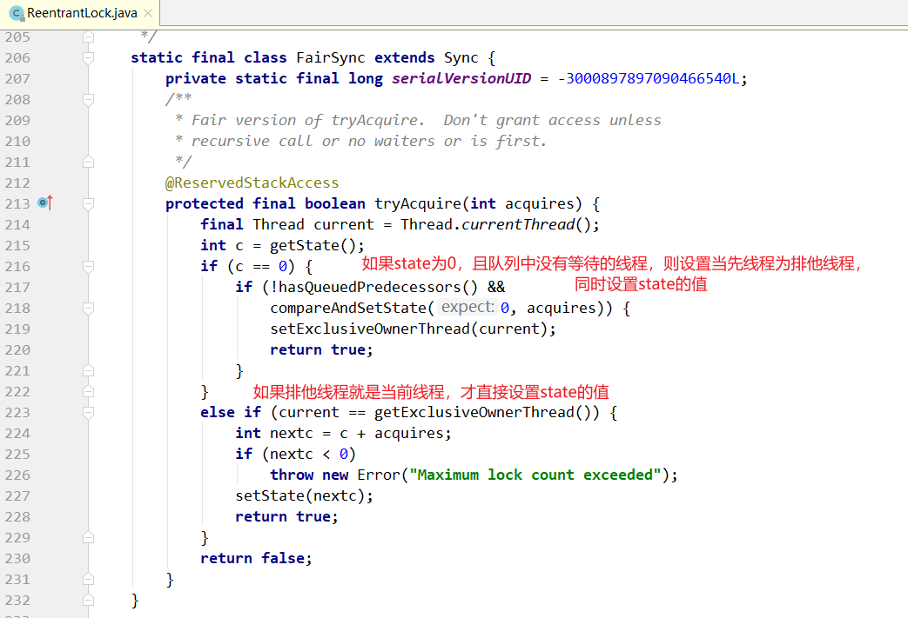

### 8.1.5 阻塞队列与唤醒机制

下面进入锁的最为关键的部分，即acquireQueued(...)方法内部一探究竟。

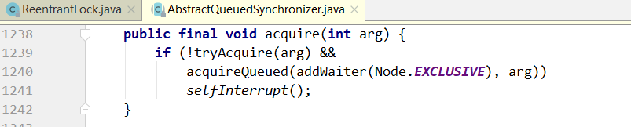

先说addWaiter(...)方法，就是为当前线程生成一个Node，然后把Node放入双向链表的尾部。要注意的时，这只是把Thread对象放入了一个队列中而已，线程本身并未阻塞。

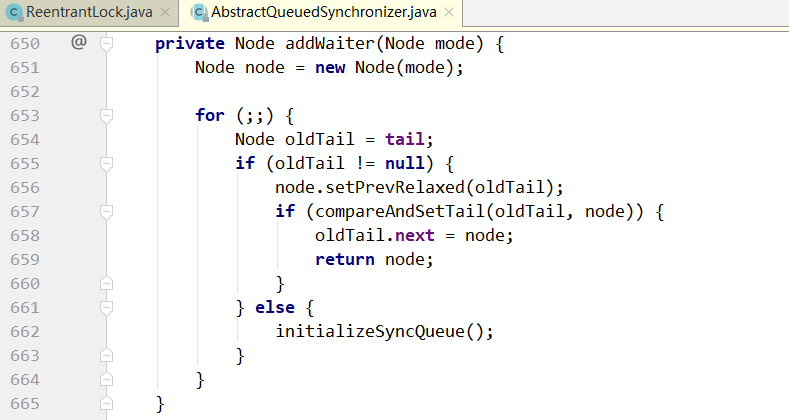

创建节点，尝试将节点追加到队列尾部。获取tail节点，将tail节点的next设置为当前节点。如果tail不存在，就初始化队列。

在addWaiter(...)方法把Thread对象加入阻塞队列之后的工作就要靠acquireQueued(...)方法完成。线程一旦进入acquireQueued(...)就会被无限期阻塞，即使有其他线程调用interrupt()方法也不能将其唤醒，除非有其他线程释放了锁，并且该线程拿到了锁，才会从acquireQueued(...)返回。

进入acquireQueued(...)，该线程被阻塞。在该方法返回的一刻，就是拿到锁的那一刻，也就是被唤醒的那一刻，此时会删除队列的第一个元素（head指针前移一个节点）。

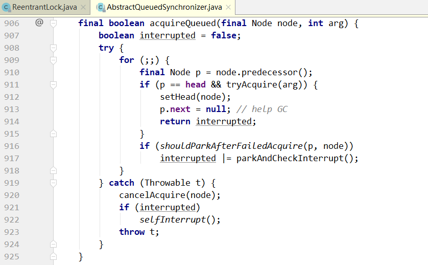

首先，acquireQueued(...)方法有一个返回值，表示什么意思？虽然该方法不会中断响应，但它会记录被阻塞期间有没有其他线程向它发送过中断信号。如果有，则该方法返回true；否则，返回false。

基于这个返回值，才有了下面的代码：

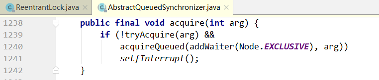

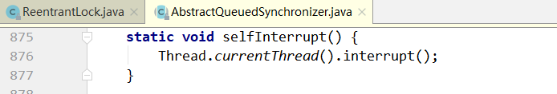

当acquireQueued(...)返回true时，会调用selfInterrupt()，自己给自己发送中断信号，也就是自己把自己的中断标志位设为true。之所以要这么做，是因为自己在阻塞期间，收到其他线程中断信号没有及时响应，现在要进行补偿。这样一来，如果该线程在lock代码块内部有调用sleep()之类的阻塞方法，就可以抛出异常，响应该中断信号。

阻塞就发生在下面这个方法中：

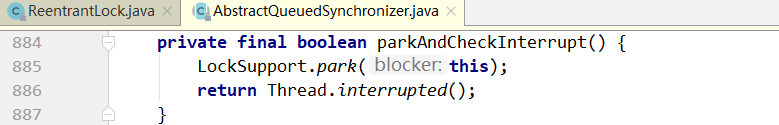

线程调用park()方法，自己把自己阻塞起来，直到被其他线程唤醒，该方法返回。

park()返回有两种情况：

1. 其他线程调用了unpark(Thread t)
2. 其他线程调用了t.interrupt()。这里要注意的是，lock()不能响应中断，但LockSupport.park()会响应中断。

也正因为LockSupport.park()可能被中断唤醒，acquireQueued(...)方法才写了一个for死循环。唤醒之后，如果发现自己排在队列头部，就去拿锁；如果拿不到锁，则再次阻塞自己。不断循环重复此过程，直到拿到锁。

被唤醒之后，通过Thread.interrupted()来判断是否被中断唤醒。如果是情况1，返回fasle；如果是情况2，返回true。

### 8.1.6 unlock()实现分析

说完了lock，下面分析unlock的实现。unlock不区分公平还是非公平。

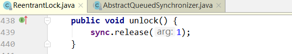

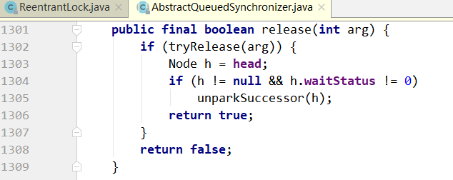

上图中，当前线程要释放锁，先调用tryRelease(arg)方法，如果返回true，则取出head，让head获取锁。

**对于tryRelease方法**：

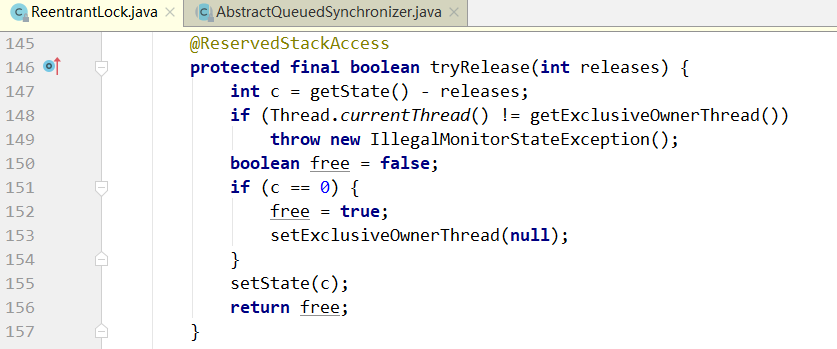

首先计算当前线程释放锁后的state值。

如果当前线程不是排他线程，则抛异常，因为只有获取锁的线程才可以进行释放锁的操作。

此时设置state，没有使用CAS，因为是单线程操作。

**再看unparkSuccessor方法**：

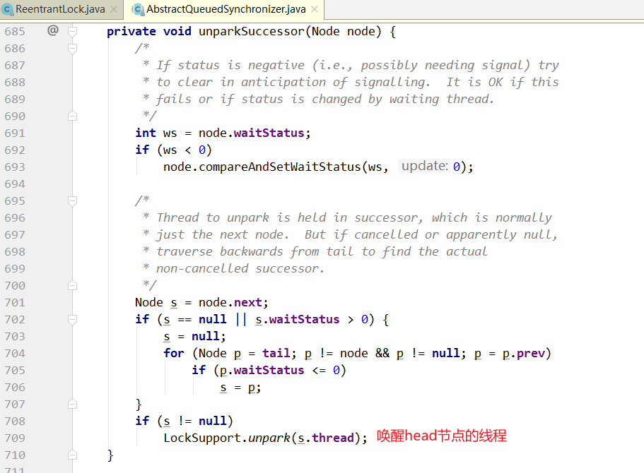

release()里面做了两件事：tryRelease(...)方法释放锁；unparkSuccessor(...)方法唤醒队列中的后继者。

### 8.1.7 lockInterruptibly()实现分析

上面的lock不能被中断，这里的lockInterruptibly()可以被中断：

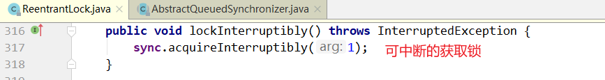

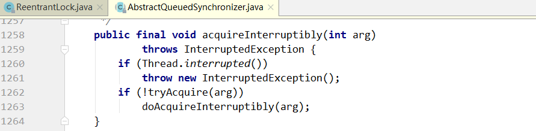

这里的acquireInterruptibly(...)也是AQS的模板方法，里面的tryAcquire(...)分别被FairSync和NonfairSync实现。

主要看doAcquireInterruptibly(...)方法：


当parkAndCheckInterrupt()返回true的时候，说明有其他线程发送中断信号，直接抛出InterruptedException，跳出for循环，整个方法返回。

### 8.1.8 tryLock()实现分析

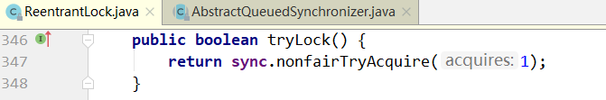

tryLock()实现基于调用非公平锁的tryAcquire(...)，对state进行CAS操作，如果操作成功就拿到锁；如果操作不成功则直接返回false，也不阻塞。


## 8.2 读写锁

和互斥锁相比，读写锁（ReentrantReadWriteLock）就是读线程和读线程之间不互斥。

读读不互斥、读写互斥、写写互斥

### 8.2.1 类继承层次

ReadWriteLock是一个接口，内部由两个Lock接口组成。

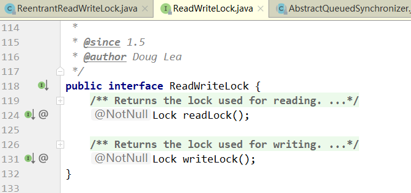

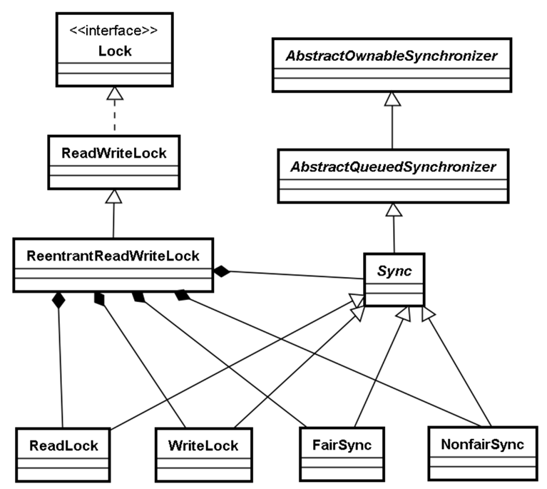

ReentrantReadWriteLock实现了该接口，使用方式如下：

```java
ReadWriteLock readWriteLock = new ReentrantReadWriteLock(); 
Lock readLock = readWriteLock.readLock();
readLock.lock(); 
// 进行读取操作 
readLock.unlock();

Lock writeLock = readWriteLock.writeLock(); 
writeLock.lock();
// 进行写操作 
writeLock.unlock();
```

也就是说，当使用ReadWriteLock的时候，并不是直接使用，而是获得其内部的读锁和写锁，然后分别调用lock/unlock。

### 8.2.2 读写锁实现的基本原理

从表面来看，ReadLock和WriteLock是两把锁，实际上它只是同一把锁的两个视图而已。什么叫两个视图呢？可以理解为一把锁，线程分为两类：读线程和写线程。读线程和写线程之间不互斥（可以同时拿到这把锁），读线程之间不互斥、写线程之间互斥。

从下面的构造方法也可以看出，readerLock和writerLock实际公用同一个sync对象。sync对象同互斥锁一样，分为非公平锁和公平两种策略，并继承自AQS。

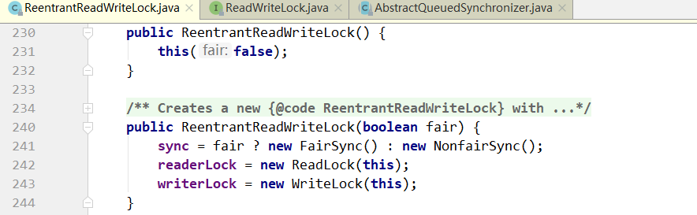

同互斥锁一样，读写锁也是用state变量表示锁状态的。只是state变量在这里的含义和互斥锁完全不同。在内部类Sync中，对state变量进行重新定义，如下所示：

```java
abstract static class Sync extends AbstractQueuedSynchronizer {    
    // ...
    static final int SHARED_SHIFT   = 16;
    static final int SHARED_UNIT    = (1 << SHARED_SHIFT);
    static final int MAX_COUNT      = (1 << SHARED_SHIFT) - 1;
    static final int EXCLUSIVE_MASK = (1 << SHARED_SHIFT) - 1;    
    // 持有读锁的线程的重入次数
    static int sharedCount(int c)    { return c >>> SHARED_SHIFT; }    
    // 持有写锁的线程的重入次数
    static int exclusiveCount(int c) { return c & EXCLUSIVE_MASK; }    
    // ...
}
```

也就是把state变量拆成两半，**低16位，用来记录写锁**。但同一时间既然只能有一个线程写，为什么还需要16位呢？还是因为一个写线程可能多次重入。例如，低16位的值等于5，表示一个写线程重入了5次。

**高16位，用来记录"读"锁**，例如，高16位的值等于5，既可以表示5个线程都拿到了该锁；也可以表示一个读线程重入了5次。

> 为什么要把一个int类型变量拆成两半，而不是用两个int型变量分别表示读锁和写锁的状态呢？
>
> 这时因为无法用一次CAS同时操作两个int变量，所以用来一个int型的高16位和低16位分别表示读锁和写锁的状态。

当state = 0时，说明既没有线程持有读锁，也没有线程持有写锁；当state != 0时，要么有线程持有读锁，要么有线程持有写锁，两者不能同时成立，因为读和写互斥。这时再进一步通过sharedCount(state)和exclusiveCount(state)判断到底时读线程还是写线程持有了该锁。


### 8.2.3 AQS的两对模板方法

下面介绍在ReentrantReadWriteLock的两个内部类ReadLock和WriteLock中，是如何使用state变量的。

```java
public static class ReadLock implements Lock, java.io.Serializable {    
    // ...
    public void lock() {
        sync.acquireShared(1);  
    }
    public void unlock() {
        sync.releaseShared(1);  
    }
    // ... 
}
public static class WriteLock implements Lock, java.io.Serializable {    
    // ...
    public void lock() {        
        sync.acquire(1);  
    }
    public void unlock() {        
        sync.release(1);  
    }
    // ... 
}
```

acquire/release、acquireShared/releaseShared是AQS里面的两对模板方法。互斥锁和读写锁的写锁都是基于acquire/release模板方法来实现的。读写锁的读锁是基于acquireShared/releaseShared这对模板方法来实现的。这两对模板方法的代码如下：

```java
public abstract class AbstractQueuedSynchronizer 
    extends AbstractOwnableSynchronizer implements java.io.Serializable {    
    // ...
    public final void acquire(int arg) {
        if (!tryAcquire(arg) &&                 // tryAcquire方法由多个Sync子类实现
            acquireQueued(addWaiter(Node.EXCLUSIVE), arg))            
            selfInterrupt();
    }
    public final void acquireShared(int arg) {
        if (tryAcquireShared(arg) < 0) // tryAcquireShared方法由多个Sync子类实现
            doAcquireShared(arg);
    }
    
    public final boolean release(int arg) {
        if (tryRelease(arg)) {  // tryRelease方法由多个Sync子类实现            
            Node h = head;
            if (h != null && h.waitStatus != 0)                
                unparkSuccessor(h);
            return true;      
        }
        return false;  
    }
    
    public final boolean releaseShared(int arg) {
        if (tryReleaseShared(arg)) {  // tryReleaseShared方法由多个Sync子类实现
            doReleaseShared();
            return true;     
        }
        return false;  
    }
    // ...
}
```

将读/写、公平/非公平进行排列组合，就有4种组合。如下，上面的两个方法都是在Sync种实现的。Sync种的两个方法又是模板方法，在NonfairSync和FairSync种分别有实现。最终的对应关系如下：

1. 读锁的公平实现：Sync.tryAcquireShared() + FairSync 中的两个重写的子方法。
2. 读锁的非公平实现：Sync.tryAcquireShared() + NonfairSync中的两个重写的子方法。
3. 写锁的公平实现：Sync.tryAcquire() + FairSync中的两个重写的子方法。
4. 写锁的非公平实现：Sync.tryAcquire() + NonfairSync中的两个重写的子方法。

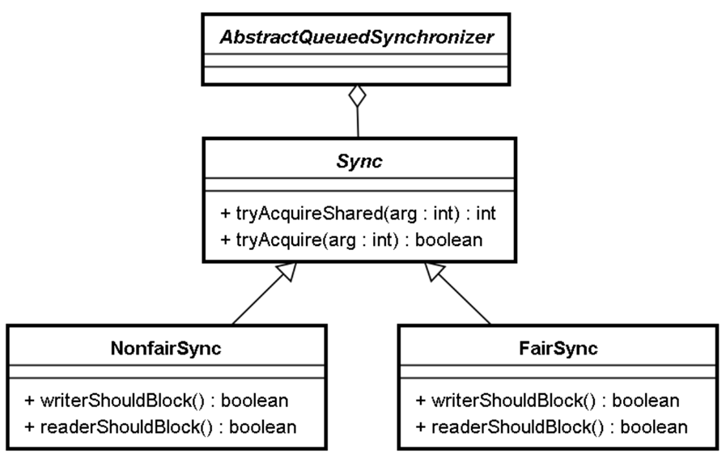

```java
/**
 * Nonfair version of Sync
 */
static final class NonfairSync extends Sync {
    private static final long serialVersionUID = -8159625535654395037L;
    // 写线程枪锁的时候是否应该阻塞
    final boolean writerShouldBlock() {
        // 写线程在抢锁之前永远不被阻塞，非公平锁
        return false; // writers can always barge
    }
    // 读线程抢锁的时候是否应该阻塞
    final boolean readerShouldBlock() {
        // 读线程抢锁的时候，当队列中第一个元素是写线程的时候要阻塞
        return apparentlyFirstQueuedIsExclusive();
    }
}

/**
 * Fair version of Sync
 */
static final class FairSync extends Sync {
    private static final long serialVersionUID = -2274990926593161451L;
    // 写线程抢锁的时候是否应该阻塞
    final boolean writerShouldBlock() {
        // 写线程在抢锁之前，如果队列中有其他线程在排队，则阻塞。公平锁
        return hasQueuedPredecessors();
    }
    // 读线程抢锁的时候是否应该阻塞
    final boolean readerShouldBlock() {
        // 读线程在抢锁之前，如果队列中有其他线程在排队，阻塞。公平锁
        return hasQueuedPredecessors();
    }
}
```

对于公平，比较容易理解，不论是读锁，还是写锁，只要队列中有其他线程在排队（排队等读锁，或者排队等写锁），就不能直接区抢锁，要排在队列尾部。

对于非公平，读锁和写锁的实现策略稍有差异。

写锁能抢锁，前提是state=0，只有在没有其他线程持有读锁或写锁的情况下，它才有机会去抢锁。或者state != 0，但哪个持有写锁的线程是自己，再次重入。写线程是非公平的，即writerShouldBlock()方法一直返回false。

对于读线程，假设当前线程被读线程持有，然后其他读线程还非公平地一直去抢，可能导致写线程永远拿不到锁，所以对于读线程的非公平，要做一些"约束"。当发现队列的第一个元素是写线程的时候，读线程也要阻塞，不能直接去抢。即偏向写线程。

### 8.2.4 WriteLock公平vs非公共平实现

写锁是排他锁，实现策略类似于互斥锁。

#### 8.2.4.1 tryLock()/lock()实现分析

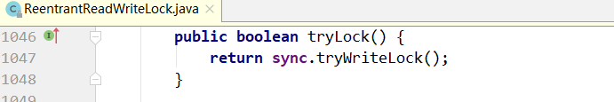

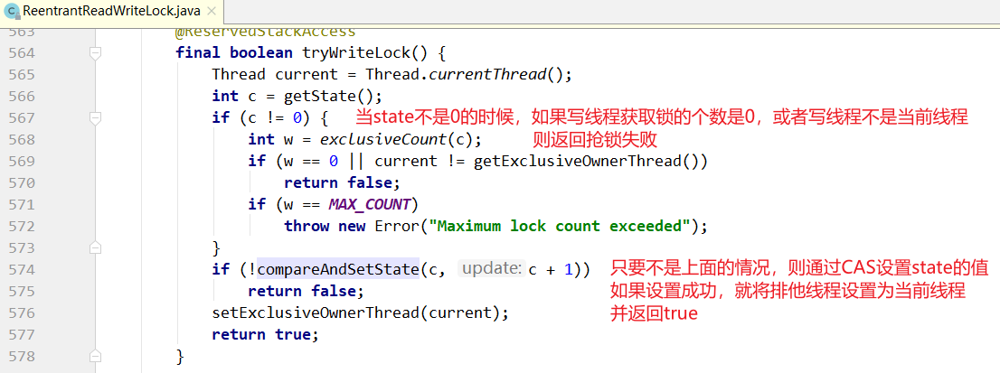

lock()方法：

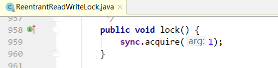

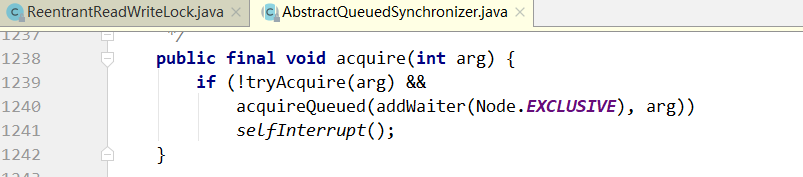

tryLock和lock方法不区分公平/非公平。


#### 8.2.4.2 unlock()实现分析


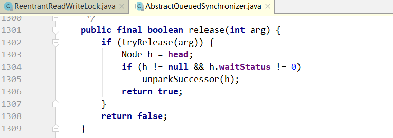

unlock()方法不区分公平/非公平。

### 8.2.5 ReadLock公平vs非公平实现

读锁是共享锁，其实现策略和排他锁有很大差异。

#### 8.2.5.1 tryLock()实现分析

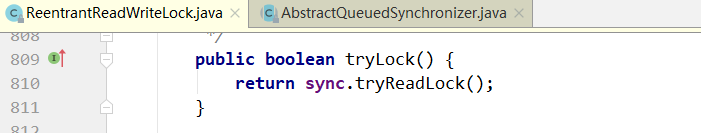

```java
final boolean tryReadLock() {
    // 获取当前线程
    Thread current = Thread.currentThread();
    for (;;) {
        // 获取state值
        int c = getState();
        // 如果是写线程占用锁或者当前线程不是排他锁，则抢锁失败
        if (exclusiveCount(c) != 0 &&
            getExclusiveOwnerThread() != current)
            return false;
        // 获取锁state值
        int r = sharedCount(c);
        // 如果获取锁的值达到极值，则抛出异常
        if (r == MAX_COUNT)
            throw new Error("Maximum lock count exceeded");
        
        // 使用CAS设置读线程锁state值
        if (compareAndSetState(c, c + SHARED_UNIT)) {
            // 如果r=0，则当前线程就是第一个读线程
            if (r == 0) {
                firstReader = current;
                // 读线程个数为1
                firstReaderHoldCount = 1;
            } else if (firstReader == current) {
                // 如果第一个读线程就是当前线程，表示读线程重入读锁
                firstReaderHoldCount++;
            } else {
                // 如果firstReader不是当前线程，则熊ThreadLocal中获取当前线程的读锁个数，并设置当前线程持有的读锁个数
                HoldCounter rh = cachedHoldCounter;
                if (rh == null ||
                    rh.tid != LockSupport.getThreadId(current))
                    cachedHoldCounter = rh = readHolds.get();
                else if (rh.count == 0)
                    readHolds.set(rh);
                rh.count++;
            }
            return true;
        }
    }
}
```


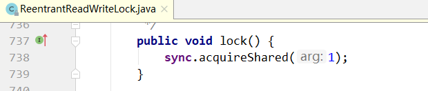

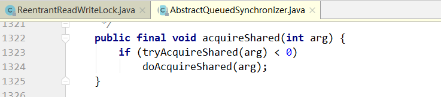

#### 8.2.5.2 unlock()实现分析

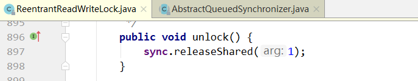

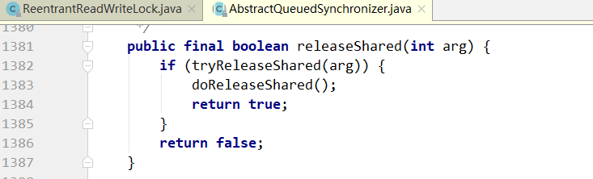

tryReleaseShared()的实现：

```java
@ReservedStackAccess
protected final boolean tryReleaseShared(int unused) {    
    Thread current = Thread.currentThread();
    // ...
    for (;;) {
        int c = getState();
        int nextc = c - SHARED_UNIT;
        if (compareAndSetState(c, nextc))
        // Releasing the read lock has no effect on readers,            
        // but it may allow waiting writers to proceed if            
        // both read and write locks are now free.
        return nextc == 0;  
    }
}
```

因为读锁是共享锁，多个线程会同时持有读锁，所以对读锁的释放不能直接减1，而是需要通过一个for循环 + CAS操作不断重试。这是tryReleaseShared和tryReleased的根本差异所在。

## 8.3 Condition

### 8.3.1 Condition与Lock的关系

Condition本身也是一个接口，其功能和wait/notify类似，如下：

```java
public interface Condition {
    void await() throws InterruptedException;
    boolean await(long time, TimeUnit unit) throws InterruptedException;    
    long awaitNanos(long nanosTimeout) throws InterruptedException;
    void awaitUninterruptibly();
    boolean awaitUntil(Date deadline) throws InterruptedException;    
    void signal();
    void signalAll(); 
}
```

wait()/notify()必须和synchronized一起使用，Condition也必须和Lock一起使用。因此，在Lock的接口中，有一个与Condition相关的接口：

```java
public interface Lock {    
    void lock();
    void lockInterruptibly() throws InterruptedException;    
    // 所有的Condition都是从Lock中构造出来的
    Condition newCondition();
    boolean tryLock();
    boolean tryLock(long time, TimeUnit unit) throws InterruptedException;    
    void unlock();
}
```


### 8.3.2 Condition的使用场景

以ArrayBlockingQueue为例。如下面所示为一个用数组实现的阻塞队列，执行put(...)操作的时候，队列满了，生产者线程被阻塞；执行take()的时候，队列为空，消费者线程被阻塞。

```java
public class ArrayBlockingQueue<E> extends AbstractQueue<E>        
        implements BlockingQueue<E>, java.io.Serializable {    
    //...
    final Object[] items;
    int takeIndex;
    int putIndex;
    int count;
    // 一把锁+两个条件
    final ReentrantLock lock;
    private final Condition notEmpty;    
    private final Condition notFull;
    
    public ArrayBlockingQueue(int capacity, boolean fair) {        
        if (capacity <= 0)
            throw new IllegalArgumentException();        
        this.items = new Object[capacity];
        // 构造器中创建一把锁加两个条件
        lock = new ReentrantLock(fair);        
        // 构造器中创建一把锁加两个条件
        notEmpty = lock.newCondition();        
        // 构造器中创建一把锁加两个条件
        notFull =  lock.newCondition();  
    }
    
    public void put(E e) throws InterruptedException {        
        Objects.requireNonNull(e);
        final ReentrantLock lock = this.lock;        
        lock.lockInterruptibly();
        try {
            while (count == items.length)                
                // 非满条件阻塞，队列容量已满                
                notFull.await();
            enqueue(e);        
        } finally {
            lock.unlock();      
        }
    }
    
    private void enqueue(E e) {
        // assert lock.isHeldByCurrentThread();        
        // assert lock.getHoldCount() == 1;
        // assert items[putIndex] == null;        
        final Object[] items = this.items;        
        items[putIndex] = e;
        if (++putIndex == items.length) putIndex = 0;        
        count++;
        // put数据结束，通知消费者非空条件        
        notEmpty.signal();
    }
    
    public E take() throws InterruptedException {        
        final ReentrantLock lock = this.lock;
        lock.lockInterruptibly();        
        try {
            while (count == 0)
                // 阻塞于非空条件，队列元素个数为0，无法消费                
                notEmpty.await();
            return dequeue();        
        } finally {
            lock.unlock();      
        }
    }
    
    private E dequeue() {
        // assert lock.isHeldByCurrentThread();        
        // assert lock.getHoldCount() == 1;
        // assert items[takeIndex] != null;        
        final Object[] items = this.items;        
        @SuppressWarnings("unchecked")
        E e = (E) items[takeIndex];        
        items[takeIndex] = null;
        if (++takeIndex == items.length) takeIndex = 0;        
        count--;
        if (itrs != null)
            itrs.elementDequeued();
        // 消费成功，通知非满条件，队列中有空间，可以生产元素了。        
        notFull.signal();
        return e;  
    }
    // ...
}
```


### 8.3.3 Condition实现原理

可以发现，Condition的使用很方便，避免了wait/notify的生产者通知生产者，消费者通知消费者的问题。具体实现如下：

由于Condition必须和Lock一起使用，所以Condition的实现也是Lock的一部分。首先查看互斥锁和读写锁中Condition的构造方法

```java
public class ReentrantLock implements Lock, java.io.Serializable {    
    // ...
    public Condition newCondition() {
        return sync.newCondition();  
    }
}

public class ReentrantReadWriteLock implements ReadWriteLock, java.io.Serializable {    
    // ...
    private final ReentrantReadWriteLock.ReadLock readerLock;    
    private final ReentrantReadWriteLock.WriteLock writerLock;    
    // ...
    public static class ReadLock implements Lock, java.io.Serializable {        
        // 读锁不支持Condition
        public Condition newCondition() {
            // 抛异常
            throw new UnsupportedOperationException();      
        }
    }
    
    public static class WriteLock implements Lock, java.io.Serializable {        
        // ...
        public Condition newCondition() {
            return sync.newCondition(); 
        }
        // ...  
    }
    // ... 
}
```

首先，读写锁中的ReadLock是不支持Condition的，读写锁的写锁和互斥锁都支持Condition。虽然它们各自调用的是自己的内部类Sync，但内部类Sync都继承紫AQS。因此，上面的代码sync.newCondition最终都调用了AQS中的newCondition：

```java
public abstract class AbstractQueuedSynchronizer 
        extends AbstractOwnableSynchronizer implements java.io.Serializable {
        
    public class ConditionObject implements Condition, java.io.Serializable {
       // Condition的所有实现，都在ConditionObject类中  
    }
}

public class ReentrantLock implements Lock, java.io.Serializable {
    abstract static class Sync extends AbstractQueuedSynchronizer {   
        final ConditionObject newCondition() {
            return new ConditionObject();  
        }
    }
}
```

每一个Condition对象上面，都阻塞了多个线程。因此，在ConditionObject内部也有一个双向链表组成的队列，如下：

```java
public class ConditionObject implements Condition, java.io.Serializable {    
    private transient Node firstWaiter;
    private transient Node lastWaiter; 
}
static final class Node {
    volatile Node prev;
    volatile Node next;
    volatile Thread thread;    
    Node nextWaiter;
}
```

下面看一下在await()/notify()方法中，是如何使用这个队列的。

### 8.3.4 await()实现分析

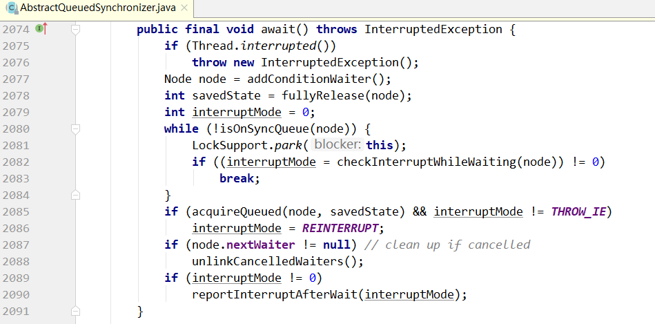

```java
public final void await() throws InterruptedException {
    // 刚要执行await()操作，收到中断信号，抛异常
    if (Thread.interrupted())
        throw new InterruptedException();
    // 加入Condition的等待队列
    Node node = addConditionWaiter();
    // 阻塞在Condition之前必须先释放锁，否则会死锁
    int savedState = fullyRelease(node);
    int interruptMode = 0;
    while (!isOnSyncQueue(node)) {
        // 阻塞当前线程
        LockSupport.park(this);
        if ((interruptMode = checkInterruptWhileWaiting(node)) != 0)
            break;
    }
    // 重新获取锁
    if (acquiraeQueued(node, savedState) && interruptMode != THROW_IE)
        interruptMode = REINTERRUPT;
    if (node.nextWaiter != null) // clean up if cancelled
        unlinkCancelledWaiters();
    if (interruptMode != 0)
        // 被中断唤醒，抛中断异常
        reportInterruptAfterWait(interruptMode);
}
```

关于await，有几个关键点要说明：

1. 线程调用await()的时候，肯定已经先拿到了锁。所以，在addConditionWaiter()内部，对这个双向链表的操作不需要执行CAS操作，线程是安全的，代码如下：

   ```java
   private Node addConditionWaiter() {
       // ...
       Node t = lastWaiter;
       // ...
       Node node = new Node(Node.CONDITION);
   
       if (t == null)
           firstWaiter = node;
       else
           t.nextWaiter = node;
       lastWaiter = node;
       return node;
   }
   ```

2. 在线程执行wait操作之前，必须先释放锁。也就是fullyRelease(node)，否则会发生死锁。这个和wait/notify与synchronized的配合机制一样。

3. 线程从wait中被唤醒后，必须用acquiraeQueued(node, savedState)方法重新拿锁。

4. checkInterruptWhileWaiting(node)代码在park(this)代码之后，是为了检测在park期间是否收到过中断信号。当线程从park中醒来时，有两种可能：

   - 一种是其他线程调用了unpark；
   - 另一种是收到中断信号。

   这里的await()方法是可以响应中断，所以当发现自己被中断唤醒的，而不是被unpark唤醒时，会直接退出while循环，await()方法也会返回

5. isOnSyncQueue(node)用于判断该Node是否在AQS的同步队列里面。初始的时候，Node值在Condition的队列里，而不在AQS的队列里。但执行notify操作的时候，会放进AQS的同步队列。

### 8.3.5 awaitUniterruptibly()实现分析

与await()不同，awaitUninterruptibly()不会响应中断，其方法的定义中不会有中断异常抛出，下面分析其实现和await()的区别。

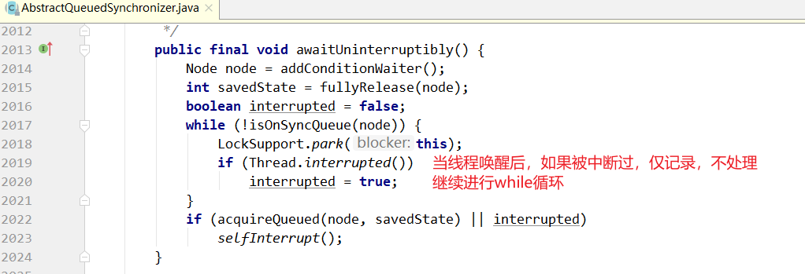

可以看出，整体代码和await()类似，区别在于收到异常后，不会抛出异常，而是继续执行while循环。

### 8.3.6 notify()实现分析

```java
public final void signal() {
    // 只有持有锁的线程，才有资格调用signal()方法
    if (!isHeldExclusively())
        throw new IllegalMonitorStateException();
    Node first = firstWaiter;
    if (first != null)
        // 发起通知
        doSignal(first);
}

// 唤醒队列中的第1个线程
private void doSignal(Node first) {
    do {
        if ( (firstWaiter = first.nextWaiter) == null)
            lastWaiter = null;
         first.nextWaiter = null;
    } while (!transferForSignal(first) && (first = firstWaiter) != null);
}
        
final boolean transferForSignal(Node node) {
    if (!node.compareAndSetWaitStatus(Node.CONDITION, 0))
        return false;
	// 先把Node放入互斥锁的同步队列中，再调用unpark方法
    Node p = enq(node);
    int ws = p.waitStatus;
    if (ws > 0 || !p.compareAndSetWaitStatus(ws, Node.SIGNAL))
        LockSupport.unpark(node.thread);
    return true;
}
```

同await()一样，在调用notify()的时候，必须先拿到锁（否则就会抛出上面的异常），是因为前面执行await()的时候，把锁释放了。

然后从队列中取出firstWaiter，唤醒它。在通过调用unpark唤醒它之前，先用enq(node)方法把这个Node放入AQS的锁对应的阻塞队列中。也正因为如此，才有了await()方法里面的判断条件：while (!isOnSyncQueue(node)) ，这个判断条件满足，说明await线程不是被中断的，而是被unpark唤醒的。

notifyAll()与此类似。

## 8.4 StampedLock

### 8.4.1 为什么引入StampedLock

### 8.4.2 使用场景

### 8.4.3 "乐观读"的实现原理

### 8.4.4 悲观读/写："阻塞"与"自旋"策略实现差异