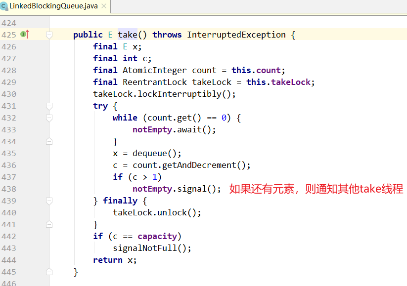
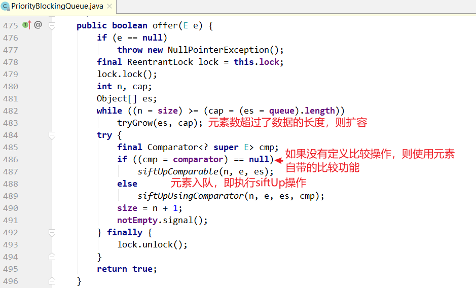

第二部分 JUC

Java并发编程核心在于java.util.concurrent包，而JUC当中的大多数同步器实现都是围绕着共同的基础行为，比如等待队列，条件队列、独占获取、共享获取等。而这个行为的抽象就是基于AbstractQueuedSynchronizer，简称AQS，AQS定义了一套多线程访问共享资源的同步框架，是一个依赖状态（<font color='red'>**state**</font>）的同步器。

# 5 并发容器

## 5.1 BlockingQueue

在所有的并发容器中，BlockingQueue是最常见的一种。BlockingQueue是一个带有阻塞功能的队列，当入队时，若队列已满，则阻塞调用者；当出队，队列空，则阻塞调用者。

在Concurrent包中，BlockingQueue是一个接口，有许多个不同的实现类，如图所示。


接口定义：

```java
public interface BlockingQueue<E> extends Queue<E> {    
	//...
   	boolean add(E e);    
   	boolean offer(E e);
   	void put(E e) throws InterruptedException;    
   	boolean remove(Object o);
   	E take() throws InterruptedException;
   	E poll(long timeout, TimeUnit unit) throws InterruptedException;    
   	//...
}
```

该接口和JDK集合包中的Queue接口是兼容的，同时在其基础上增加了阻塞功能。入队提供了add(...)、offer(...)、put(...) 3个方法，区别：add(...)和offer(...)的返回值是布尔类型，而put无返回值，还会抛出中断异常。所以add(...)和offer(...)是无阻塞的，也就是Queue本身定义的接口，而put(...)是阻塞的。add(...)和offer(...)的区别不大，当队列满时，前者会排除异常，后者直接返回false。

出队列与之类似，提供了remove()、poll()、take()等方法，remove()是非阻塞式的，take()和poll()式阻塞式的。

### 5.1.1 ArrayBlockingQueue

ArrayBlockingQueue是一个用数组实现的环形队列，在构造方法中，会传入数组的容量。

```java
public ArrayBlockingQueue(int capacity) {    
	this(capacity, false);
}
public ArrayBlockingQueue(int capacity, boolean fair) { 
	// ...
}
public ArrayBlockingQueue(int capacity, boolean fair, Collection<? extends E> c) {
   	this(capacity, fair);    
   	// ...
}
```

其核心数据结构如下：

```java
public class ArrayBlockingQueue<E> extends AbstractQueue<E> 
		implements BlockingQueue<E>, java.io.Serializable {

	//...
   	final Object[] items;    
   	// 队头指针
   	int takeIndex;    
   	// 队尾指针
   	int putIndex;    
   	int count;
   	
   	// 核心为1个锁外加两个条件    
   	final ReentrantLock lock;
   	private final Condition notEmpty;    
   	private final Condition notFull;    
   	//...
}
```

其put/take方法也很简单，如下所示：

put方法：


take方法：


### 5.1.2 LinkedBlockingQueue

LinkedBlockingQueue是一种基于单向链表的阻塞队列。因为队头和队尾是2个指针分开操作的，所以用了2把锁+2个条件，同时有1个AutomicInteger的原子变量记录count数。

```java
public class LinkedBlockingQueue<E> extends AbstractQueue<E> 
		implements BlockingQueue<E>, java.io.Serializable {
   
   	// ...
   	private final int capacity;    
   	// 原子变量
   	private final AtomicInteger count = new AtomicInteger(0);    
   	// 单向链表的头部
   	private transient Node<E> head;    
   	// 单向链表的尾部
   	private transient Node<E> last;    
   	
   	// 两把锁，两个条件
   	private final ReentrantLock takeLock = new ReentrantLock();
   	private final Condition notEmpty = takeLock.newCondition();
   	private final ReentrantLock putLock = new ReentrantLock();
   	private final Condition notFUll = putLock.newCondition();    
   	// ...
}
```

在其构造方法中，也可以指定队列的总容量。如果不指定，默认为Integer.MAX_VALUE。


put方法：


take方法：



LinkBlockingQueue和ArrayBlockingQueue的差异：

1. 为了提高并发度，用了2把锁，分别控制对头，队尾的操作。意味着在put(...)和put(...)之间、take(...)和take(...)之间是互斥的，put(...)和take(...)之间并不互斥。但对于count变量，双方都需要操作，所以必须是原子类型。
2. 因为各自拿了一把锁，所以当需要调用对方的condition的signal时，还必须再加上对方的锁，就是signalNotEmpty()和signalNotFull()方法，如下：


3. 不仅put会通知take，take也会通知put。当put发现非满的时候，也会通知其他put线程；当take发现非空时，也会通知其他take线程。


### 5.1.3 PriorityBlockingQueue

队列通常是先进先出的，而PriorityQueue是按照元素的优先级从小到大出队列。因此，PriorityQueue中的2个元素之间需要比较大小，并实现Comparable接口。


其核心数据结构如下：

```java
public class PriorityBlockingQueue<E> extends AbstractQueue<E> 
		implements BlockingQueue<E>, java.io.Serializable {
		
   	//...
   	// 用数组实现的二插小根堆
   	private transient Object[] queue;
   	private transient int size;
   	private transient Comparator<? super E> comparator;    
   	
   	// 1个锁+一个条件，没有非满条件
   	private final ReentrantLock lock;    
   	private final Condition notEmpty;    
   	//...
}
```

其构造方法如下，如果不指定初始大小，内部会设定一个默认值11，当元素个数超过这个大小后，会自动扩容。


put方法：





take方法：


从上面可以看出，在阻塞的实现方面，和ArrayBlockingQueue的机制相似，主要区别是用数组实现了一个二叉堆，从而实现按优先级从小到大出队列。另一个区别是没有notFull条件，当元素个数超出数组长度时，执行扩容操作。

### 5.1.4 DelayQueue

DelayQueue 延迟队列，是一个按照延迟时间从小到大出队列的PriorityQueue。所谓延迟时间，就是“未来将要执行的时间”减去“当前时间”。为此，放入DelayQueue中的元素，必须实现Delayed接口，如下：


关于接口：

1. 如果getDelay返回值小于等于0，则说明该元素到期，需要从队列中拿出来执行。
2. 该接口首先继承了Comparable接口，所以要实现该接口，必须实现Comparable接口。具体就是，基于getDelay()的返回值比较两个元素的大小。

下面看一下DelayQueue的核心数据结构。

```java
public class DelayQueue<E extends Delayed> extends AbstractQueue<E> 
		implements BlockingQueue<E> {
		
   	// ...
   	// 一把锁和一个非空条件
   	private final transient ReentrantLock lock = new ReentrantLock();    
   	private final Condition available = lock.newCondition();
   	// 优先级队列
   	private final PriorityQueue<E> q = new PriorityQueue<E>(); 
   	// ...
}
```

下面介绍put/take的实现，先从take说起，因为这样更能看出DelayQueue特性。

**take方法：**


关于take()方法：

1. 不同于一般的阻塞队列，只在队列为空的时候，才阻塞。如果堆顶元素的延迟时间没到，也会阻塞。
2. 在上面的代码中使用了一个优化技术，用一个Thread leader变量记录了等待堆顶元素的第一个线程，为什么这样做？通过getDelay(...)可以知道堆顶元素何时到期，不必无限等待，可以使用condition.awaitNanos()等待一个有限时间；只有当发现还有其他线程也在等待堆顶元素（leader != NULL）时，才需要无限期等待。

**put的实现：**


注意：不是每放入一个元素，都需要通知等待的线程。放入的元素，如果其延迟时间大于当前堆顶的元素延迟时间，就没有必要通知等待的线程；只有当延迟时间是最小的，在堆顶时，才有必要通知等待的线程，也就是上面代码中的`if (q.peek() == e) {`部分。

### 5.1.5 SynchronousQueue

SynchronousQueue是一种特殊的BlockingQueue，它本身没有容量。先调用put(...)，线程会阻塞；直到另外一个线程调用了take()，连个线程才同时解锁，反之亦然。对于多个线程而言，例如3个线程，调用3次put(...)，3个线程都会阻塞；直到另外的线程调用3次take()，6个线程才同时解锁，反之亦然。


SynchronousQueue的实现，构造方法：


和锁一样，也有公平和非公平模式。如果是公平模式，则用TransferQueue实现；如果是非公平模式，则用TransferStack实现。这两个类分别是什么？先看一下put/take的实现。


可以看到，put/take都调用了transfer(...)接口。而TransferQueue和TransferStack分别实现了这个接口。该接口在SynchronousQueue内部，如下。如果是put(...)，则第一个参数就是对应的元素；如果是take(...)，则第一个参数为null，后面两个参数分别为是否设置超时和对应的超时时间。


接下来看一下什么是公平模式和非公平模式。假设3个线程分别调用了put(...)，3个线程会进入阻塞状态，直到其他线程调用3次take()，和3个put() 一一配对。

如果是**公平模式（队列模式）**，则第一个调用put(...)的线程1会在队列头部，第1个到来的take()线程和它进行配对，遵循先到先匹配的原则，所以是公平的；如果是**非公平模式（栈模式）**，则第3个调用put(...)的线程3会在栈顶，第1个到来的take()线程和它进行配对，遵行的是后到先配对的原则，所以是非公平的。


TransferQueue和TransferStack的实现。

**1.TransferQueue：**

```java
public class SynchronousQueue<E> extends AbstractQueue<E> 
		implements BlockingQueue<E>, java.io.Serializable {
		
	// ...
   	static final class TransferQueue<E> extends Transferer<E> {        
   		static final class QNode {
			volatile QNode next;
           	volatile Object item;
           	volatile Thread waiter;            
           	final boolean isData;            
           	//...
     	}
       	transient volatile QNode head;        
       	transient volatile QNode tail;        
       	// ...
	} 
}
```

从上面的代码可以看出，TransferQueue是一个基于单向链表而实现的队列，通过head和tail 2指针记录头部和尾部。初始的时候，head和tail会指向一个空节点，构造方法：


> 阶段(a)：队列是一个空的节点，head/tail都指向这个空节点。
>
> 阶段(b)：3个线程分别调用put，生成3个QNode，进入队列。
>
> 阶段(c)：来了一个线程调用take，会和队列头部的第一个QNode进行配对。
>
> 阶段(d)：第1个QNode出队列。


这里有一个关键点：put节点和take节点节点一旦相遇，就会配对出队列，所以在队列中不可能同时存在put节点和take节点，要么全是put节点，要么全是take节点。

TransferQueue的代码实现：


整个for循环有两个大的if-else分支，如果当前线程和队列中的元素是同一模式（都是put节点或者take节点），则与当前线程对应的节点被加入队列尾部并且阻塞；如果不是同一种模式，则选取队列头部的第1个元素进行配对。

这里的配对就是m.casltem(x, e)，把自己的item x换成对方的item e，如果CAS操作成功，则配对成功。如果是put节点，则isData=true，item != null；如果是take节点，则isData = false，item = null。如果CAS操作不成功，则isData和item之间将不一致，也就是isData != (x != null)，通过这个条件可以判断节点是否已经被匹配过了。


**2.TransferStack：**

TransferStack的定义如下，首先，它也是一个单向链表。不同于队列，只需要head指针就能实现入栈和出栈操作。

```java
static final class TransferStack extends Transferer {
   	static final int REQUEST = 0;
   	static final int DATA = 1;
   	static final int FULFILLING = 2;
   	static final class SNode {
       	volatile SNode next;     // 单向链表
       	volatile SNode match;    // 配对的节点
       	volatile Thread waiter;  // 对应的阻塞线程        
       	Object item;
       	int mode;                // 三种模式        
       	//...
 	}
   	volatile SNode head; 
}
```

链表中的节点有三种状态，REQUEST对应take节点，DATA对应put节点，二者配对之后，会生成一个FULLFILLING节点，入栈，然后FULLING节点和被配对的节点一起出栈。

> 阶段(a)：head指向NULL。不同于TransferQueue，这里没有空的头节点。
>
> 阶段(b)：3个线程调用3次put，依次入栈。
>
> 阶段(c)：线程4调用take，和栈顶的第一个元素配对，生成FULLFILLING节点，入栈。
>
> 阶段(d)：栈顶的2个元素同时出栈。


具体代码实现：


## 5.2 BlockingDeque

BlockingQueue定义了一个阻塞的双端队列接口，如下：

```java
public interface BlockingDeque<E> extends BlockingQueue<E>, Deque<E> {    
	void putFirst(E e) throws InterruptedException;
   	void putLast(E e) throws InterruptedException;    
   	E takeFirst() throws InterruptedException;
   	E takeLast() throws InterruptedException;    
   	// ...
}
```

该接口继承了BlockingQueue接口，同时增加了对应的双端队列操作接口。该接口只有一个实现，就是LinkedBlockingDeque。

核心数据结构如下：是一个双向链表。

```java
public class LinkedBlockingDeque<E> extends AbstractQueue<E> 
		implements BlockingDeque<E>, java.io.Serializable {
   
   	static final class Node<E> {        
   		E item;
       	Node<E> prev;  // 双向链表的Node        
       	Node<E> next;Node(E x) {            
       		item = x;      
		}
	}
	
   	transient Node<E> first;  // 队列的头和尾    
   	transient Node<E> last;
   	private transient int count; // 元素个数    
   	private final int capacity;  // 容量    
   	
   	// 一把锁+两个条件
   	final ReentrantLock lock = new ReentrantLock();
   	private final Condition notEmpty = lock.netCondition();    
   	private final Condition notFull = lock.newCondition();    
   	// ...
}
```

对应的实现原理，和LinkedBlockingQueue基本一样，只是LinkedBlockingQueue是单向链表，而LinkedBlockingDeque是双向链表。

take/put：


## 5.3 CopyOnWrite

CopyOnWrite指在“写”的时候，不直接“写”源数据，而是把数据拷贝一份进行修改，在通过悲观锁或者乐观锁的方式写回。

拷贝一份再修改，是为了在“读”的时候不加锁。

### 5.3.1 CopyOnWriteArrayList

和ArrayList一样，CopyOnWriteArrayList的核心数据结构也是一个数组，代码如下：

```java
public class CopyOnWriteArrayList<E> 
		implements List<E>, RandomAccess, Cloneable, java.io.Serializable {
   
   	// ...
   	private volatile transient Object[] array; 
}
```

下面是CopyOnWriteArrayList的几个“读”方法：

```java
	final Object[] getArray() {        
		return array;
	}
	//
	public E get(int index) {
		return elementAt(getArray(), index);  
	}
   	public boolean isEmpty() {        
   		return size() == 0;  
	}
   	public boolean contains(Object o) {        
   		return indexOf(o) >= 0;
 	}
   	public int indexOf(Object o) {        
   		Object[] es = getArray();
       	return indexOfRange(o, es, 0, es.length);  
	}
   	private static int indexOfRange(Object o, Object[] es, int from, int to){        
   		if (o == null) {
           	for (int i = from; i < to; i++)                
           		if (es[i] == null)
                   	return i;        
		} else {
           	for (int i = from; i < to; i++)                
           		if (o.equals(es[i]))
                   	return i;      
		}
       	return -1;  
	}
```

这些“读”方法都没有加锁，如何保证"线程安全"？答案在”写“方法中。

```java
public class CopyOnWriteArrayList<E>
   		implements List<E>, RandomAccess, Cloneable, java.io.Serializable {    
   	
   	// 锁对象
   	final transient Object lock = new Object();  
    
   	public boolean add(E e) {
       	synchronized (lock) { // 同步锁对象            
       		Object[] es = getArray();
           	int len = es.length;
           	es = Arrays.copyOf(es, len + 1); // CopyOnWrite，写的时候，先拷贝一 份之前的数组。
           	es[len] = e;            
           	setArray(es);            
           	return true;      
		}
 	}
 	
   	public void add(int index, E element) {        
   		synchronized (lock) { // 同步锁对象            
   			Object[] es = getArray();
           	int len = es.length;
           	if (index > len || index < 0)
           		throw new IndexOutOfBoundsException(outOfBounds(index, len));
           	Object[] newElements;
           	int numMoved = len - index;            
           	if (numMoved == 0){
               	newElements = Arrays.copyOf(es, len + 1);            
			} else {
               	newElements = new Object[len + 1];
               	System.arraycopy(es, 0, newElements, 0, index); // CopyOnWrite，写的时候，先拷贝一份之前的数组。
               	System.arraycopy(es, index, newElements, index + 1, numMoved);
       		}
           	newElements[index] = element;
           	setArray(newElements); // 把新数组赋值给老数组      
		}
	} 
}
```

其他”写“方法，例如remove和add类似。

### 5.3.2 CopyOnWriteArraySet

CopyOnWriteArraySet就是用Array实现的一个Set，保证所有元素都不重复。其内部是封装的一个CopyOnWriteArrayList。

```java
public class CopyOnWriteArraySet<E> extends AbstractSet<E> 
		implements java.io.Serializable {
   	// 新封装的CopyOnWriteArrayList
	private final CopyOnWriteArrayList<E> al;
	public CopyOnWriteArraySet() {
		al = new CopyOnWriteArrayList<E>();  
	}
   	public boolean add(E e) {
       	return al.addIfAbsent(e); // 不重复的加进去  
	}
}
```


## 5.4 ConcurrentLinkedQueue/Deque

AQS（AbstractQueuedSynchronizer）内部的阻塞队列实现原理：基于双向链表，通过对head/tail进行CAS操作，实现入队和出队。

ConcurrentLinkedQueue的实现原理和AQS内部的阻塞队列类似：同样是基于CAS，同样是通过head/tail指针记录队列头部和尾部，但是有稍许差别。

首先，它是一个单向链表，定义：

```java
public class ConcurrentLinkedQueue<E> extends AbstractQueue<E> 
		implements Queue<E>, java.io.Serializable {
	
	private static class Node<E> {        
		volatile E item;
       	volatile Node<E> next;        
       	//...
 	}
   	private transient volatile Node<E> head;    
   	private transient volatile Node<E> tail;    
   	//...
}
```

其次，在AQS的阻塞队列中，每次入队后，tail一定会后移一个位置；每次出队，head一定后移一个位置，保证head指向队列头部，tail指向链表尾部。

但在ConcurrentLinkedQueue中，head/tail的更新可能落后于节点的入队和出队，因为它不是直接对head/tail指针进行CAS操作的，而是对Node中的item进行操作。分析如下：

**1.初始化**

初始的时候，`head`和`tail`都指向一个`null`节点，对应代码如下：

```java
public ConcurrentLinkedQueue() {
	head = tail = new Node<E>();
}
```


**2.入队列**

代码如下：

```java
public boolean offer(E e) {
    final Node<E> newNode = new Node<E>(Objects.requireNonNull(e));

    for (Node<E> t = tail, p = t;;) {
        Node<E> q = p.next;
        if (q == null) {
            if (NEXT.compareAndSet(p, null, newNode)) {
                if (p != t) // hop two nodes at a time; failure is OK
                    TAIL.weakCompareAndSet(this, t, newNode);
                return true;
            }
        }
        else if (p == q)
            p = (t != (t = tail)) ? t : head;
        else
            p = (p != t && t != (t = tail)) ? t : q;
    }
}
```


上面的入队，其实是每次在队尾追加2个节点时，才移动一次tail节点，如下：


## 5.5 ConcurrentHashMap

## 5.6 ConcurrentSkipListMap/Set

### 5.6.1 ConcurrentSkipListMap

### 5.6.2 ConcurrentSkipListSet

# 6 同步工具

## 6.1 Semaphore

## 6.2 CountDownLatch

### 6.2.1 CountDownLatch使用场景

### 6.2.2 await()实现分析

### 6.2.3 countDown()实现分析

## 6.3 CyclicBarrier

### 6.3.1 CyclicBarrier使用场景

### 6.3.2 CyclicBarrier实现原理

## 6.4 Exchanger

### 6.4.1 使用场景

### 6.4.2 实现原理

### 6.4.3 exchange(V x)实现分析

## 6.5 Phaser

### 6.5.1 用Phaser替代CyclicBarrier和CountDownLatch

### 6.5.2 Phaser新特性

### 6.5.3 state变量解析

### 6.5.4 阻塞与唤醒（Treiber Stack）

### 6.5.5. arrive()方法分析

### 6.5.6 awaitAdvance()方法分析

# 7 Atomic类

## 7.1 AtomicInteger和AtomicLong

## 7.2 AtomicBoolean和AtomicReference

## 7.3 AtomicStampedReference和AtomicMarkableReference

## 7.4 AtomicIntegerFieldUpdater、AtomicLongFieldUpdate和AtomicReferenceFieldUpdater

## 7.5 AtomicIntegerArray、AtomicLongArray和AtomicReferenceArray

## 7.6 Striped64与LongAdder

# 8 Lock与Condition

## 8.1 互斥锁

## 8.2 读写锁

## 8.3 Condition

## 8.4 StampedLock