第三部分 线程池与Future

# 9 线程池的实现原理

下图所示为线程池的实现原理：调用方不断地向线程池中提交任务；线程池中有一组线程，不断地从队列中取任务，这是一个典型地生产者-消费者模型。

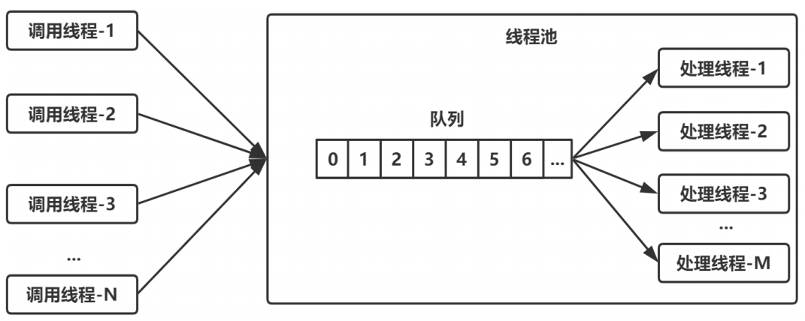

要实现这样一个线程池，有几个问题需要考虑：


# 10 线程池的类继承体系

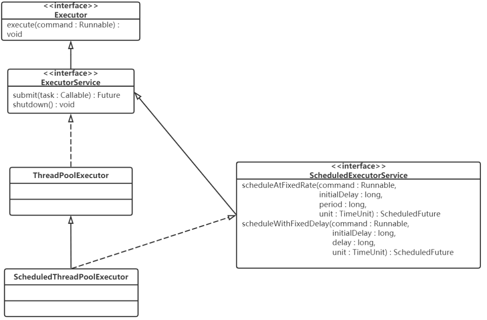

# 11 ThreadPoolExecutor

## 11.1 核心数据结构

```java
public class ThreadPoolExecutor extends AbstractExecutorService {    
	//...
	private final AtomicInteger ctl = new AtomicInteger(ctlOf(RUNNING, 0));    
	// 存放任务的阻塞队列
   	private final BlockingQueue<Runnable> workQueue;    
   	// 对线程池内部各种变量进行互斥访问控制
   	private final ReentrantLock mainLock = new ReentrantLock();    
   	// 线程集合
   	private final HashSet<Worker> workers = new HashSet<Worker>();    
   	//...
}
```


## 11.2 核心配置参数解释

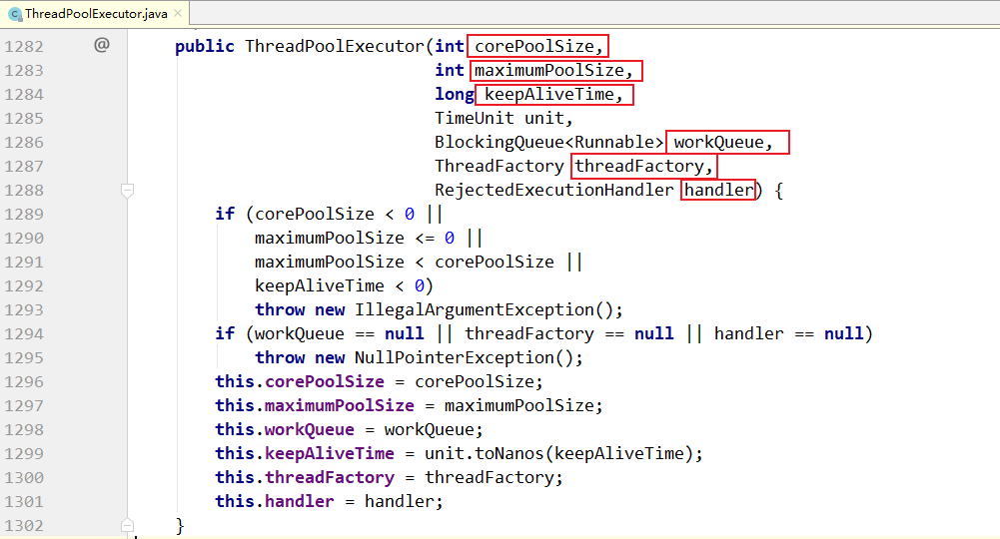

上面各个参数：


## 11.3 线程池的优雅关闭

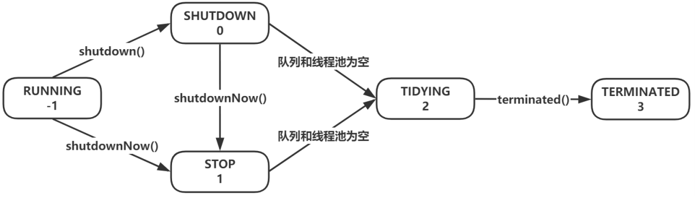

## 11.4 任务的提交过程分析

提交任务的方法如下：

```

```


## 11.5 任务的执行过程分析

## 11.6 线程池的4中拒绝策略

在execute(Runnable command)的最后，调用reject(command)执行拒绝策略，代码如下：

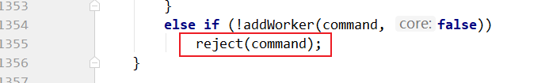

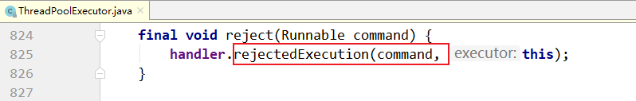

handler就是可以设置的拒绝策略管理器：

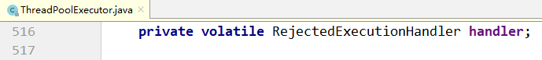

RejectedExecutionHandler是一个接口，定义了四种实现，分别对应四种不同放入拒绝策略，默认是：`AbortPolicy`

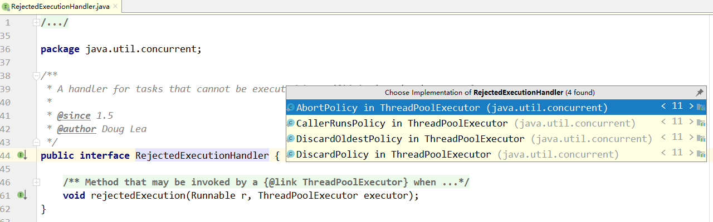

ThreadPoolExecutor类中默认的实现是：

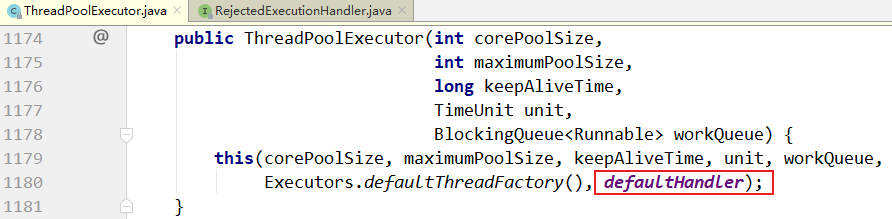

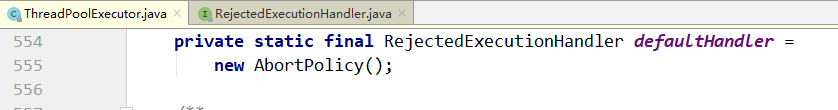

四种策略的实现代码如下：

### 11.6.1 策略一 CallerRunsPolicy

调用者直接在自己的线程里执行，线程池不处理。

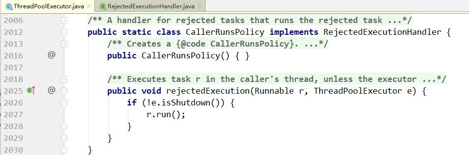

### 11.6.2 策略二

线程池抛异常：AbortPolicy

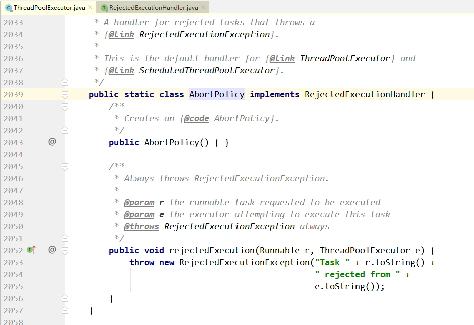

### 11.6.3 策略三

线程池直接丢任务，神不知鬼不觉：

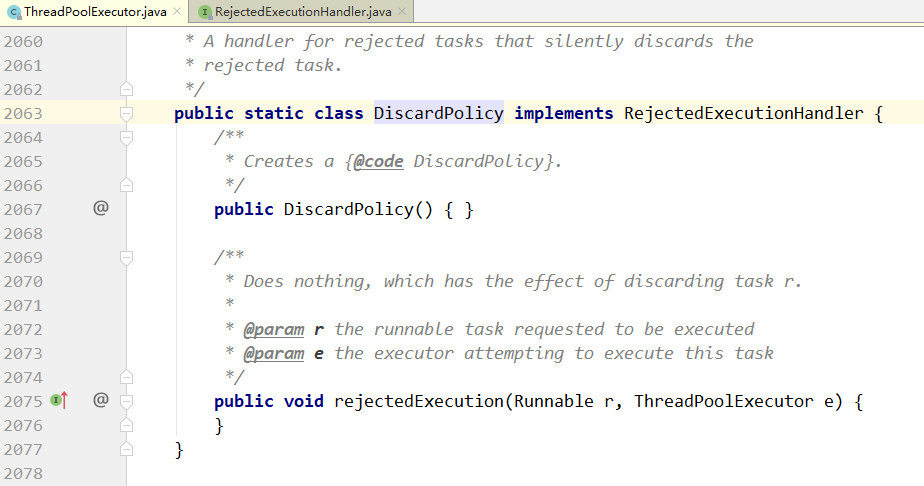

### 11.6.4 策略四

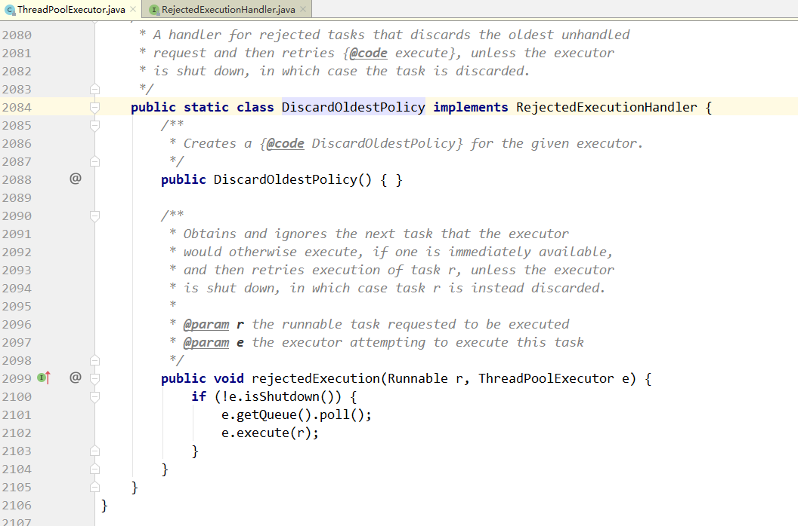


示例程序：

```java
package com.turbo.concurrent.demo;

import java.util.concurrent.ArrayBlockingQueue;
import java.util.concurrent.ThreadPoolExecutor;
import java.util.concurrent.TimeUnit;

public class ThreadPoolExecutorDemo {

    public static void main(String[] args) {
        ThreadPoolExecutor executor = new ThreadPoolExecutor(
                3,
                5,
                1,
                TimeUnit.SECONDS,
                new ArrayBlockingQueue<>(3),
                //new ThreadPoolExecutor.AbortPolicy()
                //new ThreadPoolExecutor.CallerRunsPolicy()
                //new ThreadPoolExecutor.DiscardPolicy()
                new ThreadPoolExecutor.CallerRunsPolicy());


        for (int i = 0; i < 20; i++) {
            int finali = i;
            executor.execute(new Runnable() {
                @Override
                public void run() {
                    System.out.println(Thread.currentThread().getId() + "["+finali+"] - 开始");
                    try {
                        Thread.sleep(5000);
                    } catch (InterruptedException e) {
                        e.printStackTrace();
                    }
                    System.out.println(Thread.currentThread().getId() + "["+finali+"] - 结束");
                }
            });
            try {
                Thread.sleep(200);
            } catch (InterruptedException e) {
                e.printStackTrace();
            }
        }

        executor.shutdown();
        boolean flag = true;

        try {
            do {
                flag = executor.awaitTermination(1,TimeUnit.SECONDS);

            }while (false);
        } catch (InterruptedException e) {
            e.printStackTrace();
        }

        System.out.println("线程池关闭成功...");
        System.out.println(Thread.currentThread().getId());
    }
}
```


# 12 Executors工具类

## 12.1 四种对比

## 12.2 最佳实践

# 13 ScheduledThreadPoolExecutor

## 13.1 延迟执行和周期性执行的原理

## 13.2 延迟执行

## 13.3 周期性执行

# 14 CompletableFuture用法

## 14.1 runAsync与supplyAsync

## 14.2 thenRun、thenAccept和thenApply

## 14.3 thenCompose与thenCombine

## 14.4 任意个ConpletableFuture的组合

## 14.5 四种任务原型

| 四种任务原型 | 无参数                                            | 有参数                                     |
| ------------ | ------------------------------------------------- | ------------------------------------------ |
| 无返回值     | Runnable接口<br>对应的提交方法：runAsync，thenRun | Consumer接口<br>对应的提交方法：thenAccept |
| 有返回值     | Supplier接口：<br>对应的提交方法：supplierAsync   | Function接口<br>对应的提交方法：thenApply  |


## 14.6. CompletionStage接口

## 14.7 CompletableFuture内部原理


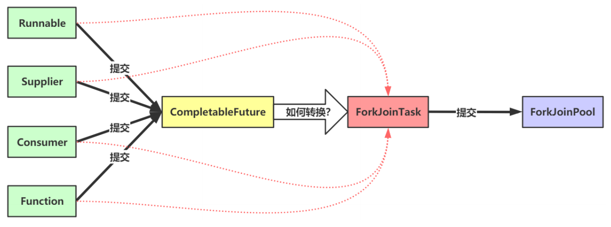

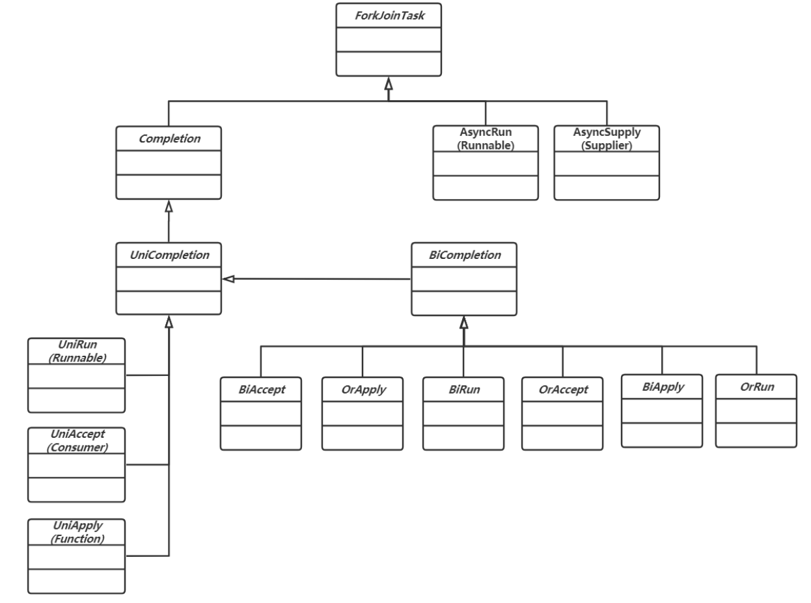

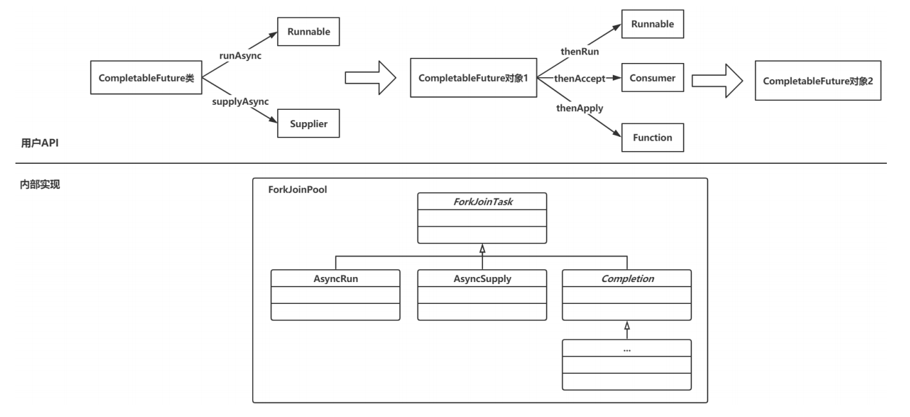


## 14.8 任务的网状执行：有向无环图

## 14.9 allOf内部的计算图分析