第三部分 线程池与Future

# 9 线程池的实现原理

下图所示为线程池的实现原理：调用方不断地向线程池中提交任务；线程池中有一组线程，不断地从队列中取任务，这是一个典型地生产者-消费者模型。


要实现这样一个线程池，有几个问题需要考虑：

1. 队列设置多长？如果是无限的，调用方不断往队列中放任务，可能导致内存耗尽。如果是有限的，当队列满了之后，调用方如何处理。
2. 线程池中的线程个数是固定的，还是动态变化的？
3. 每次提交新任务，是放入队列？还是开新线程？
4. 当没有任务的时候，线程是睡眠一小段时间，还是进入阻塞？如果进入阻塞，如何唤醒？

对对问题4，有三种做法：

1. 不使用阻塞队列，只是用一般的线程安全的队列，也无阻塞/唤醒机制。当队列为空时，线程池中的线程只能睡眠一会儿，然后醒来去看队列中有没有新任务到来，如此不断循轮询。
2. 不适用阻塞队列，在在队列外部，线程池内部实现阻塞/唤醒机制。
3. 使用阻塞队列。

显然，做法3最完善，即避免了线程池内部自己实现阻塞/唤醒机制的麻烦，也避免了做法1的睡眠/轮询带来的资源消耗和延迟。正因如此，接下来的ThreadPoolExecutor/ScheduledThreadPoolExecutor都是基于阻塞队列来实现的，各式各样的阻塞队列就要排上用场了。

# 10 线程池的类继承体系

线程池的类继承体系如下：


在这里，有两个核心的类：`ThreadPoolExecutor`和`ScheduledThreadPoolExecutor`，后者不仅可以执行某个任务，还可以周期性地执行任务。

向线程池中提交地每个任务，都必须实现`Runnable`接口，通过最上面的`Executor`接口中的`execute(Runnable command)`向线程池提交任务。

然后，在`ExecutorService`中，定义了线程池的关闭接口`shutdown()`，还定义了可以有返回值的任务，也就是`Callable`。


# 11 ThreadPoolExecutor

## 11.1 核心数据结构

基于线程池的实现原理，下面看一下ThreadPoolExecutor的核心数据结构。

```java
public class ThreadPoolExecutor extends AbstractExecutorService {    
	//...
	private final AtomicInteger ctl = new AtomicInteger(ctlOf(RUNNING, 0));    
	// 存放任务的阻塞队列
   	private final BlockingQueue<Runnable> workQueue;    
   	// 对线程池内部各种变量进行互斥访问控制
   	private final ReentrantLock mainLock = new ReentrantLock();    
   	// 线程集合
   	private final HashSet<Worker> workers = new HashSet<Worker>();    
   	//...
}
```

每一个线程是一个Worker对象。Worker是ThreadPoolExecutor的内部类，核心数据结构如下：

```java
private final class Worker extends AbstractQueuedSynchronizer implements Runnable {
    // ...
    final Thread thread; // Worker封装的线程
    Runnable firstTask; // Worker接收到的第1个任务
    volatile long completedTasks; // Worker执行完毕的任务个数    
    // ...
}
```

由定义会发现，Worker继承于AQS，也就是说Worker本身就是一把锁。这把锁有什么用处？用于线程池的关闭、线程执行任务的过程中。

## 11.2 核心配置参数解释

ThreadPoolExecutor在其构造方法中提供了几个核心配置参数，来配置不同策略的线程池。


上面各个参数：

1. corePoolSize：在线程池中始终维护的线程个数。
2. maximumPoolSize：在corePoolSize已满，队列也满的情况下，扩充线程至此值。
3. keepAliveTime/TimeUnit：maximumPoolSize中的空闲线程，销毁所需的时间，总线程数收缩回corePoolSize。
4. BlockingQueue：线程池所用的队列类型。
5. threadFactory：线程创建工厂，可以自定义，有默认值`Executors.defaultThreadFactory()`。
6. RejectedExecutionHandler：corePoolSize已满，队列已满，maximumPoolSize已满，最后的拒绝策略。

下面来看这6个配置参数在任务的提交过程中是怎样运行的。在每次往线程池中提交任务的时候，有如下的处理流程：

> 步骤一：判断当前线程数是否大于或等于corePoolSize。如果小于，则新建线程执行；如果大于，则进入步骤二。
>
> 步骤二：判断队列是否已满，如未满，则放入；如已满，则进入步骤三。
>
> 步骤三：判断当前线程数是否大于或等于maximumPoolSize。如果小于，则新建线程执行；如果大于，则进入步骤四。
>
> 步骤四：根据拒绝策略，拒绝任务。

总结一下：首先判断corePoolSize，其次判断BlockingQueue是否已满，接着判断maximumPoolSize，最后使用拒绝策略。

很显然，基于这种流程，如果队列是无限的，将永远不会走到步骤三，也即maximumPoolSize没有使用，也一定不会走到步骤四。

## 11.3 线程池threadFactory的优雅关闭

线程池的关闭，较之线程的关闭更加复杂。当关闭一个线程池的时候，有的线程还处于正在执行某个任务，有的调用者正在向线程池提交任务，并且队列中可能还有未执行的任务。因此，关闭过程不可能是瞬时的，而是需要一个平滑的过度，这就涉及线程池的完整生命周期关闭。

### 11.3.1 线程池的生命周期

在JDK 7中，把线程数量（workerCount）和线程池状态（runState）这两个变量打包存储在一个字段里面，即ctl变量。如下，最高的3位存储线程池状态，其余29位存储线程个数。而在JDK 6中，这两个变量是分开存储的。

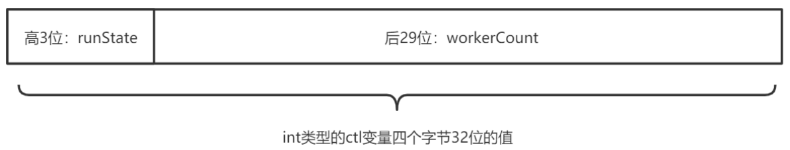

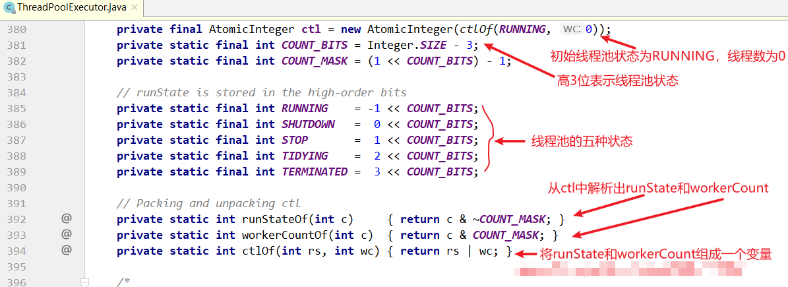

由上面的代码可以看到，ctl变量被拆成两半，最高的3位用来表示线程池的状态，低29位表示线程的个数。线程池的状态有5中，分别是：RUNNING、SHUTDOWN、STOP、TIDYING、TERMINATED。


下面分析状态之间的迁移过程，如图：


线程池有两个关闭方法，shutdown()/shutdownNow()，这两个方法会让线程池切换到不同的状态。在队列为空，线程池为空之后，进入TIDYING状态；最后执行一个钩子方法terminated()，进入TERMINATED状态，线程池才真正关闭。

这里的状态迁移有一个非常关键的特征，从小到达迁移，-1，0，1，2，3，只会从小的状态值往大的状态值迁移，不会逆向迁移。例如，当线程的状态在TIDYING=2时，接下来只可能到TERMINATED=3，不可能迁移回STOP=1或者其他状态。

除terminated()之外，线程池还提供了其他几个钩子方法，这些方法的实现都是空的。如果想实现自己的线程池，可以重写这几个方法：

```java
protected void beforeExecute(Thread t, Runnable r) { }
protected void afterExecute(Runnable r, Throwable t) { }
protected void terminated() { }
```

### 11.3.2 正确关闭线程池的步骤

关闭线程池的过程为：在调用shutdown()或者shutdownNow()之后，线程池并不会立即关闭，接下来需要调用awaitTermination()来等待线程池关闭。关闭线程池的正确步骤如下：

```java
// executor.shutdownNow(); 
executor.shutdown();
try {
    boolean flag = true;    
    do {
        flag = ! executor.awaitTermination(500, TimeUnit.MILLISECONDS);    
    } while (flag);
} catch (InterruptedException e) {    
    // ...
}
```

awaitTermination(...)方法的内部实现很简单，如下所示。不断循环判断线程池是否到达了最终状态TERMINATED，如果是，就返回；如果不是，则通过termination条件变量阻塞一段时间，之后继续判断。

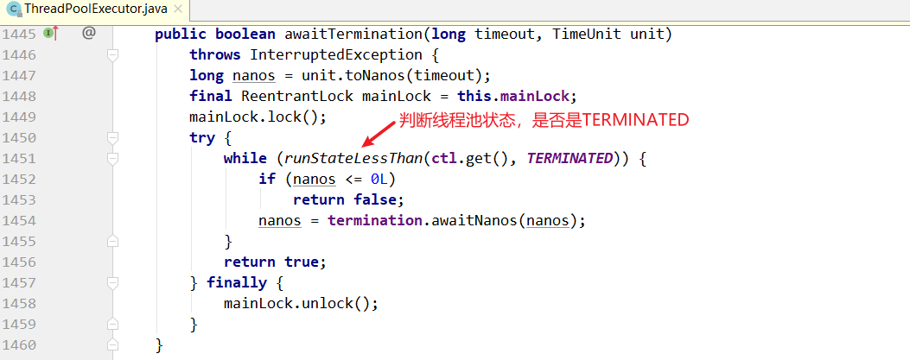

### 11.3.3 shutdown()与shutdownNow()的区别

1. shutdown()不会清空任务队列，会等待所有任务执行完成，shutdownNow()会清空任务队列。
2. shutdown()只会中断空闲线程，shutdownNow()会中断所有线程。


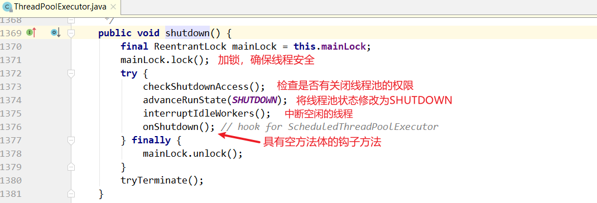

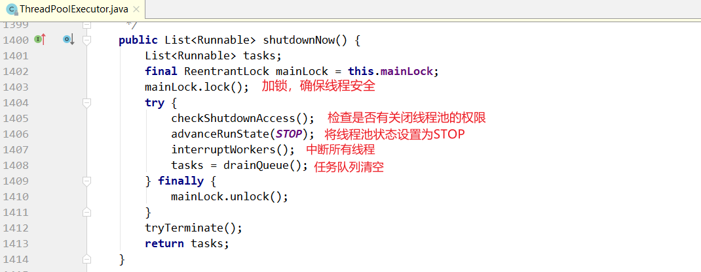


下面看一下在上面的代码里中断空闲线程和中断所有线程的区别。

shutdown()方法中的interruptIdleWorkers()方法的实现：

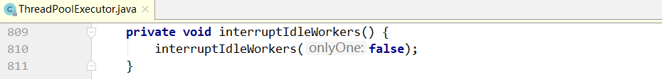

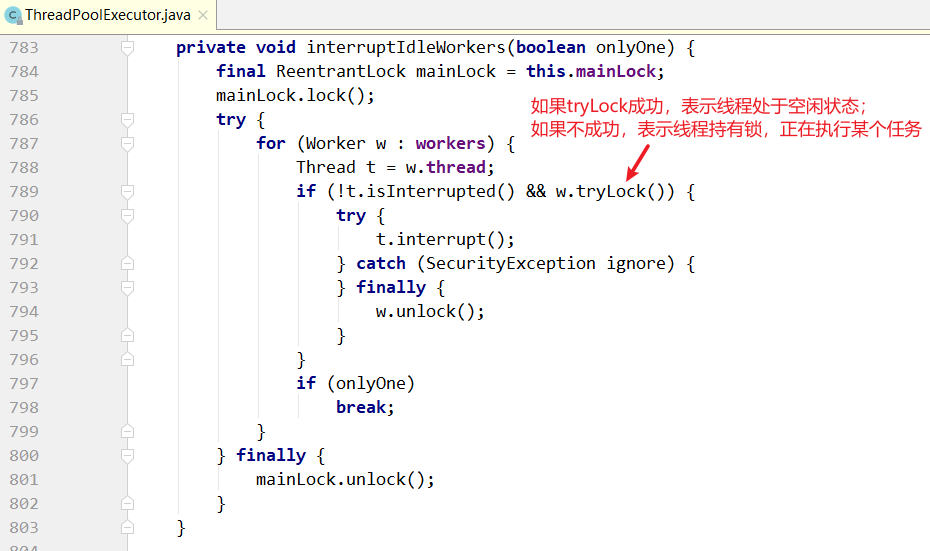

关键区别在于tryLock()：一个线程在执行一个任务之前，会先加锁，这意味着通过是否持有锁，可以判断处线程是否处于空闲状态。tryLock()如果调用成功，说明线程处于空闲状态，向其发送中断信号；否则不发送。

tryLock()方法

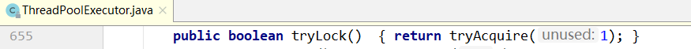

tryAcquire方法：

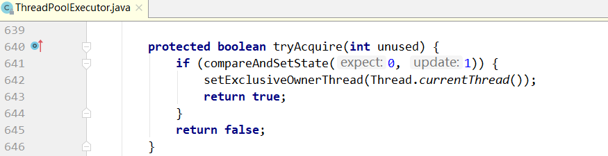


shutdownNow()调用了`interruptWorkers()`方法：

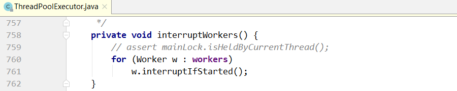

interruptIfStarted()方法的实现：

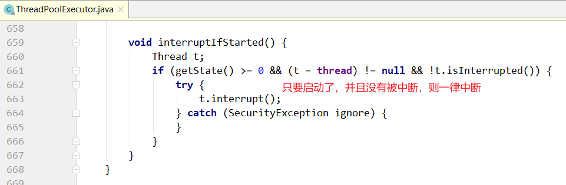

在上面的代码中，shutdown()和shutdownNow()都调用了tryTerminate()方法，如下：

```java
final void tryTerminate() {
    for (;;) {
        int c = ctl.get();
        if (isRunning(c) || runStateAtLeast(c, TIDYING) || 
           (runStateLessThan(c, STOP) && ! workQueue.isEmpty()))
            return;
        if (workerCountOf(c) != 0) { // Eligible to terminate
            interruptIdleWorkers(ONLY_ONE);
            return;
        }

        // 当workQueue为空，workCount为0时，执行下述代码。
        final ReentrantLock mainLock = this.mainLock;
        mainLock.lock();
        try {
            // 将状态切换到TIDYING状态
            if (ctl.compareAndSet(c, ctlOf(TIDYING, 0))) {
                try {
                    terminated(); // 调用钩子函数
                } finally {
                    ctl.set(ctlOf(TERMINATED, 0)); // 将状态有TIDYING改为TERMINATED
                    termination.signalAll(); // 通知awaitTermination(...)
                }
                return;
            }
        } finally {
            mainLock.unlock();
        }
        // else retry on failed CAS
    }
}
```

tryTerminate()不会强行终止线程池，只是做了一下检测；当workQueue为空，workCount为0时，先把状态切换到TIDYING，然后调用钩子方法terminated()。当钩子方法执行完成时，把状态从TIDYING改为TERMINATED，接着调用termination.signalAll()，通知前面阻塞在awaitTermination的所有调用者线程。

所以，TIDYING和TERMINATED的区别是在二者之间执行了一个钩子方法terminated()，目前是一个空实现。

## 11.4 任务的提交过程分析

提交任务的方法如下：

```java
public void execute(Runnable command) {
    if (command == null)
        throw new NullPointerException();
        
    int c = ctl.get();
    // 如果当前线程数小于corePoolSize，则启动新线程
    if (workerCountOf(c) < corePoolSize) {
        // 添加worker,并将command设置为worker线程的第一个任务开始执行
        if (addWorker(command, true))
            return;
        c = ctl.get();
    }
    // 如果当先的线程数大于或等于corePoolSize，则调用workQueue.offer放入队列
    if (isRunning(c) && workQueue.offer(command)) {
        int recheck = ctl.get();
        // 如果线程池正在停止，则将command任务从队列移除，并拒绝command任务请求
        if (! isRunning(recheck) && remove(command))
            reject(command);
        // 放入队列中后发现没有线程执行任务，开启新线程
        else if (workerCountOf(recheck) == 0)
            addWorker(null, false);
    }
    // 线程数大于maxPoolSize，并且队列已满，则调用拒绝策略
    else if (!addWorker(command, false))
        reject(command);
}
```

```java
// 该方法用于启动新线程。如果第二个参数为true,则使用corePoolSize作为上线，否则使用maxPoolSize作为上线
private boolean addWorker(Runnable firstTask, boolean core) {
    retry:
    for (int c = ctl.get();;) {
        // 如果线程池状态值 起码是SHUTDOWN和STOP，或则第一个任务不是null,或者工作队列为空
        // 则添加worker失败，返回false
        if (runStateAtLeast(c, SHUTDOWN)
            && (runStateAtLeast(c, STOP)
                || firstTask != null
                || workQueue.isEmpty()))
            return false;

        for (;;) {
            // 工作线程数达到上线，要么是corePoolSize要么是maximumPoolSize，启动线程失败
            if (workerCountOf(c)
                >= ((core ? corePoolSize : maximumPoolSize) & COUNT_MASK))
                return false;
            // 增加worker数量成功，返回到retry语句
            if (compareAndIncrementWorkerCount(c))
                break retry;
            c = ctl.get();  // Re-read ctl
            // 如果线程池运行状态起码是SHUTDOWN,则重试retry标签语句，CAS
            if (runStateAtLeast(c, SHUTDOWN))
                continue retry;
            // else CAS failed due to workerCount change; retry inner loop
        }
    }

    // worker数量加1成功后，接着运行
    boolean workerStarted = false;
    boolean workerAdded = false;
    Worker w = null;
    try {
        // 新建worker对象
        w = new Worker(firstTask);
        // 获取线程对象
        final Thread t = w.thread;
        if (t != null) {
            final ReentrantLock mainLock = this.mainLock;
            // 加锁
            mainLock.lock();
            try {
                // Recheck while holding lock.
                // Back out on ThreadFactory failure or if
                // shut down before lock acquired.
                int c = ctl.get();

                if (isRunning(c) ||
                    (runStateLessThan(c, STOP) && firstTask == null)) {
                    // 由于线程已经在运行中，无法启动，抛异常
                    if (t.isAlive()) // precheck that t is startable
                        throw new IllegalThreadStateException();
                    // 将线程对应的worker加入worker集合
                    workers.add(w);
                    int s = workers.size();
                    if (s > largestPoolSize)
                        largestPoolSize = s;
                    workerAdded = true;
                }
            } finally {
                // 释放锁
                mainLock.unlock();
            }
            // 如果添加worker成功，则启动该worker对应的线程
            if (workerAdded) {
                t.start();
                workerStarted = true;
            }
        }
    } finally {
        // 如果启动新线程失败
        if (! workerStarted)
            // workCount - 1
            addWorkerFailed(w);
    }
    return workerStarted;
}
```


## 11.5 任务的执行过程分析

在上面的任务提交过程中，可能会开启一个新的Worker，并把任务本身作为firstTask赋给该Worker。但对于一个Worker来说，不是只执行一个任务，而是源源不断地从队列中取出任务执行，这是一个不断循环地过程。

下面来看Worker的run()方法的实现过程：

```java
private final class Worker extends AbstractQueuedSynchronizer implements Runnable {
    // 当前worker对象封装的线程
    final Thread thread;
    // 线程需要运行的第一个任务。可以是null，如果是null，则线程从队列获取任务    
    Runnable firstTask;
    // 记录线程执行完成的任务数量，每个线程一个计数器   
    volatile long completedTasks;
    
    /**
     * 适应给定的第一个任务并利用线程工厂创建Worker实例
     * @param firstTask 线程的第一个任务，如果没有，就设置为null，此时线程会从队列获取任务
     */
    Worker(Runnable firstTask) {
        setState(-1); // 线程处于阻塞状态，调用runWorker的时候中断
        this.firstTask = firstTask;
        this.thread = getThreadFactory().newThread(this);
    }
    // 调用ThreadPoolExecutor的runWorker方法执行线程的运行   
    public void run() {
        runWorker(this);
    }
    
    final void runWorker(Worker w) {
        Thread wt = Thread.currentThread();
        Runnable task = w.firstTask;
        w.firstTask = null;
        // 中断Worker封装的线程
        w.unlock(); // allow interrupts
        boolean completedAbruptly = true;
        try {
            // 如果线程初始任务不是null,或者从队列获取的任务不是null，表示该线程应该执行任务。
            while (task != null || (task = getTask()) != null) {
                // 获取线程锁
                w.lock();
                // 如果线程池停止了，去报线程被中断
                // 如果线程池正在运行，确保线程不被中断
                if ((runStateAtLeast(ctl.get(), STOP) ||
                     (Thread.interrupted() &&
                      runStateAtLeast(ctl.get(), STOP))) &&
                    !wt.isInterrupted())
                    // 获取到任务后，再次检查线程池状态，如果发现线程池已经停止，给自己发中断信号
                    wt.interrupt();
                try {
                    // 任务执行之前的钩子方法，实现为空
                    beforeExecute(wt, task);
                    try {
                        task.run();
                        // 任务执行结束后的钩子方法，实现为空
                        afterExecute(task, null);
                    } catch (Throwable ex) {
                        afterExecute(task, ex);
                        throw ex;
                    }
                } finally {
                    // 任务执行完成，将task设置为null
                    task = null;
                    // 线程已完成的任务数加1
                    w.completedTasks++;
                    // 释放线程锁
                    w.unlock();
                }
            }
            // 判断线程是否正常退出
            completedAbruptly = false;
        } finally {
            // Worker退出
            processWorkerExit(w, completedAbruptly);
        }
    }
}
```

### 11.5.1 shutdown()与任务执行过程综合分析

把任务的执行过程和上面的线程池的关闭过程结合起来进行分析，当调用shutdown()的时候，可能出现以下几种场景：

1. 当调用shutdown()的时候，所有线程都处于空闲状态。

   这意味着任务队列一定是空的。此时，所有线程都会阻塞在getTask()方法的地方。然后，所有线程都会收到interruptIdleWorkers()发来的中断信号，getTask()返回null，所有Worker都会退出while循环，之后执行processWorkerExit。

2. 当调用shutdown的时候，所有线程都处于忙碌状态。

   此时，队列可能是空的，也可能是非空的。interruptIdleWorkers()内部的tryLock调用失败，什么都不会做，所有线程会继续执行自己当前的任务。之后所有线程会执行完队列中的任务，直到队列为空，getTask()才会返回null。之后，就和场景1一样，退出while循环。

3. 当调用shutdown()的时候，部分线程忙碌，部分线程空闲。

   有部分线程空闲，说明队列一定是空的，这些线程肯定阻塞在getTask()方法的地方。空闲的这些线程和场景1一样处理，不空闲的线程会和场景2一样处理。


下面看一下getTask()方法的内部细节：

```java
private Runnable getTask() {
    boolean timedOut = false; // Did the last poll() time out?

    for (;;) {
        int c = ctl.get();

        // 如果线程池调用了shutdownNow(),返回null
        // 如果线程池调用了shutdown()，并且任务队列为空，也返回null
        if (runStateAtLeast(c, SHUTDOWN)
            && (runStateAtLeast(c, STOP) || workQueue.isEmpty())) {
            // 工作线程数减1
            decrementWorkerCount();
            return null;
        }

        int wc = workerCountOf(c);

        // Are workers subject to culling?
        boolean timed = allowCoreThreadTimeOut || wc > corePoolSize;

        if ((wc > maximumPoolSize || (timed && timedOut))
            && (wc > 1 || workQueue.isEmpty())) {
            if (compareAndDecrementWorkerCount(c))
                return null;
            continue;
        }

        try {
            // 如果队列为空，就会阻塞pool或者take，前者有超时时间，后者没有超时时间
            // 一旦中断。此处抛异常，对应上文场景1
            Runnable r = timed ?
                workQueue.poll(keepAliveTime, TimeUnit.NANOSECONDS) :
                workQueue.take();
            if (r != null)
                return r;
            timedOut = true;
        } catch (InterruptedException retry) {
            timedOut = false;
        }
    }
}
```


### 11.5.2 shutdownNow()与任务执行过程综合分析

和上面的shutdown()类似，只是多了一个环节，即清空任务队列。如果一个线程正在执行某个业务代码，即使向它发送中断信号，也没有用，只能等它把代码执行完成。因此，中断空闲线程的中断所有线程的区别并不是很大，除非线程当前刚好阻塞在某个地方。

当一个Worker最终退出的时候，会执行清理工作：

```java
private void processWorkerExit(Worker w, boolean completedAbruptly) {
    // 如果线程正常退出，不会执行if语句，这里一般是非正常退出，需要将worker数量减1
    if (completedAbruptly) // If abrupt, then workerCount wasn't adjusted
        decrementWorkerCount();

    final ReentrantLock mainLock = this.mainLock;
    mainLock.lock();
    try {
        completedTaskCount += w.completedTasks;
        // 将自己的worker从集合移除
        workers.remove(w);
    } finally {
        mainLock.unlock();
    }
    // 每个线程在结束的时候都会用该方法，看是否可以停止线程池
    tryTerminate();

    int c = ctl.get();
    // 如果在线程池退出前，发现线程池还没有关闭
    if (runStateLessThan(c, STOP)) {
        if (!completedAbruptly) {
            int min = allowCoreThreadTimeOut ? 0 : corePoolSize;
            // 如果线程池中没有其他线程来，并且任务队列非空
            if (min == 0 && ! workQueue.isEmpty())
                min = 1;
            // 如果工作线程数大于min，表示队列中的任务可以由其他线程执行，退出当前线程
            if (workerCountOf(c) >= min)
                return; // replacement not needed
        }
        // 如果当前线程退出前发现线程池没有结束，任务队列不是空的，也没有其他线程来执行
        // 就再启动一个线程来处理
        addWorker(null, false);
    }
}
```


## 11.6 线程池的4中拒绝策略

在execute(Runnable command)的最后，调用reject(command)执行拒绝策略，代码如下：

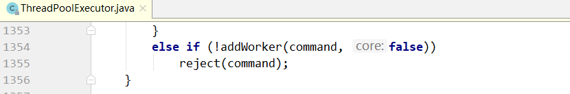


handler就是可以设置的拒绝策略管理器：


RejectedExecutionHandler是一个接口，定义了四种实现，分别对应四种不同放入拒绝策略，默认是：AbortPolicy。


ThreadPoolExecutor类中默认的实现是：


四种策略的实现代码如下：

### 11.6.1 策略一 CallerRunsPolicy

调用者直接在自己的线程里执行，线程池不处理。


### 11.6.2 策略二

线程池抛异常：AbortPolicy


### 11.6.3 策略三

线程池直接丢任务，神不知鬼不觉：


### 11.6.4 策略四

删除队列中最早的任务，将当前任务入队列：


示例程序：

```java
package com.turbo.concurrent.demo;

import java.util.concurrent.ArrayBlockingQueue;
import java.util.concurrent.ThreadPoolExecutor;
import java.util.concurrent.TimeUnit;

public class ThreadPoolExecutorDemo {

    public static void main(String[] args) {
        ThreadPoolExecutor executor = new ThreadPoolExecutor(
                3,
                5,
                1,
                TimeUnit.SECONDS,
                new ArrayBlockingQueue<>(3),
                //new ThreadPoolExecutor.AbortPolicy()
                //new ThreadPoolExecutor.CallerRunsPolicy()
                //new ThreadPoolExecutor.DiscardPolicy()
                new ThreadPoolExecutor.CallerRunsPolicy());


        for (int i = 0; i < 20; i++) {
            int finali = i;
            executor.execute(new Runnable() {
                @Override
                public void run() {
                    System.out.println(Thread.currentThread().getId() + "["+finali+"] - 开始");
                    try {
                        Thread.sleep(5000);
                    } catch (InterruptedException e) {
                        e.printStackTrace();
                    }
                    System.out.println(Thread.currentThread().getId() + "["+finali+"] - 结束");
                }
            });
            try {
                Thread.sleep(200);
            } catch (InterruptedException e) {
                e.printStackTrace();
            }
        }

        executor.shutdown();
        boolean flag = true;

        try {
            do {
                flag = executor.awaitTermination(1,TimeUnit.SECONDS);

            }while (false);
        } catch (InterruptedException e) {
            e.printStackTrace();
        }

        System.out.println("线程池关闭成功...");
        System.out.println(Thread.currentThread().getId());
    }
}
```


# 12 Executors工具类

concurrent包提供了Executors工具类，利用它可以创建各种 不同类型的线程池。

## 12.1 四种对比

单线程线程池：

固定数目线程的线程池：

每接收一个请求，就创建一个线程来执行：

单线程具有固定调度功能的线程池：

多线程，有调度公共的线程池：

## 12.2 最佳实践

不同类型的线程池，其实都是由前面的几个关键配置参数配置而成。

阿里巴巴Java开发手册中，禁止使用Executors创建线程池，并要求开发者直接使用ThreadPoolExecutor或ScheduledThreadPoolExecutor进行创建。这样做是为了强制开发者明确线程池的运行策略，使其对线程池的每个配置参数皆做到心中有数，以规避因使用不当而造成资源耗尽的风险。

# 13 ScheduledThreadPoolExecutor

ScheduledThreadPoolExecutor实现了按时间调度来执行任务：

> 1.延迟执行任务

> 2.周期执行任务


区别如下：

AtFixdRate：按固定频率执行，与任务本身运行时间无关。但有个前提条件，任务执行时间必须小于间隔时间，例如间隔时间是5s，每5s执行一次任务，任务的执行时间必须小于5s。

WithFixedDelay：按固定间隔执行，与任务半身执行时间有关，例如本身执行时间是10s，间隔2s，则下一次开始执行的时间是12s。

## 13.1 延迟执行和周期性执行的原理

## 13.2 延迟执行

## 13.3 周期性执行

# 14 CompletableFuture用法

## 14.1 runAsync与supplyAsync

## 14.2 thenRun、thenAccept和thenApply

## 14.3 thenCompose与thenCombine

## 14.4 任意个ConpletableFuture的组合

## 14.5 四种任务原型

| 四种任务原型 | 无参数                                            | 有参数                                     |
| ------------ | ------------------------------------------------- | ------------------------------------------ |
| 无返回值     | Runnable接口<br>对应的提交方法：runAsync，thenRun | Consumer接口<br>对应的提交方法：thenAccept |
| 有返回值     | Supplier接口：<br>对应的提交方法：supplierAsync   | Function接口<br>对应的提交方法：thenApply  |


## 14.6. CompletionStage接口

## 14.7 CompletableFuture内部原理


## 14.8 任务的网状执行：有向无环图

## 14.9 allOf内部的计算图分析