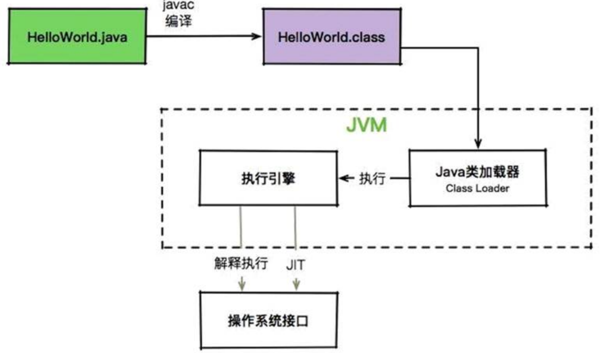

第一章 JVM回顾

# 1 什么是JVM

> 什么是JVM

JVM是Java Virtual Machine（Java虚拟机）的缩写，JVM是一种用于计算设备的规范，它是一个虚构出来的计算机，是通过再实际的计算机上仿真模拟各种计算机功能来实现的。

> 主流虚拟机

| 虚拟机名称  | 介绍                                                         |
| ----------- | ------------------------------------------------------------ |
| HotSpot     | Oracle/Sun JDK和Open JDK都使用HotSpot VM的相同核心           |
| J9          | J9是IBM开发的高度模块化的JVM                                 |
| **JRockit** | JRockit与HotSpot同属于Oracle，目前位置Oracle一直在推进HotSpot与JRockit<br>两款各有优势的虚拟机进行融合互补 |
| Zing        | 由Azul Systems根据HotSpot为基础改进的高性能低延迟的JVM       |
| Dalvik      | Android上的Dalvik 虽然名字不叫JVM，但骨子里就是不折不扣的JVM |

# 2 JVM与操作系统

> 为什么要在程序和操作系统中间添加一个JVM

Java是一门抽象程度特别高的语言，提供了自动内存管理等一系列的特性。这些特性直接在操作系统上实现是不太可能的，所以就需要JVM进行一番转换。


从图中可以看到，有了JVM这个抽象层之后，Java就可以实现跨平台了。JVM只需要保证能够正确执行.class文件，就可以运行在诸如Linux、Windows、MacOS等平台上了。

而Java跨平台的意义在于一次编译，处处运行，能够做到这一点JVM功不可没。比如在Maven仓库下载同一版本的jar包就可以到处运行，不需要再每个平台上在编译一次。

下载乃的一些JVM的扩展语言，比如Clojure、JRuby、Groovy等，编译到最后都是.class文件，Java语言的维护者，只需要控制好JVM这个解析器，就可以将这些扩展语言无缝的运行在JVM之上了。


> 应用程序、JVM、操作系统之间的关系


用一句话概括JVM与操作系统之间的关系：JVM上承开发语言，下接操作系统，它的中间接口就是字节码。

# 3 JVM、JRE、JDK的关系


JVM是Java程序能够运行的核心。但是需要注意，JVM自己什么也干不了，你需要给他提供生产原料（.class文件）。

仅仅是JVM，是无法完成一次编译，处处运行的。它需要一个基本的类库，比如怎么操作文件，怎么连接网络等。而Java体系很慷慨，会一次性将JVM运行所需的类库都传递给它。JVM标准加上实现的一大堆基础类库，就组成了Java的运行时环境，也就是常说的JRE（Java Runtime Environment）。

对于JDK来说，就更庞大了一些。除了JRE，JDK还提供了一些非常好用的小工具，比如javac、java、jar等。它是Java开发的核心，让外行也可以炼剑！

可以看下JDK的全拼，Java Development Kit。我们非常怕kit（装备）这个单词，它就像一个无底洞，预示着你永无休止的对它进行研究。JVM、JRE、JDK它们三者之间的关系，可以用一个包含关系表示。


# 4 Java虚拟机规范和Java语言规范的关系


左半部分是**Java虚拟机规范，其实就是为输入和执行字节码提供一个运行环境**。右半部分是Java语法规范，比如switch、for、泛型、lambda等相关的程序，追钟都会编译成字节码。而连接左右两部分的桥梁依然是Java的字节码。

如.class文件的规格是不变的，这两部分是可以独立进行优化的。但Java也会偶尔扩充一下.class文件的格式，增加一些字节码指令，以便支持更多的特性。

可以把Java虚拟机看作是一台抽象的计算机，它有自己的指令集以及各种运行时的内存区域，学过《计算机组成结构》的，会在后续课程中看到非常多的相似性。



这里的Java程序时文本格式的。遵循Java语言规范，调用了System.out等模块，也就是JRE里提供的类库。

使用JDK的工具javac进行编译后，会产生HelloWorld的字节码。Java字节码是沟通JVM与Java程序的桥梁，下面使用javap来稍微看一下字节码到底什么样子。

```
0: getstatic     #2                  // Field java/lang/System.out:Ljava/io/PrintStream;
3: ldc           #3                  // String hello world
5: invokevirtual #4                  // Method java/io/PrintStream.println:(Ljava/lang/String;)V
8: return

```

Java虚拟机采用基于栈的架构，其指令由操作码和操作数组成。这些<font color='red'>字节码指令</font>，就叫做opcode。其中getstatic、ldc、invokevirtual、return等，就是opcode，可以看到是比较容易理解的。

JVM就是靠解析这些opcode和操作数来完成程序的执行。当我们使用Java命令运行.class文件的时候，实际上就相当于启动了一个JVM进程。

然后JVM会翻译这些字节码，它有两种执行方式。常见的就是解释执行，将opcode+操作数翻译成机器代码；另外一种执行方式就是JIT，也就是常说的即时编译，它会在一定条件下将字节码编译成机器码之后再执行。


