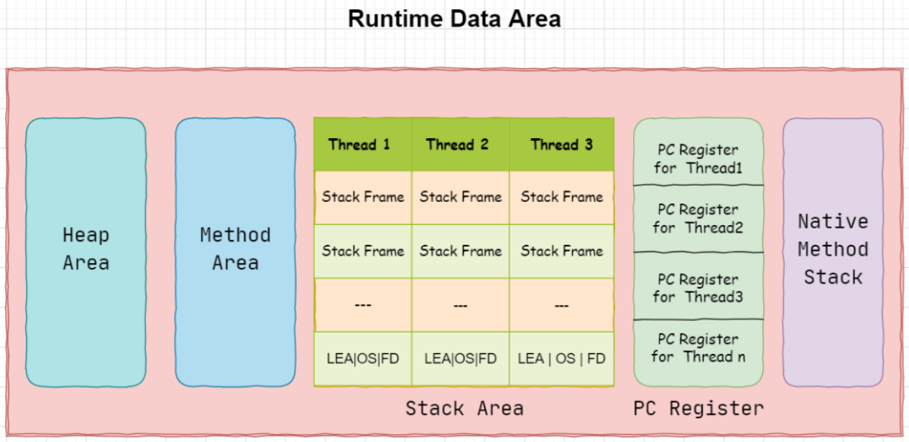

第二章 Java虚拟机的内存管理

# 5 JVM整体架构

> 根据JVM规范，JVM内存共分为虚拟机栈、堆、方法区、程序计数器、本地方法栈五个部分


| 名称       | 特征                                                     | 作用                                                         | 配置参数                                                     | 异常                                    |
| ---------- | -------------------------------------------------------- | ------------------------------------------------------------ | ------------------------------------------------------------ | --------------------------------------- |
| 程序计数器 | 占用内存小，线程私有，生命周期与线程相同                 | 大致为字节码行号指示器                                       | 无                                                           | 无                                      |
| 虚拟机栈   | 线程私有，生命周期与线程相同，**使用连续的内存空间**     | Java方法执行的内存模型，存储局部变量表、动态连接、方法出口等信心 | -Xss                                                         | StackOverflowError/<br>OutOfMemoryError |
| 堆         | 线程共享，生命周期与虚拟机相同，可以不使用连续的内存地址 | 保存对象实例，所有对象实例（包括数组）都要在堆上分配         | -Xms -Xsx -Xmn                                               | OutOfMemoryError                        |
| 方法区     | 线程共享，生命周期与虚拟机相同，可以不适用连续的内存地址 | 存储已被虚拟机加载的类信息、常量、静态变量、即时编译器编译后的代码等数据 | -XX:PermSize:16M-<br>XX:MaxPermSize64M/-<br>XX:MetaspaceSize=16M-<br>XX:MaxMetaspaceSize=64M | OutOfMemoryError                        |
| 本地方法栈 | 线程私有                                                 | 为虚拟仅使用到的Native方法服务                               | 无                                                           | StackOverflowError/<br>OutOfMemoryError |

> JVM分为五大模块：<font color='#ed1c24'>**类装载器子系统**</font>、<font color='#ed1c24'>**运行时数据区**</font>、<font color='#ed1c24'>**执行引擎**</font>、<font color='#ed1c24'>**本地方法接口**</font>和<font color='#ed1c24'>**垃圾收集模块**</font>


# 6 JVM运行时内存

Java虚拟机有内存管理机制，如果出现面的问题，排查错误就必须要了解虚拟机是怎样使用内存的。


**Java7和Java8内存结构的不同，主要体现在方法区的实现**

方法区是Java虚拟机规范中定义的一种概念上的区域，不同的厂商可以对虚拟机进行不同的实现。

我们通常使用的Java SE都是由Sun JDK和Open JDK所提供，这也是应用最广泛的版本。而该版本使用的VM就是HotSpot VM。通常情况下，我们所讲的Java虚拟机指的就是HotSpot的版本。

> JDK 7内存结构


> JDK 8的内存结构


针对JDK8虚拟机内存详解


> JDK 7和JDK 8变化小结


```
线程私有的：
 1程序计数器
 2虚拟机栈
 3本地方法栈
线程共享的：
 1堆
 2方法区
 直接内存（非运行时数据区的一部分）
```

**对于Java8，HotSpot取消了永久代，那么是不是就没有方法区了呢？**

当然不是，方法区只是一个规范，只不过它的实现变了。

在Java8中，元空间（Metaspace）登上舞台，方法区存在于元空间（Metaspace）。同时，元空间不再与堆连续，而且是存在于本地内存（Native memory）。

**方法区Java8之后的变化**

- 移除了永久代（PermGen），替换为元空间（Metaspace）
- 永久代中的class metadata（类元信息）转移到了native memory（本地内存，而不是虚拟机）
- 永久代中的interned Strings（字符串常量池）和class static variables（类静态变量）转移到了Java heap
- 永久代参数（PermSize MaxPermSize）-> 元空间参数（MetaspaceSize MaxMetaspaceSize）

**Java 8为什么要将永久代替换成Metaspace？**

- 字符串存在永久代中，容易出现性能问题和内存溢出。
- 类及方法的信息等比较难确定其大小，因此对于永久代的大小指定比较困难，太小容易出现永久代溢出，太大则容易导致老年代溢出。
- 永久代会为GC带来不必要的复杂度，并且回收效率偏低。
- Oracle可能会将HotSpot与JRockit合二为一，JRockit没有所谓的永久代。


## 6.1 PC程序计数器

> 什么是程序计数器

程序计数器（Program Counter Register）：也叫PC寄存器，是一块较小的内存空间，它可以看作是当前线程所执行的字节码的行号指示器。在虚拟机的概念里，字节码解释器工作时就是通过改变这个计数器的值来选取下一条需要执行的字节码指令，分支、循环、跳转、异常处理、线程恢复等基础概念都需要依赖这个计数器来完成。

> PC寄存器的特点

（1）区别于计算机硬件的pc寄存器，两者略有不同。计算机用pc寄存器来存放"伪指令"或地址，而相对于虚拟机，pc寄存器它变现为一块内存，虚拟机的pc寄存器的功能也是存放伪指令，更确切地说存放的是将要执行指令的地址。

（2）当虚拟机正在执行的方法是一个本地（native）方法时，jvm的pc寄存器存储的值是undefined。

（3）程序计数器是线程私有的，它的生命周期与线程相同，每个线程都有一个。

（4）此内存区域是唯一一个在Java虚拟机规范中没有规定任何OutOfMemoryError情况的区域。


Java虚拟机的多线程是通过线程轮流切换并分配处理器执行时间的方式来实现的，在任何一个确定的时刻，一个处理器只会执行一条线程中的执行。

因此，为例线程切换后能恢复到正确的执行位置，每条线程都需要有一个独立的程序计数器，各条线程之间的计数器互不影响，独立存储，称这类内存区域为"线程私有"的内存。

## 6.2 虚拟机栈

> 1.什么是虚拟机栈

**Java虚拟机栈（Java Virtual Machine Stacks）也是线程私有的**，即生命周期和线程相同。Java虚拟机栈**和线程同时创建，用于存储栈帧。**每个方法在执行时都会创建一个**栈帧（Stack Frame）**，用于存储**局部变量表、操作数栈、动态链接、方法出口**等信息。每一个方法从调用直到执行完成的过程就对应着一个栈帧在虚拟机栈中从入栈到出栈的过程。


> 2.什么是栈帧

栈帧（Stack Frame）是用于支持虚拟机进行方法调用和方法执行的数据结构。栈帧存储了方法的局部变量表、操作数栈、动态链接和方法返回地址等信息。每一个方法从调用至执行完成的过程，都对应着一个栈帧在虚拟机栈里从入栈到出栈的过程。


> 3.设置虚拟机栈的大小

-Xss为jvm启动的每个线程分配内存大小，默认JDK1.4中是256K，JDK1.5+中是1M。

- Linux/x64（64-bit）：1024KB
- macOS(64-bit)：1024KB
- Oracle Solaris/x64(64-bit)：1024KB
- Windows：The default value depends on virtual memory

```
-Xss1m 
-Xss1024k 
-Xss1048576
```

```java
public class StackTest {
    static long count = 0 ;

    public static void main(String[] args) {
        count++;
        System.out.println(count); //8467
        main(args);
    }
}
```


> 4.局部变量表

局部变量表（Local Variable Table）是一组变量存储空间，用于存放方法参数和方法内定义的局部变量。包括8中基本数据类型，对象引用（reference类型）和returnAddress类型（指向一条字节码指令的地址）。

其中64位长度的long和double类型的数据会占用2个局部变量空间（Slot），其余的数据类型只占用1个。

> 5.操作数栈

操作数栈（Operand Stack）也称作操作栈，是一个后入先出栈（LIFO）。随着方法执行和字节码指令的执行，会从局部变量表或对象实例的字段中复制常量或变量写入到操作数栈，再随着计算的进行将栈中元素出栈到局部变量表或者返回给方法调用者，也就是出栈/入栈操作。

通过以下代码演示操作栈执行

```java
package com.turbo.unit;

public class StackDemo2 {
    public static void main(String[] args) {
        int i = 1;
        int j = 2;
        int z = i + j;
    }
}
```


> 6.动态链接

Java虚拟机栈中，每个栈帧都包含一个指向运行时常量池中该栈所属方法的符号引用，持有这个引用的目的是为了支持方法调用过程中的动态链接（Dynamic Linking）。

```
动态链接的作用：将符号引用转换成直接引用。
```


> 7.方法返回地址

方法返回地址存放调用该方法的PC寄存器的值。一个方法的结束，有两种方式：正常执行完成，出现未处理的异常非正常的退出。无论通过哪种方式退出，在方法退出后都返回到该方法被调用的位置。方法正常退出时，调用者的PC计数器的值作为返回地址，即调用该方法的执行的下一条指令的地址。而通过异常退出的，返回地址是要通过异常表来确定，栈帧中一般不会保存这部分信息。

无论方法是否正常完成，都需要返回到方法被调用的位置，程序采用继续进行。

## 6.3 本地方法栈

本地方法栈（Native Method Stacks）与虚拟机栈所发挥的作用是非常相似的，其区别只是虚拟机栈为虚拟机执行Java方法（也就是字节码）服务，而本地方法栈则是为虚拟机使用的本地（Native）方法服务。

**特点**

（1）本地方法栈加载native方法，native类方法存在的意义当然是填补Java代码不方便实现的缺陷而提出的。

（2）虚拟机栈为虚拟机执行Java方法服务，而本地方法栈则是为虚拟机使用的Native方法服务。

（3）线程私有的，它的生命周期与线程相同，每个线程都有一个。

```
在Java虚拟机规范中，对本地方法栈这块区域，与Java虚拟机栈一样，规定了两种类型的异常：
（1）StackOverFlowError：线程请求的栈深度>所允许的深度。
（2）OutOfMemoryError：本地方法栈扩展时无法申请到足够的内存。
```


## 6.4 堆

### 6.4.1 Java堆概念

> 1.简介

对于Java应用程序来说，Java堆（Java Heap）是虚拟机所管理的内存中最大的一块。Java堆是被所有线程共享的一块内存区域，在虚拟机启动时创建。此内存区域的唯一目的就是存放对象实例，Java世界里"几乎"所有的对象实例都在这里分配内存。"几乎"是指从实现角度来看，随着Java语言的发展，现在已经能看到些许迹象表明日后可能出现值类型的支持，即使只考虑现在，由于即时技术的进步，尤其是逃逸分析技术的日渐强大，栈上分配，标量替换优化手段已经导致一些微妙的变化悄然发生，所以说Java对象实例都分配在堆上也渐渐变得不是那么绝对了。


> 2.堆的特点

（1）是Java虚拟机所管理的内存中最大的一块

（2）堆是jvm所有线程共享的

<font color='orange'>**堆中也包含私有的线程缓冲区 Thread Local Allocation Buffer（TLAB）**</font>

（3）在虚拟机启动的时候创建

（4）唯一的目的就是存放对象实例，几乎所有的对象实例以及数组都要在这里分配内存。

（5）Java堆是垃圾收集器管理的主要区域。

（6）因此很多时候Java堆也被称为"GC堆"（Garbage Collected Heap）。从内存回收角度来看，由于现在收集器基本都采用**分代收集算法**，所以Java堆还可以细分为：新生代和老年代；新生代又可以分为：Eden空间、From Survivor空间、To Survivor空间。

（7）Java堆是计算机物理存储上不连续，逻辑上是连续的，也是大小可调节的（通过-Xms和-Xmx控制）。

（8）方法结束后，堆中对象不会马上移出，仅仅在垃圾回收的时候才移除。

（9）如果在堆中没有内存完成实例的分配，并且堆也无法扩展，将会抛出OutOfMemoryError异常

> 3.设置堆空间大小

（1）内存大小 -Xmx/-Xms

使用示例：-Xmx20m -Xms5m

说明：当下Java应用最大可用内存为20M，最小内存为5M

测试：

```java
package com.turbo.unit;

public class TestVm {
    public static void main(String[] args) {
        //补充
        //byte[] b=new byte[5*1024*1024];
        //System.out.println("分配了1M空间给数组");
        
        System.out.print("Xmx=");
        System.out.println(Runtime.getRuntime().maxMemory() / 1024.0 / 1024 + "M");

        System.out.print("free mem=");
        System.out.println(Runtime.getRuntime().freeMemory() / 1024.0 / 1024 + "M");

        System.out.print("total mem=");
        System.out.println(Runtime.getRuntime().totalMemory() / 1024.0 / 1024 + "M");
    }
}

```

执行结果

```
Xmx=20.0M
free mem=4.188812255859375M
total mem=6.0M
```


可以发现，这里打印出来的Xmx值和设置的值之间还是有差异的，total memory和最大的内存之间还是存在一定差异的，就是说JVM一般会尽量保持内存在一个尽可能低的层面，而非贪婪的做法按照最大的内存来进行分配。


在测试代码中新增如下语句，申请内存分配：

```java
byte[] b=new byte[5*1024*1024];
System.out.println("分配了1M空间给数组");
```

在申请分配了4M内存空间之后，total memory上升了，同时可用的内存也上升了，可以发现其实JVM在分配内存过程中是动态的，按需来分配的。


> 4.堆的分类

现在垃圾回收器都是用分代理论，堆空间也分类如下：

**在Java7 HotSpot虚拟机中将Java堆内存分为3个部分：**

- **青年代 Young Generation**
- **老年代 Old Generation**
- **永久代 Permanent Generation**


**在Java8以后**，由于方法区的内存不在分配在Java堆上，而是存储于本地内存元空间Metaspace中，所以**永久代就不存在了**，2018年9月25日，Java11正式发布，在官网上找到了关于Java11中垃圾收集器的官方文档，文档中没有提到"永久代"，而只有青年代和老年代。


### 6.4.2 年轻代和老年代

> 1.JVM中存储Java对象可以被分为两类：

**1）年轻代（Young Gen）**：年轻代主要存放新创建的对象，内存大小相对会比较小，垃圾回收会比较频繁。年轻代分为2个Eden Space和2个Survivor Space（from和to）。

**2）年老代（Tenured Gen）**：年老代主要存放JVM认为生命周期比较长的对象（经过几次的Young Gen的垃圾回收仍然存在），内存大小相对会比较大，垃圾回收也相对没有那么频繁。


> 2.配置新生代和老年代堆结构占比

默认-XX:NewRatio=2，表示新生代占1，老年代占2，新生代占整个堆的1/3

修改占比-XX:NewRatio=4，表示新生代占1，老年代占4，新生代占整个堆的1/5

Eden空间和另外两个Survivor空间占比分别为8:1:1

可用通过操作选项-XX:SurvivorRatio 调整这个空间比例。比如：-XX:SurvivorRatio=8

几乎所有的Java对象都在Eden区创建，但80%的对象生命周期都很短，创建出来就会被销毁。


从图中可以看出：**堆大小=新生代+老年代**。其中，堆的大小可以通过参数-Xmx 、-Xms来指定。


默认的，新生代（Young）与老年代（Old）的比例的值为1:2（该值可以通过参数 -XX:NewRatio来指定），即新生代（Young） = 1/3的堆空间大小。老年代（Old）= 2/3的堆空间大小。其中，新生代（Young）被细分为Eden和两个Survivor区域，这两个Survivor区域被命名为from和to，以示区分。默认的，Eden:from:to = 8:1:1（可以通过参数 -XX:SurvivorRatio来设定），即Eden = 8/10的新生代空间大小，from = to = 1/10的新生代空间大小。JVM每次只会使用Eden和其中的一块Survivor区域来为对象服务，所以无论什么时候，总有一块Survivor区域是空闲的。因此，新生代实际可用的内存空间为 9/10(90%)的新生代空间。


### 6.4.3 对象分配过程

JVM设计者不仅需要考虑到内存如何分配，在哪里分配等问题，并且由于内存分配算法与内存回收算法密切相关，因此还需要考虑GC执行完内存回收后，是否在空间中间产生内存碎片。

**分配过程**

1）new的对象先放在伊甸园区。该区域有大小限制

2）当伊甸园区域填满时，程序又需要创建对象，JVM的垃圾回收器将对伊甸园区域进行垃圾回收（Minor GC），将伊甸园区域中不再被其他对象引用的额外对象进行销毁，再加载新的对象放到伊甸园区

3）然后将伊甸园区中剩余对象移动到幸存者0区

4）如果再次触发垃圾回收，此时上次幸存下来的放在放在幸存者0区，如果没有被回收，就会放到幸存者1区

5）如果再次经历垃圾回收，此时会重新返回幸存者0区，接着再去幸存者1区。

6）如果累计次数达到默认的15此，这次进入养老区。

可以通过设置参数，调整阈值 -XX:MaxTenuringThreshold=N

7）养老区内存不足，会再次触发GC:Major GC 进行养老区的内存清理

8）如果养老区执行了Major GC后，仍然没有办法进行对象的保存，就会报OOM异常


分配对象的流程：

	

### 6.4.4 堆GC

Java中的堆也是GC收集垃圾的主要区域。GC分为两种：一部分收集器（Partial GC），另一类是整堆收集器（Full GC）。

部分收集器：不是完整的收集Java堆的收集器，又分为：

- 新生代收集（Minor GC/Young GC）：只是新生代的垃圾收集
- 老年代收集（Major GC/Old GC）：只是老年代的垃圾收集（CMS GC 单独回收老年代）
- 混合收集（Mixed GC）：整个新生代及老年代的垃圾收集（G1  GC会混合回收，region区域回收）

整堆收集器（Full GC）：收集整个Java堆和方法区的垃圾收集器


**年轻代GC触发条件：**

- 年轻代空间不足，就会触发Minor GC，这里年轻代指的是Eden代满，Survivor满不会引起GC
- Minor GC会引发STW（stop the world），暂停其他用户的线程，等垃圾回收结束，用户的线程才恢复。


**老年代GC（Major GC）触发机制：**

- 老年代空间不足时，会尝试书法Minor GC，如果空间还是不足，则触发Major GC
- 如果Major GC，内存仍然不足，则报OOM
- Major GC的速度比Minor GC慢10倍以上


**Full GC触发机制：**

- 调用System.gc()，系统会执行Full GC，不是立即执行
- 老年代空间不足
- 方法区空间不足

调优过程中尽量减少Full GC执行

## 6.5 元空间

在JDK1.7之前，HotSpot虚拟机把方法区当成永久代来进行垃圾回收。而从JDK1.8开始，移除永久代，并**把方法区移至元空间**，它位于本地内存中，而不是虚拟机内存中。HotSpots取消了永久代，那么是不是也就没有方法区了呢？当然不是，方法区是一个规范，规范没变，它就一直在，只不过取代永久代的是**元空间（Metaspace）**而已。它和永久代有什么不同的？

**存储位置不同**：**永久代在物理上是堆的一部分**，和新生代、老年代的地址是连续的，而**元空间属于本地内存**。

**存储内容不同**：在原来的永久代划分中，永久代用来存放类的元数据信息，静态变量以及常量池等。**现在类的元信息存储在元空间中，静态变量和常量池等并入堆中，相当于原来的永久代中的数据，被元空间和堆内存给瓜分了。**


### 6.5.1 为什么要废弃永久代，引入元空间？

相比于之前的永久代划分，Oracle为什么要做这样的改进呢？

- 在原来的永久代划分中，永久代需要存放的元数据，静态变量和常量等。**它的大小不容易确定**，因为这其中有很多影响因素，比如类的总数，常量池的大小和方法数量等，-XX:MaxPermSize指定大小很容易造成永久代内存溢出。
- 移除永久代是为了融合HotSpot VM与JRockit VM而做出的努力，因为JRockit没有永久代，不需要配置永久代
- 永久代会为GC带来不必要的复杂度，并且回收效率偏低。

### 6.5.2 废除永久代的好处

- 由于类的元数据分配在本地内存中，元空间的最大可分配空间就是系统可用内存空间。不会遇到永久代存在时的内存溢出错误。
- 将运行时常量池从PermGen分离出来，与类的元数据分开，提升类元数据的独立性。
- 将元数据从PermGen剥离出来到Metaspace，可以提升堆元数据管理的同时提升GC效率。

### 6.5.3 Metaspace相关参数

- -XX:MetaspaceSize，初始空间大小，达到该值就会触发垃圾收集进行类型卸载，同时GC会对该值进行调整：如果释放了大量的空间，就适当降低该值；如果释放了很少的空间，那么在不超过MaxMetaspaceSize时，适当提高该值。
- -XX:MaxMetaspaceSize，最大空间，默认是没有限制的。如果没有使用该参数来设置类的元数据的大小，**其最大可利用空间是整个系统内存的可用空间**。JVM也可以增加本地内存空间来满足类元数据信息的存储。但是如果没有设置最大值，则可能存在bug导致Metaspace的空间在不停的扩展，会导致机器的内存不足；进而可能出现swap内存被耗尽；最终导致进程直接被系统kill掉。如果设置了该参数，当Metaspace剩余空间不足，会抛出java.lang.OutOfMemoryError: Metaspace space
- -XX:MinMetaspaceFreeRatio，在GC之后，最小的Metaspace剩余空间容量的百分比，减少为分配空间所导致的垃圾收集。
- -XX:MaxMetaspaceFreeRatio，在GC之后，最大的Metaspace剩余空间容量的百分比，减少为释放空间所导致的垃圾收集。

## 6.6 方法区

### 6.6.1 方法区的理解

方法区（Method Area）与Java堆一样，是各个线程共享的内存区域，它用于存储已经被虚拟机加载的类型信息、常量、静态变量、即时编辑器编译后的代码缓存等数据。

> [oracle官方文档](https://docs.oracle.com/javase/specs/jvms/se8/html/jvms-2.html#jvms-2.5.4)

> 《Java虚拟机规范》中明确说明：”尽管所有的方法区在逻辑上数据堆的一部分，但有些简单的实现可能不会选择去进行垃圾收集或者进行压缩“。堆HotSpot而言，方法区还有一个别名叫做Non-Heap（非堆），就是要和堆分开。

**元空间、永久代是方法区具体的落地实现。方法区看作是一块独立于Java堆的内存空间，它的主要作用是用来存储所加载的类信息的。**




**创建对象各数据区域的声明：**


> **方法区的特点**：

- 方法区与堆一样是各个线程共享的内存区域
- 方法区在JVM启动的时候就会被创建并且它实例的物理内存空间和Java堆一样都可以不连续
- 方法区的大小跟堆空间一样，可以选择固定大小或者动态变化
- 方法区的对象决定了系统可以保存多少个类，如果系统定义了太多的类，导致方法区溢出虚拟机同样会抛出（OOM）异常（Java7之前是PermGen永久代，Java8之后是Metaspace元空间）
- 关闭JVM就会释放这个区域的内存

### 6.6.2 方法区结构

**方法区的内部结构**


**类加载器将Class文件加载到内存之后，将类的信息存储到方法区中。**

**方法区中存储的内容：**

- 类型信息（域信息，方法信息）
- 运行时常量池


**类型信息**

对每个加载的类型（类Class、接口interface、枚举enum、注解annotation），JVM必须在方法区中存储以下类型信息：

- 这个类型的完整有效名称（全名=包名.类型）
- 这个类型直接父类的完整有效名（对于interface回时java.long.Object，都没有父类）
- 这个类型的修饰符（public，abstract，final的某个子集）
- 这个类型直接接口的一个有序列表

**域信息**

域信息，即为类的属性，成员变量

JVM必须在方法区中保存所有的成员变量相关信息及声明顺序。

域的相关信息包括：域名称，域类型，域修饰符（public、private、protected、static、final、volatile、transient的某个子集）

**方法信息**

JVM必须保存所有方法的以下信息，同域信息一样包括声明顺序：

1. 方法返回类型（或void）
2. 方法参数的数量和类型（按顺序）
3. 方法的修饰符public、private、protected、static、synchronized、native、abstract的一个子集
4. 方法的字节码bytecodes、操作数栈、局部变量表及大小（abstract和native方法除外）
5. 异常表（abstract和native方法除外）。每个异常处理的开始位置，结束位置，代码处理在程序计数器中的偏移地址，被捕获的异常类的常量池索引


### 6.6.3 方法区设置

方法区的大小不必是固定的，JVM可以根据应用的需要动态调整。

> JDK 7及以前

- 通过-xx:Permsize来设置永久代初始分配空间，默认值是20.75M
- -XX:MaxPermsize来设置永久代最大可分配空间。32位机器默认是64M，64位机器默认是82M
- 当JVM加载的类信息容量超过了这个值，会报异常OutofMemoryError:PermGen space

查看JDK PermSpace区域默认大小

```
jps   #是java提供的一个显示当前所有java进程pid的命令
jinfo -flag PermSize 进程号          #查看进程的PermSize初始化空间大小 
jinfo -flag MaxPermSize 进程号       #查看PermSize最大空间
```


> **JDK8以后**

元数据区大小可以使用参数 -XX:MetaspaceSize和-XX:MaxMetaspaceSize指定

默认值依赖于平台。windows下，-XX:MetaspaceSize是21M，-XX:MaxMetaspaceSize是-1，既没有限制。

与永久代不同，如果不指定行大小，默认情况下，虚拟机会耗尽所有的可用系统内存。如果元数据区发生溢出，虚拟机一样会抛出OutOfMemoryError:Metaspace

-XX:MetaspaceSize：设置初始的元空间大小。对于一个64位的服务器端JVM来说，器默认的-XX:MetaspaceSize值位21M。这就是初始的高水位线，一旦触及这个水位线，Full GC将会被触发并卸载没用的类（即这些类对应的类加载器不再存活），然后这个高水位线将会重置。虚拟的高水位线的值取决于GC后释放了多少元空间。如果释放的空间不足，那么在不超过MaxMetaspaceSize时，适当提高该值。如果释放空间过多，则适当降低该值。

如果初始化的高水位线设置过低，上述高水位线调整情况会发生很多次。通过垃圾回收的日志可以观察到Full GC多次调用，为例避免频繁的GC，建议将-XX:MetaspaceSize设置为一个相对较高的值。

```
jps   #查看进程号
jinfo -flag MetaspaceSize  进程号      #查看Metaspace 最大分配内存空间 
jinfo -flag MaxMetaspaceSize  进程号   #查看Metaspace最大空间
```


## 6.7 运行时常量池

> **常量池vs运行时常量池**

**字节码文件中**，内部包含了常量池

**方法区中**，内部包含了运行时常量池

**常量池：存放编译期间生成的各种字面量与符号引用**

**运行时常量池：常量池表在运行时的表现形式**

编译后的字节码文件中包含了类型信息，域信息，方法信息等。通过ClassLoader将**字节码文件的常量池**中的信息加载到内存中，存储在了**方法区的运行时常量池**中。

理解为字节码中的常量池<font color="orange">**Constant pool**</font>只是文件信息，它想要执行就必须加载到内存中。而Java程序是靠JVM，更具体的来说是JVM的执行引擎来解释执行的。执行引擎在运行时常量池中取数据，被加载的字节码常量池中的信息是放到了方法区的运行时常量池中。

它们不是一个概念，存放的位置不同。一个在字节码文件中，一个在方法区中。


对于字节码文件反编译之后，查看常量池的相关信息：


要弄清楚方法区的运行时常量池，需要理解清除字节码中的常量池。

一个有效的字节码文件中除了包含类的版本信息、字段、方法以及接口描述信息外，好包含一项信息那就是常量池表（Constant pool table），包含各种字面量和对类型、域和方法的符号引用。

常量池，可以看作是一张表，虚拟机指令根据这张常量表找到要执行的类名、方法名、参数类型、字面量等类型。

常量池表Constant pool table：


在方法中对常量池表的符号引用


**为什么需要常量池？**

举例来说：

```java
public class Solution {    
    public void method() {
        System.out.println("are you ok");  
    }
}
```

这段代码很简单，但是里面却使用了String、System、PrintStream及Object等结构。如果代码多，引用的结构会等多！这里就需要常量池，将这些引用转变为符号引用，具体用到时，采取加载。

## 6.8 直接内存

直接内存（Direct Memory）并不是虚拟机运行时数据区的一部分。

在JDK1.4中新加入了NIO（New Input/Output）类，引入了一种基于通道（Channel）与缓冲区（Buffer）的I/O方式，它可以使用Native函数库直接分配堆外内存，然后通过一个存储在Java堆里面的DirectByteBuffer对象作为这块内存的引用进行操作。这样能在一些场景中显著提高性能，因为避免了在Java堆和Native堆中来回复制数据。


NIO的Buffer提供一个可以直接访问系统物理内存的类--DirectBuffer。DirectBuffer类继承自ByteBuffer，但和普通的ByteBuffer不同。普通的ByteBuffer仍在JVM堆上分配内存，其最大内存受到最大堆内存的限制。而DirectBuffer直接分配在物理内存中，并不占用堆空间。在访问普通的ByteBuffer时，系统总是会使用一个"内核缓冲区"进行操作。而DirectBuffer所处的位置，就相当于这个"内核缓冲区"。因此，使用DirectBuffer是一种更加接近内存底层的方法，所以它的速度比普通的ByteBuffer更快。


通过使用堆外内存，可以带来以下好处：

1. 改善堆过大时垃圾回收效率，减少停顿。Full GC时会扫描堆内存，回收效率和堆大小成正比。Native的内存，由OS负责管理和回收。
2. 减少内存在Native堆和JVM堆拷贝过程，避免拷贝损耗，降低内存使用。
3. 可突破JVM内存大小限制。

# 7 实战OutOfMemoryError异常

## 7.1 Java堆溢出

堆内存中主要存放对象，数组等，只要不断地创建这些对象，并且保证GC Roots到对象之间由可达路径来避免垃圾收集回收机制清除这些对象，当这些对象所占用空间超过最大堆容量时，就会产生OutOfMemoryError的异常。堆内存异常示例如下：

```java
/**
* 设置最大堆最小堆：-Xms20m -Xmx20m 
*/
public class HeapOOM {
    static class OOMObject {  }
    public static void main(String[] args) {
        List<OOMObject> oomObjectList = new ArrayList<>();        
        while (true) {
            oomObjectList.add(new OOMObject());      
        }
    } 
}
```

运行后会报异常，在堆栈信息中可以看到

`java.lang.OutOfMemoryError: Java heap space`的信息，说明在堆内存空间产生内存溢出的异常。

新产生的对象最初分配在新生代，新生代满后会进行一次`Minor GC`，如果`Minor GC`后空间不足，会把对象和新生代满足条件的对象放入老年代，老年代空间不足时会进行`Full FC`，之后如果空间还不足以存放新对象，则抛出`OutOfMemoryError`异常。

常见原因：

- 内存中加载的数据过多，如一次从数据库中取出过多数据；
- 集合对对象引用过多且使用完后没有清空；
- 代码中存在死循环或循环生产过多重复对象；
- 堆内存分配不合理


## 7.2 虚拟机栈和本地方法栈溢出

由于HotSpot虚拟机中并不区分虚拟机栈和本地方法栈，因此对于HotSpot来说，-Xoss参数（设置本地方法栈大小）虽然存在，但实际上没有任何效果，栈容量只能由-Xss参数来设定。关于虚拟机栈和本地方法栈，在《Java虚拟机规范》中描述了两种异常：

1. 入轨线程请求的栈深度大于虚拟机所允许的最大深度，将抛出StackOverflowError异常。
2. 如果虚拟机的栈内存允许动态扩展，当扩展栈容量无法申请到足够的内存时，将抛出OutOfMemoryError异常。

《Java虚拟机规范》明确允许Java虚拟机实现自行选择是否支持栈的动态扩展，而HotSpot虚拟机的选择是不支持扩展，所以除非在创建线程申请内存时，就因无法获得足够内存而出现OutOfMemoryError异常，否则在线程运行时是不会因为扩展而导致内存溢出的，只会因为栈容量无法容纳新的栈帧而导致StackOverflowError异常。为了验证这点，可以做两个实验。

先将实验范围限制在单线程中操作，尝试下面两种行为是否能让HotSpot虚拟机产生OutOfMemoryError异常：使用-Xss参数减少栈内存容量，结果抛出StackOverflowError异常，异常出现时输出的堆栈深度相应缩小。<br>定义了大量的本地变量，增大此方法帧中本地变量表的长度。结果：抛出StackOverflowError异常，异常出现时输出的堆栈深度相应缩小。

> 虚拟机栈和本地方法栈测试（作为第1点测试程序）

```java
package com.turbo.unit;

/**
 * -Xss180K
 */
public class JavaVMStackSOF {
    private int stackLength = 1;
    public void stackLeak() {
        stackLength++;
        stackLeak();
    }

    public static void main(String[] args) throws Throwable {
        JavaVMStackSOF oom = new JavaVMStackSOF();
        try {
            oom.stackLeak();
        } catch (Throwable e) {
            System.out.println("stack length:" + oom.stackLength);
            throw e;
        }
    }
}
```

```
stack length:2094
Exception in thread "main" java.lang.StackOverflowError
	at com.turbo.unit.JavaVMStackSOF.stackLeak(JavaVMStackSOF.java:7)
```


```

```


## 7.3 运行时常量池和方法区溢出

## 7.4 直接内存溢出


