第三章 JVM加载机制详解

# 8 类装载子系统

## 8.1 类加载子系统介绍

1. 类加载子系统负责从文件系统或者是网络中加载.class文件，class文件在文件开头由特定的文件标识。
2. 把加载后的class类信心存放于方法区，除了类信息之外，方法区还会存放运行时常量池，可能还包括字符串字面量和数字常量（这部分常量信息是Class文件中常量池部分的内存映射）。
3. ClassLoader只负责class文件的加载，至于它是否可以运行，则由Execution Engine决定
4. 如果调用构造器实例化对象，则该对象存放在堆区


## 8.2 类加载器ClassLoader角色

1. class file存在于本地硬盘上，可以理解为设计师画在纸上的模板，而最终这个模板在执行的时候是要加载到JVM当中来根据这个文件实例化出n个一摸一样的实例。
2. class file加载到JVM中，被称为DNA元数据模板。
3. 在.class文件 > JVM > 最终成为元数据模板，此过程就要一个运输工具（类装载器Class Loader），扮演一个快递员的角色。


## 8.3 类加载器的执行过程

我们知道我们写的程序经过编译后成为了.class文件，.class文件中描述了类的各种信息，最终都需要加载到虚拟机之后才能运行和使用。而虚拟机如何加载这些.class文件？.class文件的信息进入到虚拟机后会发生什么变化

**类使用的7个阶段**

类从被加载到虚拟机内存中开始，到卸载出内存，它的整个声明周期包括：加载（Loading）、验证（Verification）、准备（Preparation）、解析（Resolution）、初始化（Initialization）、使用（Using）和卸载（Unloading）这7个阶段。其中验证、准备、解析3个部分统称为链接（Linking），这7个阶段的发生顺序如下：


图中，加载，验证，准备，初始化，卸载这5个阶段的顺序是确定的，类的加载过程必须按照这种顺序按部就班地开始，而解析阶段不一定：它在某些情况下可以初始化阶段之后再开始，这是为了支持Java语言地运行时绑定（也称为动态绑定）。接下来讲解加载、验证、准备、解析、初始化5个阶段，这5个步骤组成了一个完整的类如加载过程。使用没什么好说的，卸载属于GC的工作。


### 8.3.1 加载

加载时类加载的第一个阶段，有两种时机会触发类加载：

> **1.预加载**

**虚拟机启动时加载**，加载的是JAVA_HOME/lib/下的rt.jar下的.class文件，这个jar包里面的内容是程序运行时常用到的，像`java.lang.*`、`java.util.`、`java.io.`等等，因此随着虚拟机一起加载。要证明这一点很简单，写一个空的main函数，设置虚拟机参数"-XX:TraceClassLoading"来获取类加载信息，运行一下：

```
[Opened D:\tool\jdk1.8.0_60\jre\lib\rt.jar]
[Loaded java.lang.Object from D:\tool\jdk1.8.0_60\jre\lib\rt.jar]
[Loaded java.io.Serializable from D:\tool\jdk1.8.0_60\jre\lib\rt.jar]
[Loaded java.lang.Comparable from D:\tool\jdk1.8.0_60\jre\lib\rt.jar]
[Loaded java.lang.CharSequence from D:\tool\jdk1.8.0_60\jre\lib\rt.jar]
[Loaded java.lang.String from D:\tool\jdk1.8.0_60\jre\lib\rt.jar]
[Loaded java.lang.reflect.AnnotatedElement from D:\tool\jdk1.8.0_60\jre\lib\rt.jar]
...
[Loaded java.lang.Class from D:\tool\jdk1.8.0_60\jre\lib\rt.jar]
...
```


> **2.运行时加载**

**虚拟机在用到一个.class文件的时候**，会先去内存中查看一下这个.class文件有没有被加载，如果没有就会按照类的全限定名来加载这个类。

那么，加载阶段做了什么，其实加载阶段做了三件事情：

1. 获取.class文件的二进制流
2. 将类信息，静态变量、字节码、常量 这些.class文件中的内容放入方法区中
3. 在内存中生成一个代表这个.class文件的java.lang.Class对象，作为方法区这个类的各种数据的访问入口。一般这个Class是在堆里的，不过HotSpot虚拟机比较特殊，**这个Class对象是放在方法区中的**

虚拟机规范堆这三点的要求并不具体，因此虚拟机实现与具体应用的灵活度都是相当大的。例如第一条，根本没有知名二进制字节流要从哪里来，怎么来，因此单单就这一条，就能变出许多花样来：

- 从zip包中获取，这就是以后jar，ear，war格式的基础
- 从网络中获取，典型应用就是Applet
- 运行时计算生成，典型应用就是动态代理技术
- 由其他文件生成，典型应用就是JSP，既由JSP生成对应的.class文件
- 从数据库中读取，这种场景比较少见

总而言之，在类加载的整个过程中，这部分是对开发者来说是可控性最强的一个阶段。


### 8.3.2 链接

链接包含三个步骤：分别是`验证Verification`，`准备Preparation`，`解析Resolution`三个过程

> **1 验证 Verification**

链接阶段的第一步，这一阶段的目的是为了确保.class的字节流中包含的信息符合当前虚拟机的要求，并且不会危害虚拟机自身的安全。

Java语言本身是相对安全的语言（相对于C/C++来说），但是前面说过，.class文件未必要凑够Java源码编译而来，可以使用任何途径产生，甚至包括用十六进行编译器直接编写来产生.class文件。在字节码语言层面上，Java代码至少从语义上可以表达出来的。虚拟机如果不检查输入的字节流，对其完全信任的话，很可能因为载入了有害的字节流而导致系统崩溃，所以验证是虚拟机对自身保护的一项重要工作。

验证阶段将做以下几个工作，具体就不细节展开，这是虚拟机实现层面的问题：

- 文件格式验证
- 元数据验证
- 字节码验证
- 符号引用验证


> **2 准备 Preparation**

**准备阶段是正式为变量分配内存并设置其初始值的阶段**，**这些变量所使用的内存都将在方法区中分配**。关于这点，有两个地方注意一下：

- 这时候进行内存分配的仅仅是类变量（被static修饰的变量），而不是实例变量，实例变量将会在对象实例化的时候随着对象一起分配在Java堆中
- 这个节点赋初始值的变量指的是那些不被final修饰的static变量，比如"public static int value = 123"，value在准备阶段过后是0，而不是123。给value赋值为123的动作将在初始化阶段进行；比如"public static final int value = 123"；就不一样，在准备阶段，虚拟机就会给value赋值为123。

各个数据类型的零值，如下：

| 数据类型  | 零值     |
| --------- | -------- |
| int       | 0        |
| long      | 0L       |
| short     | (short)0 |
| chart     | '\u0000' |
| byte      | (byte)0  |
| boolean   | false    |
| float     | 0.0f     |
| double    | 0.0d     |
| reference | null     |

一道面试题。下面两段代码，code-snippet 1将会输出0，而code-snippet 2将无法通过编译。

复制code-snippet 1：

```java
public class A {
    static int a;

    public static void main(String[] args) {
        System.out.println(a);
    }
}
```

code-snippet 2：

```java
public class B {
    public static void main(String[] args) {
        int a;
        System.out.println(a);
    }
}
```

**注意：**

这是因为局部变量不像类变量那样存在准备阶段。类变量有两次赋初始值的过程，一次在准备阶段，赋予初始值（也可以指定值）；另外一次在初始化阶段，赋予程序员定义的值。

因此，即使程序员没有为类变量赋值也没有关系，它仍然有一个默认的初始值。但局部变量就不一样，如果没有给它赋初始值，是不能使用的。

> **3 解析 Resolution**

**解析阶段是虚拟机将常量池内的符号引用替换为直接引用的过程**。了解一下符号引用和直接引用有什么区别：

1. 符号引用

   符号引用是一种定义，可以是任何字面上的含义，而直接引用就是直接指向目标的指针，相对偏移量。

   这个其实是属于编译原理方面的概念，符号引用包括下面三类常量：

   - 类和接口的全限定名
   - 字段的名称和描述符
   - 方法的名称和描述符

   结合实际看一下，

   ```java
   package com.turbo.unit;
   
   public class TestMain {
       private static int i;
       private double d;
   
       public static void print(){
   
       }
   
       private boolean trueOrFalse(){
           return false;
       }
   
       public static void main(String[] args) {
   
       }
   }
   
   ```

   `javap -v TestMain > testmain.txt`

   ```java
   Constant pool:
      #1 = Methodref          #3.#24         // java/lang/Object."<init>":()V
      #2 = Class              #25            // com/turbo/unit/TestMain
      #3 = Class              #26            // java/lang/Object
      #4 = Utf8               i
      #5 = Utf8               I
      #6 = Utf8               d
      #7 = Utf8               D
      #8 = Utf8               <init>
      #9 = Utf8               ()V
     #10 = Utf8               Code
     #11 = Utf8               LineNumberTable
     #12 = Utf8               LocalVariableTable
     #13 = Utf8               this
     #14 = Utf8               Lcom/turbo/unit/TestMain;
     #15 = Utf8               print
     #16 = Utf8               trueOrFalse
     #17 = Utf8               ()Z
     #18 = Utf8               main
     #19 = Utf8               ([Ljava/lang/String;)V
     #20 = Utf8               args
     #21 = Utf8               [Ljava/lang/String;
     #22 = Utf8               SourceFile
     #23 = Utf8               TestMain.java
     #24 = NameAndType        #8:#9          // "<init>":()V
     #25 = Utf8               com/turbo/unit/TestMain
     #26 = Utf8               java/lang/Object
   ```

   看到Constant Pool也就是常量池中有22项内容，其中带"Utf8"的就是符号引用。比如#25，它的值是"com/turbo/unit/TestMain"，表示的是这个类的全限定名；又比如#4为i，#5为I，它们是一对的，表示变量时Integer(int)类型的，名字叫做i；#6为d，#7为D也是一样，表示一个Double(double)类型的变量，名字为d；#15、#16表示的都是方法的名字。

   那其实总而言之，符号引用和上面讲的是一样的，但对于类、变量、方法的描述。符号引用和虚拟机的内存布局是没有关系的，引用的目标未必已经加载到内存中了。

2. 直接引用

   直接引用可以是直接指向目标的指针，相对偏移量或是一个能间接定位到目标的句柄。直接引用和虚拟机实现的内存布局相关，同一个符号引用在不同的虚拟机示例上翻译出来的直接引用一般不会相同。如果有了直接引用，那引用的目标必定已经存在在内存中了。

解析阶段负责把整个类激活，串成一个可以找到彼此的网，过程不可谓不重要。那这个阶段都做了哪些工作？大致可以分为：

- 类或接口的解析
- 类方法解析
- 接口方法解析
- 字段解析

### 8.3.3 初始化

类的初始化阶段是类加载过程的最后一个步骤，之前介绍的的几个类加载动作里，除了在加载阶段用户应用程序可以通过自定义类加载器的方式局部参与外，其余动作都完全由Java虚拟机主导控制。直到初始化阶段，Java虚拟机才是真正开始执行类中编写的Java程序代码，将主导权移交给应用程序。

初始化阶段就是执行类构造器`<clinit>()`方法的过程，`<clinit>()`并不是程序员在Java代码中直接编写的方法，它是Javac编译器的自动生成物，`<clinit>()`方法是由编译器自动收集类中的所有类变量的赋值动作和静态语句块（static{}块）中的语句合并产生的，编译器收集的顺序是由语句在源文件中出现的顺序决定的，静态语句块中只能访问到定义在静态语句块之前的变量，定义在它之后的变量，在前面的语句块中可以赋值，但是不能访问，如代码清单：

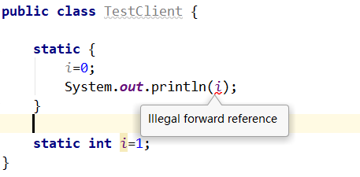

`<clinit>()`方法与类的构造函数（即在虚拟机视角中的示例构造器`<init>()`方法）不同，它不需要显示地调用父类构造器，Java虚拟机会保证在子类的`<clinit>()`执行前，父类的`<clinit>()`方法已经执行完毕。因此在Java虚拟机中第一个被执行的`<clinit>()`方法的类型肯定是`java.lang.Object`。

由于父类的`<clinit>()`方法先执行，也就意味着父类中定义的静态语句块要优先于子类的变量赋值操作，如下代码，字段B的值将会是2而不是1.方法执行顺序。

```java
package com.turbo.unit;

public class TestClinit02 {
    static class Parent{
        public static int A = 1;
        static {
            A = 2;
        }
    }

    static class Sub extends Parent{
        public static int B = A;
    }

    public static void main(String[] args) {
        System.out.println(Sub.B);
    }
}

```

`<clinit>()`方法对于类或接口来说并不是必须的，如果一个类中没有静态语句块，也没有对变量的赋值操作，那么编译器可以不为这个类生成`<clinit>()`方法。接口中不能使用静态语句块，但仍然有变量初始化的赋值动作，因此接口与类一样都会生成`<clinit>()`方法。

但接口与类不同的是，执行接口的`<clinit>()`方法不需要先执行父接口的`<clinit>()`方法，因为只有当父接口中定义的变量被使用时，父接口才会被初始化。此外，**接口的实现类在初始化时也一样不会执行接口的`<clinit>()`方法**。

Java虚拟机必须保证一个类的`<clinit>()`方法在多线程环境中被正确地加锁同步，如果多个线程同时去初始化一个类，那么只会有其中一个线程去执行这个类的`<clinit>()`方法，其他线程都需要阻塞等待，直到活动线程执行完毕`<clinit>()`方法。如果在一个类的`<clinit>()`方法中有耗时很长的操作，那就可能造成多个进程阻塞，在实际应用中这种阻塞往往是很隐蔽的。

```java
package com.turbo.unit;

public class TestDeadLoop {
    static class DeadLoopClass{
        static {
            // 如果不加这个if语句，编译将会提示"initializer must be able to complete normally
           if(true){
                System.out.println(Thread.currentThread() + "init DeadLoopClass");
                while (true){

                }
            }
        }
    }

    public static void main(String[] args) {
        Runnable script = new Runnable() {
            public void run() {
                System.out.println(Thread.currentThread() + "start");
                DeadLoopClass dlc = new DeadLoopClass();
                System.out.println(Thread.currentThread() + "run over");
            }
        };
        Thread thread1 = new Thread(script);
        Thread thread2 = new Thread(script);
        thread1.start();
        thread2.start();
    }
}
```

```
Thread[Thread-0,5,main]start
Thread[Thread-0,5,main]init DeadLoopClass
Thread[Thread-1,5,main]start

....
```


## 8.4 <font color='orange'>< clinit >与< init ></font>

<font color='orange'>`<clinit>方法和<init>方法有什么区别？`</font>

主要是为了明白**类的初始化**和**对象的初始化**之间的差别。

```java
package com.turbo.unit;

public class ParentA {
    static {
        System.out.println("1");
    }

    public ParentA() {
        System.out.println("2");
    }
}

public class SonB extends ParentA {
    static {
        System.out.println("a");
    }

    public SonB() {
        System.out.println("b");
    }

    public static void main(String[] args) {
        ParentA ab = new SonB(); // 1 a 2 b
        ab = new SonB(); // 2 b
    }
}

```

运行结果：

```
1
a
2
b
2
b
```

其中static字段和static代码块，属于类的，在类的加载的初始化阶段就已经被执行。类信息会被存放在方法区，在同一个类加载器下，这些信息有一份就够了，所以上面的static代码块只会执行一次，它对应的是`<clinit>`方法。

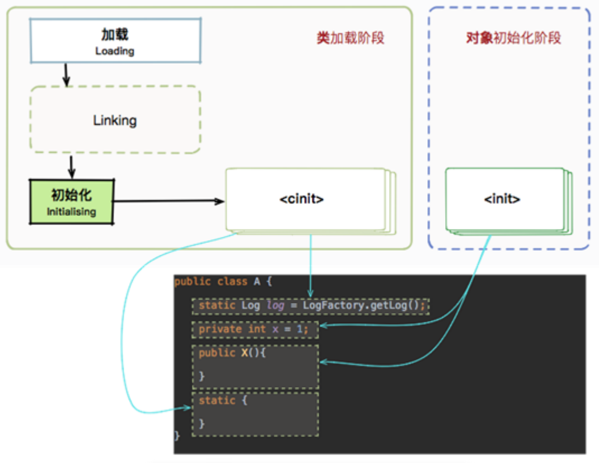

所以，上面的static代码块只会执行一次，对象的构造方法执行两次。再加上继承关系的先后原则，不难分析出最后结果。

结论：

方法`<clinit>`的执行时期：类初始化阶段（该方法只能被JVM调用，专门承担类变量的初始化工作），只执行一次

方法`<init>`的执行期间：对象的初始化阶段

# 9 类加载器

## 9.1 类加载器的作用

类加载器指的是将类的.class文件中的而简直数据读入内存中，将其放在运行时数据区的方法区内，然后在创建一个java.lang.Class对象，用来封装在方法区内的数据结构。

> 注意：JVM主要在程序第一次主动使用类的时候，才会去加载该类，也就是说，JVM并不是在一开始就把一个程序的所有类都加载到内存中，而是到不得不用的使用才把它加载进来，而且只加载一次。


## 9.2 类加载器分类

1. jvm支持两种类型的加载器，分别是**引导类加载器**和**自定义加载器**。
2. 引导类加载器是由c/c++实现的，自定义加载器是由java实现的。
3. jvm规范自定义加载器是指派生于抽象类ClassLoader的类加载器。
4. 按照这样的加载器类型划分，在程序中最常见的类加载器是：引导类加载器BootStrapClassLoader、自定义类加载器（Extension Class Loader，System Class Loader，User-Defined Class Loader）。


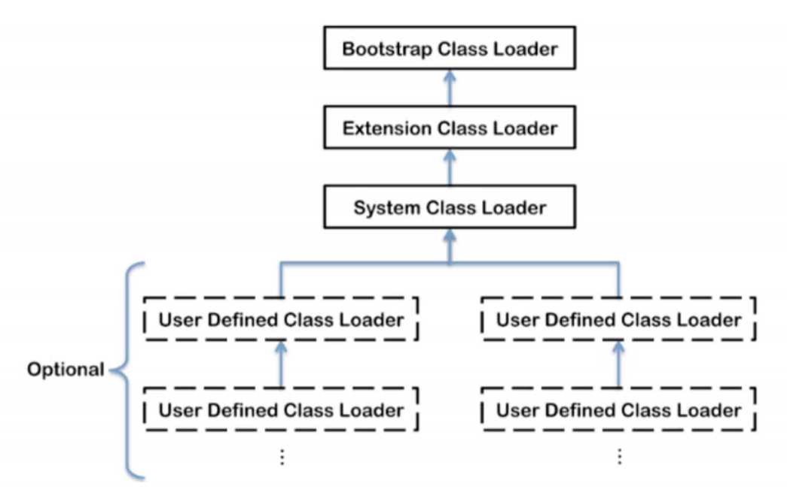

**上图中的加载器划分为包含关系**而并非继承关系

**启动类加载器**

1. 这个类加载器使用c/c++实现，嵌套在jvm内部。
2. 它用来加载Java核心类库（JAVA_HOME/jre/lib/rt.jar，resource.jar或sun.boot.class.path路径下的内容），用于提供JVM自身需要的类。
3. 并不继承自java.lang.ClassLoader，没有父类加载器

**扩展类加载器**

1. Java语言编写，由sun.misc.Lanucher$ExtClassLoader实现。
2. 从java.ext.dirs系统属性所指定的目录中加载类库，或从JDK的安装目录jre/lib/ext子目录（扩展目录）下加载类库。如果用户创建的JAR放在此目录下，也会自动由扩展类加载器加载；派生于ClassLoader。
3. 父类加载器为启动类加载器。

**系统类加载器**

1. Java语言编写，由sun.misc.Lanucher$AppClassLoader实现
2. 该类加载是程序中默认的类加载器，一般来说，Java应用的类都是由他它来完成加载的，它负责加载环境变量classpath或系统属性java.class.path指定路径下的类库：派生于ClassLoader。
3. 父类加载器为扩展类加载器。
4. 通过ClassLoader#getSystemClassLoader()方法可以获取到该类加载器。

**用户自定义类加载器**

在日常Java开发中，类加载几乎是由三种加载器配合执行的，在必要时还可以自定义类加载器，来定制类的加载方式。


```java
package com.turbo.unit2;

/**
 * 获取不同的类加载器
 */
public class Demo_ClassLoader {

    public static void main(String[] args) {
        // 1.获取系统类加载器
        ClassLoader systemClassLoader = ClassLoader.getSystemClassLoader();
        System.out.println(systemClassLoader); // sun.misc.Launcher$AppClassLoader@14dad5dc

        // 2.获取扩展类加载器（扩展类加载器是系统类加载器的父类）
        final ClassLoader extClassLoader = systemClassLoader.getParent();
        System.out.println(extClassLoader); // sun.misc.Launcher$ExtClassLoader@677327b6

        // 3.获取启动类加载器
        final ClassLoader loaderParent = extClassLoader.getParent();
        System.out.println(loaderParent); // null

        // 4.获取用户自定义类加载器
        final ClassLoader classLoader = Demo_ClassLoader.class.getClassLoader();
        System.out.println(classLoader); // sun.misc.Launcher$AppClassLoader@14dad5dc

        // 5.通过启动类加载器的对象，获取启动类加载器
        final ClassLoader classLoader2 = String.class.getClassLoader();
        System.out.println(classLoader2); // null
    }
}
```


# 10 双亲委派模型

## 10.1 什么是双亲委派机制

双亲委派模型工作过程是：如果一个类加载器收到类加载的请求，它首先不会自己去尝试加载这个类，而是把这个类请求委派给父类加载器完成。每个类加载器都是如此，只有当父类加载器在自己的所有范围内找不到指定的类时（即`ClassNotFoundException`），子加载器才会尝试自己去加载。

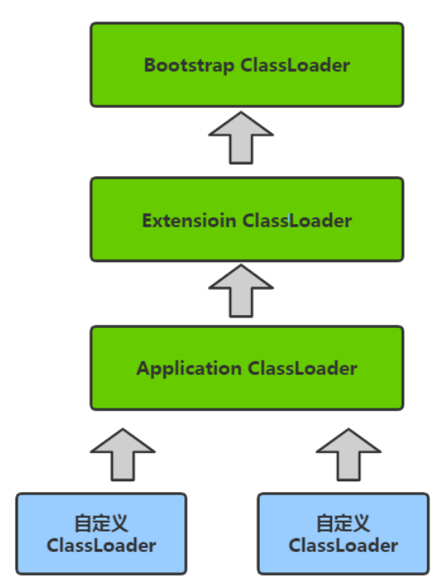

## 10.2 为什么需要双亲委派模型

为什么需要双亲委派模型呢？假设没有双亲委派模型，试想一个场景：

> 黑客自定义一个<font color='f28500'>`java.lang.String`</font>类，该`String`类具有系统的`String`类一样的功能，只是在某个函数稍作修改。比如`equals`函数，这个函数经常使用，如果在这个函数中，黑客加入一些"病毒代码"。并且通过自定义类加载器加入到`JVM`中。此时，如果没有双亲委派模型，那么`JVM`就可能误以为黑客自定义的`java.lang.String`类是系统的`String`，导致"病毒代码"被执行。

而有了双亲委派模型，黑客自定义的`java.lang.String`类永远都不会被加载进内存。因为首先是最顶端的类加载器加载系统的`java.lang.String`类，最终自定义类加载器无法加载`java.lang.String`类。

或许会想，我在自定义的类加载器里面强制加载自定义的`java.lang.String`类，不区通过调用父加载器不就好了吗？确实，这样是可行的。但是，在`JVM`中，**判断一个对象是否是某个类型时，如果该对象的实际类型与待比较的类型的类加载器不同，那么会返回false**。

例子：

> `ClassLoader1`、`ClassLoader2`都加载`java.lang.String`类，对应Class1、Class2对象。那么`Class1`对象不属于`ClassLoader2`对象加载的`java.lang.String`类型。


## 10.3 如何实现双亲委派模型

双钱委派模型的原理很简单，实现也简单。每次通过先委托父类加载器加载，当父类加载器无法加载时，再自己加载。其实`ClassLoader`类默认的`loadClass`方法已经帮我们写好了。

**几个重要函数**

`loadClass`默认实现如下：

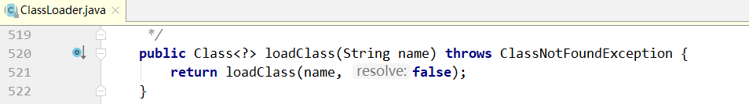

再看看`loadClass(String name, boolean resolve)`函数：

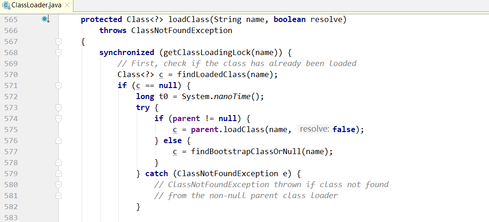

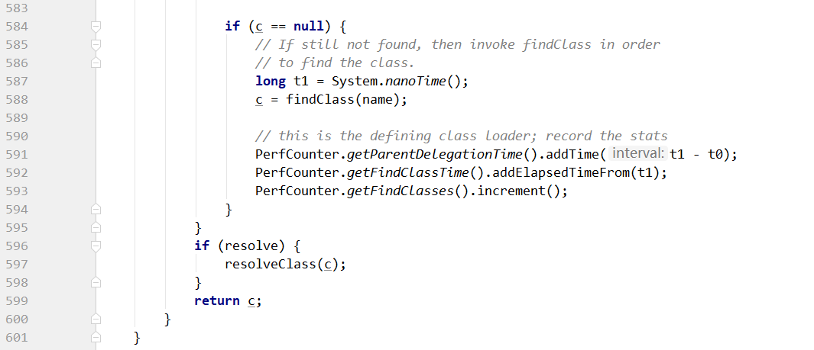

从上面代码可以明显看出，`loadClass(String name, boolean resolve)`函数实现了双亲委派模型！整个大致过程如下：

> 1. 首先，检查一下执行名称的类是否已经加载过，如果加载过，就不需要再加载，直接返回。
> 2. 如果此类没有加载过，那么，在判断一下是否有父类加载器；如果有父类加载器，则由父加载器（即调用`parent.loadClass(name, false);`）或者调用`bootStrap`类加载器来加载。
> 3. 如果父类加载器及`bootStrap`类加载器都没有找到执行的类，那么调用当前类加载器的`findClass`方法来完成类加载。

换句话说，如果自定义类加载器，就必须重写`findClass`方法！

`findClass`的默认实现：

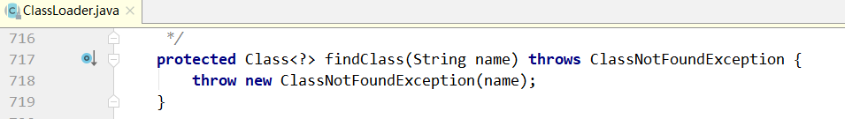

可以看出，抽象类`ClassLoader`的`findClass`函数默认是抛出异常的。而前面我们直到，`loadClass`在父类加载器无法加载类的时候，就会调用我们自定义的类加载器中的`findClass`函数，因此我们必须要在`loadClass`这个函数里面实现将一个指定类名称转换为`Class`对象。

如果是读取一个指定的名称的类为字节数组的话，这就好办。但是如何让将字节数组转为`Class`对象呢？很简单，`Java`提供了`definedClass`方法，通过这个方法，就可以把一个字节数组转为Class对象。

`defineClass`主要的功能是：

> 将一个字节数组转为`Class`对象，这个字节数组是`class`文件读取后最终的字节数组。如，假设`class`文件是加密的，则需要解密后作为形参传入`definedClass`函数。

`defineClass`默认实现：

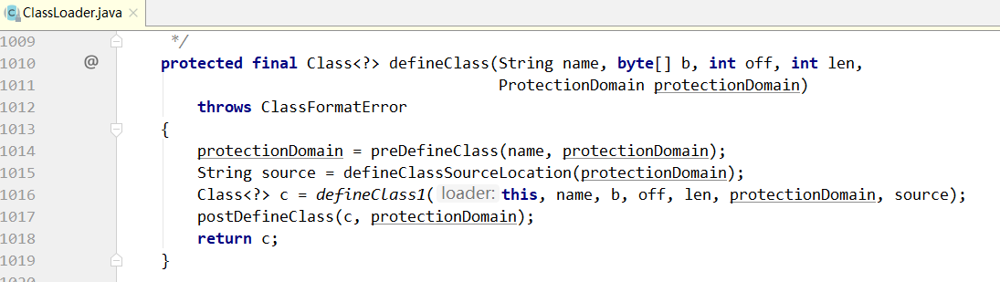

# 11 自定义类加载器

## 11.1 为什么要自定义类加载器

- 隔离加载类

  模块隔离，把类加载到不同的应用程序中。比如：tomcat这类web应用服务器，内部自定义了好几种类加载器，用于隔离web应用服务器上的不同应用程序。

- 修改类加载方式

  除了BootStrap加载器外，其他的加载并非一定要引入。根据实际情况在某个时间点按需进行动态加载。

- 扩展加载源

  比如还可以从数据库、网络 或其他终端上加载。

- 防止源码泄漏

  java代码容易被编译和篡改，可以进行编译加密，类加载需要自定义还原加密字节码。

## 11.2 自定义函数调用过程

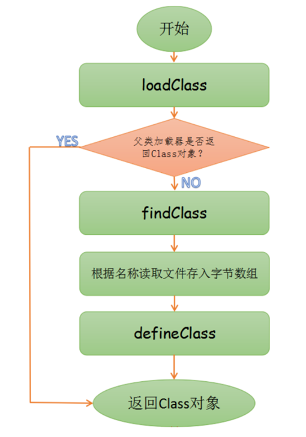

## 11.3 自定义类加载器实现

> 实现方式：
>
> 所有用户自定义类加载器都应继承ClassLoader类
>
> 在自定义ClassLoader的子类时，通常有两种做法：
>
> 1. 重写loadClass方法（是实现双亲委派逻辑的地方，修改它会破坏双亲委派机制，不推荐）
> 2. 重写findClass方法（推荐）

首先，我们定义一个待加载的普通`Java`类：`Test.java`。放在`com.turbo.demo`包下

```java
package com.turbo.unit2;

public class MyClassLoaderTest {

    public static void main(String[] args) {
        final MyClassLoader myClassLoader = new MyClassLoader("d:/");
        try {
            final Class<?> clazz = myClassLoader.loadClass("TestMain");
            System.out.println("TestMain字节码是由"+clazz.getClassLoader().getClass().getName()+ "加载的");
        } catch (ClassNotFoundException e) {
            e.printStackTrace();
        }
    }
}
```

加下来就是自定义的类加载器：

```java
package com.turbo.unit2;

import java.io.*;

public class MyClassLoader extends ClassLoader {

    // 1.定义字节码文件的路径
    private String codePath;

    // 2.定义构造方法
    public MyClassLoader(ClassLoader classLoader, String codePath) {
        super(classLoader);
        this.codePath = codePath;
    }

    public MyClassLoader(String codePath) {
        this.codePath = codePath;
    }

    /**
     *
     *
     * @param name
     * @return
     * @throws ClassNotFoundException
     */
    @Override
    protected Class<?> findClass(String name) throws ClassNotFoundException {
        // 声明输入流
        BufferedInputStream bis = null;
        // 声明输出流
        ByteArrayOutputStream baos = null;
        try {
            // 字节码路径
            String file = codePath + name+".class";
            // 初始化输入流
            bis = new BufferedInputStream(new FileInputStream(file));
            // 初始化输出流
            baos = new ByteArrayOutputStream();
            // io读写操作
            int len;
            byte[] data = new byte[1024];
            while ((len = bis.read(data)) != -1){
               baos.write(data,0,len);
            }
            // 获取内存中的字节数组
            final byte[] bytes = baos.toByteArray();
            // 调用definedClass将字节数组转成class实例
            final Class<?> clazz = defineClass(null, bytes, 0, bytes.length);
            //返回class对象
            return clazz;
        } catch (IOException e) {
            e.printStackTrace();
        } finally {
            try {
                bis.close();
            } catch (IOException e) {
                e.printStackTrace();
            }
            try {
                baos.close();
            } catch (IOException e) {
                e.printStackTrace();
            }
        }
        return null;
    }
}
```

最后运行结果如下：

```
TestMain字节码是由com.turbo.unit2.MyClassLoader加载的
```


# 12 ClassLoader源码剖析

## 12.1 类的关系图

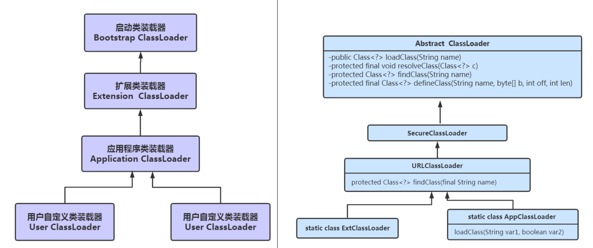

关系类图如下：

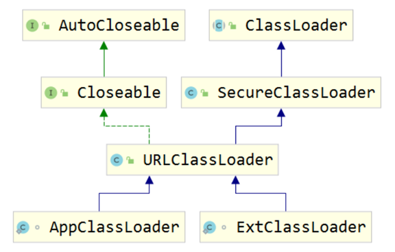


## 12.2 Launcher核心类的源码剖析

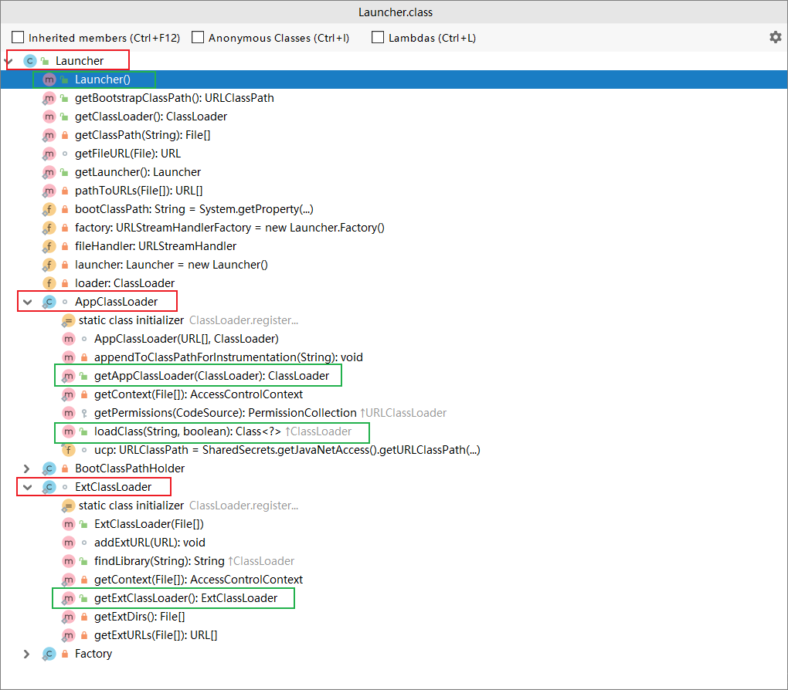

先从启动类说起，有一个Launcher类 sun.misc.Launcher；

```java
public class Launcher {
    private static URLStreamHandlerFactory factory = new Factory();
    // 静态变量，初始化，会执行构造方法
    private static Launcher launcher = new Launcher();
    private static String bootClassPath = System.getProperty("sun.boot.class.path");

    public static Launcher getLauncher() {
        return launcher;
    }
    
    // 构造方法执行
    public Launcher() {
        Launcher.ExtClassLoader var1;
        try {
            // 初始化扩展类加载器
            var1 = Launcher.ExtClassLoader.getExtClassLoader();
        } catch (IOException var10) {
            throw new InternalError("Could not create extension class loader", var10);
        }

        try {
            // 初始化应用类加载器
            this.loader = Launcher.AppClassLoader.getAppClassLoader(var1);
        } catch (IOException var9) {
            throw new InternalError("Could not create application class loader", var9);
        }
		// 设置ContextClassLoader，设置为扩展类加载器
        Thread.currentThread().setContextClassLoader(this.loader);
        String var2 = System.getProperty("java.security.manager");
        if (var2 != null) {
            SecurityManager var3 = null;
            if (!"".equals(var2) && !"default".equals(var2)) {
                try {
                    var3 = (SecurityManager)this.loader.loadClass(var2).newInstance();
                } catch (IllegalAccessException var5) {
                } catch (InstantiationException var6) {
                } catch (ClassNotFoundException var7) {
                } catch (ClassCastException var8) {
                }
            } else {
                var3 = new SecurityManager();
            }

            if (var3 == null) {
                throw new InternalError("Could not create SecurityManager: " + var2);
            }
            System.setSecurityManager(var3);
        }
    }
}    
```

构造方法中Launcher()做了四件事

- 创建扩展类加载器
- 创建应用程序类加载器
- 设置ContextClassLoader
- 如果需要安装安全管理器 Security Manager

其中launcher是static的，所以初始化的时候就会创建对象，也就是触发了构造方法，所以初始化的时候机会执行上面4个步骤

看下ExtClassLoader的创建中的关键几步

```java
static class ExtClassLoader extends URLClassLoader {
        public static Launcher.ExtClassLoader getExtClassLoader() throws IOException {
            final File[] var0 = getExtDirs();

            try {
                return (Launcher.ExtClassLoader)AccessController.doPrivileged(new PrivilegedExceptionAction<Launcher.ExtClassLoader>() {
                    public Launcher.ExtClassLoader run() throws IOException {
                        int var1 = var0.length;

                        for(int var2 = 0; var2 < var1; ++var2) {
                            MetaIndex.registerDirectory(var0[var2]);
                        }

                        return new Launcher.ExtClassLoader(var0);
                    }
                });
            } catch (PrivilegedActionException var2) {
                throw (IOException)var2.getException();
            }
        }

        void addExtURL(URL var1) {
            super.addURL(var1);
        }

        public ExtClassLoader(File[] var1) throws IOException {
            super(getExtURLs(var1), (ClassLoader)null, Launcher.factory);
            SharedSecrets.getJavaNetAccess().getURLClassPath(this).initLookupCache(this);
        }

        private static File[] getExtDirs() {
            String var0 = System.getProperty("java.ext.dirs");
            File[] var1;
            if (var0 != null) {
                StringTokenizer var2 = new StringTokenizer(var0, File.pathSeparator);
                int var3 = var2.countTokens();
                var1 = new File[var3];

                for(int var4 = 0; var4 < var3; ++var4) {
                    var1[var4] = new File(var2.nextToken());
                }
            } else {
                var1 = new File[0];
            }

            return var1;
        }

        private static URL[] getExtURLs(File[] var0) throws IOException {
            Vector var1 = new Vector();

            for(int var2 = 0; var2 < var0.length; ++var2) {
                String[] var3 = var0[var2].list();
                if (var3 != null) {
                    for(int var4 = 0; var4 < var3.length; ++var4) {
                        if (!var3[var4].equals("meta-index")) {
                            File var5 = new File(var0[var2], var3[var4]);
                            var1.add(Launcher.getFileURL(var5));
                        }
                    }
                }
            }

            URL[] var6 = new URL[var1.size()];
            var1.copyInto(var6);
            return var6;
        }

        public String findLibrary(String var1) {
            var1 = System.mapLibraryName(var1);
            URL[] var2 = super.getURLs();
            File var3 = null;

            for(int var4 = 0; var4 < var2.length; ++var4) {
                File var5 = (new File(var2[var4].getPath())).getParentFile();
                if (var5 != null && !var5.equals(var3)) {
                    String var6 = VM.getSavedProperty("os.arch");
                    File var7;
                    if (var6 != null) {
                        var7 = new File(new File(var5, var6), var1);
                        if (var7.exists()) {
                            return var7.getAbsolutePath();
                        }
                    }

                    var7 = new File(var5, var1);
                    if (var7.exists()) {
                        return var7.getAbsolutePath();
                    }
                }

                var3 = var5;
            }

            return null;
        }

        private static AccessControlContext getContext(File[] var0) throws IOException {
            PathPermissions var1 = new PathPermissions(var0);
            ProtectionDomain var2 = new ProtectionDomain(new CodeSource(var1.getCodeBase(), (Certificate[])null), var1);
            AccessControlContext var3 = new AccessControlContext(new ProtectionDomain[]{var2});
            return var3;
        }

        static {
            ClassLoader.registerAsParallelCapable();
        }
    }
```

关键的几步：

```
extcl = ExtClassLoader.getExtClassLoader();

final File[] dirs = getExtDirs();

String s = System.getProperty("java.ext.dirs");
```


也看下AppClassLoader的创建中关键几步

```java
/**
* var1 类全名
* var2 是否连接该类
*/
public Class<?> loadClass(String var1, boolean var2) throws ClassNotFoundException {
            int var3 = var1.lastIndexOf(46);
            if (var3 != -1) {
                SecurityManager var4 = System.getSecurityManager();
                if (var4 != null) {
                    var4.checkPackageAccess(var1.substring(0, var3));
                }
            }

            if (this.ucp.knownToNotExist(var1)) { // 一般都是false,想要返回true可能需要设置启动参数lookupCacheEnabled为true。为true时，具体的逻辑也即是C ++写的，所以做了什么不大清除
                Class var5 = this.findLoadedClass(var1); // 如果这个类已经被这个类加载器加载，则返回这个类，否则返回Null
                if (var5 != null) {
                    if (var2) {
                        this.resolveClass(var5); // 如该类没有link（连接），则连接，否则什么都不做
                    }

                    return var5;
                } else {
                    throw new ClassNotFoundException(var1);
                }
            } else {
                return super.loadClass(var1, var2);
            }
        }
```

关键的几个步骤：

```
this.loader = Launcher.AppClassLoader.getAppClassLoader(var1);

final String var1 = System.getProperty("java.class.path");
```

Launcher类中的静态变量

```
private static String bootClassPath = System.getProperty("sun.boot.class.path");
```

## 12.3 ClassLoader源码剖析

ClassLoader类是一个抽象类，齐后所有的类加载器都继承自ClassLoader（不包括启动类加载器），这里主要介绍ClassLoader中几个比较中法的方法。

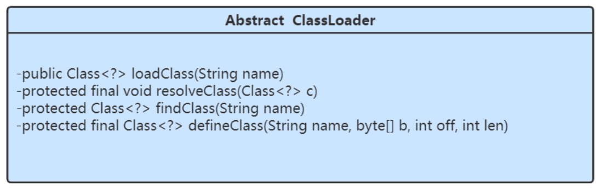

- loadClass(String)

  该方法加载指定名称（包括包名）的二进制类型，该方法在JDK1.2之后不再建议用户重写，但用户可以直接调用该方法，loadClass()方法是ClassLoader类自己实现的，该方法中的逻辑就是双亲委派模式的实现，奇冤吗如下，loadClass(String name, boolean resolve)是一个重载方法，resolve参数代表是否生成class对象的同时进行解析相关操作：

  ```java
  protected Class<?> loadClass(String name, boolean resolve)
          throws ClassNotFoundException
      {
          synchronized (getClassLoadingLock(name)) {
              // 先从缓存查找该class对象，找到就不重新加载
              Class<?> c = findLoadedClass(name);
              if (c == null) {
                  long t0 = System.nanoTime();
                  try {
                      if (parent != null) {
                          // 如果找不到，则委托父类加载器加载
                          c = parent.loadClass(name, false);
                      } else {
                          // 没有父类，则委托启动类加载器加载
                          c = findBootstrapClassOrNull(name);
                      }
                  } catch (ClassNotFoundException e) {
                      // ClassNotFoundException thrown if class not found
                      // from the non-null parent class loader
                  }
  
                  if (c == null) {
                      // If still not found, then invoke findClass in order
                      // 如果没有找到，则通过自定义实现的findClass去查找并加载
                      c = findClass(name);
  
                      // this is the defining class loader; record the stats
                      sun.misc.PerfCounter.getParentDelegationTime().addTime(t1 - t0);
                      sun.misc.PerfCounter.getFindClassTime().addElapsedTimeFrom(t1);
                      sun.misc.PerfCounter.getFindClasses().increment();
                  }
              }
              if (resolve) { // 是否需要在加载时进行解析
                  resolveCrelass(c);
              }
              return c;
          }
      }
  ```

  使用指定的而进行名称来加载类，这个方法默认实现按照以下顺序查找类：

  调用findLoadedClass(String)方法检查这个类是否被加载过，没有加载过，使用父类加载器调用loadClass(String)方法，如果父类为Null，类加载器装在虚拟内置的加载器调用findClass(String)方法装载类，如果，按照以上的步骤成功的找到对应的类，并且该方法接收的resolve参数的值为true，那么就调用resolveCrelass(Class)方法来处理类。ClassLoader的子类最好覆盖findClass(String)而不是loadClass方法。除非被重写，这个方法默认在整个装在过程中都是同步的（线程安全的）。

- findClass(String)

  在JDK1.2 之前，在自定义类加载时，会去继承ClassLoader类，并重写loadClass方法，从而实现自定义的类加载，但是在JDK1.2之后已不建议去覆盖loadClass()方法，而是建议重写findClass()方法（把自定义类加载逻辑写在这个方法中）。

  从前面的分析可知，findClass()方法是在loadClass方法中被调用，当loadClass()方法中父加载器加载失败后，则会调用自己的findClass()方法来完成类加载，这样就可以保证自定义的类加载器也符合双亲委派模式。需要注意的是ClassLoader类中并没有实现findClass()方法的具体代码逻辑，取而代之的是抛出`ClassNotFoundException`异常，同时应该知道的是findClass方法通常是和defineClass方法一起使用的。

  ClassLoader类中的findClass()方法源码如下：

  ```java
  protected Class<?> findClass(String name) throws ClassNotFoundException {
      throw new ClassNotFoundException(name);
  }
  ```

  

- defineClass(String name, byte[] b, int off, int len)

  defineClass()方法是用来将byte字节流解析成JVM能够识别的Class对象（defineClass中已经实现该方法逻辑），通过网络接收一个类的字节码，然后转换为byte字节流创建对应的Class对象，defineClass()方法通常与findClass()方法一起使用，一般情况下，在自定义类加载器时，会直接覆盖ClassLoader的findClass()方法并编写加载规则，取得要加载类的字节码后转换成字节流，然后调用defineClass()方法生成类的Class对象，简单例子如下：

  ```java
  /**
   *
   *
   * @param name
   * @return
   * @throws ClassNotFoundException
   */
  @Override
  protected Class<?> findClass(String name) throws ClassNotFoundException {
      // 声明输入流
      BufferedInputStream bis = null;
      // 声明输出流
      ByteArrayOutputStream baos = null;
      try {
          // 字节码路径
          String file = codePath + name+".class";
          // 初始化输入流
          bis = new BufferedInputStream(new FileInputStream(file));
          // 初始化输出流
          baos = new ByteArrayOutputStream();
          // io读写操作
          int len;
          byte[] data = new byte[1024];
          while ((len = bis.read(data)) != -1){
              baos.write(data,0,len);
          }
          // 获取内存中的字节数组
          final byte[] bytes = baos.toByteArray();
          // 调用definedClass将字节数组转成class实例
          final Class<?> clazz = defineClass(null, bytes, 0, bytes.length);
          //返回class对象
          return clazz;
      } catch (IOException e) {
          e.printStackTrace();
      } finally {
          try {
              bis.close();
          } catch (IOException e) {
              e.printStackTrace();
          }
          try {
              baos.close();
          } catch (IOException e) {
              e.printStackTrace();
          }
      }
      return null;
  }
  ```

  需要注意的是，如果直接调用defineClass()方法生成的Class对象，这个类的Class对象并没有解析（也可以理解为链接阶段，毕竟解析是连接的最后一步），其解析操作操作需要等到初始化阶段进行。

- resolveClass(Class<?> c)

  使用该方法可以使类的Class对象创建完成也同时被解析。前面我们说链接阶段主要是对字节码进行验证，为类变量分配并设置初始值同时将字节码文件中的符号引用转换为直接引用。


