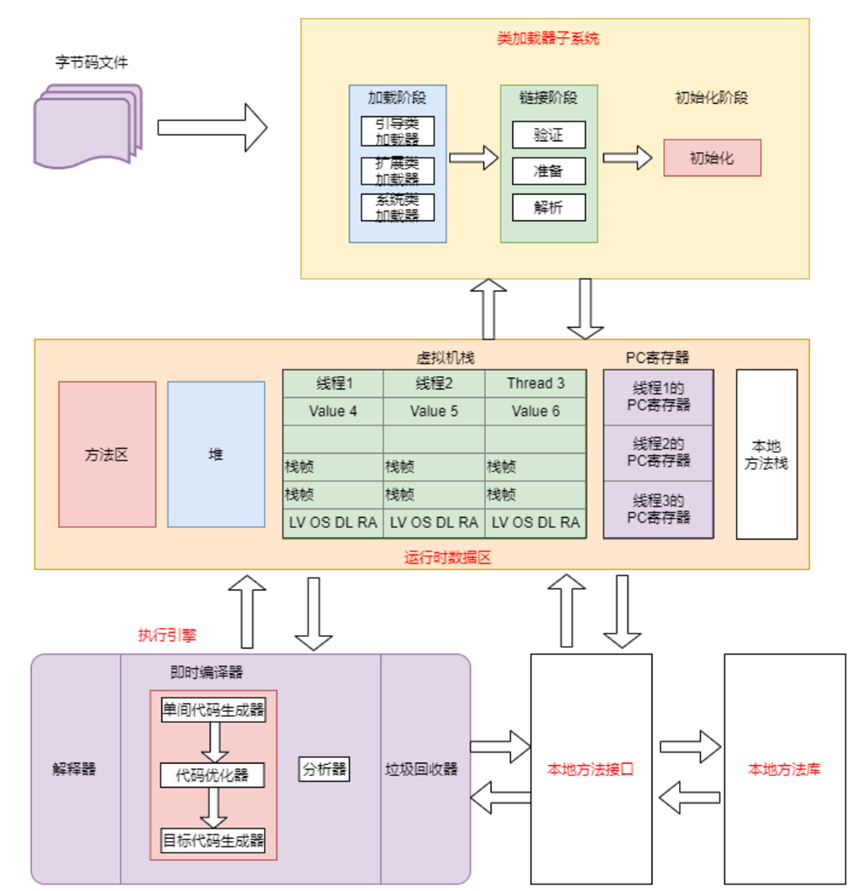
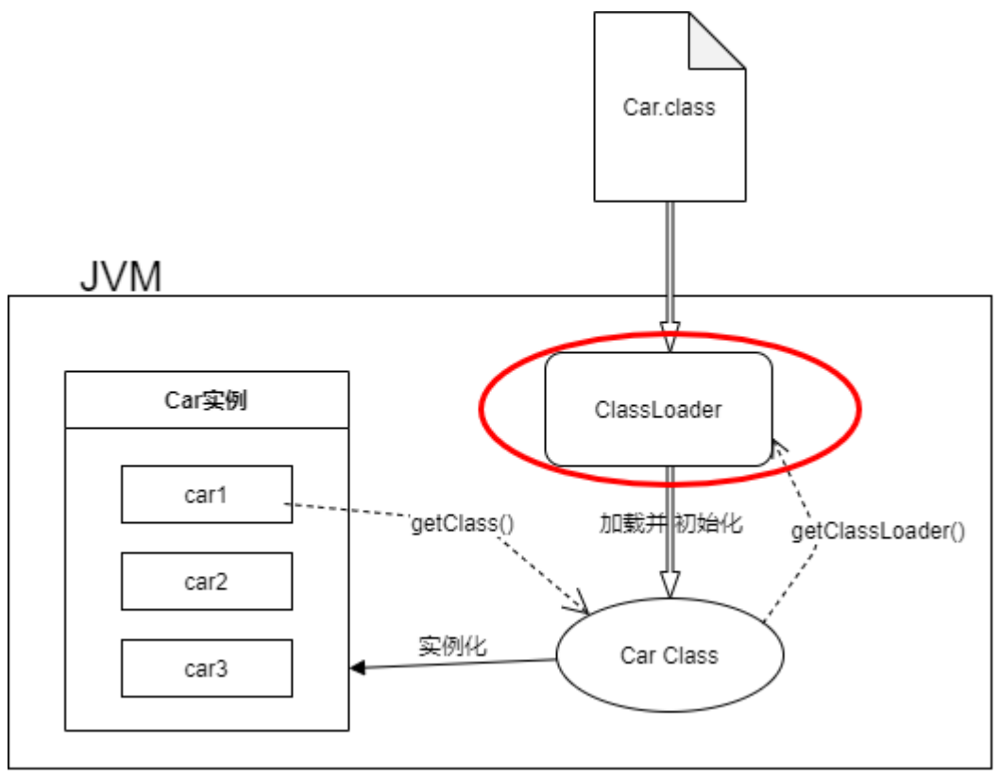
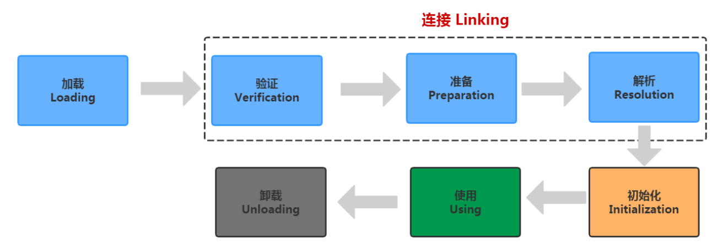

第三章 JVM加载机制详解

# 8 类装载子系统

## 8.1 类加载子系统介绍

1. 类加载子系统负责从文件系统或者是网络中加载.class文件，class文件在文件开头由特定的文件标识。
2. 把加载后的class类信心存放于方法区，除了类信息之外，方法区还会存放运行时常量池，可能还包括字符串字面量和数字常量（这部分常量信息是Class文件中常量池部分的内存映射）。
3. ClassLoader只负责class文件的加载，至于它是否可以运行，则由Execution Engine决定
4. 如果调用构造器实例化对象，则该对象存放在堆区




## 8.2 类加载器ClassLoader角色

1. class file存在于本地硬盘上，可以理解为设计师画在纸上的模板，而最终这个模板在执行的时候是要加载到JVM当中来根据这个文件实例化出n个一摸一样的实例。
2. class file加载到JVM中，被称为DNA元数据模板。
3. 在.class文件 > JVM > 最终成为元数据模板，此过程就要一个运输工具（类装载器Class Loader），扮演一个快递员的角色。



## 8.3 类加载器的执行过程

我们知道我们写的程序经过编译后成为了.class文件，.class文件中描述了类的各种信息，最终都需要加载到虚拟机之后才能运行和使用。而虚拟机如何加载这些.class文件？.class文件的信息进入到虚拟机后会发生什么变化

**类使用的7个阶段**

类从被加载到虚拟机内存中开始，到卸载出内存，它的整个声明周期包括：加载（Loading）、验证（Verification）、准备（Preparation）、解析（Resolution）、初始化（Initialization）、使用（Using）和卸载（Unloading）这7个阶段。其中验证、准备、解析3个部分统称为链接（Linking），这7个阶段的发生顺序如下：



图中，加载，验证，准备，初始化，卸载这5个阶段的顺序是确定的，类的加载过程必须按照这种顺序按部就班地开始，而解析阶段不一定：它在某些情况下可以初始化阶段之后再开始，这是为了支持Java语言地运行时绑定（也称为动态绑定）。接下来讲解加载、验证、准备、解析、初始化5个阶段，这5个步骤组成了一个完整的类如加载过程。使用没什么好说的，卸载属于GC的工作。


### 8.3.1 加载

加载时类加载的第一个阶段，有两种时机会触发类加载：

> **1.预加载**

虚拟机启动时加载，加载的是JAVA_HOME/lib/下的rt.jar下的.class文件，这个jar包里面的内容是程序运行时常用到的，像`java.lang.*`、`java.util.`、`java.io.`等等，因此随着虚拟机一起加载。要证明这一点很简单，写一个空的main函数，设置虚拟机参数"-XX:TraceClassLoading"来获取类加载信息，运行一下：

```
[Opened D:\tool\jdk1.8.0_60\jre\lib\rt.jar]
[Loaded java.lang.Object from D:\tool\jdk1.8.0_60\jre\lib\rt.jar]
[Loaded java.io.Serializable from D:\tool\jdk1.8.0_60\jre\lib\rt.jar]
[Loaded java.lang.Comparable from D:\tool\jdk1.8.0_60\jre\lib\rt.jar]
[Loaded java.lang.CharSequence from D:\tool\jdk1.8.0_60\jre\lib\rt.jar]
[Loaded java.lang.String from D:\tool\jdk1.8.0_60\jre\lib\rt.jar]
[Loaded java.lang.reflect.AnnotatedElement from D:\tool\jdk1.8.0_60\jre\lib\rt.jar]
```


> **2.运行时加载**

虚拟机在用到一个.class文件的时候，会先去内存中查看一下这个.class文件有没有被加载，如果没有就会按照类的全限定名来加载这个类。

那么，加载阶段做了什么，其实加载阶段做了三件事情：

1. 获取.class文件的二进制流
2. 将类信息，静态变量、字节码、常量 这些.class文件中的内容放入方法区中
3. 在内存中生成一个代表这个.class文件的java.lang.Class对象，作为方法区这个类的各种数据的访问入口。一般这个Class是在堆里的，不过HotSpot虚拟机比较特殊，这个Class对象是放在方法区中的

虚拟机规范堆这三点的要求并不具体，因此虚拟机实现与具体应用的灵活度都是相当大的。例如第一条，根本没有知名二进制字节流要从哪里来，怎么来，因此单单就这一条，就能变出许多花样来：

- 从zip包中获取，这就是以后jar，ear，war格式的基础
- 从网络中获取，典型应用就是Applet
- 运行时计算生成，典型应用就是动态代理技术
- 由其他文件生成，典型应用就是JSP，既由JSP生成对应的.class文件
- 从数据库中读取，这种场景比较少见

总而言之，在类加载的整个过程中，这部分是对开发者来说是可控性最强的一个阶段。


### 8.3.2 链接

链接包含三个步骤：分别是`验证Verification`，`准备Preparation`，`解析Resolution`三个过程

> **1 验证 Verification**

链接阶段的第一步，这一阶段的目的是为了确保.class的字节流中包含的信息符合当前虚拟机的要求，并且不会危害虚拟机自身的安全。

Java语言本身是相对安全的语言（相对于C/C++来说），但是前面说过，.class文件未必要凑够Java源码编译而来，可以使用任何途径产生，甚至包括用十六进行编译器直接编写来产生.class文件。在字节码语言层面上，Java代码至少从语义上可以表达出来的。虚拟机如果不检查输入的字节流，对其完全信任的话，很可能因为载入了有害的字节流而导致系统崩溃，所以验证是虚拟机对自身保护的一项重要工作。

验证阶段将做以下几个工作，具体就不细节展开，这是虚拟机实现层面的问题：

- 文件格式验证
- 元数据验证
- 字节码验证
- 符号引用验证


> **2 准备 Preparation**

**准备阶段是正式为变量分配内存并设置其初始值的阶段**，这些变量所使用的内存都将在方法区中分配。关于这点，有两个地方注意一下：

- 这时候进行内存分配的仅仅是类变量（被static修饰的变量），而不是实例变量，实例变量将会在对象实例化的时候随着对象一起分配在Java堆中
- 这个节点赋初始值的变量指的是那些不被final修饰的static变量，比如"public static int value = 123"，value在准备阶段过后是0，而不是123。给value赋值为123的动作将在初始化阶段进行；比如"public static final int value = 123"；就不一样，在准备阶段，虚拟机就会给value赋值为123。

各个数据类型的零值，如下：

| 数据类型  | 零值     |
| --------- | -------- |
| int       | 0        |
| long      | 0L       |
| short     | (short)0 |
| chart     | '\u0000' |
| byte      | (byte)0  |
| boolean   | false    |
| float     | 0.0f     |
| double    | 0.0d     |
| reference | null     |

一道面试题。下面两段代码，code-snippet 1将会输出0，而code-snippet 2将无法通过编译。

复制code-snippet 1：

```
public class A {
    static int a;

    public static void main(String[] args) {
        System.out.println(a);
    }
}
```

code-snippet 2：

```
public class B {
    public static void main(String[] args) {
        int a;
        System.out.println(a);
    }
}
```

**注意：**

这是因为局部变量不像类变量那样存在准备阶段。类变量有两次赋初始值的过程，一次在准备阶段，赋予初始值（也可以指定值）；另外一次在初始化阶段，赋予程序员定义的值。

因此，即使程序员没有为类变量赋值也没有关系，它仍然有一个默认的初始值。但局部变量就不一样，如果没有给它赋初始值，是不能使用的。

> **3 解析 Resolution**

**解析阶段是虚拟机将常量池内的符号引用替换为直接引用的过程。**了解一下符号引用和直接引用有什么区别：

1. 符号引用

   符号引用是一种定义，可以是任何字面上的含义，而直接引用就是直接指向目标的指针，相对偏移量。

   这个其实是属于编译原理方面的概念，符号引用包括下面三类常量：

   - 类和接口的全限定名
   - 字段的名称和描述符
   - 方法的名称和描述符

   结合实际看一下，

   ```java
   package com.turbo.unit;
   
   public class TestMain {
       private static int i;
       private double d;
   
       public static void print(){
   
       }
   
       private boolean trueOrFalse(){
           return false;
       }
   
       public static void main(String[] args) {
   
       }
   }
   
   ```

   `javap -v TestMain > testmain.txt`

   ```java
   Constant pool:
      #1 = Methodref          #3.#24         // java/lang/Object."<init>":()V
      #2 = Class              #25            // com/turbo/unit/TestMain
      #3 = Class              #26            // java/lang/Object
      #4 = Utf8               i
      #5 = Utf8               I
      #6 = Utf8               d
      #7 = Utf8               D
      #8 = Utf8               <init>
      #9 = Utf8               ()V
     #10 = Utf8               Code
     #11 = Utf8               LineNumberTable
     #12 = Utf8               LocalVariableTable
     #13 = Utf8               this
     #14 = Utf8               Lcom/turbo/unit/TestMain;
     #15 = Utf8               print
     #16 = Utf8               trueOrFalse
     #17 = Utf8               ()Z
     #18 = Utf8               main
     #19 = Utf8               ([Ljava/lang/String;)V
     #20 = Utf8               args
     #21 = Utf8               [Ljava/lang/String;
     #22 = Utf8               SourceFile
     #23 = Utf8               TestMain.java
     #24 = NameAndType        #8:#9          // "<init>":()V
     #25 = Utf8               com/turbo/unit/TestMain
     #26 = Utf8               java/lang/Object
   ```

   看到Constant Pool也就是常量池中有22项内容，其中带"Utf8"的就是符号引用。比如#25，它的值是"com/turbo/unit/TestMain"，表示的是这个类的全限定名；又比如#4为i，#5为I，它们是一对的，表示变量时Integer(int)类型的，名字叫做i；#6为d，#7为D也是一样，表示一个Double(double)类型的变量，名字为d；

   #15、#16表示的都是方法的名字。

   那其实总而言之，符号引用和上面讲的是一样的，但对于类、变量、方法的描述。符号引用和虚拟机的内存布局是没有关系的，引用的目标未必已经加载到内存中了。

2. 直接引用

   直接引用可以是直接指向目标的指针，相对偏移量或是一个能间接定位到目标的句柄。直接引用和虚拟机实现的内存布局相关，同一个符号引用在不同的虚拟机示例上翻译出来的直接引用一般不会相同。如果有了直接引用，那引用的目标必定已经存在在内存中了。

解析阶段负责把整个类激活，串成一个可以找到彼此的网，过程不可谓不重要。那这个阶段都做了哪些工作？大致可以分为：

- 类或接口的解析
- 类方法解析
- 接口方法解析
- 字段解析

### 8.3.3 初始化


## 8.4 <font color='orange'>< cint >与< init ></font>

# 9 类加载器

## 9.1 类加载器的作用

## 9.2 类加载器分类

# 10 双亲委派模型

## 10.1 什么是双亲委派机制

## 10.2 为什么需要双亲委派模型

## 10.3 如何实现双亲委派模型

# 11 自定义类加载器

## 11.1 为什么要自定义类加载器

## 11.2 自定义函数调用过程

## 11.3 自定义类加载器实现

# 12 ClassLoader源码剖析

## 12.1 类的关系图

## 12.2 Launcher核心类的源码剖析

## 12.3 ClassLoader源码剖析