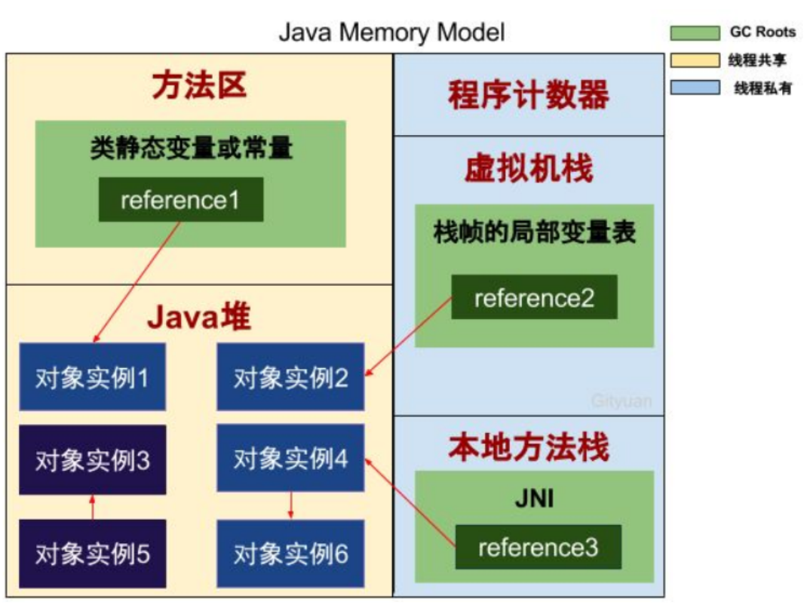
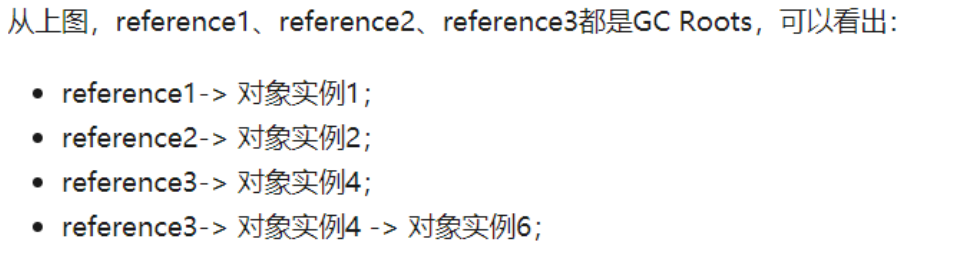
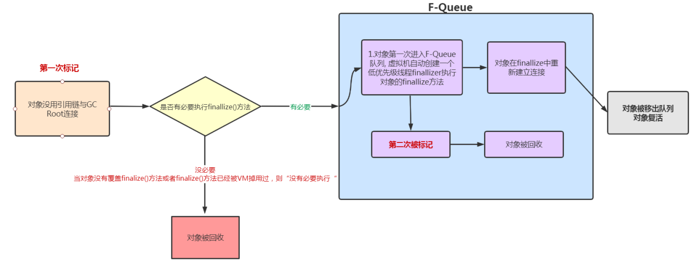

第四章 垃圾回收机制及算法

# 13 垃圾回收概述

> **什么是垃圾回收**

垃圾回收（Garbage Collection，简称GC），不少人把这项技术当作Java语言的半生产物。事实上，垃圾收集的历史远远比Java久远，在1960年诞生于麻省理工学院的Lisp是第一门开始使用内存动态分配的垃圾收集技术的语言。垃圾收集需要完成三件事：

- 哪些内存需要回收
- 什么时候回收
- 如何回收

> **Java垃圾回收的优缺点**

优点：

1. 不要考虑内存管理
2. 可以有效的防止内存泄漏，有效的利用可使用的内存
3. 由于有垃圾回收机制，Java中的对象不再有"作用域"的概念，只有对象的引用才有"作用域"

缺点：

1. Java开发人员不了解自动内存管理，内存管理就像一个黑匣子，过度依赖就会降低我们解决内存溢出/内存泄漏等问题的能力。


# 14 垃圾回收-对象是否已死

## 14.1 判断对象是否存活-引用计数算法

引用计数算法可以这样实现：给每个创建的对象添加一个引用计数器，每当此对象被某个地方引用时，技术值+1，引用失效时-1，所以当计数值为0时，表示对象已经不能被使用。引用计数算法大多数情况下是一个比较不错的算法，简单直接，也有一些注明的应用案例，但是对于Java虚拟机来说，并不是一个好的选择，因为它很难解决对象直接相互循环引用的问题。

**优点**：

实现简单，执行效率高，很好的和程序交织。

**缺点**：

无法检测出循环引用。


> 譬如有A和B两个对象，它们都相互引用，除此之外都没有任何对外的引用，那么理论上A和B都可以被作为垃圾回收，但实际如果采用引用计数算法，则A、B的引用计数都是1，并不满足被回收的条件，如果A和B之间的引用一直存在，那么就永远无法被回收。

```java
public class App {
    public static void main(String[] args) {        
        Test object1 = new Test();
        Test object2 = new Test();
        object1.object = object2;
        object2.object = object1;
        object1 = null;
        object2 = null;
    }
}
class Test {
    public Test object = null; 
}
```

这两个对昂再无任何我引用，实际上这两个对象已经不可能在被访问，但是它们因为互相引用着对方，导致它们的引用计数都不为零，引用计数算法也无法回收它们。

**但是在Java程序中这两个对象仍然会被回收，因为Java中并没有使用引用计数算法**。

## 14.2 判断对象是否存活-可达性分析算法

### 14.2.1 可达性分析算法

在主流的商用程序语言如Java，C#等主流实现中，都是通过**可达性分析（Reachability Analysis）**来判断对象是否存活的。此算法的基本思路就是通过一些列的”**GC Roots**“的对象作为起始点，从起始点开始向下搜索到对象的路径。搜索所经过的路径称为**引用链（Reference Chain）**，当一个对象到任何GC Roots都没有引用链时，表明对象"**不可达**"，即该对象是不可用的。


在Java语言中，可作为GC Roots的对象包括下面几种：

- 栈帧中的局部变量表中的reference引用所引用的对象
- 方法区中static静态引用的对象
- 方法区中final常量引用的对象
- 本地方法栈中JNI(Native方法)引用的对象
- Java虚拟机内部的引用，如基本数据北行对应的Class对象，一些常驻的异常对象（比如NullPointException、OutOfMemoryError）等，还有系统类加载器。
- 所有被同步锁（synchronization关键字）持有的对象。
- 反映Java虚拟机内部情况的JMXBean、JVMTI中注册的回调、本地代码缓存等。





### 14.2.2 JVM之判断对象是否存活

finalize()方法最终判定对象是否存活：

即使在可达性分析算法中判定为不可达的对象，也不是"非死不可"的，这时候它们暂时还处于"缓刑"阶段，要真正宣告一个对象死亡，至少要经历两次标记过程：

**第一次标记：**

如果对象在进行可达性分析后发现没有与GC Roots相连接的引用链，那它将会被第一次标记，随后进行一次筛选，筛选的条件是此对象是否有必要执行finalize()方法。

**没有必要：**

假如对象没有覆盖finalize()方法，或者finalize()方法已经被虚拟机调用过，那么虚拟机将这两种情况都是为"没有必要执行"。

**有必要：**

如果这个对象被判定为确有必要执行finalize()方法，那么该对象将会被放置在一个名为F-Queue的队列之中，并在稍后由一条由虚拟机自动建立、低调度优先级的Finalizer线程去执行它们的finalize()方法。finalize()方法是对象逃脱死亡名媛的最后一次机会，稍后收集器将对F-Queue中的对象进行**第二次小规模的标记**，如果对象要在finalize()中成功拯救自己——只要重新与引用链上的任何一个对象建立关联即可，譬如把自己（this关键字）赋值给某个变量或者对象的成员变量，那在第二次标记时，它将被移除"即将回收"的集合；如果对象这时候还没有逃脱，那基本上就真的要被回收了。



一次对象自我拯救的演示：

```java
package com.turbo.unit3;

/**
 * 1.对象可以在被GC时自我拯救
 * 2.这种自救的机会只有一次，因为一个对象的finalize()方法最多只会被系统自动调用一次
 */
public class FinalizeEscapeGC {
    public static FinalizeEscapeGC SAVE_HOOK = null;

    public void isAlive(){
        System.out.println("yes,i am still alive :)");
    }

    // 一般只执行一次
    @Override
    protected void finalize() throws Throwable {
        super.finalize();
        System.out.println("finalize method executed!");
        FinalizeEscapeGC.SAVE_HOOK = this;
    }

    public static void main(String[] args) throws InterruptedException {
        SAVE_HOOK = new FinalizeEscapeGC();
        //对象第一次成功拯救自己
        SAVE_HOOK = null;
        System.gc();
        // 因为Finalizer方法优先级很低，暂停0.5s，等待
        Thread.sleep(500);

        if(SAVE_HOOK != null){
            SAVE_HOOK.isAlive();
        } else {
            System.out.println("no i am dead :( ");
        }

        // 下面这段代码与和上面完全相同，达式这次自救却失败
        SAVE_HOOK = null;
        System.gc();
        // 因为Finalizer犯法优先级很低，暂停0.5s，等待
        Thread.sleep(500);
        if(SAVE_HOOK != null){
            SAVE_HOOK.isAlive();
        } else {
            System.out.println("no i am dead :( ");
        }
    }
}

```

注意：

Finalizer线程去执行它们的finalize()方法，这里所说的"执行"是指虚拟机会触发这个方法开始执行，但并不承诺一定会等待它运行结束。这样做的原因是，如果某个对象的finalize()方法执行缓慢，或者更极端的发生了死循环，将很可能导致F-Queue队列中的其他对象永久处于等待，甚至导致整个内存回收子系统的崩溃。

### 14.2.3 再谈引用

# 15 垃圾收集算法

## 15.1 分代收集理论

## 15.2 标记-清除算法

## 15.3 标记-复制算法

## 15.4 标记-整理算法

# 16 垃圾收集器

## 16.1 垃圾收集器概述

## 16.2 Serial收集器

## 16.3 Parnew收集器

## 16.4 Parallel Scavenge收集器

## 16.5 Serial Old收集器

## 16.6 Parallel Old收集器

## 16.7 CMS收集器

### 16.7.1 CMS垃圾回收器

### 16.7.2 CMS垃圾收集过程

### 16.7.3 并发可达性分析

### 16.7.4 CMS收集器三个缺点

## 16.8 G1收集器

### 16.8.1 G1垃圾收集器简介

### 16.8.2 G1收集器特点

### 16.8.3 Region区域

### 16.8.4 G1 GC过程

#### 16.8.4.1 G1 YoungGC

#### 16.8.4.2 G1 Mix GC

### 16.8.5 G1常用参数

