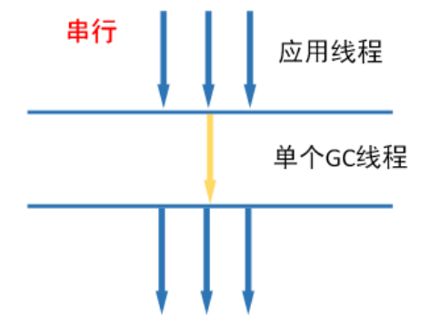

第四章 垃圾回收机制及算法

# 13 垃圾回收概述

> **什么是垃圾回收**

垃圾回收（Garbage Collection，简称GC），不少人把这项技术当作Java语言的半生产物。事实上，垃圾收集的历史远远比Java久远，在1960年诞生于麻省理工学院的Lisp是第一门开始使用内存动态分配的垃圾收集技术的语言。垃圾收集需要完成三件事：

- 哪些内存需要回收
- 什么时候回收
- 如何回收

> **Java垃圾回收的优缺点**

优点：

1. 不要考虑内存管理
2. 可以有效的防止内存泄漏，有效的利用可使用的内存
3. 由于有垃圾回收机制，Java中的对象不再有"作用域"的概念，只有对象的引用才有"作用域"

缺点：

1. Java开发人员不了解自动内存管理，内存管理就像一个黑匣子，过度依赖就会降低我们解决内存溢出/内存泄漏等问题的能力。


# 14 垃圾回收-对象是否已死

## 14.1 判断对象是否存活-引用计数算法

引用计数算法可以这样实现：给每个创建的对象添加一个引用计数器，每当此对象被某个地方引用时，技术值+1，引用失效时-1，所以当计数值为0时，表示对象已经不能被使用。引用计数算法大多数情况下是一个比较不错的算法，简单直接，也有一些注明的应用案例，但是对于Java虚拟机来说，并不是一个好的选择，因为它很难解决对象直接相互循环引用的问题。

**优点**：

实现简单，执行效率高，很好的和程序交织。

**缺点**：

无法检测出循环引用。


> 譬如有A和B两个对象，它们都相互引用，除此之外都没有任何对外的引用，那么理论上A和B都可以被作为垃圾回收，但实际如果采用引用计数算法，则A、B的引用计数都是1，并不满足被回收的条件，如果A和B之间的引用一直存在，那么就永远无法被回收。

```java
public class App {
    public static void main(String[] args) {        
        Test object1 = new Test();
        Test object2 = new Test();
        object1.object = object2;
        object2.object = object1;
        object1 = null;
        object2 = null;
    }
}
class Test {
    public Test object = null; 
}
```

这两个对昂再无任何我引用，实际上这两个对象已经不可能在被访问，但是它们因为互相引用着对方，导致它们的引用计数都不为零，引用计数算法也无法回收它们。

**但是在Java程序中这两个对象仍然会被回收，因为Java中并没有使用引用计数算法**。

## 14.2 判断对象是否存活-可达性分析算法

### 14.2.1 可达性分析算法

在主流的商用程序语言如Java，C#等主流实现中，都是通过**可达性分析（Reachability Analysis）**来判断对象是否存活的。此算法的基本思路就是通过一些列的”**GC Roots**“的对象作为起始点，从起始点开始向下搜索到对象的路径。搜索所经过的路径称为**引用链（Reference Chain）**，当一个对象到任何GC Roots都没有引用链时，表明对象"**不可达**"，即该对象是不可用的。


在Java语言中，可作为GC Roots的对象包括下面几种：

- 栈帧中的局部变量表中的reference引用所引用的对象
- 方法区中static静态引用的对象
- 方法区中final常量引用的对象
- 本地方法栈中JNI(Native方法)引用的对象
- Java虚拟机内部的引用，如基本数据北行对应的Class对象，一些常驻的异常对象（比如NullPointException、OutOfMemoryError）等，还有系统类加载器。
- 所有被同步锁（synchronization关键字）持有的对象。
- 反映Java虚拟机内部情况的JMXBean、JVMTI中注册的回调、本地代码缓存等。


### 14.2.2 JVM之判断对象是否存活

finalize()方法最终判定对象是否存活：

即使在可达性分析算法中判定为不可达的对象，也不是"非死不可"的，这时候它们暂时还处于"缓刑"阶段，要真正宣告一个对象死亡，至少要经历两次标记过程：

**第一次标记：**

如果对象在进行可达性分析后发现没有与GC Roots相连接的引用链，那它将会被第一次标记，随后进行一次筛选，筛选的条件是此对象是否有必要执行finalize()方法。

**没有必要：**

假如对象没有覆盖finalize()方法，或者finalize()方法已经被虚拟机调用过，那么虚拟机将这两种情况都是为"没有必要执行"。

**有必要：**

如果这个对象被判定为确有必要执行finalize()方法，那么该对象将会被放置在一个名为F-Queue的队列之中，并在稍后由一条由虚拟机自动建立、低调度优先级的Finalizer线程去执行它们的finalize()方法。finalize()方法是对象逃脱死亡名媛的最后一次机会，稍后收集器将对F-Queue中的对象进行**第二次小规模的标记**，如果对象要在finalize()中成功拯救自己——只要重新与引用链上的任何一个对象建立关联即可，譬如把自己（this关键字）赋值给某个变量或者对象的成员变量，那在第二次标记时，它将被移除"即将回收"的集合；如果对象这时候还没有逃脱，那基本上就真的要被回收了。


一次对象自我拯救的演示：

```java
package com.turbo.unit3;

/**
 * 1.对象可以在被GC时自我拯救
 * 2.这种自救的机会只有一次，因为一个对象的finalize()方法最多只会被系统自动调用一次
 */
public class FinalizeEscapeGC {
    public static FinalizeEscapeGC SAVE_HOOK = null;

    public void isAlive(){
        System.out.println("yes,i am still alive :)");
    }

    // 一般只执行一次
    @Override
    protected void finalize() throws Throwable {
        super.finalize();
        System.out.println("finalize method executed!");
        FinalizeEscapeGC.SAVE_HOOK = this;
    }

    public static void main(String[] args) throws InterruptedException {
        SAVE_HOOK = new FinalizeEscapeGC();
        //对象第一次成功拯救自己
        SAVE_HOOK = null;
        System.gc();
        // 因为Finalizer方法优先级很低，暂停0.5s，等待
        Thread.sleep(500);

        if(SAVE_HOOK != null){
            SAVE_HOOK.isAlive();
        } else {
            System.out.println("no i am dead :( ");
        }

        // 下面这段代码与和上面完全相同，达式这次自救却失败
        SAVE_HOOK = null;
        System.gc();
        // 因为Finalizer犯法优先级很低，暂停0.5s，等待
        Thread.sleep(500);
        if(SAVE_HOOK != null){
            SAVE_HOOK.isAlive();
        } else {
            System.out.println("no i am dead :( ");
        }
    }
}

```

注意：

Finalizer线程去执行它们的finalize()方法，这里所说的"执行"是指虚拟机会触发这个方法开始执行，但并不承诺一定会等待它运行结束。这样做的原因是，如果某个对象的finalize()方法执行缓慢，或者更极端的发生了死循环，将很可能导致F-Queue队列中的其他对象永久处于等待，甚至导致整个内存回收子系统的崩溃。

### 14.2.3 再谈引用

在JDK1.2之前，Java中引用的定义很传统：如果引用类型的数据中存储的数值代表的是另一块内存的起始地址，就称这块内存代表着一个引用。这种定义有些狭隘，一个对象在这种定义下只有被引用或者没有被引用两种状态。

我们希望能描述这一类对象：当内存空间还足够时，能够保存在内存中；如果内存空间在进行垃圾回收后还是非常紧张，则可以抛弃这些对象。很多系统中的缓存对象都符合这样的场景。在JDK1.2之后，Java对引用的概念做了扩充，将引用分为`强引用(Strong Reference)`、`软引用(Soft Reference)`、`弱引用(Weak Reference)`和`虚引用(Phantom Reference)`四种，这四种引用的强度依次递减。

> **1.强引用（Strong Reference）**

强引用是使用最普遍的引用。如果一个对象具有强引用，那垃圾回收器绝不会回收它。当内存空间不足，Java虚拟机宁愿抛出OutOfMemoryError错误，使程序异常中断，也不会随意回收既有强引用的对象来解决内存空间不足的问题。ps：强引用其实也就是我们平时A a = new A()这个意思。

> **2.软引用（Soft Reference）**

如果一个对象只具有软引用，且内存空间足够，垃圾回收就不会回收它；如果内存空间不足，就会回收这些对象的内存。只要垃圾回收器没有回收它，该对象就可以被程序使用。软引用可以和一个引用队列（ReferenceQueue）联合使用，如果软引用所引用的对象被垃圾回收器回收，Java虚拟机就会把这个软引用加入到与之关联的引用队列中。

> **3.弱引用（Weak Reference）**

用来描述哪些非必须对象，但是它的强度比软引用更弱一些，被弱引用关联的对象只能生存到下一次垃圾收集发生为止。当垃圾收集开始工作，无论当前内存是否足够，都会回收只被弱引用关联的对象。在JDK1.2版本之后提供了Weak Reference类来实现弱引用。弱引用可以和一个引用队列（ReferenceQueue）联合使用，如果弱引用所引用的对象被垃圾回收，Java虚拟机就会把这个弱引用加入到与之关联的引用队列中。

**弱引用与软引用的区别在于：**

- 更短的声明周期
- 一旦发现发现了只具有弱引用的对象，不管当前内存空间足够与否，都会回收它的内存。

> **4.虚引用（Phantom Reference）**

“虚引用”顾名思义，他就是最弱的一种引用关系。如果一个对象仅持有虚引用，在任何时候都可能被垃圾回收器回收。虚引用主要用来跟踪对象被垃圾回收器回收的活动。

**虚引用和软引用与弱引用的一个区别在于**：

- 虚引用必须和引用队列（ReferenceQueue）联合使用。
- 当垃圾回收器准备回收一个对象时，如果发现它还有虚引用，就会在回收对象的内存之前，把这个虚引用加入到与之关联的引用队列中。

# 15 垃圾收集算法

## 15.1 分代收集理论

思想简单，就是根据对象的声明周期将内存划分，然后进行分区管理。当前商业秀吉的垃圾收集器，大多数都遵循了“分代收集”（Generational Collection）的理论进行设计，分代收集名为理论，实质是一套符合大多数程序运行实际情况的经验法则，它建立在两个分代假说之上：

1. 弱分代假说（Weak Generational Hypothesis）：绝大多数对象都是朝生夕灭的。
2. 强分代假说（Strong Generational Hypothesis）：熬过越多次垃圾收集过程的对象就越难以消亡。

这两个分代假说共同奠定了多款常用的垃圾收集器的一致的设计原则：收集器应该将Java堆划分出不同的区域，然后将回收对象依据其年龄（年龄即对象熬过垃圾收集过程的次数）分配到不同的区域中存储。显而易见，如果一个区域中大多数对象都是朝生夕灭，难以熬过垃圾收集过程的话，那么它们集中放在一起，每次回收时只关注如何保留少量存活，而不是去标记那些大量要被回收的对象，就能以较低代价回收到大量的空间；如果剩下的都是难以消亡的对象，那把它们集中放在一块，虚拟机便可以使用较低的频率来回收这个区域，这就同时兼顾了垃圾收集的时间开销和内存的空间有效利用。

在Java堆划分出不同的区域之后，垃圾收集器才可以每次只回收其中某一部分或者某些部分的区域——因而才有了"Minor GC"、"Major GC"、"Full GC"这样的回收类型的划分；也才能够针对不同的区域安排与里面存储对象存亡特征相匹配的垃圾收集算法——因而发展出了"标记-清除算法"、"标记-复制算法"、"标记-整理算法"等针对性的垃圾收集算法。

针对不同分代类似名词，避免产生混淆，这里统一定义：

- 部分收集（Partial GC）：指目标不是完整收集整个Java堆的垃圾收集，其中又分为：
  - 新生代收集（Minor GC/Young GC）：指目标只是新生代的垃圾收集。
  - 老年代收集（Major GC/Old GC）：指目标只是老年代的垃圾收集，目前只有CMS收集器会由单独收集老年代的行为。
  - 混合收集（Mix GC）：指目标时收集整个新生代以及部分老年大的垃圾收集。目前只有G1收集器会有这种行为。
- 整堆收集（Full GC）：收集整个Java堆和方法区的垃圾收集。

## 15.2 标记-清除算法

> 什么是标记-清除算法

”标记-清除算法“（Mark-Sweep），最早出现，也是最基础的垃圾收集算法，在1960年由Lisp之父John McCarthy提出。如它的名字一样，算法分为”标记“和”清除“两个阶段：首先标记出所有需要回收的对象，在标记完成后，统一回收所有被标记的对象，也可以反过来，标记存活的对象，统一回收所有所有未标记的对象。

标记过程就是对象是否属于垃圾的判定过程（参考上一节），之所以说它是最基础的收集算法，是因为后续的收集算法大多数都是以标记-清除算法为基础，对其缺点进行改进而得到的。


两处不足：

- 执行效率不稳定，如果Java堆中包含大量对象而且其中大部分是需要被回收的，这是必须进行大量标记和清除的动作，导致标记和清除两个过程的执行效率都随对象数量增长而降低；
- 内存空间的碎片化问题，标记、清除之后会产生大量不连续的内存碎片，空间碎片太多可能会导致当以后程序运行过程中需要分配较大对象时无法找到足够的连续内存，而不得不提前触发；另一次垃圾收集动作。

## 15.3 标记-复制算法

> 什么是标记-复制算法

标记-复制算法常被简称为复制算法。

为了解决标记-清除算法面对大量可回收对象时执行效率低的问题。1969年Fenichel提出了一种称为”半区复制“（Semispace Copying）的垃圾收集算法，它将可用内存按容量划分为大小相等的两块，每次只使用其中的一块。当这一块内存使用完了，就将还存活者的对象复制到另一块上面，然后再把已使用过的内存空间一次清理掉。如果内存中多数对象都是存活的，这种算法将会产生大量的内存间复制的开销，但对于多数对象都是可回收的情况，算法需要复制的就是占少数的存活对象，而且每次都是针对半区进行内存回收，分配内存时就不用考虑有空间碎片的复杂情况，只要移动堆顶指针，按顺序分配即可。


但是这种算法也有缺点：

- 需要提前预留一般的内存区域用来存放存活的对象（经过垃圾收集后还存活的对象），这样导致可用的对象区域减小一半，总体GC更加频繁
- 如果出现存活对象数量比较多的时候，需要复制较多的对象，成本上升，效率降低
- 如果99%的对象都是存活的（老年代），那么老年代是无法使用这种算法的。

注意事项：

现在的商用Java虚拟机大多数都优先采用了这种收集算法去回收新生代，IBM公司曾有一项专门研究，对新生代”朝生夕灭“的特点做了更量化的诠释——新生代中的对象有98%熬不过第一轮收集。因此，并不需要按照1:1的比例来划分新生代的内存空间。Appel式回收的具体做法是把新生代分为一块较大的Eden空间和两块较小的Survivor空间，每次分配内存只是用Eden和其中一块Survivor。发生垃圾收集时，将Eden和Survivor中仍然存辉的对象一次性复制到另一块Survivor空间上，然后直接清理掉Eden和已使用过的那块Survivor空间。HotSpot虚拟机默认Eden和Survivor的大小比例是8:1，也即每次新生代中可用内存空间为整个新生代容量的90%（Eden的80%加上一个Survivor的10%），只有一个Survivor空间，即10%的新生代是会被”浪费“的。

## 15.4 标记-整理算法

标记-复制算哒在对象存活率较高时就要进行较多的复制操作，效率将会降低。更关键的是，如果不想浪费50%的空间，就需要有额外的空间进行分配担保，以应对被使用的内存中所有对象都100%存活的极端情况，所以在老年代一般不能直接选用这种算法。

针对老年代对象存亡特征，1974年Edward Lueders提出了另外一种针对性的**标记-整理**（Mark-Compact）算法，其中的标记过程仍然与标记-清除算法一样，但后续步骤不是直接对可回收对象进行清理，而是让所有存活的对象都向内存空间一端移动，然后直接清理掉边界以外的内存。

标记-清除算法与标记-整理算法的本质差异在于前者是一种非移动式的回收算法，而后者是移动式的。是否移动回收后的存活对象是一项优缺点并存的风险决策：


是否移动对象都存在弊端，移动则内存回收时更复杂，不移动则内存分配时更复杂。从垃圾收集的停顿时间来看，不移动对象停顿时间会更短，甚至不需要停顿，但是从整个程序的吞吐量来看，移动对象会更划算。

# 16 垃圾收集器

## 16.1 垃圾收集器概述

> 1.垃圾收集器与垃圾回收算法

垃圾回收算法分两类算法：第一类算法，判断对象生死算法，如引用计数器、可达性分析算法；第二类收集死亡对象方法有三种，如标记-清除算法，标记-复制算法，标记-整理算法。一般的实现采用分代回收算法，根据不同代的特点应用不同的算法。垃圾回收算法是内存回收的方法论。垃圾收集器是算法的落地实现。和回收算法一样，目前还没有出现完美的收集器，而是要根据具体的应用场景选择最合适的收集器，进行分代收集。

> 2.垃圾收集器分类


**串行垃圾回收（Serial）**

串行垃圾回收是为单线程环境设计且只使用一个线程进行垃圾回收，会暂停所有的用户线程，不适合交互性强的服务器环境。



**并行垃圾回收（Parallel）**

多个垃圾收集器线程并行工作，同样会暂停用户线程，是用于科学计算，大数据后台处理等多交互场景。


**并发垃圾回收（CMS）**

用户线程和垃圾回收线程同时执行，不一定是并行的，可能是交替执行，可能一边垃圾回收，一边运行应用线程，不需要停顿用户线程，互联网应用程序中经常使用，适合对响应时间有要求的场景。


**G1垃圾回收**

G1垃圾回收器将堆内存分割成不同的区域，然后并发地对其进行垃圾回收。

> 3.七种垃圾收集器及其组合关系

**根据分代思想，有7中主流的垃圾回收器**


新生代垃圾收集器：Serial、ParNew、Parallel Scavenge

老年代垃圾收集器：Serial Old、Parallel Old、CMS

整理收集器：G1


**垃圾收集器的组合关系**


JDK 8中默认使用组合是：Parallel Scavenge GC、Parallel Old GC

JDK 9 默认是使用G1为垃圾收集器

JDK 14弃用了：Parallel Scavenge GC、Parallel Old GC

JDK14 移除了CMS GC

> 4.GC性能指标

**吞吐量：**即CPU用于运行用户代码的时间 与 CPU总消耗时间的比值 （吞吐量 = 运行用户代码时间 /(运行用户代码时间 + 垃圾收集时间)）。例如：虚拟机共运行100分钟，垃圾收集器花掉1分钟，那么吞吐量就是99%

**暂停时间：**执行垃圾回收时，程序的工作线程被暂停的时间

**内存占用：**Java堆所占内存的大小

**收集频率：**垃圾收集的频次


## 16.2 Serial收集器

单线程收集器，”单线程“的意义不仅仅说明它只会使用一个CPU，或一个收集线程去完成垃圾收集工作；更重要的是，它在垃圾收集的时候，必须暂停其他工作线程，直到垃圾收集完毕；

这个收集器是一个单线程工作的收集器，但是它的”单线程“的意义并不仅仅说明它只会使用一个处理器或一条收集此案成去完成垃圾收集工作，更重要的是，强调它在垃圾收集时，必须暂停其他所有工作线程，直到它收集结束。”Stop The World“这个词语也许听起来很酷，但这项工作是由虚拟机在后台自动发起和自动完成的，在用户不可知、不可控的情况下，把正常工作的线程全部停掉，这对很多应用来说都是不能接收的。

<font color='orange'>示意了Serial/Serial Old 收集器的运行过程</font>


Serial收集器也并不是只有缺点；Serial收集器由于简单并且高效；对于单CPU环境来说，由于Serial收集器没有线程间的交互，专心做垃圾收集自然可以获得最高的垃圾收集效率。

使用方式：-XX:+UseSerialGC

## 16.3 ParNew收集器

ParNew收集器实质上是Serial收集器的多线程并行版本，除了同时使用多条线程进行垃圾收集之外，其余的行为包括Serial收集器可用的所有控制参数、收集算法、Stop The World、对象分配规则、回收策略等，都与Serial收集器完全一致，在是线上这两种收集器也共用了相当多的代码。

ParNew收集器的工作过程


ParNew收集器在单CPU服务器上的垃圾收集效率绝对不会比Serial收集器高；

但是在CPU服务器上，效果会明显比Serial好

使用方式：-XX:+UseParNewGC

设置线程数：-XX:ParllGCThreads

## 16.4 Parallel Scavenge收集器

1. **什么是Parallel Scavenge**

   又称为吞吐量优先收集器，和ParNew收集器类似，是一个**新生代收集器**。使用复制算法的并行多线程收集器。Parallel Scavenge是Java 1.8默认的收集器，特点是并行的多线程回收，以吞吐量优先。

2. **特点**

   - Parallel Scavenge收集器的目标是达到一个可控制的吞吐量（Throughput）;

     吞吐量 = 运行用户代码时间 /(运行用户代码时间 + 垃圾收集时间)

     虚拟机总共运行100分钟，垃圾收集时间为1分钟，那么吞吐量就是99%

   - 自适应调节策略，自动指定年轻代、Eden、Survivor区的比例。

3. **使用场景**

   适合后台运算，交互不多的任务，如批量处理，订单处理，科学计算等

4. **参数**

   - 使用方式：-XX:+UseParallelGC

   - 最大垃圾收集停顿时间 -XX:MaxGCPauseMillis

     ```
     -XX:MaxGCPauseMillis参数允许的值是一个大于0的毫秒数，收集器将尽力保证内存回收花费的时间不超过用户设定值。不过大家不要异想天开地认为如果把这个参数地值设置得更小一点，就能使得系统垃圾收集速度变得更快，垃圾收集停顿时间缩短是以牺牲吞吐量和新生代空间为代价换取的：系统把新生代调得小一些，收集300M新生代肯定比收集500M快，但这也直接导致垃圾收集发生得更频繁，原来10s收集一次，每次停顿100ms；现在变成5s收集一次，每次停顿70ms。停顿时间的确在下降，但吞吐量也降下来了。
     ```

   - 吞吐量大小 -XX:GCTimeRatio
   
     ```
     -XX:GCTimeRatio参数的值应当是一个大于0小于100的整数，也就是垃圾收集时间占总时间的比率，相当于吞吐量的倒数。
     ```
   
   - 设置年轻代线程数 XX:ParllGCThreads
   
     ```
     当CPU核数小于等于8，默认cpu核数相同；当cpu核数超过8，ParllGCThreads设置为 3+(5*CPU_COUNT)/8
     ```
   
   - 与Parallel Scavenge收集器有关的还有一个参数：-XX:+UseAdaptiveSizePolicy（有了这个参数之后，就不要手工指定年轻代、Eden、Survivor区的比例，晋升老年代的对象年龄等，因为**虚拟机会根据系统运行情况进行自适应调节**）

## 16.5 Serial Old收集器

## 16.6 Parallel Old收集器

## 16.7 CMS收集器

### 16.7.1 CMS垃圾回收器

### 16.7.2 CMS垃圾收集过程

### 16.7.3 并发可达性分析

### 16.7.4 CMS收集器三个缺点

## 16.8 G1收集器

### 16.8.1 G1垃圾收集器简介

### 16.8.2 G1收集器特点

### 16.8.3 Region区域

### 16.8.4 G1 GC过程

#### 16.8.4.1 G1 YoungGC

#### 16.8.4.2 G1 Mix GC

### 16.8.5 G1常用参数

