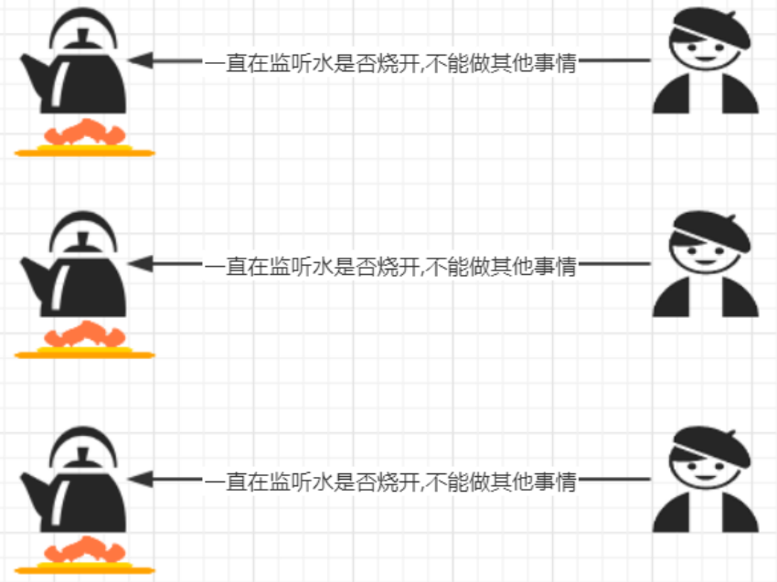
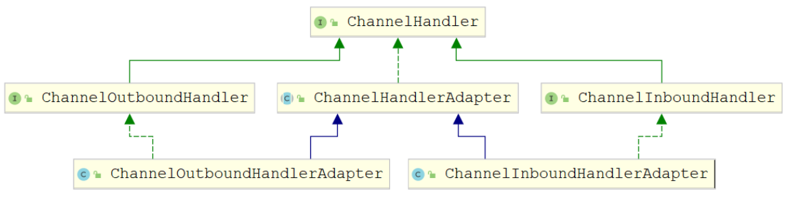

第一部分 RPC框架设计

# 1 Socket回顾与I/O模型

## 1.1 Socket网络编程回顾

### 1.1.1 Socket概述

Socket，套接字就是两台主机之间逻辑连接的端点。TCP/IP协议是**传输层**协议，主要解决数据如何在网络中传输；而HTTP是**应用层**协议，主要解决如何包装数据。Socket是通信的基石，是支持TCP/IP协议的网络通信的基本操作单元。它是网络通信过程中端点的抽象表示，包含进行网络通信必须的五种信息：连接使用的协议、本地主机的IP地址、本地进程的协议端口、远程主机的IP地址、远程进程的协议端口。


### 1.1.2 Socket整体流程

Socket编程主要涉及客户端和服务端两个方面，首先是在服务器端创建一个服务器套接字（ServerSocket），并把它附加到一个端口上，服务器从这个端口监听连接。端口号的范围是0~65536，但是0~1024是为特权服务保留的端口号，可以选择任意一个当前没有被其他进程使用的端口。

客户端请求与服务器进行连接的时候，根据服务器的域名或者IP地址，加上端口号，打开一个套接字。当服务器接受连接后，服务器和客户端之间的通信就像输入输出流一样进行操作。


### 1.1.3 代码实现

https://gitee.com/turboYuu/rpc-3-1/tree/master/lab/socket

1. 服务端代码

   ```java
   package com.turbo.server;
   
   import java.io.IOException;
   import java.io.InputStream;
   import java.io.OutputStream;
   import java.net.ServerSocket;
   import java.net.Socket;
   import java.util.concurrent.ExecutorService;
   import java.util.concurrent.Executors;
   
   public class ServerDemo {
   
       public static void main(String[] args) throws Exception {
           //1.创建一个线程池,如果有客户端连接就创建一个线程, 与之通信
           ExecutorService executorService = Executors.newCachedThreadPool();
           //2.创建 ServerSocket 对象
           ServerSocket serverSocket = new ServerSocket(9999);
           System.out.println("服务器已启动");
           while (true) {
               //3.监听客户端
               final Socket socket = serverSocket.accept();
               System.out.println("有客户端连接");
               //4.开启新的线程处理
               executorService.execute(new Runnable() {
                   @Override
                   public void run() {
                       handle(socket);
                   }
               });
           }
       }
   
       public static void handle(Socket socket) {
           try {
               System.out.println("线程ID:" + Thread.currentThread().getId()
                       + "   线程名称:" + Thread.currentThread().getName());
               //从连接中取出输入流来接收消息
               InputStream is = socket.getInputStream();
               byte[] b = new byte[1024];
               int read = is.read(b);
               System.out.println("客户端:" + new String(b, 0, read));
               //连接中取出输出流并回话
               OutputStream os = socket.getOutputStream();
               os.write("没钱".getBytes());
           } catch (Exception e) {
               e.printStackTrace();
           } finally {
               try {
                   //关闭连接
                   socket.close();
               } catch (IOException e) {
                   e.printStackTrace();
               }
           }
       }
   }
   ```

2. 客户端代码

   ```java
   package com.turbo.client;
   
   import java.io.InputStream;
   import java.io.OutputStream;
   import java.net.Socket;
   import java.util.Scanner;
   
   public class ClientDemo {
       public static void main(String[] args) throws Exception {
           while (true) {
               //1.创建 Socket 对象
               Socket s = new Socket("127.0.0.1", 9999);
               //2.从连接中取出输出流并发消息
               OutputStream os = s.getOutputStream();
               System.out.println("请输入:");
               Scanner sc = new Scanner(System.in);
               String msg = sc.nextLine();
               os.write(msg.getBytes());
               //3.从连接中取出输入流并接收回话
               InputStream is = s.getInputStream();
               byte[] b = new byte[1024];
               int read = is.read(b);
               System.out.println("老板说:" + new String(b, 0, read).trim());
               //4.关闭
               s.close();
           }
       }
   }
   ```

   

## 1.2 I/O模型

### 1.2.1 I/O模型说明

1. I/O模型简单的理解：就是用什么样的通道进行数据的发送和接受，很大程度上决定了通信的性能
2. Java共支持3中网络编程模型 I/O模式：BIO（同步并阻塞）、NIO（同步非阻塞）、AIO（异步非阻塞）


**阻塞与非阻塞**

> 主要指的是访问IO的线程是否会阻塞（或处于等待）线程访问资源，该资源是否准备就绪的一种处理方式


**同步和异步**

> 主要是指数据的请求方式，同步和异步是指访问数据的一种机制


### 1.2.2 BIO（同步并阻塞）

Java BIO就是传统的socket编程。

BIO（blocking I/O）：同步阻塞，服务器实现模式为一个连接一个线程，即客户端有链接请求时服务器端就需要启动一个线程进行处理，如果这个连接不做任何事情会造成不必要的线程开销，可以通过线程池机制改善（实现多个客户连接服务器）。

**工作机制**


生活中的例子：



**BIO问题分析**

1. 每个请求都需要创建独立的线程，与对应的客户端进行数据Read，业务处理，数据Write
2. 并发数较大时，需要创建大量线程来处理连接，系统资源占用较大
3. 连接建立后，如果当前线程暂时没有数据可读，则线程就阻塞在Read操作上，造成线程资源浪费


### 1.2.3 NIO（同步非阻塞）

同步非阻塞，服务器实现为一个线程处理多个请求（连接），即客户端发送的连接请求都会注册到多路复用器上，多路复用器轮询到连接有I/O请求就进行处理


生活中的例子：


### 1.2.4 AIO（异步非阻塞）

AIO引入异步通道的概念，采用Proactor模式，简化了程序编写，有效的请求才启动线程，它的特点是先由操作系统完成后才通知服务端程序启动线程去处理，一般适用于连接数较多且连接时间较长的应用。

> Proactor模式是一个消息异步通知的涉及模式，Proactor通知的不是就绪事件，而是操作完成事件，这也是操作系统异步IO的主要模型。

生活中的例子：


### 1.2.5 BIO、NIO、AIO适用场景分析

1. BIO（同步并阻塞）方式适用于连接数目比较小且固定的架构，这种方式对服务器资源要求比较高，并发局限于应用中，JDK1.4之前的唯一选择，但程序简单易理解。
2. NIO（同步非阻塞）方式适用于连接数多且连接比较短（轻操作）的架构，比如聊天服务器，弹幕系统，服务器间通讯等。编程比较复杂，JDK1.4开始支持
3. AIO（异步非阻塞）方式用于连接数据多且连接比较长（重操作）的架构，比如相册服务器，充分调用OS参与并发操作，编程比较复杂，JDK7开始支持。


# 2 NIO编程

## 2.1 NIO介绍

Java NIO全称Java non-blocking IO，是指JDK提供的新API。从JDK1.4 开始，Java提供了一系列改进输入/输出的新特性，被统称为NIO（New I/O）同步非阻塞。

1. NIO有三大部分：Channel（通道）、Buffer（缓冲区）、Selector（选择器）
2. NIO是面向缓冲区编程的，数据读取到一个缓冲区，需要时可在缓冲区中前后移动，这就增加了处理过程中的灵活性，使用它可以提供非阻塞式的高伸缩性网络。
3. Java NIO的非阻塞模式，是一个线程从某通道发送请求或者读取数据，但是它仅能得到目前可用的数据，如果目前没有数据可用时，就什么都不会获取，而是保持线程阻塞，所以直到数据变的可以读之前，该线程可以继续做其他的事情。非阻塞写也是如此，一个线程请求写入一些数据到某通道，但不需要等待它完全写入，这个线程同时可以去做别的事情。通俗理解：**NIO是可以做到用一个线程来处理多个操作的**。假设有10000个请求过来，根据实际情况，可以分配50个或者100个线程来处理。不想之前的阻塞IO那样，非得分配10000个线程。


## 2.2 NIO和BIO的比较

1. BIO以流的方式处理数据，而NIO以缓冲区的方式处理数据，缓冲区I/O的效率比流I/O高很多。
2. BIO是阻塞的，NIO是非阻塞的
3. BIO基于字节流和字符流进行操作，而NIO基于Channel（通道）和Buffer（缓冲区）进行操作，数据总是从通道读取到缓冲区中，或者从缓冲区写入通道中。Selector（选择器）用于监听多个通道的事件（比如：连接请求，数据到达等），因此使用单个线程就可以监听多个客户端通道

## 2.3 NIO三大核心原理示意图

一张图描述NIO的Selector、Channel、Buffer的关系


1. 每个Channel都会对应一个Buffer
2. Selector对应一个线程，一个线程对应多个Channel
3. 每个Channel都注册到Selector上
4. Selector不断轮询查看Channel上的事件，**事件**是通道Channel非常重要的概念
5. Selector会根据不同的事件，完成不同的处理操作
6. Buffer就是一块内存，底层是有一个数组
7. 数据的读取写入是通过Buffer，这个和BIO有区别（BIO中要么是输入流，或是输出流，不能双向），但是NIO的Buffer是可以读也可以写，Channel是双向的。

## 2.4 缓冲区（Buffer）

### 2.4.1 基本介绍

缓冲区（Buffer）：缓冲区本质上就是一个可以读写数据的内存块，可以理解成是一个数组，该对象提供了一组方法，可以更轻松的使用内存块。缓冲区对象内置了一些机制，能够跟踪和记录缓冲区的状态变化情况。Channel提供从网络读取数据的渠道，但是读取或写入的数据都必须经由Buffer。


### 2.4.2 Buffer常用API介绍

#### 2.4.2.1 Buffer类及其子类


在NIO中，Buffer是一个顶层父类，它是一个抽象类，类的层级关系图，常用的缓冲区分别对应byte,Short,int,long,float,double,char 7种。

#### 2.4.2.2 缓冲区对象创建

| 方法名                                          | 说明                           |
| ----------------------------------------------- | ------------------------------ |
| public static ByteBuffer allocate(int capacity) | 创建byte类型的指定长度的缓冲区 |
| public static ByteBuffer wrap(byte[] array)     | 创建一个有内容的byte类型缓冲区 |

示例代码：https://gitee.com/turboYuu/rpc-3-1/blob/master/lab/NIO/src/com/turbo/buffer/CreateBufferDemo.java

```java
package com.turbo.buffer;

import java.nio.ByteBuffer;

/**
 * Buffer的创建
 */
public class CreateBufferDemo {
    public static void main(String[] args) {
        //1.创建指定长度的缓冲区  ByteBuffer为例
        ByteBuffer allocate = ByteBuffer.allocate(5);
        for (int i = 0; i < 5; i++) {
            //从缓冲区当中拿取数据
            System.out.println(allocate.get());
        }
        //从缓冲区当中拿去数据
        //会报错. 后续讲解
        //System.out.println(allocate.get());

        //2.创建一个有内容的缓冲区
        ByteBuffer wrap = ByteBuffer.wrap("turbo".getBytes());
        for (int i = 0; i < 5; i++) {
            System.out.println(wrap.get());
        }
    }
}
```

#### 2.4.2.3 缓冲区对象添加数据

| 方法名                                            | 说明                                          |
| ------------------------------------------------- | --------------------------------------------- |
| int position()/position(int newPosition)          | 获取当前要操作的索引/修改当前要操作的索引位置 |
| int limit()/Buffer limit(int newLimit)            | 最多能操作到哪个索引/修改最多能操作的索引位置 |
| int capacity()                                    | 返回缓冲区的总长度                            |
| int remaining()/boolean hasRemaining()            | 返回多少能操作索引个数/是否还有能操作         |
| ByteBuffer put(byte b)/ByteBuffer put(byte[] src) | 添加一个字节/添加字节数组                     |

图解：


示例代码：

https://gitee.com/turboYuu/rpc-3-1/blob/master/lab/NIO/src/com/turbo/buffer/PutBufferDemo.java

```java
package com.turbo.buffer;

import java.nio.ByteBuffer;

/**
 * 向缓冲区中添加数据
 */
public class PutBufferDemo {
    public static void main(String[] args) {
        //1.创建一个缓冲区
        ByteBuffer allocate = ByteBuffer.allocate(10);
        System.out.println(allocate.position());//0 获取当前索引所在位置
        System.out.println(allocate.limit());//10 最多能操作到哪个索引位置
        System.out.println(allocate.capacity());//10 返回缓冲区总长度
        System.out.println(allocate.remaining());//10 还有多少个可以操作的个数

        System.out.println("----------------");
        // 修改当前索引所在位置
        //allocate.position(1);
        // 修改最多能操作到哪个索引的位置
        //allocate.limit(9);
//        System.out.println(allocate.position());//1 获取当前索引所在位置
//        System.out.println(allocate.limit());//9 最多能操作到哪个索引位置
//        System.out.println(allocate.capacity());//10 返回缓冲区总长度
//        System.out.println(allocate.remaining());//8 还有多少个可以操作的个数

        // 添加一个字节
        allocate.put((byte) 97);
        System.out.println(allocate.position());//1 获取当前索引所在位置
        System.out.println(allocate.limit());//10 最多能操作到哪个索引位置
        System.out.println(allocate.capacity());//10 返回缓冲区总长度
        System.out.println(allocate.remaining());//9 还有多少个可以操作的个数

        System.out.println("----------------");
        // 添加一个数组
        allocate.put("abc".getBytes());
        System.out.println(allocate.position());//4 获取当前索引所在位置
        System.out.println(allocate.limit());//10 最多能操作到哪个索引位置
        System.out.println(allocate.capacity());//10 返回缓冲区总长度
        System.out.println(allocate.remaining());//6 还有多少个可以操作的个数
        System.out.println("----------------");
        // 添加一个数组
        allocate.put("123456".getBytes());
        System.out.println(allocate.position());//10 获取当前索引所在位置
        System.out.println(allocate.limit());//10 最多能操作到哪个索引位置
        System.out.println(allocate.capacity());//10 返回缓冲区总长度
        System.out.println(allocate.remaining());//0 还有多少个可以操作的个数
        System.out.println(allocate.hasRemaining());//false 是否还能操作
        System.out.println("----------------");

        //如果缓冲区满了. 可以调整position位置, 就可以重复写. 会覆盖之前存入索引位置的值
        allocate.position(0);
        allocate.put("123456".getBytes());
        System.out.println(allocate.position());//6 获取当前索引所在位置
        System.out.println(allocate.limit());//10 最多能操作到哪个索引位置
        System.out.println(allocate.capacity());//10 返回缓冲区总长度
        System.out.println(allocate.remaining());//4 还有多少个可以操作的个数
        System.out.println(allocate.hasRemaining());//true 是否还能操作

    }
}
```

#### 2.4.2.4 缓冲区对象读取数据

| 方法名                     | 介绍                                                 |
| -------------------------- | ---------------------------------------------------- |
| Buffer flip()              | 反转这个缓冲区，limit设置position位置，position设置0 |
| byte get()                 | 读一个字节                                           |
| ByteBuffer get(byte[] dst) | 都多个字节                                           |
| ByteBuffer rewind()        | 将position设置为0，可以重复读                        |
| ByteBuffer clear()         | 切换写模式，position设置为0，limit设置为capacity     |
| byte[] array()             | 将缓冲区转换成字节数组返回                           |

图解：filp()方法


图解：clear()方法


实例代码：

https://gitee.com/turboYuu/rpc-3-1/blob/master/lab/NIO/src/com/turbo/buffer/GetBufferDemo.java

```java
package com.turbo.buffer;

import java.nio.ByteBuffer;

/**
 * 从缓冲区中读取数据
 */
public class GetBufferDemo {
    public static void main(String[] args) {
        //1.创建一个指定长度的缓冲区
        ByteBuffer allocate = ByteBuffer.allocate(10);
        allocate.put("0123".getBytes());
        //allocate.flip();
        //获取当前索引所在位置
        System.out.println("position:" + allocate.position());//4
        System.out.println("limit:" + allocate.limit());//10
        System.out.println("capacity:" + allocate.capacity());//10
        System.out.println("remaining:" + allocate.remaining());//6

        //切换读模式
        System.out.println("读取数据--------------");
        allocate.flip();
        System.out.println("position:" + allocate.position());//4
        System.out.println("limit:" + allocate.limit());//10
        System.out.println("capacity:" + allocate.capacity());//10
        System.out.println("remaining:" + allocate.remaining());//6
        for (int i = 0; i < allocate.limit(); i++) {
            System.out.println(allocate.get());
        }
        //读取完毕后.继续读取会报错,超过limit值
        //System.out.println(allocate.get());
        //读取指定索引字节
        System.out.println("读取指定索引字节--------------");
        System.out.println(allocate.get(1));//49

        System.out.println("读取多个字节--------------");
        // 重复读取
        allocate.rewind();
        byte[] bytes = new byte[4];
        allocate.get(bytes);
        System.out.println(new String(bytes));//0123

        // 将缓冲区转化字节数组返回
        System.out.println("将缓冲区转化字节数组返回（包括为空的部分）--------------");
        byte[] array = allocate.array();
        System.out.println(new String(array));//0123

        // 切换写模式,覆盖之前索引所在位置的值
        System.out.println("写模式--------------");
        allocate.clear();
        allocate.put("abc".getBytes());
        System.out.println(new String(allocate.array()));//abc3

    }
}

```


注意事项：

> 1. capacity：容量（长度）；limit：界限（最多能读/能写到哪里）；position：位置（读写哪个索引）。
> 2. 获取缓冲区里面的数据之前，需要调用flip方法。
> 3. 再次写数据之前，需要调用clear方法，但是数据还未消失，等再次写入数据，被覆盖才会消失。

## 2.5 通道（Channel）

### 2.5.1 基本介绍

通常来说NIO中的所有IO嗾使从Channel（通道）开始的。NIO的通道类似于流，但有些区别：

1. 通道可以读也可以写，流一般来说是单向的（只能读或写，所以之前我们用流进行IO操作的时候需要分别创建一个输入流和一个输出流）
2. 通道可以异步读写
3. 通道总是基于缓冲区Buffer来读写


### 2.5.2 Channel常用类介绍

> 1.Channel接口

常用的Channel实现类有：FileChannel，DatagramChannel，ServerSocketChannel和SocketChannel。FileChannel用于文件的数据读写，DatagramChannel用于UDP的数据读写，ServerSocketChannel和SocketChannel用于TCP的数据读写。【**ServerSocketChannel类似ServerSocket，SocketChannel类似Socket**】


> 2.SocketChannel 与 ServerSocketChannel

类似Socket和ServerSocket，可以完成客户端与服务端数据的通信工作。

### 2.5.3 ServerSocketChannel

**服务端实现步骤**：

1. 打开一个服务端通道
2. 绑定对应的端口号
3. 通道默认是阻塞的，需要设置位非阻塞
4. 检查是否有客户端连接，有客户端连接会返回对应的通道
5. 获取客户端传递过来的数据，并把数据放在byteBuffer这个缓冲区中
6. 给客户端回写数据
7. 释放资源

**代码实现**：

https://gitee.com/turboYuu/rpc-3-1/blob/master/lab/NIO/src/com/turbo/channel/NIOServer.java

```java
package com.turbo.channel;

import java.io.IOException;
import java.net.InetSocketAddress;
import java.nio.ByteBuffer;
import java.nio.channels.ServerSocketChannel;
import java.nio.channels.SocketChannel;
import java.nio.charset.StandardCharsets;

/**
 * 服务端
 */
public class NIOServer {
    public static void main(String[] args) throws IOException, InterruptedException {
        //1. 打开一个服务端通道
        ServerSocketChannel serverSocketChannel = ServerSocketChannel.open();
        //2. 绑定对应的端口号
        serverSocketChannel.bind(new InetSocketAddress(9999));
        //3. 通道默认是阻塞的，需要设置为非阻塞
        serverSocketChannel.configureBlocking(false);
        System.out.println("服务端启动成功....");
        while (true) {
            //4. 检查是否有客户端连接 有客户端连接会返回对应的通道
            SocketChannel socketChannel = serverSocketChannel.accept();
            if (socketChannel == null) {
                System.out.println("没有客户端连接...我去做别的事情");
                Thread.sleep(2000);
                continue;
            }
            //5. 获取客户端传递过来的数据,并把数据放在byteBuffer这个缓冲区中
            ByteBuffer allocate = ByteBuffer.allocate(1024);
            //返回值
            //正数: 表示本次读到有效字节数
            //0: 表示本次没有读到数据
            //-1: 表示读到末尾
            int read = socketChannel.read(allocate);
            System.out.println("客户端消息:" + new String(allocate.array(), 0,
                    read,StandardCharsets.UTF_8));
            //6. 给客户端回写数据
            socketChannel.write(ByteBuffer.wrap("没钱".getBytes(StandardCharsets.UTF_8)));
            //7. 释放资源
            socketChannel.close();
        }
    }
}
```


### 2.5.4 SocketChannel

**实现步骤**

1. 打开通道
2. 设置连接IP和端口号
3. 写出数据
4. 读取服务器写回的数据

**代码实现**

https://gitee.com/turboYuu/rpc-3-1/blob/master/lab/NIO/src/com/turbo/channel/NIOClient.java

```java
package com.turbo.channel;

import java.io.IOException;
import java.net.InetSocketAddress;
import java.nio.Buffer;
import java.nio.ByteBuffer;
import java.nio.channels.SocketChannel;
import java.nio.charset.StandardCharsets;

/**
 * 客户端
 */
public class NIOClient {
    public static void main(String[] args) throws IOException {
        //1. 打开通道
        SocketChannel socketChannel = SocketChannel.open();
        //2. 设置连接IP和端口号
        socketChannel.connect(new InetSocketAddress("127.0.0.1", 9999));
        //3. 写出数据
        socketChannel.write(ByteBuffer.wrap("老板.还钱吧!".getBytes(StandardCharsets.UTF_8)));
        //4. 读取服务器写回的数据
        ByteBuffer allocate = ByteBuffer.allocate(1024);
        int read = socketChannel.read(allocate);
        System.out.println("服务端消息:" +
                new String(allocate.array(), 0, read, StandardCharsets.UTF_8));
        //5. 释放资源
        socketChannel.close();
    }
}
```


## 2.6 选择器（Selector）

### 2.6.1 基本介绍

可以用一个线程，处理多个的客户端连接，就会使用到NIO的Selector（选择器）。Selector能够检测多个注册的服务端通道上是否有事件发生，如果有事件发生，便获取事件然后针对每个事件进行相应的处理。这样就可以只用一个单线程去管理多个通道，也就是管理多个连接和请求。


**在这种没有选择器的情况下，对应每个连接对应一个处理线程。但是连接并不能骂声就会发送消息，所以还会产生资源浪费**


**只有在通道真正有读写事件发生时，才会进行读写，就大大地减少了系统开销，并且不必为每个连接都创建一个线程，不用去维护多个线程，避免了多线程之间的上下文切换导致的开销**

### 2.6.2 常用API介绍

> 1.Selector类是一个抽象类


常用方法：

- Selector.open()	//得到一个选择器对象
- Selector.select()    //阻塞，监控所有注册的通道，当有对应的事件操作时，会将SelectionKey放入集合内部并返回事件数量
- Selector.select(1000)   //阻塞1000毫秒，监控所有注册的通道，当有对应的事件操作时，会将SelectionKey放入集合内部并返回

> 2.SelectionKey


**常用方法**

- SelectionKey.isAcceptable()    是否是连接连续事件
- SelectionKey.isConnectable()    是否是连续就绪事件
- SelectionKey.isReadable()   是否是读就绪事件
- SelectionKey.isWritable()   是否是写就绪事件

**SelectionKey中定义的4中事件**

- SelectionKey.OP_ACCEPT    -- 接收连续继续事件，表示服务器监听到了客户链接，服务器可以接收这个连接了
- SelectionKey.OP_CONNECT -- 连接就绪事件，表示客户端与服务器的连接已经建立成功
- SelectionKey.OP_READ -- 读就绪事件，表示通道中已经有了可读的数据，可以执行读操作了（通道目前有数据，可以进行读操作了）
- SelectionKey.OP_WRITE -- 写就绪事件，表示已经可以向通道写数据了（通道目前可以用于写操作）

### 2.6.3 Selector编码

**服务端实现步骤**：

1. 打开一个服务端通道
2. 绑定对应的端口号
3. 通道默认是阻塞的，需要设置为非阻塞
4. 创建选择器
5. 将服务端通道注册到选择器上，并指定注册监听事件为OP_ACCEPT
6. 检查选择器是否有事件
7. 获取事件集合
8. 判断是否是客户端连接事件SelectionKey.isAcceptable()
9. 得到客户端通道，并将通道注册到选择器上，并指定监听事件为OP_READ
10. 判断是否是客户端读就绪事件SelectionKey.isReadable()
11. 的大客户端通道，读取数据到缓冲区
12. 给客户端回写数据
13. 从集合中删除对应的事件，因为防止二次处理。


**代码实现**：

https://gitee.com/turboYuu/rpc-3-1/blob/master/lab/NIO/src/com/turbo/selector/NIOSelectorServer.java

```java
package com.turbo.selector;

import java.io.IOException;
import java.net.InetSocketAddress;
import java.nio.ByteBuffer;
import java.nio.channels.SelectionKey;
import java.nio.channels.Selector;
import java.nio.channels.ServerSocketChannel;
import java.nio.channels.SocketChannel;
import java.nio.charset.StandardCharsets;
import java.util.Iterator;
import java.util.Set;

/**
 * 服务端-选择器
 */
public class NIOSelectorServer {
    public static void main(String[] args) throws IOException {
        //1. 打开一个服务端通道
        ServerSocketChannel serverSocketChannel = ServerSocketChannel.open();
        //2. 绑定对应的端口号
        serverSocketChannel.bind(new InetSocketAddress(9999));
        //3. 通道默认是阻塞的，需要设置为非阻塞
        serverSocketChannel.configureBlocking(false);
        //4. 创建选择器
        Selector selector = Selector.open();
        //5. 将服务端通道注册到选择器上,并指定注册监听的事件为OP_ACCEPT
        serverSocketChannel.register(selector, SelectionKey.OP_ACCEPT);
        System.out.println("服务端启动成功.....");
        while (true) {
            //6. 检查选择器是否有事件
            int select = selector.select(2000);
            if (select == 0) {
                System.out.println("没有事件发生....");
                continue;
            }
            //7. 获取事件集合
            Set<SelectionKey> selectionKeys = selector.selectedKeys();
            Iterator<SelectionKey> iterator = selectionKeys.iterator();
            while (iterator.hasNext()) {
                //8. 判断事件是否是客户端连接事件SelectionKey.isAcceptable()
                SelectionKey key = iterator.next();
                if (key.isAcceptable()) {
                    //9. 得到客户端通道,并将通道注册到选择器上, 并指定监听事件为OP_READ
                    SocketChannel socketChannel = serverSocketChannel.accept();
                    System.out.println("有客户端连接.....");
                    //将通道必须设置成非阻塞的状态.因为selector选择器需要轮询监听每个通道的事件
                    socketChannel.configureBlocking(false);
                    //指定监听事件为OP_READ 读就绪事件 (为什么是读事件：要站在服务器的角度,因为服务器要读取客户端的数据)
                    socketChannel.register(selector, SelectionKey.OP_READ);
                }


                //10. 判断是否是客户端读就绪事件SelectionKey.isReadable()
                if (key.isReadable()) {
                    //11.得到客户端通道,读取数据到缓冲区
                    SocketChannel socketChannel = (SocketChannel) key.channel();
                    ByteBuffer allocate = ByteBuffer.allocate(1024);
                    int read = socketChannel.read(allocate);
                    if (read > 0) {
                        System.out.println("客户端消息:" + new String(allocate.array(), 0, read
                                , StandardCharsets.UTF_8));
                        //12. 给客户端回写数据
                        socketChannel.write(ByteBuffer.wrap("没钱".getBytes(StandardCharsets.UTF_8)));
                        socketChannel.close();
                    }
                }
                //13. 从集合中删除对应的事件, 因为防止二次处理.
                iterator.remove();
            }
        }
    }
}

```


# 3 Netty核心原理

## 3.1 Netty介绍

### 3.1.1 原生NIO存在的问题

1. NIO的类库和API繁杂，使用麻烦：需要熟练掌握Selector、ServerSocketChannel、SocketChannel、ByteBuffer等。

2. 需要具备其他额外技能：要熟悉Java多线程编程，因为NIO涉及到Reactor模式，必须对多线程和网络编程非常熟悉，才能编写出高质量的NIO程序。

3. 开发工作量和难度都非常大：例如客户端面临 断连重连、网络闪断、半包读写、失败缓存、网络拥塞 和 异常流的处理等等。

4. JDK NIO的Bug：臭名昭著的Epoll Bug，它会导致Selector空轮询，最终导致CPU 100% 。直到 JDK 1.7 版本该问题仍旧存在，没有被根本解决

   > 在NIO中通过Selector的轮询当前是否有IO事件，根据JDK NIO api描述，Selector的Select方法会一致阻塞，直到IO事件达到或超时，但是在Linux平台上这里有时会出现问题，在某些场景下select方法会直接返回，即使没有超时并且也没有IO事件达到，这就是著名的epoll bug，这是一个比较严重的bug，它会导致线程陷入死循环，会让CPU飙到100%，极大地影响系统地可靠性，到目前为止，JDK都没有完全解决这个问题。

   

### 3.1.2 概述

Netty是由JBOSS提供地一个Java开源框架。Netty提供异步的、基于事件驱动的网络应用程序框架，用以快速开发高性能、高可靠的网络IO程序。Netty是一个基于NIO的网络编程框架，使用Netty可以帮助你快速、简单的开发出一个网络应用，相当于简化和流程化了NIO的开发过程。作为当前最流行的NIO框架，Netty在互联网领域、大数据分布式计算领域、游戏行业、通信行业等获得了广泛的应用，知名的Elasticsearch、Dubbo框架内部都采用了Netty。

https://netty.io/


从图中就能看出Netty的强大之处：零拷贝、可拓展事件模型；支持TCP、UDP、HTTP、WebSocket等协议；提供安全传输、压缩、大文件传输、编解码支持等等。

具备如下优点：

1. 设计优雅，提供阻塞和非阻塞的Socket；提供灵活可拓展的事件模型；提供高可靠可定制的线程模型。
2. 具备更高的性能和更大的吞吐量，使用零拷贝技术最小化不必要的内存复制，减少资源的消耗。
3. 提供安全传输特性。
4. 支持多种主流协议；预置多种编解码功能，支持用户开发私有协议。

## 3.2 线程模型

### 3.2.1 线程模型基本介绍

不同的线程模式，对程序的性能有很大影响，在学习Netty线程模式之前，首先讲解下 各个线程模式，最后看Netty线程模型有什么优越性。目前存在的线程模型有：

- 传统阻塞I/O服务模型

- Reactor模型

  根据Reactor的数量和处理资源池线程的数量不同，有3中典型的实现

  - 单Reactor 单线程
  - 单Reactor 多线程
  - 主从 Reactor 多线程

### 3.2.2 传统阻塞I/O服务模型

采用阻塞IO 模式获取输入的数据，每个连接都需要独立的线程完成数据的输入，业务处理和数据返回工作。


存在问题：

1. 当并发数很大，就会创建大量的线程，占用很大系统资源
2. 连接创建后，如果当前线程暂时没有数可读，该线程就会阻塞在read操作，造成线程资源浪费


### 3.2.3 Reactor模型

Reactor模式，通过一个或多个输入同时传递给服务处理器的模式，服务器端程序处理传入的多个请求，并将它们同步分派到相应的处理线程，因此Reactor模式也叫Dispatcher模式。**Reactor模式使用IO复用监听事件，收到事件后，分发给某个线程（进程），这点就是网络服务器高并发处理的关键**。

> 1.**单Reactor 单线程**


- Selector是可以实现应用程序通过一个阻塞对象监听多路连接请求
- Reactor对象通过Selector监控客户端请求事件，收到事件后通过Dispatch进行分发
- 建立连接事件，则由Acceptor通过Accept处理连接请求，然后创建一个Handler对象处理连接，完成后续业务处理
- Handler会完成Read → 业务处理 → Send 的完整业务流程

**优点**：

模型简单，没有多线程，进程通信，竞争的问题，全部都在一个线程中完成

**缺点**：

1. 性能问题：只有一个线程，无法完全发挥多核CPU的性能。Handler在处理某个连接上的业务时，整个进程无法处理其他连接，很容易导致性能瓶颈
2. 可靠性问题：线程意外终止或者进入死循环，会导致整个系统通信模块不可用，不能接收和处理外部消息，造成节点故障

> 2.**单 Reactor 多线程**


- Reactor对象通过Selector监控客户端请求事件，收到事件后，通过dispatch进行分发
- 如果建立连接请求，则由Acceptor通过accept处理连接请求
- 如果不是连接请求，则由reactor分发调用连接对应的handler来处理
- handler只负责响应事件，不做具体的业务处理，通过read读取数据后，会分发给后面的worker线程池的某个线程处理业务
- worker线程池会分配独立线程完成真正的业务，并将结果返回给handler
- handler收到响应后，通过send将结果返回给client

**优点**

可以充分的利用多核cpu的处理能力

**缺点**

多线程数据共享和访问比较复杂，reactor处理所有的事件的监听和响应，在单线程运行，在高并发场景容易出现性能瓶颈


> 3.**主从 Reactor多线程**


- Reactor主线程MainReactor对象通过Selector监听客户端连接事件，收到事件后，通过Acceptor处理客户端连接事件
- 当Acceptor处理完客户端连接事件之后（与客户端建立好Socket连接），MainReactor将连接分配给SubReactor。（即：MainReactor只负责监听客户端连接请求，和客户端建立连接之后将交由SubReactor监听后面的IO事件。）
- SubReactor将连接加入到自己的连接队列进行监听，并创建Handler对各种事件进行处理
- 当连接上由新事件发生的时候，SubReactor就会调用对应的Handler处理
- Handler通过read从连接上读取请求数据，将请求数据分发给Worker线程池进行业务处理
- Worker线程池会分配独立线程来完成真正的业务处理，并将处理结果返回给Handler。Handler通过send向客户端发送响应数据
- 一个MainReactor可以对应多个SubReactor，即一个Main线程可以对应多个SubReactor线程

**优点**：

1. MainReactor线程与SubReactor线程的数据交互简单，职责明确；MianReactor线程只需要接收新连接，SubReactor线程完成后续的业务处理
2. MainReactor线程与SubReactor线程的数据交互简单，MainReactor线程只需要把新连接传给SubReactor线程，SubReactor线程无需返回数据
3. 多个SubReactor线程能够应对更高的并发请求

**缺点**：

这种模式的缺点：编程复杂度较高。但是由于其优点明显，在许多项目中被广泛使用，包括Nginx，Mencached、Netty等。这种模式也被叫做服务器 1+M+N 线程模式，即使用该模式开发的服务器包含一个（或多个，1只是表示相对较少）连接建立线程 + M 个 IO 线程 +N 个业务处理线程。这是业务成熟的服务器程序设计模式。

### 3.2.4 Netty线程模型

Netty 的设计主要基于主从Reactor多线程模式，并做了一定的改进。

> 1.**简单版Netty模型**


- BossGroup线程维护Selector，SererSocketChannel注册到这个Selector上，只关注连接建立请求事件（主Reactor）
- 当接收到来自客户端的连接建立请求事件的时候，通过ServerSocketChannel.accept方法获得对应的SocketChannel，并封装成NioSocketChannel注册到WorkerGroup线程中的Selector，每个Selector运行在一个线程中（从Reactor）
- 当WorkerGroup线程中的Selector监听到自己感兴趣的IO事件后，就调用Handler进行处理


> 2.进阶版Netty模型


- 有两组线程池：BossGroup和WorkerGroup，BossGroup中的线程专门负责和客户端建立连接，WorkerGroup中的线程专门负责处理连接上的读写
- BossGroup和WorkerGroup含有多个不断循环的执行事件处理的线程，每个线程都包含一个Selector，用于监听注册在其上的Channel
- 每个BossGroup中的线程循环执行以下三个步骤
  - 轮询注册在其上的ServerSocketChannel的accept事件（OP_ACCEPT事件）
  - 处理accept事件，与客户端建立连接，生成一个NioSocketChannel，并将其注册到WorkerGroup中的某个线程上的Selector
  - 再去以此循环处理任务队列中的下一个事件
- 每个WorkerGroup中的线程循环执行以下三个步骤
  - 轮询注册在其上的NioSocketChannel的read/write事件（OP_READ/OP_WRITE事件）
  - 在对应的NioSocketChannel上处理read/write事件
  - 再去以此循环处理任务队列中的下一个事件


> 3.**详细版Netty模型**


- Netty抽象出两组线程池：BossGroup和WorkerGroup，也可以叫做BossNioEventLoopGroup和WorkerNioEventLoopGroup。每个线程池中都有NioEventLoop线程。BossGroup中的线程专门负责和客户端建立连接，WorkerGroup中的线程专门负责处理连接上的读写。BossGroup和WorkerGroup的类型都是NioEventoopGroup

- NioEventLoopGroup相当于一个事件循环组，这个组中含有多个事件循环，每个事件循环就是一个NioEventLoop

- NioEventLoop表示一个不断循环的执行事件处理的线程，每个NioEventLoop都包含一个Selector，用于监听注册在其上的Socket网络连接（Channel）

- NioEventLoopGroup可以含有多个线程，即可以含有多个NioEventLoop

- 每个BossNioEventLoop中循环执行以下三个步骤：

  - **select**：轮询注册在其上的ServerSocketChannel的accept事件（OP_ACCEPT事件）
  - **processSelectdKeys**：处理accept事件，与客户端建立连接，生成一个NioSocketChannel，并将其注册到某个WorkerNioEventLoop上的Selector上
  - **runAlltasks**：再去以此循环处理任务队列中的其他任务

- 每个WorkerNioEventLoop中循环以下三个步骤

  - **select**：轮询注册在其上的NioSocketChannel的read/write事件（OP_READ/OP_WRITE事件）
  - **processSelectdKeys**：在对应的NioSocketChannel上处理read/write事件
  - **runAllTasks**：再去以此循环任务队列中的其他任务

- 在以上两个processSelectedKeys步骤中，会使用Pipeline（管道），Pipeline中引用了Channel，即通过Pipeline可以获取到对应的Channel，Pipeline中维护了很多的处理器（拦截处理器、过滤器处理器、自定义处理器等）。

  

## 3.3 核心API介绍

### 3.3.1 ChannelHandler及其实现类

ChannelHandler接口定义了许多事件处理的方法，可以通过重写这些方法去实现具体的业务逻辑。API关系如下所示：



Netty开发中需要自定义一个Handler类去实现ChannelHandler接口或其子接口或其实现类，然后通过重写相应方法实现业务逻辑，接下来看看一般都需要重写哪些方法

- public void channelActive(ChannelHandlerContext ctx)，通道就绪事件
- public void channelRead(ChannelHandlerContext ctx, Object o)，通道读取数据事件
- public void channelReadComplete(ChannelHandlerContext ctx)，数据读取完毕事件
- public void exceptionCaught(ChannelHandlerContext ctx, Throwable throwable)，通道发生异常事件

### 3.3.2 ChannelPipeline

ChannelPipeline是一个Handler的集合，它负责处理和拦截inbound或者outbound的事件和操作，相当于一个贯穿Netty的责任链。


如果客户端和服务器的Handler是一样的，消息从客户端到服务端或者反过来，每个Inbound类型或Outbound类型的Handler只会经过一次，混合类型的Handler（实现了Inbound和Outbound的Handler）会经过两次。准确的说ChannelPipeline中是一个ChannelHandlerContext，每个上下文对象中有ChannelHandler。**InboundHandler是按照Pipeline的加载顺序顺序执行，OutboundHandler是按照Pipeline的加载顺序，逆序执行**

### 3.3.3 ChannelHandlerContext

这是事件处理器上下文对象，Pipeline链中的实际处理节点。每个处理节点CHannelHandlerContext中包含一个具体的事件处理器ChannelHandler，同时ChannelHandlerContext中也绑定了对应的ChannelPipeline和Channel的信息，方便对ChanneHandler进行调用。常用方法如下所示：

- ChannelFuture close()，关闭通道
- ChannelOutboundInvoker flush()，刷新
- ChannelFuture writeAndFlush(Object msg)，将数据写道ChannelPipeline中当前ChannelHandler的下一个ChannelHandler开始处理（出战）

### 3.3.4 ChannelOption

Netty在创建Channel实例后，一般都需要设置ChannelOption参数。ChannelOption是Socket标准参数，而非Netty独创。常用的参数配置有：

- ChannelOption.SO_BACKLOG

  对应TCP/IP协议listen函数中的backlog参数，用来初始化服务器可连接队列大小。服务端处理客户端连接请求是顺序处理的，所以同一时间只能处理一个客户端连接。多个客户端来的时候，服务端将不能处理

### 3.3.5 ChannelFuture


### 3.3.6 EventLoopGroup和实现类NioEventLoopGroup


### 3.3.7 ServerBootstrap和Bootstrap


### 3.3.8 Unpooled类


## 3.4 Netty入门案例

## 3.5 Netty异步模型

# 4 Netty高级应用

# 5 Netty核心源码剖析

# 6 自定义RPC框架


