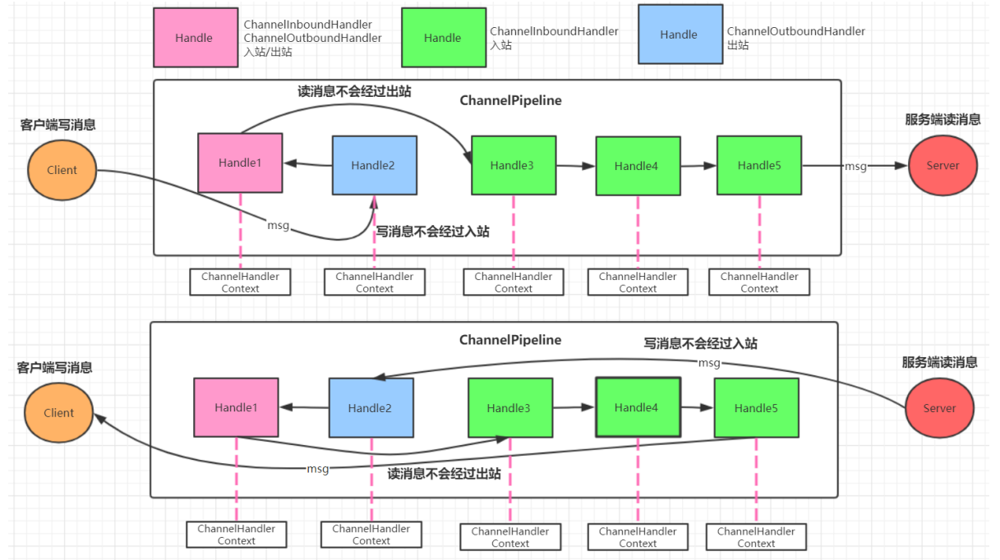

第一部分 RPC框架设计

# 1 Socket回顾与I/O模型

## 1.1 Socket网络编程回顾

### 1.1.1 Socket概述

Socket，套接字就是两台主机之间逻辑连接的端点。TCP/IP协议是**传输层**协议，主要解决数据如何在网络中传输；而HTTP是**应用层**协议，主要解决如何包装数据。Socket是通信的基石，是支持TCP/IP协议的网络通信的基本操作单元。它是网络通信过程中端点的抽象表示，包含进行网络通信必须的五种信息：连接使用的协议、本地主机的IP地址、本地进程的协议端口、远程主机的IP地址、远程进程的协议端口。


### 1.1.2 Socket整体流程

Socket编程主要涉及客户端和服务端两个方面，首先是在服务器端创建一个服务器套接字（ServerSocket），并把它附加到一个端口上，服务器从这个端口监听连接。端口号的范围是0~65536，但是0~1024是为特权服务保留的端口号，可以选择任意一个当前没有被其他进程使用的端口。

客户端请求与服务器进行连接的时候，根据服务器的域名或者IP地址，加上端口号，打开一个套接字。当服务器接受连接后，服务器和客户端之间的通信就像输入输出流一样进行操作。


### 1.1.3 代码实现

https://gitee.com/turboYuu/rpc-3-1/tree/master/lab/socket

1. 服务端代码

   ```java
   package com.turbo.server;
   
   import java.io.IOException;
   import java.io.InputStream;
   import java.io.OutputStream;
   import java.net.ServerSocket;
   import java.net.Socket;
   import java.util.concurrent.ExecutorService;
   import java.util.concurrent.Executors;
   
   public class ServerDemo {
   
       public static void main(String[] args) throws Exception {
           //1.创建一个线程池,如果有客户端连接就创建一个线程, 与之通信
           ExecutorService executorService = Executors.newCachedThreadPool();
           //2.创建 ServerSocket 对象
           ServerSocket serverSocket = new ServerSocket(9999);
           System.out.println("服务器已启动");
           while (true) {
               //3.监听客户端
               final Socket socket = serverSocket.accept();
               System.out.println("有客户端连接");
               //4.开启新的线程处理
               executorService.execute(new Runnable() {
                   @Override
                   public void run() {
                       handle(socket);
                   }
               });
           }
       }
   
       public static void handle(Socket socket) {
           try {
               System.out.println("线程ID:" + Thread.currentThread().getId()
                       + "   线程名称:" + Thread.currentThread().getName());
               //从连接中取出输入流来接收消息
               InputStream is = socket.getInputStream();
               byte[] b = new byte[1024];
               int read = is.read(b);
               System.out.println("客户端:" + new String(b, 0, read));
               //连接中取出输出流并回话
               OutputStream os = socket.getOutputStream();
               os.write("没钱".getBytes());
           } catch (Exception e) {
               e.printStackTrace();
           } finally {
               try {
                   //关闭连接
                   socket.close();
               } catch (IOException e) {
                   e.printStackTrace();
               }
           }
       }
   }
   ```

2. 客户端代码

   ```java
   package com.turbo.client;
   
   import java.io.InputStream;
   import java.io.OutputStream;
   import java.net.Socket;
   import java.util.Scanner;
   
   public class ClientDemo {
       public static void main(String[] args) throws Exception {
           while (true) {
               //1.创建 Socket 对象
               Socket s = new Socket("127.0.0.1", 9999);
               //2.从连接中取出输出流并发消息
               OutputStream os = s.getOutputStream();
               System.out.println("请输入:");
               Scanner sc = new Scanner(System.in);
               String msg = sc.nextLine();
               os.write(msg.getBytes());
               //3.从连接中取出输入流并接收回话
               InputStream is = s.getInputStream();
               byte[] b = new byte[1024];
               int read = is.read(b);
               System.out.println("老板说:" + new String(b, 0, read).trim());
               //4.关闭
               s.close();
           }
       }
   }
   ```

   

## 1.2 I/O模型

### 1.2.1 I/O模型说明

1. I/O模型简单的理解：就是用什么样的通道进行数据的发送和接收，很大程度上决定了通信的性能
2. Java共支持3中网络编程模型 I/O模式：BIO（同步并阻塞）、NIO（同步非阻塞）、AIO（异步非阻塞）


**阻塞与非阻塞**

> 主要指的是访问IO的线程是否会阻塞（或处于等待）线程访问资源，该资源是否准备就绪的一种处理方式


**同步和异步**

> 主要是指数据的请求方式，同步和异步是指访问数据的一种机制


### 1.2.2 BIO（同步并阻塞）

Java BIO就是传统的socket编程。

BIO（blocking I/O）：同步阻塞，服务器实现模式为一个连接一个线程，即客户端有链接请求时服务器端就需要启动一个线程进行处理，如果这个连接不做任何事情会造成不必要的线程开销，可以通过线程池机制改善（实现多个客户连接服务器）。

**工作机制**


生活中的例子：


**BIO问题分析**

1. 每个请求都需要创建独立的线程，与对应的客户端进行数据Read，业务处理，数据Write
2. 并发数较大时，需要创建大量线程来处理连接，系统资源占用较大
3. 连接建立后，如果当前线程暂时没有数据可读，则线程就阻塞在Read操作上，造成线程资源浪费


### 1.2.3 NIO（同步非阻塞）

同步非阻塞，服务器实现为一个线程处理多个请求（连接），即客户端发送的连接请求都会注册到多路复用器上，多路复用器轮询到连接有I/O请求就进行处理


生活中的例子：


### 1.2.4 AIO（异步非阻塞）

AIO引入异步通道的概念，采用Proactor模式，简化了程序编写，有效的请求才启动线程，它的特点是先由操作系统完成后才通知服务端程序启动线程去处理，一般适用于连接数较多且连接时间较长的应用。

> Proactor模式是一个消息异步通知的涉及模式，Proactor通知的不是就绪事件，而是操作完成事件，这也是操作系统异步IO的主要模型。

生活中的例子：


### 1.2.5 BIO、NIO、AIO适用场景分析

1. BIO（同步并阻塞）方式适用于连接数目比较小且固定的架构，这种方式对服务器资源要求比较高，并发局限于应用中，JDK1.4之前的唯一选择，但程序简单易理解。
2. NIO（同步非阻塞）方式适用于连接数多且连接比较短（轻操作）的架构，比如聊天服务器，弹幕系统，服务器间通讯等。编程比较复杂，JDK1.4开始支持
3. AIO（异步非阻塞）方式用于连接数据多且连接比较长（重操作）的架构，比如相册服务器，充分调用OS参与并发操作，编程比较复杂，JDK7开始支持。


# 2 NIO编程

## 2.1 NIO介绍

Java NIO全称 Java non-blocking IO，是指JDK提供的新API。从JDK1.4 开始，Java提供了一系列改进输入/输出的新特性，被统称为NIO（New I/O）同步非阻塞。

1. NIO有三大部分：Channel（通道）、Buffer（缓冲区）、Selector（选择器）
2. NIO是面向缓冲区编程的，数据读取到一个缓冲区，需要时可在缓冲区中前后移动，这就增加了处理过程中的灵活性，使用它可以提供非阻塞式的高伸缩性网络。
3. Java NIO的非阻塞模式，是一个线程从某通道发送请求或者读取数据，但是它仅能得到目前可用的数据，如果目前没有数据可用时，就什么都不会获取，而是保持线程阻塞，所以直到数据变的可以读之前，该线程可以继续做其他的事情。非阻塞写也是如此，一个线程请求写入一些数据到某通道，但不需要等待它完全写入，这个线程同时可以去做别的事情。通俗理解：**NIO是可以做到用一个线程来处理多个操作的**。假设有10000个请求过来，根据实际情况，可以分配50个或者100个线程来处理。不想之前的阻塞IO那样，非得分配10000个线程。


## 2.2 NIO和BIO的比较

1. BIO以流的方式处理数据，而NIO以缓冲区的方式处理数据，缓冲区I/O的效率比流I/O高很多。
2. BIO是阻塞的，NIO是非阻塞的
3. BIO基于字节流和字符流进行操作，而NIO基于Channel（通道）和Buffer（缓冲区）进行操作，数据总是从通道读取到缓冲区中，或者从缓冲区写入通道中。Selector（选择器）用于监听多个通道的事件（比如：连接请求，数据到达等），因此使用单个线程就可以监听多个客户端通道

## 2.3 NIO三大核心原理示意图

一张图描述NIO的Selector、Channel、Buffer的关系


1. 每个Channel都会对应一个Buffer
2. Selector对应一个线程，一个线程对应多个Channel
3. 每个Channel都注册到Selector上
4. Selector不断轮询查看Channel上的事件，**事件**是通道Channel非常重要的概念
5. Selector会根据不同的事件，完成不同的处理操作
6. Buffer就是一块内存，底层是有一个数组
7. 数据的读取写入是通过Buffer，这个和BIO有区别（BIO中要么是输入流，或是输出流，不能双向），但是NIO的Buffer是可以读也可以写，Channel是双向的。

## 2.4 缓冲区（Buffer）

### 2.4.1 基本介绍

缓冲区（Buffer）：缓冲区本质上就是一个可以读写数据的内存块，可以理解成是一个数组，该对象提供了一组方法，可以更轻松的使用内存块。缓冲区对象内置了一些机制，能够跟踪和记录缓冲区的状态变化情况。Channel提供从网络读取数据的渠道，但是读取或写入的数据都必须经由Buffer。


### 2.4.2 Buffer常用API介绍

#### 2.4.2.1 Buffer类及其子类


在NIO中，Buffer是一个顶层父类，它是一个抽象类，类的层级关系图，常用的缓冲区分别对应byte,Short,int,long,float,double,char 7种。

#### 2.4.2.2 缓冲区对象创建

| 方法名                                          | 说明                           |
| ----------------------------------------------- | ------------------------------ |
| public static ByteBuffer allocate(int capacity) | 创建byte类型的指定长度的缓冲区 |
| public static ByteBuffer wrap(byte[] array)     | 创建一个有内容的byte类型缓冲区 |

示例代码：https://gitee.com/turboYuu/rpc-3-1/blob/master/lab/NIO/src/com/turbo/buffer/CreateBufferDemo.java

```java
package com.turbo.buffer;

import java.nio.ByteBuffer;

/**
 * Buffer的创建
 */
public class CreateBufferDemo {
    public static void main(String[] args) {
        //1.创建指定长度的缓冲区  ByteBuffer为例
        ByteBuffer allocate = ByteBuffer.allocate(5);
        for (int i = 0; i < 5; i++) {
            //从缓冲区当中拿取数据
            System.out.println(allocate.get());
        }
        //从缓冲区当中拿去数据
        //会报错. 后续讲解
        //System.out.println(allocate.get());

        //2.创建一个有内容的缓冲区
        ByteBuffer wrap = ByteBuffer.wrap("turbo".getBytes());
        for (int i = 0; i < 5; i++) {
            System.out.println(wrap.get());
        }
    }
}
```

#### 2.4.2.3 缓冲区对象添加数据

| 方法名                                            | 说明                                          |
| ------------------------------------------------- | --------------------------------------------- |
| int position()/position(int newPosition)          | 获取当前要操作的索引/修改当前要操作的索引位置 |
| int limit()/Buffer limit(int newLimit)            | 最多能操作到哪个索引/修改最多能操作的索引位置 |
| int capacity()                                    | 返回缓冲区的总长度                            |
| int remaining()/boolean hasRemaining()            | 返回多少能操作索引个数/是否还有能操作         |
| ByteBuffer put(byte b)/ByteBuffer put(byte[] src) | 添加一个字节/添加字节数组                     |

图解：


示例代码：

https://gitee.com/turboYuu/rpc-3-1/blob/master/lab/NIO/src/com/turbo/buffer/PutBufferDemo.java

```java
package com.turbo.buffer;

import java.nio.ByteBuffer;

/**
 * 向缓冲区中添加数据
 */
public class PutBufferDemo {
    public static void main(String[] args) {
        //1.创建一个缓冲区
        ByteBuffer allocate = ByteBuffer.allocate(10);
        System.out.println(allocate.position());//0 获取当前索引所在位置
        System.out.println(allocate.limit());//10 最多能操作到哪个索引位置
        System.out.println(allocate.capacity());//10 返回缓冲区总长度
        System.out.println(allocate.remaining());//10 还有多少个可以操作的个数

        System.out.println("----------------");
        // 修改当前索引所在位置
        //allocate.position(1);
        // 修改最多能操作到哪个索引的位置
        //allocate.limit(9);
//        System.out.println(allocate.position());//1 获取当前索引所在位置
//        System.out.println(allocate.limit());//9 最多能操作到哪个索引位置
//        System.out.println(allocate.capacity());//10 返回缓冲区总长度
//        System.out.println(allocate.remaining());//8 还有多少个可以操作的个数

        // 添加一个字节
        allocate.put((byte) 97);
        System.out.println(allocate.position());//1 获取当前索引所在位置
        System.out.println(allocate.limit());//10 最多能操作到哪个索引位置
        System.out.println(allocate.capacity());//10 返回缓冲区总长度
        System.out.println(allocate.remaining());//9 还有多少个可以操作的个数

        System.out.println("----------------");
        // 添加一个数组
        allocate.put("abc".getBytes());
        System.out.println(allocate.position());//4 获取当前索引所在位置
        System.out.println(allocate.limit());//10 最多能操作到哪个索引位置
        System.out.println(allocate.capacity());//10 返回缓冲区总长度
        System.out.println(allocate.remaining());//6 还有多少个可以操作的个数
        System.out.println("----------------");
        // 添加一个数组
        allocate.put("123456".getBytes());
        System.out.println(allocate.position());//10 获取当前索引所在位置
        System.out.println(allocate.limit());//10 最多能操作到哪个索引位置
        System.out.println(allocate.capacity());//10 返回缓冲区总长度
        System.out.println(allocate.remaining());//0 还有多少个可以操作的个数
        System.out.println(allocate.hasRemaining());//false 是否还能操作
        System.out.println("----------------");

        //如果缓冲区满了. 可以调整position位置, 就可以重复写. 会覆盖之前存入索引位置的值
        allocate.position(0);
        allocate.put("123456".getBytes());
        System.out.println(allocate.position());//6 获取当前索引所在位置
        System.out.println(allocate.limit());//10 最多能操作到哪个索引位置
        System.out.println(allocate.capacity());//10 返回缓冲区总长度
        System.out.println(allocate.remaining());//4 还有多少个可以操作的个数
        System.out.println(allocate.hasRemaining());//true 是否还能操作

    }
}
```

#### 2.4.2.4 缓冲区对象读取数据

| 方法名                     | 介绍                                                 |
| -------------------------- | ---------------------------------------------------- |
| Buffer flip()              | 反转这个缓冲区，limit设置position位置，position设置0 |
| byte get()                 | 读一个字节                                           |
| ByteBuffer get(byte[] dst) | 都多个字节                                           |
| ByteBuffer rewind()        | 将position设置为0，可以重复读                        |
| ByteBuffer clear()         | 切换写模式，position设置为0，limit设置为capacity     |
| byte[] array()             | 将缓冲区转换成字节数组返回                           |

图解：filp()方法


图解：clear()方法


实例代码：

https://gitee.com/turboYuu/rpc-3-1/blob/master/lab/NIO/src/com/turbo/buffer/GetBufferDemo.java

```java
package com.turbo.buffer;

import java.nio.ByteBuffer;

/**
 * 从缓冲区中读取数据
 */
public class GetBufferDemo {
    public static void main(String[] args) {
        //1.创建一个指定长度的缓冲区
        ByteBuffer allocate = ByteBuffer.allocate(10);
        allocate.put("0123".getBytes());
        //allocate.flip();
        //获取当前索引所在位置
        System.out.println("position:" + allocate.position());//4
        System.out.println("limit:" + allocate.limit());//10
        System.out.println("capacity:" + allocate.capacity());//10
        System.out.println("remaining:" + allocate.remaining());//6

        //切换读模式
        System.out.println("读取数据--------------");
        allocate.flip();
        System.out.println("position:" + allocate.position());//4
        System.out.println("limit:" + allocate.limit());//10
        System.out.println("capacity:" + allocate.capacity());//10
        System.out.println("remaining:" + allocate.remaining());//6
        for (int i = 0; i < allocate.limit(); i++) {
            System.out.println(allocate.get());
        }
        //读取完毕后.继续读取会报错,超过limit值
        //System.out.println(allocate.get());
        //读取指定索引字节
        System.out.println("读取指定索引字节--------------");
        System.out.println(allocate.get(1));//49

        System.out.println("读取多个字节--------------");
        // 重复读取
        allocate.rewind();
        byte[] bytes = new byte[4];
        allocate.get(bytes);
        System.out.println(new String(bytes));//0123

        // 将缓冲区转化字节数组返回
        System.out.println("将缓冲区转化字节数组返回（包括为空的部分）--------------");
        byte[] array = allocate.array();
        System.out.println(new String(array));//0123

        // 切换写模式,覆盖之前索引所在位置的值
        System.out.println("写模式--------------");
        allocate.clear();
        allocate.put("abc".getBytes());
        System.out.println(new String(allocate.array()));//abc3

    }
}

```


注意事项：

> 1. capacity：容量（长度）；limit：界限（最多能读/能写到哪里）；position：位置（读写哪个索引）。
> 2. 获取缓冲区里面的数据之前，需要调用flip方法。
> 3. 再次写数据之前，需要调用clear方法，但是数据还未消失，等再次写入数据，被覆盖才会消失。

## 2.5 通道（Channel）

### 2.5.1 基本介绍

通常来说NIO中的所有IO嗾使从Channel（通道）开始的。NIO的通道类似于流，但有些区别：

1. 通道可以读也可以写，流一般来说是单向的（只能读或写，所以之前我们用流进行IO操作的时候需要分别创建一个输入流和一个输出流）
2. 通道可以异步读写
3. 通道总是基于缓冲区Buffer来读写


### 2.5.2 Channel常用类介绍

> 1.Channel接口

常用的Channel实现类有：FileChannel，DatagramChannel，ServerSocketChannel和SocketChannel。FileChannel用于文件的数据读写，DatagramChannel用于UDP的数据读写，ServerSocketChannel和SocketChannel用于TCP的数据读写。【**ServerSocketChannel类似ServerSocket，SocketChannel类似Socket**】


> 2.SocketChannel 与 ServerSocketChannel

类似Socket和ServerSocket，可以完成客户端与服务端数据的通信工作。

### 2.5.3 ServerSocketChannel

**服务端实现步骤**：

1. 打开一个服务端通道
2. 绑定对应的端口号
3. 通道默认是阻塞的，需要设置为非阻塞
4. 检查是否有客户端连接，有客户端连接会返回对应的通道
5. 获取客户端传递过来的数据，并把数据放在byteBuffer这个缓冲区中
6. 给客户端回写数据
7. 释放资源

**代码实现**：

https://gitee.com/turboYuu/rpc-3-1/blob/master/lab/NIO/src/com/turbo/channel/NIOServer.java

```java
package com.turbo.channel;

import java.io.IOException;
import java.net.InetSocketAddress;
import java.nio.ByteBuffer;
import java.nio.channels.ServerSocketChannel;
import java.nio.channels.SocketChannel;
import java.nio.charset.StandardCharsets;

/**
 * 服务端
 */
public class NIOServer {
    public static void main(String[] args) throws IOException, InterruptedException {
        //1. 打开一个服务端通道
        ServerSocketChannel serverSocketChannel = ServerSocketChannel.open();
        //2. 绑定对应的端口号
        serverSocketChannel.bind(new InetSocketAddress(9999));
        //3. 通道默认是阻塞的，需要设置为非阻塞
        serverSocketChannel.configureBlocking(false);
        System.out.println("服务端启动成功....");
        while (true) {
            //4. 检查是否有客户端连接 有客户端连接会返回对应的通道
            SocketChannel socketChannel = serverSocketChannel.accept();
            if (socketChannel == null) {
                System.out.println("没有客户端连接...我去做别的事情");
                Thread.sleep(2000);
                continue;
            }
            //5. 获取客户端传递过来的数据,并把数据放在byteBuffer这个缓冲区中
            ByteBuffer allocate = ByteBuffer.allocate(1024);
            //返回值
            //正数: 表示本次读到有效字节数
            //0: 表示本次没有读到数据
            //-1: 表示读到末尾
            int read = socketChannel.read(allocate);
            System.out.println("客户端消息:" + new String(allocate.array(), 0,
                    read,StandardCharsets.UTF_8));
            //6. 给客户端回写数据
            socketChannel.write(ByteBuffer.wrap("没钱".getBytes(StandardCharsets.UTF_8)));
            //7. 释放资源
            socketChannel.close();
        }
    }
}
```


### 2.5.4 SocketChannel

**实现步骤**

1. 打开通道
2. 设置连接IP和端口号
3. 写出数据
4. 读取服务器写回的数据

**代码实现**

https://gitee.com/turboYuu/rpc-3-1/blob/master/lab/NIO/src/com/turbo/channel/NIOClient.java

```java
package com.turbo.channel;

import java.io.IOException;
import java.net.InetSocketAddress;
import java.nio.Buffer;
import java.nio.ByteBuffer;
import java.nio.channels.SocketChannel;
import java.nio.charset.StandardCharsets;

/**
 * 客户端
 */
public class NIOClient {
    public static void main(String[] args) throws IOException {
        //1. 打开通道
        SocketChannel socketChannel = SocketChannel.open();
        //2. 设置连接IP和端口号
        socketChannel.connect(new InetSocketAddress("127.0.0.1", 9999));
        //3. 写出数据
        socketChannel.write(ByteBuffer.wrap("老板.还钱吧!".getBytes(StandardCharsets.UTF_8)));
        //4. 读取服务器写回的数据
        ByteBuffer allocate = ByteBuffer.allocate(1024);
        int read = socketChannel.read(allocate);
        System.out.println("服务端消息:" +
                new String(allocate.array(), 0, read, StandardCharsets.UTF_8));
        //5. 释放资源
        socketChannel.close();
    }
}
```


## 2.6 选择器（Selector）

### 2.6.1 基本介绍

可以用一个线程，处理多个的客户端连接，就会使用到NIO的Selector（选择器）。Selector能够检测多个注册的服务端通道上是否有事件发生，如果有事件发生，便获取事件然后针对每个事件进行相应的处理。这样就可以只用一个单线程去管理多个通道，也就是管理多个连接和请求。


**在这种没有选择器的情况下，对应每个连接对应一个处理线程。但是连接并不能马上就会发送消息，所以还会产生资源浪费**


**只有在通道真正有读写事件发生时，才会进行读写，就大大地减少了系统开销，并且不必为每个连接都创建一个线程，不用去维护多个线程，避免了多线程之间的上下文切换导致的开销**

### 2.6.2 常用API介绍

> 1.Selector类是一个抽象类


常用方法：

- Selector.open()，得到一个选择器对象
- Selector.select()，阻塞，监控所有注册的通道，当有对应的事件操作时，会将SelectionKey放入集合内部并返回事件数量
- Selector.select(1000)，阻塞1000毫秒，监控所有注册的通道，当有对应的事件操作时，会将SelectionKey放入集合内部并返回

> 2.SelectionKey


**常用方法**

- SelectionKey.isAcceptable()    是否是连接连续事件
- SelectionKey.isConnectable()    是否是连续就绪事件
- SelectionKey.isReadable()   是否是读就绪事件
- SelectionKey.isWritable()   是否是写就绪事件

**SelectionKey中定义的4中事件**

- SelectionKey.OP_ACCEPT    -- 接收连续继续事件，表示服务器监听到了客户链接，服务器可以接收这个连接了
- SelectionKey.OP_CONNECT -- 连接就绪事件，表示客户端与服务器的连接已经建立成功
- SelectionKey.OP_READ -- 读就绪事件，表示通道中已经有了可读的数据，可以执行读操作了（通道目前有数据，可以进行读操作了）
- SelectionKey.OP_WRITE -- 写就绪事件，表示已经可以向通道写数据了（通道目前可以用于写操作）

### 2.6.3 Selector编码

**服务端实现步骤**：

1. 打开一个服务端通道
2. 绑定对应的端口号
3. 通道默认是阻塞的，需要设置为非阻塞
4. 创建选择器
5. 将服务端通道注册到选择器上，并指定注册监听事件为OP_ACCEPT
6. 检查选择器是否有事件
7. 获取事件集合
8. 判断是否是客户端连接事件SelectionKey.isAcceptable()
9. 得到客户端通道，并将通道注册到选择器上，并指定监听事件为OP_READ
10. 判断是否是客户端读就绪事件SelectionKey.isReadable()
11. 的大客户端通道，读取数据到缓冲区
12. 给客户端回写数据
13. 从集合中删除对应的事件，因为防止二次处理。


**代码实现**：

https://gitee.com/turboYuu/rpc-3-1/blob/master/lab/NIO/src/com/turbo/selector/NIOSelectorServer.java

```java
package com.turbo.selector;

import java.io.IOException;
import java.net.InetSocketAddress;
import java.nio.ByteBuffer;
import java.nio.channels.SelectionKey;
import java.nio.channels.Selector;
import java.nio.channels.ServerSocketChannel;
import java.nio.channels.SocketChannel;
import java.nio.charset.StandardCharsets;
import java.util.Iterator;
import java.util.Set;

/**
 * 服务端-选择器
 */
public class NIOSelectorServer {
    public static void main(String[] args) throws IOException {
        //1. 打开一个服务端通道
        ServerSocketChannel serverSocketChannel = ServerSocketChannel.open();
        //2. 绑定对应的端口号
        serverSocketChannel.bind(new InetSocketAddress(9999));
        //3. 通道默认是阻塞的，需要设置为非阻塞
        serverSocketChannel.configureBlocking(false);
        //4. 创建选择器
        Selector selector = Selector.open();
        //5. 将服务端通道注册到选择器上,并指定注册监听的事件为OP_ACCEPT
        serverSocketChannel.register(selector, SelectionKey.OP_ACCEPT);
        System.out.println("服务端启动成功.....");
        while (true) {
            //6. 检查选择器是否有事件
            int select = selector.select(2000);
            if (select == 0) {
                System.out.println("没有事件发生....");
                continue;
            }
            //7. 获取事件集合
            Set<SelectionKey> selectionKeys = selector.selectedKeys();
            Iterator<SelectionKey> iterator = selectionKeys.iterator();
            while (iterator.hasNext()) {
                //8. 判断事件是否是客户端连接事件SelectionKey.isAcceptable()
                SelectionKey key = iterator.next();
                if (key.isAcceptable()) {
                    //9. 得到客户端通道,并将通道注册到选择器上, 并指定监听事件为OP_READ
                    SocketChannel socketChannel = serverSocketChannel.accept();
                    System.out.println("有客户端连接.....");
                    //将通道必须设置成非阻塞的状态.因为selector选择器需要轮询监听每个通道的事件
                    socketChannel.configureBlocking(false);
                    //指定监听事件为OP_READ 读就绪事件 (为什么是读事件：要站在服务器的角度,因为服务器要读取客户端的数据)
                    socketChannel.register(selector, SelectionKey.OP_READ);
                }


                //10. 判断是否是客户端读就绪事件SelectionKey.isReadable()
                if (key.isReadable()) {
                    //11.得到客户端通道,读取数据到缓冲区
                    SocketChannel socketChannel = (SocketChannel) key.channel();
                    ByteBuffer allocate = ByteBuffer.allocate(1024);
                    int read = socketChannel.read(allocate);
                    if (read > 0) {
                        System.out.println("客户端消息:" + new String(allocate.array(), 0, read
                                , StandardCharsets.UTF_8));
                        //12. 给客户端回写数据
                        socketChannel.write(ByteBuffer.wrap("没钱".getBytes(StandardCharsets.UTF_8)));
                        socketChannel.close();
                    }
                }
                //13. 从集合中删除对应的事件, 因为防止二次处理.
                iterator.remove();
            }
        }
    }
}

```


# 3 Netty核心原理

## 3.1 Netty介绍

### 3.1.1 原生NIO存在的问题

1. NIO的类库和API繁杂，使用麻烦：需要熟练掌握Selector、ServerSocketChannel、SocketChannel、ByteBuffer等。

2. 需要具备其他额外技能：要熟悉Java多线程编程，因为NIO涉及到Reactor模式，必须对多线程和网络编程非常熟悉，才能编写出高质量的NIO程序。

3. 开发工作量和难度都非常大：例如客户端面临 断连重连、网络闪断、半包读写、失败缓存、网络拥塞 和 异常流的处理等等。

4. JDK NIO的Bug：臭名昭著的**Epoll Bug**，它会导致Selector空轮询，最终导致CPU 100% 。直到 JDK 1.7 版本该问题仍旧存在，没有被根本解决

   > 在NIO中通过Selector的轮询当前是否有IO事件，根据JDK NIO api描述，Selector的Select方法会一致阻塞，直到IO事件达到或超时，但是在Linux平台上这里有时会出现问题，在某些场景下select方法会直接返回，即使没有超时并且也没有IO事件达到，这就是著名的epoll bug，这是一个比较严重的bug，它会导致线程陷入死循环，会让CPU飙到100%，极大地影响系统地可靠性，到目前为止，JDK都没有完全解决这个问题。

   

### 3.1.2 概述

Netty是由 JBOSS 提供的一个Java开源框架。Netty 提供异步的、基于事件驱动的网络应用程序框架，用以快速开发高性能、高可靠的网络 IO 程序。Netty是一个基于NIO的网络编程框架，使用Netty可以帮助你快速、简单的开发出一个网络应用，相当于简化和流程化了NIO的开发过程。作为当前最流行的NIO框架，Netty在互联网领域、大数据分布式计算领域、游戏行业、通信行业等获得了广泛的应用，知名的 Elasticsearch、Dubbo 框架内部都采用了 Netty。

https://netty.io/


从图中就能看出Netty的强大之处：零拷贝、可拓展事件模型；支持TCP、UDP、HTTP、WebSocket等协议；提供安全传输、压缩、大文件传输、编解码支持等等。

具备如下优点：

1. 设计优雅，提供阻塞和非阻塞的Socket；提供灵活可拓展的事件模型；提供高可靠可定制的线程模型。
2. 具备更高的性能和更大的吞吐量，使用零拷贝技术最小化不必要的内存复制，减少资源的消耗。
3. 提供安全传输特性。
4. 支持多种主流协议；预置多种编解码功能，支持用户开发私有协议。

## 3.2 线程模型

### 3.2.1 线程模型基本介绍

不同的线程模式，对程序的性能有很大影响，在学习Netty线程模式之前，首先讲解下 各个线程模式，最后看Netty线程模型有什么优越性。目前存在的线程模型有：

- 传统阻塞I/O服务模型

- Reactor模型

  根据Reactor的数量和处理资源池线程的数量不同，有3种典型的实现

  - 单 Reactor 单线程
  - 单 Reactor 多线程
  - 主从 Reactor 多线程

### 3.2.2 传统阻塞I/O服务模型

采用阻塞IO 模式获取输入的数据，每个连接都需要独立的线程完成数据的输入，业务处理和数据返回工作。


存在问题：

1. 当并发数很大，就会创建大量的线程，占用很大系统资源
2. 连接创建后，如果当前线程暂时没有数可读，该线程就会阻塞在read操作，造成线程资源浪费


### 3.2.3 Reactor模型

Reactor模式，通过一个或多个输入同时传递给服务处理器的模式，服务器端程序处理传入的多个请求，并将它们同步分派到相应的处理线程，因此Reactor模式也叫Dispatcher模式。**Reactor模式使用IO复用监听事件，收到事件后，分发给某个线程（进程），这点就是网络服务器高并发处理的关键**。

> 1.**单Reactor 单线程**


- Selector是可以实现应用程序通过一个阻塞对象监听多路连接请求
- Reactor对象通过Selector监控客户端请求事件，收到事件后通过Dispatch进行分发
- 建立连接事件，则由Acceptor通过Accept处理连接请求，然后创建一个Handler对象处理连接，完成后续业务处理
- Handler会完成Read → 业务处理 → Send 的完整业务流程

**优点**：

模型简单，没有多线程，进程通信，竞争的问题，全部都在一个线程中完成

**缺点**：

1. 性能问题：只有一个线程，无法完全发挥多核CPU的性能。Handler在处理某个连接上的业务时，整个进程无法处理其他连接，很容易导致性能瓶颈
2. 可靠性问题：线程意外终止或者进入死循环，会导致整个系统通信模块不可用，不能接收和处理外部消息，造成节点故障

> 2.**单 Reactor 多线程**


- Reactor对象通过Selector监控客户端请求事件，收到事件后，通过dispatch进行分发
- 如果建立连接请求，则由Acceptor通过accept处理连接请求
- 如果不是连接请求，则由reactor分发调用连接对应的handler来处理
- handler只负责响应事件，不做具体的业务处理，通过read读取数据后，会分发给后面的worker线程池的某个线程处理业务
- worker线程池会分配独立线程完成真正的业务，并将结果返回给handler
- handler收到响应后，通过send将结果返回给client

**优点**

可以充分的利用多核cpu的处理能力

**缺点**

多线程数据共享和访问比较复杂，reactor处理所有的事件的监听和响应，在单线程运行，在高并发场景容易出现性能瓶颈


> 3.**主从 Reactor多线程**


- Reactor主线程MainReactor对象通过Selector监听客户端连接事件，收到事件后，通过Acceptor处理客户端连接事件
- 当Acceptor处理完客户端连接事件之后（与客户端建立好Socket连接），MainReactor将连接分配给SubReactor。（即：MainReactor只负责监听客户端连接请求，和客户端建立连接之后将交由SubReactor监听后面的IO事件。）
- SubReactor将连接加入到自己的连接队列进行监听，并创建Handler对各种事件进行处理
- 当连接上由新事件发生的时候，SubReactor就会调用对应的Handler处理
- Handler通过read从连接上读取请求数据，将请求数据分发给Worker线程池进行业务处理
- Worker线程池会分配独立线程来完成真正的业务处理，并将处理结果返回给Handler。Handler通过send向客户端发送响应数据
- 一个MainReactor可以对应多个SubReactor，即一个Main线程可以对应多个SubReactor线程

**优点**：

1. MainReactor线程与SubReactor线程的数据交互简单，职责明确；MianReactor线程只需要接收新连接，SubReactor线程完成后续的业务处理
2. MainReactor线程与SubReactor线程的数据交互简单，MainReactor线程只需要把新连接传给SubReactor线程，SubReactor线程无需返回数据
3. 多个SubReactor线程能够应对更高的并发请求

**缺点**：

这种模式的缺点：编程复杂度较高。但是由于其优点明显，在许多项目中被广泛使用，包括Nginx，Mencached、Netty等。这种模式也被叫做服务器 1+M+N 线程模式，即使用该模式开发的服务器包含一个（或多个，1只是表示相对较少）连接建立线程 + M 个 IO 线程 +N 个业务处理线程。这是业务成熟的服务器程序设计模式。

### 3.2.4 Netty线程模型

Netty 的设计主要基于主从Reactor多线程模式，并做了一定的改进。

> 1.**简单版Netty模型**


- BossGroup线程维护Selector，SererSocketChannel注册到这个Selector上，只关注连接建立请求事件（主Reactor）
- 当接收到来自客户端的连接建立请求事件的时候，通过ServerSocketChannel.accept方法获得对应的SocketChannel，并封装成NioSocketChannel注册到WorkerGroup线程中的Selector，每个Selector运行在一个线程中（从Reactor）
- 当WorkerGroup线程中的Selector监听到自己感兴趣的IO事件后，就调用Handler进行处理


> 2.进阶版Netty模型


- 有两组线程池：BossGroup和WorkerGroup，BossGroup中的线程专门负责和客户端建立连接，WorkerGroup中的线程专门负责处理连接上的读写
- BossGroup和WorkerGroup含有多个不断循环的执行事件处理的线程，每个线程都包含一个Selector，用于监听注册在其上的Channel
- 每个BossGroup中的线程循环执行以下三个步骤
  - 轮询注册在其上的ServerSocketChannel的accept事件（OP_ACCEPT事件）
  - 处理accept事件，与客户端建立连接，生成一个NioSocketChannel，并将其注册到WorkerGroup中的某个线程上的Selector
  - 再去以此循环处理任务队列中的下一个事件
- 每个WorkerGroup中的线程循环执行以下三个步骤
  - 轮询注册在其上的NioSocketChannel的read/write事件（OP_READ/OP_WRITE事件）
  - 在对应的NioSocketChannel上处理read/write事件
  - 再去以此循环处理任务队列中的下一个事件


> 3.**详细版Netty模型**


- Netty抽象出两组线程池：BossGroup和WorkerGroup，也可以叫做BossNioEventLoopGroup和WorkerNioEventLoopGroup。每个线程池中都有NioEventLoop线程。BossGroup中的线程专门负责和客户端建立连接，WorkerGroup中的线程专门负责处理连接上的读写。BossGroup和WorkerGroup的类型都是NioEventoopGroup

- NioEventLoopGroup相当于一个事件循环组，这个组中含有多个事件循环，每个事件循环就是一个NioEventLoop

- NioEventLoop表示一个不断循环的执行事件处理的线程，每个NioEventLoop都包含一个Selector，用于监听注册在其上的Socket网络连接（Channel）

- NioEventLoopGroup可以含有多个线程，即可以含有多个NioEventLoop

- 每个BossNioEventLoop中循环执行以下三个步骤：

  - **select**：轮询注册在其上的ServerSocketChannel的accept事件（OP_ACCEPT事件）
  - **processSelectedKeys**：处理accept事件，与客户端建立连接，生成一个NioSocketChannel，并将其注册到某个WorkerNioEventLoop上的Selector上
  - **runAllTasks**：再去以此循环处理任务队列中的其他任务

- 每个WorkerNioEventLoop中循环以下三个步骤

  - **select**：轮询注册在其上的NioSocketChannel的read/write事件（OP_READ/OP_WRITE事件）
  - **processSelectedKeys**：在对应的NioSocketChannel上处理read/write事件
  - **runAllTasks**：再去以此循环处理任务队列中的其他任务

- 在以上两个processSelectedKeys步骤中，会使用Pipeline（管道），Pipeline中引用了Channel，即通过Pipeline可以获取到对应的Channel，Pipeline中维护了很多的处理器（拦截处理器、过滤器处理器、自定义处理器等）。

  

## 3.3 核心API介绍

### 3.3.1 ChannelHandler及其实现类

ChannelHandler接口定义了许多事件处理的方法，可以通过重写这些方法去实现具体的业务逻辑。API关系如下所示：


Netty开发中需要自定义一个Handler类去实现ChannelHandler接口或其子接口或其实现类，然后通过重写相应方法实现业务逻辑，接下来看看一般都需要重写哪些方法

- io.netty.channel.ChannelInboundHandler#channelActive

  `public void channelActive(ChannelHandlerContext ctx)`，通道就绪事件

- io.netty.channel.ChannelInboundHandler#channelRead

  `public void channelRead(ChannelHandlerContext ctx, Object o)`，通道读取数据事件

- io.netty.channel.ChannelInboundHandler#channelReadComplete

  `public void channelReadComplete(ChannelHandlerContext ctx)`，数据读取完毕事件

- io.netty.channel.ChannelInboundHandler#exceptionCaught

  `public void exceptionCaught(ChannelHandlerContext ctx, Throwable throwable)`，通道发生异常事件

### 3.3.2 ChannelPipeline

ChannelPipeline是一个Handler的集合，它负责处理和拦截inbound或者outbound的事件和操作，相当于一个贯穿Netty的责任链。



如果客户端和服务器的Handler是一样的，消息从客户端到服务端或者反过来，每个Inbound类型或Outbound类型的Handler只会经过一次，混合类型的Handler（实现了Inbound和Outbound的Handler）会经过两次。准确的说ChannelPipeline中是一个ChannelHandlerContext，每个上下文对象中有ChannelHandler。**InboundHandler是按照Pipeline的加载顺序顺序执行，OutboundHandler是按照Pipeline的加载顺序，逆序执行**

### 3.3.3 ChannelHandlerContext

这是事件处理器上下文对象，Pipeline链中的实际处理节点。每个处理节点ChannelHandlerContext中包含一个具体的事件处理器ChannelHandler，同时ChannelHandlerContext中也绑定了对应的ChannelPipeline和Channel的信息，方便对ChanneHandler进行调用。常用方法如下所示：

- io.netty.channel.ChannelOutboundInvoker#close()，`ChannelFuture close()`，关闭通道

- io.netty.channel.ChannelOutboundInvoker#flush，`ChannelOutboundInvoker flush()`，刷新

- io.netty.channel.ChannelOutboundInvoker#writeAndFlush(java.lang.Object)，

  `ChannelFuture writeAndFlush(Object msg)`，将数据写道ChannelPipeline中当前ChannelHandler的下一个ChannelHandler开始处理（出站）

### 3.3.4 ChannelOption

Netty在创建Channel实例后，一般都需要设置ChannelOption参数。ChannelOption是Socket标准参数，而非Netty独创。常用的参数配置有：

- ChannelOption.SO_BACKLOG

  对应TCP/IP协议listen函数中的backlog参数，用来初始化服务器可连接队列大小。服务端处理客户端连接请求是顺序处理的，所以同一时间只能处理一个客户端连接。多个客户端来的时候，服务端将不能处理的客户端连接请求，放在队列中等待处理，backlog参数指定了队列的大小。

- ChannelOption.SO_KEEPALIVE

  一直保持连接活动状态。该参数用于设置TCP连接，当设置该选项以后，连接会测试链接的状态，这个选项用于可能长时间没有数据交流的连接。当设置该选项以后，如果在两个小时内没有数据的通信时，TCP会自动发送一个活动探测数据报文。

### 3.3.5 ChannelFuture

表示Channel中异步I/O操作的结果，在Netty中所有的I/O操作都是异步的，I/O的调用会直接返回，调用者并不能立刻获得结果，但是可以通过ChannelFuture来获取I/O操作的处理状态。

常用方法如下所示：

- io.netty.channel.ChannelFuture#channel，`Channel channel()`，返回当前正在进行IO操作的通道
- io.netty.channel.ChannelFuture#sync，`ChannelFuture sync()`，等待异步操作执行完毕，将异步改为同步


### 3.3.6 EventLoopGroup和实现类NioEventLoopGroup

EventLoopGroup是一组 EventLoop 的抽象，Netty为了更好的利用多核CPU资源，一般会有多个EventLoop同时工作，每个EventLoop维护者一个Selector实例。

EventLoopGroup提供next接口，可以从组里面按照一定规则获取其中一个EventLoop来处理任务。在Netty服务器端编程中，我们一般都需要提供两个EventLoopGroup，例如：BossEventLoopGroup和WorkerEventLoopGroup。通常一个服务端口即一个ServerSocketChannel，对应一个Selector和一个EventLoop线程。BossEventLoop负责接收客户端的连接并将SocketChannel交给WorkerEventLoopGroup来进行IO处理，如下图所示：


BossEventLoopGroup通常是一个单线程的EventLoop，EventLoop维护着一个注册了ServerSocketChannel的Selector实例，BossEventLoop不断循环Selector将连接事件分离出来，通常是`OP_ACCEPT`事件，然后将接收到的SocketChannel交给WorkerEventLoopGroup会由next选择一个EventLoop来将这个SocketChannel注册到其维护Selector并对其后续的IO事件进行处理。

一般情况下，我们都是使用实现类NioEventLoopGroup。

常用方法如下所示：

- public NioEventLoopGroup()，构造方法，创建线程组
- public Future<?> shutdownGracefully()，断开连接，关闭线程

### 3.3.7 ServerBootstrap和Bootstrap

ServerBootstrap是Netty中服务器端启动助手，通过它可以完成服务器的各种配置；Bootstrap是Netty种客户端的启动助手，通过它可以完成客户端的各种配置。常用方法如下：

- io.netty.bootstrap.ServerBootstrap#group(io.netty.channel.EventLoopGroup, io.netty.channel.EventLoopGroup)

  `public ServerBootstrap group(EventLoopGroup parentGroup, EventLoopGroup childGroup)`该方法用于服务器端，用来设置两个EventLoopGroup

- io.netty.bootstrap.AbstractBootstrap#group(io.netty.channel.EventLoopGroup)

  `public B group(EventLoopGroup group) `该方法用客户端，用来设置一个EventLoop

- io.netty.bootstrap.AbstractBootstrap#channel

  `public B channel(Class<? extends C> channelClass)`，该方法用来设置一个服务器端的通道

- io.netty.bootstrap.AbstractBootstrap#option

  `public <T> B option(ChannelOption<T> option, T value)`，用来给ServerChannel添加配置

- io.netty.bootstrap.ServerBootstrap#childOption

  `public <T> ServerBootstrap childOption(ChannelOption<T> childOption, T value) `，用来给接收到的通道添加配置

- io.netty.bootstrap.ServerBootstrap#childHandler(io.netty.channel.ChannelHandler)

  `public ServerBootstrap childHandler(ChannelHandler childHandler) `，该方法用来设置业务处理类（自定义的handler）

- io.netty.bootstrap.AbstractBootstrap#bind(int)

  `public ChannelFuture bind(int inetPort)`，该方法用于服务器端，用来设置占用的端口号

- io.netty.bootstrap.Bootstrap#connect(java.lang.String, int)

  `public ChannelFuture connect(String inetHost, int inetPort)`，该方法用户客户端，用爱链接服务器端

### 3.3.8 Unpooled类

这是Netty提供的一个专门用来操作缓冲区的工具类，常用方法如下所示：

- io.netty.buffer.Unpooled#copiedBuffer(java.lang.CharSequence, java.nio.charset.Charset)

  `public static ByteBuf copiedBuffer(CharSequence string, Charset charset)`通过给定的数据和字符编码返回一个ByteBuf对象（类似于NIO中的ByteBuffer对象）


## 3.4 Netty入门案例

Netty是由JBOSS提供的一个Java开源框架，所以在使用的时候，首先要先导入Netty的maven坐标。

实例代码：https://gitee.com/turboYuu/rpc-3-1/tree/master/lab/Netty

```xml
<!--引入netty-->
<dependency>
    <groupId>io.netty</groupId>
    <artifactId>netty-all</artifactId>
    <version>4.1.42.Final</version>
</dependency>
```

### 3.4.1 Netty服务端编写

**服务端实现步骤**：

1. 创建bossGroup线程组：处理网络事件 -- 连接事件
2. 创建workerGroup线程组：处理网络事件 -- 读写事件
3. 创建服务端启动助手
4. 设置bossGroup线程组和workerGroup线程组
5. 设置服务端通道实现为`NIO`
6. 参数设置
7. 创建一个通道初始化对象
8. 向Pipeline中添加自定义业务处理handler
9. 启动服务端并绑定端口，同时将异步改为同步
10. 关闭通道和关闭连接池


**代码实现**：

```java
package com.turbo.demo;

import io.netty.bootstrap.ServerBootstrap;
import io.netty.channel.*;
import io.netty.channel.nio.NioEventLoopGroup;
import io.netty.channel.socket.SocketChannel;
import io.netty.channel.socket.nio.NioServerSocketChannel;

/**
 * Netty服务端
 */
public class NettyServer {

    public static void main(String[] args) throws InterruptedException {

        //1. 创建bossGroup线程组: 处理网络事件--连接事件 (线程个数 默认：处理器线程数*2,一般情况下为1)
        EventLoopGroup bossGroup = new NioEventLoopGroup(1);
        //2. 创建workerGroup线程组: 处理网络事件--读写事件 --默认：处理器线程数*2
        EventLoopGroup workerGroup = new NioEventLoopGroup();
        //3. 创建服务端启动助手
        ServerBootstrap serverBootstrap = new ServerBootstrap();
        //4. 设置bossGroup线程组和workerGroup线程组
        serverBootstrap.group(bossGroup,workerGroup)
                .channel(NioServerSocketChannel.class) //5. 设置服务端通道实现为NIO
                .option(ChannelOption.SO_BACKLOG,128) //6. 参数设置
                .childOption(ChannelOption.SO_KEEPALIVE,Boolean.TRUE) // 6. 参数设置
                .childHandler(new ChannelInitializer<SocketChannel>() { //7. 创建一个通道初始化对象
                    @Override
                    protected void initChannel(SocketChannel channel) throws Exception {
                        //8. 向pipeline中添加自定义业务处理handler
                        channel.pipeline().addLast(new NettyServerHandler());
                    }
                });

        //9. 启动服务端并绑定端口,同时将异步改为同步
        ChannelFuture future = serverBootstrap.bind(9999);
        future.addListener(new ChannelFutureListener() {
            @Override
            public void operationComplete(ChannelFuture future) throws Exception {
                if (future.isSuccess()){
                    System.out.println("端口绑定成功!");
                }else{
                    System.out.println("端口绑定失败!");
                }
            }
        });
        System.out.println("Netty服务端启动成功...");
        //10. 关闭通道(并不是真正意义上的关闭，而是监听通道关闭的状态)和关闭连接池   关闭时也是将异步改为同步
        future.channel().closeFuture().sync();
        bossGroup.shutdownGracefully();
        workerGroup.shutdownGracefully();
    }
}
```

自定义服务端handler

```java
package com.turbo.demo;

import io.netty.buffer.ByteBuf;
import io.netty.buffer.Unpooled;
import io.netty.channel.ChannelHandlerContext;
import io.netty.channel.ChannelInboundHandler;
import io.netty.util.CharsetUtil;

/**
 * 自定义处理handler
 */
public class NettyServerHandler implements ChannelInboundHandler {

    /**
     * 通道读取事件
     * @param channelHandlerContext
     * @param msg
     * @throws Exception
     */
    @Override
    public void channelRead(ChannelHandlerContext channelHandlerContext, Object msg) throws Exception {
        ByteBuf byteBuf = (ByteBuf) msg;
        System.out.println("客户端发送过来的消息："+byteBuf.toString(CharsetUtil.UTF_8));
    }

    /**
     * 通道读取完毕事件 (给客户端响应)
     * @param channelHandlerContext
     * @throws Exception
     */
    @Override
    public void channelReadComplete(ChannelHandlerContext channelHandlerContext) throws Exception {
        channelHandlerContext.writeAndFlush(Unpooled.copiedBuffer("你好,我是Netty服务端",
                CharsetUtil.UTF_8)); //消息出站 此处不需要编写outboundHandler,而入站需要
    }

    /**
     * 通道发生异常事件
     * @param channelHandlerContext
     * @param throwable
     * @throws Exception
     */
    @Override
    public void exceptionCaught(ChannelHandlerContext channelHandlerContext, Throwable throwable) throws Exception {
        // 打印异常
        throwable.printStackTrace();
        // 关闭通道
        channelHandlerContext.close();
    }

    @Override
    public void channelRegistered(ChannelHandlerContext channelHandlerContext) throws Exception {

    }

    @Override
    public void channelUnregistered(ChannelHandlerContext channelHandlerContext) throws Exception {

    }

    @Override
    public void channelActive(ChannelHandlerContext channelHandlerContext) throws Exception {

    }

    @Override
    public void channelInactive(ChannelHandlerContext channelHandlerContext) throws Exception {

    }


    @Override
    public void userEventTriggered(ChannelHandlerContext channelHandlerContext, Object o) throws Exception {

    }

    @Override
    public void channelWritabilityChanged(ChannelHandlerContext channelHandlerContext) throws Exception {

    }

    @Override
    public void handlerAdded(ChannelHandlerContext channelHandlerContext) throws Exception {

    }

    @Override
    public void handlerRemoved(ChannelHandlerContext channelHandlerContext) throws Exception {

    }
}
```


### 3.4.2 Netty客户端编写

**客户端实现步骤**：

1. 创建线程组
2. 创建客户端启动助手
3. 设置线程组
4. 设置客户端通道实现为NIO
5. 创建一个通道初始化对象
6. 向Pipeline中添加自定义业务处理handler
7. 启动客户端，等待连接服务端，同时将异步改为同步
8. 关闭通道和关闭连接池

**代码实现**：

```java
package com.turbo.demo;

import io.netty.bootstrap.Bootstrap;
import io.netty.channel.ChannelFuture;
import io.netty.channel.ChannelInitializer;
import io.netty.channel.EventLoopGroup;
import io.netty.channel.nio.NioEventLoopGroup;
import io.netty.channel.socket.SocketChannel;
import io.netty.channel.socket.nio.NioSocketChannel;

/**
 * Netty客户端
 */
public class NettyClient {

    public static void main(String[] args) throws InterruptedException {
        //1. 创建线程组
        EventLoopGroup group = new NioEventLoopGroup();
        //2. 创建客户端启动助手
        Bootstrap bootstrap = new Bootstrap();
        //3. 设置线程组
        bootstrap.group(group)
                .channel(NioSocketChannel.class) //4. 设置客户端通道实现为NIO
                .handler(new ChannelInitializer<SocketChannel>() { //5. 创建一个通道初始化对象
                    @Override
                    protected void initChannel(SocketChannel socketChannel) throws Exception {
                        //6. 向pipeline中添加自定义业务处理handler
                        socketChannel.pipeline().addLast(new NettyClientHandler());
                    }
                });
        //7. 启动客户端,等待连接服务端,同时将异步改为同步
        ChannelFuture future = bootstrap.connect("127.0.0.1", 9999).sync();
        //8. 关闭通道(并不是真正意义上的关闭，而是监听通道关闭的状态)和关闭连接池
        future.channel().closeFuture().sync();
        group.shutdownGracefully();
    }
}
```

自定义客户端handler

```java
package com.turbo.demo;

import io.netty.buffer.ByteBuf;
import io.netty.buffer.Unpooled;
import io.netty.channel.ChannelFuture;
import io.netty.channel.ChannelFutureListener;
import io.netty.channel.ChannelHandlerContext;
import io.netty.channel.ChannelInboundHandler;
import io.netty.util.CharsetUtil;

/**
 * Netty客户端处理类
 */
public class NettyClientHandler implements ChannelInboundHandler {

    /**
     * 通道就绪事件
     * @param ctx
     * @throws Exception
     */
    @Override
    public void channelActive(ChannelHandlerContext ctx) throws Exception {
        ChannelFuture future = ctx.writeAndFlush(Unpooled.copiedBuffer("你好，我是Netty客户端",
                CharsetUtil.UTF_8));
        future.addListener(new ChannelFutureListener() {
            @Override
            public void operationComplete(ChannelFuture future) throws Exception {
                if(future.isSuccess()){
                    System.out.println("数据发送成功!");
                }else {
                    System.out.println("数据发送失败!");
                }
            }
        });
    }

    /**
     * 通道读就绪事件
     * @param channelHandlerContext
     * @param o
     * @throws Exception
     */
    @Override
    public void channelRead(ChannelHandlerContext channelHandlerContext, Object o) throws Exception {
        ByteBuf byteBuf = (ByteBuf) o;
        System.out.println("服务端发送消息："+byteBuf.toString(CharsetUtil.UTF_8));
    }

    @Override
    public void channelRegistered(ChannelHandlerContext channelHandlerContext) throws Exception {

    }

    @Override
    public void channelUnregistered(ChannelHandlerContext channelHandlerContext) throws Exception {

    }


    @Override
    public void channelInactive(ChannelHandlerContext channelHandlerContext) throws Exception {

    }


    @Override
    public void channelReadComplete(ChannelHandlerContext channelHandlerContext) throws Exception {

    }

    @Override
    public void userEventTriggered(ChannelHandlerContext channelHandlerContext, Object o) throws Exception {

    }

    @Override
    public void channelWritabilityChanged(ChannelHandlerContext channelHandlerContext) throws Exception {

    }

    @Override
    public void handlerAdded(ChannelHandlerContext channelHandlerContext) throws Exception {

    }

    @Override
    public void handlerRemoved(ChannelHandlerContext channelHandlerContext) throws Exception {

    }

    @Override
    public void exceptionCaught(ChannelHandlerContext channelHandlerContext, Throwable throwable) throws Exception {

    }
}
```


## 3.5 Netty异步模型

### 3.5.1 基本介绍

异步的概念和同步相对。当一个异步过程调用发出后，调用者不能立刻得到结果。实际处理这个调用的组件在完成后，通过状态、通知和回调来通知调用者。


Netty中的I/O操作是异步的，包括Bind、Write、Connect等操作会简单的返回一个ChannelFuture。调用者并不能立刻获得结果，而是通过Future-Listener机制，用户可以方便的主动获取或者通过通知机制获得IO操作结果。

Netty的异步模型是建立在future和callback之上的。callback就是回调。重点说Future，它的核心思想是：假设一个方法fun，极端过程可能非常耗时，等待fun返回显然不合适。那么可以在调用fun的时候，立马返回一个Future，后续可以通过Future去监控方法fun的处理过程（即：Future-Listener机制）


### 3.5.2 Future和Future-Listener

1. Future

   表示异步的执行结果，可以通过它提供的方法来检测执行是否完成，ChannelFuture是它的一个子接口。ChannelFuture是一个接口，可以添加监听器，当监听的事件发生时，就会通知到监听器

   当Future对象刚刚创建时，处于非完成状态，调用者可以通过返回的ChannelFuture来获取操作执行的状态，注册监听函数来执行完成后续的操作。

   **常用方法有**：

   - sync方法，阻塞等待程序结果返回
   - isDone方法，判断当前操作是否完成；
   - isSuccess方法，判断已完成的当前操作是否成功
   - getCause方法，来获取已完成的当前操作失败的原因
   - isCancellable方法，来判断已完成的当前操作是否被取消；
   - addListener方法，注册监听器，当操作已完成（isDone方法返回完成），将会通知指定的监听器；如果Future对象已完成，则通知指定的监听器

2. Furture-Listener机制

   给Future添加监听器，监听操作结果

   代码实现：

   ```java
   //9. 启动服务端并绑定端口,同时将异步改为同步
   ChannelFuture future = serverBootstrap.bind(9999);
   future.addListener(new ChannelFutureListener() {
       @Override
       public void operationComplete(ChannelFuture future) throws Exception {
           if (future.isSuccess()){
               System.out.println("端口绑定成功!");
           }else{
               System.out.println("端口绑定失败!");
           }
       }
   });
   ```

   ```java
   ChannelFuture future = ctx.writeAndFlush(Unpooled.copiedBuffer("你好，我是Netty客户端",
                   CharsetUtil.UTF_8));
   future.addListener(new ChannelFutureListener() {
       @Override
       public void operationComplete(ChannelFuture future) throws Exception {
           if(future.isSuccess()){
               System.out.println("数据发送成功!");
           }else {
               System.out.println("数据发送失败!");
           }
       }
   });
   ```

   

# 4 Netty高级应用

## 4.1 Netty编解码器

### 4.1.1 Java的编解码

1. 编码（Encode）称为序列化，它将对象序列化为字节数组，用于网络传输、数据持久化或者其他用途。
2. 解码（Decode）称为反序列化，它把从网络、磁盘等读取的字节数组还原成原始对象（通常是原始对象的拷贝），以方便后续的业务逻辑操作。


java序列化对象著需要实现`java.io.Serializable`接口并生成序列化ID，这个类就能够通过`java.io.ObjectInput`和`java.io.ObjectOutput`序列化和反序列化。

Java序列化的目的：1.网络传输；2.对象持久化。

Java序列化缺点：1.无法跨语言；2.序列化后码流太大；3.序列化性能太低。

Java序列化仅仅是Java编解码技术的一种，由于它的种种缺陷，衍生出了多种编解码技术和框架，这些编解码框架实现消息的高效序列化。

### 4.1.2 Netty编解码器

#### 4.1.2.1 概念

在网络应用中需要实现某种编解码器，将原始字节数据与自定义的消息对象进行相互转换。网络中都是以字节码的数据形式来传输数据的，服务器编码数据后发送到客户端，客户端需要对数据进行解码。

对于Netty而言，编解码器由两部分组成：编码器、解码器。

- 编码器：将消息对象转成字节或其他序列化形式在网络上传输。
- 解码器：负责将消息从字节或其他序列化形式转成指定的消息对象。

Netty的编（解）码器实现了ChannelHandlerAdapter，也是一种特殊的ChannelHandler，所以依赖于ChannelPipeline，可以将多个编（解）码器链接在一起，以实现复杂的转换逻辑。

**Netty里面的编解码：解码器：负责处理入站InboundHandler数据。编码器：负责出战Outboundhandler数据。**

#### 4.1.2.2 解码器（Decoder）

解码器负责”入站“数据从一种个数到另一种格式，解码器处理入站数据是抽象ChannelInboundHandler的实现。需要将解码器放在ChannelPipeline中。对于解码器，Netty中主要提供了抽象基类`MessageToMessageDecoder`和`ByteToMessageDecoder`


**抽象解码器**：

- `ByteToMessageDecoder`：用于将字节转为消息，需要检查缓冲区是否有足够的字节
- `ReplayingDecoder`：继承`ByteToMessageDecoder`，不需要检查缓冲区是否有足够的字节，但是`ReplayingDecoder`素组略慢于`ByteToMessageDecoder`，同时不是所有的ByteBuf都支持。项目复杂性高则使用`ReplayingDecoder`，否则使用`ByteToMessageDecoder`
- `MessageToMessageDecoder`：用于从一种消息解码为另外一种消息（例如POJO到POJO）

**核心方法**：

```java
// io.netty.handler.codec.MessageToMessageDecoder#decode
protected abstract void decode(ChannelHandlerContext ctx, I msg, List<Object> out) throws Exception
```

**代码实现**：

解码器：

```java
package com.turbo.codec;

import io.netty.buffer.ByteBuf;
import io.netty.channel.ChannelHandlerContext;
import io.netty.handler.codec.MessageToMessageDecoder;
import io.netty.util.CharsetUtil;

import java.util.List;

/**
 * 消息解码器
 */
public class MessageDecoder extends MessageToMessageDecoder {
    @Override
    protected void decode(ChannelHandlerContext ctx, Object msg, List out) throws Exception {
        System.out.println("正在进行消息解码...");
        ByteBuf byteBuf = (ByteBuf) msg;
        out.add(byteBuf.toString(CharsetUtil.UTF_8));//传递到下一个handler
    }
}
```

通道读取方法：

```java
/**
 * 通道读取事件
 * @param ctx
 * @param msg
 * @throws Exception
 */
@Override
public void channelRead(ChannelHandlerContext ctx, Object msg) throws Exception {
    System.out.println("客户端发送过来的消息："+msg);// 此处不再需要解码
}
```

启动类：

```java
protected void initChannel(SocketChannel channel) throws Exception {
    // 添加解码器 (messageDecoder别名)
    channel.pipeline().addLast("messageDecoder",new MessageDecoder());
    //8. 向pipeline中添加自定义业务处理handler
    channel.pipeline().addLast(new NettyServerHandler());
}
```


#### 4.1.2.3 编码器（Encoder）

与`MessageToMessageDecoder`和`ByteToMessageDecoder`相对应，Netty提供了对应的编码器实现`MessageToMessageEncoder`和`MessageToByteEncoder`，二者都实现`ChannelOutboundHandler`接口。


抽象编码器：

- `MessageToByteEncoder`：将消息转化成字节
- `MessageToMessageEncoder`：用于从一种消息编码为另外一种消息（例如POJO到POJO）

核心方法：

```java
//io.netty.handler.codec.MessageToMessageEncoder#encode
protected abstract void encode(ChannelHandlerContext ctx, I msg, List<Object> out) throws Exception;
```

代码实现：

编辑器

```java
package com.turbo.codec;

import io.netty.buffer.Unpooled;
import io.netty.channel.ChannelHandlerContext;
import io.netty.handler.codec.MessageToMessageEncoder;
import io.netty.util.CharsetUtil;

import java.util.List;

/**
 * 消息的编码
 */
public class MessageEncoder extends MessageToMessageEncoder {
    @Override
    protected void encode(ChannelHandlerContext ctx, Object msg, List out) throws Exception {
        System.out.println("消息正在编码....");
        String str = (String) msg;
        out.add(Unpooled.copiedBuffer(str, CharsetUtil.UTF_8));
    }
}
```

消息发送：

```java
/**
 * 通道就绪事件
 * @param ctx
 * @throws Exception
 */
@Override
public void channelActive(ChannelHandlerContext ctx) throws Exception {
    //Unpooled.copiedBuffer("你好，我是Netty客户端",
    //                CharsetUtil.UTF_8)
    ChannelFuture future = ctx.writeAndFlush("你好，我是Netty客户端");
    future.addListener(new ChannelFutureListener() {
        @Override
        public void operationComplete(ChannelFuture future) throws Exception {
            if(future.isSuccess()){
                System.out.println("数据发送成功!");
            }else {
                System.out.println("数据发送失败!");
            }
        }
    });
}
```

启动类：

```java
@Override
protected void initChannel(SocketChannel socketChannel) throws Exception {
    // 添加解码器
    socketChannel.pipeline().addLast("messageDecoder",new MessageDecoder());
    // 添加编码器
    socketChannel.pipeline().addLast("messageEncoder",new MessageEncoder());
    //6. 向pipeline中添加自定义业务处理handler
    socketChannel.pipeline().addLast(new NettyClientHandler());
}
```

#### 4.1.2.4 编解码器（Codec）

编码解码器：同时具有编码与解码功能，特点同时实现了`ChannelInboundHandler`和`ChannelOutboundHandler`接口，因此在数据输入和输出时都能进行处理。


Netty提供了一个`ChannelDuplexHandler`适配器类，编码解码器的抽象基类`ByteToMessageCodec`,`MessageToMessageCodec`都继承此类。

代码实现：

```java
package com.turbo.codec;

import io.netty.buffer.ByteBuf;
import io.netty.buffer.Unpooled;
import io.netty.channel.ChannelHandlerContext;
import io.netty.handler.codec.MessageToMessageCodec;
import io.netty.util.CharsetUtil;

import java.util.List;

/**
 * 消息编解码器
 */
public class MessageCodec extends MessageToMessageCodec {
    /**
     * 编码
     * @param ctx
     * @param msg
     * @param out
     * @throws Exception
     */
    @Override
    protected void encode(ChannelHandlerContext ctx, Object msg, List out) throws Exception {
        System.out.println("消息正在编码....");
        String str = (String) msg;
        out.add(Unpooled.copiedBuffer(str, CharsetUtil.UTF_8));
    }

    /**
     * 解码
     * @param ctx
     * @param msg
     * @param out
     * @throws Exception
     */
    @Override
    protected void decode(ChannelHandlerContext ctx, Object msg, List out) throws Exception {
        System.out.println("正在进行消息解码...");
        ByteBuf byteBuf = (ByteBuf) msg;
        out.add(byteBuf.toString(CharsetUtil.UTF_8));//传递到下一个handler
    }
}
```

启动类：

```java
@Override
protected void initChannel(SocketChannel channel) throws Exception {
    // 添加编解码器
    channel.pipeline().addLast("messageCoder",new MessageCodec());
    //8. 向pipeline中添加自定义业务处理handler
    channel.pipeline().addLast(new NettyServerHandler());
}
```


## 4.2 Netty案例-群聊天室

**案例要求**：

1. 编写一个Netty群聊系统，实现服务器端和客户端之间的简单数据通讯
2. 实现多人群聊
3. 服务器端：可以检测用户上线，离线，并实现消息转发功能
4. 客户端：可以发送消息给其他所有用户，同时可以接收其他用户发送的消息

https://gitee.com/turboYuu/rpc-3-1/tree/master/lab/Netty/src/main/java/com/turbo/chat

### 4.2.1 聊天室服务端编写

> 1.NettyChatServer

```java
package com.turbo.chat;

import io.netty.bootstrap.ServerBootstrap;
import io.netty.channel.*;
import io.netty.channel.nio.NioEventLoopGroup;
import io.netty.channel.socket.SocketChannel;
import io.netty.channel.socket.nio.NioServerSocketChannel;
import io.netty.handler.codec.string.StringDecoder;
import io.netty.handler.codec.string.StringEncoder;

/**
 * 聊天室服务端
 */
public class NettyChatServer {

    // 端口号
    private int port;

    public NettyChatServer(int port) {
        this.port = port;
    }

    public void run() throws InterruptedException {
        //1. 创建bossGroup线程组: 处理网络事件--连接事件 (线程个数 默认：处理器线程数*2,一般情况下为1)
        EventLoopGroup bossGroup = null;
        //2. 创建workerGroup线程组: 处理网络事件--读写事件 --默认：处理器线程数*2
        EventLoopGroup workerGroup = null;
        try {
            //1. 创建bossGroup线程组: 处理网络事件--连接事件 (线程个数 默认：处理器线程数*2,一般情况下为1)
            bossGroup = new NioEventLoopGroup(1);
            //2. 创建workerGroup线程组: 处理网络事件--读写事件 --默认：处理器线程数*2
            workerGroup = new NioEventLoopGroup();
            //3. 创建服务端启动助手
            ServerBootstrap serverBootstrap = new ServerBootstrap();
            //4. 设置bossGroup线程组和workerGroup线程组
            serverBootstrap.group(bossGroup,workerGroup)
                    .channel(NioServerSocketChannel.class) //5. 设置服务端通道实现为NIO
                    .option(ChannelOption.SO_BACKLOG,128) //6. 参数设置
                    .childOption(ChannelOption.SO_KEEPALIVE,Boolean.TRUE) // 6. 参数设置
                    .childHandler(new ChannelInitializer<SocketChannel>() { //7. 创建一个通道初始化对象
                        @Override
                        protected void initChannel(SocketChannel ch) throws Exception {
                            //8. 向pipeline中添加自定义业务处理handler

                            //添加编解码器
                            ch.pipeline().addLast(new StringDecoder());
                            ch.pipeline().addLast(new StringEncoder());

                            // todo
                            ch.pipeline().addLast(new NettyChatServerHandler());
                        }
                    });

            //9. 启动服务端并绑定端口,同时将异步改为同步
            ChannelFuture future = serverBootstrap.bind(port);
            future.addListener(new ChannelFutureListener() {
                @Override
                public void operationComplete(ChannelFuture future) throws Exception {
                    if (future.isSuccess()){
                        System.out.println("端口绑定成功!");
                    }else{
                        System.out.println("端口绑定失败!");
                    }
                }
            });
            System.out.println("Netty聊天室服务端启动成功...");
            //10. 关闭通道(并不是真正意义上的关闭，而是监听通道关闭的状态)和关闭连接池   关闭时也是将异步改为同步
            future.channel().closeFuture().sync();
        }finally {
            bossGroup.shutdownGracefully();
            workerGroup.shutdownGracefully();
        }
    }

    public static void main(String[] args) throws InterruptedException {
        new NettyChatServer(9998).run();
    }
}
```

> 2.NettyChatServerHandler

```java
package com.turbo.chat;

import io.netty.channel.Channel;
import io.netty.channel.ChannelHandlerContext;
import io.netty.channel.SimpleChannelInboundHandler;

import java.util.ArrayList;
import java.util.List;

/**
 * 聊天室业务处理类
 */
public class NettyChatServerHandler extends SimpleChannelInboundHandler<String> {

    public static List<Channel> channelList = new ArrayList<>();

    /**
     * 通道就绪事件
     * @param ctx
     * @throws Exception
     */
    @Override
    public void channelActive(ChannelHandlerContext ctx) throws Exception {
        Channel channel = ctx.channel();
        // 当有新的客户端连接的时候，将通道放入集合
        channelList.add(channel);
        System.out.println("[Server]:"+channel.remoteAddress().toString().substring(1)+"在线.");
    }

    /**
     * 通道未就绪 -- channel下线
     * @param ctx
     * @throws Exception
     */
    @Override
    public void channelInactive(ChannelHandlerContext ctx) throws Exception {
        Channel channel = ctx.channel();
        // 当有客户端未连接的时候，就移除对应的通道
        channelList.remove(channel);
        System.out.println("[Server]:"+channel.remoteAddress().toString().substring(1)+"下线.");

    }

    /**
     * 通道读取事件
     * @param ctx
     * @param msg
     * @throws Exception
     */
    @Override
    protected void channelRead0(ChannelHandlerContext ctx, String msg) throws Exception {
        // 当前发送消息的通道，当前发送的客户端连接
        Channel channel = ctx.channel();
        for (Channel channel1:channelList) {
            // 排除自身通道
            if(channel != channel1){
                channel1.writeAndFlush("["+channel.remoteAddress().toString().substring(1)+"]说"+msg);
            }
        }
    }


    /**
     * 异常处理事件
     * @param ctx
     * @param cause
     */
    @Override
    public void exceptionCaught(ChannelHandlerContext ctx, Throwable cause) throws Exception {
        cause.printStackTrace();
        Channel channel = ctx.channel();
        // 移除集合
        channelList.remove(channel);
        System.out.println("[Server]:"+channel.remoteAddress().toString().substring(1)+"异常.");
    }
}

```

### 4.2.2 聊天室客户端编写

> 1.NettyChatClient

```java
package com.turbo.chat;

import io.netty.bootstrap.Bootstrap;
import io.netty.channel.Channel;
import io.netty.channel.ChannelFuture;
import io.netty.channel.ChannelInitializer;
import io.netty.channel.EventLoopGroup;
import io.netty.channel.nio.NioEventLoopGroup;
import io.netty.channel.socket.SocketChannel;
import io.netty.channel.socket.nio.NioSocketChannel;
import io.netty.handler.codec.string.StringDecoder;
import io.netty.handler.codec.string.StringEncoder;

import java.util.Scanner;

/**
 * 聊天室的客户端
 */
public class NettyChatClient {

    // 服务端Ip
    private String ip;
    // 服务端端口号
    private int port;

    public NettyChatClient(String ip, int port) {
        this.ip = ip;
        this.port = port;
    }

    public void run() throws InterruptedException {
        //1. 创建线程组
        EventLoopGroup group = null;
        try {
            //1. 创建线程组
            group = new NioEventLoopGroup();
            //2. 创建客户端启动助手
            Bootstrap bootstrap = new Bootstrap();
            //3. 设置线程组
            bootstrap.group(group)
                    .channel(NioSocketChannel.class) //4. 设置客户端通道实现为NIO
                    .handler(new ChannelInitializer<SocketChannel>() { //5. 创建一个通道初始化对象
                        @Override
                        protected void initChannel(SocketChannel socketChannel) throws Exception {
                            //6. 向pipeline中添加自定义业务处理handler
                            //todo
                            socketChannel.pipeline().addLast(new StringDecoder());
                            socketChannel.pipeline().addLast(new StringEncoder());
                            socketChannel.pipeline().addLast(new NettyChatClientHandler());
                        }
                    });
            //7. 启动客户端,等待连接服务端,同时将异步改为同步
            ChannelFuture future = bootstrap.connect(ip, port).sync();
            Channel channel = future.channel();
            System.out.println("--------"+channel.localAddress().toString().substring(1)+"---------");
            Scanner scanner = new Scanner(System.in);
            while (scanner.hasNextLine()){
                String msg = scanner.nextLine();
                // 向服务端发送消息
                channel.writeAndFlush(msg);
            }
            //8. 关闭通道(并不是真正意义上的关闭，而是监听通道关闭的状态)和关闭连接池
            future.channel().closeFuture().sync();
        }finally {
            group.shutdownGracefully();
        }
    }


    public static void main(String[] args) throws InterruptedException {
        new NettyChatClient("127.0.0.1",9998).run();
    }
}
```

> 2.NettyChatClientHandler

```java
package com.turbo.chat;

import io.netty.channel.ChannelHandlerContext;
import io.netty.channel.SimpleChannelInboundHandler;

/**
 * 聊天室处理类
 */
public class NettyChatClientHandler extends SimpleChannelInboundHandler<String> {
    /**
     * 通道读取就绪事件
     * @param ctx 
     * @param msg 
     * @throws Exception 
     */
    @Override
    protected void channelRead0(ChannelHandlerContext ctx, String msg) throws Exception {
        System.out.println(msg);
    }
}
```


## 4.3 基于Netty的Http服务器开发

### 4.3.1 介绍

Netty的HTTP协议栈无论在性能还是可靠性上，都表现优异，非常适合在非Web容器的场景下应用，相比于传统的Tomcat、Jetty等Web容器，它更加小巧、灵活性和定制性也更好。


### 4.3.2 功能需求

1. Netty服务器在8080端口监听
2. 浏览器发出请求 http://localhost:8080/
3. 服务器可以回复消息给客户端”Hello! 我是Netty服务器“，并对特定请求资源进行过滤

### 4.3.3 服务端代码实现

https://gitee.com/turboYuu/rpc-3-1/tree/master/lab/Netty/src/main/java/com/turbo/http

> 1.NettyHttpServer

```java
package com.turbo.http;

import io.netty.bootstrap.ServerBootstrap;
import io.netty.channel.*;
import io.netty.channel.nio.NioEventLoopGroup;
import io.netty.channel.socket.SocketChannel;
import io.netty.channel.socket.nio.NioServerSocketChannel;
import io.netty.handler.codec.http.HttpServerCodec;

/**
 * http服务端
 */
public class NettyHttpServer {

    // 端口号
    private int port;

    public NettyHttpServer(int port) {
        this.port = port;
    }

    public void run() throws InterruptedException {
        //1. 创建bossGroup线程组: 处理网络事件--连接事件 (线程个数 默认：处理器线程数*2,一般情况下为1)
        EventLoopGroup bossGroup = null;
        //2. 创建workerGroup线程组: 处理网络事件--读写事件 --默认：处理器线程数*2
        EventLoopGroup workerGroup = null;
        try {
            //1. 创建bossGroup线程组: 处理网络事件--连接事件 (线程个数 默认：处理器线程数*2,一般情况下为1)
            bossGroup = new NioEventLoopGroup(1);
            //2. 创建workerGroup线程组: 处理网络事件--读写事件 --默认：处理器线程数*2
            workerGroup = new NioEventLoopGroup();
            //3. 创建服务端启动助手
            ServerBootstrap serverBootstrap = new ServerBootstrap();
            //4. 设置bossGroup线程组和workerGroup线程组
            serverBootstrap.group(bossGroup,workerGroup)
                    .channel(NioServerSocketChannel.class) //5. 设置服务端通道实现为NIO
                    .option(ChannelOption.SO_BACKLOG,128) //6. 参数设置
                    .childOption(ChannelOption.SO_KEEPALIVE,Boolean.TRUE) // 6. 参数设置
                    .childHandler(new ChannelInitializer<SocketChannel>() { //7. 创建一个通道初始化对象
                        @Override
                        protected void initChannel(SocketChannel ch) throws Exception {
                            //8. 向pipeline中添加自定义业务处理handler
                            //添加编解码器
                            ch.pipeline().addLast(new HttpServerCodec());
                            // 自定义业务处理类
                            ch.pipeline().addLast(new NettyHttpServerHandler());
                        }
                    });
            //9. 启动服务端并绑定端口,同时将异步改为同步
            ChannelFuture future = serverBootstrap.bind(port);
            future.addListener(new ChannelFutureListener() {
                @Override
                public void operationComplete(ChannelFuture future) throws Exception {
                    if (future.isSuccess()){
                        System.out.println("端口绑定成功!");
                    }else{
                        System.out.println("端口绑定失败!");
                    }
                }
            });
            System.out.println("http服务端启动成功...");
            //10. 关闭通道(并不是真正意义上的关闭，而是监听通道关闭的状态)和关闭连接池   关闭时也是将异步改为同步
            future.channel().closeFuture().sync();
        }finally {
            bossGroup.shutdownGracefully();
            workerGroup.shutdownGracefully();
        }
    }

    public static void main(String[] args) throws InterruptedException {
        new NettyHttpServer(8080).run();
    }
}
```

> 2.NettyHttpServerHandler

```java
package com.turbo.http;

import io.netty.buffer.ByteBuf;
import io.netty.buffer.Unpooled;
import io.netty.channel.ChannelHandlerContext;
import io.netty.channel.SimpleChannelInboundHandler;
import io.netty.handler.codec.http.*;
import io.netty.util.CharsetUtil;

/**
 * http服务器处理类
 */
public class NettyHttpServerHandler extends SimpleChannelInboundHandler<HttpObject> {

    /**
     * 读取就绪事件
     * @param ctx 
     * @param msg the message to handle
     * @throws Exception is thrown if an error occurred
     */
    @Override
    protected void channelRead0(ChannelHandlerContext ctx, HttpObject msg) throws Exception {
        // 1、判断请求是不是http请求
        if (msg instanceof HttpRequest){
            DefaultHttpRequest request = (DefaultHttpRequest) msg;
            System.out.println("浏览器请求路径："+request.uri());
            if("/favicon.ico".equalsIgnoreCase(request.uri())){
                System.out.println("图标不响应");
                return;
            }
            // 2、对浏览器进行响应
            ByteBuf byteBuf = Unpooled.copiedBuffer("Hello! 我是Netty服务器 ", CharsetUtil.UTF_8);

            DefaultHttpResponse response = new DefaultFullHttpResponse(HttpVersion.HTTP_1_1,
                    HttpResponseStatus.OK,byteBuf);
            // 2.1 设置响应头
            response.headers().set(HttpHeaderNames.CONTENT_TYPE,"text/html;charset=utf-8");
            response.headers().set(HttpHeaderNames.CONTENT_LENGTH,byteBuf.readableBytes());
            ctx.writeAndFlush(response);
        }
    }
}
```


## 4.4 基于Netty的WebSocket开发网页版聊天室

### 4.4.1 WebSocket简介

WebSocket是一种在单个TCP连接上进行**全双工通信**的协议。WebSocket使得客户端和服务器之间的数交换变得更加简单，**允许服务端主动向客户端推送数据**。在WebSocket API中，客户端和服务器只需要完成一次握手，两者之间就直接可以创建持久性的连接，并进行双向数据传输。

应用场景：社交订阅；协同编辑/编程；股票基金报价；体育实况更新；多媒体聊天；在线教育。

### 4.4.2 WebSocket和HTTP的区别

http协议是用在**应用层**的协议，基于tcp协议，http协议建立连接也必须要有三次握手才能发送信息。http连接分为短连接、长连接，短连接是每次请求都要三次握手才能发送自己的信息，即每一个request对应一个response。长连接是在一定的期限内保持连接，保持TCP连接不断开。客户端与服务器通信，必须要有客户端先发起（客户端主动），然后服务器返回结果（服务器被动）。**客户端要想实时获取服务端消息就得不断发送长连接到服务端**。

WebSocket实现了多路复用，是全双工通信。在WebSocket协议下服务端和客户端可以同时发送信息。建立了WebSocket连接之后，服务端可以主动发送信息到客户端，而且信息当中不必再带有head的部分信息了，与http的长连接通信相比，这种方式，**不仅能降低服务器的压力**，**而且信息当中也减少了部分多余的信息**。

### 4.4.3 导入基础环境

1. 代码地址

   https://gitee.com/turboYuu/rpc-3-1/tree/master/lab/Netty-Springboot

2. 相关依赖

   ```xml
   <!--整合web模块-->
   <dependency>
       <groupId>org.springframework.boot</groupId>
       <artifactId>spring-boot-starter-web</artifactId>
   </dependency>
   <!--整合模板引擎 -->
   <dependency>
       <groupId>org.springframework.boot</groupId>
       <artifactId>spring-boot-starter-thymeleaf</artifactId>
   </dependency>
   <dependency>
       <groupId>org.projectlombok</groupId>
       <artifactId>lombok</artifactId>
   </dependency>
   ```

3. 静态资源

4. yaml配置

   ```yaml
   server:
     port: 8080
   resources:
     static-locations:
       - classpath:/static/
   spring:
     thymeleaf:
       cache: false
       checktemplatelocation: true
       enabled: true
       encoding: UTF-8
       mode: HTML5
       prefix: classpath:/templates/
       suffix: .html
   ```

   

### 4.4.4 服务端开发

1. 添加Netty依赖

   ```xml
   <!--引入netty依赖 -->
   <dependency>
       <groupId>io.netty</groupId>
       <artifactId>netty-all</artifactId>
   </dependency>
   ```

2. Netty相关配置

   ```yaml
   netty:
     port: 8081
     path: /chat
   ```

3. Netty配置类

   ```java
   package com.turbo.config;
   
   import lombok.Data;
   import org.springframework.boot.context.properties.ConfigurationProperties;
   import org.springframework.stereotype.Component;
   
   @Component
   @ConfigurationProperties(prefix = "netty")
   @Data
   public class NettyConfig {
   
       private int port;//netty监听的端口
   
       private String path;//websocket访问路径
   }
   ```

4. NettyWebSocketServer

   ```java
   package com.turbo.netty;
   
   import com.turbo.config.NettyConfig;
   import io.netty.bootstrap.ServerBootstrap;
   import io.netty.channel.ChannelFuture;
   import io.netty.channel.EventLoopGroup;
   import io.netty.channel.nio.NioEventLoopGroup;
   import io.netty.channel.socket.nio.NioServerSocketChannel;
   import io.netty.handler.logging.LogLevel;
   import io.netty.handler.logging.LoggingHandler;
   import org.springframework.beans.factory.annotation.Autowired;
   import org.springframework.stereotype.Component;
   
   import javax.annotation.PreDestroy;
   
   /**
    * Netty服务器
    */
   @Component
   public class NettyWebSocketServer implements Runnable {
   
       @Autowired
       NettyConfig nettyConfig;
   
       @Autowired
       WebSocketChannelInit webSocketChannelInit;
   
   
       private EventLoopGroup bossGroup = new NioEventLoopGroup(1);
   
       private EventLoopGroup workerGroup = new NioEventLoopGroup();
   
       /**
        * 资源关闭--在容器销毁是关闭
        */
       @PreDestroy
       public void close() {
           bossGroup.shutdownGracefully();
           workerGroup.shutdownGracefully();
       }
   
       @Override
       public void run() {
           try {
               //1.创建服务端启动助手
               ServerBootstrap serverBootstrap = new ServerBootstrap();
               //2.设置线程组
               serverBootstrap.group(bossGroup, workerGroup);
               //3.设置参数
               serverBootstrap.channel(NioServerSocketChannel.class)
                       .handler(new LoggingHandler(LogLevel.DEBUG))
                       .childHandler(webSocketChannelInit);
               //4.启动
               ChannelFuture channelFuture = serverBootstrap.bind(nettyConfig.getPort()).sync();
               System.out.println("--Netty服务端启动成功---");
               channelFuture.channel().closeFuture().sync();
           } catch (Exception e) {
               e.printStackTrace();
               bossGroup.shutdownGracefully();
               workerGroup.shutdownGracefully();
           } finally {
               bossGroup.shutdownGracefully();
               workerGroup.shutdownGracefully();
           }
       }
   }
   ```

5. 初始化通道对象

   ```java
   package com.turbo.netty;
   
   import com.turbo.config.NettyConfig;
   import io.netty.channel.Channel;
   import io.netty.channel.ChannelInitializer;
   import io.netty.channel.ChannelPipeline;
   import io.netty.handler.codec.http.HttpObjectAggregator;
   import io.netty.handler.codec.http.HttpServerCodec;
   import io.netty.handler.codec.http.websocketx.WebSocketServerProtocolHandler;
   import io.netty.handler.stream.ChunkedWriteHandler;
   import org.springframework.beans.factory.annotation.Autowired;
   import org.springframework.stereotype.Component;
   
   /**
    * 通道初始化对象
    */
   @Component
   public class WebSocketChannelInit extends ChannelInitializer {
   
       @Autowired
       NettyConfig nettyConfig;
   
       @Autowired
       WebSocketHandler webSocketHandler;
   
       @Override
       protected void initChannel(Channel channel) throws Exception {
           ChannelPipeline pipeline = channel.pipeline();
           //对http协议的支持.
           pipeline.addLast(new HttpServerCodec());
           // 对大数据流的支持
           pipeline.addLast(new ChunkedWriteHandler());
           //post请求分三部分. request line / request header / message body
           // HttpObjectAggregator将多个信息转化成单一的request或者response对象
           pipeline.addLast(new HttpObjectAggregator(8000));
           // 将http协议升级为ws协议. websocket的支持
           pipeline.addLast(new WebSocketServerProtocolHandler(nettyConfig.getPath()));
           // 自定义处理handler
           pipeline.addLast(webSocketHandler);
       }
   }
   ```

6. 处理对象

   ```java
   package com.turbo.netty;
   
   import io.netty.channel.Channel;
   import io.netty.channel.ChannelHandler;
   import io.netty.channel.ChannelHandlerContext;
   import io.netty.channel.SimpleChannelInboundHandler;
   import io.netty.handler.codec.http.websocketx.TextWebSocketFrame;
   import org.springframework.stereotype.Component;
   
   import java.util.ArrayList;
   import java.util.List;
   
   /**
    * 自定义处理类
    * TextWebSocketFrame: websocket数据是帧的形式处理
    */
   @Component
   @ChannelHandler.Sharable //设置通道共享
   public class WebSocketHandler extends SimpleChannelInboundHandler<TextWebSocketFrame> {
   
       public static List<Channel> channelList = new ArrayList<>();
   
       /**
        * 通道就绪事件
        *
        * @param ctx
        * @throws Exception
        */
       @Override
       public void channelActive(ChannelHandlerContext ctx) throws Exception {
           Channel channel = ctx.channel();
           //当有新的客户端连接的时候, 将通道放入集合
           channelList.add(channel);
           System.out.println("有新的连接.");
       }
   
   
       /**
        * 通道未就绪--channel下线
        *
        * @param ctx
        * @throws Exception
        */
       @Override
       public void channelInactive(ChannelHandlerContext ctx) throws Exception {
           Channel channel = ctx.channel();
           //当有客户端断开连接的时候,就移除对应的通道
           channelList.remove(channel);
       }
   
       /**
        * 读就绪事件
        *
        * @param ctx
        * @param textWebSocketFrame
        * @throws Exception
        */
       @Override
       protected void channelRead0(ChannelHandlerContext ctx, TextWebSocketFrame textWebSocketFrame) throws Exception {
           String msg = textWebSocketFrame.text();
           System.out.println("msg:" + msg);
           //当前发送消息的通道, 当前发送的客户端连接
           Channel channel = ctx.channel();
           for (Channel channel1 : channelList) {
               //排除自身通道
               if (channel != channel1) {
                   channel1.writeAndFlush(new TextWebSocketFrame(msg));
               }
           }
       }
   
   
       /**
        * 异常处理事件
        * @param ctx
        * @param cause
        * @throws Exception
        */
       @Override
       public void exceptionCaught(ChannelHandlerContext ctx, Throwable cause) throws Exception {
           cause.printStackTrace();
           Channel channel = ctx.channel();
           //移除集合
           channelList.remove(channel);
       }
   }
   ```

7. 启动类

   ```java
   package com.turbo;
   
   import com.turbo.netty.NettyWebSocketServer;
   import org.springframework.beans.factory.annotation.Autowired;
   import org.springframework.boot.CommandLineRunner;
   import org.springframework.boot.SpringApplication;
   import org.springframework.boot.autoconfigure.SpringBootApplication;
   
   @SpringBootApplication
   public class NettySpringbootApplication implements CommandLineRunner {
   
       @Autowired
       NettyWebSocketServer nettyWebSocketServer;
   
       public static void main(String[] args) {
           SpringApplication.run(NettySpringbootApplication.class, args);
       }
   
       @Override
       public void run(String... args) throws Exception {
           new Thread(nettyWebSocketServer).start();
       }
   }
   ```

8. js 和 html （直接看源码）

## 4.5 Netty中的粘包和拆包的解决方案

### 4.5.1 粘包和拆包简介

粘包和拆包是TCP网络编程中不可避免的，无论是服务端还是客户端，当读取或发送消息时，都需要考虑TCP底层的粘包/拆包机制。

TCP是个“流”协议，所谓流，就是没有界限的一串数据。TCP底层并不了解上层业务数据的具体含义，它会根据TCP缓冲区的实际情况进行包的划分，所以在业务上认为，一个完整的包可能会被TCP拆分成多个包进行发送，也有可能把多个小的包封装成一个大的数据包发送，这就是所谓的TCP粘包和拆包问题。

如图所示，假设客户端分别发送两个数据包D1和D2给服务端，由于服务端一次读取到的字节数是不确定的，故可能存在以下4中情况。

1.服务端分两次读取到了两个独立的数据包，分别是D1和D2，没有粘包和拆包；


2.服务端一次接收到两个数据包，D1和D2粘在一起，被称为TCP**粘包**；


3.如果D2的数据包比较大，服务端分两次读取到了两个数据包，第一次读取到了完整的D1包和D2包的部分内容，第二次读取到了D2包的剩余部分内容，这被称为TCP**拆包**；


4.如果D1，D2的数据包都很大，服务端分多次才能将D1和D2包接收完全，期间发生多次拆包


**TCP粘包和拆包产生的原因**：

数据从发送方到接收方需要经过操作系统的缓冲区，而造成粘包和拆包的主要原因就在这个缓冲区上。粘包可以理解为缓冲区的数据堆积，导致多个请求数据粘在一起；而拆包可以理解为发送的数据大于缓冲区，进行拆分处理。

### 4.5.2 粘包和拆包代码演示

> 1.粘包

客户端

```java
package com.turbo.unpacking;

import io.netty.buffer.ByteBuf;
import io.netty.buffer.Unpooled;
import io.netty.channel.ChannelHandlerContext;
import io.netty.channel.ChannelInboundHandler;
import io.netty.util.CharsetUtil;

/**
 * 客户端处理类
 */
public class NettyClientHandler implements ChannelInboundHandler {

    /**
     * 通道就绪事件
     *
     * @param ctx
     * @throws Exception
     */
    @Override
    public void channelActive(ChannelHandlerContext ctx) throws Exception {
        for (int i = 0; i < 10; i++) {
            ctx.writeAndFlush(Unpooled.copiedBuffer("你好呀.我是Netty客户端"+i,
                    CharsetUtil.UTF_8));
        }
    }
}    
```

服务端

```java
package com.turbo.unpacking;

import io.netty.buffer.ByteBuf;
import io.netty.buffer.Unpooled;
import io.netty.channel.ChannelHandlerContext;
import io.netty.channel.ChannelInboundHandler;
import io.netty.util.CharsetUtil;

/**
 * 自定义处理Handler
 */
public class NettyServerHandler implements ChannelInboundHandler {
    public int count = 0;

    /**
     * 通道读取事件
     *
     * @param ctx
     * @param msg
     * @throws Exception
     */
    @Override
    public void channelRead(ChannelHandlerContext ctx, Object msg) throws Exception {
        ByteBuf byteBuf = (ByteBuf) msg;
        System.out.println("客户端发送过来的消息:" + byteBuf.toString(CharsetUtil.UTF_8));
        System.out.println("读取次数:"+(++count));
    }
}    
```

运行结果：


**服务端一次读取了客户端发送过来的消息，应该读取10次，发生了粘包**。

> 2.拆包

客户端

```java
package com.turbo.stickingbag;

import io.netty.buffer.ByteBuf;
import io.netty.buffer.Unpooled;
import io.netty.channel.ChannelHandlerContext;
import io.netty.channel.ChannelInboundHandler;
import io.netty.util.CharsetUtil;

import java.util.Arrays;

/**
 * 客户端处理类
 */
public class NettyClientHandler implements ChannelInboundHandler {

    /**
     * 通道就绪事件
     *
     * @param ctx
     * @throws Exception
     */
    @Override
    public void channelActive(ChannelHandlerContext ctx) throws Exception {
        //一次发送102400字节数据
        byte[] bytes = new byte[102400];
        Arrays.fill(bytes, (byte) 10);
        for (int i = 0; i < 10; i++) {
            ctx.writeAndFlush(Unpooled.copiedBuffer(bytes));
        }
    }
}    
```

服务端

```java
package com.turbo.stickingbag;

import io.netty.buffer.ByteBuf;
import io.netty.channel.ChannelHandlerContext;
import io.netty.channel.ChannelInboundHandler;

/**
 * 自定义处理Handler
 */
public class NettyServerHandler implements ChannelInboundHandler {
    public int count = 0;

    /**
     * 通道读取事件
     *
     * @param ctx
     * @param msg
     * @throws Exception
     */
    @Override
    public void channelRead(ChannelHandlerContext ctx, Object msg) throws Exception {
        ByteBuf byteBuf = (ByteBuf) msg;
        System.out.println("长度是：" + byteBuf.readableBytes());
        System.out.println("读取次数 = " + (++count));
    }
}    
```

运行结果


**当客户端发送的数据包比较大的时候，读取次数明显不正确，发生拆包**

### 4.5.3 粘包和拆包的解决方法

1. 业内解决方案

   由于底层的TCP无法理解上层的业务数据，所以在底层是无法保证数据不被拆分和重组的，这个问题只能通过上层的应用协议栈设计来解决，根据业界主流协议的解决方案，可以归纳如下。

   - 消息长度固定，累计读取到程度和为定长LEN的报文后，就认为读取到了一个完整的信息
   - 将换行符作为消息结束符
   - 将特殊的分隔符作为消息结束标志，回车换行就是一种特殊的结束分隔符
   - 通过在消息头中定义长度字段来表示消息的总长度

2. Netty中粘包和拆包解决方案

   Netty提供了4中解码器来解决，分别如下：

   - 固定长度的拆包器`FixedLengthFrameDecoder`，每个应用层数据包都拆分成固定长度的大小
   - 行拆包器`LineBasedFrameDecoder`，每个应用层数据包，都以换行作为分隔符，进行分割拆分
   - 分隔符拆包器`DelimiterBasedFrameDecoder`。每个应用层数据包，都通过自定义的分隔符，进行分割拆分
   - 基于数据包长度的拆包器`LengthFieldBasedFrameDecoder`，将应用层数据包的长度，作为就收端应用层数据包的拆分依据。按照应用层数据包的大小拆包。这个拆包器，有一个要求，就是应用层协议中包含数据包的长度。

3. 代码实现

   - `LineBasedFrameDecoder`解码器

     ```java
     ch.pipeline().addLast(new LineBasedFrameDecoder(2048));
     ```

     ```java
     ctx.writeAndFlush(Unpooled.copiedBuffer("你好呀.我是Netty客户端"+i+"\n",
                         CharsetUtil.UTF_8));
     ```

   - `DelimiterBasedFrameDecoder`解码器

     ```java
     ByteBuf byteBuf = Unpooled.copiedBuffer("$".getBytes(StandardCharsets.UTF_8));
     ch.pipeline().addLast(new DelimiterBasedFrameDecoder(2048, byteBuf));
     ```

     ```java
     ctx.writeAndFlush(Unpooled.copiedBuffer("你好呀.我是Netty客户端"+i+"$",
                         CharsetUtil.UTF_8));
     ```

     

# 5 Netty核心源码剖析

## 5.1 Netty源码构建

1. 下载源码

   https://github.com/netty/netty/archive/refs/tags/netty-4.1.56.Final.zip

2. 导入项目工程（import-pom.xml）

   使用 jdk1.8 、maven 3.5.2

3. 将入门案例demo代码复制到example模块下

   

Netty 源码编译，io.netty.util.collection包不存在解决方法：

```
cd common
mvn clean compile -Dcheckstyle.skip=true
```


源码代码：https://gitee.com/turboYuu/rpc-3-1/tree/master/netty-source-code/netty-netty-4.1.56.Final

## 5.2 EventLoopGroup事件循环组（线程组）源码

EventLoopGroup是一组EventLoop的抽象，Netty为了更好的利用多核CPU资源，一般会有多个EventLoop同时工作，每个EventLoop维护着一个Selector实例。

### 5.2.1 线程组源码流程分析


### 5.2.2 线程组源码主要源码跟踪

## 5.3 Netty启动源码

## 5.4 BossGroup/WorkerGroup/消息入站源码

## 5.5 消息出站源码

# 6 自定义RPC框架

## 6.1 分布式框架网络通信

在分布式服务框架中，一个最基础的问题就是远程服务是怎么通讯的，在Java领域中有很多可实现远程通讯的技术，例如：RMI、Hessian、SOAP、ESB和JMS等，它们背后到底是基于什么原理实现的呢？

### 6.1.1 基本原理

要实现网络机器间的通讯，首先得来看啊看计算机网络通信的基本原理，在底层层面去看，网络通信需要做的就是将一台计算机传输到另外一台计算机，基于**传输协议**和**网络IO**来实现，其中传输协议比较出名的有tcp、udp等等，tcp、udp都是基于Socket概念上为某类应用场景而扩展的输出协议；网络IO，主要有BIO、NIO、AIO三种方式，所有的分布式应用通讯都基于这个原理而实现。

### 6.1.2 什么是RPC

RPC全称为Remote Procedure Call，即远程过程调用。借助RPC可以做到像本地一样调用远程服务，是一种进程间的通信方式。

比如两台服务器A和B，A服务器上部署一个应用，B服务器上部署一个应用，A服务器上的应用想调用B服务器上应用的方法，由于两个应用不再一个内存空间，不能直接调用，所以需要通过网络来表达调用语义和传达调用的数据。**需要注意的是RPC并不是一个具体的技术，而是指整个网络远程调用过程**。


**RPC架构**

一个完整的RPC架构里面包含了四个核心的组件，分别是Client、Client Stub、Server以及Server Stub，这个Stub可以理解为存根。

- 客户端（Client），服务的调用方
- 客户端存根（Client Stub），存放服务端的地址消息，再将客户端的请求参数打包成网络消息，然后通过网络远程发送给服务方。
- 服务端（Server），真正的服务提供者。
- 服务端存根（Server Stub），接收客户端发送过来的消息，将消息解包，并调用本地的方法。


1. 客户端（Client）以本地调用方式（即接口的方式）调用服务；
2. 客户端存根（Client Stub）接收调用后，负责将方法、参数等组装成能够进行网络传输的消息体（将消息体对象序列化为二进制）；
3. 客户端通过socket将消息发送到服务端；
4. 服务端存根（server stub）收到消息后进行解码（将消息对象反序列化）；
5. 服务端存根（server stub）根据解码结果调用本地的服务；
6. 服务处理；
7. 本地服务执行并将结果返回给服务端存根（server stub）；
8. 服务端存根（server stub）将返回结果打包成消息（将结果消息对象序列化）；
9. 服务端（server）通过socket将消息发送到客户端；
10. 客户端存根（server stub）接收到结果消息，并进行解码（将结果消息反序列化）；
11. 客户端（client）得到最终结果。


RPC的目标是要把2、3、4、5、7、8、9、10这些步骤都封装起来。只剩下1、6、11。

> 注意：无论是何种类型的数据，最终都需要转换成二进制流在网络上进行传输，数据的发送方需要将对象转为二进制流，而数据的接收方则需要把二进制流再恢复为对象。

在Java中RPC框架比较多，常见的有Hessian、gRPC、Dubbo等，其实对于RPC框架而言，核心模块就是**通讯和序列化**。


### 6.1.3 RMI

Java RMI，即远程方法调用（Remote Method Invocation），一种用于实现远程过程调用（RPC - Remote Procedure Call）的 Java API，能够直接传输序列化后的 Java 对象。它的实现依赖于 Java 虚拟机，因此它仅支持从一个 JVM 到另一个 JVM 的调用。


> 1. 客户端从远程服务器的注册表中查询并获取远程对象引用。
> 2. 桩对象与远程对象具有相同的接口和方法列表，当客户端调用远程对象时，实际上是由相应的桩对象代理完成的。
> 3. 远程引用层再将桩的本地应用转换为服务器上对象的远程引用后，再将调用传递给传输层（Transport），由传输层通过TCP协议发送调用；
> 4. 在服务端，传输层监听入站连接，它一旦接收到客户端远程调用后，就将这个引用转发给其上层的远程引用层；
> 5. 服务器端的远程应用层将客户端发送的远程应用转换为本地虚拟机的引用后，再将请求传递给骨架（Skeleton）；
> 6. 骨架读取参数，又将请求传递给服务器，最后由服务器进行实际的方法调用。
> 7. 如果远程方法调用后有返回值，则服务器将这些结果有沿着“骨架-->远程应用层-->传输层”，向下传递；
> 8. 客户端的传输层接收到返回值后，又沿着"传输层-->远程应用层-->桩" 向上传递，然后由桩来反序列化这些返回值，并将最终结果传递给客户端程序。

**需求分析**：

1. 服务端提供根据ID查询用户的方法
2. 客户端调用服务端方法，并返回用户对象
3. 要求使用RMI进行远程通信

**代码实现**：

[代码实例](https://gitee.com/turboYuu/rpc-3-1/tree/master/lab/RMI/src/com/turbo/rmi)

1. 服务端

   ```java
   package com.turbo.rmi.server;
   
   import com.turbo.rmi.service.IUserService;
   import com.turbo.rmi.service.UserServiceImpl;
   
   import java.rmi.RemoteException;
   import java.rmi.registry.LocateRegistry;
   import java.rmi.registry.Registry;
   
   /**
    * 服务端
    */
   public class RMIServer {
       public static void main(String[] args) {
           try {
               //1.注册Registry实例. 绑定端口
               Registry registry = LocateRegistry.createRegistry(9998);
               //2.创建远程对象
               IUserService userService = new UserServiceImpl();
               //3.将远程对象注册到RMI服务器上即(服务端注册表上)
               registry.rebind("userService", userService);
               System.out.println("---RMI服务端启动成功----");
           } catch (RemoteException e) {
               e.printStackTrace();
           }
       }
   }
   ```

   

2. 客户端

   ```java
   package com.turbo.rmi.client;
   
   import com.turbo.rmi.pojo.User;
   import com.turbo.rmi.service.IUserService;
   
   import java.rmi.NotBoundException;
   import java.rmi.RemoteException;
   import java.rmi.registry.LocateRegistry;
   import java.rmi.registry.Registry;
   
   /**
    * 客户端
    */
   public class RMIClient {
       public static void main(String[] args) throws RemoteException, NotBoundException {
           //1.获取Registry实例
           Registry registry = LocateRegistry.getRegistry("127.0.0.1", 9998);
           //2.通过Registry实例查找远程对象
           IUserService userService = (IUserService) registry.lookup("userService");
           User user = userService.getByUserId(2);
           System.out.println(user.getId() + "----" + user.getName());
       }
   }
   ```

   

3. 接口与实现类

   ```java
   package com.turbo.rmi.service;
   
   import com.turbo.rmi.pojo.User;
   
   import java.rmi.Remote;
   import java.rmi.RemoteException;
   
   public interface IUserService extends Remote {
   
       User getByUserId(int id) throws RemoteException;
   }
   ```

   ```java
   package com.turbo.rmi.service;
   
   import com.turbo.rmi.pojo.User;
   
   import java.rmi.RemoteException;
   import java.rmi.server.UnicastRemoteObject;
   import java.util.HashMap;
   import java.util.Map;
   
   public class UserServiceImpl extends UnicastRemoteObject implements IUserService {
       Map<Object, User> userMap = new HashMap();
   
       public UserServiceImpl() throws RemoteException {
           super();
           User user1 = new User();
           user1.setId(1);
           user1.setName("张三");
           User user2 = new User();
           user2.setId(2);
           user2.setName("李四");
           userMap.put(user1.getId(), user1);
           userMap.put(user2.getId(), user2);
   
       }
   
       @Override
       public User getByUserId(int id) throws RemoteException {
           return userMap.get(id);
       }
   }
   ```

   

## 6.2 基于Netty实现RPC框架

### 6.2.1 需求介绍

Dubbo底层使用了Netty作为网络通讯框架，要求用Netty实现一个简单的RPC框架，消费者和提供者约定接口和协议，消费者远程调用提供者的服务。

1. 创建一个接口，定义抽象方法。用于消费者和提供者之间的约定
2. 创建一个提供者，该类需要监听消费者的请求，并按照约定返回数据
3. 创建一个消费者，该类需要透明的调用自己不存在的方法，内部需要使用Netty进行数据通信
4. 提供者与消费者数据传输使用json字符串数据格式
5. 提供者使用netty 集成 springboot环境实现

**案例：客户端远程调用服务点提供根据ID查询user对象的方法**


### 6.2.2 代码实现

[代码实例](https://gitee.com/turboYuu/rpc-3-1/tree/master/lab/turbo-rpc)

1. 服务端代码
   - 注解RpcService
   
     ```java
     package com.turbo.rpc.provider.anno;
     
     import java.lang.annotation.ElementType;
     import java.lang.annotation.Retention;
     import java.lang.annotation.RetentionPolicy;
     import java.lang.annotation.Target;
     
     /**
      * 对外暴露服务接口
      */
     @Target(ElementType.TYPE) // 用于接口和类上
     @Retention(RetentionPolicy.RUNTIME)// 在运行时可以获取到
     public @interface RpcService {
     }
     ```
   
     
   
   - 实现类UserServiceImpl
   
     ```java
     package com.turbo.rpc.provider.service;
     
     import com.turbo.rpc.api.IUserService;
     import com.turbo.rpc.pojo.User;
     import com.turbo.rpc.provider.anno.RpcService;
     import org.springframework.stereotype.Service;
     
     import java.util.HashMap;
     import java.util.Map;
     
     @RpcService
     @Service
     public class UserServiceImpl implements IUserService {
         Map<Object, User> userMap = new HashMap();
     
         @Override
         public User getById(int id) {
             if (userMap.size() == 0) {
                 User user1 = new User();
                 user1.setId(1);
                 user1.setName("张三8899");
                 User user2 = new User();
                 user2.setId(2);
                 user2.setName("李四8899");
                 userMap.put(user1.getId(), user1);
                 userMap.put(user2.getId(), user2);
             }
             return userMap.get(id);
         }
     }
     ```
   
     
   
   - 服务端 Netty 启动类 RpcServer
   
     ```java
     package com.turbo.rpc.provider.server;
     
     import com.turbo.rpc.provider.handler.RpcServerHandler;
     import io.netty.bootstrap.ServerBootstrap;
     import io.netty.channel.ChannelFuture;
     import io.netty.channel.ChannelInitializer;
     import io.netty.channel.ChannelPipeline;
     import io.netty.channel.nio.NioEventLoopGroup;
     import io.netty.channel.socket.SocketChannel;
     import io.netty.channel.socket.nio.NioServerSocketChannel;
     import io.netty.handler.codec.string.StringDecoder;
     import io.netty.handler.codec.string.StringEncoder;
     import org.springframework.beans.factory.DisposableBean;
     import org.springframework.beans.factory.annotation.Autowired;
     import org.springframework.stereotype.Service;
     
     /**
      * 启动类
      */
     @Service
     public class RpcServer implements DisposableBean {
     
         private NioEventLoopGroup bossGroup;
     
         private NioEventLoopGroup workerGroup;
     
         @Autowired
         RpcServerHandler rpcServerHandler;
     
     
         public void startServer(String ip, int port) {
             try {
                 //1. 创建线程组
                 bossGroup = new NioEventLoopGroup(1);
                 workerGroup = new NioEventLoopGroup();
                 //2. 创建服务端启动助手
                 ServerBootstrap serverBootstrap = new ServerBootstrap();
                 //3. 设置参数
                 serverBootstrap.group(bossGroup, workerGroup)
                         .channel(NioServerSocketChannel.class)
                         .childHandler(new ChannelInitializer<SocketChannel>() {
                             @Override
                             protected void initChannel(SocketChannel channel) throws Exception {
                                 ChannelPipeline pipeline = channel.pipeline();
                                 //添加String的编解码器
                                 pipeline.addLast(new StringDecoder());
                                 pipeline.addLast(new StringEncoder());
                                 //业务处理类
                                 pipeline.addLast(rpcServerHandler);
                             }
                         });
                 //4.绑定端口
                 ChannelFuture sync = serverBootstrap.bind(ip, port).sync();
                 System.out.println("==========服务端启动成功==========");
                 sync.channel().closeFuture().sync();
             } catch (InterruptedException e) {
                 e.printStackTrace();
             } finally {
                 if (bossGroup != null) {
                     bossGroup.shutdownGracefully();
                 }
     
                 if (workerGroup != null) {
                     workerGroup.shutdownGracefully();
                 }
             }
         }
     
     
         @Override
         public void destroy() throws Exception {
             if (bossGroup != null) {
                 bossGroup.shutdownGracefully();
             }
     
             if (workerGroup != null) {
                 workerGroup.shutdownGracefully();
             }
         }
     }
     ```
   
     
   
   - 服务业务处理类RpcServerHandler
   
     ```java
     package com.turbo.rpc.provider.handler;
     
     import com.alibaba.fastjson.JSON;
     import com.turbo.rpc.common.RpcRequest;
     import com.turbo.rpc.common.RpcResponse;
     import com.turbo.rpc.provider.anno.RpcService;
     import io.netty.channel.ChannelHandler;
     import io.netty.channel.ChannelHandlerContext;
     import io.netty.channel.SimpleChannelInboundHandler;
     import org.springframework.beans.BeansException;
     import org.springframework.cglib.reflect.FastClass;
     import org.springframework.cglib.reflect.FastMethod;
     import org.springframework.context.ApplicationContext;
     import org.springframework.context.ApplicationContextAware;
     import org.springframework.stereotype.Component;
     
     import java.lang.reflect.InvocationTargetException;
     import java.util.Map;
     import java.util.Set;
     import java.util.concurrent.ConcurrentHashMap;
     
     /**
      * 服务端业务处理类
      * 1.将标有@RpcService注解的bean缓存
      * 2.接收客户端请求
      * 3.根据传递过来的beanName从缓存中查找到对应的bean
      * 4.解析请求中的方法名称. 参数类型 参数信息
      * 5.反射调用bean的方法
      * 6.给客户端进行响应
      */
     @Component
     @ChannelHandler.Sharable //被共享
     public class RpcServerHandler extends SimpleChannelInboundHandler<String> implements ApplicationContextAware {
     
         private static final Map SERVICE_INSTANCE_MAP = new ConcurrentHashMap();
     
         /**
          * 1.将标有@RpcService注解的bean缓存
          *
          * @param applicationContext
          * @throws BeansException
          */
         @Override
         public void setApplicationContext(ApplicationContext applicationContext) throws BeansException {
             Map<String, Object> serviceMap = applicationContext.getBeansWithAnnotation(RpcService.class);
             if (serviceMap != null && serviceMap.size() > 0) {
                 Set<Map.Entry<String, Object>> entries = serviceMap.entrySet();
                 for (Map.Entry<String, Object> item : entries) {
                     Object serviceBean = item.getValue();
                     if (serviceBean.getClass().getInterfaces().length == 0) {
                         throw new RuntimeException("服务必须实现接口");
                     }
                     //默认取第一个接口作为缓存bean的名称
                     String name = serviceBean.getClass().getInterfaces()[0].getName();
                     SERVICE_INSTANCE_MAP.put(name, serviceBean);
                 }
             }
         }
     
         /**
          * 通道读取就绪事件
          *
          * @param channelHandlerContext
          * @param msg
          * @throws Exception
          */
         @Override
         protected void channelRead0(ChannelHandlerContext channelHandlerContext, String msg) throws Exception {
             //1.接收客户端请求- 将msg转化RpcRequest对象
             RpcRequest rpcRequest = JSON.parseObject(msg, RpcRequest.class);
             // 向客户端返回信息
             RpcResponse rpcResponse = new RpcResponse();
             rpcResponse.setRequestId(rpcRequest.getRequestId());
             try {
                 //业务处理
                 rpcResponse.setResult(handler(rpcRequest));
             } catch (Exception exception) {
                 exception.printStackTrace();
                 rpcResponse.setError(exception.getMessage());
             }
             //6.给客户端进行响应
             channelHandlerContext.writeAndFlush(JSON.toJSONString(rpcResponse));
     
         }
     
         /**
          * 业务处理逻辑
          *
          * @return
          */
         public Object handler(RpcRequest rpcRequest) throws InvocationTargetException {
             // 3.根据传递过来的beanName从缓存中查找到对应的bean
             Object serviceBean = SERVICE_INSTANCE_MAP.get(rpcRequest.getClassName());
             if (serviceBean == null) {
                 throw new RuntimeException("根据beanName找不到服务,beanName:" + rpcRequest.getClassName());
             }
             //4.解析请求中的方法名称. 参数类型 参数信息
             Class<?> serviceBeanClass = serviceBean.getClass();
             String methodName = rpcRequest.getMethodName();
             Class<?>[] parameterTypes = rpcRequest.getParameterTypes();
             Object[] parameters = rpcRequest.getParameters();
             //5.反射调用bean的方法- CGLIB反射调用
             FastClass fastClass = FastClass.create(serviceBeanClass);
             FastMethod method = fastClass.getMethod(methodName, parameterTypes);
             return method.invoke(serviceBean, parameters);
         }
     
     
     }
     ```
   
     
   
   - 启动类ServerBootstrap
   
     ```java
     package com.turbo.rpc.provider;
     
     import com.turbo.rpc.provider.server.RpcServer;
     import org.springframework.beans.factory.annotation.Autowired;
     import org.springframework.boot.CommandLineRunner;
     import org.springframework.boot.SpringApplication;
     import org.springframework.boot.autoconfigure.SpringBootApplication;
     
     @SpringBootApplication
     public class ServerBootstrapApplication implements CommandLineRunner {
     
     
         @Autowired
         RpcServer rpcServer;
     
         public static void main(String[] args) {
             SpringApplication.run(ServerBootstrapApplication.class, args);
         }
     
         @Override
         public void run(String... args) throws Exception {
             new Thread(new Runnable() {
                 @Override
                 public void run() {
                     rpcServer.startServer("127.0.0.1", 8899);
                 }
             }).start();
         }
     }
     ```
   
2. 客户端代码实现
   - 客户端Netty启动类
   
     ```java
     package com.turbo.rpc.consumer.client;
     
     import com.turbo.rpc.consumer.handler.RpcClientHandler;
     import io.netty.bootstrap.Bootstrap;
     import io.netty.channel.*;
     import io.netty.channel.nio.NioEventLoopGroup;
     import io.netty.channel.socket.SocketChannel;
     import io.netty.channel.socket.nio.NioSocketChannel;
     import io.netty.handler.codec.string.StringDecoder;
     import io.netty.handler.codec.string.StringEncoder;
     
     import java.util.concurrent.ExecutionException;
     import java.util.concurrent.ExecutorService;
     import java.util.concurrent.Executors;
     import java.util.concurrent.Future;
     
     /**
      * 客户端
      * 1.连接Netty服务端
      * 2.提供给调用者主动关闭资源的方法
      * 3.提供消息发送的方法
      */
     public class RpcClient {
     
         private EventLoopGroup group;
     
         private Channel channel;
     
         private String ip;
     
         private int port;
     
         private RpcClientHandler rpcClientHandler = new RpcClientHandler();
     
         private ExecutorService executorService = Executors.newCachedThreadPool();
     
         public RpcClient(String ip, int port) {
             this.ip = ip;
             this.port = port;
             initClient();
         }
     
         /**
          * 初始化方法-连接Netty服务端
          */
         public void initClient() {
             try {
                 //1.创建线程组
                 group = new NioEventLoopGroup();
                 //2.创建启动助手
                 Bootstrap bootstrap = new Bootstrap();
                 //3.设置参数
                 bootstrap.group(group)
                         .channel(NioSocketChannel.class) // 通道实现
                         .option(ChannelOption.SO_KEEPALIVE, Boolean.TRUE) // 通道活跃状态
                         .option(ChannelOption.CONNECT_TIMEOUT_MILLIS, 3000) //连接超时时间
                         .handler(new ChannelInitializer<SocketChannel>() { // 通道初始化对象
                             @Override
                             protected void initChannel(SocketChannel channel) throws Exception {
                                 ChannelPipeline pipeline = channel.pipeline();
                                 //String类型编解码器
                                 pipeline.addLast(new StringDecoder());
                                 pipeline.addLast(new StringEncoder());
                                 //添加客户端处理类
                                 pipeline.addLast(rpcClientHandler);
                             }
                         });
                 //4.连接Netty服务端
                 channel = bootstrap.connect(ip, port).sync().channel();
             } catch (Exception exception) {
                 exception.printStackTrace();
                 if (channel != null) {
                     channel.close();
                 }
                 if (group != null) {
                     group.shutdownGracefully();
                 }
             }
         }
     
         /**
          * 提供给调用者主动关闭资源的方法
          */
         public void close() {
             if (channel != null) {
                 channel.close();
             }
             if (group != null) {
                 group.shutdownGracefully();
             }
         }
     
         /**
          * 提供消息发送的方法
          */
         public Object send(String msg) throws ExecutionException, InterruptedException {
             rpcClientHandler.setRequestMsg(msg);
             Future submit = executorService.submit(rpcClientHandler);
             return submit.get();
         }
     }
     
     ```
   
     
   
   - 客户端业务处理类RpcClientHandler
   
     ```java
     package com.turbo.rpc.consumer.handler;
     
     import io.netty.channel.ChannelHandlerContext;
     import io.netty.channel.SimpleChannelInboundHandler;
     
     import java.util.concurrent.Callable;
     
     /**
      * 客户端处理类
      * 1.发送消息
      * 2.接收消息
      */
     public class RpcClientHandler extends SimpleChannelInboundHandler<String> implements Callable {
     
         ChannelHandlerContext context;
         //发送的消息
         String requestMsg;
     
         //服务端的消息
         String responseMsg;
     
         public void setRequestMsg(String requestMsg) {
             this.requestMsg = requestMsg;
         }
     
         /**
          * 通道连接就绪事件
          *
          * @param ctx
          * @throws Exception
          */
         @Override
         public void channelActive(ChannelHandlerContext ctx) throws Exception {
             context = ctx;
         }
     
         /**
          * 通道读取就绪事件
          *
          * @param channelHandlerContext
          * @param msg
          * @throws Exception
          */
         @Override
         protected synchronized void channelRead0(ChannelHandlerContext channelHandlerContext, String msg) throws Exception {
             responseMsg = msg;
             //唤醒等待的线程
             notify();
         }
     
         /**
          * 发送消息到服务端
          *
          * @return
          * @throws Exception
          */
         @Override
         public synchronized Object call() throws Exception {
             //消息发送
             context.writeAndFlush(requestMsg);
             //线程等待
             wait();
             return responseMsg;
         }
     }
     ```
   
     
   
   - RPC代理类
   
     ```java
     package com.turbo.rpc.consumer.proxy;
     
     import com.alibaba.fastjson.JSON;
     import com.turbo.rpc.common.RpcRequest;
     import com.turbo.rpc.common.RpcResponse;
     import com.turbo.rpc.consumer.client.RpcClient;
     import org.springframework.stereotype.Component;
     
     import java.lang.reflect.InvocationHandler;
     import java.lang.reflect.Method;
     import java.lang.reflect.Proxy;
     import java.util.UUID;
     
     /**
      * 客户端代理类-创建代理对象
      * 1.封装request请求对象
      * 2.创建RpcClient对象
      * 3.发送消息
      * 4.返回结果
      */
     @Component
     public class RpcClientProxy {
     
         int port = 8899;
     
         public Object createProxy(Class serviceClass) {
             return Proxy.newProxyInstance(Thread.currentThread().getContextClassLoader(),
                     new Class[]{serviceClass}, new InvocationHandler() {
                         @Override
                         public Object invoke(Object proxy, Method method, Object[] args) throws Throwable {
                             //1.封装request请求对象
                             RpcRequest rpcRequest = new RpcRequest();
                             rpcRequest.setRequestId(UUID.randomUUID().toString());
                             rpcRequest.setClassName(method.getDeclaringClass().getName());
                             rpcRequest.setMethodName(method.getName());
                             rpcRequest.setParameterTypes(method.getParameterTypes());
                             rpcRequest.setParameters(args);
                             //2.创建RpcClient对象
                             if(port == 8899){
                                 port = 8898;
                             }else {
                                 port = 8899;
                             }
                             RpcClient rpcClient = new RpcClient("127.0.0.1", port);
                             try {
                                 //3.发送消息
                                 Object responseMsg = rpcClient.send(JSON.toJSONString(rpcRequest));
                                 RpcResponse rpcResponse = JSON.parseObject(responseMsg.toString(), RpcResponse.class);
                                 if (rpcResponse.getError() != null) {
                                     throw new RuntimeException(rpcResponse.getError());
                                 }
                                 //4.返回结果
                                 Object result = rpcResponse.getResult();
                                 return JSON.parseObject(result.toString(), method.getReturnType());
                             } catch (Exception e) {
                                 throw e;
                             } finally {
                                 rpcClient.close();
                             }
     
                         }
                     });
         }
     }
     ```
   
   - UserController 类
   
     ```java
     package com.turbo.rpc.consumer.controller;
     
     import com.turbo.rpc.api.IUserService;
     import com.turbo.rpc.consumer.proxy.RpcClientProxy;
     import com.turbo.rpc.pojo.User;
     import org.springframework.beans.factory.annotation.Autowired;
     import org.springframework.web.bind.annotation.GetMapping;
     import org.springframework.web.bind.annotation.PathVariable;
     import org.springframework.web.bind.annotation.RequestMapping;
     import org.springframework.web.bind.annotation.RestController;
     
     @RestController
     @RequestMapping("/")
     public class UserController {
     
         @Autowired
         RpcClientProxy rpcClientProxy;
     
         @GetMapping("{id}")
         public User get(@PathVariable("id") Integer id){
             IUserService userService = (IUserService) rpcClientProxy.createProxy(IUserService.class);
             User user = userService.getById(id);
             return user;
         }
     }
     ```
   
     
   
   - 客户端启动类ClientBootstrap
   
     ```java
     package com.turbo.rpc.consumer;
     
     import org.springframework.boot.SpringApplication;
     import org.springframework.boot.autoconfigure.SpringBootApplication;
     
     @SpringBootApplication
     public class ClientBootStrap {
     
         public static void main(String[] args) {
             SpringApplication.run(ClientBootStrap.class,args);
         }
     }
     ```
   
     

