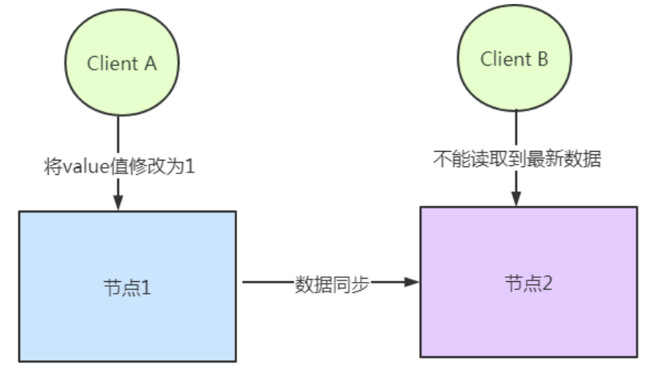

第二部分 分布式理论与分布式架构设计理论

# 1 分布式架构设计

## 1.1 什么是分布式系统

分布式系统是一个硬件或软件组件分布在不同的网络计算机上，彼此之间仅仅通过消息传递进行通信和协调的系统。

通俗的理解，所谓分布式系统，就是一个业务拆分成多个子业务，分布在不同的服务器节点，共同构成的系统称为分布式系统。同一个分布式系统中的服务器节点在空间部署上是可以随意分布的，这些服务器可能放在不同的机柜中，也可能在不同的机房中，甚至分布在不同的城市。

## 1.2 分布式与集群的区别

集群：多个服务器做同一个事情

分布式：多个服务器做不同的事情

## 1.3 分布式系统特性

1. 分布性

   空间中随机分布。这些计算机可以分布在不同的机房，不同的城市，甚至不同的国家。

2. 对等性

   分布式系统的计算机没有主从之分，组成分布式系统的所有节点都是对等的。

3. 并发性

   同一个分布式系统的多个节点，可能会并发地操作一些共享地资源，诸如数据库或分布式存储。

4. 缺乏全局时钟

   既然各个计算机之间是依赖于交换信息来进行相互通信，很难定义两件事件的先后顺序，缺乏全局时钟控制序列。

5. 故障总会发生

   组成分布式的计算机，都有可能在某一时刻突然间崩掉。分的计算机越多，可能崩掉一个的机率就越大。如果再考虑到设计程序时的异常故障，也会加大故障的概率。

6. 处理单点故障

   单点SPoF（Single Point Of Failure）：某个角色或者功能只有某一台计算机在支撑，在这台计算机上出现故障就是单点故障。

## 1.4 分布式系统面临的问题

1. 通信异常

   网络本身的不可靠性，因此每次网络通信豆瓣醉着网络不可用的风险（光纤、路由、DNS等硬件设备或系统的不可用），都会导致最终分布式系统无法顺利进行一次网络通信，另外，即使分布式系统个节点之间的网络通信能够正常执行，其延时也会大于单机操作，存在巨大的延时差别也会影响消息的收发过程，因此消息丢失和消息延迟变的非常普遍。

   

2. 网络分区

   网络之间出现了网络不连通，但各个子网络的内部网络是正常的，从而导致整个系统的网络环境被切分成若干个孤立的区域，分布式系统就会出现局部小集群，在极端情况下，这些小集群会独立完成原本需要整个分布式系统才能完成的功能，包括数据的事务处理，这就对分布式一致性提出了非常大的挑战。

   

3. 节点故障

   节点故障是分布式系统下一个比较常见的问题，指的是组成分布式系统的服务器节点出现宕机或僵死现象，根据经验来说，每个节点都有可能出现故障，并且经常发生。

   

4. 三态

   分布式系统每一次请求与响应存在特有的三态概念，即成功、失败 和 超时。

   

5. 重发

   分布式系统在发生调用的时候可能出现 失败、超时 的情况。这个时候需要重新发起调用。

   

6. 幂等

   一次和多次请求某一个资源对于资源本身应该具有相同的结果（网络超时等问题除外）。也就是说，其任意多次执行对资源本身所产生的影响与一次执行的影响相同。

   - 场景1

     

   - 场景2

     

   - 场景3

     

# 2 分布式理论

## 2.1 数据一致性

### 2.1.1 什么是分布式数据一致性

分布式数据一致性，指的是数据在多副本中存储时，各副本中的数据是一致的。

### 2.1.2 副本一致性

分布式系统中，数据往往会有多个副本。多个副本就需要保证数据的一致性。这就带来了同步的问题，因为网络延迟等因素，我们几乎没有办法保证可以同时更新所有机器当中的包括备份的所有数据，因此就会有数据不一致的情况。

总的来说，我们无法找到一种能够满足分布式系统中数据一致性解决方案。因此，如何保证数据的一致性，同时又不影响系统运行的性能，是每一个分布式系统都需要重点考虑和权衡的。于是，一致性级别由此诞生。

### 2.1.3 一致性分类

1. 强一致性

   这种一致性级别是最符合用户直觉的，它要求系统写入什么，读出来的也会是什么，用户体验好，但实现起来往往对系统的性能影响大。且强一致性很难实现。

2. 弱一致性

   这种一致性级别约束了系统在写入成功后，不承诺立即可以读到写入的值，也不承诺多久之后数据能够达到一致，但会尽可能地保证到某个时间级别（比如秒级别）后，数据能够达到一致状态。

3. 最终一致性

   **最终一致性是弱一致性的一种**，它无法保证数据更新后，所有后续的访问都能看到最新数值，而是需要一个时间，在这个时间之后可以保证这一点（就是在一段时间后，节点间的数据会最终达到一致状态），而在这个时间内，数据也许是不一致的，这个系统无法保证强一致性的时间片段被称为【不一致窗口】。不一致窗口的时间长短取决于很多因素，比如备份数据的个数、网络传输延迟速度、系统负载等。

   最终一致性在实际应用中又有多种变种：

   - 因果一致性

     如果进程A通知进程B，它已经更新了一个数据项，那么进程B的后续访问将返回更新后的值。与进程A无因果关系的进程C的访问遵守一般的最终一致性规则。

     

     

   - 读已知所写一致性

     当进程A自己更新一个数据项之后，它总是访问到更新过的值，绝不会看到旧值。这是因果一致性模型的一个特例。

     

   - 会话一致性

     它把访问存储系统的进程放到会话的上下文中。只要会话还存在，系统就保证“读已知所写”一致性。如果由于某些失败情形令会话终止，就要建立新的会话，而且系统保证不会延续到新的会话。

     

     

   - 单调一致性

     如果一个进程已经读取到一个特定值，那么该进程不会读取到该值以前的任何值。

     

   - 单调写一致性

     系统保证对同一个进程的写操作串行化。

     

4. 一致性模型图

   

## 2.2 CAP定理

### 2.2.1 CAP定理介绍

CAP定理（CAP theorem），又被称为布鲁尔定理（Brewer's theorem），它之处对于一个分布式计算系统来说，不可能同时满足以下三点

| 选项                              | 具体意义                                                     |
| --------------------------------- | ------------------------------------------------------------ |
| 一致性（Consistency）             | 所有节点访问是都是同一份最新的数据副本                       |
| 可用性（Availability）            | 每次请求都能获取到非错的响应，但是不保证回去到的数据为最新的 |
| 分区容错性（Partition tolerance） | 分布式系统在玉带任何网络分区故障额时候，仍然能够对外提供满足一致性 和可用性的服务，除非整个网络环境都发生了故障 |

> 1.**一致性（Consistency）**

**这里指的是强一致性**

在写操作完成后开始的任何读操作都必须返回该值，或者后续写操作的结果，也就是说，在一致性系统中，一旦客户端将值写入任何一台服务器并获得响应，那么之后client从任何服务器读取的都是刚写入的数据。

1. 客户端向G1写入数据v1，并等待响应
2. 此时，G1服务器的数据为v1，而G2服务器的数据为v0，两者不一致
3. 接着，在返回响应给客户端之前，G2服务器会自动同步G1服务器的数据，使得G2服务器的数据也是v1
4. 一致性保证了不管向哪台服务器（比如这里向G1）写入数据，其他的服务器（G2）能实时同步数据
5. G2已经同步了G1的数据，会告诉G1，我已经同步了
6. G1接收了所有同步服务器的已同步的报告，才将“写入成功”信息响应给client
7. client再发起请求，读取G2的数据
8. 此时得到的响应是v1，即使client读取数据到G2

> 2.**可用性（Availability）**

系统中非故障节点收到的每个请求都必须有响应。在可用系统中，如果我们的客户端向服务器发送请求，并且服务器未崩溃，则服务器必须最终响应客户端，不允许服务器忽略客户的请求

> 3.**分区容错性（Partition tolerance）**

允许网络丢失从一个节点发送到另一个节点的任意多条消息，即不同步。也就是说G1和G2发送给对方的任何消息都是可以放弃的，也就是说G1和G2可能因为各种意外情况，导致无法成功进行同步，分布式系统要能容忍这种情况。

### 2.2.2 CAP三者不可能同时满足论证

假设确实存在三者能同时满足的系统

1. 那么我们要做的第一件事就是区分我们的系统，由于满足分区容错性，也就是说可能因为通信不佳等情况，G1和G2之间是没有同步。

   

2. 接下来，我们的客户端将v1写入G1，但G1和G2之间是不同步的，所以如下G1是v1数据，G2是v0数据。

   

3. 由于要满足可用性，即一定要返回数据，所以G1必须在数据没有同步给G2的前提下返回数据给client，如下：

   

   接下来，client请求的是G2服务器，由于G2服务器的数据是v0，所以client得到的数据是v0。

   

**结论**：很明显，G1返回的是v1数据，G2返回的是v0数据，两者不一致。其余情况也有类似推导，也就是说CAP三者不能同时出现。

### 2.2.3 CAP三者如何权衡

**三选二利弊如何**

- CA（Consistency + Availability）：关注一致性和可用性，它需要非常严格的全体一致的协议。CA系统不能容忍网络错误或节点错误，一旦出现这样的问题，整个系统就会拒绝写请求，因为它并不知道对面的哪个节点是否挂掉了，还是网络问题。唯一安全的做法就是把自己变成只读的。

  

- CP（Consistency + Partition tolerance）：关注一致性和分区容错性。它关注的是系统里大多数的一致性协议。这样的系统只需要保证大多数数据节点数据一致，而少数的节点会在没有同步到最新版本的数据时变成不可用的状态。这样就能提供一部分的可用性。

  

  

  

- AP（Availability + Partition tolerance）：这样的系统关心可用性和分区容忍性。因此，这样的系统不能达成一致性，需要给出数据冲突，给出数据冲突就需要维护数据版本。

  

**如何进行三选二**

放弃一致性，满足分区容错，那么节点之间就可能失去联系，为了高可用，每个节点只能用本地数据提供服务，而这样容易导致全局数据不一致。对于互联网应用来说，机器数量庞大，节点分散，网络故障在正常不过，那么此时就是保障AP，放弃C的场景。

对于银行来说，就必须保证强一致性，即C必须存在。CA下，一旦出现通信故障，系统将完全不可用；CP下，具备了部分可用性。

## 2.3 BASE理论

上面讲到CAP不可能同时满足，而分区容错性是针对分布式系统而言，是必须的。最后，如果能够同时实现CAP是再好不过，所以出现了BASE理论。

BASE：全称Basically Available（基本可用），Soft state（软状态）和 Eventually consistency（最终一致性）三个短语的缩写，Base理论是对CPA中一致性和可用性权衡的结果，其来源于对大型互联网分布式实践的总结，是基于CAP定理逐步演化而来的。其核心思想是：**既是无法做到强一致性（Strong Consistency），但是每个应用可以根据自身的业务特点，采用适当的方式来使系统达到最终一致性（Eventual Consistency）。**

1. Basically Available（基本可用）

   什么是基本可用？假设系统出现了不可预知的故障，但还是能用，相比较正常的系统而言：

   - 响应时间上的损失：正常情况下的搜索引擎0.5s即返回结果，而基本可用的搜索引擎可以在1s返回结果。
   - 功能上的损失：在一个电商网站上，正常情况下，用户可以顺利完后曾每一笔订单，但是到了大促期间，为了保护购物系统的稳定性，部分消费者可能被引导一个降级页面

2. Soft state（软状态）

   什么是软状态？相对于原子性而言，要求多个节点的数据副本都是一致的，这是一种“硬状态”。

   软状态指的是：允许系统中的数据存在中间状态，并认为该该状态不会影响系统的整体可用性，即允许系统在多个不同节点的数据副本存在数据延时。

3. Eventually consistency（最终一致性）

   上面说软状态，然后不可能一直是软状态，必须有个时间期限。在期限过后，应当保证所有副本保持数据一致性，这个时间取决于网络延时，系统负载，数据复制方案设计等等因素。

# 3 分布式一致性协议

## 3.1 两阶段提交协议（2PC）

### 3.1.1 两节点提交协议

两阶段提交协议，简称2PC（2 Prepare Commit），是比较常用的解决分布式问题的方式，要么所有参与进程都提交事务，要么都取消事务，即实现ACID中的原子性(A)的常用手段。

> 分布式事务：事务提供一种操作本地数据库的不可分割的一系列操作"要么什么都不做，要么做全套（All or Nothing）"的机制，而分布式事务就是为了操作不同数据库的不可分割的一些列操作“要么什么都不做，要么做全套（All or Nothing）”的机制

### 3.1.2 2PC执行流程

> 1.**成功执行事务提交流程**

阶段一：

- 事务询问

  协调者向所有的参与者发送事务内容，询问是否可以执行事务提交操作，并开始等待个各参与者的响应。

- 执行事务（写本地的Undo/Redo日志）

- 各参与者向协调者反馈事务询问的响应

阶段二：

- 发送提交请求：

  协调者向所有参与者发出commit请求。

- 事务提交：

  参与者收到commit请求后，会正式执行事务提交操作，并在完成提交之后释放整个事务执行期间占用的事务资源。

- 反馈事务提交结果：

  参与者在完成事务提交之后，向协调者发送Ack信息。

- 完成事务：

  协调者调用所有参与者反馈Ack信息后，完成事务。

> 2.**中断事务流程**

假如任何一个参与者向协调者反馈No响应，或者在等待超时之后，协调者尚无法接收到所有参与者的反馈响应，那么就会中断事务。

阶段一：

- 事务询问

  协调者向所有的参与者发送事务内容，询问是否可以执行事务提交操作，并开始等待各参与者的响应。

- 执行事务（写本地的Undo/Redo日志）

- 各参与者向协调者反馈事务询问的响应

阶段二：

- 发送回滚请求：

  协调者向所有参与者发出Rollback请求。

- 事务回滚：

  参与者接收到Rollback请求后，会利用其在阶段一中的记录的Undo信息来执行事务回滚操作，并在完成回滚之后释放整个事务执行期间占用的资源。

- 反馈事务回滚结果：

  参与者在完成事务回滚之后，向协调者发送Ack信息。

- 中断事务：

  协调者接收到所有参与者的Ack信息后，完成事务中断。

### 3.1.3 2PC优点缺点

> 1.优点

原理简单

> 2.缺点

- 同步阻塞

  在二阶段提交的执行过程中，所有参与该事务操作的逻辑都处于阻塞状态，即当参与者占有公共资源时，其他节点访问公共资源会处于阻塞状态。

- 单点问题

  若协调器出现问题，那么整个二阶段提交流程将无法运转，若协调者是在阶段二中出现问题时，那么其他参与者将会一直处于锁定事务资源的状态中，而无法继续完成事务操作。

- 数据不一致

  在阶段二中，执行事务提交的时候，当协调者向所有的参与者发送Commit请求之后，发生了局部网络异常或是协调者在尚未发送完commit请求之前自身发生了崩溃，导致最终只有部分参与者收到commit请求，于是会出现数据不一致的现象。

- 太过保守

  在进行事务提交询问的过程中，参与者出现故障，而导致协调者始终无法获取到所有参与者的响应信息的话，此时协调者只能依靠自身的超时机制来判断是否需要中断事务，这样的策略过于保守，即没有完善的容错机制，**任意一个节点的失败都会导致整个事务的失败**。

## 3.2 三阶段提交协议（3PC）

三阶段提交协议出现的背景：一致性协议中设计出了二阶段提交协议（2PC），但是2PC设计中还存在缺陷，于是就有了三阶段提交协议，这便是3PC诞生背景。

### 3.2.1 三阶段提交协议

3PC，全称Three Phase Commit，是2PC的改进版，将2PC的提交事务请求过程一分为二，共形成了由CanCommit、PreCommit和doCommit三个阶段组成的事务处理协议。

三阶段提交升级点（基于二阶段）：

- 三阶段提交协议引入了超时机制
- 在第一阶段和第二阶段中，引入了一个准备阶段。保证了在最后提交阶段之前各参与节点的状态是一致的。

简单讲：就是除了引入超时机制之外。3PC把2PC的准备阶段再次一分为二，这样三阶段提交就有CanCommit、PreCommit、DoCommit三个阶段。

### 3.2.2 三阶段详解

> 1.第一阶段（CanCommit阶段）

类似于2PC的准备阶段（第一）阶段。协调者向发送者发送commit请求，参与者如果可以提交就返回Yes响应，否则返回No响应。

- 事务询问：

  协调者向参与者发送CanCommit请求。询问是否可以执行事务提交操作。然后kai

### 3.2.3 2PC对比3PC

## 3.3 NWR协议

## 3.4 Gossip 协议

## 3.5 Paxos协议

## 3.6 Raft协议

## 3.7 Lease机制

# 4 分布式系统设计策略

# 5 分布式架构服务调用

# 6 分布式服务治理

# 7 架构设计基本原则

