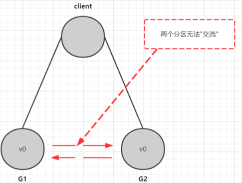

第二部分 分布式理论与分布式架构设计理论

# 1 分布式架构设计

## 1.1 什么是分布式系统

分布式系统是一个硬件或软件组件分布在不同的网络计算机上，彼此之间仅仅通过消息传递进行通信和协调的系统。

通俗的理解，所谓分布式系统，就是一个业务拆分成多个子业务，分布在不同的服务器节点，共同构成的系统称为分布式系统。同一个分布式系统中的服务器节点在空间部署上是可以随意分布的，这些服务器可能放在不同的机柜中，也可能在不同的机房中，甚至分布在不同的城市。

## 1.2 分布式与集群的区别

集群：多个服务器做同一个事情

分布式：多个服务器做不同的事情

## 1.3 分布式系统特性

1. 分布性

   空间中随机分布。这些计算机可以分布在不同的机房，不同的城市，甚至不同的国家。

2. 对等性

   分布式系统的计算机没有主从之分，组成分布式系统的所有节点都是对等的。

3. 并发性

   同一个分布式系统的多个节点，可能会并发地操作一些共享地资源，诸如数据库或分布式存储。

4. 缺乏全局时钟

   既然各个计算机之间是依赖于交换信息来进行相互通信，很难定义两件事件的先后顺序，缺乏全局时钟控制序列。

5. 故障总会发生

   组成分布式的计算机，都有可能在某一时刻突然间崩掉。分的计算机越多，可能崩掉一个的机率就越大。如果再考虑到设计程序时的异常故障，也会加大故障的概率。

6. 处理单点故障

   单点SPoF（Single Point Of Failure）：某个角色或者功能只有某一台计算机在支撑，在这台计算机上出现故障就是单点故障。

## 1.4 分布式系统面临的问题

1. 通信异常

   网络本身的不可靠性，因此每次网络通信豆瓣醉着网络不可用的风险（光纤、路由、DNS等硬件设备或系统的不可用），都会导致最终分布式系统无法顺利进行一次网络通信，另外，即使分布式系统个节点之间的网络通信能够正常执行，其延时也会大于单机操作，存在巨大的延时差别也会影响消息的收发过程，因此消息丢失和消息延迟变的非常普遍。

   

2. 网络分区

   网络之间出现了网络不连通，但各个子网络的内部网络是正常的，从而导致整个系统的网络环境被切分成若干个孤立的区域，分布式系统就会出现局部小集群，在极端情况下，这些小集群会独立完成原本需要整个分布式系统才能完成的功能，包括数据的事务处理，这就对分布式一致性提出了非常大的挑战。

   

3. 节点故障

   节点故障是分布式系统下一个比较常见的问题，指的是组成分布式系统的服务器节点出现宕机或僵死现象，根据经验来说，每个节点都有可能出现故障，并且经常发生。

   

4. 三态

   分布式系统每一次请求与响应存在特有的三态概念，即成功、失败 和 超时。

   

5. 重发

   分布式系统在发生调用的时候可能出现 失败、超时 的情况。这个时候需要重新发起调用。

   

6. 幂等

   一次和多次请求某一个资源对于资源本身应该具有相同的结果（网络超时等问题除外）。也就是说，其任意多次执行对资源本身所产生的影响与一次执行的影响相同。

   - 场景1

     

   - 场景2

     

   - 场景3

     

# 2 分布式理论

## 2.1 数据一致性

### 2.1.1 什么是分布式数据一致性

分布式数据一致性，指的是数据在多副本中存储时，各副本中的数据是一致的。

### 2.1.2 副本一致性

分布式系统中，数据往往会有多个副本。多个副本就需要保证数据的一致性。这就带来了同步的问题，因为网络延迟等因素，我们几乎没有办法保证可以同时更新所有机器当中的包括备份的所有数据，因此就会有数据不一致的情况。

总的来说，我们无法找到一种能够满足分布式系统中数据一致性解决方案。因此，如何保证数据的一致性，同时又不影响系统运行的性能，是每一个分布式系统都需要重点考虑和权衡的。于是，一致性级别由此诞生。

### 2.1.3 一致性分类

1. 强一致性

   这种一致性级别是最符合用户直觉的，它要求系统写入什么，读出来的也会是什么，用户体验好，但实现起来往往对系统的性能影响大。且强一致性很难实现。

2. 弱一致性

   这种一致性级别约束了系统在写入成功后，不承诺立即可以读到写入的值，也不承诺多久之后数据能够达到一致，但会尽可能地保证到某个时间级别（比如秒级别）后，数据能够达到一致状态。

3. 最终一致性

   **最终一致性是弱一致性的一种**，它无法保证数据更新后，所有后续的访问都能看到最新数值，而是需要一个时间，在这个时间之后可以保证这一点（就是在一段时间后，节点间的数据会最终达到一致状态），而在这个时间内，数据也许是不一致的，这个系统无法保证强一致性的时间片段被称为【不一致窗口】。不一致窗口的时间长短取决于很多因素，比如备份数据的个数、网络传输延迟速度、系统负载等。

   最终一致性在实际应用中又有多种变种：

   - 因果一致性

     如果进程A通知进程B，它已经更新了一个数据项，那么进程B的后续访问将返回更新后的值。与进程A无因果关系的进程C的访问遵守一般的最终一致性规则。

     

     

   - 读已知所写一致性

     当进程A自己更新一个数据项之后，它总是访问到更新过的值，绝不会看到旧值。这是因果一致性模型的一个特例。

     

   - 会话一致性

     它把访问存储系统的进程放到会话的上下文中。只要会话还存在，系统就保证“读已知所写”一致性。如果由于某些失败情形令会话终止，就要建立新的会话，而且系统保证不会延续到新的会话。

     

     

   - 单调一致性

     如果一个进程已经读取到一个特定值，那么该进程不会读取到该值以前的任何值。

     

   - 单调写一致性

     系统保证对同一个进程的写操作串行化。

     

4. 一致性模型图

   

## 2.2 CAP定理

### 2.2.1 CAP定理介绍

CAP定理（CAP theorem），又被称为布鲁尔定理（Brewer's theorem），它之处对于一个分布式计算系统来说，不可能同时满足以下三点

| 选项                              | 具体意义                                                     |
| --------------------------------- | ------------------------------------------------------------ |
| 一致性（Consistency）             | 所有节点访问是都是同一份最新的数据副本                       |
| 可用性（Availability）            | 每次请求都能获取到非错的响应，但是不保证回去到的数据为最新的 |
| 分区容错性（Partition tolerance） | 分布式系统在玉带任何网络分区故障额时候，仍然能够对外提供满足一致性 和可用性的服务，除非整个网络环境都发生了故障 |

> 1.**一致性（Consistency）**

**这里指的是强一致性**

在写操作完成后开始的任何读操作都必须返回该值，或者后续写操作的结果，也就是说，在一致性系统中，一旦客户端将值写入任何一台服务器并获得响应，那么之后client从任何服务器读取的都是刚写入的数据。

1. 客户端向G1写入数据v1，并等待响应
2. 此时，G1服务器的数据为v1，而G2服务器的数据为v0，两者不一致
3. 接着，在返回响应给客户端之前，G2服务器会自动同步G1服务器的数据，使得G2服务器的数据也是v1
4. 一致性保证了不管向哪台服务器（比如这里向G1）写入数据，其他的服务器（G2）能实时同步数据
5. G2已经同步了G1的数据，会告诉G1，我已经同步了
6. G1接收了所有同步服务器的已同步的报告，才将“写入成功”信息响应给client
7. client再发起请求，读取G2的数据
8. 此时得到的响应是v1，即使client读取数据到G2

> 2.**可用性（Availability）**

系统中非故障节点收到的每个请求都必须有响应。在可用系统中，如果我们的客户端向服务器发送请求，并且服务器未崩溃，则服务器必须最终响应客户端，不允许服务器忽略客户的请求

> 3.**分区容错性（Partition tolerance）**

允许网络丢失从一个节点发送到另一个节点的任意多条消息，即不同步。也就是说G1和G2发送给对方的任何消息都是可以放弃的，也就是说G1和G2可能因为各种意外情况，导致无法成功进行同步，分布式系统要能容忍这种情况。

### 2.2.2 CAP三者不可能同时满足论证

假设确实存在三者能同时满足的系统

1. 那么我们要做的第一件事就是区分我们的系统，由于满足分区容错性，也就是说可能因为通信不佳等情况，G1和G2之间是没有同步。

   

2. 接下来，我们的客户端将v1写入G1，但G1和G2之间是不同步的，所以如下G1是v1数据，G2是v0数据。

   

3. 由于要满足可用性，即一定要返回数据，所以G1必须在数据没有同步给G2的前提下返回数据给client，如下：

   

   接下来，client请求的是G2服务器，由于G2服务器的数据是v0，所以client得到的数据是v0。

   

**结论**：很明显，G1返回的是v1数据，G2返回的是v0数据，两者不一致。其余情况也有类似推导，也就是说CAP三者不能同时出现。

### 2.2.3 CAP三者如何权衡

**三选二利弊如何**

- CA（Consistency + Availability）：关注一致性和可用性，它需要非常严格的全体一致的协议。CA系统不能容忍网络错误或节点错误，一旦出现这样的问题，整个系统就会拒绝写请求，因为它并不知道对面的哪个节点是否挂掉了，还是网络问题。唯一安全的做法就是把自己变成只读的。

  

- CP（Consistency + Partition tolerance）：关注一致性和分区容错性。它关注的是系统里大多数的一致性协议。这样的系统只需要保证大多数数据节点数据一致，而少数的节点会在没有同步到最新版本的数据时变成不可用的状态。这样就能提供一部分的可用性。

  

  

  

- AP（Availability + Partition tolerance）：这样的系统关心可用性和分区容忍性。因此，这样的系统不能达成一致性，需要给出数据冲突，给出数据冲突就需要维护数据版本。

  

**如何进行三选二**

放弃一致性，满足分区容错，那么节点之间就可能失去联系，为了高可用，每个节点只能用本地数据提供服务，而这样容易导致全局数据不一致。对于互联网应用来说，机器数量庞大，节点分散，网络故障在正常不过，那么此时就是保障AP，放弃C的场景。

对于银行来说，就必须保证强一致性，即C必须存在。CA下，一旦出现通信故障，系统将完全不可用；CP下，具备了部分可用性。

## 2.3 BASE理论

上面讲到CAP不可能同时满足，而分区容错性是针对分布式系统而言，是必须的。最后，如果能够同时实现CAP是再好不过，所以出现了BASE理论。

BASE：全称Basically Available（基本可用），Soft state（软状态）和 Eventually consistency（最终一致性）三个短语的缩写，Base理论是对CPA中一致性和可用性权衡的结果，其来源于对大型互联网分布式实践的总结，是基于CAP定理逐步演化而来的。其核心思想是：**既是无法做到强一致性（Strong Consistency），但是每个应用可以根据自身的业务特点，采用适当的方式来使系统达到最终一致性（Eventual Consistency）。**

1. Basically Available（基本可用）

   什么是基本可用？假设系统出现了不可预知的故障，但还是能用，相比较正常的系统而言：

   - 响应时间上的损失：正常情况下的搜索引擎0.5s即返回结果，而基本可用的搜索引擎可以在1s返回结果。
   - 功能上的损失：在一个电商网站上，正常情况下，用户可以顺利完后曾每一笔订单，但是到了大促期间，为了保护购物系统的稳定性，部分消费者可能被引导一个降级页面

2. Soft state（软状态）

   什么是软状态？相对于原子性而言，要求多个节点的数据副本都是一致的，这是一种“硬状态”。

   软状态指的是：允许系统中的数据存在中间状态，并认为该该状态不会影响系统的整体可用性，即允许系统在多个不同节点的数据副本存在数据延时。

3. Eventually consistency（最终一致性）

   上面说软状态，然后不可能一直是软状态，必须有个时间期限。在期限过后，应当保证所有副本保持数据一致性，这个时间取决于网络延时，系统负载，数据复制方案设计等等因素。

# 3 分布式一致性协议

## 3.1 两阶段提交协议（2PC）

### 3.1.1 两节点提交协议

两阶段提交协议，简称2PC（2 Prepare Commit），是比较常用的解决分布式问题的方式，要么所有参与进程都提交事务，要么都取消事务，即实现ACID中的原子性(A)的常用手段。

> 分布式事务：事务提供一种操作本地数据库的不可分割的一系列操作"要么什么都不做，要么做全套（All or Nothing）"的机制，而分布式事务就是为了操作不同数据库的不可分割的一些列操作“要么什么都不做，要么做全套（All or Nothing）”的机制

### 3.1.2 2PC执行流程

> 1.**成功执行事务提交流程**

阶段一：

- 事务询问

  协调者向所有的参与者发送事务内容，询问是否可以执行事务提交操作，并开始等待个各参与者的响应。

- 执行事务（写本地的Undo/Redo日志）

- 各参与者向协调者反馈事务询问的响应

阶段二：

- 发送提交请求：

  协调者向所有参与者发出commit请求。

- 事务提交：

  参与者收到commit请求后，会正式执行事务提交操作，并在完成提交之后释放整个事务执行期间占用的事务资源。

- 反馈事务提交结果：

  参与者在完成事务提交之后，向协调者发送Ack信息。

- 完成事务：

  协调者调用所有参与者反馈Ack信息后，完成事务。

> 2.**中断事务流程**

假如任何一个参与者向协调者反馈No响应，或者在等待超时之后，协调者尚无法接收到所有参与者的反馈响应，那么就会中断事务。

阶段一：

- 事务询问

  协调者向所有的参与者发送事务内容，询问是否可以执行事务提交操作，并开始等待各参与者的响应。

- 执行事务（写本地的Undo/Redo日志）

- 各参与者向协调者反馈事务询问的响应

阶段二：

- 发送回滚请求：

  协调者向所有参与者发出Rollback请求。

- 事务回滚：

  参与者接收到Rollback请求后，会利用其在阶段一中的记录的Undo信息来执行事务回滚操作，并在完成回滚之后释放整个事务执行期间占用的资源。

- 反馈事务回滚结果：

  参与者在完成事务回滚之后，向协调者发送Ack信息。

- 中断事务：

  协调者接收到所有参与者的Ack信息后，完成事务中断。

### 3.1.3 2PC优点缺点

> 1.优点

原理简单

> 2.缺点

- 同步阻塞

  在二阶段提交的执行过程中，所有参与该事务操作的逻辑都处于阻塞状态，即当参与者占有公共资源时，其他节点访问公共资源会处于阻塞状态。

- 单点问题

  若协调器出现问题，那么整个二阶段提交流程将无法运转，若协调者是在阶段二中出现问题时，那么其他参与者将会一直处于锁定事务资源的状态中，而无法继续完成事务操作。

- 数据不一致

  在阶段二中，执行事务提交的时候，当协调者向所有的参与者发送Commit请求之后，发生了局部网络异常或是协调者在尚未发送完commit请求之前自身发生了崩溃，导致最终只有部分参与者收到commit请求，于是会出现数据不一致的现象。

- 太过保守

  在进行事务提交询问的过程中，参与者出现故障，而导致协调者始终无法获取到所有参与者的响应信息的话，此时协调者只能依靠自身的超时机制来判断是否需要中断事务，这样的策略过于保守，即没有完善的容错机制，**任意一个节点的失败都会导致整个事务的失败**。

## 3.2 三阶段提交协议（3PC）

三阶段提交协议出现的背景：一致性协议中设计出了二阶段提交协议（2PC），但是2PC设计中还存在缺陷，于是就有了三阶段提交协议，这便是3PC诞生背景。

### 3.2.1 三阶段提交协议

3PC，全称Three Phase Commit，是2PC的改进版，将2PC的提交事务请求过程一分为二，共形成了由CanCommit、PreCommit和doCommit三个阶段组成的事务处理协议。

三阶段提交升级点（基于二阶段）：

- 三阶段提交协议引入了超时机制
- 在第一阶段和第二阶段中，引入了一个准备阶段。保证了在最后提交阶段之前各参与节点的状态是一致的。

简单讲：就是除了引入超时机制之外。3PC把2PC的准备阶段再次一分为二，这样三阶段提交就有CanCommit、PreCommit、DoCommit三个阶段。

### 3.2.2 三阶段详解

> 1.**第一阶段（CanCommit阶段）**

类似于2PC的准备阶段（第一）阶段。协调者向发送者发送commit请求，参与者如果可以提交就返回Yes响应，否则返回No响应。

- 事务询问：

  协调者向参与者发送CanCommit请求。询问是否可以执行事务提交操作。然后开始等待参与者的响应。

- 响应反馈

  参与者接到CanCommit请求之后，正常情况下，如果其自身认为可以顺利执行事务，则返回Yes响应，并进入预备状态；否则反馈No。

> 2.**第二阶段（PreCommit阶段）**

协调者根据参与者的反应情况来决定是否可以执行事务的PreCommit操作。根据响应情况，有以下两种可能。

- Yes

  (1) 发送预提交请求：协调者向参与者发送PreCommit请求，并进入Prepared阶段。

  (2) 事务预提交：参与者接收到PreCommit请求后，会执行事务操作，并将undo和redo信息记录到事务日志中。

  (3) 响应反馈：如果参与者成功的执行了事务操作，则返回Ack响应，同时开始等待最终指令。

- No

  假如有任何一个参与者向协调者发送了No响应，或者等待超时之后，协调者都没有接到参与者的响应，那么就执行事务的中断。则有：

  (1) 发送中断请求：协调者向所有参与者发送absort请求。

  (2) 中断事务：参与者收到来自协调者的absort请求之后（或超时之后，仍未收到协调者的请求），执行事务的中断

> 3.**第三阶段（doCommit阶段）**

该阶段进行真正的事务提交，也可以分为执行提交和中断事务两种情况。

- 执行成功

  (1) 发送提交请求：协调者接收到参与者发送的Ack响应，那么它将从预提交状态到提交状态。并向所有参与者发送doCommit请求。

  (2) 事务提交：参与者接收到doCommit请求之后，执行正式的事务提交。并在完成事务提交之后释放所有事务资源。

  (3) 响应反馈：事务提交完成之后，向协调者发送Ack响应。

  (4) 完成事务：协调者接收到所有参与者的Ack响应之后，完成事务。

- 中断事务

  (1) 发送中断请求：协调者向所有参与者发送absort请求

  (2) 事务回滚：参与者接收到absort请求之后，利用其在阶段二记录的undo信息来执行事务回滚操作，并在完成回滚之后释放所有的事务资源。

  (3) 反馈结果：参与者完成事务回滚之后，向协调者发送Ack消息

  (4) 中断事务：协调者接收到所有参与者反馈的Ack消息之后，执行事务中断。

> 4.**注意：一旦进入阶段三，可能会出现2种故障**：

- 协调者出现问题
- 协调者和参与者之间的网络故障

如果出现了任意一种情况，最终都会导致参与者无法接收到doCommit请求或者absort请求，针对这种情况，**参与者都会在等待超时之后，继续进行事务提交**。

### 3.2.3 2PC对比3PC

1. 首先对于协调者和参与者都设置的超时机制（在2PC中，只有协调者拥有超时机制，即如果在一定的那个时间内没有收到参与者的消息则默认失效），主要是避免了参与者在长时间无法与协调者节点通讯（协调者挂掉了）的情况下，无法释放资源的问题，因为参与者自身拥有超时机制，自动进行本地commit从而进行释放资源。而这种机制也在侧面降低了整个事务阻塞的时间和范围。
2. 通过CanCommit、PreCommit、DoCommit三个阶段的设计，相较于2PC而言，多设置了一个缓冲阶段保证了在最后提交阶段之前各参与节点的状态是一致的。
3. PreCommit是一个缓冲，保证了在最后提交阶段之前各参与节点的状态是一致的。

> **问题：3PC协议并没有完全解决数据一致问题**。
>
> 如果参与者收到了 preCommit 消息后，出现了网络分区，那么参与者等待超时后，都会进行事务的提交，这必然会出现事务不一致的问题。

## 3.3 NWR协议

### 3.3.1 什么是NWR协议

NWR是一种在分布式存储系统中用于控制一致性级别的一种策略。在亚马逊的云存储系统中，就应用NWR来控制一致性。

- N：在分布式存储系统中，有多少份备份数据
- W：代表一次成功的更新操作要求至少有w份数据写入成功
- R：代表一次成功的读数据操作要求至少有R份数据成功读取

### 3.3.2 原理

NWR值的不同组合会产生不同的一致性效果，当W+R>N的时候，整个系统对于客户端来讲能保证强一致性。

**以常见的N=3、W=2、R=2为例：**

- N=3，表示任何一个对象都必须有三个副本
- W=2，表示对数据的修改操作只需要在3个副本中的2个上面完成就返回
- R=2，表示从对象中要读取到2个数据对象，才能返回

>在分布式系统中，数据的单点是不允许存在的。即线上正常存在的备份数量N设置1的情况是非常危险的，因为一旦这个备份发生错误，就可能发生数据的永久性错误。假如我们把N设置为2，那么只要有一个存储节点发生损坏，就会有单点的存在。所以N必须大于2。N越高，系统的维护和整体成本越高。工业界通常把N设置为3。

1. 当W是2，R是2的时候，W+R>N，这种情况对于客户端就是强一致性的。

   

   在上图中，如果R+W>N，则读取操作和写入操作成功的数据一定会有交集（如Node2），这样就可以保证一定能够读取到最新版本的更新数据，数据的强一性得到了保证。在满足数据一致性协议的前提下，R或者W设置的越大，则系统延迟越大，因为这取决于最慢的那份备份数据的响应时间。

2. 当R+W<=N，无法保证数据的强一致性

   

   因为成功写和成功读集合可能不存在交集，这样读操作无法获取到最新的更新数值，也就无法保证数据的强一致性。

## 3.4 Gossip 协议

### 3.4.1 什么是Gossip协议

Gossip协议也叫Epidemic协议（流行病协议）。原本用于分布式数据库中间节点同步数据使用，后被广泛用于数据库复制、信息扩散、集群成员身份确认、故障探测等。

从gossip单词就可以看到，其中意思是八卦、留言等意思。Gossip协议的工作原理类似于这个。Gossip协议利用一种随机的方式将信息传播到整个网络中，并在一定时间内使得系统内所有节点数据一致。Gossip其实是一种去中心化思路的分布式协议，解决状态在集中传播和状态一致性的保证两个问题。

### 3.4.2 Gossip原理

Gossip协议的消息传播方式有两种：**反熵传播**和**谣言传播**

1. 反熵传播

   是以固定的概率椽笔所有的数据。所有参与的节点只有两种状态：Suspective（病原）、Infective（感染）。过程是种子节点会把所有的数据都跟其他节点共享，以便消除节点之间数据的任何不一致，它可以保证最终、完全的一致。缺点是消息数量非常庞大，且无限制；通常只用于新加入节点的数据初始化。

2. 谣言传播

   是以固定的概率仅传播新到达的数据。所有参与节点有三种状态：Suspective（病原）、Infective（感染）、Removed（愈除）。过程是消息只包含最新update，谣言消息在某个时间点之后会被标记为removed，并且不再被传播。缺点是系统有一定的概率会不一致，通常用于节点间数据增量同步。

### 3.4.3 通信方式

Gossip协议最终目的是将数据分发到网络中的每一个节点。**根据不同的具体应用场景，网络中两个节点之间存在三种通信方式：推送模式、拉取模式、推拉模式**

1. push

   节点A将数据(key,value,version)及对应的版本号推送给B节点，B节点更新A中比自己新的数据

   

2. pull

   A仅将数据key,version推送给B，B将本地比A新的数据(key,value,version)推送给A，A更新本地。

   

3. push/pull

   与pull类似，只多了一步，A再将本地比B新的数据推送给B，B则更新本地。

### 3.4.4 优缺点

综上所述，我们可以得出Gossip是一种去中心化的分布式协议，数据通过节点想病毒一样逐个传播。因为是指数级传播，整体传播速度非常快。

1. 优点
   - 扩展性：允许节点的任意增加和减少，新增节点的状态最终会和其他节点一致
   - 容错：任意节点的宕机和重启都不会影响Gossip消息的传播，具有天然的分布式系统容错特性
   - 去中心化：无需中心节点，所有节点都是对等的，任意节点无需知道整个网络状况，只要网络连通，任意节点可把消息散播到全网
   - 最终一致性：Gossip协议实现信息指数级的快速传播，因此在有新信息需要传播时，消息可以快速发送到全局节点，在有限的时间内能够做到所有节点拥有最新的数据。
2. 缺点
   - 消息延迟：节点随机向少数节点发送消息，消息最终是通过多个轮次的散播而达到全网；不可避免地造成消息延迟。
   - 消息冗余：节点定期随机选择周围节点发送消息，而收到消息地节点也会重复该步骤；不可避免地引起同一节点消息多次接收，增加消息处理压力

Gossip协议由于以上的优缺点，所以**适合于AP场景地数据一致性处理**，常见应用有：P2P网络通信、Redis Cluster、Consul。

## 3.5 Paxos协议

### 3.5.1 什么是Paxos

Paxos协议其实说的就是Paxos算法，Paxos算法基于**消息传递**且具有**高度容错特性**的**一致性算法**，是目前公认的解决**分布式一致性**问题**最有效**的算法之一。

[维基百科](https://zh.wikipedia.org/wiki/Paxos%E7%AE%97%E6%B3%95)中的说明和上述的描述有一些出入。

### 3.5.2 Paxos解决了什么问题

在可能发生**机器宕机**、**网络异常（延迟、重复、丢失，网络分区）**的分布式系统中，在集群内布对某个数据的值（value）达成一致！

在常见的分布式系统中，总会发生诸如机器宕机或网络异常（包括消息的延迟、丢失、重复、乱序，还有网络分区）等情况。Paxos算法需要解决的问题就是如何在一个可能发生上述异常的分布式系统中，快速且正确地在集群内部对某个数据的值达成一致，并且保证不论发证以上任何我异常，都不会破坏整个系统地一致性。

> 注：这里**某个数据的值**并不只是狭义上的某个数，它可以是一条日志，也可以是一条命令（command）。根据应用场景不同，**某个数据的值**有不同的含义。

在之前讲解2PC和3PC的时候，在一定程度上也是可以解决数一致性问题的。但是并没有完全解决的就是协调者宕机的情况。

**如何解决2PC和3PC存在的问题**

1. 步骤一，引入多个协调者

   

2. 步骤二，引入主协调者，以它的命令为基准

   

**其实在引入多个协调者之后，有引入主协调者。那么这个就是最简单的一种Paxos算法。**

**Paxos的版本有Basic Paxos，Multi Paxos，Fast-Paxos**，具体落地的有Raft和zk的ZAB协议

### 3.5.3 Basic Paxos相关概念

> 1.角色介绍

- Client：客户端

  客户端向分布式系统发送请求，并等待响应。例如，对分布式文件服务器中文件的写请求。

- Proposer：提案发起者

  提案者倡议客户端请求，试图说服Acceptor对此达成一致，并在发生冲突时充当协调者以推动协议向前发展。

- Acceptor：决策者

  Acceptor可以接收（accept）提案，并进行投票，投票结果是通过以多数派为准，如果某个提案被选定，那么该提案里的value就被选定了。

- Learner：最终决策的学习者

  学习者充当协议的复制因素（不参与投票）

> 2.**决策模型**

> 3.**basic paxos流程**

basic paxos流程一共分为4个步骤：

- Prepare

  Proposer提出一个提案，编号为N，此N大于这个Proposer之前提出的所有编号，请求Acceptor的多数人接收这个提案。

- Promise

  如果编号N大于此Acceptor之前接收的任何提案编号则接收，否则拒绝

- Accept

  如果达到多数派，Proposer会发出accept请求，此请求包含提案编号和对应的内容

- Accepted

  如果此Acceptor在此期间没有接收任何大于N的提案，则接收此提案内容，否则忽略。

### 3.5.4 Basic Paxos流程图

1. 无故障的Basic Paxos

   

2. Acceptor失败时的basic Paxos

   在下图中，多数派中的一个Acceptor发生故障，因此多数派大小变为2。在这种情况下，Basic Paxos协议仍然成功。

   

3. Proposer失败时的basic Paxos

   Proposer在提出提案之后，在达成协议之前失败。具体来说，传递Acceptor的时候失败了，这个时候需要选出新的Proposer（提案人），那么Basic Paxos协议仍然成功。

   

4. 当多个提议者发生冲突时的Basic Paxos

   最复杂的情况是多个Proposer都进行提案，导致Paxos活锁问题。

   

   **针对活锁问题解决起来非常简单：只需要在每个Proposer再去提案的时候随机加上一个等待时间即可。**

### 3.5.5 Multi-Paxos流程图

针对Basic Paxos是存在一定的问题，首先就是流程复杂，实现及其困难；其次，效率低（达成一致性需要2轮RPC调用），针对Basic Paxos流程进行拆分为选举和复制的过程。

1. 第一次流程 确定Leader

   

2. 第二次流程 直接由Leader确认

   

   

### 3.5.6 Multi-Paxos角色重叠流程图

Multi-Paxos在实施的时候会将Proposer，Acceptor和Learner的角色合并统称为“服务器”。因此，最后只有“客户端”和“服务器”。

## 3.6 Raft协议

3.6.1 什么是Raft协议

## 3.7 Lease机制

# 4 分布式系统设计策略

# 5 分布式架构服务调用

# 6 分布式服务治理

# 7 架构设计基本原则

