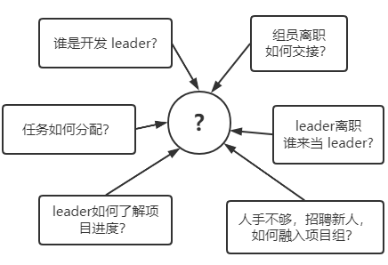
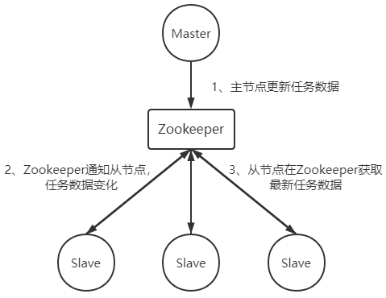

> 第一部分 Zookeeper简介

# 1 分布式系统定义及面临的问题

**Zookeeper 是最为主要的使用场景，是作为分布式系统的分布式协同服务。**

我们将分布式系统定义为：分布式系统是同时跨越多个物理主机，独立运行的多个软件所组成系统。类比一下，分布式系统就是一群人一起干活，每个服务器的算力是有限的；但是通过分布式系统，由 N 个服务器组成起来的集群，算例是可以无限扩张的。

优点显而易见，人多干活快，并且互为备份。但是缺点也很明显。可以想象一下，以一个小研发团队开发软件为例，假设我们有一个 5 人的项目组，要开始一个系统的开发，项目组将面临如下问题：

实际上要想解决这些问题并没有那么复杂，我们仅需要做一件事就可以让完事无忧 ——让信息在项目组成员中同步。如果能做到信息同步，那么每个人在干什么，大家都是清楚的。分配工作，能够及时清晰的同步给每个组员，确保每个组员收到的任务分配没有冲突。

分布式系统的协调工作就是通过某种方式，让每个节点的信息能够同步和共享。这依赖于服务进程之间的通信。通信方式有两种：

- 通过网络进行信息共享
- 通过共享存储

# 2 Zookeeper如何解决分布式系统面临的问题

Zookeeper 对分布式系统的协调，使用的是第二种方式，共享存储。其实共享存储，分布式应用也需要和存储进行网络通信。

实际上，通过 Zookeeper 实现分布式协同的原理，和项目组通过 SVN 同步工作任务的例子是一样的。

Zookeeper 就像是 SVN ，存储了任务的分配，完成情况等共享信息。每个分布式应用的节点就是组员，订阅这些共享信息。当主节点（组 leader），对某个从节点的分工信息做出改变时，相关订阅的从节点得到 zookeeper 的通知，取得自己最新的任务分配。完成工作后，把完成情况存储到 zookeeper。主节点订阅了该任务的完成情况信息，所以将得到 zookeeper 的完工通知。

注意：Slave节点要想获得 Zookeeper 的更新通知，需要事先在关心的数据节点上设置观察点。

大多数分布式系统中出现的问题，都源于信息的共享出了问题。如果各个节点间信息不能及时共享和同步，那么就会在协作过程中产生各种问题。**Zookeeper解决协同问题的关键，就是在于保证分布式系统信息的一致性**。

# 3 Zookeeper的基本概念

Zookeeper 是一个开源的分布式协调服务，其设计目标是将那些复杂的且容易出错的分布式一致性服务封装起来，构成一个搞笑可靠的原语集，并以一些简单的接口提供给用户使用。zookeeper是一个典型的分布式数据一致性解决方案，分布式应用程序可以基于它事先诸如数据订阅/发布、负载均衡、命名服务、集群管理、分布式锁 和 分布式队列等功能。

基本概念

## 3.1 集群角色

通常在分布式系统中，构成一个集群的每一台机器都有自己的角色，最典型的集群就是 Master/Slave 模式（主备模式），此情况下把所有能够处理写操作的机器称为 Master 机器；把所有通过异步复制方式获取最新数据，并提供读服务的机器称为 Slave 机器。

而在 Zookeeper 中，这些概念被颠覆了。它没有沿用传递 Master/Slave 概念，而是引入了 Leader、Follower、Observer 三种角色。

Zookeeper 集群中的所有机器通过 Leader 选举来选定一台被称为 Leader 的机器，Leader 服务器为客户端提供读和写服务，除 Leader 外，其他机器包括 Follower 和 Observer ，Follower 和 Observer 都可以提供读服务，唯一的区别在于 **Observer 不参与 Leader 选举过程，不参与写操作的过半写成功**策略，因此 Observer 可以在不影响写性能的情况下提升集群的性能。

## 3.2 会话（session）

Session 指客户端会话，**一个客户端连接是指客户端和服务端之间的一个 TCP 长连接**，Zookeeper 对外的服务端口默认为 2181，客户端启动的时候，首先会与服务器建立一个 TCP 连接，从第一次连接建立开始，客户端会话的生命周期也开始了，通过这个连接，客户端能够心跳检测与服务器保持有效的会话，也能够向 Zookeeper 服务器发送请求并接受响应，同时还能够通过该连接接收来自服务器的 Watch 事件通知。

## 3.3 数据节点（Znode）

在谈到分布式的时候，我们通过说的 "节点" 是指组成集群的每一台机器。然而，在 Zookeeper 中，“节点” 分为两类，第一类同样是指构成集群的机器，称之为**机器节点**；第二类则是指数据模型中的**数据单元**，称之为数据节点—— ZNode。**Zookeeper 将所有数据存储在内存中**，数据模型是一颗树（ZNode Tree），由斜杠（/）进行分割的路径，就是一个 Znode，例如 /app/path1。每个 ZNode 上都会保存自己的数据内容，同时还会保存一些列的属性信息。

## 3.4 版本

刚刚我们提到，Zookeeper 的每个 Znode 上都会存储数据，对于每个 Znode，Zookeeper 都会为其维护一个叫做 Stat 的数据结构，Stat 记录了这个 Znode 的三个数据版本，分别是 version（当前Znode的版本）、cversion（当前Znode子节点的版本）、aversion（当前Znode的 ACL 版本）。

## 3.5 Watcher（事件监听器）

Watcher（事件监听器），是Zookeeper中一个很重要的特性，Zookeeper 允许用户在指定节点上注册一些 Watcher，并且在一些特定事件触发的时候，Zookeeper 服务端会将事件通知到感兴趣的客户端，该机制是 Zookeeper 实现分布式协调服务的重要特性。

## 3.6 ACL

Zookeeper 采用 ACL（Access Control Lists）策略来进行权限控制，其定义了如下 5 种权限：

1. **CREATE**：创建子节点的权限
2. READ：获取节点数据和子节点列表的权限
3. WRITE：更新节点数据的权限
4. **DELETE**：删除子节点的权限
5. ADMIN：设置节点 ACL 的权限

需要注意的是，**CREATE** 和 **DELETE** 这两种权限都是针对子节点的权限控制。