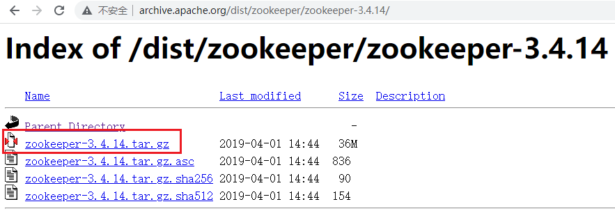
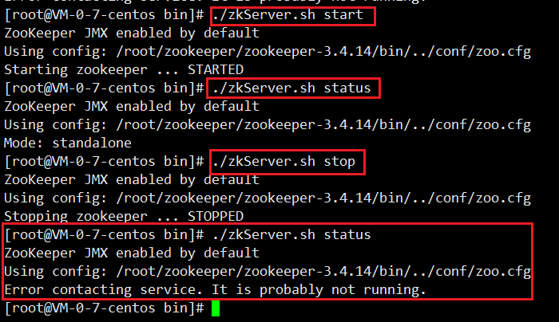
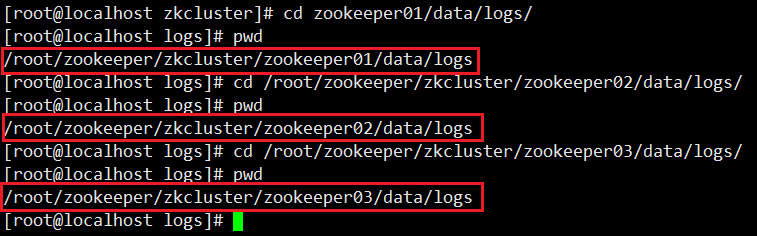
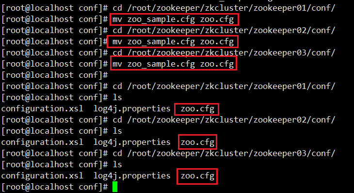
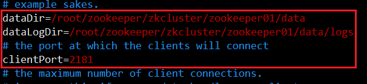
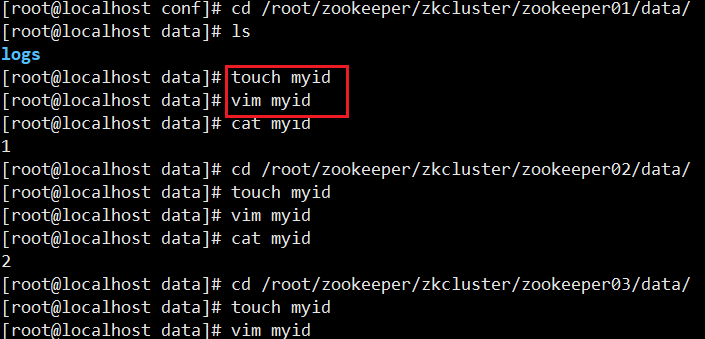
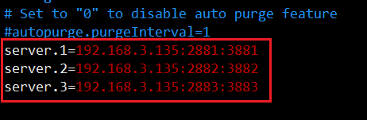
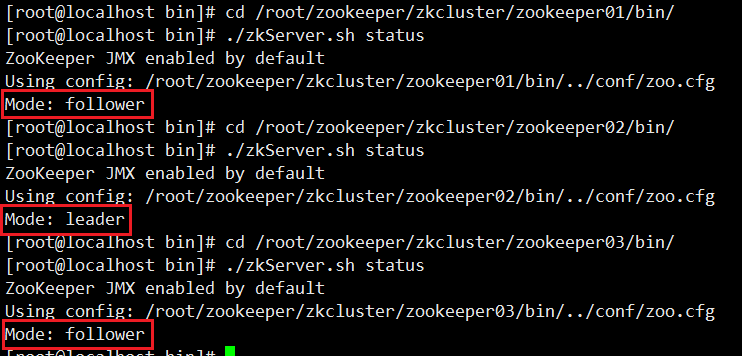

> 第二部分 Zookeeper环境搭建

Zookeeper 安装方式有三种，**单机模式**和**集群模式**以及**伪集群模式**。

- 单机模式：Zookeeper 只运行在一台服务器上，适合测试环境；
- 集群模式：Zookeeper 运行于一个集群上，适合生产环境，这个计算机集群被称为一个 “集合体”；
- 伪集群模式：就是在一台服务器上运行多个 Zookeeper 实例；

# 1 单机模式搭建

Zookeeper 安装以 Linux 环境为例：

地址：https://zookeeper.apache.org/releases.html

发行站点：https://downloads.apache.org/zookeeper/

http://archive.apache.org/dist/zookeeper/

1. 下载

   首先下载稳定版本的 zookeeper，
   
   
   
2. 上传

   下载完成后，将 zookeeper 压缩包 zookeeper-3.4.14.tar.gz 上传到 Linux 系统

3. 解压压缩包

   ```bash
   tar -zxvf zookeeper-3.4.14.tar.gz
   ```

4. 进入 zookeeper-3.4.14 目录，创建 data 文件夹

   ```bash
   cd zookeeper-3.4.14
   mkdir data
   ```

5. 修改配置文件名称

   ```bash
   cd conf
   mv zoo_sample.cfg zoo.cfg
   ```

6. 修改 zoo.cfg 中的 data 属性

   ```xml
   dataDir=/root/zookeeper/zookeeper-3.4.14/data
   ```

7. zookeeper 服务启动

   进入 bin 目录，启动服务输入命令

   ```bash
   # 启动
   ./zkServer.sh start
   # 停止
   ./zkServer.sh stop
   # 查看状态
   ./zkServer.sh status
   ```



# 2 伪集群模式

Zookeeper 不但可以在单机上运行单机模式 Zookeeper，而且可以在单机模拟集群模式 Zookeeper 的运行，也就是将不同实例运行在同一台机器上，用端口进行区分，伪集群模式为我们体验 Zookeeper 和 做一些尝试性的实验提供了很大的便利。比如，我们在测试的时候，可以先使用少量数据在伪集群模式下进行测试。当测试可行性的时候，再将数据移植到集群模式进行真实的数据实验。这样不但保证了它的可行性，同时大大提高了实验的效率。这种搭建方式，比较简单，成本比较低，适合测试和学习。

注意事项：

一台机器上部署 3 个 server，也就是说单台机器上运行多个 Zookeeper 实例。这种情况下，必须保证每个配置文档的各个端口号不能冲突，除了 clientPort 不同之外，dataDir 也不同。另外，还要在 dataDir 所对应的目录中创建 myid 文件来指定对应的 Zookeeper 服务器实例。

- clientPort 端口：

  如果一台机器上部署多个 server，那么每台机器都要不同的 clientPort，比如 server1 是 2181，server2 是 2182，server3 是 2183。

- dataDir 和 dataLogDir：

  dataDir 和 dataLogDir 也需要区分下，将数据文件和日志文件分开存放，同时每个 server 的这两个变量所对应的路径都是不同的。

- server.X 和 myid

  server.X 这个数字就是对应 data/myid 中的数字。在 3 个 server 的 myid 文件中分别写入了 1，2，3。那么每个 server 中的 zoo.cfg 都配置 server.1 server.2 server.3 就可以了。因为在同一台机器上，后面连着的 2 个端口，3 个 server 都要不一样，否则端口冲突。


安装步骤：

1. 创建zkcluster文件夹

2. 将文件解压到 /zkcluster 目录下

   ```bash
   tar -zxvf zookeeper-3.4.14.tar.gz -C ./zkcluster
   ```

3. 修改名字

   ```bash
   mv zookeeper-3.4.14 zookeeper01
   ```

4. 复制两份

   ```bash
   [root@localhost zkcluster]# cp -r zookeeper01/ zookeeper02
   [root@localhost zkcluster]# cp -r zookeeper01/ zookeeper03
   [root@localhost zkcluster]# ls
   zookeeper01  zookeeper02  zookeeper03
   ```

5. 分别在 zookeeper01、zookeeper02、zookeeper03 目录下创建 data 及 logs 目录

   ```bash
   [root@localhost zkcluster]# cd zookeeper01/
   [root@localhost zookeeper01]# mkdir -p data/logs
   ```

   

6. 修改配置文件名称

   

7. 配置每一个 Zookeeper 的 dataDir（zoo.cfg），clientPort 分别为 2181 2182 2183

   ```xml
   dataDir=/root/zookeeper/zkcluster/zookeeper01/data
   dataLogDir=/root/zookeeper/zkcluster/zookeeper01/data/logs
   clientPort=2181
   ```

   

8. 配置集群

   在每个zookeeper 的 data 目录下创建一个 myid 文件，内容分别是 1、2、3。

   

   在每一个 zookeeper 的 zoo.cfg 配置客户端访问端口（clientPort）和 集群服务IP列表

   ```bash
   server.1=192.168.3.135:2881:3881
   server.2=192.168.3.135:2882:3882
   server.3=192.168.3.135:2883:3883
   # server.服务器ID = 服务器IP地址:服务器之间通信端口:服务器之间头片选举端口
   ```

   

9. 启动集群

   依次启动 3 个 zk 实例，查看状态，分别为：follower、leader、follower

   


