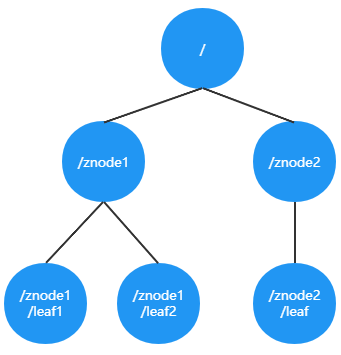

> 第三部分 Zookeeper基本使用

# 1 Zookeeper系统模型

在 Zookeeper 中，数据信息被保存在一个个数据节点上，这些节点被称为 znode。ZNode 是 Zookeeper 中最小数据单位，在 ZNode 下面又可以再挂 ZNode，这样一层层下去就形成了一个层次化命名空间 ZNode 树，我们称为 ZNode Tree，它采用了类似文件系统的层级树状结构进行管理。见下图：

在 Zookeeper 中，每一个数据节点都是一个 ZNode，上图根目录下有两个，分别是：znode1 和 znode2，其中 znode1 下面又有两个子节点，所有 ZNode 按层次化进行组织，形成这么一棵树，ZNode 的节点路径标识方式 和 Unix 文件系统路径非常相似，都是由一些列使用斜杠（/）进行分割的路径表示，开发人员可以向这个节点写入数据，也可以在这个节点下面创建子节点。

## 1.1 ZNode 的类型

刚刚已经了解到，Zookeeper 的 znode tree 是由一系列数据节点组成的，那接下来，就对数据节点做详细讲解。

Zookeeper 节点类型可以分为三大类：

1. 持久性节点（Persistent）
2. 临时性节点（Ephemeral）
3. 顺序性节点（Sequential）

在开发中创建节点的时候通过组合可以生成以下四种节点类型：持久节点、持久顺序节点、临时节点、临时顺序节点。不同类型的节点则会有不同的生命周期。

**持久节点**：是Zookeeper中最常见的一种节点类型，所谓持久节点，就是指节点被创建后会一致存在服务器，直到删除操作主动清除。

**持久顺序节点**：就是有顺序的持久节点，节点特性 和 持久节点是一样的，只是额外特性表现在顺序上。顺序特性实质是在创建节点的时候，会在节点后面加上一个数字后缀，来表示其顺序。

**临时节点**：就是会被自动清理掉的节点，它的生命周期和客户端会话绑在一起，客户端会话结束，节点会被删除掉。与持久性节点不同的是：**临时节点不能创建子节点**。

**临时顺序节点**：就是有顺序的临时节点，和持久顺序节点相同，在其创建的时候会在名字后面加上数字后缀。

**事务ID**

首先，先了解，事务是对物理和抽象的应用状态上的操作集合。往往在现在的概念中，侠义上的事务通常指的是数据库事务，一般包含了一系列对数据库有序的读写操作，这些数据库事务具有所谓的 ACID 特性，即原子性（Atomic）、一致性（Consistency）、隔离性（Isolation）、持久性（Durability）。

而在 Zookeeper 中，事务是指能够改变 Zookeeper 服务器状态的操作，我们也称之为事务操作或更新操作，一般包括数据节点创建和删除、数据节点内容更新等操作。对于每一个事务请求，Zookeeper 都会为其分配一个全局唯一的事务 ID，用 ZXID 来表示，通常是一个 64 位的数字。每一个 ZXID 对应一次更新操作，从这些 ZXID 中可以间接地识别出 Zookeeper 处理这些更新操作请求的全局顺序。

## 1.2 ZNode 的状态信息

## 1.3 Watcher -- 数据变更通知

## 1.4 ACL -- 保障数据的安全

# 2 Zookeeper 命令行操作

# 3 Zookeeper的API使用

# 4 Zookeeper 开源客户端