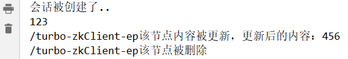

> 第三部分 Zookeeper基本使用

# 1 Zookeeper系统模型

在 Zookeeper 中，数据信息被保存在一个个数据节点上，这些节点被称为 znode。ZNode 是 Zookeeper 中最小数据单位，在 ZNode 下面又可以再挂 ZNode，这样一层层下去就形成了一个层次化命名空间 ZNode 树，我们称为 ZNode Tree，它采用了类似文件系统的层级树状结构进行管理。见下图：

[Data model and the hierarchical namespace](https://zookeeper.apache.org/doc/r3.4.14/zookeeperOver.html#sc_dataModelNameSpace)


在 Zookeeper 中，每一个数据节点都是一个 ZNode，上图根目录下有两个，分别是：znode1 和 znode2，其中 znode1 下面又有两个子节点，所有 ZNode 按层次化进行组织，形成这么一棵树，ZNode 的节点路径标识方式 和 Unix 文件系统路径非常相似，都是由一些列使用斜杠（/）进行分割的路径表示，开发人员可以向这个节点写入数据，也可以在这个节点下面创建子节点。

## 1.1 ZNode 的类型

刚刚已经了解到，Zookeeper 的 znode tree 是由一系列数据节点组成的，那接下来，就对数据节点做详细讲解。

Zookeeper 节点类型可以分为三大类：

1. 持久性节点（Persistent）
2. 临时性节点（Ephemeral）
3. 顺序性节点（Sequential）

在开发中创建节点的时候通过组合可以生成以下四种节点类型：持久节点、持久顺序节点、临时节点、临时顺序节点。不同类型的节点则会有不同的生命周期。

**持久节点**：是Zookeeper中最常见的一种节点类型，所谓持久节点，就是指节点被创建后会一致存在服务器，直到删除操作主动清除。

**持久顺序节点**：就是有顺序的持久节点，节点特性 和 持久节点是一样的，只是额外特性表现在顺序上。顺序特性实质是在创建节点的时候，会在节点后面加上一个数字后缀，来表示其顺序。

**临时节点**：就是会被自动清理掉的节点，它的生命周期和客户端会话绑在一起，客户端会话结束，节点会被删除掉。与持久性节点不同的是：**临时节点不能创建子节点**。

**临时顺序节点**：就是有顺序的临时节点，和持久顺序节点相同，在其创建的时候会在名字后面加上数字后缀。


**事务ID**

首先，先了解，事务是对物理和抽象的应用状态上的操作集合。往往在现在的概念中，侠义上的事务通常指的是数据库事务，一般包含了一系列对数据库有序的读写操作，这些数据库事务具有所谓的 ACID 特性，即原子性（Atomic）、一致性（Consistency）、隔离性（Isolation）、持久性（Durability）。

而在 Zookeeper 中，事务是指能够改变 Zookeeper 服务器状态的操作，我们也称之为事务操作或更新操作，一般包括数据节点创建和删除、数据节点内容更新等操作。对于每一个事务请求，Zookeeper 都会为其分配一个全局唯一的事务 ID，用 ZXID 来表示，通常是一个 64 位的数字。每一个 ZXID 对应一次更新操作，从这些 ZXID 中可以间接地识别出 Zookeeper 处理这些更新操作请求的全局顺序。

## 1.2 ZNode 的状态信息


整个 ZNode 节点内容包括两部分：节点数据内容和节点状态信息。图中quota是数据内容，其他的属性状态信息。那么这些状态信息都有什么含义呢？

```bash
cZxid 就是 Create ZXID, 表示节点被创建时的事务ID。
ctime 就是 Create Time, 表示节点创建时间。
mZxid 就是 Modified ZXID, 表示节点最后一次被修改时的事务ID。
mtime 就是 Modified Time, 表示节点最后一次被修改的时间。
pZxid 表示该节点的子节点列表最后一次被修改时的事务ID, 只有子节点列表变更才会更新 pZxid, 子节点内容变更不会更新。
cversion 表示子节点的版本号。
dataVersion 表示内容版本号。
aclVersion 表示acl版本
ephemeralOwner 表示创建该临时节点时的会话 sessionID, 如果是持久性节点那么值为 0 
dataLength 表示数据长度。
numChildren 表示直系子节点数。
```


## 1.3 Watcher -- 数据变更通知

Zookeeper 使用 Watcher 机制实现分布式数据的发布/订阅 功能

一个典型的发布/订阅 模型系统定义了一种 一对多的订阅关系，能够让多个订阅者同时监听某一个主题对象，当这个主题对象自身状态变化时，会通知所有订阅者，使它们能够做出相应的处理。

在 Zookeeper 中，引入了 Watcher 机制来实现这种分布式的通知功能。Zookeeper 允许客户端向服务器端注册一个 Watcher 监听，当服务端的一些指定事件触发了这个 Watcher，那么就会向指定客户端发送一个事件通知来实现分布式的通知功能。

整个 Watcher 注册与通知过程如图所示：


Zookeeper 的 Watcher 机制主要包括 **客户端线程**、客户端WatcherManager、Zookeeper服务器 三部分。

具体工作流程为：客户端在向 Zookeeper 服务器注册的同时，会将 Watcher 对象存储在客户端的 WatcherManager 中。当 Zookeeper 服务器触发 Watcher 事件后，会向客户端发送通知，客户端线程从 WatcherManager 中取出对应的 Watcher 对象来执行回调逻辑。

## 1.4 ACL -- 保障数据的安全

Zookeeper 作为一个分布式协调框架，其内部存储了分布式系统运行时状态的元数据，这些元数据会直接影响基于 Zookeeper 进行构造的分布式系统的运行状态。因此，如何保障系统中数据的安全，从而避免因误操作所带来的数据随意变更而导致的数据库异常，显得十分重要，在Zookeeper中，提供了一套完善的 ACL（Access Control List）权限控制机制来保障数据的安全。

可以从三个方面来理解 ACL 机制：**权限模式（Scheme）**、**授权对象（ID）**、**权限（Permission）**，通常使用 "**scheme​ : id : ​permission**" 来标识一个有效的 ACL 信息。

### 1.4.1 权限模式（Scheme）

权限模式 用来确定权限验证过程中使用的检验策略，有如下 4 种模式：

1. IP

   IP 模式就是通过 IP 地址粒度来进行权限控制，如 "ip:192.168.0.110" 表示权限控制针对该 IP 地址，同时IP模式可以支持按照网段方式进行配置，如 "ip:192.168.0.1/24" 表示针对 192.168.0.* 这个网段进行权限控制。

2. Digest

   Digest 是最常用的权限控制模式，要更符合我们对权限控制的认识，其使用 "username:password" 形式的权限标识来进行权限配置，便于区分不同应用来进行权限控制。

   当我们通过 "username:password" 形式配置的权限标识后，Zookeeper 会先后对其进行 SHA-1 加密和 BASE64 编码。

3. World

   World 是一种开放的权限控制模式，这种权限控制方式几乎没有任何作用，数据节点的访问权限对所有用户开放，即所有用户都可以在不进行任何校验的情况下操作 Zookeeper 上的数据。

   另外，World 模式也可以看作是一种特殊的 Digest 模式，它只有一个权限标识，即 "world:anyone"。

4. Super

   Super 模式，顾名思义就是超级用户的意思，也就是一种特殊的 Digest 模式。在 Super 模式下，超级用户可以对任意 Zookeeper 上的数据节点进行任何操作。

### 1.4.2 授权对象（ID）

授权对象指的是权限赋予的用户或一种指定实体，例如 IP 地址或是机器等。在不同的权限模式下，授权对象是不同的。表中列出了各个权限模式和授权对象之间的对应关系。

| 权限模式 | 授权对象                                                     |
| -------- | ------------------------------------------------------------ |
| IP       | 通常是一个 IP 地址 或 IP 段，例如：192.168.10.110 或 192.168.10.1/24 |
| Digest   | 自定义，通常是 username:BASE64(SHA-1(username:password)) ，例如：zm:sdfndsllndlksfn7c= |
| World    | 只有一个 ID：anyone                                          |
| Super    | 超级用户                                                     |


### 1.4.3 权限（Permission）

权限就是指那些通过权限检查后可以被允许执行的操作。在 Zookeeper 中，所有对数据的操作权限分为以下 5 大类：

1. CREATE（C）：数据节点的创建权限，允许授权对象在该数据节点下创建子节点。
2. DELETE（D）：子节点的删除权限，允许授权对象删除该数据节点的子节点。
3. READ（R）：数据节点的读取权限，允许授权对象访问该数据节点 并 读取器数据内容 或 子节点列表。
4. WRITE（W）：数据节点的更新权限，允许授权对象对该数据节点进行更新操作。
5. ADMIN（A）：数据节点的管理权限，允许授权对象对该数据节点进行 ACL 相关的设置操作

# 2 Zookeeper 命令行操作

现在已经搭建起一个能够正常运行的 zookeeper 服务了，所以接下来，就是借助客户端来对 zookeeper 的数据节点进行操作。

首先，进入到 Zookeeper 的 bin 目录之后，通过 zkClient 进入 zookeeper 建客户端命令行

```bash
./zkCli.sh # 连接到本地的 zookeeper 服务器
./zkCli.sh -server ip:port # 连接指定的服务器
```

连接成功后，系统会输出 Zookeeper 的相关环境及配置信息等。输入 help 之后，会输出可用的 Zookeeper 命令，如下：


## 2.1 创建节点

使用 create 命令，可以创建一个 Zookeeper 节点，如：

```bash
create [-s] [-e] path data acl
# 其中，-s(Sequential) 和 -e(Ephemeral) 分别指节点类型，顺序或临时节点;若不指定，则创建持久节点；acl 用来进行权限控制。
```

1. 创建顺序节点

   使用 **`create -s /zk-test 123`** 命令创建 zk-test 顺序节点

   

   执行完成后，就在根节点下创建一个叫做 /zk-test 的节点，该节点内容就是 123，同时可以看到创建的 zk-test 节点后面添加了一串数字以示区别。

2. 创建临时节点

   使用 **`create -e /zk-temp 123`** 命令创建 zk-temp 临时节点

   

   临时节点在客户端会话结束后，就会自动删除，下面使用 **quit** 命令退出客户端

   

   再次使用客户端连接服务端，并使用 ls / 命令查看根目录下的节点：

   

   可以看到根目录下已经不存在 zk-temp 临时节点了。

3. 创建永久节点

   使用 **`create /zk-persistent 123`** 命令创建 zk-persistent 永久节点

   

   可以看到永久节点不同于顺序节点，不会自动在后面添加一串数字


## 2.2 读取节点

与 读取相关的命令有 ls 命令和 get 命令

ls 命令可以列出 Zookeeper 指定节点下的所有子节点，但指能查看指定节点下的第一级的所有子节点。

```bash
ls path [watch]
# 其中，path标识的是指定数据节点的节点路径
```

get命令可以获取 Zookeeper 指定节点的数据内容和属性信息

```bash
get path [watch]
```

若获取根节点下面的所有子节点，使用 **`ls /`** 命令即可


若想获取 /zk-persistent 的数据内容和属性，可使用如下命令：**`get /zk-persistent`**


从上面的输出信息中，可以看到，第一行是节点 /zk-persistent 的数据内容，其他几行则是创建该节点的事务ID（cZxid）、最后一次更新该节点的事务 ID（mZxid）和最后一次更新该节点的时间（mtime）等属性信息。

1. 更新节点

   使用 set 命令，可以更新指定节点的数据内容，用法如下：

   ```bash
   set path data [version]
   ```

   其中，data 就是要更新的新内容，version 表示数据版本，在Zookeeper中，节点的数据是有版本概念的，这个参数用于指定本次更新操作是基于 Znode 的哪一个数据版本进行的，如将 /zk-persistent 节点的数据更新为 456，可以使用如下命令：**`set /zk-persistent 456`**

   

   现在dataVersion 已经变为 1 了，表示进行了更新。

2. 删除节点

   使用 delete 命令可以删除 Zookeeper 上的指定节点，用法如下：

   ```bash
   delete path [version]
   ```

   其中 version 也是表示数据版本，使用 **`delete /zk-persistent`** 命令即可删除 /zk-persistent 节点

   

   可以看到，已经成功删除 /zk-persistent 节点。值得注意的是，**若删除节点存在子节点，那么无法删除该节点，必须先删除子节点，在删除父节点**

# 3 Zookeeper的API使用

Zookeeper 作为一个分布式框架，主要用来解决分布式一致性问题。它提供了简单的分布式原语，并且对多种编程语言提供了 API，所以接下来重点看下 Zookeeper 的 Java 客户端 API 使用方式。

Zookeeper API 共包含 5 个包，分别为：

1. org.apache.zookeeper
2. org.apache.zookeeper.data
3. org.apache.zookeeper.server
4. org.apache.zookeeper.server.quorum
5. org.apache.zookeeper.server.upgrade

其中 org.apache.zookeeper ，包含 Zookeeper 类，它是我们编程时最常用的类文件。这个类是 Zookeeper 客户端的主要类文件。<br>如果要使用 Zookeeper 服务，应用程序必须建一个 Zookeeper 实例，这时就需要使用此类。<br>一旦客户端和 Zookeeper 服务端建立起了连接，Zookeeper 系统将会给本次连接会话分配一个 ID 值，并且客户端将会周期性的向服务器端发送心跳来维持会话连接。只要连接有效，客户端就可以使用 Zookeeper API 来做相应处理了。

准备工作：导入依赖

```xml
<dependency>
    <groupId>org.apache.zookeeper</groupId>
    <artifactId>zookeeper</artifactId>
    <version>3.4.14</version>
</dependency>
```

## 3.1 建立会话

```java
public class CreateSession implements Watcher {

    // countDownLatch这个类使⼀个线程等待,主要不让main⽅法结束
    private static CountDownLatch countDownLatch = new CountDownLatch(1);

    /**
     * 建立会话
     * @param args
     */
    public static void main(String[] args) throws IOException, InterruptedException {

        /**
        客户端可以通过创建⼀个zk实例来连接zk服务器
        new Zookeeper(connectString,sesssionTimeOut,Wather) connectString: 连接地址：IP：端⼝
        sesssionTimeOut：会话超时时间：单位毫秒
        Wather：监听器(当特定事件触发监听时，zk会通过watcher通知到客户端)
       */
        ZooKeeper zooKeeper = new ZooKeeper("152.136.177.192:2181", 5000, new CreateSession());
        System.out.println(zooKeeper.getState());
        // 计数工具类 CountDownLatch:不让main方法结束，让线程处于等待阻塞
        countDownLatch.await();
        // 表示会话真正建立
        System.out.println("客户端与服务端会话真正建立..");

    }

    /**
     * 回调方法：处理来自服务器端的watcher通知
     * 当前类实现了Watcher接⼝，重写了process⽅法，该⽅法负责处理来⾃Zookeeper服务端的 watcher通知，
     * 在收到服务端发送过来的SyncConnected事件之后，解除主程序在CountDownLatch上 的等待阻塞，
     * ⾄此，会话创建完毕
     * @param watchedEvent
     */
    public void process(WatchedEvent watchedEvent) {
        // SyncConnected
        // 当连接创建了，服务端发送给客户端 SyncConnected 事件
        if(watchedEvent.getState() == Event.KeeperState.SyncConnected){
            // 解除主程序在CountDownLatch上的线程阻塞
            countDownLatch.countDown();
        }
    }
}
```

注意，Zookeeper 客户端 和 服务端会话建立是一个异步的过程；也就是说在程序中，构造方法会在处理完 客户端初始化工作后立即返回，在大多数情况下，此时并没有真正建立好一个可用的会话，在会话的生命周期中处于 “CONNECTING” 的状态。当该会话真正创建完毕后 Zookeeper 服务端会向会话对应的客户端发送一个事件通知，以告知客户端，客户端只有在获取这个通知之后，才算真正建立了会话。

## 3.2 创建节点

```java
public class CreateNode implements Watcher {

    // 表示等待一个线程
    private static CountDownLatch countDownLatch = new CountDownLatch(1);

    private static ZooKeeper zooKeeper;

    /**
     * 建立会话
     * @param args
     */
    public static void main(String[] args) throws IOException, InterruptedException, KeeperException {

        /**
        客户端可以通过创建⼀个zk实例来连接zk服务器
        new Zookeeper(connectString,sesssionTimeOut,Wather) connectString: 连接地址：IP：端⼝
        sesssionTimeOut：会话超时时间：单位毫秒
        Wather：监听器(当特定事件触发监听时，zk会通过watcher通知到客户端)
       */
        zooKeeper = new ZooKeeper("152.136.177.192:2181", 5000, new CreateNode());
        System.out.println(zooKeeper.getState());
        // 计数工具类 CountDownLatch:不让main方法结束，让线程处于等待阻塞
        countDownLatch.await();
       
        System.out.println("客户端与服务端会话真正建立..");


    }


    /**
     * 回调方法：处理来自服务器端的watcher通知
     * 当前类实现了Watcher接⼝，重写了process⽅法，该⽅法负责处理来⾃Zookeeper服务端的 watcher通知，
     * 在收到服务端发送过来的SyncConnected事件之后，解除主程序在CountDownLatch上 的等待阻塞，
     * ⾄此，会话创建完毕
     * @param watchedEvent
     */
    public void process(WatchedEvent watchedEvent) {
        // SyncConnected
        if(watchedEvent.getState() == Event.KeeperState.SyncConnected){

            // 创建节点
            try {
                createNodeSync();
            } catch (KeeperException e) {
                e.printStackTrace();
            } catch (InterruptedException e) {
                e.printStackTrace();
            }
            // 解除主程序在CountDownLatch上的线程阻塞
            countDownLatch.countDown();
        }
    }

    /**
     * 创建节点的方法
     */
    private static void createNodeSync() throws KeeperException, InterruptedException {
        /**
         *  path        ：节点创建的路径 /开头
         *  data[]      ：节点创建要保存的数据，是个byte类型的
         *  acl         ：节点创建的权限信息(4种类型)
         *                 ANYONE_ID_UNSAFE    : 表示任何⼈
         *                 AUTH_IDS    ：此ID仅可⽤于设置ACL。它将被客户机验证的ID替 换。
         *                 OPEN_ACL_UNSAFE    ：这是⼀个完全开放的ACL(常⽤)--> world:anyone
         *                 CREATOR_ALL_ACL  ：此ACL授予创建者身份验证ID的所有权限
         *  createMode    ：创建节点的类型(4种类型)
         *                  PERSISTENT：持久节点
         *                  PERSISTENT_SEQUENTIAL：持久顺序节点
         *                  EPHEMERAL：临时节点
         *                  EPHEMERAL_SEQUENTIAL：临时顺序节点
         *                  String node = zookeeper.create(path,data,acl,createMode);
         */

        // 持久节点
        String note_persistent = zooKeeper.create("/turbo-persistent", "持久节点内容".getBytes(), ZooDefs.Ids.OPEN_ACL_UNSAFE, CreateMode.PERSISTENT);
        // 临时节点
        String note_ephemeral = zooKeeper.create("/turbo-ephemeral", "临时节点内容".getBytes(), ZooDefs.Ids.OPEN_ACL_UNSAFE, CreateMode.EPHEMERAL);
        // 持久顺序节点
        String note_persistent_sequential = zooKeeper.create("/turbo-persistent_sequential", "持久顺序节点内容".getBytes(), ZooDefs.Ids.OPEN_ACL_UNSAFE, CreateMode.PERSISTENT_SEQUENTIAL);

        System.out.println("持久节点"+note_persistent);
        System.out.println("临时节点"+note_ephemeral);
        System.out.println("持久顺序节点"+note_persistent_sequential);
    }
}
```


## 3.3 获取节点数据

```java
public class GetNodeData implements Watcher {

    // 表示等待一个线程
    private static CountDownLatch countDownLatch = new CountDownLatch(1);

    private static ZooKeeper zooKeeper;

    /**
     * 建立会话
     * @param args
     */
    public static void main(String[] args) throws IOException, InterruptedException, KeeperException {

        /**
        客户端可以通过创建⼀个zk实例来连接zk服务器
        new Zookeeper(connectString,sesssionTimeOut,Wather) connectString: 连接地址：IP：端⼝
        sesssionTimeOut：会话超时时间：单位毫秒
        Wather：监听器(当特定事件触发监听时，zk会通过watcher通知到客户端)
       */
        zooKeeper = new ZooKeeper("152.136.177.192:2181", 5000, new GetNodeData());
        System.out.println(zooKeeper.getState());
        Thread.sleep(Integer.MAX_VALUE);
    }


    /**
     * 回调方法：处理来自服务器端的watcher通知
     * 当前类实现了Watcher接⼝，重写了process⽅法，该⽅法负责处理来⾃Zookeeper服务端的 watcher通知，
     * 在收到服务端发送过来的SyncConnected事件之后，解除主程序在CountDownLatch上 的等待阻塞，
     * ⾄此，会话创建完毕
     * @param watchedEvent
     */
    public void process(WatchedEvent watchedEvent) {
        /**
         * 当子节点列表发生改变时，服务器端会发出noteChildrenChanged事件通知
         * 要重新获取子节点列表，同时注意：通知是一次性的，需要反复注册监听
         */
        if(watchedEvent.getType() == Event.EventType.NodeChildrenChanged){
            List<String> children = null;
            try {
                // 重新获取子节点列表 ,true - 又一次注册监听
                children = zooKeeper.getChildren("/turbo-persistent", true);
            } catch (KeeperException e) {
                e.printStackTrace();
            } catch (InterruptedException e) {
                e.printStackTrace();
            }
            System.out.println(children);
        }
        // SyncConnected
        if(watchedEvent.getState() == Event.KeeperState.SyncConnected){
            // 解除主程序在CountDownLatch上的线程阻塞
            //countDownLatch.countDown();
            // 获取节点数据
            try {
                getNodeData();
                // 获取节点的子节点列表
                getChildrens();
            } catch (KeeperException e) {
                e.printStackTrace();
            } catch (InterruptedException e) {
                e.printStackTrace();
            }

        }
    }

    /**
     * 获取某个节点的内容
     */
    private void getNodeData() throws KeeperException, InterruptedException {
        /**
         * path    : 获取数据的路径
         * watch    : 是否开启监听
         * stat    : 节点状态信息
         *          null: 表示获取最新版本的数据
         *  zk.getData(path, watch, stat);
         */
        byte[] data = zooKeeper.getData("/turbo-persistent", false, null);
        System.out.println(new String(data));
    }

    /**
     * 获取某个节点的子节点列表方法
     */
    public static void getChildrens() throws KeeperException, InterruptedException {
        /*
            path:路径
            watch:是否要启动监听，当⼦节点列表发⽣变化，会触发监听
            zooKeeper.getChildren(path, watch);
        */
        List<String> children = zooKeeper.getChildren("/turbo-persistent", true);
        System.out.println(children);
    }
}
```


## 3.4 修改节点数据

```java
public class UpdateNodeData implements Watcher {

    // 表示等待一个线程
    private static CountDownLatch countDownLatch = new CountDownLatch(1);

    private static ZooKeeper zooKeeper;

    /**
     * 建立会话
     * @param args
     */
    public static void main(String[] args) throws IOException, InterruptedException, KeeperException {

        /**
        客户端可以通过创建⼀个zk实例来连接zk服务器
        new Zookeeper(connectString,sesssionTimeOut,Wather) connectString: 连接地址：IP：端⼝
        sesssionTimeOut：会话超时时间：单位毫秒
        Wather：监听器(当特定事件触发监听时，zk会通过watcher通知到客户端)
       */
        zooKeeper = new ZooKeeper("152.136.177.192:2181", 5000, new UpdateNodeData());
        System.out.println(zooKeeper.getState());
        Thread.sleep(Integer.MAX_VALUE);
    }


    /**
     * 回调方法：处理来自服务器端的watcher通知
     * 当前类实现了Watcher接⼝，重写了process⽅法，该⽅法负责处理来⾃Zookeeper服务端的 watcher通知，
     * 在收到服务端发送过来的SyncConnected事件之后，解除主程序在CountDownLatch上 的等待阻塞，
     * ⾄此，会话创建完毕
     * @param watchedEvent
     */
    public void process(WatchedEvent watchedEvent) {
        // SyncConnected
        if(watchedEvent.getState() == Event.KeeperState.SyncConnected){
            // 更新数据节点内容的方法
            try {
                updateNodeDataSync();
            } catch (KeeperException e) {
                e.printStackTrace();
            } catch (InterruptedException e) {
                e.printStackTrace();
            }
        }
    }

    /**
     * 更新数据节点内容的方法
     */
    private void updateNodeDataSync() throws KeeperException, InterruptedException {
        byte[] data = zooKeeper.getData("/turbo-persistent", false, null);
        System.out.println("修改前："+new String(data));
        /*
            path:路径
            data:要修改的内容 byte[]
            version:为-1，表示对最新版本的数据进⾏修改
            zooKeeper.setData(path, data,version);
        */

        // stat状态信息对象
        Stat stat = zooKeeper.setData("/turbo-persistent", "客户端修改了节点内容".getBytes(), -1);
        byte[] dataAfter = zooKeeper.getData("/turbo-persistent", false, null);
        System.out.println("修改后："+new String(dataAfter));
    }
}
```


## 3.5 删除节点

```java
public class DeleteNode implements Watcher {

    // 表示等待一个线程
    private static CountDownLatch countDownLatch = new CountDownLatch(1);

    private static ZooKeeper zooKeeper;

    /**
     * 建立会话
     * @param args
     */
    public static void main(String[] args) throws IOException, InterruptedException, KeeperException {

        /**
        客户端可以通过创建⼀个zk实例来连接zk服务器
        new Zookeeper(connectString,sesssionTimeOut,Wather) connectString: 连接地址：IP：端⼝
        sesssionTimeOut：会话超时时间：单位毫秒
        Wather：监听器(当特定事件触发监听时，zk会通过watcher通知到客户端)
       */
        zooKeeper = new ZooKeeper("152.136.177.192:2181", 5000, new DeleteNode());
        System.out.println(zooKeeper.getState());
        // 计数工具类 CountDownLatch:不让main方法结束，让线程处于等待阻塞
        //countDownLatch.await();
        Thread.sleep(Integer.MAX_VALUE);
        //System.out.println("客户端与服务端会话真正建立..");


    }


    /**
     * 回调方法：处理来自服务器端的watcher通知
     * 当前类实现了Watcher接⼝，重写了process⽅法，该⽅法负责处理来⾃Zookeeper服务端的 watcher通知，
     * 在收到服务端发送过来的SyncConnected事件之后，解除主程序在CountDownLatch上 的等待阻塞，
     * ⾄此，会话创建完毕
     * @param watchedEvent
     */
    public void process(WatchedEvent watchedEvent) {
        // SyncConnected
        if(watchedEvent.getState() == Event.KeeperState.SyncConnected){
            // 解除主程序在CountDownLatch上的线程阻塞
            //countDownLatch.countDown();
            // 删除节点
            try {
                deleteNodeSync();
            } catch (KeeperException e) {
                e.printStackTrace();
            } catch (InterruptedException e) {
                e.printStackTrace();
            }

        }
    }

    /**
     * 删除节点的方法
     */
    private void deleteNodeSync() throws KeeperException, InterruptedException {
        /*
            zooKeeper.exists(path,watch) :判断节点是否存在
            zookeeper.delete(path,version) : 删除节点
        */
        Stat exists = zooKeeper.exists("/turbo-persistent/c1", false);
        System.out.println(exists == null?"该节点不存在":"该节点存在");
        if(exists != null){
            zooKeeper.delete("/turbo-persistent/c1",-1);
        }
        Stat stat = zooKeeper.exists("/turbo-persistent/c1", false);
        System.out.println(stat == null?"该节点不存在":"该节点存在");
    }
}
```


# 4 Zookeeper 开源客户端

## 4.1 ZkClinet

[ZkClient](https://github.com/sgroschupf/zkclient) 是 GitHub 上一个开源的 zookeeper 客户端，在 Zookeeper 原生 API 接口之上进行了包装。是一个更易用的 Zookeeper 客户端，同时，zkClient 在内部还实现了诸如 Session 超时重连，Watcher 反复注册等功能。

加下来，还是从创建会话，创建节点、读取数据、更新数据、删除节点 等方面来介绍如何使用 zkClient 这个 zookeeper 客户端。

添加依赖：

```xml
<dependency>
    <groupId>com.101tec</groupId>
    <artifactId>zkclient</artifactId>
    <version>0.2</version>
</dependency>
```


### 4.1.1 创建会话

使用 ZkClient可以轻松的创建会话，连接到服务端。

```java
public class CreateSession {

    /**
     * 借助zkClient完成会话的创建
     * @param args
     */
    public static void main(String[] args) {
        /**
         * 创建一个zkclient实例，就可以完成会话创建
         * serverstring:服务器连接地址
         *
         * 注意：zkClient通过对zookeeperAPI内部封装，将这个异步创建会话的过程同步化了。
         */
        ZkClient zkClient = new ZkClient("152.136.177.192:2181");
        System.out.println("Zookeeper session established..");
    }
}

```


结果表明已经成功创建会话。

### 4.1.2 创建节点

ZkClient 提供了递归创建节点的接口，即 帮助开发者先完成父节点的创建，再创建子节点

```java
public class CreateNode {

    /**
     * 借助zkClient完成会话的创建
     * @param args
     */
    public static void main(String[] args) {
        /**
         * 创建一个zkclient实例，就可以完成会话创建
         * serverstring:服务器连接地址
         *
         * 注意：zkClient通过对zookeeperAPI内部封装，将这个异步创建会话的过程同步化了。
         */
        ZkClient zkClient = new ZkClient("152.136.177.192:2181");
        System.out.println("会话被创建了..");

        //创建节点
        /**
         * createParent:是否要创建父节点，如果为true,那么就递归创建节点
         */
        zkClient.createPersistent("/turbo-zkClient/turbo-c1",true);
        System.out.println("节点递归创建完成");
    }
}
```


结果表明已经成功创建了子节点，指的注意的是，在原生态接口中是无法创建成功的（父节点不存在），但是通过 ZkClient 设置 `createParents` 参数为 true，可以递归的先创建父节点，再创建子节点。


### 4.1.3 删除节点

ZkClient 提供了递归删除节点的接口，即其帮助开发者先删除所有子节点（存在），再删除父节点。

```java
public class DeleteNode {

    /**
     * 借助zkClient完成会话的创建
     * @param args
     */
    public static void main(String[] args) {
        /**
         * 创建一个zkclient实例，就可以完成会话创建
         * serverstring:服务器连接地址
         *
         * 注意：zkClient通过对zookeeperAPI内部封装，将这个异步创建会话的过程同步化了。
         */
        ZkClient zkClient = new ZkClient("152.136.177.192:2181");
        System.out.println("会话被创建了..");
        // 递归删除节点
        String path = "/turbo-zkClient/turbo-c1";
        zkClient.createPersistent(path+"/c11");
        zkClient.deleteRecursive(path);
        System.out.println("递归删除成功..");
    }
}
```


结果表明 ZkClient 可直接删除带子节点的父节点，因为其底层先删除其所有子节点，然后再删除父节点。

### 4.1.4 获取子节点

```java
package com.turbo.zkclient;

import org.I0Itec.zkclient.IZkChildListener;
import org.I0Itec.zkclient.ZkClient;

import java.util.List;

public class GetNodeChildren {

    /**
     * 借助zkClient完成会话的创建
     * @param args
     */
    public static void main(String[] args) throws InterruptedException {
        /**
         * 创建一个zkclient实例，就可以完成会话创建
         * serverstring:服务器连接地址
         *
         * 注意：zkClient通过对zookeeperAPI内部封装，将这个异步创建会话的过程同步化了。
         */
        ZkClient zkClient = new ZkClient("152.136.177.192:2181");
        System.out.println("会话被创建了..");
        // 获取子节点列表
        List<String> children = zkClient.getChildren("/turbo-zkClient");
        System.out.println(children);

        // 注册监听事件
        /**
         * 客户端可以对一个不存在的节点进行子节点监听
         * 只要该节点的子节点列表，或者该节点本身被创建或删除，都会触发监听
         */
        zkClient.subscribeChildChanges("/turbo-zkClient-get", new IZkChildListener() {
            /**
             * s: parentPath
             * list: 变化后的子节点列表
             * @param parentPath
             * @param list
             * @throws Exception
             */
            public void handleChildChange(String parentPath, List<String> list) throws Exception {
                System.out.println(parentPath+"的子节点列表发生变化，变化后为："+list);
            }
        });

        // 测试
        zkClient.createPersistent("/turbo-zkClient-get");
        Thread.sleep(1000);

        zkClient.createPersistent("/turbo-zkClient-get/c1");
        Thread.sleep(1000);
    }
}
```


结果表明：

客户端可以对一个**不存在的节点**进行子节点变更的监听。

一旦客户端对一个节点注册了 **子节点列表变更监听**之后，那么当该节点的子节点列表发生表更时，服务端都会通知客户端，并将最新的子节点列表发送给客户端。

**该节点本身的创建或删除 也会通知到客户端**。

### 4.1.5 获取数据（节点是否存在、更新、删除）

```java
public class NodeApi {

    /**
     * 借助zkClient完成会话的创建
     * @param args
     */
    public static void main(String[] args) throws InterruptedException {
        /**
         * 创建一个zkclient实例，就可以完成会话创建
         * serverstring:服务器连接地址
         *
         * 注意：zkClient通过对zookeeperAPI内部封装，将这个异步创建会话的过程同步化了。
         */
        ZkClient zkClient = new ZkClient("152.136.177.192:2181");
        System.out.println("会话被创建了..");

        // 判断节点是否存在
        String path = "/turbo-zkClient-ep";
        boolean exists = zkClient.exists(path);
        if(!exists){
            // 创建临时节点
            zkClient.createEphemeral(path,"123");
        }
        // 读取节点内容
        Object o = zkClient.readData(path);
        System.out.println(o);

        // 注册监听
        zkClient.subscribeDataChanges(path, new IZkDataListener() {
            /**
             * 当节点数据内容发生变化时执行回调方法
             * s:path
             * o:当前变化后的节点内容
             * @param s
             * @param o
             * @throws Exception
             */
            public void handleDataChange(String s, Object o) throws Exception {
                System.out.println(s+"该节点内容被更新，更新后的内容："+o);
            }

            /**
             * 当节点被删除时执行的回调方法
             * s:节点路径
             * @param s
             * @throws Exception
             */
            public void handleDataDeleted(String s) throws Exception {
                System.out.println(s+"该节点被删除");
            }
        });

        // 更新节点内容
        zkClient.writeData(path,"456");
        Thread.sleep(1000);
        // 删除节点
        zkClient.delete(path);
        Thread.sleep(1000);
    }
}
```



结果表明可以成功监听节点 数据变化 或 删除事件。

## 4.2 Curator

[curator](https://github.com/Netflix/curator) 是 Netflix 公司开源的一套 Zookeeper 客户端框架，和 ZKClient 一样，Curator 解决了很多 Zookeeper 客户端非常底层的细节开发工作。包括 连接重连、反复注册Watcher 和 NodeExistsException 异常等，是最流行的 Zookeeper 客户端之一。从编码风格上来讲，它提供了基于 Fluent 的编码风格支持。


添加依赖：

```xml
<dependency>
    <groupId>org.apache.curator</groupId>
    <artifactId>curator-framework</artifactId>
    <version>2.12.0</version>
</dependency>
```

### 4.2.1 创建会话

Curator 的创建会话方式与原生的 API 和 ZkClient 的创建方式区别很大。Curator 创建客户端是通过 CuratorFrameworkFactory 工厂类来实现的。具体如下：

1. 使用 CuratorFramework 这个工厂类的两个静态方法来创建一个客户端

   ```java
   public static CuratorFramework newClient(String connectString, RetryPolicy retryPolicy) 
   
   public static CuratorFramework newClient(String connectString, int sessionTimeoutMs, int connectionTimeoutMs, RetryPolicy retryPolicy) 
   ```

   其中参数 RetryPolicy 提供重试策略的接口，可以让用户实现自定义的重试策略，默认提供了以下实现：分别为 ExponentialBackoffRetry（基于backoff的重连策略）、RetryNTime（重连N次策略）、RetryForever（永远重试策略）。

2. 通过调用 CuratorFramework 中的 start() 方法来启动会话

   ```java
   RetryPolicy retryPolicy = new ExponentialBackoffRetry(1000, 3);
   CuratorFramework curatorFramework = CuratorFrameworkFactory.newClient("152.136.177.192:2181", retryPolicy);
   curatorFramework.start();
   ```

   ```java
   RetryPolicy retryPolicy = new ExponentialBackoffRetry(1000, 3);
   CuratorFramework curatorFramework = CuratorFrameworkFactory.newClient("152.136.177.192:2181", 5000, 1000, retryPolicy);
   curatorFramework.start();
   ```

   其实进一步查看源码可以得知，其实这两种方法内部实现一样，只是对外包装成不同的方法。它们的底层都是通过第三个方法 builder 来实现的：

   ```java
   RetryPolicy retryPolicy = new ExponentialBackoffRetry(1000, 3);
   CuratorFramework curatorFramework1 = CuratorFrameworkFactory.builder().connectString("152.136.177.192:2181")
                   .sessionTimeoutMs(50000)
                   .connectionTimeoutMs(30000)
                   .retryPolicy(retryPolicy)
                   .namespace("base") //独立的命名空间 /base
                   .build();
   curatorFramework1.start();
   ```

   参数：

   - connectString：zk 的 server 地址，多个 server 之间使用英文逗号分隔开
   - sessionTimeoutMs：会话超时时间，默认60s
   - connectionTimeoutMs：连接超时时间，默认 15s
   - retryPolicy：失败重试策略
     - ExponentialBackoffRetry：构造器含有三个参数 ExponentialBackoffRetry(int baseSleepTimeMs, int maxRetries, int maxSleepMs)
       - baseSleepTimeMs：初始的sleep时间，用于计算之后的每次重试的 sleep 时间。
         - 计算公式：当前 sleep 时间 = baseSleepTimeMs * Math.max(1,random.nextInt(1<<(retryCount+1)))
       - maxRetries：最大重试次数
       - maxSleepMs：最大 sleep 时间，如上述的当前 sleep 计算出来比这个大，那么 sleep 用这个时间，默认的最大时间是 Integer.MAX_VALUE 毫秒。
     - 其他，查看  org.apache.curator.RetryPolicy 接口的实现类

   ```java
   public class CreateSession {
   
       // 创建会话
       public static void main(String[] args) {
           // 不使用fluent编码风格
           RetryPolicy retryPolicy = new ExponentialBackoffRetry(1000, 3);
           CuratorFramework curatorFramework = CuratorFrameworkFactory.newClient("152.136.177.192:2181", retryPolicy);
           curatorFramework.start();
           System.out.println("会话被建立");
   
           // 使用fluent编码风格
           /**
            * //独立的命名空间 /base 设置命名空间之后，对zookeeper上任何数据节点的操作都是相对于/base这个目录进行的
            * 好处：实现不同zookeeper之间的业务隔离
            */
           CuratorFramework curatorFramework1 = CuratorFrameworkFactory.builder().connectString("152.136.177.192:2181")
                   .sessionTimeoutMs(50000)
                   .connectionTimeoutMs(30000)
                   .retryPolicy(retryPolicy)
                   .namespace("base") //独立的命名空间 /base
                   .build();
           curatorFramework1.start();
           System.out.println("会话2被建立");
       }
   }
   ```

   需要注意的是 session2 会话含有隔离命名空间，即客户端对 Zookeeper 上数据节点的任何操作都是相对于 /base 目录进行的，这有利于实现不同的 Zookeeper的业务之间的隔离。

### 4.2.2 创建节点

curator 提供了一些列 Fluent 风格的接口，通过使用 Fluent 编程风格的接口，开发人员可以进行自由组合来完成各种类型节点的创建。

下面简单介绍常用的几个节点创建场景。

1. 创建一个初始内容为空的节点

   ```java
   client.create().forPath(String path);
   ```

   **Curator默认创建的持久节点**，内容为空。

2. 创建一个包含内容的节点

   ```java
   client.create().forPath(String path, byte[] data);
   ```

   Curator 和 ZkClient 不同的是依旧采用 Zookeeper 原生 API 的风格，内容使用 byte[] 作为方法参数。

3. 递归创建父节点，并选择节点类型

   ```java
   client.create().creatingParentsIfNeeded().withMode(CreateMode.PERSISTENT).forPath(String path)
   ```

   creatingParentsIfNeeded 这个接口非常有用，在使用 Zookeeper 的过程中，开发人员经常会碰到 NoNodeException 遗产，其中一个可能的原因就是试图对一个不存在的父节点创建子节点。在使用 Curator 之后，通过调用 creatingParentsIfNeeded 接口，Curator 就能够自动地递归创建所有需要的父节点。

   ```java
   public class CreateNodeCurator {
   
       // 创建会话
       public static void main(String[] args) throws Exception {
           RetryPolicy retryPolicy = new ExponentialBackoffRetry(1000, 3);
           // 使用fluent编码风格
           /**
            * //独立的命名空间 /base 设置命名空间之后，对zookeeper上任何数据节点的操作都是相对于/base这个目录进行的
            * 好处：实现不同zookeeper之间的业务隔离
            */
           CuratorFramework client = CuratorFrameworkFactory.builder()
                   .connectString("152.136.177.192:2181")
                   .sessionTimeoutMs(50000)
                   .connectionTimeoutMs(30000)
                   .retryPolicy(retryPolicy)
                   .namespace("base") //独立的命名空间 /base
                   .build();
           client.start();
           System.out.println("会话2被建立");
   
           //创建节点
           String path = "/turbo-curator/c1";
           String s = client.create().creatingParentsIfNeeded().withMode(CreateMode.PERSISTENT).forPath(path, "init".getBytes());
           System.out.println("节点递归创建成功,路径："+s);
           Thread.sleep(1000);
       }
   }
   ```

   

### 4.2.3 删除节点

删除节点的方法也是基于 Fluent 方式来进行操作，不同类型的操作调用不同的方法即可。

1. 删除一个子节点

   ```java
   client.delete().forPath(String path)
   ```

2. 删除节点并递归删除其子节点

   ```java
   client.delete().deletingChildrenIfNeeded().forPath(String path)
   ```

3. 指定版本进行删除

   ```java
   client.delete().deletingChildrenIfNeeded().withVersion(int version).forPath(String path)
   ```

   如果此版本已经不存在，则抛出异常，异常信息如下：

   ```java
   org.apache.zookeeper.KeeperException$BadVersionException: KeeperErrorCode = BadVersion for
   ```

4. 强制保证删除一个节点

   ```java
   client.delete().guaranteed().forPath(String path)
   ```

   只要客户端会话有效，那么 Curator 会在后台持续进行删除操作，直到节点删除成功，比如遇到一些网络异常的情况，此 guaranteed 的强制删除就会很有效果。

演示：

```java
public class DeleteNodeCurator {

    // 创建会话
    public static void main(String[] args) throws Exception {
        // 不使用fluent编码风格
        RetryPolicy retryPolicy = new ExponentialBackoffRetry(1000, 3);
        // 使用fluent编码风格
        /**
         * //独立的命名空间 /base 设置命名空间之后，对zookeeper上任何数据节点的操作都是相对于/base这个目录进行的
         * 好处：实现不同zookeeper之间的业务隔离
         */
        CuratorFramework client = CuratorFrameworkFactory.builder().connectString("152.136.177.192:2181")
                .sessionTimeoutMs(50000)
                .connectionTimeoutMs(30000)
                .retryPolicy(retryPolicy)
                .namespace("base") //独立的命名空间 /base
                .build();
        client.start();
        System.out.println("会话2被建立");

        // 删除节点
        String path = "/turbo-curator";
        Void aVoid = client.delete().deletingChildrenIfNeeded().withVersion(-1).forPath(path);
        System.out.println("删除成功，删除节点："+path);
    }
}
```


### 4.2.4 获取数据

获取节点数据内容 API 相当简单，同时 Curator 提供了传入一个 Stat 变量的方式来存储服务端的返回的最新节点状态信息。

```java
// 普通查询
client.getData().forPath(String path);

// 包含状态查询
Stat stat = new Stat();
client.getData().storingStatIn(stat).forPath(path);
```

```java
package com.turbo.curator;

import org.apache.curator.RetryPolicy;
import org.apache.curator.framework.CuratorFramework;
import org.apache.curator.framework.CuratorFrameworkFactory;
import org.apache.curator.retry.ExponentialBackoffRetry;
import org.apache.zookeeper.CreateMode;
import org.apache.zookeeper.data.Stat;

public class GetNodeCurator {

    // 创建会话
    public static void main(String[] args) throws Exception {
        RetryPolicy retryPolicy = new ExponentialBackoffRetry(1000, 3);
        // 使用fluent编码风格
        /**
         * //独立的命名空间 /base 设置命名空间之后，对zookeeper上任何数据节点的操作都是相对于/base这个目录进行的
         * 好处：实现不同zookeeper之间的业务隔离
         */
        CuratorFramework client = CuratorFrameworkFactory.builder()
                .connectString("152.136.177.192:2181")
                .sessionTimeoutMs(50000)
                .connectionTimeoutMs(30000)
                .retryPolicy(retryPolicy)
                .namespace("base") //独立的命名空间 /base
                .build();
        client.start();
        System.out.println("会话2被建立");

        //创建节点
        String path = "/turbo-curator/c1";
        String s = client.create().creatingParentsIfNeeded().withMode(CreateMode.PERSISTENT).forPath(path, "init".getBytes());
        System.out.println("节点递归创建成功,路径："+s);

        // 获取节点的数据内容和状态信息
        byte[] bytes = client.getData().forPath(path);
        System.out.println("获取到的节点数据内容："+new String(bytes));

        Stat stat = new Stat();
        client.getData().storingStatIn(stat).forPath(path);
        System.out.println("获取到的节点状态信息："+stat);

        Thread.sleep(1000);
    }
}
```


### 4.2.5 更新数据

更新数据，如果未传入 version 参数，那么更新当前最新版本；如果传入 version 则抛出异常。

```java
// 普通更新
client.setData().forPath(String path, byte[] data);
// 执行版本更新
client.setData().withVersion(int version).forPath(String path, byte[] data);
```

版本不一致异常信息

```java
org.apache.zookeeper.KeeperException$BadVersionException: KeeperErrorCode = BadVersion for
```

```java
public class UpdateNodeCurator {

    // 创建会话
    public static void main(String[] args) throws Exception {
        RetryPolicy retryPolicy = new ExponentialBackoffRetry(1000, 3);
        // 使用fluent编码风格
        /**
         * //独立的命名空间 /base 设置命名空间之后，对zookeeper上任何数据节点的操作都是相对于/base这个目录进行的
         * 好处：实现不同zookeeper之间的业务隔离
         */
        CuratorFramework client = CuratorFrameworkFactory.builder()
                .connectString("152.136.177.192:2181")
                .sessionTimeoutMs(50000)
                .connectionTimeoutMs(30000)
                .retryPolicy(retryPolicy)
                .namespace("base") //独立的命名空间 /base
                .build();
        client.start();
        System.out.println("会话2被建立");

        String path = "/turbo-curator/c1";
        // 获取节点的数据内容和状态信息
        byte[] bytes = client.getData().forPath(path);
        System.out.println("获取到的节点数据内容："+new String(bytes));

        Stat stat = new Stat(); // 0
        client.getData().storingStatIn(stat).forPath(path);
        System.out.println("获取到的节点状态信息："+stat);

        //更新节点内容 // 1
        int version = client.setData().withVersion(stat.getVersion()).forPath(path, "modify".getBytes()).getVersion();
        System.out.println("当前的最新版本："+version);

        byte[] bytes2 = client.getData().forPath(path);
        System.out.println("获取到修改后节点数据内容："+new String(bytes2));

        // BadVersionException
        client.setData().withVersion(stat.getVersion()).forPath(path, "modify-2".getBytes()).getVersion();

        Thread.sleep(1000);
    }
}
```

结果表明当前携带数据版本不一致，无法完成更新操作。


