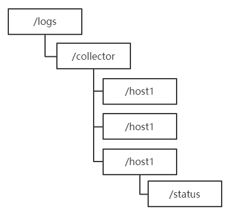
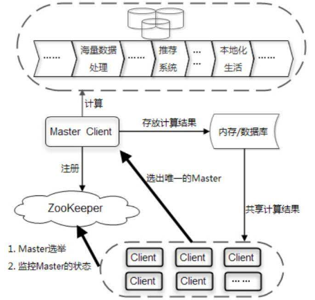
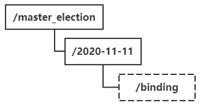
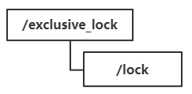
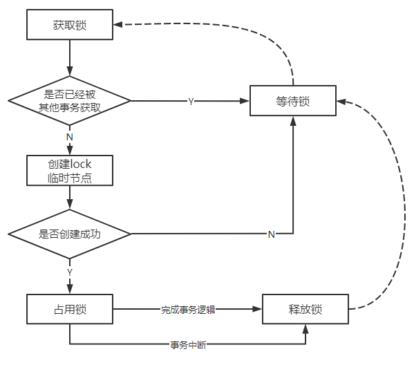
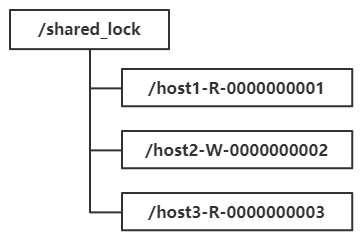
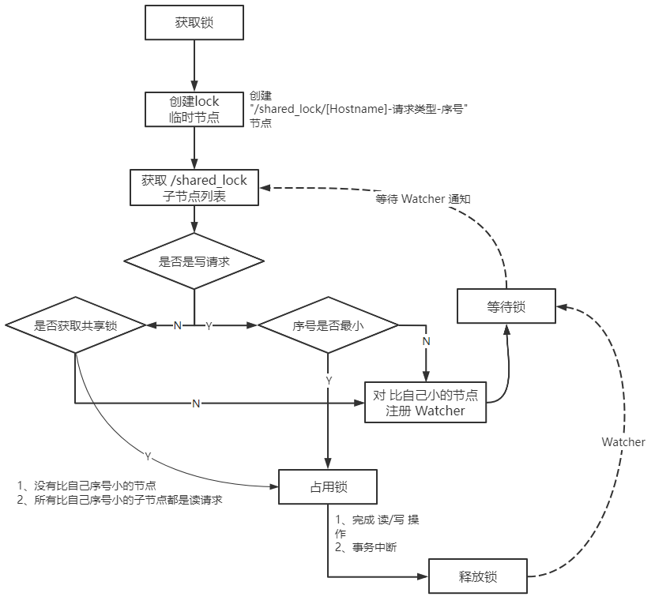

> 第四部分 Zookeeper应用场景

Zookeeper 是一个典型的 发布/订阅 模式的分布式数据管理与协调框架，我们可以使用它来进行分布式数据的发布 与 订阅。另一方面，通过对 Zookeeper 中丰富的数据节点类型进行交叉使用，配合 Watcher 事件通知机制，可以非常简单的构建一系列分布式应用中都会涉及的核心功能，如 **数据发布/订阅**、**命名服务**、**集群管理**、**Master选举**、**分布式锁** 和 **分布式队列** 等。那接下来就针对这些典型的分布式应用场景来做介绍。

# 1 数据发布/订阅

数据发布/订阅（Public/Subscribe）系统，即所谓的配置中心，顾名思义就是发布者将数据发布到 Zookeeper 的一个或一些列节点上，共订阅者进行数据订阅，进而达到动态获取数据的目的，实现配置信息的集中式管理和数据的动态更新。

发布/订阅系统一般有两种设计模式，分别是 **推(Push)** 模式 和 **拉(Pull)** 模式。在推模式中，服务端主动将数据更新发送给所有订阅的客户端；而 拉模式 则是由客户端主动发起请求来获取最新数据，通常客户端都采用定时轮询拉取的方式。

Zookeeper 采用的是推拉相结合的方式：客户端向服务端注册自己需要关注的节点，一旦该节点的数据发生变更，那么服务端就会向相应的客户端发送 Watcher 事件通知，客户端接收到这个消息通知之后，需要主动到服务端获取最新的数据。

如果将配置信息存放到 Zookeeper 上进行集中管理，那么通常情况下，应用在启动的时候都会主动到 Zookeeper 服务端上进行一次配置信息的获取。同时，在指定节点上注册一个 Watcher 监听，这样一来，但凡配置信息发生变更，服务端会实时通知到所有订阅的客户端，从而达到实时获取最新配置信息的目的。


# 2 命名服务

命名服务（Name Service）也是分布式系统中比较常见的一类场景，是分布式系统最基本的公共服务之一。在分布式系统中，被命名的实体通常可以是集群中的机器、提供的服务地址或远程对象等——这些我们都可以统称它们为名字。

分布式全局唯一 ID 生成 ：

通过调用 Zookeeper 节点创建的 API 接口可以创建一个顺序节点，并且在 API 返回值中返回这个节点的完整名字。利用这个特性，我们可以借助 Zookeeper 来生成全局唯一的 ID。


# 3 集群管理

Zookeeper 的两大特性：

1. 客户端如果对 Zookeeper 的数据节点注册 Watcher 监听，那么当该数据节点的内容或是其子节点列表发生变更时，Zookeeper 服务器就会向订阅的客户端发送变更通知。
2. 对在 Zookeeper 上创建的临时节点，一旦客户端与服务器之间的会话失败，那么临时节点就会被自动删除。

利用其两大特性，可以实现集群机器存活监控系统，若监控系统在 /clusterServers 节点上注册一个 Watcher 监听，那么但凡进行动态添加机器，就会在 /clusterServers 节点下创建一个临时节点：/clusterServers/[Hostname]。这样，监控系统能够实时检测机器的变动情况。


## 3.1 分布式日志收集系统

分布式日志收集系统的核心工作就是收集分布在不同机器上的系统日志，这里我们重点来看分布式日志系统（以下简称"日志系统"）的收集器模块。

在一个典型的日志系统架构设计中，整个日志系统会把所有需要收集的日志机器（我们以“日志源机器”代表此类机器）分为多个组别，每个组别对应一个收集器，这个收集器其实就是一个后台机器（我们以“收集器机器”代表此类机器），用于收集日志。

对于大规模的分布式日志收集系统场景，通常需要解决两个问题：

1. 变化的日志源机器

   在生产环境中，伴随着机器的变动，每个应用的机器几乎每天都是在变化的（机器的硬件问题、扩容、机房迁移 或是网络问题等都会导致一个应用的机器变化），也就是说每个组别中的日志源机器通常是在不断变化的。

2. 变化的收集器机器

   日志收集系统自身也会有机器的变更或扩容，于是会出现新的收集机器加入 或是 老的收集器机器退出的情况。

无论是日志源机器 还是 收集器机器 的变更，最终都可以归结为如何快速、合理的为每个收集器分配对应的日志源机器。这也成为整个日志系统正确稳定运转的前提，也是日志收集过程中最大的技术挑战之一。在这种情况下，就可以引入 zookeeper ，下面看 Zookeeper 在这个场景中的使用。

使用 Zookeeper 的场景步骤如下：

1. **注册收集器机器**

   使用 Zookeeper 来进行日志系统收集器的注册，典型做法是在 Zookeeper 上创建一个节点作为收集器的根节点，例如 /logs/collector（下文中以“收集器节点”代表该数据节点），每个收集器集器在启动的时候，都会在收集器节点下创建自己的节点。例如 logs/collector/[Hostname]

   

2. **任务分发**

   待所有收集器集器都创建好自己对应的节点后，系统根据收集器节点下子节点的个数，将所有日志源机器分成对应的若干组，然后将分组后的机器列表分别写到这些收集器机器创建的子节点（例如 /logs/collector/host1）上去。这样一来，每个收集器机器都能够从自己对应的收集器节点上获取日志源 机器列表，从而开始进行日志收集工作。

3. **状态汇报**

   完成收集器的注册以及任务分发后，我们还要考虑到这些机器随时都有挂掉的可能，因此，针对这个问题，我们需要有一个收集器的状态汇报机制：每个收集器机器在创建完自己的专属节点后，还需要在对应的子节点上创建一个状态子节点。例如 /logs/collector/host1/status，每个收集器机器都需要定期向该节点写入自己的状态信息。我们可以把这种策略看作是一种心跳检测机制，通常收集器机器都会在这个节点中写入日志收集进度信息。日志系统根据该状态子节点的最后更新时间来判断对应的收集器 机器是否存活。

4. **动态分配**

   如果收集器机器挂掉 或是 扩容，就需要动态的进行收集任务的分配。在运行过程中，日志系统始终关注着 /logs/collector 这个节点所有子节点的变更，一旦检测到有收集器机器停止汇报 或是 有新的收集器机器加如，就要开始进行任务的重新分配。通常有两种做法：

   - 全局动态分配

     这是一种简单粗暴的做法，在出现收集器机器挂掉 或是 新机器 加入的时候，日志收集系统需要根据新的收集器机器列表，立即对所有的日志源机器进行一次分组，然后将其分配给剩下的收集器机器。

   - 局部动态分配

     全局动态分配方式虽然策略简单，但存在一个问题：一个或部分收集器机器的变更，就会导致全局动态任务的分配，影响面比较大，因此风险就比较大。

     所谓局部动态分配，顾名思义就是在小范围内进行任务的动态分配。在这种策略中，每个收集器机器在汇报自己日志收集状态的同时，也会把自己的负载汇报上去。注意。这里提到的负载并不仅仅只是简单指机器CPU负载，而是一个对当前收集器任务执行的综合评估，这个评估算法和Zookeeper本身并没有太大的关系。

     在这种策略中，如果一个收集器机器挂掉了，那么日志收集系统就会把之前分配给这个机器的任务重新分配到那些负载比较低的机器上去。同样，如果有新的收集器机器加入，会从那些负载高的机器上转移部分任务给这个新加入的机器。

上述步骤已经完整的说明了整个日志收集系统的工作流程，其中有两点注意事项：

1. **节点类型**

   在 /logs/collector 节点下创建临时节点可以很好的判断机器是否存活，但是，若机器挂了，其节点会被删除，记录在节点上的日志源机器列表也会被清除，所以需要选择持久节点来标识每一台机器，同时在节点下分别创建 /logs/collector/[Hostname]/status 节点来表示每一个收集器机器的状态，这样，既能实现对所有机器的监控，同时机器挂掉后，依然能够将分配任务还原。

2. **日志收集系统节点监听**

   若采用 Watcher 机制，那么通知的消息量的网络开销非常大，需要采用日志系统主动轮询收集器节点的策略，这样可以节省网络流量，但是存在一定的延时。

# 4 Master选举

Master 选举是一个在分布式系统中非常常见的应用场景。**分布式最核心的特性就是能够将具有独立计算能力的系统单元部署在不同的机器上，构成一个完整的分布式系统**。而与此同时，实际场景中往往也需要在这些分布在不同机器上的独立系统单元中选出一个“老大”，在计算机中，称为 Master。

在分布式系统中，Master 往往用来协调集群中其他系统单元，具有对分布式系统状态变更的决定权。例如，在一些读写分离的应用场景中，客户端的写请求往往是由 Master 来处理的；而在一些场景中，Master 则常常负责处理一些复杂的逻辑，并将处理结果同步给集群中的其他单元。Master选举可以说是 Zookeeper 最典型的应用场景，接下来，结合 “一种海量数据处理与共享模型” 这个具体案例来看看 Zookeeper 在集群 Master 选举中的应用场景。

在分布式环境中，经常会碰到这样的应用场景：集群中的所有系统单元需要对前端业务提供数据，比如一个商品 ID，或者是一个网站轮播广告的广告 ID 等，而这些商品 ID 或是 广告 ID 往往需要从一系列的海量数据中计算得到——这通常是一个非常耗费 I/O 和 CPU 资源的过程，鉴于该计算过程的复杂性，如果让集群中的所有机器都执行这个计算逻辑，那么将耗费大量资源。一种比较好的方法就是只让集群中的部分，甚至只让其中的一台机器去处理数据计算，一旦计算出数据结果，就可以共享给整个集群中的其他所有客户端机器，这样可大大减少重复劳动，提高性能。这里以一个简单的广告投放系统后台场景为例来讲解这个模型。



整个系统大体上可以分为 客户端集群、分布式缓存系统、海量数据处理总线 和 Zookeeper 四个部分。

首先看整个系统的运行机制。图中的 Client 集群每天定时会通过 Zookeeper 来实现 Master 选举。选举产生 Master 客户端之后，这个 Master 就会负责进行一些列的海量数据处理，最终计算得到一个数据结果，并将其放置在一个内存/数据库中。同时，Master还需要通知集群中其他所有的客户端从这个 内存/数据库 中共享计算结果。

接下来，重点看 Master 选举的过程，首先来明确下 Master 选举的需求：在集群的所有机器中选举出一台机器作为 Master。

Zookeeper 创建节点的API接口，其中一个重要的特性便是：利用 Zookeeper 的强一致性，能够很好保证在分布式高并发情况下节点创建一定能够保证全局唯一性，即 Zookeeper 将会保证客户端无法重复创建一个已经存在的数据节点。利用这个特性实现在分布式环境中 Master 选举。



在这个系统中，首先会在 Zookeeper 上创建一个日期节点，例如 “2020-11-11”。客户端集群每天都会定时向 Zookeeper 上创建一个临时节点，例如 /master_election/2020-11-11/binding。在这个过程中，只有一个客户端能够成功创建这个节点，那么这个客户端所在的机器就成为了 Master。同时，其他没有在 Zookeeper 上成功创建节点的客户端，都会在节点 /master_election/2020-11-11 上注册一个子节点变更的 Watcher，用于监控当前的 Master 机器是否存活，一旦发现当前的 Master 挂了，那么其余的客户端将会重新进行 Master 选举。


# 5 分布式锁

**分布式锁 是 控制分布式系统之间同步访问共享资源的一种方式**。如果不同的系统或是同一个系统的不同主机之间共享一个或一组资源，那么访问这些资源的时候，往往需要通过互斥手段来防止彼此之间的干扰，以保证一致性，在这种情况下，就需要使用分布式锁了。


## 5.1 排他锁

排他锁（Exclusive Locks，简称 X 锁），又称为写锁或独占锁，是一种基本的锁类型。

如何借助 Zookeeper 实现排他锁：

1. 定义锁

   通过 Zookeeper 上的数据节点来表示一个锁，例如 /exclusive_lock/lock 节点就可以被定义为一个锁，如图：

   

2. 获取锁

   在 /exclusive_lock 节点下创建临时子节点 /exclusive_lock/lock。Zookeeper 会保证在所有的客户端中，只有一个能够创建成功，那么就可以认为该客户端获取了锁。同时，所有没有获取到锁的客户端需要在 /exclusive_lock 节点上注册一个子节点变更的 Watcher 监听，以便实时监听到 lock 节点的变更情况。

3. 释放锁

   /exclusive_lock/lock 是一个临时节点，因此在以下两种情况下，都有可能释放锁。

   - 当前获取锁的客户端机器发生宕机，那么 Zookeeper 上的这个临时节点就会被移除
   - 正常执行完业务逻辑后，客户端主动将自己创建的临时节点删除。

   无论在什么情况下移除了 lock 节点，Zookeeper 都会通知所有在 /exclusive_lock 节点上注册了子节点变更 Watcher 监听的客户端。这些客户端在接收到通知后，再次重新发起分布式锁获取，即重复 “获取锁” 过程。整个排他锁的获取和释放流程，如下：

   

   

## 5.2 共享锁

共享锁（Shared Locks，简称 S 锁），又称为读锁，同样是一种基本的锁类型。

如果事务 T1 对数据对象那 O1 加上了共享锁，那么当前事务只能对 O1 进行读取操作，其他事务也只能对这个数据对象加共享锁 —— 直到该数据对象上的所有共享锁都被释放。

共享锁 和 排他锁 最根本的区别在于加上排他锁后，数据对象只对一个事务可见，而加上共享锁后，数据对象对所有事务都可见。

1. 定义锁

   和 排他锁一样，同样是通过 Zookeeper 上的数据节点来表示一个锁，是一个类似于 `/shared_lock/[Hostname]-请求类型-序号`  的**临时顺序节点**，例如 /shared_lock/host1-R-0000000001，那么，这个节点就代表一个共享锁，如图：

   

2. 获取锁

   在需要共享锁时，所有客户端都会到 /shared_lock 这个节点下面创建一个**临时顺序节点** ，如果当前是读请求，那么就创建例如 /shared_lock/host1-R-0000000001 的节点；如果是写请求，那么就创建 例如 /shared_lock/host2-W-0000000002 的节点。

   **判断读写顺序**

   通过 Zookeeper 来确定分布式读写顺序，大致分为 4 步：

   ```xml
   1. 创建完节点后，获取 /shared_lock 节点下的所有子节点，并对该节点变更注册监听
   2. 确定自己的节点序号在所有子节点中的顺序
   3. 对于读请求：若没有没有比自己序号小的子节点 或 所有自己序号小的子节点都是读请求，那么表明自己已经成功获取到共享锁，同时开始执行读取逻辑；若有写请求，则需要等待。
   	对于写请求：若自己不是序号最小的子节点，那么需要等待。
   4. 接收到 Watcher 通知后，重复步骤1
   ```

   

   

3. 释放锁

   释放锁的流程和 排他锁 一致。

## 5.3 羊群效应

上面的共享锁实现，大体上能够满足一般的分布式集群竞争锁的需求，并且性能都还可以—— 这里说的一般场景是指集群规模不是特别大，一般是在 10 台机器以内。但是如果机器规模扩大之后，会有什么问题呢？现在着重看上面 “判断读写顺序” 过程步骤 3 ，结合下面的图，看看实际运行中的情况。


针对如上图所示的情况进行分析

1. host1 首先进行读操作，完成后将节点 /shared_lock/host1-R-0000000001 删除。
2. 余下 4 台 机器均收到这个节点移除的通知，然后重新从 /shared_lock  节点上获取一份新的子节点列表。
3. 每台机器判断自己的读写顺序，其中 host2 检测到自己序号最小，于是开始写操作，余下的机器则继续等待。
4. 继续....

如果同一时间有多个节点对应的客户端完成事务或是事务中断引起节点消失，Zookeeper 服务器就会在短时间内向其余客户端发送大量的事件通知，这就是所谓的**羊群效应**。

实际上，每个节点只需要关注比自己序号小的那个相关节点的变更就可以—— 不需要关注全局。


改进后的分布式锁实现：

1. 客户端调用 create 接口创建类似于 /shared_lock/[Hostname]-请求类型-序号 的临时顺序节点。
2. 客户端调用 getChildren 接口获取所有已经创建的子节点列表（不注册任何 Watcher）.
3. 如果无法获取共享锁，就调用 exist 接口来对 比自己小的节点注册 Watcher；对于读请求：向比自己序号小的最后一个写请求节点注册 Watcher 监听；对于写请求，向比自己序号小的最后一个节点注册 Watcher 监听。
4. 等待 Watcher 通知，继续进入步骤 2



改进后的分布式锁实现比较麻烦。确实如此，如同在多线程并发编程实践中，我们会尽量缩小锁的范围 —— 对于分布式锁实现的改进其实也是同样的思路。在具体的实际开发过程中，根据具体的业务场景和集群规模来选择适合自己的分布式锁实现。

# 6 分布式队列


