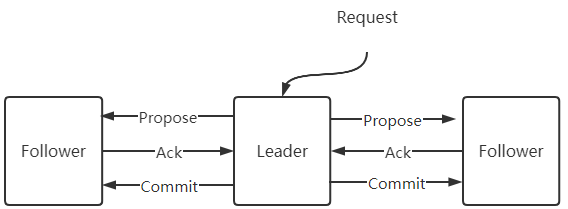
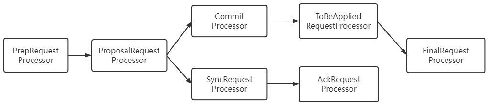
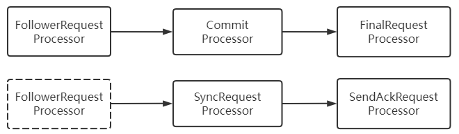
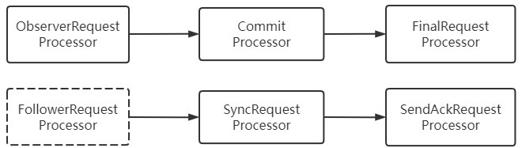
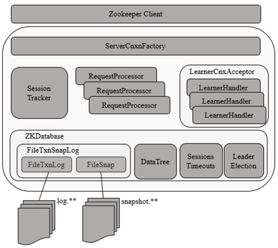
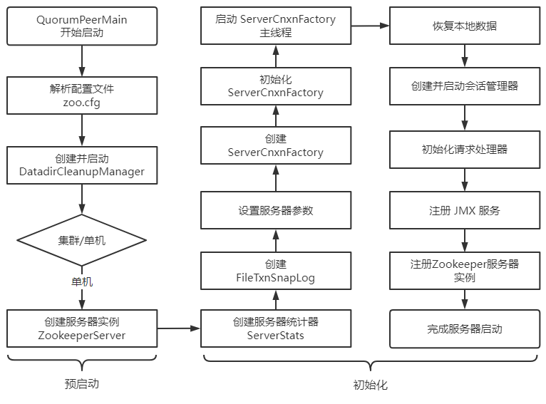
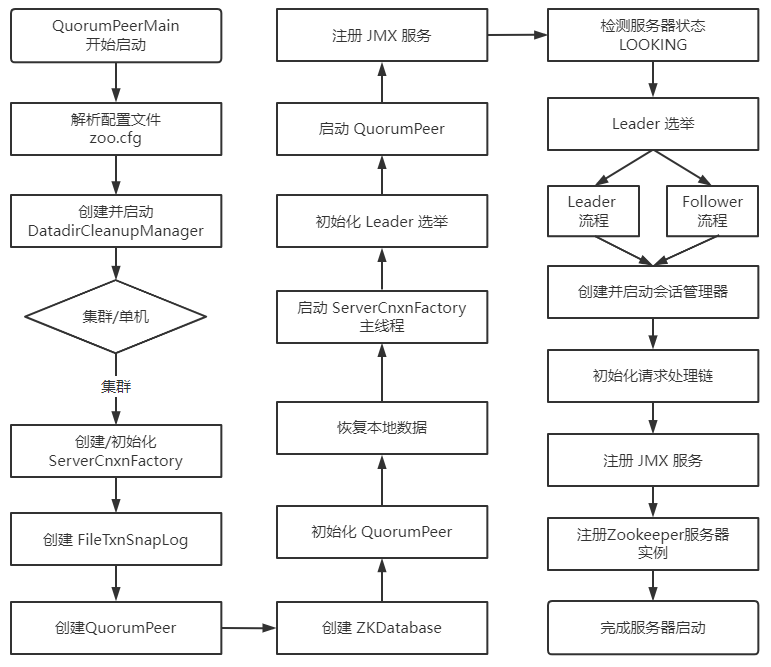
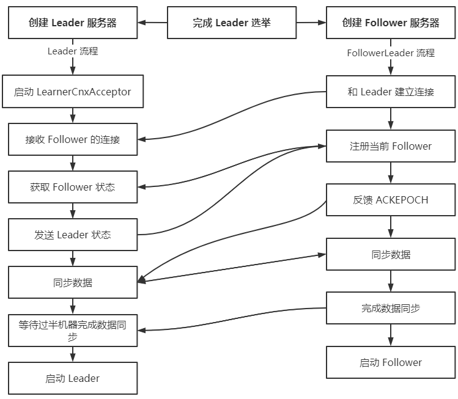

> 第五部分 Zookeeper深入进阶

# 1 ZAB 协议

## 1.1 概念

zookeeper 并没有完全采用 paxos 算法，而是使用了一种称为 Zookeeper Atomic Broadcast（ZAB，Zookeeper 原子消息广播协议）的协议作为其数据一致性的核心算法。

ZAB 协议并不像 Paxos 算法那样是一种通用的分布式一致性算法，它是一种特别为 zookeeper 专门设计的一种**支持崩溃恢复的原子广播协议**

在 Zookeeper 中，主要就是依赖 ZAB 协议来实现分布式数据的一致性，基于该协议，Zookeeper 实现了一种主备模式的系统架构来保持集群中各副本之间数据的一致性，表现形式就是 使用一个单一的主进程来接收并处理客户端的所有事务请求，并采用ZAB 的原子广播协议，将服务器数据的状态变更以事务 Proposal 的形式广播到所有的副本进程中，ZAB 协议的主备模型架构保证了同一时刻集群中只能够有一个主进程来广播服务器的状态变更，因此能够很好的处理客户端大量的并发请求。但是，也要考虑到主进程在任何时候都有可能出现崩溃退出 或 重启现象，因此，ZAB 协议还需要做到当前主进程出现上述异常情况的时候，依旧能正常工作。

## 1.2 ZAB 核心

ZAB 协议的核心是定义了对于那些会改变 Zookeeper 服务器数据状态的事务请求的处理方式。

> 即：所有的事务请求必须由一个全局唯一的服务器来协调处理，这样的服务器被称为 Leader 服务器，余下的服务器则称为 Follower 服务器。
>
> Leader 服务器负责将一个客户端事务请求转化为一个事务 Proposal （提议），并将该 Proposal 分发给集群中所有的 Follower 服务器，之后 Leader 服务器需要等待所有 Follower 服务器的反馈，一旦超过半数的 Follower 服务器进行了正确的反馈后，那么 Leader 就会再次向所有的 Follower 服务器分发 Commit 消息，要求其将前一个 Proposal 进行提交。

## 1.3 ZAB 协议介绍

ZAB 协议包括两种基本模式：**崩溃恢复** 和 **消息广播**

**进入崩溃恢复模式**：

**当整个服务框架启过程中，或者是 Leader 服务器出现网络中断、崩溃退出 或 重启等异常情况时**，ZAB 协议就会进入崩溃恢复模式，同时选举产生新的 Leader 服务器。当选举产生了新的 Leader 服务器，同时集群中已经有过半的机器与该 Leader 服务器完成了状态同步之后，ZAB 协议就会退出恢复模式，其中，所谓的状态同步 就是指数据同步，用来保证集群中过半的机器能够和 Leader 服务器的数据状态保持一致。

**进入消息广播模式**：

当集群中已经有过半的Follower服务器完成了 和 Leader 服务器的状态同步，那么整个服务框架就可以进入**消息广播模式**，当一台同样遵守 ZAB 协议的服务器启动后加入到集群中，如果此时集群中已经存在一个 Leader 服务器在负责进行消息广播，那么加入的服务器就会自觉地进入**数据恢复模式**：**找到Leader所在的服务器，并与其进行数据同步，然后一起参与到消息广播流程中去**。Zookeeper 只允许唯一的一个Leader服务器来进行事务请求的处理，Leader服务器在接收到客户端的事务请求后，会生成对应的事务提议并发起一轮广播，而如果集群中的其他机器收到客户都的事务请求后，那么这些非 Leader 服务器会首先将这个事务转发给 Leader 服务器。

接下来重点讲解 ZAB 协议的消息广播过程和崩溃恢复过程。

### 1.3.1 消息广播

ZAB 协议的消息广播过程使用原子广播协议，类似于一个二阶段提交过程，针对客户端的事务请求，Leader 服务器会为其生成对应的事务 Proposal，并将其发送给集群中其余所有的机器，然后再分别收集各自的选票，最后进行事务提交。

在 ZAB 的二阶段提交过程中，移除了中断逻辑，所有的 Follower的服务要么正常反馈 Leader 提出的事务 Proposal，要么就抛弃 Leader 服务器。同时，ZAB 协议将二阶段提交中的中断逻辑移除意味着我们可以在过半的 Follower服务器已经反馈 Ack 之后就开始提交事务 Proposal 了，而不需要等待集群中所有的 Follower 服务器都反馈响应。

但是，在这种简化的二阶段提交模型下，无法处理因 Leader 服务器崩溃退出而带来的数据不一致问题，因此 ZAB 采用了崩溃恢复模式来解决问题。另外，整个消息广播协议是基于具有 FIFO 特性的 TCP 协议来进行网络通信的，因此 能够很容易保证消息广播过程中消息接收与发送的顺序性。

在整个消息广播过程中，Leader 服务器会为每个请求生成对应的 Proposal 来进行广播，并且在广播事务 Proposal 之前，Leader 服务器会首先为这个事务 Proposal 分配一个全局单调递增的唯一 ID，称为之 事务ID（**Zxid**），由于 ZAB 协议需要保证每个消息严格的因果关系，因此必须将每个事务 Proposal 按照其 Zxid 的先后顺序进行排序和处理。

具体的过程：在消息广播过程中，Leader 服务器会为每一个 Follower 服务器都各自分配一个单独的队列，然后将需要广播的事务 Proposal 一次放入这些队列中，并且根据 FIFO 策略进行消息发送。每一个 Follower 服务器在接收到这个事务 Proposal 之后，都会首先以事务日志的形式写入到本地磁盘中，并且在成功写入后反馈给 Leader 服务器一个 Ack 响应。当 Leader 服务器接收到超过半数 Follower 的 Ack 响应后，就会广播一个 Commit 消息给所有的 Follower 服务器以通知其进行事务提交。同时 Leader 自身也会完成对事务的提交，而每一个 Follower 服务器在接收到 Commit 消息后，也会完成对事务的提交。

### 1.3.2 崩溃恢复

ZAB 协议的这个基于原子广播协议的消息广播过程，在正常情况下运行非常良好，但是一旦在 Leader 服务器出现崩溃，或者由于网络原因导致 Leader 服务器失去了与过半 Follower 的联系，那么就会进入崩溃恢复模式。

在 ZAB 协议中，为了保证程序的正确运行，整个恢复过程结束后需要选举出一个新的 Leader 服务器，因此，ZAB 协议需要一个高效且可靠的 Leader 选举算法，从而保证能够快速的选举出新的 Leader。同时，Leader 选举算法不仅仅需要让 Leader 自身知道已经被选举为 Leader，同时还需要让集群中的所有其他机器也能够快速的感知到选举产生出来的新 Leader 服务器。

### 1.3.3 基本特性

根据上面的内容，了解到，ZAB 协议规定了如果一个事务 Proposal 在一台机器上被处理成功，那么应该在所有的机器上都被处理成功，哪怕机器出现故障崩溃。接下来看看在崩溃恢复过程中，可能会出现的两个数据不一致的隐患以及针对这些情况 ZAB 协议需要保证的特性。

**ZAB 协议需要确保那些已经在 Leader 服务器上提交的事务最终被所有服务器提交**

ZAB 协议必须设计成这样一个 Leader 选举算法：能够确保已经被 Leader 提交的事务 Proposal，同时丢弃已经被跳过的事务 Proposal。针对这个要求，如果让 Leader 选举算法能够保证新选举出来的 Leader 服务器拥有集群中所有机器最高编号 （ZXID最大）的事务 Proposal，那么就可以保证这个新选举出来的 Leader 一定具有所有已经提交的提案。更为重要的是，如果让具有更高编号事务 Proposal 的机器成为 Leader，就可以省去 Leader 服务器检查 Proposal 的提交和丢弃工作这一步操作了。

### 1.3.4 数据同步

完成 Leader 选举之后，在正式开始工作（即接收客户端的事务请求，然后提出新的提案）之前，Leader 服务器会首先确认事务日志中的所有 Proposal 是否都已经被集群中过半的机器提交了，即是否完成数据同步。下面看一下 ZAB 协议的数据同步过程。

所有正常运行的服务器，要么成为 Leader，要么成为 Follower 并和 Leader 保持同步。 Leader 服务器需要确保所有的 Follower 服务器能够接收到每一条事务 Proposal，并且能够正确地将所有已经提交的事务 Proposal 应用到内存数据库中。 具体的，Leader 服务器会为每一个 Follower 服务器都准备一个队列，并将那些没有被各 Follower 服务器同步的事务以 Proposal 消息的形式逐个发送给 Follower 服务器，并在每一个 Proposal 消息后面紧接着再发送一个 Commit 消息，以表示该事务已经被提交。 等到 Follower 服务器将所有其尚未同步的事务 Proposal 都从 Leader 服务器上同步过来并成功应用到本地数据库中后，Leader 服务器就会将该 Follower 服务器加入真正的可用 Follower列表中，并开始之后的其他流程。

## 1.4 运行时状态分析

在 ZAB 协议的设计中，每个进程都有可能处于如下三种状态之一：

- LOOKING：Leader 选举阶段
- FOLLOWING：Follower服务器和 Leader 服务器保持同步状态
- LEADING：Leader 服务器作为主进程领导状态

所有进程初始状态都是 LOOKING 状态，此时不存在 Leader，接下来，进程会试图选举出一个新的 Leader，之后，如果进程发现已经选举出新的 Leader 了，那么它就会切换到 FOLLOWING 状态，并开始和 Leader 保持同步，处于 FOLLOWING 状态的进程称为 Follower，LEADING 状态的进程称为 Leader，当 Leader 崩溃或放弃领导地位时，其余的 Follower 进程就会转换到 LOOKING 状态开始新一轮的 Leader 选举。

一个 Follower 只能和一个 Leader 保持同步，Leader 进程和所有的 Follower 进程之间都通过心跳检测机制来感知彼此的情况。若 Leader 能够在超时时间内正常收到心跳检测，那么 Follower 就会一直与该 Leader 保持连接；而如果在指定时间内 Leader 无法从过半的 Follower 进程那里接收到心跳检测，或者 TCP 连接断开，那么 Leader 就会放弃当前周期的领导，并转换到 LOOKING 状态，其他的 Follower也会选择放弃这个 Leader，同时转换到 LOOKING 状态，之后会进行新一轮的 Leader 选举。

## 1.5 ZAB 与 Paxos 的联系和区别

联系：

1. 都存在一个类似于 Leader 进程的角色，由其负责协调多个 Follower 进程的运行
2. Leader 进程都会等待超过半数的 Follower 做出正确的反馈后，才会将一个提议进行提交。
3. 在 ZAB 协议中，每个 Proposal 中都包含了一个 epoch 值，用来代表当前的 Leader 周期，在 Paxos 算法中，同样存在这样的一个标识，名字为 Ballot。

区别：

Paxos 算法中，新选举产生的主进程会进行两个节点的工作，第一阶段称为读阶段，新的主进程和其他进程通信来收集主进程提出的提议，并将它们提交。第二阶段称为写阶段，当前主进程开始提出自己的提议。

ZAB 协议在 Paxos 基础上添加了同步阶段，此时，新的 Leader 会确保存在过半的 Follower 已经提交了之前的 Leader 周期中所有事务 Proposal。这一同步阶段的引入，能够有效的保证 Leader 在新的周期中提出事务 Proposal 之前，所有的进程都已经完成了对之前所有事务 Proposal 的提交。

总的来说，ZAB 协议 和 Paxos 算法的本质区别在于，两者的设计目标不太一样，**ZAB 协议主要用于构建一个高可用的分布式数据主备系统，而 Paxos 算法则用于构建一个分布式的一致性状态机系统。**

# 2 服务器角色

## 2.1 Leader

Leader 服务器是 Zookeeper 集群工作的核心，其主要工作有以下两个：

1. 事务请求的唯一调度和处理者，保证集群事务处理的顺序性。
2. 集群内部各服务器的调度者。

**请求处理链**

使用责任链来处理每个客户端的请求是 Zookeeper 的特色，Leader 服务器的请求处理链如下：

可以看到，从 prepRequestProcessor 到 FinalRequestProcessor 前后一共 7 个请求处理器组成了 Leader 服务器的请求处理链。

1. PrepRequestProcessor

   请求预处理器，也是 Leader 服务器中的第一个请求处理器。在 Zookeeper 中，那么会改变服务器状态的请求称为事务请求（创建节点、更新数据、删除节点、创建会话等），PrepRequestProcessor 能够识别出当前客户端请求是否是事务请求。对于事务请求，PrepRequestProcessor 处理器会对其进行一系列预处理，如创建请求事务头、事务体、会话检查、ACL 检查 和 版本检查等。

2. ProposalRequestProcessor

   事务投票处理器。也是 Leader 服务器处理流程的发起者，对于非事务性请求，ProposalRequestProcessor 会直接将请求转发到 CommitProcessor处理器，不再做任何处理，而对于事务性请求，处理将请求转发到 CommitProcessor 外，还会根据请求类型创建对应的 Proposal 提议，并发送给所有的 Follower 服务器来发起一次集群内的事务投票。同时 ProposalRequestProcessor 还会将事务请求交付给 SyncRequestProcessor 进行事务日志的记录。

3. SyncRequestProcessor

   事务日志记录处理器。用来将事务请求记录到事务日志文件中，同时会触发 Zookeeper 进行数据快照。

4. AckRequestProcessor

   负责在 SyncRequestProcessor 完成事务日志记录后，向 Proposal 的投票收集器发送 Ack 反馈，以通知投票收集器已经完成了对该 Proposal 的事务日志记录。

5. CommitProcessor

   事务提交处理器。对于非事务请求，该处理器会直接将其交付给下一级处理器处理；对于事务请求，其会等待集群内针对Proposal的投票直到该 Proposal可被提交，利用 CommitProcessor ，每个服务器都可以很好地控制对事务请求的顺序处理。

6. ToBeCommitProcessor

   该处理器有一个 toBeApplied 队列，用来存储那些已经被 CommitProcessor 处理过的可被提交的 Proposal。其会将这些请求交付给 FinalRequestProcessor 处理器处理，待其处理完后，再将其从 toBeApplied 队列中移除。

7. FinalRequestProcessor

   用来进行客户端请求返回之前的操作，包括创建客户端请求的响应，针对事务请求，该处理器还会负责将事务应用到内存数据库中。

## 2.2 Follower

Follower 服务器是 Zookeeper 集群状态中的跟随着，其主要工作有以下三个：

1. 处理客户端非事务性请求（读数据），转发事务请求给 Leader 服务器
2. 参与事务请求 Proposal 的投票
3. 参与 Leader 选举投票

和 Leader 一样，Follower 也采用了责任链模式组装的请求处理链来处理每一个客户端请求，由于不需要对事务请求的投票处理，因此 Follower 的请求处理链相对简单，其处理链如下：

和 Leader 服务器的请求处理链最大的不同点在于，Follower 服务器的第一个处理器换成了 FollowerRequestProcessor 处理器，同时由于不需要处理事务请求的投票，因此也没有了 ProposalRequestProcessor 处理器。

1. FollowerRequestProcessor

   起作用识别当前请求是否是事务请求，若是，那么 Follower 就会将该请求转发给 Leader 服务器，Leader 服务器在接收到这个事务请求后，就会将其提交到请求处理链，按照正常事务请求进行处理。

2. SendAckRequestProcessor

   其承担了事务日记记录反馈的角色，在完成事务日志记录后，会向 Leader 服务器发送 ACK 消息以表明 自身完成了事务日志的记录工作。

## 2.3 Observer

Observer 是 Zookeeper 自 3.3.0 版本开始引入的一个全新的服务器角色。从字面意思看，该服务器充当了一个观察者的角色——其观察 Zookeeper 集群的最新状态变化并将这些状态变更同步过来。

Observer 服务器在工作原理上 和 Follower 基本是一致的，对于非事务请求，都可以进行独立的处理，而对于事务请求，则会转发给 Leader 服务器进行处理。和 Follower 唯一的区别在于，**Observer 不参与任何形式的投票，包括事务请求 Proposal 的投票和 Leader 选举投票**。简单的讲，Observer 服务器只提供非事务服务，通常用于在不影响集群事务处理能力的前提下提升集群的非事务处理能力。

另外，Observer的请求处理链路 和 Follower 服务器也非常相近，其处理链路如下：

另外需要注意的一点是，虽然在图中可以看到，Observer 服务器在初始化阶段会将 SyncRequestProcessor 处理器也组装上去，但在实际运行过程中，Leader 服务器不会将事务请求的投票发送给 Observer 服务器。

# 3 服务器启动

## 3.1 服务端整体架构图

Zookeeper 服务器的启动，大致可以分为以下5个步骤：

1. 配置文件解析
2. 初始化数据管理器
3. 初始化网络 I/O 管理器
4. 数据恢复
5. 对外服务

## 3.2 单机版服务器启动

单机版服务器的启动流程图如下：

上图的过程可以分为**预启动**和**初始化**过程。

### 3.2.1 预启动

1. 统一由 QuorumPeerMain 作为启动类。无论单机或集群，在 zkServer.cmd 和 zkServer.sh 中都配置了 QuorumPeerMain 作为启动入口类。
2. 解析配置文件 zoo.cfg。zoo.cfg 配置运行时的基本参数，如 tickTime、dataDir、ClientPort 等参数。
3. 创建并启动历史文件清理器 DatadirCleanupManager。对事务日志和快照数据文件进行定时清理
4. 判断当前是集群模式还是单机模式启动。若是单机模式，则委托给 ZookeeperServerMain 进行启动。
5. 再次进行配置文件 zoo.cfg 的解析。
6. 创建服务器实例 ZookeeperServer。Zookeeper 服务器首先会进行服务器实例的创建，然后对该服务器实例进行初始化，包括连接器、内存数据库、请求处理器等组件的初始化。

### 3.2.2 初始化

1. 创建服务器统计器 ServerStats。ServerStats 是 Zookeeper 服务器运行时的统计器。
2. 创建Zookeeper数据管理器 FileTxnSnapLog。FileTxnSnapLog 是 Zookeeper 上层服务器 和 底层数据存储之间的对接层，提供了一系列操作数据文件的接口，如果事务日志文件和快照数据文件。Zookeeper 根据 zoo.cfg 文件中解析出来的快照数据目录 dataDir 和 事务日志目录 dataLogDir 来创建 FileTxnSnapLog。
3. 设置服务器 tickTime 和 会话超时时间限制。
4. 创建 ServerCnxnFactory。通过配置系统属性 zookeeper.serverCnxnFactory 来指定使用 Zookeeper 自己实现的 NIO 还是使用 Netty 框架作为 Zookeeper 服务端网络连接工厂。
5. 初始化 ServerCnxnFactory。Zookeeper 会初始化 Thread 作为 ServerCnxnFactory 的主线程，然后再初始化 NIO 服务器。
6. 启动 ServerCnxnFactory 主线程。进入 Thread 的 run 方法，此时服务端还不能处理客户端请求。
7. 恢复本地数据。启动时，需要从本地快照数据文件和事务日志文件进行数据恢复。
8. 创建并启动会话管理器。Zookeeper 会创建会话管理器 SessionTracker 进行会话管理。
9. 初始化 Zookeeper 的请求处理链。Zookeeper 请求处理方式为责任链模式的实现。会有多个请求处理器依次处理一个客户端请求，在服务器启动时，会将这些请求处理器串联成一个请求处理链。
10. 注册 JMX 服务。Zookeeper 会将服务器运行时的一些信息以 JMX 的方式暴露给外部。
11. 注册 Zookeeper 服务器实例。将 Zookeeper 服务器实例注册给 ServerCnxnFactory，之后 Zookeeper 就可以对外提供服务。

至此，单机版的 Zookeeper 服务器启动完毕。

## 3.3 集群服务器启动

单机和集群服务器的启动在很多地方是一致的，其流程图：

上图的过程可以分为 **预启动**、**初始化**、**Leader选举**、**Leader与Follower启动期交互**、**Leader与Follower启动** 等过程。

### 3.3.1 预启动

1. 统一由 QuorumPeerMain 作为启动类。
2. 解析配置文件 zoo.cfg。
3. 创建并启动历史文件清理器 DatadirCleanupFactory。
4. 判断当前是集群模式还是单机模式的启动。在集群模式中，在 zoo.cfg 文件中配置了多个服务器地址，可以选择集群启动。

### 3.3.2 初始化

1. 创建 ServerCnxnFactory。
2. 初始化 ServerCnxnFactory。
3. 创建 Zookeeper 数据管理器 FileTxnSnapLog。
4. 创建 QuorumPeer 实例。Quorum 是集群模式下特有的对象，是 Zookeeper 服务器实例（ZookeeperServer）的托管者，QuorumPeer 代表了集群中的一台机器，在运行期间，QuorumPeer 会不断检测当前服务器实例的运行状态，同时根据情况发起 Leader 选举。
5. 创建内存数据库 ZKDatabase。ZKDatabase 负责管理 Zookeeper 的所有会话记录以及 DataTree 和事务日志的存储。
6. 初始化 QuorumPeer。将核心组件如 FileTxnSnapLog、ServerCnxnFactory、ZKDatabase 注册到 QuorumPeer 中，同时配置 QuorumPeer 的参数，如服务器列表地址、Leader选举算法 和 会话超时时间限制等。
7. 恢复本地数据。
8. 启动 ServerCnxnFactory 主线程。

### 3.3.3 Leader 选举

1. 初始化 Leader 选举

   集群模式特有，Zookeeper 首先会根据自身的服务器ID（SID）、最新的 ZXID（lastLoggedZxid）和 当前的服务器 epoch（currentEpoch）来生成一个初始化投票。在初始化过程中，每个服务器都会给自己投票；然后，根据 zoo.cfg 的配置，创建相应 Leader 选举算法实现，Zookeeper 提供了三种默认算法（LeaderElection、AuthFastLeaderElection、FastLeaderElection），可通过 zoo.cfg 中的 electionAlg 属性来指定，但现在只支持 **FastLeaderElection** 选举算法。在初始化阶段，Zookeeper 会创建 Leader 选举所需的网络 I/O 层 QuorumCnxManager，同时启动对 Leader 选举端口的监听，等待集群中其他服务器创建连接。

2. 注册 JMX 服务。

3. 检测当前服务器状态。

   运行期间，QuorumPeer 会不断检测检测当前服务器状态。在正常情况下，Zookeeper 服务器的状态在 LOOKING、LEADING、FOLLOWING/OBSERVING 之间进行切换。在启动阶段，QuorumPeer 的初始状态是 LOOKING，因此开始进行 Leader 选举。

4. Leader 选举

   Zookeeper 的 Leader 选举过程，简单的讲，就是一个集群中所有的机器相互之间进行一系列投票，选举产生最合适的机器成为 Leader，同时其余机器成为 Follower 或是 Observer 的集群机器角色初始化的过程。
   
   关于 Leader 选举算法，简而言之，就是集群中哪个机器处理的数据越新（通常根据每个服务器处理过的最大 ZXID 来比较确定其数据是否更新），其越有可能成为 Leader。当然，如果集群中的所有机器处理的 ZXID 一致的话，那么 SID（自身的服务器ID） 最大的服务器成为 Leader，其余机器成为 Follower 和 Observer。

### 3.3.4 Leader 和 Follower 启动期交互过程

到这里为止，Zookeeper已经完成了 Leader 选举，并且集群中每个服务器都已经确定了自己的角色 —— 通常情况下就分为 Leader 和 Follower 两种角色。下面来对 Leader 和 Follower 在启动期间的交互进行介绍，其大致交互流程如图所示：

1. 创建 Leader 服务器和 Follower服务器。完成 Leader 选举后，每个服务器会根据自己服务器的角色创建相应的服务器实例，并进入各自的主流程。
2. Leader 服务器启动 Follower 接收器 LearnerCnxAcceptor。运行期间，Leader 服务器需要和所有其余的服务器（统称为 Leader）保持连接以确保集群的机器存活情况，LearnerCnxAcceptor 负责接收所有非 Leader 服务器的连接请求。
3. Learner 服务器开始 和 Leader 建立连接。所有 Learner 会找到 Leader 服务器，并与其建立连接。
4. Leader 服务器创建 LearnHandler。Leader 接收来自其他机器连接创建请求后，会创建一个 LearnerHandler 实例，每个 LearnerHandler 实例都对应一个 Leader 与 Learner 服务器之间的连接，其负责 Leader 和 Learner 服务器之间几乎所有的消息通信和数据同步。
5. 向 Leader 注册。Learner 完成 和 Leader 的连接后，会向 Leader 进行注册，即将 Learner 服务器的基本信息（LearnerInfo），包括 SID 和 ZXID，发送给 Leader 服务器。
6. Leader 解析 Learner 信息，计算新的 epoch。Leader 接收到 Learner 服务器基本信息后，会解析出该 Learner 的 SID 和 ZXID，然后根据 ZXID 解析出对应的 epoch_of_learner，并和当前 Leader 服务器的 epoch_of_leader 进行比较，如果该 Learner 的 epoch_of_learner 更大，则更新 Leader 的 epoch_of_leader = epoch_of_learner + 1。然后 LearnHandler 进行等待，直到过半 Learner 已经向 Leader 进行了注册，同时更新了 epoch_of_leader 后，Leader 就可以确定当前集群的 epoch 了。
7. 发送 Leader 状态，计算出新的 epoch 后，Leader 会将该信息以一个 LEADERINFO 消息的形式发送给 Learner，并等待 Learner 的响应。
8. Learner 发送 ACK 消息。Learner 接收到 LEADERINFO 后，会解析出 epoch 和 ZXID，然后向 Leader 反馈一个 ACKEPOCH 响应。
9. 数据同步。Leader 收到 Learner 的 ACKEPOCH 后，即可进行数据同步。
10. 启动 Leader 和 Learner 服务器。当有过半 Learner 已经完成数同步，那么 Leader 和 Learner 服务器实例就可以启动了。

### 3.3.5 Leader 和 Follower 启动

1. 创建启动会话管理器。
2. 初始化 Zookeeper 请求处理链，集群模式的每个处理器也会在启动阶段串联请求处理链。
3. 注册 JMX 服务。

至此，集群版 Zookeeper 服务器启动完毕。

# 4 Leader选举

Leader 选举概述

Leader 选举是 Zookeeper 最重要的技术之一，也是保证分布式数据一致性的关键所在。

在 Zookeeper 集群中的一台服务器出现以下两种情况之一时，需要进入 Leader 选举。

1. 服务器初始化启动
2. 服务器运行期间无法 和 Leader 保持连接

## 4.1 服务器启动时期的 Leader 选举

若进行 Leader 选举，则至少需要两台机器，这里选取 3 台机器组成的服务器集群为例。在集群初始化阶段，当有一台服务器 Server1 启动时，其单独无法进行和完成 Leader 选举，当第二台服务器 Server2 启动时，此时两台机器可以相互通信，每台机器都试图找到 Leader，于是进入 Leader 选举过程。选举过程如下：

1. **每个Server发出一个投票**

   由于是初始情况，Server1（假设myid为1）和 Server2（假设myid为2）都会将自己作为 Leader 服务器来进行投票，每次投票会包含所推举的服务器的 myid 和 ZXID，使用（myid,ZXID）来表示，此时 Server1 的投票为（1,0）Server2 的投票为（2,0），然后各自将这个投票发给集群中其他机器。

2. **接受来自各个服务器的投票**

   集群中的每个服务器收到投票后，首先判断该投票的有效性，如检查是否是本轮投票、是否来自 LOOKING 状态的服务器。

3. **处理投票**

   针对每一个投票，服务器都需要将别人的投票的自己的投票进行 PK，PK 规则如下：
   
   - 优先检查ZXID。ZXID 比较大的服务器优先作为 Leader。
   - 如果 ZXID 相同，那么就比较 myid。myid较大的服务器作为 Leader 服务器。
   
   现在我们来看Server1 和 Server2 实际是如何进行投票处理的。对于 Server1 来说，它自己的投票是 (1,0)，而接收到的投票为 (2,0)。首先会比较两者的 ZXID，因为都是 0，所以无法决定谁是 Leader；接下来会比对两者的 myid，显然，Server1 发现接收到的投票中 myid 是 2，大于自己，于是就会更新自己的投票为 (2,0)，然后重新将投票发出去。而对于 Server2 来说，不需要更新自己的投票。
   
4. **统计投票**

   每次投票后，服务器都会统计所有投票，判断是否已经有过半的机器接收到相同的投票信息。对于 Server1 和 Server2 服务器来说，都统计出集群中已经有两台机器接受了 (2,0) 这个投票信息。这里我们需要对 “**过半**” 的概念简单介绍：所谓 “**过半**” 就是指大于集群机器数量的一半，即大于或等于 (n/2+1)。对于这里由 3 台机器构成的集群，大于等于 2 台即为达到 “过半” 要求。

   那么，当 Server1 和 Server2 都收到相同的投票信息 (2,0) 的时候，即认为已经选出了 Leader。

5. **改变服务器状态**

   一旦确定了 Leader，每个服务器就会更新自己的状态：如果是 Follower，那么就变更为 FOLLOWING，如果是 Leader，那么就变更为 LEADING。

## 4.2 服务器运行时期的 Leader 选举

在 Zookeeper 集群正常运行过程中，一旦选出一个 Leader，那么所有服务器的集群角色一般不会再发生变化 —— 也就是说，Leader 服务器将一直作为集群的 Leader，即使集群中所有非 Leader 机器挂了或是有新机器加入也不会影响 Leader。但是一旦 Leader 所在的机器挂了，那么整个集群将暂时无法对外服务，而是进入新一轮的 Leader 选举。服务器运行期间的 Leader 选举和启动时期 Leader 选举基本过程是一致的。

还是假设当前正在运行的 Zookeeper 机器由 3 台机器组成，分别是 Server1、Server2 和 Server3，当前的Leader 是 Server2。假设在某一个瞬间，Leader 挂了，这个时候便开始了 Leader 选举。

1. **变更状态**

   Leader 挂后，余下的非 Observer 服务器都会将自己的服务器状态变更为 LOOKING，然后开始进入 Leader 选举过程。

2. **每个 Server 会发出一个投票**

   在运行期间，每个服务器上的 ZXID 可能不同，此时假定 Server1 的 ZXID 为 123，Server3 的 ZXID 为 122；在第一轮投票中，Server1 和 Server3 都会投自己，产生投票 (1,123)，(3,122)，然后各自将投票发送给集群中所有机器。

3. **接收来自各个服务器的投票，与启动时过程相同**

4. **投票处理。与启动时过程相同**

5. **统计投票。与启动时过程相同，此时 Server1 将会成为 Leader**

6. **改变服务器的状态。与启动时过程相同**

