> 第六部分 Zookeeper源码分析

# 1 源码环境搭建

zk 源码下载地址：https://github.com/apache/zookeeper/tree/release-3.5.4

链接: https://pan.baidu.com/s/1DqqiNM0Ln-_y1lhIMaQd4g 提取码: kbnr 

> 注意：因为 zk 是由 ant 来构建的，所以需要使用 ant 命令来转换成工程，然后导入 idea（当前网盘提供的下载地址无需进行转换操作，下载完毕后直接导入idea即可）

## 1.1 idea 导入源码

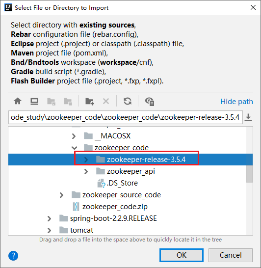

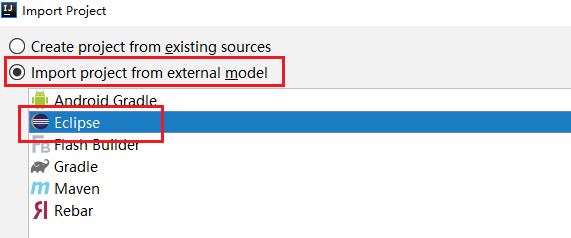

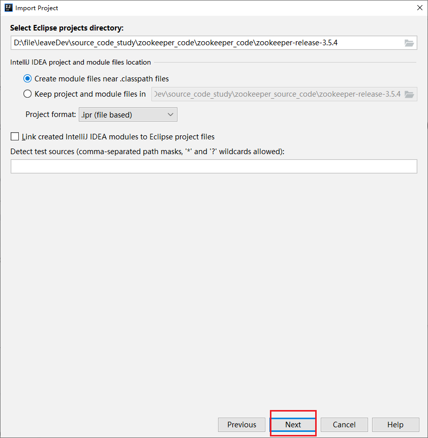

## 1.2 关联相关 jar 包

注意：有两个路径下的 jar 都需要进行关联

- 路径1：build/lib
- 路径2：build/lib/test/lib

### 1.2.1 关联路径1相关jar包

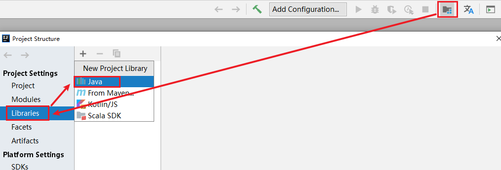

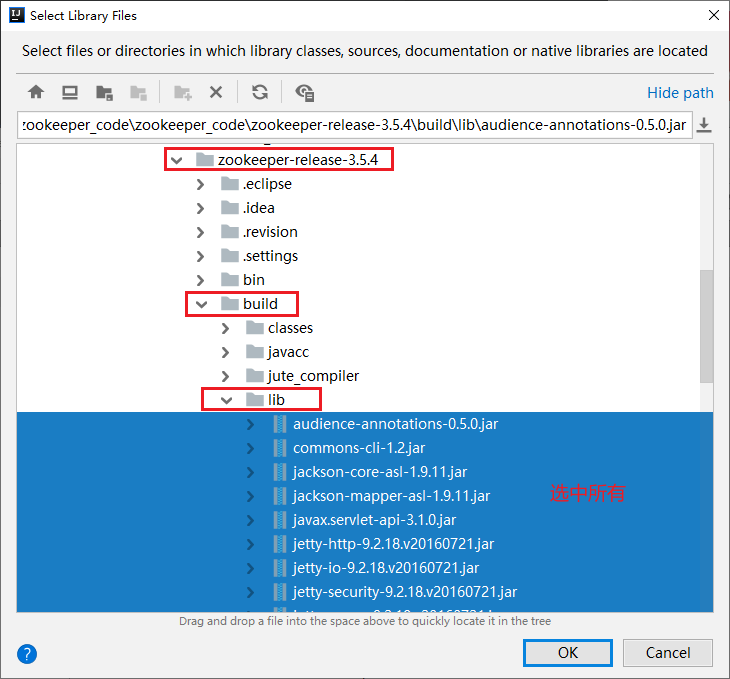

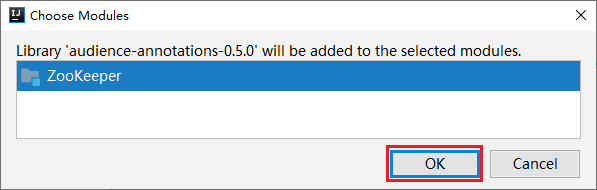

### 1.2.2 关联路径2相关 jar 包

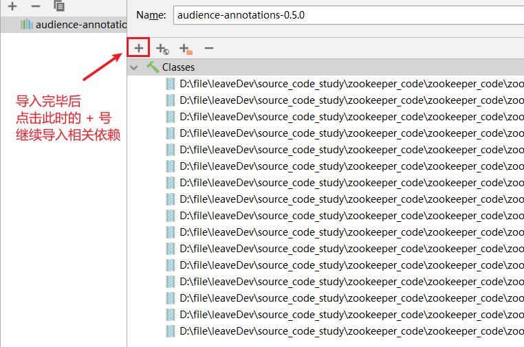

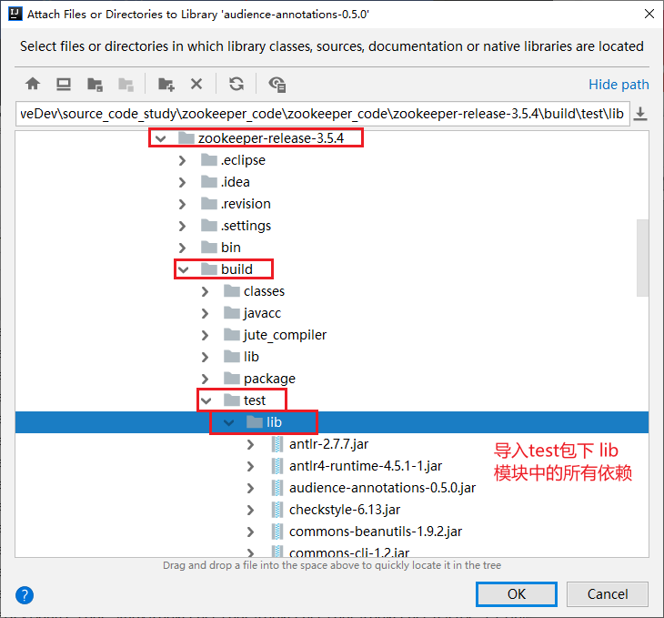

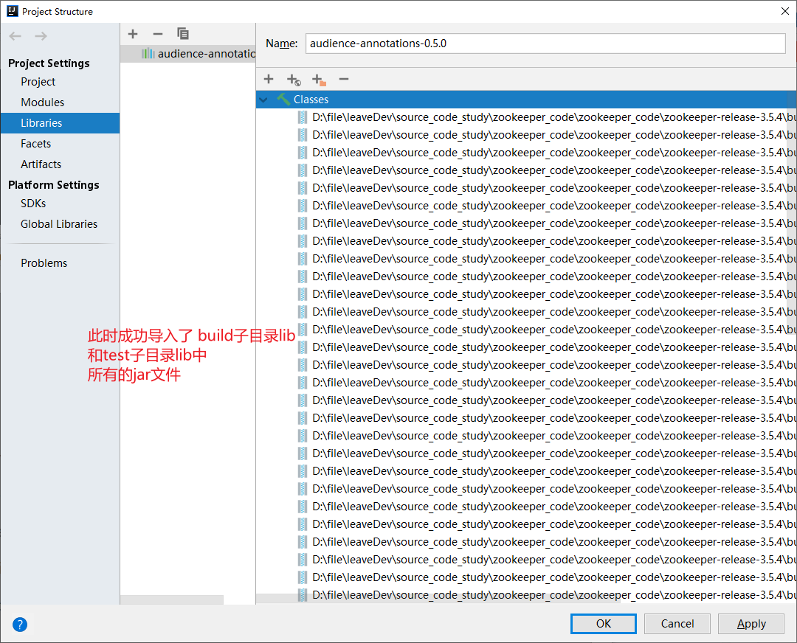

### 1.2.3 idea 关联 Ant 的 build.xml

要运行 Ant 需要有一个 build.xml，idea 关联下面 Ant 的 build.xml，点击 idea 右边菜单有个 Ant Build 小蚂蚁图标，点击后，再点击 +，将 build.xml 添加到 Ant Build

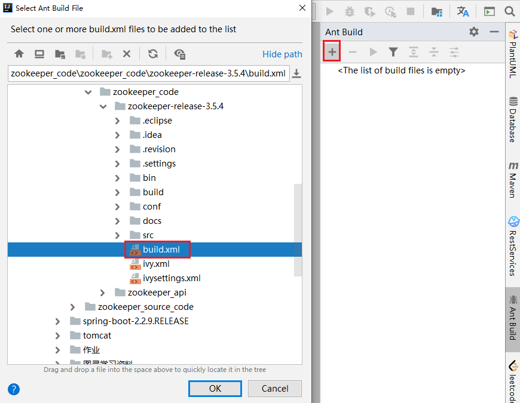

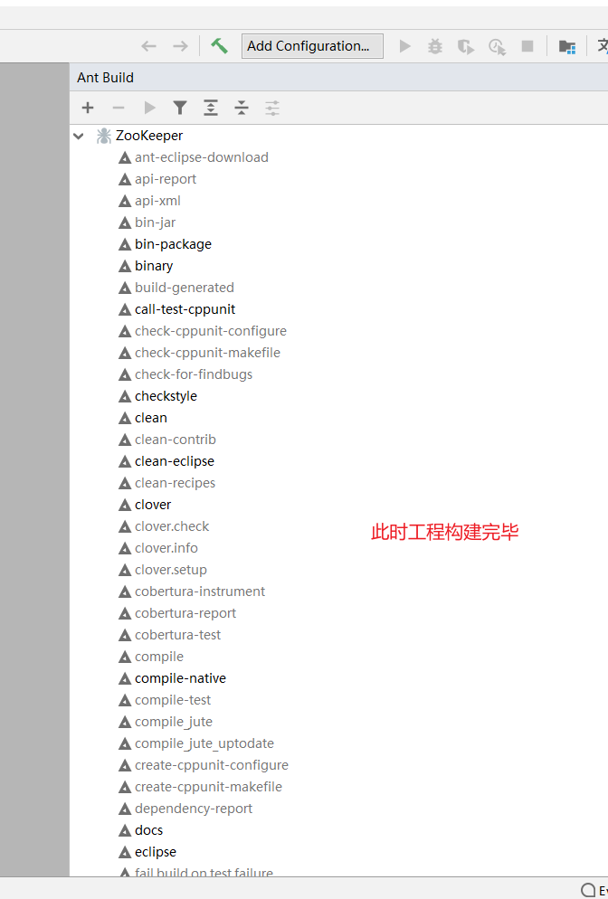

## 1.3 服务器端启动程序配置

### 1.3.1 复制配置文件 zoo.cfg，服务器端启动需要加载此配置文件

设置端口和快照文件存储路径


### 1.3.2 搜索启动类 QuorumPeerMain

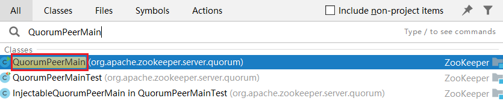

### 1.3.3 配置服务端运行主类的启动参数

启动服务端运行主类 org.apache.zookeeper.server.quorum.QuorumPeerMain ，启动此类的 main 方法的时候需要通过 args 将 zoo.cfg 配置文件的完整路径进行传递，因此需要配置在 Program arguments。

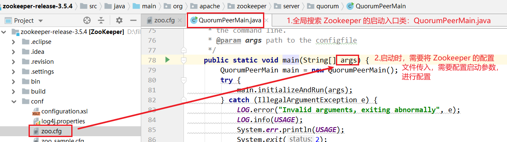

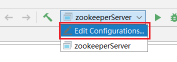

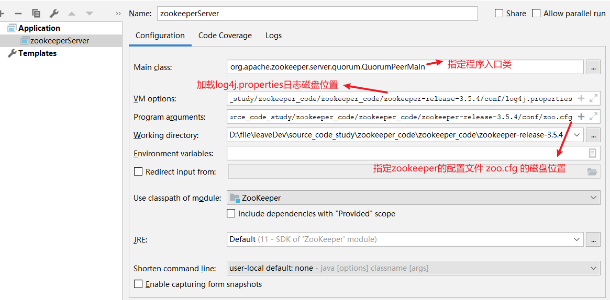

参数一：在 Main class 配置，当前启动类

```bash
org.apache.zookeeper.server.quorum.QuorumPeerMain
```

参数二：VM options

```bash
-Dlog4j.configuration=file:D:/file/leaveDev/source_code_study/zookeeper_code/zookeeper_code/zookeeper-release-3.5.4/conf/log4j.properties
```

参数三：Program arguments

```bash
D:/file/leaveDev/source_code_study/zookeeper_code/zookeeper_code/zookeeper-release-3.5.4/conf/zoo.cfg
```

### 1.3.4 启动 zookeeper 服务器端

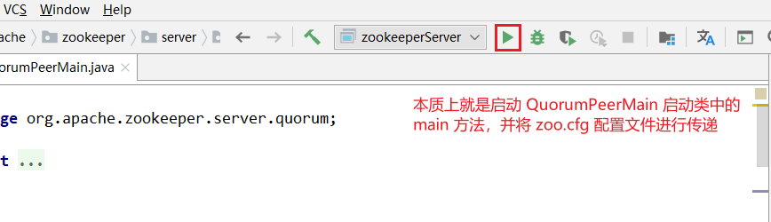

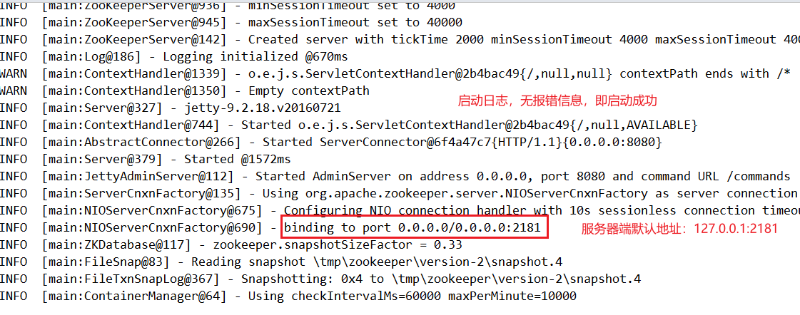

## 1.4 客户端启动程序配置

通过运行 ZookeeperServer 得到日志，可以得知 Zookeeper 服务端已经启动，服务的地址为 127.0.0.1:2181。接下来需要启动客户端来进行连接测试。

### 1.4.1 搜索启动类 ZookeeperMain

客户端的启动类为 org.apache.zookeeper.ZooKeeperMain

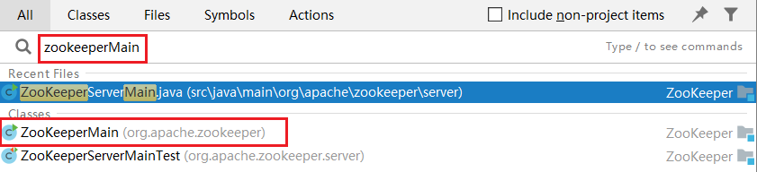

### 1.4.2 配置客户端运行主类的启动参数，进行如下配置

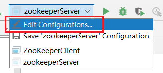

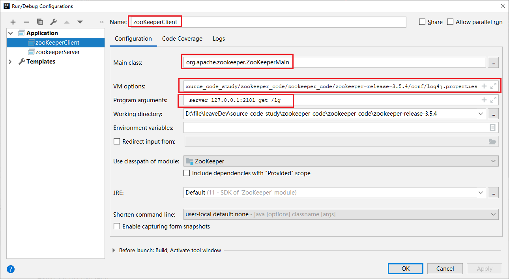

其中配置 -server 127.0.0.1:2181 get /lg ，即客户端连接 127.0.0.1:2181，获取节点 lg 的信息

### 1.4.3 启动运行客户端

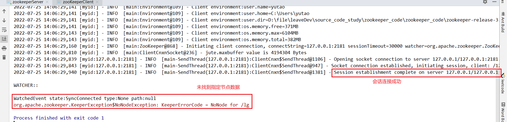


# 2 zookeeper 源码分析之单机模式服务端启动

单机模式的 ZK 服务端逻辑写在 org.apache.zookeeper.server.ZooKeeperServerMain 类中，由里面的 main  函数启动，整个过程如下：


单机模式的委托启动类为：org.apache.zookeeper.server.ZooKeeperServerMain

**服务端启动过程**

看下 ZooKeeperServerMain 里面的 main 函数代码：

```java
public static void main(String[] args) {
    ZooKeeperServerMain main = new ZooKeeperServerMain();
    //解析配置启动zk
    main.initializeAndRun(args);
}
// 解析单机模式的配置对象，并启动单机模式
protected void initializeAndRun(String[] args)
    throws ConfigException, IOException, AdminServerException
{
    try {

        //注册jmx
        // JMX的全称为Java Management Extensions.是管理Java的一种扩展。
        // 这种机制可以方便的管理、监控正在运行中的Java程序。常用于管理线程，内存，日志Level，服务重启，系统环境等
        ManagedUtil.registerLog4jMBeans();
    } catch (JMException e) {
        LOG.warn("Unable to register log4j JMX control", e);
    }

    // 创建服务配置对象
    ServerConfig config = new ServerConfig();

    //如果入参只有一个，则认为是配置文件的路径
    if (args.length == 1) {
        // 解析配置文件
        config.parse(args[0]);
    } else {
        // 参数有多个，解析参数
        config.parse(args);
    }

    // 根据配置运行服务
    runFromConfig(config);
}

// 省略部分代码，只保留核心逻辑
public void runFromConfig(ServerConfig config)
            throws IOException, AdminServerException {
    LOG.info("Starting server");
    FileTxnSnapLog txnLog = null;
    try {
        //初始化日志文件
        txnLog = new FileTxnSnapLog(config.dataLogDir, config.dataDir);

        // 初始化zkServer对象
        final ZooKeeperServer zkServer = new ZooKeeperServer(txnLog,
                                                             config.tickTime, 
                                                             config.minSessionTimeout, 
                                                             config.maxSessionTimeout, null);

       // ....
        //---启动ZooKeeperServer
        //判断配置文件中 clientportAddress是否为null
        if (config.getClientPortAddress() != null) {
            //ServerCnxnFactory是Zookeeper中的重要组件,负责处理客户端与服务器的连接
            //初始化server端IO对象，默认是NIOServerCnxnFactory:Java原生NIO处理网络IO事件
            cnxnFactory = ServerCnxnFactory.createFactory();

            //初始化配置信息
            cnxnFactory.configure(config.getClientPortAddress(), config.getMaxClientCnxns(), false);

            //启动服务:此方法除了启动ServerCnxnFactory,还会启动ZooKeeper
            cnxnFactory.startup(zkServer);
            // zkServer has been started. So we don't need to start it again in secureCnxnFactory.
            needStartZKServer = false;
        }
        if (config.getSecureClientPortAddress() != null) {
            secureCnxnFactory = ServerCnxnFactory.createFactory();
            secureCnxnFactory.configure(config.getSecureClientPortAddress(), config.getMaxClientCnxns(), true);
            secureCnxnFactory.startup(zkServer, needStartZKServer);
        }

        // 定时清除容器节点
        //container ZNodes是3.6版本之后新增的节点类型，Container类型的节点会在它没有子节点时
        // 被删除（新创建的Container节点除外），该类就是用来周期性的进行检查清理工作
        containerManager = new ContainerManager(zkServer.getZKDatabase(), zkServer.firstProcessor,
                                                Integer.getInteger("znode.container.checkIntervalMs", (int) TimeUnit.MINUTES.toMillis(1)),
                                                Integer.getInteger("znode.container.maxPerMinute", 10000)
                                               );
        containerManager.start();

        //  省略关闭服务...
    } catch (InterruptedException e) {
        // warn, but generally this is ok
        LOG.warn("Server interrupted", e);
    } finally {
        if (txnLog != null) {
            txnLog.close();
        }
    }
}
```

小节：

zk 单机模式启动主要流程：

1. 注册 jmx
2. 解析 ServerConfig 配置对象
3. 根据配置对象，运行单机 zk 服务
4. 创建管理事务日志 和 快照 FileTxnSnapLog 对象，zookeeperServer 对象，并设置 zkServer 的 统计对象。
5. 设置 zk 服务钩子，原理是通过设置 CountDownLatch，调用 ZooKeeperServerShutdownHandler 的 handle 方法，可以将触发 shutdownLatch.await(); 方法继续执行，即调用 shutdown 关闭单机服务。
6. 基于 jetty 创建 zk 的 admin 服务
7. 创建连接对象 cnxnFactory 和 secureCnxnFactory（安全连接才创建该对象），用于处理客户端的请求。
8. 创建定时请吃容器节点管理器，用于处理容器节点下不存在子节点的清理容器节点工作等


可以看到关键点在于解析配置 和 启动两个方法，先来看下解析配置逻辑，对应上面的 configure 方法：

```java
public void configure(InetSocketAddress addr, int maxcc, boolean secure) throws IOException {
    if (secure) {
        throw new UnsupportedOperationException("SSL isn't supported in NIOServerCnxn");
    }

    configureSaslLogin();

    maxClientCnxns = maxcc;

    //会话超时时间
    sessionlessCnxnTimeout = Integer.getInteger(
        ZOOKEEPER_NIO_SESSIONLESS_CNXN_TIMEOUT, 10000);
    // We also use the sessionlessCnxnTimeout as expiring interval for
    // cnxnExpiryQueue. These don't need to be the same, but the expiring
    // interval passed into the ExpiryQueue() constructor below should be
    // less than or equal to the timeout.

    //过期队列
    cnxnExpiryQueue =
        new ExpiryQueue<NIOServerCnxn>(sessionlessCnxnTimeout);
    expirerThread = new ConnectionExpirerThread();

    //根据CPU个数计算selector线程的数量
    int numCores = Runtime.getRuntime().availableProcessors();
    // 32 cores sweet spot seems to be 4 selector threads
    numSelectorThreads = Integer.getInteger(
        ZOOKEEPER_NIO_NUM_SELECTOR_THREADS,
        Math.max((int) Math.sqrt((float) numCores/2), 1));
    if (numSelectorThreads < 1) {
        throw new IOException("numSelectorThreads must be at least 1");
    }

    //计算woker线程的数量
    numWorkerThreads = Integer.getInteger(
        ZOOKEEPER_NIO_NUM_WORKER_THREADS, 2 * numCores);

    //worker线程关闭时间
    workerShutdownTimeoutMS = Long.getLong(
        ZOOKEEPER_NIO_SHUTDOWN_TIMEOUT, 5000);

    LOG.info("Configuring NIO connection handler with "
             + (sessionlessCnxnTimeout/1000) + "s sessionless connection"
             + " timeout, " + numSelectorThreads + " selector thread(s), "
             + (numWorkerThreads > 0 ? numWorkerThreads : "no")
             + " worker threads, and "
             + (directBufferBytes == 0 ? "gathered writes." :
                ("" + (directBufferBytes/1024) + " kB direct buffers.")));

    //初始化selector线程
    for(int i=0; i<numSelectorThreads; ++i) {
        selectorThreads.add(new SelectorThread(i));
    }

    this.ss = ServerSocketChannel.open();
    ss.socket().setReuseAddress(true);
    LOG.info("binding to port " + addr);
    ss.socket().bind(addr);
    ss.configureBlocking(false);
    //初始化accept线程，这里看出accept线程只有一个，里面会注册监听ACCEPT事件
    acceptThread = new AcceptThread(ss, addr, selectorThreads);
}
```

再来看下启动逻辑：

```java
public void startup(ZooKeeperServer zkServer) throws IOException, InterruptedException {
    startup(zkServer, true);
}
// 启动分了好几块，一个一个看
@Override
public void startup(ZooKeeperServer zks, boolean startServer)
    throws IOException, InterruptedException {
    // 启动相关线程
    start();
    setZooKeeperServer(zks);

    //启动服务
    if (startServer) {
        // 加载数据到zkDataBase
        zks.startdata();
        // 启动定时清除session的管理器,注册jmx,添加请求处理器
        zks.startup();
    }
}

// 首先是 start 方法
public void start() {
    stopped = false;
    //初始化worker线程池
    if (workerPool == null) {
        workerPool = new WorkerService(
            "NIOWorker", numWorkerThreads, false);
    }

    //挨个启动Selector线程(处理客户端请求线程),
    for(SelectorThread thread : selectorThreads) {
        if (thread.getState() == Thread.State.NEW) {
            thread.start();
        }
    }
    // ensure thread is started once and only once
    //启动acceptThread线程(处理接收连接进行事件)
    if (acceptThread.getState() == Thread.State.NEW) {
        acceptThread.start();
    }

    // ExpirerThread（处理过期连接）
    if (expirerThread.getState() == Thread.State.NEW) {
        expirerThread.start();
    }
}

//初始化数据结构
public void startdata()
    throws IOException, InterruptedException {
    //初始化ZKDatabase，该数据结构用来保存ZK上面存储的所有数据
    //check to see if zkDb is not null
    if (zkDb == null) {
        //初始化数据数据，这里会加入一些原始节点，例如/zookeeper
        zkDb = new ZKDatabase(this.txnLogFactory);
    }
    //加载磁盘上已经存储的数据，如果有的话
    if (!zkDb.isInitialized()) {
        loadData();
    }
}
// 启动剩余项目 org.apache.zookeeper.server.ZooKeeperServer#startup
public synchronized void startup() {
    //初始化session追踪器
    if (sessionTracker == null) {
        createSessionTracker();
    }
    //启动session追踪器
    startSessionTracker();

    //建立请求处理链路
    setupRequestProcessors();

    //注册jmx
    registerJMX();

    setState(State.RUNNING);
    notifyAll();
}

//org.apache.zookeeper.server.ZooKeeperServer#setupRequestProcessors
/*
FinalRequestProcessor处理器### 作为处理器链上的最后一个处理器，负责执行请求的具体任务，前面几个处理器都是辅助操作，
PrepRequestProcessor为请求添加事务请求头和执行一些检查工作，
SyncRequestProcessor也仅仅是把该请求记录下来保存到事务日志中。
该请求的具体内容，如获取所有的子节点，创建node的这些具体的操作就是由FinalRequestProcessor来完成的
这里可以看出，单机模式下请求的处理链路为：
PrepRequestProcessor -> SyncRequestProcessor -> FinalRequestProcessor
*/
protected void setupRequestProcessors() {
    RequestProcessor finalProcessor = new FinalRequestProcessor(this);
    RequestProcessor syncProcessor = new SyncRequestProcessor(this,
                                                              finalProcessor);
    ((SyncRequestProcessor)syncProcessor).start();
    firstProcessor = new PrepRequestProcessor(this, syncProcessor);
    ((PrepRequestProcessor)firstProcessor).start();
}
```


# 3 源码分析之 Leader 选举（一）

分析 Zookeeper 中一个核心的模块，Leader 选举。

**总体框架图**

对于Leader 选举，其总体框架图如下图所示

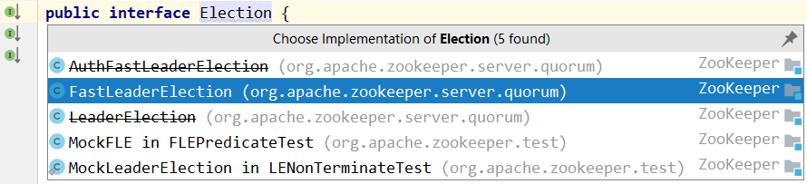

AuthFastLeaderElection，LeaderElection 其在 3.4.0 之后的版本中已经不建议使用。

**Election 源码分析**

```java
/**
 * 实现类：FastLeaderElection,其是标准的fast paxos算法的实现，基于TCP协议进行选举。
 */
public interface Election {
    // 表示寻找Leader
    public Vote lookForLeader() throws InterruptedException;
    //关闭服务端之间的连接
    public void shutdown();
}
```

说明：

选举的父接口为 Election，其定义了 lookForLeader 和 shutdown 两个方法。lookForLeader 表示寻找 Leader，shutdown 则表示关闭，如关闭服务端之间的连接。

# 4 源码分析之 Leader 选举（二）之 FastLeaderElection

刚刚介绍了 Leader 选举的总体框架，接着来学习 Zookeeper 中默认的选举策略，FastLeaderElection。

**FastLeaderElection 源码分析**

类的继承关系

```java
public class FastLeaderElection implements Election {}
```

说明：FastLeaderElection 实现了 Election 接口，重写了接口中定义的 lookForLeader 方法 和 shutdown 方法。

在源码分析之前，我们首先介绍几个概念：

- 外部投票：特指其他服务器发来的投票。
- 内部投票：服务器自身当前的投票。
- 选举轮次：Zookeeper 服务器 Leader 选举的轮次，即 logical clock（逻辑时钟）。
- PK：指对内部投票和外部投票进行一个对比来确定是否需要变更内部投票，选票管理。
- sendqueue：选票发送队列，用于保存待发送的选票。
- recvqueue：选票接收队列，用于保存接收到的外部投票。


**FastLeaderElection 基本结构**

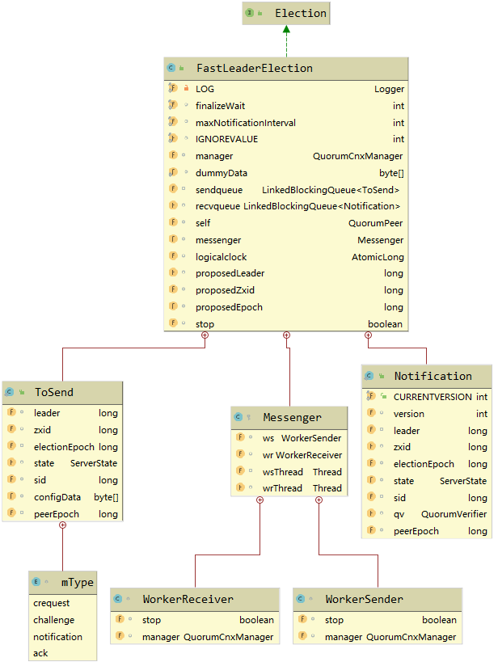


## 4.1 lookForLeader函数

当 Zookeeper 服务器检测到当前服务器状态变成 LOOKING 时，就会触发 Leader 选举，即调用 lookForLeader 方法来进行 Leader 选举。

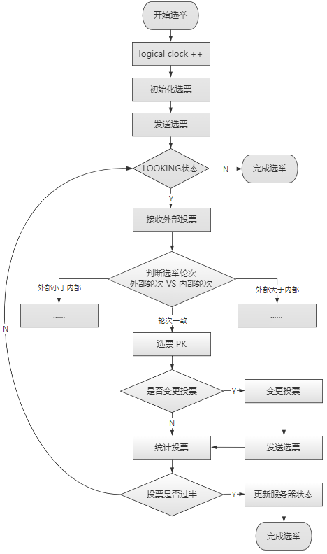

```java
public Vote lookForLeader() throws InterruptedException {    
        synchronized(this){
            // 首先会将逻辑时钟自增，每进行一轮新的 Leader 选举，都需要更新逻辑时钟
            logicalclock.incrementAndGet();
            // 更新选票（初始化选票）
            updateProposal(getInitId(), getInitLastLoggedZxid(), getPeerEpoch());
        }

        LOG.info("New election. My id =  " + self.getId() +
                 ", proposed zxid=0x" + Long.toHexString(proposedZxid));
        // 向其他服务器发送自己的选票（已更新的选票）
        sendNotifications();
```

之后每台服务器会不断地从 recvqueue 队列中获取外部投票。如果服务器发现无法获取到任何外部投票，就立即确认自己是否和集群中其他服务器保持着有效地连接，如果没有连接，则立马建立连接，如果已经建立了连接，则再次发送自己当前的内部投票，其流程如下：

```java
// 从 recvqueue 接收队列中取出投票
Notification n = recvqueue.poll(notTimeout, TimeUnit.MILLISECONDS);

/*
 * Sends more notifications if haven't received enough.
 * Otherwise processes new notification.
 */
if(n == null){ // 无法获取选票
    if(manager.haveDelivered()){ // manager 已经发送了所有选票消息（表示有连接）
        // 向所有其他服务器发送消息
        sendNotifications();
    } else { // 还未发送所有消息（表示无连接）
        // 连接其他每个服务器
        manager.connectAll();
    }

    /*
     * Exponential backoff
     */
    int tmpTimeOut = notTimeout*2;
    notTimeout = (tmpTimeOut < maxNotificationInterval?
                  tmpTimeOut : maxNotificationInterval);
    LOG.info("Notification time out: " + notTimeout);
} 
```

在发送完初始化选票之后，接着开始处理外部投票。在处理外部投票时，会根据选举轮次来进行不同的处理。

- **外部投票的选举轮次大于内部投票**。若服务器自身的选举轮次落后于该外部投票对应服务器的选举轮次，那么就会立即更新自己的选举轮次（logical clock），并且清空所有已经收到的投票，然后使用初始化的投票来进行 PK 以确定是否变更内部投票。最终再将内部投票发送出去。
- **外部投票的选举轮次小于内部投票**。若服务器接收的外部选票的选举轮次落后于自身的选举轮次，那么Zookeeper 就会直接忽略该外部投票，不做任何处理。
- **外部投票的选举轮次等于内部投票**。此时可以开始进行选票 PK，如果消息中的选票更优，则需要更新本服务器内部的选票，再发送给其他服务器。

之后再对选票进行归档操作，无论是否变更了投票，都会将刚刚收到的那份外部投票放入到选票集合 recvset 中进行归档，其中 recvset 用于记录当前服务器在本轮次的 Leader 选举中收到的所有外部投票，然后开始统计投票，**统计投票是为了统计集群中是否已经有过半的服务器认可了当前的内部投票**，如果确定已经有过半服务器认可了该投票，然后再进行最后一次确认，判断是否又有更优的选票产生，若无，则终止投票，然后最终的投票，其流程如下：

```java
						// If notification > current, replace and send messages out
                        if (n.electionEpoch > logicalclock.get()) { // 其选举周期大于逻辑时钟
                            // 重新赋值逻辑时钟
                            logicalclock.set(n.electionEpoch);
                            // 清空所有接收到的所有选票
                            recvset.clear();
                            if(totalOrderPredicate(n.leader, n.zxid, n.peerEpoch,
                                    getInitId(), getInitLastLoggedZxid(), getPeerEpoch())) { // 进行 PK，选出较优的服务器
                                // 更新选票
                                updateProposal(n.leader, n.zxid, n.peerEpoch);
                            } else { // 无法选出较优的服务器
                                // 更新选票
                                updateProposal(getInitId(),
                                        getInitLastLoggedZxid(),
                                        getPeerEpoch());
                            }
                            // 发送本服务器的内部选票消息
                            sendNotifications();
                        } else if (n.electionEpoch < logicalclock.get()) { // 选举周期小于逻辑时钟，不做处理，直接忽略
                            if(LOG.isDebugEnabled()){
                                LOG.debug("Notification election epoch is smaller than logicalclock. n.electionEpoch = 0x"
                                        + Long.toHexString(n.electionEpoch)
                                        + ", logicalclock=0x" + Long.toHexString(logicalclock.get()));
                            }
                            break;
                        } else if (totalOrderPredicate(n.leader, n.zxid, n.peerEpoch,
                                proposedLeader, proposedZxid, proposedEpoch)) { // PK，选出较优的服务器
                            // 更新选票
                            updateProposal(n.leader, n.zxid, n.peerEpoch);
                            // 发送消息
                            sendNotifications();
                        }

                        if(LOG.isDebugEnabled()){
                            LOG.debug("Adding vote: from=" + n.sid +
                                    ", proposed leader=" + n.leader +
                                    ", proposed zxid=0x" + Long.toHexString(n.zxid) +
                                    ", proposed election epoch=0x" + Long.toHexString(n.electionEpoch));
                        }

                        // recvset 用于记录当前服务器在本轮次的 Leader 选举中收到的所有外部投票
                        recvset.put(n.sid, new Vote(n.leader, n.zxid, n.electionEpoch, n.peerEpoch));

                        if (termPredicate(recvset,
                                new Vote(proposedLeader, proposedZxid,
                                        logicalclock.get(), proposedEpoch))) { // 若能选出 Leader

                            // Verify if there is any change in the proposed leader
                            while((n = recvqueue.poll(finalizeWait,
                                    TimeUnit.MILLISECONDS)) != null){ // 遍历已经接收到的投票集合
                                if(totalOrderPredicate(n.leader, n.zxid, n.peerEpoch,
                                        proposedLeader, proposedZxid, proposedEpoch)){ // 选票有变更，比之前提议的Leader有更好的选票加入
                                    // 将更优的选票放在 recvset 中
                                    recvqueue.put(n);
                                    break;
                                }
                            }

                            /*
                             * This predicate is true once we don't read any new
                             * relevant message from the reception queue
                             */
                            if (n == null) { // 表示之前提议的 Leader 已经是最优的
                                // 设置服务器状态
                                self.setPeerState((proposedLeader == self.getId()) ?
                                        ServerState.LEADING: learningState());

                                // 最终的选票
                                Vote endVote = new Vote(proposedLeader,
                                        proposedZxid, proposedEpoch);
                                // 清空 recvqueue 队列的选票
                                leaveInstance(endVote);
                                // 返回选票
                                return endVote;
                            }
                        }
```

1. 自增选举轮次。在FastLeaderElection 实现中，有一个 logical clock 属性，用于标识当前 Leader 的选举轮次，Zookeeper 规定了所有有效的投票都必须在同一轮次中。Zookeeper 在开始新一轮的投票时，会首先对 logical clock 进行自增操作。

2. 初始化选票。在开始进行新一轮的投票之前，每个服务器都会首先初始化自己的选票。在上图中已经讲过 Vote 数据结构，初始化选票也就是对 Vote 属性的初始化。在初始化阶段，每台服务器都会将自己推举为 Leader。

3. 发送初始化选票。在完成选票的初始化后，服务器就会发起第一次投票。Zookeeper 会将刚刚初始化好的选票放入 sendqueue 队列中，由发送器 WorkerSender 负责发送。

4. 接收外部投票。每台服务器都会不断从 recvqueue 队列中获取外部投票。如果服务器发现无法获取到任何外部投票，那么就会立即确认自己是否和集群中其他服务器保持着有效连接。如果发现没有建立连接，那么就会马上建立连接。如果已经建立的连接，那么就再次发送自己当前的内部投票。

5. 判断选举轮次。当发送完初始化选票之后，接下来就要开始处理外部投票了。在处理外部投票的时候，会根据选举轮次来进行不同的处理。

   - **外部投票的选举轮次大于内部投票**。如果服务器发现自己的选举轮次落后于该外部投票对应服务器的选举轮次，那么就会立即更新自己的选举轮次（logical clock），并且清空所有已经收到的投票，然后使用初始化的投票来进行 PK，以确定是否变更内部投票（关于 PK 的逻辑会在 步骤6 中讲解），最终再将内部投票发送出去。
   - **外部投票的选举轮次小于内部投票**。如果接收到的选票的选举轮次落后于服务器自身的，那么 Zookeeper 就会直接忽略该外部投票，不做任何处理，并返回步骤 4。
   - **外部投票的选举轮次等于内部投票**。这也是大多数投票的场景，如外部投票的选举轮次和内部投票一致的话，那么就开始进行选票 PK。总的来说，只有在同一个选举轮次的投票才是有效的投票。

6. 选票 PK。在步骤5 中提到，在收到来自其他服务器的有效的外部投票后，就要进行选票 PK 了 —— 也就是 FastLeaderElection#totalOrderPredicate 的方法的核心逻辑。选票 PK 的目的是为了确定当前是否需要变更投票，主要从选举轮次、ZXID 和 SID 三个因素来考虑。

   ```java
   /*
   		totalOrderPredicate 方法中的一段注释
            * We return true if one of the following three cases hold:
            * 1- New epoch is higher
            * 2- New epoch is the same as current epoch, but new zxid is higher
            * 3- New epoch is the same as current epoch, new zxid is the same
            *  as current zxid, but server id is higher.
            */
   return ((newEpoch > curEpoch) ||
                   ((newEpoch == curEpoch) &&
                   ((newZxid > curZxid) || ((newZxid == curZxid) && (newId > curId)))));
   ```

   - 如果外部投票中被推举的 Leader 服务器的选举轮次大于内部投票，那么就需要进行投票变更。
   - 如果选举轮次一致，那么就对比两者的 ZXID。如果外部投票的ZXID 大于内部投票，就需要进行投票变更。
   - 如果两者 ZXID 一致，就对比 SID。如果外部投票的 SID 大于 内部投票，就进行投票变更。

7. 变更投票。通过选票 PK 后，如果确定了外部投票优于内部投票（所谓的“优于”，是指外部投票所推举的服务器更适合成为 Leader），那么就进行投票变更 —— 使用外部投票的选票信息来覆盖内部投票。变更完成后，再次将这个变更后的内部投票发送出去。

8. 选票归档。无论是否进行了投票变更，都会将刚刚收到的那份外部投票放入 “选票集合” recvset 中进行归档。recvset 用于记录当前服务器在本轮次的 Leader 选举中收到的所有外部投票 —— 按照服务器对应的 SID 来区分，例如 ：{ (1,vote1),  (2,vote2), ... }。

9. 统计投票。完成了选票归档后，就可以开始停机投票了。统计投票的或称就是为例统计集群中是否已经有过半的服务器认可了当前的内部投票。如果确定已经有过半的服务器认可了该内部投票，则终止投票。否则返回步骤4。

10. 更新服务器状态。统计投票后，如果已经确定可以终止投票，那么就开始更新服务器状态。服务器会首先判断当前被过半服务器认可的投票对应的 Leader 服务器是否是自己，如果是自己，那么就将自己的服务器状态更新为 LEADING；如果不是，那么就根据实际情况来确定自己是 FOLLOWING 或是 OBSERVING。


以上 10 个步骤，就是 FastLeaderElection 选举算法的核心步骤，其中步骤 4 ~ 9 会经过几轮循环，直到 Leader 选举产生。另外还有一个细节需要注意，就是在完成步骤 9 之后，如果统计投票发现已经有过半的服务器认可了当前的选票，这个时候，Zookeeper 并不会立即进入步骤 10 来更新服务器状态，而是会等待一段时间（默认是 200 ms）来确定是否有新的更优的投票。


# 5 zookeeper 源码分子之集群模式服务端


