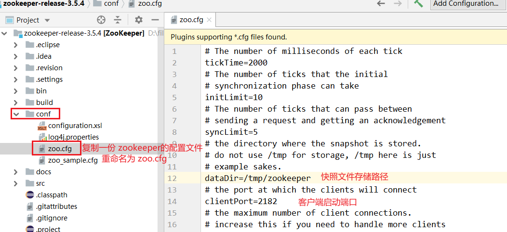

> 第六部分 Zookeeper源码分析

# 1 源码环境搭建

zk 源码下载地址：https://github.com/apache/zookeeper/tree/release-3.5.4

链接: https://pan.baidu.com/s/1DqqiNM0Ln-_y1lhIMaQd4g 提取码: kbnr 

> 注意：因为 zk 是由 ant 来构建的，所以需要使用 ant 命令来转换成工程，然后导入 idea（当前网盘提供的下载地址无需进行转换操作，下载完毕后直接导入idea即可）

## 1.1 idea 导入源码


## 1.2 关联相关 jar 包

注意：有两个路径下的 jar 都需要进行关联

- 路径1：build/lib
- 路径2：build/lib/test/lib

### 1.2.1 关联路径1相关jar包


### 1.2.2 关联路径2相关 jar 包


### 1.2.3 idea 关联 Ant 的 build.xml

要运行 Ant 需要有一个 build.xml，idea 关联下面 Ant 的 build.xml，点击 idea 右边菜单有个 Ant Build 小蚂蚁图标，点击后，再点击 +，将 build.xml 添加到 Ant Build


## 1.3 服务器端启动程序配置

### 1.3.1 复制配置文件 zoo.cfg，服务器端启动需要加载此配置文件

设置端口和快照文件存储路径



### 1.3.2 搜索启动类 QuorumPeerMain


### 1.3.3 配置服务端运行主类的启动参数

启动服务端运行主类 org.apache.zookeeper.server.quorum.QuorumPeerMain ，启动此类的 main 方法的时候需要通过 args 将 zoo.cfg 配置文件的完整路径进行传递，因此需要配置在 Program arguments。


参数一：在 Main class 配置，当前启动类

```bash
org.apache.zookeeper.server.quorum.QuorumPeerMain
```

参数二：VM options

```bash
-Dlog4j.configuration=file:D:/file/leaveDev/source_code_study/zookeeper_code/zookeeper_code/zookeeper-release-3.5.4/conf/log4j.properties
```

参数三：Program arguments

```bash
D:/file/leaveDev/source_code_study/zookeeper_code/zookeeper_code/zookeeper-release-3.5.4/conf/zoo.cfg
```

### 1.3.4 启动 zookeeper 服务器端


## 1.4 客户端启动程序配置

通过运行 ZookeeperServer 得到日志，可以得知 Zookeeper 服务端已经启动，服务的地址为 127.0.0.1:2181。接下来需要启动客户端来进行连接测试。

### 1.4.1 搜索启动类 ZookeeperMain

客户端的启动类为 org.apache.zookeeper.ZooKeeperMain


### 1.4.2 配置客户端运行主类的启动参数，进行如下配置


其中配置 -server 127.0.0.1:2181 get /lg ，即客户端连接 127.0.0.1:2181，获取节点 lg 的信息

### 1.4.3 启动运行客户端


# 2 zookeeper 源码分析之单机模式服务端启动

# 3 源码分析之 Leader 选举（一）

# 4 源码分析之 Leader 选举（二）之 FastLeaderElection

## 4.1 FastLeaderElection 源码分析

# 5 zookeeper 源码分子之集群模式服务端