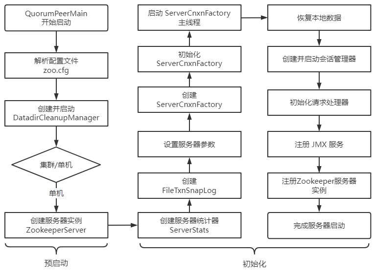

> 第六部分 Zookeeper源码分析

# 1 源码环境搭建

zk 源码下载地址：https://github.com/apache/zookeeper/tree/release-3.5.4

链接: https://pan.baidu.com/s/1DqqiNM0Ln-_y1lhIMaQd4g 提取码: kbnr 

> 注意：因为 zk 是由 ant 来构建的，所以需要使用 ant 命令来转换成工程，然后导入 idea（当前网盘提供的下载地址无需进行转换操作，下载完毕后直接导入idea即可）

## 1.1 idea 导入源码


## 1.2 关联相关 jar 包

注意：有两个路径下的 jar 都需要进行关联

- 路径1：build/lib
- 路径2：build/lib/test/lib

### 1.2.1 关联路径1相关jar包


### 1.2.2 关联路径2相关 jar 包


### 1.2.3 idea 关联 Ant 的 build.xml

要运行 Ant 需要有一个 build.xml，idea 关联下面 Ant 的 build.xml，点击 idea 右边菜单有个 Ant Build 小蚂蚁图标，点击后，再点击 +，将 build.xml 添加到 Ant Build


## 1.3 服务器端启动程序配置

### 1.3.1 复制配置文件 zoo.cfg，服务器端启动需要加载此配置文件

设置端口和快照文件存储路径


### 1.3.2 搜索启动类 QuorumPeerMain


### 1.3.3 配置服务端运行主类的启动参数

启动服务端运行主类 org.apache.zookeeper.server.quorum.QuorumPeerMain ，启动此类的 main 方法的时候需要通过 args 将 zoo.cfg 配置文件的完整路径进行传递，因此需要配置在 Program arguments。


参数一：在 Main class 配置，当前启动类

```bash
org.apache.zookeeper.server.quorum.QuorumPeerMain
```

参数二：VM options

```bash
-Dlog4j.configuration=file:D:/file/leaveDev/source_code_study/zookeeper_code/zookeeper_code/zookeeper-release-3.5.4/conf/log4j.properties
```

参数三：Program arguments

```bash
D:/file/leaveDev/source_code_study/zookeeper_code/zookeeper_code/zookeeper-release-3.5.4/conf/zoo.cfg
```

### 1.3.4 启动 zookeeper 服务器端


## 1.4 客户端启动程序配置

通过运行 ZookeeperServer 得到日志，可以得知 Zookeeper 服务端已经启动，服务的地址为 127.0.0.1:2181。接下来需要启动客户端来进行连接测试。

### 1.4.1 搜索启动类 ZookeeperMain

客户端的启动类为 org.apache.zookeeper.ZooKeeperMain


### 1.4.2 配置客户端运行主类的启动参数，进行如下配置


其中配置 -server 127.0.0.1:2181 get /lg ，即客户端连接 127.0.0.1:2181，获取节点 lg 的信息

### 1.4.3 启动运行客户端


# 2 zookeeper 源码分析之单机模式服务端启动

单机模式的 ZK 服务端逻辑写在 org.apache.zookeeper.server.ZooKeeperServerMain 类中，由里面的 main  函数启动，整个过程如下：



单机模式的委托启动类为：org.apache.zookeeper.server.ZooKeeperServerMain

**服务端启动过程**

看下 ZooKeeperServerMain 里面的 main 函数代码：

```java
public static void main(String[] args) {
    ZooKeeperServerMain main = new ZooKeeperServerMain();
    //解析配置启动zk
    main.initializeAndRun(args);
}
// 解析单机模式的配置对象，并启动单机模式
protected void initializeAndRun(String[] args)
    throws ConfigException, IOException, AdminServerException
{
    try {

        //注册jmx
        // JMX的全称为Java Management Extensions.是管理Java的一种扩展。
        // 这种机制可以方便的管理、监控正在运行中的Java程序。常用于管理线程，内存，日志Level，服务重启，系统环境等
        ManagedUtil.registerLog4jMBeans();
    } catch (JMException e) {
        LOG.warn("Unable to register log4j JMX control", e);
    }

    // 创建服务配置对象
    ServerConfig config = new ServerConfig();

    //如果入参只有一个，则认为是配置文件的路径
    if (args.length == 1) {
        // 解析配置文件
        config.parse(args[0]);
    } else {
        // 参数有多个，解析参数
        config.parse(args);
    }

    // 根据配置运行服务
    runFromConfig(config);
}

// 省略部分代码，只保留核心逻辑
public void runFromConfig(ServerConfig config)
            throws IOException, AdminServerException {
    LOG.info("Starting server");
    FileTxnSnapLog txnLog = null;
    try {
        //初始化日志文件
        txnLog = new FileTxnSnapLog(config.dataLogDir, config.dataDir);

        // 初始化zkServer对象
        final ZooKeeperServer zkServer = new ZooKeeperServer(txnLog,
                                                             config.tickTime, 
                                                             config.minSessionTimeout, 
                                                             config.maxSessionTimeout, null);

       // ....
        //---启动ZooKeeperServer
        //判断配置文件中 clientportAddress是否为null
        if (config.getClientPortAddress() != null) {
            //ServerCnxnFactory是Zookeeper中的重要组件,负责处理客户端与服务器的连接
            //初始化server端IO对象，默认是NIOServerCnxnFactory:Java原生NIO处理网络IO事件
            cnxnFactory = ServerCnxnFactory.createFactory();

            //初始化配置信息
            cnxnFactory.configure(config.getClientPortAddress(), config.getMaxClientCnxns(), false);

            //启动服务:此方法除了启动ServerCnxnFactory,还会启动ZooKeeper
            cnxnFactory.startup(zkServer);
            // zkServer has been started. So we don't need to start it again in secureCnxnFactory.
            needStartZKServer = false;
        }
        if (config.getSecureClientPortAddress() != null) {
            secureCnxnFactory = ServerCnxnFactory.createFactory();
            secureCnxnFactory.configure(config.getSecureClientPortAddress(), config.getMaxClientCnxns(), true);
            secureCnxnFactory.startup(zkServer, needStartZKServer);
        }

        // 定时清除容器节点
        //container ZNodes是3.6版本之后新增的节点类型，Container类型的节点会在它没有子节点时
        // 被删除（新创建的Container节点除外），该类就是用来周期性的进行检查清理工作
        containerManager = new ContainerManager(zkServer.getZKDatabase(), zkServer.firstProcessor,
                                                Integer.getInteger("znode.container.checkIntervalMs", (int) TimeUnit.MINUTES.toMillis(1)),
                                                Integer.getInteger("znode.container.maxPerMinute", 10000)
                                               );
        containerManager.start();

        //  省略关闭服务...
    } catch (InterruptedException e) {
        // warn, but generally this is ok
        LOG.warn("Server interrupted", e);
    } finally {
        if (txnLog != null) {
            txnLog.close();
        }
    }
}
```

小节：

zk 单机模式启动主要流程：

1. 注册 jmx
2. 解析 ServerConfig 配置对象
3. 根据配置对象，运行单机 zk 服务
4. 创建管理事务日志 和 快照 FileTxnSnapLog 对象，zookeeperServer 对象，并设置 zkServer 的 统计对象。
5. 设置 zk 服务钩子，原理是通过设置 CountDownLatch，调用 ZooKeeperServerShutdownHandler 的 handle 方法，可以将触发 shutdownLatch.await(); 方法继续执行，即调用 shutdown 关闭单机服务。
6. 基于 jetty 创建 zk 的 admin 服务
7. 创建连接对象 cnxnFactory 和 secureCnxnFactory（安全连接才创建该对象），用于处理客户端的请求。
8. 创建定时请吃容器节点管理器，用于处理容器节点下不存在子节点的清理容器节点工作等


可以看到关键点在于解析配置 和 启动两个方法，先来看下解析配置逻辑，对应上面的 configure 方法：

```java
public void configure(InetSocketAddress addr, int maxcc, boolean secure) throws IOException {
    if (secure) {
        throw new UnsupportedOperationException("SSL isn't supported in NIOServerCnxn");
    }

    configureSaslLogin();

    maxClientCnxns = maxcc;

    //会话超时时间
    sessionlessCnxnTimeout = Integer.getInteger(
        ZOOKEEPER_NIO_SESSIONLESS_CNXN_TIMEOUT, 10000);
    // We also use the sessionlessCnxnTimeout as expiring interval for
    // cnxnExpiryQueue. These don't need to be the same, but the expiring
    // interval passed into the ExpiryQueue() constructor below should be
    // less than or equal to the timeout.

    //过期队列
    cnxnExpiryQueue =
        new ExpiryQueue<NIOServerCnxn>(sessionlessCnxnTimeout);
    expirerThread = new ConnectionExpirerThread();

    //根据CPU个数计算selector线程的数量
    int numCores = Runtime.getRuntime().availableProcessors();
    // 32 cores sweet spot seems to be 4 selector threads
    numSelectorThreads = Integer.getInteger(
        ZOOKEEPER_NIO_NUM_SELECTOR_THREADS,
        Math.max((int) Math.sqrt((float) numCores/2), 1));
    if (numSelectorThreads < 1) {
        throw new IOException("numSelectorThreads must be at least 1");
    }

    //计算woker线程的数量
    numWorkerThreads = Integer.getInteger(
        ZOOKEEPER_NIO_NUM_WORKER_THREADS, 2 * numCores);

    //worker线程关闭时间
    workerShutdownTimeoutMS = Long.getLong(
        ZOOKEEPER_NIO_SHUTDOWN_TIMEOUT, 5000);

    LOG.info("Configuring NIO connection handler with "
             + (sessionlessCnxnTimeout/1000) + "s sessionless connection"
             + " timeout, " + numSelectorThreads + " selector thread(s), "
             + (numWorkerThreads > 0 ? numWorkerThreads : "no")
             + " worker threads, and "
             + (directBufferBytes == 0 ? "gathered writes." :
                ("" + (directBufferBytes/1024) + " kB direct buffers.")));

    //初始化selector线程
    for(int i=0; i<numSelectorThreads; ++i) {
        selectorThreads.add(new SelectorThread(i));
    }

    this.ss = ServerSocketChannel.open();
    ss.socket().setReuseAddress(true);
    LOG.info("binding to port " + addr);
    ss.socket().bind(addr);
    ss.configureBlocking(false);
    //初始化accept线程，这里看出accept线程只有一个，里面会注册监听ACCEPT事件
    acceptThread = new AcceptThread(ss, addr, selectorThreads);
}
```

再来看下启动逻辑：

```java
public void startup(ZooKeeperServer zkServer) throws IOException, InterruptedException {
    startup(zkServer, true);
}
// 启动分了好几块，一个一个看
@Override
public void startup(ZooKeeperServer zks, boolean startServer)
    throws IOException, InterruptedException {
    // 启动相关线程
    start();
    setZooKeeperServer(zks);

    //启动服务
    if (startServer) {
        // 加载数据到zkDataBase
        zks.startdata();
        // 启动定时清除session的管理器,注册jmx,添加请求处理器
        zks.startup();
    }
}

// 首先是 start 方法
public void start() {
    stopped = false;
    //初始化worker线程池
    if (workerPool == null) {
        workerPool = new WorkerService(
            "NIOWorker", numWorkerThreads, false);
    }

    //挨个启动Selector线程(处理客户端请求线程),
    for(SelectorThread thread : selectorThreads) {
        if (thread.getState() == Thread.State.NEW) {
            thread.start();
        }
    }
    // ensure thread is started once and only once
    //启动acceptThread线程(处理接收连接进行事件)
    if (acceptThread.getState() == Thread.State.NEW) {
        acceptThread.start();
    }

    // ExpirerThread（处理过期连接）
    if (expirerThread.getState() == Thread.State.NEW) {
        expirerThread.start();
    }
}

//初始化数据结构
public void startdata()
    throws IOException, InterruptedException {
    //初始化ZKDatabase，该数据结构用来保存ZK上面存储的所有数据
    //check to see if zkDb is not null
    if (zkDb == null) {
        //初始化数据数据，这里会加入一些原始节点，例如/zookeeper
        zkDb = new ZKDatabase(this.txnLogFactory);
    }
    //加载磁盘上已经存储的数据，如果有的话
    if (!zkDb.isInitialized()) {
        loadData();
    }
}
// 启动剩余项目 org.apache.zookeeper.server.ZooKeeperServer#startup
public synchronized void startup() {
    //初始化session追踪器
    if (sessionTracker == null) {
        createSessionTracker();
    }
    //启动session追踪器
    startSessionTracker();

    //建立请求处理链路
    setupRequestProcessors();

    //注册jmx
    registerJMX();

    setState(State.RUNNING);
    notifyAll();
}

//org.apache.zookeeper.server.ZooKeeperServer#setupRequestProcessors
/*
FinalRequestProcessor处理器### 作为处理器链上的最后一个处理器，负责执行请求的具体任务，前面几个处理器都是辅助操作，
PrepRequestProcessor为请求添加事务请求头和执行一些检查工作，
SyncRequestProcessor也仅仅是把该请求记录下来保存到事务日志中。
该请求的具体内容，如获取所有的子节点，创建node的这些具体的操作就是由FinalRequestProcessor来完成的
这里可以看出，单机模式下请求的处理链路为：
PrepRequestProcessor -> SyncRequestProcessor -> FinalRequestProcessor
*/
protected void setupRequestProcessors() {
    RequestProcessor finalProcessor = new FinalRequestProcessor(this);
    RequestProcessor syncProcessor = new SyncRequestProcessor(this,
                                                              finalProcessor);
    ((SyncRequestProcessor)syncProcessor).start();
    firstProcessor = new PrepRequestProcessor(this, syncProcessor);
    ((PrepRequestProcessor)firstProcessor).start();
}
```


# 3 源码分析之 Leader 选举（一）

# 4 源码分析之 Leader 选举（二）之 FastLeaderElection

## 4.1 FastLeaderElection 源码分析

# 5 zookeeper 源码分子之集群模式服务端