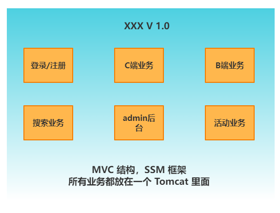
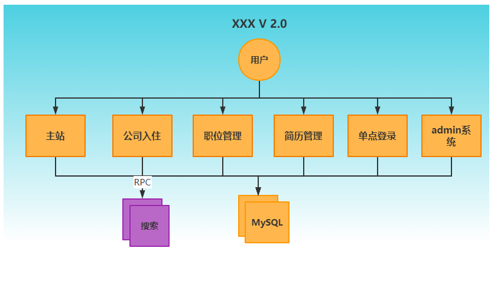

> 第一部分 项目架构演变过程

# 1 单体架构

单体架构所有模块和功能都集中在一个项目中，部署时也是将项目所有功能整体部署到服务器中。

- 优点
  - 小项目开发快，成本低
  - 架构简单
  - 易于测试
  - 易于部署
- 缺点
  - 大项目模块耦合严重，不易开发，维护，沟通成本高
  - 新增业务困难
  - 核心业务与边缘业务混合在一块，出现问题互相影响

# 2 垂直架构

根据业务把项目垂直切割成多个项目，因此这种架构称之为垂直架构。

为了避免上面提到的那些问题，我们开始做模块的垂直划分，做垂直划分的原则是基于项目的业务特性，核心目标。第一个是为了业务之间互不影响，第二个是在研发团队的壮大后为了提高效率，减少之间的依赖。

- 优点
  - 系统拆分实现流量分担，解决了并发问题
  - 可以针对不同系统进行优化
  - 方便水平扩展，负载均衡，容错率提高
  - 系统间相互独立，互不影响，新的业务迭代时更加高效
- 缺点
  - 服务系统之间接口调用硬编码
  - 搭建集群之后，实现负载均衡比较复杂
  - 服务系统接口调用监控不到位，调用方式不统一
  - 服务监控不到位
  - 数据库资源浪费，充斥慢查询，主从同步延迟大

# 3 分布式架构（SOA）

# 4 微服务架构