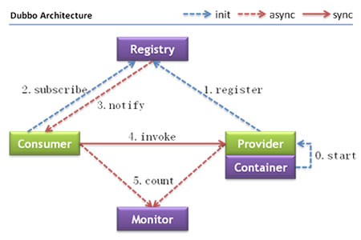

> 第二部分 Dubbo架构与实战

# 1 Dubbo 架构概述

## 1.1 什么是Dubbo

Apache Dubbo 是一款 RPC 服务开发框架，用于解决微服务架构下的服务治理与通信问题。

## 1.2 Dubbo 的特性

参考官网 [Dubbo 核心特性](https://dubbo.apache.org/zh/overview/what/overview/#dubbo-%E6%A0%B8%E5%BF%83%E7%89%B9%E6%80%A7)

## 1.3 Dubbo 的服务治理

服务治理（SOA governance），企业为了确保项目顺利完成二实施的过程，包括最佳实践，架构原则、治理规程、规律以及其他决定性的因素。服务治理指的是用来管理 SOA 的采用和实现的过程。

参考官网 [服务治理](https://dubbo.apache.org/zh/docs/v2.7/user/preface/requirements/)


# 2 Dubbo 处理流程



节点角色说明：

| 节点      | 角色名称                                 |
| --------- | ---------------------------------------- |
| Provide   | 暴露服务的服务提供方                     |
| Consumer  | 调用远程服务的服务消费方                 |
| Registry  | 服务注册与发现的注册中心                 |
| Monitor   | 统计服务的调用次数 和 调用时间的监控中心 |
| Container | 服务运行容器                             |

**调用关系说明**

0. 服务容器负责启动，加载，运行服务提供者。
1. 服务提供者在启动时，向注册中心注册自己提供的服务。
2. 服务消费者在启动时，向注册中心订阅自己所需的服务。
3. 注册中心返回服务提供者地址列表给消费者，如有变更，注册中心将基于长连接推送变更数据给消费者。
4. 服务消费者，从提供者地址列表中，基于软负载均衡算法，选一台提供者进行调用，如果调用失败，再选另一台调用。
5. 服务消费者和提供者，在内存中累计调用次数和调用时间，定时每分钟发送一次统计数据到监控中心。

# 3 服务注册中心 Zookeeper

通过前面的 Dubbo 架构图可以看到，Registry（服务注册中心）在其中起着至关重要的作用。Dubbo 官方推荐使用 Zookeeper 作为服务注册中心。Zookeeper 是 Apache Hadoop 的子项目，作为 Dubbo 服务注册中心，工业强度较高，可用于生产环境，推荐使用。

# 4 Dubbo 开发实战

## 4.1 实战案例介绍

在 Dubbo 中所有的服务调用都是基于接口去进行双方交互的。双方协定好 Dubbo 调用的中接口，提供者来提供实现类 并且 注册到注册中心上。

调用方则只需要引入该接口，并且同样注册到相同的注册中心上（消费者订阅）。即可利用注册中心来实现集群感知功能，之后消费者即可对提供者进行调用。

我们所有的项目都是基于 Maven 进行创建，这样相互在引用的时候只需要以依赖的形式进行扩展就可以了。

并且会通过 maven 的父工程来统一依赖的版本。

程序实现分为以下几个步骤：

1. 建立 Maven 工程 并且创建 API 模块；用于规范双方接口协定。
2. 提供 provider 模块，引入 API 模块，并且对其中的服务进行实现，将其注册到注册中心上，对外来统一提供服务。
3. 提供 consumer 模块，引入 API 模块，并且引入与提供者相同的注册中心，再进行服务调用。

## 4.2 开发过程

官网参考 [以注解配置的方式来配置你的 Dubbo 应用](https://dubbo.apache.org/zh/docsv2.7/user/configuration/annotation/) 示例中使用的 dubbo 版本：`2.7.3`


### 4.2.1 接口协定

1. 定义 maven

   ```xml
   <parent>
       <artifactId>demo-base</artifactId>
       <groupId>com.turbo</groupId>
       <version>1.0-SNAPSHOT</version>
   </parent>
   <modelVersion>4.0.0</modelVersion>
   
   <artifactId>service-api</artifactId>
   ```

2. 定义接口，这里为了方便，知识写一个基本的方法

   ```java
   package com.turbo.service;
   
   public interface HelloService {
   
       String sayHello(String name);
   }
   ```

   

### 4.2.2 创建接口提供者

1. 引入 API 模块

   ```xml
   <dependency>
       <groupId>com.turbo</groupId>
       <artifactId>service-api</artifactId>
       <version>1.0-SNAPSHOT</version>
   </dependency>
   ```

2. 引入Dubbo相关依赖，这里使用注解方式

   ```xml
   <dependency>
       <groupId>org.apache.dubbo</groupId>
       <artifactId>dubbo</artifactId>
   </dependency>
   <dependency>
       <groupId>org.apache.dubbo</groupId>
       <artifactId>dubbo-registry-zookeeper</artifactId>
   </dependency>
   <dependency>
       <groupId>org.apache.dubbo</groupId>
       <artifactId>dubbo-rpc-dubbo</artifactId>
   </dependency>
   <dependency>
       <groupId>org.apache.dubbo</groupId>
       <artifactId>dubbo-remoting-netty4</artifactId>
   </dependency>
   <dependency>
       <groupId>org.apache.dubbo</groupId>
       <artifactId>dubbo-serialization-hessian2</artifactId>
   </dependency>
   ```

3. 编写实现类。注意这里也是用了 Dubbo 中的 `@Service` 注解来声明它是一个服务的提供者。

   ```java
   package com.turbo.service.impl;
   
   import com.turbo.service.HelloService;
   import org.apache.dubbo.config.annotation.Service;
   
   /**
    * @author yutao
    */
   @Service
   public class HelloServiceImpl implements HelloService {
       @Override
       public String sayHello(String name) {
           return "Hello:"+name;
       }
   }
   ```

4. 编写配置文件，用于配置 dubbo。比如这里叫 `dubbo-provider.properties`，放到 `resources` 目录下：

   ```properties
   dubbo.application.name=service-provider
   dubbo.protocol.name=dubbo
   dubbo.protocol.port=20880
   ```

   - dubbo.application.name ：当前提供者的名称。
   - dubbo.protocol.name：对外提供的时候使用的协议。
   - dubbo.protocol.port：该服务对外暴露的端口是什么，在消费者使用时，则会使用这个端口并且使用指定的协议与提供者建立连接。

5. 编写启动的 `main` 函数。

   ```java
   package com.turbo;
   
   import org.apache.dubbo.config.RegistryConfig;
   import org.apache.dubbo.config.spring.context.annotation.EnableDubbo;
   import org.springframework.context.annotation.AnnotationConfigApplicationContext;
   import org.springframework.context.annotation.Bean;
   import org.springframework.context.annotation.Configuration;
   import org.springframework.context.annotation.PropertySource;
   
   import java.io.IOException;
   
   /**
    * @author yutao
    */
   public class DubboPureMain {
   
       public static void main(String[] args) throws IOException {
           AnnotationConfigApplicationContext context = new AnnotationConfigApplicationContext(ProviderConfiguration.class);
           context.start();
           System.in.read();
       }
   
       /**
        * 服务提供者的配置类
        */
       @Configuration
       @EnableDubbo(scanBasePackages = "com.turbo.service.impl")
       @PropertySource("classpath:/dubbo-provider.properties")
       static class ProviderConfiguration{
           @Bean
           public RegistryConfig registryConfig(){
               RegistryConfig registryConfig = new RegistryConfig();
               registryConfig.setAddress("zookeeper://152.136.177.192:2181");
               return registryConfig;
           }
       }
   }
   ```

   

### 4.2.3 创建消费者

1. 引入 API 模块

   ```xml
   <dependency>
       <groupId>com.turbo</groupId>
       <artifactId>service-api</artifactId>
       <version>1.0-SNAPSHOT</version>
   </dependency>
   ```

2. 引入 Dubbo 依赖，同服务提供者。

3. 编写服务，用于真实的引用 dubbo 接口并使用。这里面 `@Reference` 所指向的就是真实的第三方服务接口。

   ```java
   package com.turbo.bean;
   
   import com.turbo.service.HelloService;
   import org.apache.dubbo.config.annotation.Reference;
   import org.springframework.stereotype.Component;
   
   /**
    * @author yutao
    */
   @Component
   public class ConsumerComponet {
   
       /**
        * 引用dubbo的组件  @Reference
        */
       @Reference
       private HelloService helloService;
   
       public String sayHello(String name){
           return helloService.sayHello(name);
       }
   }
   ```

4. 编写消费者的配置文件。这里比较简单，主要就是指定了当前消费者的名称和注册中心的地址。通过这个注册中心地址，消费者就会注册到这里并且也可以根据这个注册中心找到真正的服务提供者列表。

   ```properties
   dubbo.application.name=service-consumer
   dubbo.registry.address=zookeeper://152.136.177.192:2181
   ```

5. 编写启动类，用户在控制台输入一次换行后，则会发起一次请求。

   ```java
   package com.turbo;
   
   import com.turbo.bean.ConsumerComponet;
   import org.apache.dubbo.config.spring.context.annotation.EnableDubbo;
   import org.springframework.context.annotation.AnnotationConfigApplicationContext;
   import org.springframework.context.annotation.ComponentScan;
   import org.springframework.context.annotation.Configuration;
   import org.springframework.context.annotation.PropertySource;
   
   import java.io.IOException;
   
   public class AnnotationConsumerMain {
   
       public static void main(String[] args) throws IOException {
           AnnotationConfigApplicationContext context = new AnnotationConfigApplicationContext(ConsumerConfiguration.class);
           context.start();
           // 获取消费者组件
           ConsumerComponet service = context.getBean(ConsumerComponet.class);
           while (true){
               System.in.read();
               try{
                   String world = service.sayHello("world");
                   System.out.println("result:"+world);
               }catch (Exception e){
                   e.printStackTrace();
               }
   
           }
       }
   
       /**
        *
        */
       @Configuration
       @EnableDubbo
       @PropertySource("classpath:/dubbo-consumer.properties")
       @ComponentScan(basePackages = {"com.turbo.bean"})
       static class ConsumerConfiguration{
   
       }
   }
   ```


### 4.2.4 QOS 概述

启动 服务提供者，然后启动服务消费者，消费者报错。


错误提示 Qos 22222 端口已经被占用。

参考官网 [QoS 参数配置](https://dubbo.apache.org/zh/docs3-v2/java-sdk/reference-manual/qos/overview/)

使用系统属性方式配置，在服务端或消费端（主要是避免服务端和消费端 Qos 端口冲突）


`telnet localhost 22222(qos.port)`


## 4.3 配置方式介绍

[配置方式](https://dubbo.apache.org/zh/docs3-v2/java-sdk/reference-manual/config/overview/#配置方式)

可以使用不用的方式来对 Dubbo 进行配置。每种配置方式各有不同，一般分为以下几种：

1. 注解：基于注解可以快速的将程速配置，无需多余的配置信息，包含提供者和消费者。但是这种方式有一个弊端，有时候配置信息并不是特别好找，无法快速定位。
2. XML：一般这种方式会和 Spring 做结合，相关的 Service 和 Reference 均使用 Dubbo 中的注解。通过这样的方式可以很方便的通过几个文件进行管理整个集群配置。可以快速定位 也可以快速更改。
3. 基于代码方式：基于代码方式的进行配置。使用比较少，适用于自己公司对其框架与 Dubbo 做深度集成时才会使用。

## 4.4 XML 方式

一般 XML 会结合 Spring 应用进行使用，将 Service 的注册和引用方式都交给 Spring 去管理。

这里对于 API 模块不做处理，还是使用原先的接口。

[官网参考 快速开始](https://dubbo.apache.org/zh/docs/v2.7/user/quick-start/)

[XML 配置](https://dubbo.apache.org/zh/docsv2.7/user/configuration/xml/)

### 4.4.1 provider 模块

1. 引入 API 依赖

   ```xml
   <dependency>
       <groupId>com.turbo</groupId>
       <artifactId>service-api</artifactId>
       <version>1.0-SNAPSHOT</version>
   </dependency>
   ```

2. 引入 dubbo 依赖。与之前不同点在于，最后多了 spring 的依赖引入。

   ```xml
   <dependency>
       <groupId>org.apache.dubbo</groupId>
       <artifactId>dubbo</artifactId>
   </dependency>
   <dependency>
       <groupId>org.apache.dubbo</groupId>
       <artifactId>dubbo-registry-zookeeper</artifactId>
   </dependency>
   <dependency>
       <groupId>org.apache.dubbo</groupId>
       <artifactId>dubbo-rpc-dubbo</artifactId>
   </dependency>
   <dependency>
       <groupId>org.apache.dubbo</groupId>
       <artifactId>dubbo-remoting-netty4</artifactId>
   </dependency>
   <dependency>
       <groupId>org.apache.dubbo</groupId>
       <artifactId>dubbo-serialization-hessian2</artifactId>
   </dependency>
   <dependency>
       <groupId>org.apache.dubbo</groupId>
       <artifactId>dubbo-config-spring</artifactId>
   </dependency>
   ```

3. 编写实体类，不需要引入任何的注解配置

   ```java
   package com.turbo.service.impl;
   
   import com.turbo.service.HelloService;
   
   public class HelloServiceImpl implements HelloService {
       @Override
       public String sayHello(String name) {
           return "hello:"+name;
       }
   }
   ```

4. 编写 dubbo-provider.xml 文件，用于对 dubbo 进行文件统一配置。并且对刚才的配置进行引入。

   ```xml
   <beans xmlns:xsi="http://www.w3.org/2001/XMLSchema-instance"
          xmlns:dubbo="http://dubbo.apache.org/schema/dubbo"
          xmlns="http://www.springframework.org/schema/beans"
          xsi:schemaLocation="http://www.springframework.org/schema/beans http://www.springframework.org/schema/beans/spring-beans.xsd
          http://dubbo.apache.org/schema/dubbo http://dubbo.apache.org/schema/dubbo/dubbo.xsd">
   
       <!--提供方应用信息-->
       <dubbo:application name="service-provider" owner="turbo">
           <dubbo:parameter key="qos.enable" value="true"/>
           <dubbo:parameter key="qos.accept.foreign.ip" value="false"/>
           <dubbo:parameter key="qos.port" value="33333"/>
       </dubbo:application>
   
       <!--使用zookeeper注册中心暴露服务地址-->
       <dubbo:registry address="zookeeper://152.136.177.192:2181?timeout=600000" />
   
       <!--用dubbo协议在20880端口暴露服务-->
       <dubbo:protocol name="dubbo" port="20880"/>
   
       <!--声明需要暴露的服务接口-->
       <dubbo:service interface="com.turbo.service.HelloService" ref="helloService"/>
   
       <!--和本地bean一样实现服务-->
       <bean id="helloService" class="com.turbo.service.impl.HelloServiceImpl"/>
   
   </beans>
   ```

5. 编写模块启动类

   ```java
   package com.turbo;
   
   import org.springframework.context.support.ClassPathXmlApplicationContext;
   
   import java.io.IOException;
   
   /**
    * @author yutao
    */
   public class ProviderApplication {
   
       public static void main(String[] args) throws IOException {
           ClassPathXmlApplicationContext context = new ClassPathXmlApplicationContext("classpath:/dubbo-provider.xml");
           context.start();
           System.in.read(); // 按任意键退出
       }
   }
   ```


### 4.4.2 consumer 模块

1. 引入 API 模块

   ```xml
   <dependency>
       <groupId>com.turbo</groupId>
       <artifactId>service-api</artifactId>
       <version>1.0-SNAPSHOT</version>
   </dependency>
   ```

2. 引入 dubbo 相关

   ```xml
   <dependency>
       <groupId>org.apache.dubbo</groupId>
       <artifactId>dubbo</artifactId>
   </dependency>
   <dependency>
       <groupId>org.apache.dubbo</groupId>
       <artifactId>dubbo-registry-zookeeper</artifactId>
   </dependency>
   <dependency>
       <groupId>org.apache.dubbo</groupId>
       <artifactId>dubbo-registry-nacos</artifactId>
   </dependency>
   <dependency>
       <groupId>org.apache.dubbo</groupId>
       <artifactId>dubbo-rpc-dubbo</artifactId>
   </dependency>
   <dependency>
       <groupId>org.apache.dubbo</groupId>
       <artifactId>dubbo-remoting-netty4</artifactId>
   </dependency>
   <dependency>
       <groupId>org.apache.dubbo</groupId>
       <artifactId>dubbo-serialization-hessian2</artifactId>
   </dependency>
   <dependency>
       <groupId>org.apache.dubbo</groupId>
       <artifactId>dubbo-config-spring</artifactId>
   </dependency>
   ```

3. 定义 spring 配置的 xml

   ```xml
   <?xml version="1.0" encoding="UTF-8"?>
   <beans xmlns="http://www.springframework.org/schema/beans"
          xmlns:xsi="http://www.w3.org/2001/XMLSchema-instance"
          xmlns:dubbo="http://dubbo.apache.org/schema/dubbo"
          xsi:schemaLocation="http://www.springframework.org/schema/beans        http://www.springframework.org/schema/beans/spring-beans-4.3.xsd        http://dubbo.apache.org/schema/dubbo        http://dubbo.apache.org/schema/dubbo/dubbo.xsd">
   
       <!-- 消费方应用名，用于计算依赖关系，不是匹配条件，不要与提供方一样 -->
       <dubbo:application name="service-consumer"/>
   
       <!-- 使用zookeeper广播注册中心暴露发现服务地址 -->
       <dubbo:registry address="zookeeper://152.136.177.192:2181?timeout=600000"/>
   
       <!-- 生成远程服务代理，可以和本地bean一样使用helloService -->
       <dubbo:reference id="helloService" interface="com.turbo.service.HelloService"/>
   </beans>
   ```

4. 引入启动模块。因为引入了 Spring 框架，所以在上一步的 helloService 会被当做一个 bean 注入到真实环境中。在我们生产级别使用的时候，可以通过 Spring 中的包扫描机制，通过 `@Autowired` 这种机制来进行依赖注入。

   ```java
   package com.turbo;
   
   import com.turbo.service.HelloService;
   import org.springframework.context.support.ClassPathXmlApplicationContext;
   
   import java.io.IOException;
   
   public class ConsumerApplication {
       public static void main(String[] args) throws IOException {
           ClassPathXmlApplicationContext context = new ClassPathXmlApplicationContext("classpath:/dubbo-consumer.xml");
           //context.start();
           // 获取远程服务代理
           HelloService helloService = (HelloService) context.getBean("helloService");
           while (true){
               System.in.read();
               // 执行远程方法
               String hello = helloService.sayHello("world");
               // 显示调用结果
               System.out.println(hello);
           }
       }
   }
   
   ```

   

# 5 Dubbo 管理控制台

## 5.1 作用

主要包含：服务治理、路由规则、动态配置、服务降级、访问控制、权重调整、负载均衡等管理功能。

如我们在开发的时候，需要知道Zookeeper 注册中心都注册了哪些服务，有哪些消费者来消费这些服务。我们可以通过部署一个管理中心来实现。其实管理中心就是一个 web 应用，原来是 war（2.6 版本以前）包需要部署到 tomcat 中。现在是 jar 包可以直接通过 java 命令运行。

## 5.2 控制台安装步骤

[dubbo-admin](https://github.com/apache/dubbo-admin/tree/master-0.2.0)

1. 从github中下载项目。

2. 修改 dubbo-admin\src\main\resources\application.properties 文件。修改其中的 dubbo 的 注册中心地址。

3. 切换到 dubbo-admin 项目所在路径，使用 mvn 打包

   `mvn clean package -Dmaven.test.skip=test`

4. java 命令运行 `cd dubbo-admin\target`  `java -jar dubbo-admin-0.0.1-SNAPSHOT.jar`

## 5.3 使用控制台

1. 输入 http://ip:端口
2. 输入用户名 root，密码 root
3. 点击菜单查看服务提供者和服务消费者信息


# 6 Dubbo配置项说明

[Dubbo 的 XML Schema 配置参考手册](https://dubbo.apache.org/zh/docs/v2.7/user/references/xml/)

## 6.1 dubbo:application

[application 2.7](https://dubbo.apache.org/zh/docs/v2.7/user/references/xml/dubbo-application/)

[application 3.0](https://dubbo.apache.org/zh/docs3-v2/java-sdk/reference-manual/config/properties/#application)

每个应用必须要有一个且只有一个 application 配置，对应的配置类：`org.apache.dubbo.config.ApplicationConfig`

1. name：当前应用程序的名称，在 `dubbo-admin` 中可以看到，这个代表这个应用名称。在真正使用时 也会根据这个参数来进行聚合应用请求。
2. owner：当前应用程序的负责人，可以通过这个负责人找到其相关的应用列表，用于快速定位到责任人。
3. qosEnable：是否启动QoS，more true
4. qosPort：启动 QoS绑定的端口，默认 22222
5. qosAcceptForeignIp：安全配置，是否接收除 localhost 本机访问之外的外部请求。


## 6.2 dubbo:registry

注册中心配置。对应的配置类：`org.apache.dubbo.config.RegistryConfig`。如果同时有多个注册中心，可以声明多个 `<dubbo:regisrty>` 标签，并在 `<dubbo:service>` 或 `<dubbo:reference>` 的 `registry` 属性指定使用的注册中心。

1. id：如果当前服务中 provider 或者 consumer 中存在多个注册中心时，则使用时需要增加该配置。在一些公司，会通过业务线的不同选择不同的注册中心，所以一般都会配置该值。
2. address：当前注册中心的访问地址。
3. protocol：当前注册中心所使用的协议是什么。也可以直接在 `address` 中写入，比如使用 zookeeper，就可以写成 `zookeeper://xx.xx.xx.xx:2181`
4. timeout：当于注册中心不在同一个机房时，大多会把该参数延长。


## 6.3 dubbo:protocol

指定服务在进行数据传输所使用的协议。对应的配置类：`org.apache.dubbo.config.ProtocolConfig`。同时，如果需要支持多协议，可以声明多个 `<dubbo:protocol>` 标签，并在 `<dubbo:service>` 中通过 `protocol` 属性指定使用的协议。

1. id：在大公司，可能因为各个部门技术栈不同，所以可能会选择使用不同的协议进行交互。这里在多喝协议使用时，需要指定。
2. name：指定协议名称。默认使用 `dubbo`。


## 6.4 dubbo:service

**服务提供者暴露的服务配置**，对应的配置类：`org.apache.dubbo.config.ServiceConfig`

1. interface：指定当前需要进行对外暴露的接口是什么。
2. ref：具体实现对象的引用，一般在生产级别都是使用 Spring 去进行 Bean 托管，所以这里一般也指的是 Spring 中的 BeanId。
3. version：对外暴露的版本号。不同的版本号，消费者在消费的时候只会根据固定的版本号进行消费。

## 6.5 dubbo:reference

服务消费者引用服务配置。对应的配置类：`org.apache.dubbo.config.ReferenceConfig`

1. id：指定该 Bean 在注册到 Spring 中的 id。
2. interface：服务接口名。
3. version：指定当前服务版本，与服务提供者的版本一致。
4. registry：指定具体使用的注册中心地址，多个注册中心ID用逗号分隔。这里面也就是使用上面在 `<dubbo:registry>` 中所声明的 id。

## 6.6 dubbo:method

方法级配置。对应的配置类：`org.apache.dubbo.config.ReferenceConfig`。同时该标签为：`<dubbo:service>` 或 `<dubbo:reference>` 的子标签，用于控制到方法级。

1. name：指定方法名称，用于对这个方法名称的 RPC 调用进行特殊配置。
2. async：是否异步，默认 false。

## 6.7 dubbo:service 和 dubbo:reference 详解

这两个在 dubbo 中是我们最常用的部分，其中有一些我们必然会接触到的属性。并且这里讲到一些设置上的使用方案。

1. mock：用于在方法调用出现错误时，当做服务降级来统一对外返回结果。

   ```xml
    <!-- 生成远程服务代理，可以和本地bean一样使用helloService -->
       <dubbo:reference id="helloService" interface="com.turbo.service.HelloService" mock="true" />
   ```

   在消费端增加 `HelloServiceMock` （HelloService 的实现类）

   ```java
   public class HelloServiceMock implements HelloService {
       @Override
       public String sayHello(String name) {
           return "hello mock";
       }
   }
   ```

   

   结果

   

2. timeout：用于指定当前方法 或者 接口中所有方法的超时时间。一般都会根据提供者的时长来具体规定。比如我们在进行第三方服务依赖时可能会对接口的时长做放宽，防止第三方服务不稳定导致服务受损。

   ```xml
   <dubbo:consumer timeout="2000" check="false"/> <!--dubbo:consumer 中的 timeout 优先级更高-->
   <!-- 生成远程服务代理，可以和本地bean一样使用helloService -->
   <dubbo:reference id="helloService" interface="com.turbo.service.HelloService" timeout="2000" />
   ```

   

3. check：用于在启动时，检查生产者时候有该服务。我们一般都会将这个值设置为 false，不让其进行检查。因为如果出现模块之间循环引用的化，那么可能会出现相互依赖，都进行 check 的话，那么这两个服务永远也启动不起来。

   ```xml
   <dubbo:consumer timeout="2000" check="true"/> <!--先启动consumer，启动时会报错-->
   ```

   

   

   consumer可以先正常启动，在不远程调用方法之前

   ```xml
   <dubbo:consumer timeout="2000" check="false"/>
   ```

   

   

4. retries：用于指定当前服务在执行时出现错误或者超时的重试机制。

   - 注意提供者是否有**幂等**，否则可能出现数据一致性问题。
   - 注意提供者是否有类似缓存机制，如果出现大面积错误，可能因为不停重试导致雪崩。

   ```xml
   <!-- 生成远程服务代理，可以和本地bean一样使用helloService -->
   <dubbo:reference id="helloService" interface="com.turbo.service.HelloService" timeout="2000" retries="2" mock="true" />
   ```

   

5. executes：用户在提供者做配置，来确保最大的并行度。

   - 可能导致集群无法充分利用或者阻塞
   - 但是也可以启动部分对应用的保护功能
   - 可以不做配置，结合后面熔断限流使用

## 6.8 其他配置 

[Dubbo 的 XML Schema 配置参考手册](https://dubbo.apache.org/zh/docs/v2.7/user/references/xml/)