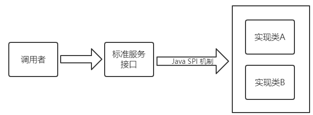
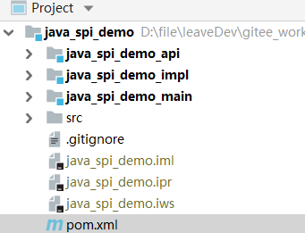
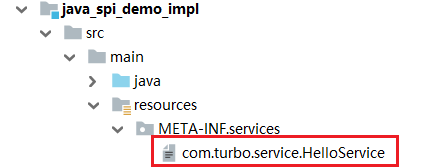
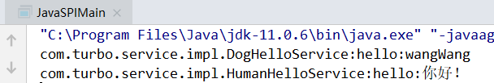
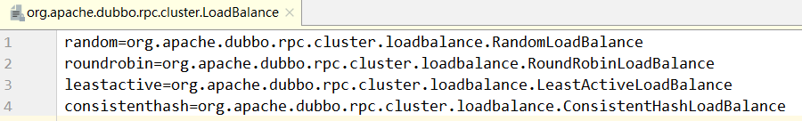
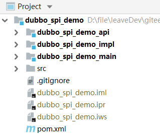

> 第三部分 Dubbo高级实战

# 1 SPI

## 1.1 SPI 简介

SPI 全称（Service Provider Interface），是 JDK 内置的一种服务提供发现机制。目前有不少框架用它来做服务的扩展发现。简单说，它就是一种动态替换发现机制。使用 SPI 机制的优势是实现解耦，使得第三方服务模块的装配控制逻辑与调用者的业务代码分离。

## 1.2 JDK 中的 SPI



Java 中如给想要使用 SPI 功能，先提供标准服务接口，然后再提供相关接口实现和调用者。这样就可以通过 SPI 机制中约定好的信息进行查询相应的接口实现。

SPI 遵循如下约定：

1. 当服务者提供了接口的一种具体实现后，在 META-INF/services 目录下创建一个以 ”接口全限定名“ 为命名的文件，内容为实现类的全限定名。
2. 接口实现类所在的 jar 包放在主程序的 classpath 中。
3. 主程序通过 java.util.ServiceLoader 动态装载实现模块，它通过扫描 META-INF/services 目录下的配置文件找到实现类的全限定名，把类加载到 JVM。
4. SPI 的实现类必须携带一个无参构造方法。

### 1.2.1 JDK SPI demo

使用 maven 父工程统一管理。包括三个模块：API、impl、main。[源码地址](https://gitee.com/turboYuu/dubbo/tree/master/lab/spi/java_spi_demo)



#### 1.2.1.1 API 模块

1. 定义 maven

   ```xml
    <parent>
        <artifactId>java_spi_demo</artifactId>
        <groupId>com.turbo</groupId>
        <version>1.0-SNAPSHOT</version>
   </parent>
   <modelVersion>4.0.0</modelVersion>
   
   <artifactId>java_spi_demo_api</artifactId>
   ```

2. 定义接口，只是写一个基本的方法

   ```java
   package com.turbo.service;
   
   public interface HelloService {
       String sayHello();
   }
   ```


#### 1.2.1.2 创建接口实现者

1. 引入 API 模块

   ```xml
   <dependency>
       <groupId>com.turbo</groupId>
       <artifactId>java_spi_demo_api</artifactId>
       <version>1.0-SNAPSHOT</version>
   </dependency>
   ```

2. 编写实现类

   ```java
   package com.turbo.service.impl;
   
   import com.turbo.service.HelloService;
   
   public class HumanHelloService implements HelloService {
       public String sayHello() {
           return "hello:你好！";
       }
   }
   ```

   ```java
   public class DogHelloService implements HelloService {
       public String sayHello() {
           return "hello:wangWang";
       }
   }
   ```

3. 在 META-INF/services 下创建文件

   

   文件名为 接口的全限定名，内容为 实现类的全限定名。

   ```xml
   com.turbo.service.impl.DogHelloService
   com.turbo.service.impl.HumanHelloService
   ```


#### 1.2.1.3 main 使用模块

1. 引入 API、impl 模块

   ```xml
   <dependency>
               <groupId>com.turbo</groupId>
               <artifactId>java_spi_demo_api</artifactId>
               <version>1.0-SNAPSHOT</version>
           </dependency>
           <dependency>
               <groupId>com.turbo</groupId>
               <artifactId>java_spi_demo_impl</artifactId>
               <version>1.0-SNAPSHOT</version>
           </dependency>
   ```

2. 测试

   ```java
   package com.turbo.test;
   
   import com.turbo.service.HelloService;
   import java.util.ServiceLoader;
   
   public class JavaSPIMain {
   
       public static void main(String[] args) {
           final ServiceLoader<HelloService> helloServices = ServiceLoader.load(HelloService.class);
           for(HelloService helloService:helloServices){
               System.out.println(helloService.getClass().getName()+":"+helloService.sayHello());
           }
       }
   }
   
   ```

结果：




## 1.3 Dubbo 中的 SPI

dubbo 中大量使用了 SPI 来作为扩展点，通过实现同一接口的前提下，可以进行定制自己的实现类。比如比较常见的协议，负载均衡，都可以通过 SPI 的方式进行定制化，自己扩展。

Dubbo 中已经存在的所有已经实现好的扩展点：


下图中则是 Dubbo 中默认提供的负载均衡策略：



### 1.3.1 dubbo 自己做 SPI 的目的

[官网参考](https://dubbo.apache.org/zh/docs/v2.7/dev/spi/#%E6%89%A9%E5%B1%95%E7%82%B9%E9%85%8D%E7%BD%AE)

1. JDK 标准的 SPI 会一次性实例化扩展点所有实例，如果有扩展实现初始化很耗时，结果没有用上也加载，会很浪费资源。
2. 如果有扩展点加载失败，则所有扩展点无法使用。
3. 提供了对扩展点包装的功能（Adaptive），并且还支持通过 set 的方式对其他的扩展点进行注入。

## 1.4 Dubbo 中扩展点使用方式

使用三个项目来演示 Dubbo 中扩展点的使用方式，一个主项目 main，一个服务接口项目 api，一个服务实现项目 impl。使用一个 maven 父工程来管理。[源码地址](https://gitee.com/turboYuu/dubbo/tree/master/lab/spi/dubbo_spi_demo)



### 1.4.1 api 项目创建

1. 导入 dubbo 坐标

   ```xml
   <dependency>
       <groupId>org.apache.dubbo</groupId>
       <artifactId>dubbo</artifactId>
       <version>2.7.6</version>
   </dependency>
   ```

2. 创建接口，在接口上使用 `@SPI`

   ```java
   @SPI("dog")
   public interface HelloService {
       String sayHello();
   }
   ```

   

### 1.4.2 impl 项目创建

1. 导入 api 项目的依赖

   ```xml
   <dependency>
       <groupId>com.turbo</groupId>
       <artifactId>dubbo_spi_demo_api</artifactId>
       <version>1.0-SNAPSHOT</version>
   </dependency>
   ```

2. 建立实现类，为了表达支持多个实现的目的，这里分别创建两个实现类。

   ```java
   public class HumanHelloService implements HelloService {
       public String sayHello() {
           return "hello:你好";
       }
   }
   ```

   ```java
   public class DogHelloService implements HelloService {
       public String sayHello() {
           return "hello:wang Wang";
       }
   }
   ```

3. SPI 进行声明操作，在 `resources` 目录下创建目录 `META-INF/dubbo` 目录，在目录下创建名称为 ”接口全限定名“ ，文件内容为 两个实现类名称 和 对应的全限定名。

   

   ```xml
   human=com.turbo.service.impl.HumanHelloService
   dog=com.turbo.service.impl.DogHelloService
   ```

   

### 1.4.3 main 项目创建

1. 引入 api、impl 项目依赖

   ```xml
   <dependency>
       <groupId>com.turbo</groupId>
       <artifactId>dubbo_spi_demo_api</artifactId>
       <version>1.0-SNAPSHOT</version>
   </dependency>
   <dependency>
       <groupId>com.turbo</groupId>
       <artifactId>dubbo_spi_demo_impl</artifactId>
       <version>1.0-SNAPSHOT</version>
   </dependency>
   ```

2. 创建 DubboSpiMain

   和原先调用的方式不太相同，dubbo 有对其进行自我重新实现，需要借助 org.apache.dubbo.common.extension.ExtensionLoader，创建新的运行项目。这里 demo 中的示例 和 java 中的功能相同，查询出所有的已知实现，并且调用。

   ```java
   package com.turbo;
   
   import com.turbo.service.HelloService;
   import org.apache.dubbo.common.extension.ExtensionLoader;
   
   import java.util.Set;
   
   public class DubboSPIMain {
   
       public static void main(String[] args) {
           // 获取扩展加载器
           ExtensionLoader<HelloService> extensionLoader = ExtensionLoader.getExtensionLoader(HelloService.class);
           // 遍历所有的支持的扩展点 META-INF.dubbo
           Set<String> extensions = extensionLoader.getSupportedExtensions();
           for(String extension:extensions){
               String hello = extensionLoader.getExtension(extension).sayHello();
               System.out.println(hello);
           }
       }
   }
   ```


## 1.5 Dubbo SPI 中的 Adaptive 功能

[扩展点自适应](https://dubbo.apache.org/zh/docs/v2.7/dev/spi/#%E6%89%A9%E5%B1%95%E7%82%B9%E8%87%AA%E9%80%82%E5%BA%94)

Dubbo 中的 Adaptive 功能，主要解决的问题是如何动态的选择具体的扩展点。通过 `getAdaptiveExtension` 统一对指定接口对应的所有扩展点进行封装，通过 URL 的方式对扩展点来进行动态选择。（dubbo中所有的注册信息都是通过 URL 的形式进行处理的）这里同样采用相同的方式进行实现。

1. 创建接口

   api 模块中的 `HelloService` 扩展如下方法，与原先类似，在 sayHello 中增加 `@Adaptive` 注解，并且在参数中提供 URL 参数，注意这里的 URL参数的类为 `org.apache.dubbo.common.URL`，其中 `@SPI` 可以指定一个字符串参数，用于指明该 SPI 的默认实现。

   ```java
   @SPI("dog")
   public interface HelloService {
       @Adaptive
       String sayHello(URL url);
   }
   ```

   

2. 创建实现类

   与上面 Service 实现类代码相似，只需增加 URL 形参即可。

   ```java
   public class DogHelloService implements HelloService {
       public String sayHello(URL url) {
           return "hello:wang Wang url";
       }
   }
   ```

   ```java
   public class HumanHelloService implements HelloService {
       public String sayHello(URL url) {
           return "hello url";
       }
   }
   ```

   

3. 编写DubboAdaptiveMain

   最后在获取的时候方式有所改变，需要传入 URL 参数，并且在参数中指定具体的实现类参数。

   如：

   ```java
   public class DubboAdaptiveMain {
       public static void main(String[] args) {
           URL url = URL.valueOf("test://localhost?hello.service=dog");
           HelloService helloService = ExtensionLoader.getExtensionLoader(HelloService.class).getAdaptiveExtension();
           String hello = helloService.sayHello(url);
           System.out.println(hello);
       }
   }
   ```


注意：

- 因为这里只是临时测试，所以为了保证 URL 规范，前面的信息均为测试值即可，关键的点在于 `hello.service`  参数，这个参数的指指定的就是具体的实现方式，关于为什么叫 `hello.service` 是因为这个接口的名称，其中后面的大写部分被 dubbo 自动转码为 `.` 分割。
- 通过 `getAdaptiveExtension` 来提供一个统一的类来对所有的扩展点提供者支持（底层对所有的扩展点进行封装）。
- 调用时通过参数中增加 `URL` 对象来实现动态扩展点的使用
- 如果 URL 没有提供该参数，则该方法使用默认在 `SPI` 注解中声明的实现。

## 1.6 Dubbo 调用时拦截操作

# 2 负载均衡策略

# 3 异步调用

# 4 线程池

# 5 路由规则

# 6 服务动态降级