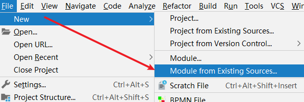
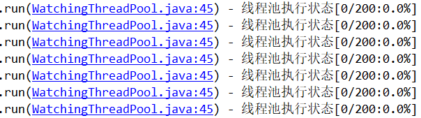
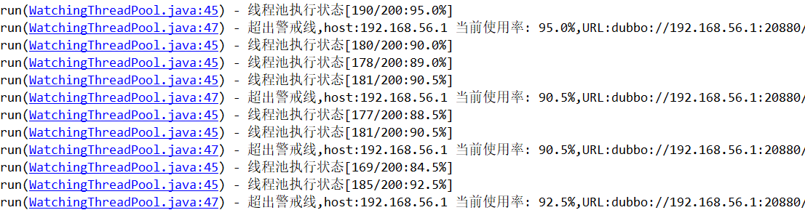

> 第三部分 Dubbo高级实战

# 1 SPI

[Dubbo SPI 的实现原理和实现细节-官网说明](https://dubbo.apache.org/zh/docsv2.7/dev/source/dubbo-spi/)

## 1.1 SPI 简介

SPI 全称（Service Provider Interface），是 JDK 内置的一种服务提供发现机制。目前有不少框架用它来做服务的扩展发现。简单说，它就是一种动态替换发现机制。使用 SPI 机制的优势是实现解耦，使得第三方服务模块的装配控制逻辑与调用者的业务代码分离。

## 1.2 JDK 中的 SPI


Java 中如给想要使用 SPI 功能，先提供标准服务接口，然后再提供相关接口实现和调用者。这样就可以通过 SPI 机制中约定好的信息进行查询相应的接口实现。

SPI 遵循如下约定：

1. 当服务者提供了接口的一种具体实现后，在 META-INF/services 目录下创建一个以 ”接口全限定名“ 为命名的文件，内容为实现类的全限定名。
2. 接口实现类所在的 jar 包放在主程序的 classpath 中。
3. 主程序通过 java.util.ServiceLoader 动态装载实现模块，它通过扫描 META-INF/services 目录下的配置文件找到实现类的全限定名，把类加载到 JVM。
4. SPI 的实现类必须携带一个无参构造方法。

### 1.2.1 JDK SPI demo

使用 maven 父工程统一管理。包括三个模块：API、impl、main。[源码地址](https://gitee.com/turboYuu/dubbo/tree/master/lab/spi/java_spi_demo)


#### 1.2.1.1 API 模块

1. 定义 maven

   ```xml
    <parent>
        <artifactId>java_spi_demo</artifactId>
        <groupId>com.turbo</groupId>
        <version>1.0-SNAPSHOT</version>
   </parent>
   <modelVersion>4.0.0</modelVersion>
   
   <artifactId>java_spi_demo_api</artifactId>
   ```

2. 定义接口，只是写一个基本的方法

   ```java
   package com.turbo.service;
   
   public interface HelloService {
       String sayHello();
   }
   ```


#### 1.2.1.2 创建接口实现者

1. 引入 API 模块

   ```xml
   <dependency>
       <groupId>com.turbo</groupId>
       <artifactId>java_spi_demo_api</artifactId>
       <version>1.0-SNAPSHOT</version>
   </dependency>
   ```

2. 编写实现类

   ```java
   package com.turbo.service.impl;
   
   import com.turbo.service.HelloService;
   
   public class HumanHelloService implements HelloService {
       public String sayHello() {
           return "hello:你好！";
       }
   }
   ```

   ```java
   public class DogHelloService implements HelloService {
       public String sayHello() {
           return "hello:wangWang";
       }
   }
   ```

3. 在 META-INF/services 下创建文件

   

   文件名为 接口的全限定名，内容为 实现类的全限定名。

   ```xml
   com.turbo.service.impl.DogHelloService
   com.turbo.service.impl.HumanHelloService
   ```


#### 1.2.1.3 main 使用模块

1. 引入 API、impl 模块

   ```xml
   <dependency>
               <groupId>com.turbo</groupId>
               <artifactId>java_spi_demo_api</artifactId>
               <version>1.0-SNAPSHOT</version>
           </dependency>
           <dependency>
               <groupId>com.turbo</groupId>
               <artifactId>java_spi_demo_impl</artifactId>
               <version>1.0-SNAPSHOT</version>
           </dependency>
   ```

2. 测试

   ```java
   package com.turbo.test;
   
   import com.turbo.service.HelloService;
   import java.util.ServiceLoader;
   
   public class JavaSPIMain {
   
       public static void main(String[] args) {
           final ServiceLoader<HelloService> helloServices = ServiceLoader.load(HelloService.class);
           for(HelloService helloService:helloServices){
               System.out.println(helloService.getClass().getName()+":"+helloService.sayHello());
           }
       }
   }
   
   ```

结果：


## 1.3 Dubbo 中的 SPI

dubbo 中大量使用了 SPI 来作为扩展点，通过实现同一接口的前提下，可以进行定制自己的实现类。比如比较常见的协议，负载均衡，都可以通过 SPI 的方式进行定制化，自己扩展。

Dubbo 中已经存在的所有已经实现好的扩展点：


下图中则是 Dubbo 中默认提供的负载均衡策略：


### 1.3.1 dubbo 自己做 SPI 的目的

[官网参考](https://dubbo.apache.org/zh/docs/v2.7/dev/spi/#%E6%89%A9%E5%B1%95%E7%82%B9%E9%85%8D%E7%BD%AE)

1. JDK 标准的 SPI 会一次性实例化扩展点所有实例，如果有扩展实现初始化很耗时，结果没有用上也加载，会很浪费资源。
2. 如果有扩展点加载失败，则所有扩展点无法使用。
3. 提供了对扩展点包装的功能（Adaptive），并且还支持通过 set 的方式对其他的扩展点进行注入。

## 1.4 Dubbo 中扩展点使用方式

使用三个项目来演示 Dubbo 中扩展点的使用方式，一个主项目 main，一个服务接口项目 api，一个服务实现项目 impl。使用一个 maven 父工程来管理。[源码地址](https://gitee.com/turboYuu/dubbo/tree/master/lab/spi/dubbo_spi_demo)


### 1.4.1 api 项目创建

1. 导入 dubbo 坐标

   ```xml
   <dependency>
       <groupId>org.apache.dubbo</groupId>
       <artifactId>dubbo</artifactId>
       <version>2.7.6</version>
   </dependency>
   ```

2. 创建接口，在接口上使用 `@SPI`

   ```java
   @SPI("dog")
   public interface HelloService {
       String sayHello();
   }
   ```

   

### 1.4.2 impl 项目创建

1. 导入 api 项目的依赖

   ```xml
   <dependency>
       <groupId>com.turbo</groupId>
       <artifactId>dubbo_spi_demo_api</artifactId>
       <version>1.0-SNAPSHOT</version>
   </dependency>
   ```

2. 建立实现类，为了表达支持多个实现的目的，这里分别创建两个实现类。

   ```java
   public class HumanHelloService implements HelloService {
       public String sayHello() {
           return "hello:你好";
       }
   }
   ```

   ```java
   public class DogHelloService implements HelloService {
       public String sayHello() {
           return "hello:wang Wang";
       }
   }
   ```

3. SPI 进行声明操作，在 `resources` 目录下创建目录 `META-INF/dubbo` 目录，在目录下创建名称为 ”接口全限定名“ ，文件内容为 两个实现类名称 和 对应的全限定名。

   

   ```xml
   human=com.turbo.service.impl.HumanHelloService
   dog=com.turbo.service.impl.DogHelloService
   ```

   

### 1.4.3 main 项目创建

1. 引入 api、impl 项目依赖

   ```xml
   <dependency>
       <groupId>com.turbo</groupId>
       <artifactId>dubbo_spi_demo_api</artifactId>
       <version>1.0-SNAPSHOT</version>
   </dependency>
   <dependency>
       <groupId>com.turbo</groupId>
       <artifactId>dubbo_spi_demo_impl</artifactId>
       <version>1.0-SNAPSHOT</version>
   </dependency>
   ```

2. 创建 DubboSpiMain

   和原先调用的方式不太相同，dubbo 有对其进行自我重新实现，需要借助 org.apache.dubbo.common.extension.ExtensionLoader，创建新的运行项目。这里 demo 中的示例 和 java 中的功能相同，查询出所有的已知实现，并且调用。

   ```java
   package com.turbo;
   
   import com.turbo.service.HelloService;
   import org.apache.dubbo.common.extension.ExtensionLoader;
   
   import java.util.Set;
   
   public class DubboSPIMain {
   
       public static void main(String[] args) {
           // 获取扩展加载器
           ExtensionLoader<HelloService> extensionLoader = ExtensionLoader.getExtensionLoader(HelloService.class);
           // 遍历所有的支持的扩展点 META-INF.dubbo
           Set<String> extensions = extensionLoader.getSupportedExtensions();
           for(String extension:extensions){
               String hello = extensionLoader.getExtension(extension).sayHello();
               System.out.println(hello);
           }
       }
   }
   ```


## 1.5 Dubbo SPI 中的 Adaptive 功能

[扩展点自适应](https://dubbo.apache.org/zh/docs/v2.7/dev/spi/#%E6%89%A9%E5%B1%95%E7%82%B9%E8%87%AA%E9%80%82%E5%BA%94)

Dubbo 中的 Adaptive 功能，主要解决的问题是如何动态的选择具体的扩展点。通过 `getAdaptiveExtension` 统一对指定接口对应的所有扩展点进行封装，通过 URL 的方式对扩展点来进行动态选择。（dubbo中所有的注册信息都是通过 URL 的形式进行处理的）这里同样采用相同的方式进行实现。

1. 创建接口

   api 模块中的 `HelloService` 扩展如下方法，与原先类似，在 sayHello 中增加 `@Adaptive` 注解，并且在参数中提供 URL 参数，注意这里的 URL参数的类为 `org.apache.dubbo.common.URL`，其中 `@SPI` 可以指定一个字符串参数，用于指明该 SPI 的默认实现。

   ```java
   @SPI("dog")
   public interface HelloService {
       @Adaptive
       String sayHello(URL url);
   }
   ```

   

2. 创建实现类

   与上面 Service 实现类代码相似，只需增加 URL 形参即可。

   ```java
   public class DogHelloService implements HelloService {
       public String sayHello(URL url) {
           return "hello:wang Wang url";
       }
   }
   ```

   ```java
   public class HumanHelloService implements HelloService {
       public String sayHello(URL url) {
           return "hello url";
       }
   }
   ```

   

3. 编写DubboAdaptiveMain

   最后在获取的时候方式有所改变，需要传入 URL 参数，并且在参数中指定具体的实现类参数。

   如：

   ```java
   public class DubboAdaptiveMain {
       public static void main(String[] args) {
           URL url = URL.valueOf("test://localhost?hello.service=dog");
           HelloService helloService = ExtensionLoader.getExtensionLoader(HelloService.class).getAdaptiveExtension();
           String hello = helloService.sayHello(url);
           System.out.println(hello);
       }
   }
   ```


注意：

- 因为这里只是临时测试，所以为了保证 URL 规范，前面的信息均为测试值即可，关键的点在于 `hello.service`  参数，这个参数的指指定的就是具体的实现方式，关于为什么叫 `hello.service` 是因为这个接口的名称，其中后面的大写部分被 dubbo 自动转码为 `.` 分割。
- 通过 `getAdaptiveExtension` 来提供一个统一的类来对所有的扩展点提供者支持（底层对所有的扩展点进行封装）。
- 调用时通过参数中增加 `URL` 对象来实现动态扩展点的使用
- 如果 URL 没有提供该参数，则该方法使用默认在 `SPI` 注解中声明的实现。

## 1.6 Dubbo 调用时拦截操作

[官方说明-调用拦截扩展](https://dubbo.apache.org/zh/docs/v2.7/dev/impls/filter/)

与很多框架一样，Dubbo 也存在拦截（过滤）机制，可以通过该机制在执行目标程序前后执行我们指定的代码。

Dubbo 的 Filter 机制，是专门为服务提供方和服务消费方调用过程进行拦截设计的，每次远程方法执行，该拦截器都会被执行。这样就为开发者提供了非常方便的扩展性，比如为 dubbo 接口实现 ip 白名单功能，监控功能、日志记录等。

步骤：

1. 实现 `org.apache.dubbo.rpc.Filter` 接口。

2. 使用 `org.apache.dubbo.common.extension.Activate` 注解对类进行注册，通过 group 可以指定生产端、消费端。如：

   ```java
   @Activate(group = {CommonConstants.CONSUMER,CommonConstants.PROVIDER})
   ```

3. 计算方法运行时间的代码实现

   ```java
   @Activate(group = {CommonConstants.CONSUMER,CommonConstants.PROVIDER})
   public class DubboInvokeFilter implements Filter {
       public Result invoke(Invoker<?> invoker, Invocation invocation) throws RpcException {
           long startTime = System.currentTimeMillis();
           try {
               Result invoke = invoker.invoke(invocation);
               return invoke;
           } finally {
               System.out.println("invoke time:"+(System.currentTimeMillis()-startTime)+"ms");
           }
       }
   }
   ```

4. 在 `META-INF/dubbo` 中新建 `org.apache.dubbo.rpc.Filter` 文件，并将当前类的全名写入

   

   ```bash
   timeFilter=com.turbo.filter.DubboInvokeFilter
   ```


注意：一般类似于这样的功能都是单独开发依赖的，所以在使用方的项目中只需要引入依赖，在调用接口时，该方法便会自动拦截。




```xml
<dependency>
    <groupId>com.turbo</groupId>
    <artifactId>dubbo_spi_filter</artifactId>
    <version>1.0-SNAPSHOT</version>
</dependency>
```

consumer 测试结果：


# 2 负载均衡策略

## 2.1 负载均衡基本配置

负载均衡（Load Balance），其实就是将请求分摊到多个操作单元上进行执行，从而完成工作任务。

负载均衡策略主要用于客户端存在多个提供者时进行选择某个提供者。

在集群负载均衡时，Dubbo 提供了多种均衡策略（包括 随机、轮询、最少活跃调用数，一致性Hash），缺省为 random 随机调用。

[负载均衡 官方示例](https://dubbo.apache.org/zh/docs/v2.7/user/examples/loadbalance/)

配置负载均衡策略，既可以在服务提供者一方配置，也可以在服务消费者一方配置，如下：

```java
// 在服务消费者以访配置负载均衡策略
@Reference(loadbalance = "random",check = false)
private HelloService helloService;
```

```java
// 在服务提供者一方配置负载均衡
@Service(loadbalance = "random")
public class HelloServiceImpl implements HelloService {
    @Override
    public String sayHello(String name) {
        return "Hello2:"+name;
    }
}
```


## 2.2 自定义负载均衡器

[官方说明-负载均衡扩展](https://dubbo.apache.org/zh/docs/v2.7/dev/impls/load-balance/)

负载均衡器在 Dubbo 中的 SPI 接口是 `org.apache.dubbo.rpc.cluster.LoadBalance`，可以通过实现这个接口来实现自定义的负载均衡策略规则。


1. 自定义负载均衡器

   在上一节的案例基础上创建名称为 dubbo-spi-loadbalance 的 maven 模块，并创建负载均衡器 `OnlyFirstLoadbalancer`。这里只是简单的选取所有机器中的第一个（按照字母排序 + 端口排序）。

   ```xml
   <!--不要忘记引入 dubbo-->
   <dependency>
       <groupId>org.apache.dubbo</groupId>
       <artifactId>dubbo</artifactId>
   </dependency>
   ```

   ```java
   public class OnlyFirstLoadbalancer implements LoadBalance {
       /**
        * 这里功能只是简单的选取所有机器中的第一个(按照字母排序 + 端口排序)
        * @param list 服务提供者
        * @param url
        * @param invocation
        * @param <T>
        * @return
        * @throws RpcException
        */
       @Override
       public <T> Invoker<T> select(List<Invoker<T>> list, URL url, Invocation invocation) throws RpcException {
           // 所有服务提供者 ip+端口 排序 选择第一个
           return list.stream().sorted((i1, i2) -> {
               final int ipCompare = i1.getUrl().getIp().compareTo(i2.getUrl().getIp());
               if (ipCompare == 0) {
                   return Integer.compare(i1.getUrl().getPort(), i2.getUrl().getPort());
               }
               return ipCompare;
           }).findFirst().get();
       }
   }
   ```

   

2. 配置负载均衡器

   在 dubbo-spi-loadbalancer 工程的 `META-INF/dubbo`  目录下新建 `org.apache.dubbo.rpc.cluster.LoadBalance` 文件，并将当前类的全名写入：

   ```bash
   onlyFirst=com.turbo.loadbalance.OnlyFirstLoadbalancer
   ```

   

3. 在服务提供者工程实现类中编写用于测试负载均衡效果的方法，启动不同端口是，方法返回的信息不同。

4. 启动多个服务，要求它们使用同一个接口注册到同一个注册中心，但是它们的 dubbo 通信端口不同。

   这里只是增加几个启动类和对应的配置文件：

   

5. 在服务消费方指定自定义负载均衡器 `onlyFirst`

   ```java
   @Component
   public class ConsumerComponet {
   
       /**
        * 引用dubbo的组件  @Reference
        *
        * loadbalance (负载均衡策略)  random 随机 roundrobin 轮询  leastactive 最少活跃调用数  consistenthash 一致性 Hash
        * onlyFirst
        */
       @Reference(loadbalance = "onlyFirst")
       private HelloService helloService;
   
       public String sayHello(String name){
           return helloService.sayHello(name);
       }
   }
   ```

   

6. 测试自定义负载均衡的效果

   

   

# 3 异步调用

[官网说明-异步调用](https://dubbo.apache.org/zh/docs/v2.7/user/examples/async-call/)


Dubbo 不只提供了阻塞式的同步调用，同时提供了异步调用的方式。这种方式主要应用于提供者接口响应耗时明显，消费者端可以利用调用接口的时间去做一些其他的接口调用，利用 `Future` 模式来异步等待 和 获取结果即可。这种方式可以大大的提升消费者端的利用率。目前这种方式可以通过 **XML** 和 **注解**  的方式引入。

## 3.1 异步调用实现

1. 为了能够模拟等待，通过 int timeToWait 参数，标明需要休眠多少毫秒后才返回。

   ```java
   public interface HelloService {
       String sayHello(String name,int timeToWait);
   }
   ```

2. 接口实现，为了模拟调用耗时，可以让线程等待一段时间

   ```java
   @Service
   public class HelloServiceImpl implements HelloService {
       @Override
       public String sayHello(String name, int timeToWait) {
           try {
               Thread.sleep(timeToWait);
           } catch (InterruptedException e) {
               e.printStackTrace();
           }
           return "Hello:"+name;
       }
   }
   ```

3. 在消费者端，配置异步调用，注意消费端默认超时时间 1000 ms，如果提供端耗时大于 1000ms 会出现超时。

   可以改变消费端的超时时间，通过 timeout 属性设置即可（单位 毫秒）

   

   ```xml
   <dubbo:reference id="helloService" interface="com.turbo.service.HelloService">
       <dubbo:method name="sayHello" async="true"/>
   </dubbo:reference>
   ```

4. 测试，休眠 100 ms，然后再去进行获取结果。方法在同步调用时的返回值是 空。可以通过 `RpcContext.getContext().getFuture()` 来进行获取 Future 对象来进行后续的结果等待操作。

   ```java
   public class XMLConsumerMain {
   
       public static void main(String[] args) throws IOException {
           ClassPathXmlApplicationContext context = new ClassPathXmlApplicationContext("classpath:consumer.xml");
           HelloService service = context.getBean(HelloService.class);
           while (true){
               System.in.read();
               try{
                   String world = service.sayHello("world",100);
                   // 使用Future模式 获取异步调用结果
                   Future<Object> future = RpcContext.getContext().getFuture();
   
                   System.out.println("result:"+world);
                   System.out.println("future result:"+future.get());
               }catch (Exception e){
                   e.printStackTrace();
               }
           }
       }
   }
   ```

   


## 3.2 异步调用特殊说明

需要特别说明的是，该方法的使用，请确保 dubbo 的版本在 2.5.4 及以后的版本使用。原因在于 2.5.3 及之前的版本使用的时候，会出现异步状态传递问题。

比如我们的服务调用关系是 `A-> B -> C`，这时候如果 A 向 B 发起了异步请求，在错误的版本时，B 向 C 发起的请求也会连带的产生异步请求，这是因为在底层实现层面，它是通过 `RPCContext` 中的 `attachment` 实现的。在 A 向 B 发起异步请求时，会在 `attachment` 中增加一个异步标识字段来标明异步等待结果。B 在接受到 A 中的请求时，会通过该字段来判断是否是异步处理。但是由于值传递问题，B 向 C 发起时同样会将该值进行传递，导致 C 误以为需要异步结果，导致返回空。这个问题在 2.5.4 及以后的版本[进行了修正](https://github.com/apache/dubbo/blob/47ee52d122fb6f0462ed99530cfe462c591feac8/dubbo-rpc/dubbo-rpc-api/src/main/java/org/apache/dubbo/rpc/filter/ContextFilter.java#L70-L71)。

# 4 线程池

[dubbo线程模型-官网说明](https://dubbo.apache.org/zh/docsv2.7/user/examples/thread-model/)

## 4.1 Dubbo 已有线程池

dubbo 在使用时，都是通过创建真实的业务线程池进行操作的。目前已知的线程池模型有两个和 java 中的相互对应：

1. fix：表示创建固定大小的线程池。也就是 Dubbo 默认的使用方式，默认创建的执行线程数为 200，并且是没有任何等待队列的。所以在极端的情况下可能会存在问题，比如某个操作大量执行时，可能存在阻塞的情况。后面会讲相关的处理办法。
2. cache：创建非固定大小的线程池，当线程不足时，会自动创建新的线程。但是使用这种的时候需要注意，如果突然有高 TPS（TransactionsPerSecond） 的请求过来，方法没有及时完成，则会造成大量的线程创建，对系统的 CPU 和 负载都是压力，执行越多反而会拖慢整个系统。

## 4.2 自定义线程池

在真实的使用过程中可能会因为使用 fix 模式的线程池，导致具体某些业务场景因为线程池中的线程数量不足而产生错误，而很多业务研发是对这些无感知的，只有当出现错误的时候才会去查看警告或者通过客户反馈出现严重的问题才去查看，结果发现时线程池满了。所以可以在创建线程池时，通过某些手段对这个线程池进行监控，这样就可以进行及时的扩容机器 或者 告警。下面的这个程序就是这样子的，会在创建线程池后对其进行监控，并且及时做出相应的处理。

[线程池扩展-官方说明](https://dubbo.apache.org/zh/docsv2.7/dev/impls/threadpool/)

1. 线程池实现，这里主要是对 `FixedThreadPool` 的实现做扩展，扩展出线程监控的部分（在 base-demo的基础上增加模块）

   ```java
   public class WatchingThreadPool extends FixedThreadPool implements Runnable {
   
       private static final Logger LOGGER = LoggerFactory.getLogger(WatchingThreadPool.class);
       // 定义线程池使用的阀值
       private static final double ALARM_PERCENT = 0.90;
       // 线程池存储对象
       private final Map<URL, ThreadPoolExecutor> THREAD_POOLS = new ConcurrentHashMap<>();
   
       public WatchingThreadPool() {
           // 每隔3s打印线程使用情况
           Executors.newSingleThreadScheduledExecutor().scheduleWithFixedDelay(this,1,3, TimeUnit.SECONDS);
       }
   
       // 通过父类创建线程池
       @Override
       public Executor getExecutor(URL url) {
           final Executor executor = super.getExecutor(url);
           if(executor instanceof ThreadPoolExecutor){
               THREAD_POOLS.put(url, (ThreadPoolExecutor) executor);
           }
           return executor;
       }
   
       @Override
       public void run() {
           // 遍历线程池
           for(Map.Entry<URL,ThreadPoolExecutor> entry:THREAD_POOLS.entrySet()){
               final URL url = entry.getKey();
               final ThreadPoolExecutor executor = entry.getValue();
               // 计算相关指标
               final int activeCount = executor.getActiveCount();
               final int poolSize = executor.getCorePoolSize();
               double usedPrecent = activeCount/(poolSize*1.0) ;
   
               LOGGER.info("线程池执行状态[{}/{}:{}%]",activeCount,poolSize,usedPrecent*100);
               if(usedPrecent > ALARM_PERCENT){
                   LOGGER.error("超出警戒线,host:{} 当前使用率: {}%,URL:{}",url.getIp(),usedPrecent*100,url);
               }
           }
       }
   }
   
   ```

2. SPI 声明，创建文件 `META-INF/dubbo/org.apache.dubbo.common.threadpool.ThreadPool`

   ```bash
   watching=com.turbo.threadpool.WatchingThreadPool
   ```

3. 在服务提供方项目中引入该依赖

   ```xml
   <dependency>
       <groupId>com.turbo</groupId>
       <artifactId>dubbo_spi_threadpool</artifactId>
       <version>1.0-SNAPSHOT</version>
   </dependency>
   ```

4. 在服务提供方项目中设置使用该线程池生成器

   ```properties
   dubbo.provider.threadpool=watching
   ```

5. 接下来需要做的就是模拟整个流程，因为该线程当前是每1秒抓一次数据，所以我们需要对该方法的提供者超过1秒的时间（比如这里用休眠 `Thread.sleep`），消费者则需要启动多个线程来并行执行，来模拟整个并发情况。

   ```java
   @Service
   public class HelloServiceImpl implements HelloService {
       @Override
       public String sayHello(String name) {
           try {
               TimeUnit.SECONDS.sleep(1);
           } catch (InterruptedException e) {
               e.printStackTrace();
           }
           return "Hello:"+name;
       }
   }
   ```

   启动服务提供端：

   

6. 在调用方则尝试简单通过 for 循环启动多个线程来执行，查看服务提供方的监控情况。

   ```java
   for (int i=0;i<1000;i++){
       Thread.sleep(5);
       new Thread(new Runnable() {
           @Override
           public void run() {
               String world = service.sayHello("world");
               System.out.println(world);
           }
       }).start();
   }
   ```

   


# 5 路由规则

路由是决定一次请求中需要发往目标机器的重要判断，通过对其控制可以决定请求的目标机器。我们可以通过创建这样的规则来决定一个请求会交给哪些服务器去处理。

[旧路由规则-官网说明](https://dubbo.apache.org/zh/docsv2.7/user/examples/routing-rule-deprecated/)

[路由规则-官网说明](https://dubbo.apache.org/zh/docsv2.7/user/examples/routing-rule/)

## 5.1 路由规则快速入门

旧版路由规则入门

1. 提供两个提供者（一台本机作为提供者，一台为其他的服务器），每个提供者会在调用时可以返回不同的信息，以区分提供者。

2. 针对于消费者，这里通过一个死循环，每次等待用户输入，再进行调用，来模拟真实的请求。

   通过调用的返回值，确认具体的提供者。

3. 通过ipconfig来查询到我们的IP地址，并且单独启动一个客户端。来进行如下配置（这里假设我们希望隔离掉本机的请求，都发送到另外一台机器上）。

   ```java
   // 在消费端怎加路由规则
   public class DubboRouterMain {
   
       public static void main(String[] args) {
           //注册中心的工厂对象
           RegistryFactory registryFactory = ExtensionLoader.getExtensionLoader(RegistryFactory.class).getAdaptiveExtension();
           // 获取注册中心
           Registry registry = registryFactory.getRegistry(URL.valueOf("zookeeper://152.136.177.192:2181"));
           // 路由规则
           registry.register(URL.valueOf("condition://0.0.0.0/com.turbo.service.HelloService?category=router&force=true" +
                   "&dynamic=true&rule="+URL.encode("=>host!=134.134.2.124")));
       }
   }
   ```

4. 通过这个程序执行后，我们就通过消费端不停的发起请求，看到真实的请求都发到了出去本机意外的另外一台机器上。

## 5.2 路由规则详解

[旧路由规则-官网说明](https://dubbo.apache.org/zh/docsv2.7/user/examples/routing-rule-deprecated/)

## 5.3 路由与上线系统结合

当公司到了一定的规模之后，一般都会有自己的上线系统，专门用于服务上线。方便后期进行维护和记录的追查。我们去想象这样的一个场景，一个 dubbo 的提供者要准备进行上线，一般都会提供多台提供者来同时在线上提供服务。

这时候一个请求刚到达一个提供者，提供者却进行关闭操作。那么此次请求就应该认定为失败了。

所以基于这样的场景，我们可以通过路由规则，把预发布（灰度）的机器进行从机器列表中移除。并且等待一定的时间，让其把现有的请求处理完成之后再进行关闭服务。同时，在启动时，同样需要等待一定的时间，以免因为尚未重启完成，就已经注册上去。等启动到达一定时间之后，再进行开启流量操作。

### 5.3.1 实现主题思路

[路由扩展-官网说明](https://dubbo.apache.org/zh/docsv2.7/dev/impls/router/)

```xml
1. 利用 zookeeper 的路径感知能力，在服务准备重启之前将当前机器的IP地址和应用名写入zookeeper。
2. 服务消费者监听该目录，读取其中需要进行关闭的应用名和机器IP列表，并且保存到内存中。
3. 当请求过来时，判断是否是请求该应用，如果是请求重启应用，则将该提供者从服务列表中移除。
```


1. 新建模块，引入 `Curator`，用于方便操作 zookeeper

   ```xml
   <dependency>
       <groupId>org.apache.curator</groupId>
       <artifactId>curator-recipes</artifactId>
       <version>4.0.1</version>
   </dependency>
   <dependency>
       <groupId>org.apache.dubbo</groupId>
       <artifactId>dubbo</artifactId>
   </dependency>
   ```

2. 编写 Zookeeper 的操作类，用于方便进行 zookeeper 处理

   ```java
   public class ZookeeperClients {
   
       private final CuratorFramework client;
   
       private static ZookeeperClients INSTANCE;
   
       static {
           RetryPolicy retryPolicy = new ExponentialBackoffRetry(1000,3);
           CuratorFramework client = CuratorFrameworkFactory.newClient("152.136.177.192:2181",retryPolicy);
           INSTANCE = new ZookeeperClients(client);
           client.start();
       }
   
       private ZookeeperClients(CuratorFramework client) {
           this.client = client;
       }
   
       public static CuratorFramework client(){
           return INSTANCE.client;
       }
   }
   ```

3. 编写需要进行预发布的路径管理器，用于缓存和监听所有的待灰度机器信息列表

   ```java
   public class ReadyRestartInstances implements PathChildrenCacheListener {
   
       private static final Logger LOGGER = LoggerFactory.getLogger(ReadyRestartInstances.class);
       private static final String LISTEN_PATHS = "/turbo/dubbo/restart/instances";
       private final CuratorFramework zkClient;
       // 当节点变化时 给这个结合赋值 重启机器的信息列表
       private volatile Set<String> restartInstances = new HashSet<>();
   
       private ReadyRestartInstances(CuratorFramework zkClient) {
           this.zkClient = zkClient;
       }
   
       public static ReadyRestartInstances create(){
           final CuratorFramework zookeeperClient = ZookeeperClients.client();
           // 监听路径是否存在
           try {
               final Stat stat = zookeeperClient.checkExists().forPath(LISTEN_PATHS);
               // 如果监听路径不存在
               if(stat == null){
                   zookeeperClient.create().creatingParentsIfNeeded().forPath(LISTEN_PATHS);
               }
           } catch (Exception e) {
               e.printStackTrace();
               LOGGER.error("确保基础路径存在");
           }
           final  ReadyRestartInstances instances = new ReadyRestartInstances(zookeeperClient);
           // 创建一个节点缓存对象 NodeCache
           PathChildrenCache nodeCache = new PathChildrenCache(zookeeperClient,LISTEN_PATHS,false);
           // 给节点缓存对象加入监听
           nodeCache.getListenable().addListener(instances);
           try {
               nodeCache.start();
           } catch (Exception e) {
               e.printStackTrace();
               LOGGER.error("启动路径监听失败");
           }
           return instances;
   
       }
       /**
        * 返回应用名 和 主机拼接后的字符串
        */
       private String buildApplicationAndInstanceStr(String applicationName,String host){
           return applicationName + "_" +host;
       }
   
       /** 增加重启实例的配置信息方法*/
       public void addRestartingInstance(String applicationName,String host) throws Exception {
           zkClient.create().creatingParentsIfNeeded().forPath(LISTEN_PATHS+"/"+buildApplicationAndInstanceStr(applicationName,host));
       }
   
       /** 删除重启实例的配置信息方法*/
       public void removeRestartingInstance(String applicationName,String host) throws Exception {
           zkClient.delete().forPath(LISTEN_PATHS+"/"+buildApplicationAndInstanceStr(applicationName,host));
       }
   
       /**判断节点信是否存在于 restartInstances*/
       public boolean hasRestartingInstances(String application,String host){
           return restartInstances.contains(buildApplicationAndInstanceStr(application,host));
       }
   
       @Override
       public void childEvent(CuratorFramework curatorFramework, PathChildrenCacheEvent pathChildrenCacheEvent) throws Exception {
           // 查询出监听路径下所有的目录配置信息
           final List<String> restartingInstances = zkClient.getChildren().forPath(LISTEN_PATHS);
           // 给restartInstances赋值
           if(CollectionUtils.isEmpty(restartingInstances)){
               this.restartInstances = Collections.emptySet();
           }else {
               this.restartInstances = new HashSet<>(restartingInstances);
           }
   
       }
   }
   ```

4. 编写路由类（实现 `org.apache.dubbo.rpc.cluster.Router`），主要目的在于对 `ReadyRestartInstances` 中的数据进行处理，并且移除路由调用列表中正在重启中的服务。

   ```java
   public class RestartingInstanceRouter implements Router {
   
       private final ReadyRestartInstances instances;
       private final URL url;
   
       public RestartingInstanceRouter(URL url) {
           this.url = url;
           this.instances = ReadyRestartInstances.create();
       }
   
       @Override
       public URL getUrl() {
           return null;
       }
   
       @Override
       public <T> List<Invoker<T>> route(List<Invoker<T>> invokers, URL url, Invocation invocation) throws RpcException {
           // 如果没有在重启列表中，才会加入到后续调用列表中
           return invokers.stream().filter(i->!instances.hasRestartingInstances(i.getUrl().getParameter("remote.application"),i.getUrl().getIp()))
                   .collect(Collectors.toList());
       }
   
       @Override
       public boolean isRuntime() {
           return false;
       }
   
       @Override
       public boolean isForce() {
           return false;
       }
   
       @Override
       public int getPriority() {
           return 0;
       }
   }
   ```

5. 由于 `Router` 机制比较特殊，所以需要利用一个专门的 `RouterFactory` 来生成，原因在于并不是所有的都需要添加路由，所以需要利用 `@Activate` 来锁定具体哪些服务才需要生成使用。

   ```java
   @Activate
   public class RestartingInstanceRouterFactory implements RouterFactory {
       @Override
       public Router getRouter(URL url) {
           return new RestartingInstanceRouter(url);
       }
   }
   ```

6. 对 `RouterFactory` 进行注册，同样放到 `META-INF/dubbo/org.a pache.dubbo.rpc.cluster.RouterFactory` 文件中。

   ```bash
   restartInstances=com.turbo.router.RestartingInstanceRouterFactory
   ```

7. 将 dubbo-spi-router 项目引入至 `consumer` 项目的依赖中。

   ```xml
   <dependency>
       <groupId>com.turbo</groupId>
       <artifactId>dubbo_spi_router</artifactId>
       <version>1.0-SNAPSHOT</version>
   </dependency>
   ```

   

8. 这时直接启动程序，还是利用上面中写好的 `consumer` 程序进行执行，确认各个 `provider` 可以正常执行。

9. 单独写一个 `main` 函数来进行将某实例 设置为启动中的状态，比如我们认定当前这台机器中的 `service-provider` 这个提供者需要进行重启操作。

   ```java
   // 在 consumer 模块中
   public class ServerRestartMain {
       public static void main(String[] args) throws Exception {
           ReadyRestartInstances.create().addRestartingInstance("service-provider","192.168.31.137");
       }
   }
   ```

10. 执行完成后，再次进行尝试通过 `consumer` 进行调用，即可看到当前这台机器没有再接收任何请求。

11. 一般情况下，当机器重启到一定时间后，我们可以再通过 `removeRestartingInstance` 方法对这台机器设定为可以继续执行。

    ```java
    ReadyRestartInstances.create().removeRestartingInstance("service-provider","192.168.31.137");
    ```

    

12. 调用完成后，我们再次通过 `consumer` 去调用，即可看到已经再次恢复当前机器的请求参数。

# 6 服务动态降级

## 6.1 什么是服务降级

服务降级，当服务器压力剧增的情况下，根据当前业务情况及流量对一些服务有策略地降低服务级别，以释放服务器资源，保证核心任务地正常运行。

## 6.2 为什么要服务降级

为什么要使用服务降级，这时防止分布式服务发生雪崩效应，什么是雪崩？就是蝴蝶效应，当一个请求发生超时，一直等待服务响应，那么在高并发情况下，很多请求都是因为这样一直等着响应，知道服务资源耗尽导致宕机，而宕机之后导致分布式其他服务调用该宕机地服务也会出现资源耗尽宕机，这样下去将导致整个分布式服务都瘫痪，这就是雪崩。

## 6.3 dubbo 服务降级实现方式

### 6.3.1 在 dubbo-admin 管理控制台配置服务降级


屏蔽 和 容错

- 屏蔽

  相当于 mock = force:return+null

  表示消费者对该服务的方法调用都直接返回 null 值，不发起远程调用。用来屏蔽不重要服务，不可用时对调用方的影响。

- 容错

  相当于 mock = fail:return+null

  表示消费方对该服务的方法调用在失败后，再返回 null 值，不抛出异常。用来容忍不重要服务不稳定时对调用方的影响。

### 6.3.2 指定返回简单值或者 null

```xml
<dubbo:reference id="xxService" check="false" interface="com.xx.XxService" timeout="3000" mock="return null" />
<dubbo:reference id="xxService2" check="false" interface="com.xx.XxService2" timeout="3000" mock="return 1234" />
```

如果是注解，则使用 `@Reference(mock = "return null")`  @Reference(mock = "return 简单值") 也支持 @Reference(mock = "force:return null")

### 6.3.3 使用 java 代码，动态写入配置中心

```java
RegistryFactory registryFactory = ExtensionLoader.getExtensionLoader(RegistryFactory.class).getAdaptiveExtension();
Registry registry = registryFactory.getRegistry(URL.valueOf("zookeeper://IP:端 口"));
registry.register(URL.valueOf("override://0.0.0.0/com.foo.BarService?category=configurators&dynamic=false&application=foo&mock=force:return+null"));
```

### 6.3.4 整合 hystrix（在后面的 SpringCloud 中讲解）


