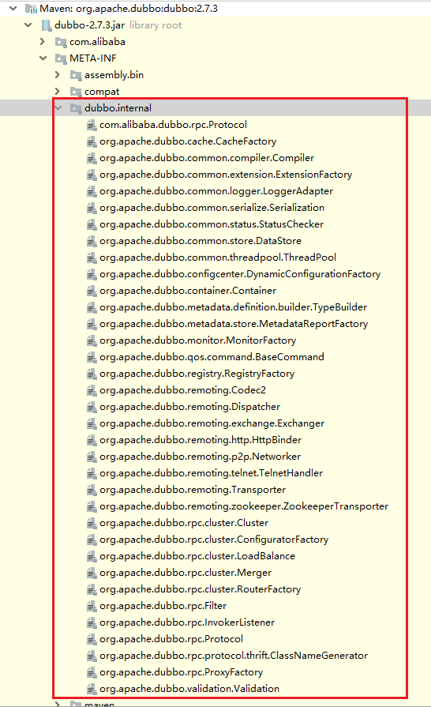

> 第三部分 Dubbo高级实战

# 1 SPI

## 1.1 SPI 简介

SPI 全称（Service Provider Interface），是 JDK 内置的一种服务提供发现机制。目前有不少框架用它来做服务的扩展发现。简单说，它就是一种动态替换发现机制。使用 SPI 机制的优势是实现解耦，使得第三方服务模块的装配控制逻辑与调用者的业务代码分离。

## 1.2 JDK 中的 SPI


Java 中如给想要使用 SPI 功能，先提供标准服务接口，然后再提供相关接口实现和调用者。这样就可以通过 SPI 机制中约定好的信息进行查询相应的接口实现。

SPI 遵循如下约定：

1. 当服务者提供了接口的一种具体实现后，在 META-INF/services 目录下创建一个以 ”接口全限定名“ 为命名的文件，内容为实现类的全限定名。
2. 接口实现类所在的 jar 包放在主程序的 classpath 中。
3. 主程序通过 java.util.ServiceLoader 动态装载实现模块，它通过扫描 META-INF/services 目录下的配置文件找到实现类的全限定名，把类加载到 JVM。
4. SPI 的实现类必须携带一个无参构造方法。

### 1.2.1 JDK SPI demo

使用 maven 父工程统一管理。包括三个模块：API、impl、main。


#### 1.2.1.1 API 模块

1. 定义 maven

   ```xml
    <parent>
        <artifactId>java_spi_demo</artifactId>
        <groupId>com.turbo</groupId>
        <version>1.0-SNAPSHOT</version>
   </parent>
   <modelVersion>4.0.0</modelVersion>
   
   <artifactId>java_spi_demo_api</artifactId>
   ```

2. 定义接口，只是写一个基本的方法

   ```java
   package com.turbo.service;
   
   public interface HelloService {
       String sayHello();
   }
   ```


#### 1.2.1.2 创建接口实现者

1. 引入 API 模块

   ```xml
   <dependency>
       <groupId>com.turbo</groupId>
       <artifactId>java_spi_demo_api</artifactId>
       <version>1.0-SNAPSHOT</version>
   </dependency>
   ```

2. 编写实现类

   ```java
   package com.turbo.service.impl;
   
   import com.turbo.service.HelloService;
   
   public class HumanHelloService implements HelloService {
       public String sayHello() {
           return "hello:你好！";
       }
   }
   ```

   ```java
   public class DogHelloService implements HelloService {
       public String sayHello() {
           return "hello:wangWang";
       }
   }
   ```

3. 在 META-INF/services 下创建文件

   

   文件名为 接口的全限定名，内容为 实现类的全限定名。

   ```xml
   com.turbo.service.impl.DogHelloService
   com.turbo.service.impl.HumanHelloService
   ```


#### 1.2.1.3 main 使用模块

1. 引入 API、impl 模块

   ```xml
   <dependency>
               <groupId>com.turbo</groupId>
               <artifactId>java_spi_demo_api</artifactId>
               <version>1.0-SNAPSHOT</version>
           </dependency>
           <dependency>
               <groupId>com.turbo</groupId>
               <artifactId>java_spi_demo_impl</artifactId>
               <version>1.0-SNAPSHOT</version>
           </dependency>
   ```

2. 测试

   ```java
   package com.turbo.test;
   
   import com.turbo.service.HelloService;
   import java.util.ServiceLoader;
   
   public class JavaSPIMain {
   
       public static void main(String[] args) {
           final ServiceLoader<HelloService> helloServices = ServiceLoader.load(HelloService.class);
           for(HelloService helloService:helloServices){
               System.out.println(helloService.getClass().getName()+":"+helloService.sayHello());
           }
       }
   }
   
   ```

结果：


## 1.3 Dubbo 中的 SPI

dubbo 中大量使用了 SPI 来作为扩展点，通过实现同一接口的前提下，可以进行定制自己的实现类。比如比较常见的协议，负载均衡，都可以通过 SPI 的方式进行定制化，自己扩展。

Dubbo 中已经存在的所有已经实现好的扩展点：




下图中则是 Dubbo 中默认提供的负载均衡策略：


## 1.4 Dubbo 中扩展点使用方式


## 1.5 Dubbo SPI 中的 Adaptive 功能

## 1.6 Dubbo 调用时拦截操作

# 2 负载均衡策略

# 3 异步调用

# 4 线程池

# 5 路由规则

# 6 服务动态降级